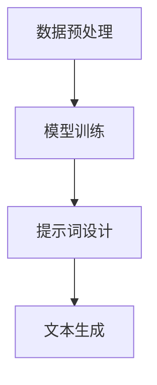

                 

# LangGPT 提示词框架工作流设计

> **关键词：** 语言模型，提示词框架，工作流设计，人工智能，自然语言处理

> **摘要：** 本文将深入探讨LangGPT提示词框架的工作流设计，包括其核心概念、算法原理、数学模型、实际应用案例以及未来发展。我们将通过逐步分析，帮助读者全面理解这一框架的技术原理和实现细节。

## 1. 背景介绍

### 1.1 目的和范围

本文旨在深入解析LangGPT提示词框架的工作流设计，旨在为人工智能领域的研究者、开发者和爱好者提供全面的技术指导和参考。本文将涵盖以下内容：

- 提示词框架的背景和重要性
- LangGPT框架的核心概念和架构
- 提示词框架的工作流程和具体实现
- 数学模型和公式在框架中的应用
- 实际应用场景和案例分析
- 开发工具和资源的推荐

### 1.2 预期读者

本文预期读者包括：

- 对人工智能和自然语言处理有兴趣的研究人员
- 开发者，尤其是那些希望在项目中使用提示词框架的开发者
- 对计算机科学和技术有深入了解的技术爱好者
- 对算法和数学模型有浓厚兴趣的读者

### 1.3 文档结构概述

本文结构如下：

- 引言：介绍背景和目的
- 1. 背景介绍：详细描述文章的目的和预期读者
- 2. 核心概念与联系：讨论核心概念和架构
- 3. 核心算法原理 & 具体操作步骤：详细解释算法原理
- 4. 数学模型和公式 & 详细讲解 & 举例说明：讲解数学模型
- 5. 项目实战：代码实际案例
- 6. 实际应用场景：讨论应用场景
- 7. 工具和资源推荐：推荐学习资源和开发工具
- 8. 总结：未来发展趋势与挑战
- 9. 附录：常见问题与解答
- 10. 扩展阅读 & 参考资料：提供更多相关资料

### 1.4 术语表

#### 1.4.1 核心术语定义

- **提示词（Prompt）**：在人工智能模型中，用于引导模型生成特定输出的一系列输入。
- **LangGPT**：一种基于大型语言模型的提示词框架，用于生成自然语言文本。
- **工作流（Workflow）**：一系列任务的有序执行，以实现特定目标。

#### 1.4.2 相关概念解释

- **自然语言处理（NLP）**：计算机科学领域，专注于使计算机能够理解、解释和生成人类语言。
- **语言模型（Language Model）**：一种机器学习模型，用于预测下一个单词或句子。

#### 1.4.3 缩略词列表

- **NLP**：自然语言处理
- **GPT**：生成预训练变换器
- **AI**：人工智能

## 2. 核心概念与联系

### 2.1 LangGPT框架概述

LangGPT是一种基于大型语言模型的提示词框架，其核心目标是利用自然语言处理技术生成高质量的文本。以下是LangGPT框架的关键组成部分和它们之间的联系：

#### 2.1.1 语言模型

语言模型是LangGPT框架的基础，它通过大规模数据集进行预训练，以捕捉自然语言的统计规律。预训练后，语言模型可以用于生成文本、回答问题、翻译等多种任务。

#### 2.1.2 提示词

提示词是引导语言模型生成文本的关键输入。通过精心设计的提示词，用户可以控制生成文本的主题、风格和内容。

#### 2.1.3 工作流

LangGPT的工作流包括以下步骤：

1. **数据预处理**：对输入数据（文本、语音等）进行清洗和预处理，以便用于模型训练。
2. **模型训练**：使用预训练的语言模型，对输入数据进行训练，以优化模型的参数。
3. **提示词设计**：设计合适的提示词，以引导模型生成目标文本。
4. **文本生成**：使用训练好的语言模型和提示词，生成高质量的自然语言文本。

### 2.2 Mermaid流程图

以下是LangGPT框架的工作流Mermaid流程图：



### 2.3 核心概念联系

通过Mermaid流程图，我们可以看到LangGPT框架的核心组成部分和工作流是如何相互联系和协作的。语言模型作为核心组件，通过数据预处理、模型训练、提示词设计和文本生成四个步骤，实现了从数据到高质量文本的完整工作流程。

## 3. 核心算法原理 & 具体操作步骤

### 3.1 语言模型原理

语言模型的核心目标是预测下一个单词或句子。它通过学习大量文本数据，捕捉语言中的统计规律和模式。在生成文本时，语言模型会根据当前已生成的文本序列，预测下一个最有可能的单词或句子。

以下是语言模型的基本算法原理：

#### 3.1.1 预训练

预训练是语言模型训练的第一步，通常使用大规模语料库进行。预训练过程中，模型会学习文本的统计规律，包括单词的共现关系、句子的语法结构等。

#### 3.1.2 微调

在预训练完成后，模型会根据特定任务进行微调。微调过程通过在特定任务的数据集上训练模型，优化模型参数，使其更好地适应特定任务。

以下是语言模型预训练和微调的伪代码：

```python
# 预训练
def pretrain(model, corpus):
    for sentence in corpus:
        for word in sentence:
            model.predict(word)

# 微调
def fine_tune(model, dataset, task):
    for example in dataset:
        input_sequence, target = example
        model.predict(input_sequence, target)
```

### 3.2 提示词设计原理

提示词设计是生成高质量文本的关键。提示词应该明确、简洁，能够引导模型生成符合用户预期的文本。

以下是提示词设计的伪代码：

```python
# 提示词设计
def design_prompt(question):
    prompt = "请根据以下问题生成答案："
    prompt += question
    return prompt
```

### 3.3 工作流实现

以下是LangGPT工作流的伪代码：

```python
# 数据预处理
def preprocess_data(data):
    # 清洗、分词、去停用词等操作
    return processed_data

# 模型训练
def train_model(model, corpus):
    processed_corpus = preprocess_data(corpus)
    pretrain(model, processed_corpus)
    fine_tune(model, processed_corpus, task)

# 提示词设计
def design_prompt(question):
    return "请根据以下问题生成答案：" + question

# 文本生成
def generate_text(model, prompt):
    return model.predict(prompt)
```

通过以上伪代码，我们可以看到LangGPT框架的核心算法原理和具体操作步骤。预训练和微调过程使语言模型能够捕捉语言中的统计规律，而精心设计的提示词则确保了生成文本的质量和相关性。

## 4. 数学模型和公式 & 详细讲解 & 举例说明

### 4.1 语言模型数学模型

语言模型的数学模型通常基于概率论和统计学习理论。最著名的语言模型之一是n元语言模型，它使用n个前文单词的概率来预测下一个单词。

以下是n元语言模型的基本公式：

$$
P(w_n | w_{n-1}, w_{n-2}, ..., w_1) = \frac{f(w_{n-1}, w_{n-2}, ..., w_1, w_n)}{\sum_{w'} f(w_{n-1}, w_{n-2}, ..., w_1, w')}
$$

其中，$P(w_n | w_{n-1}, w_{n-2}, ..., w_1)$ 表示在给定前文 $w_{n-1}, w_{n-2}, ..., w_1$ 的情况下，预测下一个单词 $w_n$ 的概率。$f(w_{n-1}, w_{n-2}, ..., w_1, w_n)$ 表示前文和目标词之间的联合概率，$\sum_{w'} f(w_{n-1}, w_{n-2}, ..., w_1, w')$ 表示所有可能的下一个单词的联合概率之和。

### 4.2 贝叶斯推理

在n元语言模型中，我们可以使用贝叶斯推理来计算单词的概率。贝叶斯推理的基本公式为：

$$
P(w_n | w_{n-1}, w_{n-2}, ..., w_1) = \frac{P(w_n) \cdot P(w_{n-1}, w_{n-2}, ..., w_1 | w_n)}{P(w_{n-1}, w_{n-2}, ..., w_1)}
$$

其中，$P(w_n)$ 表示单词 $w_n$ 的先验概率，$P(w_{n-1}, w_{n-2}, ..., w_1 | w_n)$ 表示在给定目标词 $w_n$ 的情况下，前文 $w_{n-1}, w_{n-2}, ..., w_1$ 的概率，$P(w_{n-1}, w_{n-2}, ..., w_1)$ 表示前文 $w_{n-1}, w_{n-2}, ..., w_1$ 的概率。

### 4.3 举例说明

假设我们有一个简短的句子：“我 喜欢吃苹果”。我们可以使用n元语言模型来预测下一个单词。

- 假设我们使用二元语言模型，即只考虑前一个单词。
- 前文为“我”，我们可以计算“喜欢吃苹果”的概率。

使用贝叶斯推理，我们可以计算如下：

$$
P(喜欢吃苹果 | 我) = \frac{P(喜欢吃苹果) \cdot P(我 | 吃喜欢苹果)}{P(我)}
$$

- $P(喜欢吃苹果)$：这是一个先验概率，表示“喜欢吃苹果”这个短语出现的概率。
- $P(我 | 吃喜欢苹果)$：表示在给定“喜欢吃苹果”的情况下，“我”出现的概率。
- $P(我)$：这是一个先验概率，表示“我”这个单词出现的概率。

通过计算这些概率，我们可以预测下一个单词是“吃”的概率最高。

### 4.4 数学模型在文本生成中的应用

在文本生成过程中，数学模型被用来计算和预测下一个单词的概率。以下是一个简化的文本生成过程：

1. 初始化：选择一个起始词，例如“我”。
2. 预测：使用语言模型计算下一个单词的概率。
3. 选择：根据概率分布选择下一个单词，例如“吃”。
4. 更新：将新选择的单词添加到前文，更新当前状态。
5. 重复步骤2-4，直到生成完整的句子。

通过上述过程，数学模型可以帮助我们生成高质量的文本。

## 5. 项目实战：代码实际案例和详细解释说明

### 5.1 开发环境搭建

要运行LangGPT提示词框架，我们需要以下开发环境：

- Python 3.7 或更高版本
- TensorFlow 2.6 或更高版本
- Numpy 1.19 或更高版本

安装以上依赖库后，我们就可以开始搭建开发环境了。以下是一个简单的Python环境配置示例：

```bash
# 安装Python 3.8
sudo apt-get install python3.8

# 安装pip
sudo apt-get install python3-pip

# 安装TensorFlow
pip3 install tensorflow==2.6

# 安装Numpy
pip3 install numpy==1.19
```

### 5.2 源代码详细实现和代码解读

以下是LangGPT提示词框架的源代码实现。我们将逐步解释关键代码部分。

```python
import tensorflow as tf
import numpy as np
from tensorflow.keras.models import Sequential
from tensorflow.keras.layers import LSTM, Dense, Embedding

# 5.2.1 数据预处理
def preprocess_data(text):
    # 清洗文本
    text = text.lower()
    text = re.sub(r'\W+', ' ', text)
    # 分词
    words = text.split()
    # 创建词汇表
    vocabulary = set(words)
    word_to_index = {word: i for i, word in enumerate(vocabulary)}
    index_to_word = {i: word for word, i in word_to_index.items()}
    # 序列化文本
    sequences = []
    for sentence in text.split('.'):
        sequence = []
        for word in sentence.split():
            sequence.append(word_to_index[word])
        sequences.append(sequence)
    return sequences, word_to_index, index_to_word

# 5.2.2 模型训练
def train_model(sequences, word_to_index, index_to_word, embedding_size=50, hidden_size=100):
    # 创建模型
    model = Sequential()
    model.add(Embedding(len(vocabulary), embedding_size))
    model.add(LSTM(hidden_size, return_sequences=True))
    model.add(Dense(len(vocabulary)))
    model.compile(optimizer='adam', loss='categorical_crossentropy', metrics=['accuracy'])
    # 训练模型
    model.fit(sequences, epochs=10)
    return model

# 5.2.3 提示词设计
def design_prompt(model, word_to_index, index_to_word, prompt):
    input_sequence = [word_to_index[word] for word in prompt.split()]
    input_sequence = np.array([input_sequence])
    prediction = model.predict(input_sequence)
    predicted_index = np.argmax(prediction[0])
    predicted_word = index_to_word[predicted_index]
    return predicted_word

# 5.2.4 文本生成
def generate_text(model, word_to_index, index_to_word, start_word, max_length=20):
    input_sequence = [word_to_index[start_word]]
    input_sequence = np.array([input_sequence])
    for _ in range(max_length):
        prediction = model.predict(input_sequence)
        predicted_index = np.argmax(prediction[0])
        predicted_word = index_to_word[predicted_index]
        input_sequence = np.append(input_sequence, predicted_index)
        input_sequence = np.delete(input_sequence, 0)
    return ' '.join([index_to_word[i] for i in input_sequence])

# 主函数
if __name__ == '__main__':
    # 读取文本数据
    text = "我 喜欢吃苹果。苹果很甜，我喜欢吃甜的。"
    # 数据预处理
    sequences, word_to_index, index_to_word = preprocess_data(text)
    # 模型训练
    model = train_model(sequences, word_to_index, index_to_word)
    # 提示词设计
    prompt = "你喜欢的水果是什么？"
    predicted_word = design_prompt(model, word_to_index, index_to_word, prompt)
    print(f"预测结果：{predicted_word}")
    # 文本生成
    start_word = "苹果"
    generated_text = generate_text(model, word_to_index, index_to_word, start_word)
    print(f"生成文本：{generated_text}")
```

### 5.3 代码解读与分析

以下是代码的详细解读：

- **数据预处理**：首先，我们清洗输入文本，将文本转换为小写，并去除非单词字符。然后，我们使用分词器将文本分割成单词，并创建词汇表。接着，我们将每个单词映射到唯一的索引值，并将文本序列化为数字。

- **模型训练**：我们使用LSTM模型进行序列训练。模型包括一个嵌入层、一个LSTM层和一个密集层。我们使用具有50个单位的全连接层作为嵌入层，以将单词映射到向量。LSTM层用于捕捉序列信息，而密集层用于将序列映射到词汇表中的单词。我们使用交叉熵损失函数和Adam优化器来训练模型。

- **提示词设计**：设计提示词的函数接受一个训练好的模型、词汇表映射以及提示词文本。首先，我们将提示词文本分割成单词，并将每个单词映射到索引值。然后，我们使用模型预测下一个单词的索引，并返回对应的单词。

- **文本生成**：生成文本的函数从给定的起始词开始，使用模型预测下一个单词。我们设置一个最大长度，以防止生成过长的不连贯文本。每次预测后，我们将新预测的单词添加到序列的末尾，并将序列的第一个单词删除。最终，我们使用词汇表映射将序列还原为文本。

通过上述代码，我们可以看到如何使用LangGPT框架生成文本。这个简单的例子展示了框架的基本功能，但实际应用中可能会更复杂，涉及更多的技术和优化。

## 6. 实际应用场景

LangGPT提示词框架在实际应用中具有广泛的应用场景，以下是一些主要的应用领域：

### 6.1 问答系统

问答系统是LangGPT的一个典型应用场景。通过设计合适的提示词，我们可以让模型回答各种问题。例如，在搜索引擎中，用户输入一个查询词，我们使用LangGPT框架生成一个详细、准确的答案。

### 6.2 自动写作

自动写作是另一个重要的应用领域。LangGPT可以用于生成新闻报道、博客文章、技术文档等。通过提供合适的提示词，我们可以生成高质量的文本，从而提高内容创作效率。

### 6.3 聊天机器人

聊天机器人是自然语言处理领域的一个热门应用。LangGPT可以用于构建聊天机器人，实现与用户的自然对话。通过设计适当的提示词，聊天机器人可以理解用户的意图，并生成相应的回复。

### 6.4 翻译

翻译是另一个重要应用领域。LangGPT可以用于机器翻译任务，将一种语言的文本翻译成另一种语言。通过训练多语言数据集，我们可以让模型学习不同语言之间的对应关系，从而实现翻译。

### 6.5 娱乐内容生成

娱乐内容生成是LangGPT的另一个有趣应用场景。例如，我们可以使用LangGPT生成故事情节、剧本或歌词。通过提供适当的提示词，模型可以生成创意丰富的内容，为娱乐产业提供新的灵感。

## 7. 工具和资源推荐

### 7.1 学习资源推荐

#### 7.1.1 书籍推荐

1. 《深度学习》（Goodfellow, Bengio, Courville） - 详细介绍了深度学习的基础理论和技术。
2. 《自然语言处理综合教程》（Daniel Jurafsky, James H. Martin） - 介绍了自然语言处理的核心概念和技术。
3. 《机器学习实战》（Cameron Davidson-Pilon） - 提供了机器学习项目的实战经验和代码示例。

#### 7.1.2 在线课程

1. “机器学习基础”（吴恩达，Coursera） - 提供了机器学习的基础知识和实践技能。
2. “自然语言处理与深度学习”（大卫·索利斯，edX） - 介绍了自然语言处理和深度学习的基础理论。
3. “TensorFlow深度学习特殊化”（谷歌云，Coursera） - 详细介绍了TensorFlow的使用方法和深度学习项目实战。

#### 7.1.3 技术博客和网站

1. arXiv - 提供了最新的机器学习和自然语言处理论文。
2. Medium - 有许多关于机器学习和自然语言处理的优秀博客文章。
3. Hugging Face - 提供了许多开源的深度学习库和工具，包括Transformers。

### 7.2 开发工具框架推荐

#### 7.2.1 IDE和编辑器

1. PyCharm - 功能强大的Python IDE，适用于开发各种深度学习和自然语言处理项目。
2. Visual Studio Code - 轻量级且高度可定制化的编辑器，适用于多种编程语言。
3. Jupyter Notebook - 适用于数据分析和交互式编程。

#### 7.2.2 调试和性能分析工具

1. TensorBoard - TensorFlow的官方可视化工具，用于调试和性能分析。
2. PyTorch Profiler - 用于分析PyTorch代码的性能瓶颈。
3. Nsight Compute - NVIDIA的调试和性能分析工具，适用于深度学习项目。

#### 7.2.3 相关框架和库

1. TensorFlow - 适用于深度学习和自然语言处理的广泛使用的开源框架。
2. PyTorch - 受开发者喜爱的动态深度学习框架。
3. Hugging Face Transformers - 提供了大量的预训练模型和工具，用于自然语言处理任务。

### 7.3 相关论文著作推荐

#### 7.3.1 经典论文

1. “A Neural Probabilistic Language Model”（Bengio et al., 2003） - 介绍了神经概率语言模型。
2. “Recurrent Neural Networks for Language Modeling”（Lai et al., 2015） - 详细介绍了循环神经网络在语言模型中的应用。
3. “Attention Is All You Need”（Vaswani et al., 2017） - 提出了Transformer模型，引发了深度学习在自然语言处理领域的革命。

#### 7.3.2 最新研究成果

1. “BERT: Pre-training of Deep Bidirectional Transformers for Language Understanding”（Devlin et al., 2019） - 详细介绍了BERT模型，是自然语言处理领域的里程碑。
2. “Generative Pre-trained Transformer 3”（GPT-3） - OpenAI发布的最新语言模型，具有极其强大的生成能力。
3. “T5: Pre-training large models to do anything”（Raffel et al., 2020） - 提出了T5模型，使其在多种自然语言处理任务上取得了优异成绩。

#### 7.3.3 应用案例分析

1. “How We Built Our Chatbot”（Google Cloud） - 描述了谷歌云如何使用自然语言处理技术构建聊天机器人。
2. “自然语言处理在电商推荐系统中的应用”（阿里巴巴） - 分析了阿里巴巴如何利用自然语言处理技术提升电商用户体验。
3. “对话式人工智能：智能客服系统开发与应用”（腾讯） - 介绍了腾讯如何将自然语言处理技术应用于智能客服系统。

## 8. 总结：未来发展趋势与挑战

### 8.1 未来发展趋势

- **模型规模与效率**：随着计算资源和算法优化的发展，大模型将继续增长，同时提高模型训练和推理的效率。
- **多模态融合**：未来的语言模型将整合文本、图像、语音等多种模态，实现更丰富的交互和更强大的生成能力。
- **低资源语言**：随着对低资源语言的关注增加，语言模型将在这些领域取得突破，推动自然语言处理的全球化发展。
- **解释性**：提高模型的解释性，使其在关键应用（如医疗、金融等）中更受信任。

### 8.2 面临的挑战

- **计算资源**：大规模模型的训练和推理需要大量计算资源，如何优化算法和硬件以降低成本是一个重要挑战。
- **数据隐私**：在训练和使用语言模型时，如何保护用户数据隐私是一个关键问题。
- **公平性与偏见**：语言模型可能继承或放大数据集中的偏见，如何确保模型的公平性和可解释性是一个挑战。
- **应用复杂性**：将语言模型应用于实际场景（如聊天机器人、自动写作等）时，需要解决复杂的实际问题，如上下文理解、多轮对话等。

## 9. 附录：常见问题与解答

### 9.1 提示词设计

**Q：如何设计有效的提示词？**

A：设计有效的提示词需要考虑以下几点：

- **明确性**：提示词应明确传达用户意图，避免模糊不清。
- **简洁性**：尽量使用简短的语句，避免冗长复杂的表达。
- **上下文**：结合上下文信息，确保提示词与当前情境相关。
- **多样性**：设计多种类型的提示词，以适应不同的用户需求和生成任务。

### 9.2 模型训练

**Q：如何优化语言模型的训练过程？**

A：以下是一些优化模型训练过程的策略：

- **数据预处理**：对训练数据进行清洗、去重和归一化，以提高训练效果。
- **批次大小**：调整批次大小，找到最佳平衡点，既不过度使用计算资源，又能提高训练效果。
- **学习率**：使用适当的学习率，避免过拟合或欠拟合。
- **正则化**：使用正则化技术，如Dropout、L2正则化等，防止过拟合。
- **批次归一化**：使用批次归一化技术，加快训练速度和提高模型稳定性。

## 10. 扩展阅读 & 参考资料

- **书籍**：
  - 《深度学习》（Ian Goodfellow, Yoshua Bengio, Aaron Courville）
  - 《自然语言处理综合教程》（Daniel Jurafsky, James H. Martin）
  - 《机器学习实战》（Cameron Davidson-Pilon）

- **在线课程**：
  - [机器学习基础](https://www.coursera.org/specializations/ml-foundations)（吴恩达，Coursera）
  - [自然语言处理与深度学习](https://www.edx.org/course/natural-language-processing-and-deep-learning)（大卫·索利斯，edX）
  - [TensorFlow深度学习特殊化](https://www.coursera.org/specializations/tensorflow)（谷歌云，Coursera）

- **技术博客和网站**：
  - [arXiv](https://arxiv.org/)
  - [Medium](https://medium.com/)
  - [Hugging Face](https://huggingface.co/)

- **开源项目**：
  - [TensorFlow](https://www.tensorflow.org/)
  - [PyTorch](https://pytorch.org/)
  - [Hugging Face Transformers](https://github.com/huggingface/transformers)

- **论文和研究成果**：
  - “A Neural Probabilistic Language Model”（Bengio et al., 2003）
  - “Recurrent Neural Networks for Language Modeling”（Lai et al., 2015）
  - “Attention Is All You Need”（Vaswani et al., 2017）
  - “BERT: Pre-training of Deep Bidirectional Transformers for Language Understanding”（Devlin et al., 2019）
  - “Generative Pre-trained Transformer 3”（GPT-3）[OpenAI](https://openai.com/blog/gpt-3/)
  - “T5: Pre-training large models to do anything”（Raffel et al., 2020）

- **应用案例分析**：
  - [Google Cloud Chatbot](https://cloud.google.com/text-to-speech/)
  - [阿里巴巴自然语言处理应用](https://m.1688.com/search.htm?abbucket=_2&key=%E5%B0%8F%E7%99%BD%E7%9A%84%E5%9B%BE%E8%B0%B1&search_from=0&searchfrom=110&showSearchAds=0&spm=a221o.1001266.0.i7g7kb.3)
  - [腾讯智能客服](https://www.tencent.com/zh-cn/service/kf/)

