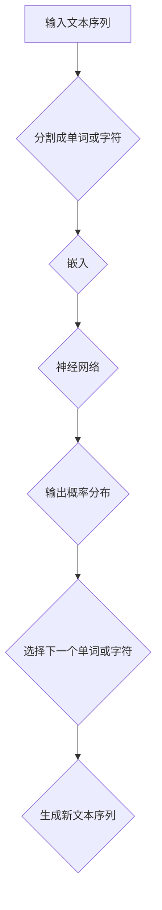

                 

# Language Models 原理与代码实战案例讲解

> **关键词：自然语言处理、语言模型、深度学习、神经网络、代码实战案例**
>
> **摘要：本文深入讲解了语言模型的基本原理、核心算法、数学模型以及在实际应用中的代码实现，适合对自然语言处理和人工智能有一定基础的读者。**

## 1. 背景介绍

### 1.1 目的和范围

本文旨在向读者介绍语言模型的基本原理，并通过代码实战案例展示其实际应用。我们将逐步解析语言模型的工作机制，涵盖从数据预处理到模型训练、预测的全过程，最终实现一个简单的语言模型。

### 1.2 预期读者

本文适合对自然语言处理和人工智能有一定基础的读者，尤其是希望了解语言模型如何工作的程序员和研究人员。

### 1.3 文档结构概述

本文结构如下：

1. **背景介绍**：介绍本文的目的、预期读者和文档结构。
2. **核心概念与联系**：通过Mermaid流程图展示语言模型的基本概念和架构。
3. **核心算法原理 & 具体操作步骤**：讲解语言模型的核心算法原理，使用伪代码详细阐述。
4. **数学模型和公式 & 详细讲解 & 举例说明**：介绍语言模型中的数学模型，使用latex格式详细讲解。
5. **项目实战：代码实际案例和详细解释说明**：通过实战案例展示语言模型的应用。
6. **实际应用场景**：探讨语言模型在不同领域的应用。
7. **工具和资源推荐**：推荐学习资源和开发工具。
8. **总结：未来发展趋势与挑战**：总结语言模型的发展趋势和面临的挑战。
9. **附录：常见问题与解答**：提供常见问题的解答。
10. **扩展阅读 & 参考资料**：推荐相关阅读材料。

### 1.4 术语表

#### 1.4.1 核心术语定义

- **语言模型**：一种数学模型，用于预测文本中下一个单词或字符的概率。
- **自然语言处理（NLP）**：研究如何使计算机理解和解释人类自然语言的技术。
- **深度学习**：一种人工智能分支，通过多层神经网络进行数据建模。
- **神经网络**：一种模仿人脑神经结构的计算模型。

#### 1.4.2 相关概念解释

- **词汇表（Vocabulary）**：语言模型中使用的单词集合。
- **嵌入（Embedding）**：将单词转换为向量表示的方法。
- **损失函数（Loss Function）**：用于衡量模型预测结果与实际结果之间的差距。

#### 1.4.3 缩略词列表

- **NLP**：自然语言处理（Natural Language Processing）
- **DL**：深度学习（Deep Learning）
- **NN**：神经网络（Neural Network）

## 2. 核心概念与联系

语言模型是一种统计模型，用于预测文本序列中下一个单词或字符的概率。其核心在于利用历史文本数据来学习语言规律，从而对未知文本进行预测。以下是一个简化的Mermaid流程图，展示语言模型的基本概念和架构：



### Mermaid 流程图详细解释

- **输入文本序列**：语言模型接收一个输入文本序列，例如一个句子或段落。
- **分割成单词或字符**：输入文本被分割成单词或字符序列。
- **嵌入**：每个单词或字符被转换成一个固定长度的向量，称为嵌入向量。
- **神经网络**：嵌入向量通过一个神经网络进行处理，输出下一个单词或字符的概率分布。
- **输出概率分布**：神经网络输出一个概率分布，表示下一个单词或字符的可能性。
- **选择下一个单词或字符**：根据概率分布选择下一个单词或字符，并将其添加到输出文本序列。
- **生成新文本序列**：上述过程重复进行，生成一个新文本序列。

通过这个流程图，我们可以看到语言模型如何将输入文本序列转换为输出的文本序列，从而实现语言生成。

## 3. 核心算法原理 & 具体操作步骤

语言模型的核心算法是深度神经网络，特别是循环神经网络（RNN）和其变体长短期记忆网络（LSTM）。以下将使用伪代码详细阐述语言模型的算法原理。

### 3.1 数据预处理

```python
# 假设输入文本为 text
# 1. 分割文本为单词或字符
tokens = tokenize(text)

# 2. 构建词汇表
vocabulary = build_vocab(tokens)

# 3. 将单词或字符转换为索引
token_indices = [vocabulary[token] for token in tokens]
```

### 3.2 嵌入

```python
# 1. 初始化嵌入层
embeddings = Embedding(vocabulary_size, embedding_dim)

# 2. 将单词或字符索引转换为嵌入向量
embedded_tokens = embeddings(token_indices)
```

### 3.3 神经网络

```python
# 1. 初始化RNN或LSTM层
rnn = LSTM(units)

# 2. 将嵌入向量输入到RNN或LSTM层
output, state = rnn(embedded_tokens)

# 3. 输出层：全连接层
output = Dense(vocabulary_size, activation='softmax')(output)

# 4. 模型编译
model = Model(inputs=embedded_tokens, outputs=output)
model.compile(optimizer='adam', loss='categorical_crossentropy', metrics=['accuracy'])
```

### 3.4 模型训练

```python
# 1. 准备训练数据
train_data = [...]
train_labels = [...]

# 2. 训练模型
model.fit(train_data, train_labels, epochs=10, batch_size=32)
```

### 3.5 预测

```python
# 1. 将输入文本转换为索引
input_indices = [vocabulary[token] for token in input_text]

# 2. 将索引转换为嵌入向量
input_embedding = embeddings(input_indices)

# 3. 预测下一个单词或字符的概率分布
predicted_distribution = model.predict(input_embedding)

# 4. 根据概率分布选择下一个单词或字符
next_token = sample(predicted_distribution)

# 5. 生成新文本序列
output_text += next_token
```

通过上述伪代码，我们可以看到语言模型从数据预处理、嵌入、神经网络构建到模型训练和预测的全过程。

## 4. 数学模型和公式 & 详细讲解 & 举例说明

语言模型中的数学模型主要包括嵌入层、循环神经网络（RNN）或长短期记忆网络（LSTM）以及输出层。以下是这些层中的关键数学公式和详细讲解。

### 4.1 嵌入层

嵌入层将单词或字符索引转换为向量表示。其核心公式如下：

$$
\text{embedding\_vector} = \text{embedding\_matrix} \cdot \text{input\_index}
$$

其中，$\text{embedding\_matrix}$是一个固定大小的矩阵，$\text{input\_index}$是输入单词或字符的索引。

#### 举例说明：

假设词汇表中有5个单词，嵌入维度为2，则嵌入矩阵如下：

$$
\text{embedding\_matrix} =
\begin{bmatrix}
1 & 0 \\
0 & 1 \\
1 & 1 \\
0 & 0 \\
1 & 0
\end{bmatrix}
$$

输入单词“apple”的索引为2，其嵌入向量为：

$$
\text{embedding\_vector} = \text{embedding\_matrix} \cdot \text{input\_index} =
\begin{bmatrix}
1 & 0 \\
0 & 1 \\
1 & 1 \\
0 & 0 \\
1 & 0
\end{bmatrix}
\cdot
\begin{bmatrix}
2
\end{bmatrix}
=
\begin{bmatrix}
1 \\
1
\end{bmatrix}
$$

### 4.2 循环神经网络（RNN）

RNN的核心公式如下：

$$
\text{output} \leftarrow \text{activation}(\text{weight} \cdot \text{input} + \text{bias} + \text{prev\_state})
$$

其中，$\text{input}$是输入向量，$\text{prev\_state}$是前一个时间步的隐藏状态，$\text{weight}$和$\text{bias}$是模型参数，$\text{activation}$是激活函数。

#### 举例说明：

假设输入向量为$\text{input} = [1, 2, 3]$，隐藏状态为$\text{prev\_state} = [4, 5]$，权重矩阵为$\text{weight} = \begin{bmatrix} 0.5 & 0.5 \\ 0.5 & 0.5 \end{bmatrix}$，偏置为$\text{bias} = [1, 1]$，激活函数为$\text{activation}(x) = \frac{1}{1 + e^{-x}}$。则隐藏状态更新为：

$$
\text{output} = \text{activation}\left(\begin{bmatrix} 0.5 & 0.5 \\ 0.5 & 0.5 \end{bmatrix} \cdot \begin{bmatrix} 1 \\ 2 \end{bmatrix} + \begin{bmatrix} 1 \\ 1 \end{bmatrix} + \begin{bmatrix} 4 \\ 5 \end{bmatrix}\right) = \text{activation}\left(\begin{bmatrix} 3 \\ 5 \end{bmatrix}\right) = \begin{bmatrix} 0.95 \\ 0.99 \end{bmatrix}
$$

### 4.3 长短期记忆网络（LSTM）

LSTM是RNN的一个变体，其核心公式如下：

$$
\text{input} \rightarrow \text{input\_gate}, \text{forget\_gate}, \text{output\_gate} \\
\text{prev\_state} \rightarrow \text{cell\_state}, \text{hidden\_state} \\
\text{cell\_state} \leftarrow \text{activation}\left(\text{weight} \cdot \text{input} + \text{weight} \cdot \text{hidden\_state} + \text{bias}\right) \\
\text{hidden\_state} \leftarrow \text{activation}\left(\text{weight} \cdot \text{cell\_state} + \text{weight} \cdot \text{input} + \text{bias}\right)
$$

其中，$\text{input\_gate}$、$\text{forget\_gate}$和$\text{output\_gate}$是三个门控单元，$\text{cell\_state}$和$\text{hidden\_state}$分别是细胞状态和隐藏状态。

#### 举例说明：

假设输入向量为$\text{input} = [1, 2, 3]$，隐藏状态为$\text{prev\_state} = [4, 5]$，权重矩阵为$\text{weight} = \begin{bmatrix} 0.5 & 0.5 \\ 0.5 & 0.5 \\ 0.5 & 0.5 \\ 0.5 & 0.5 \\ 0.5 & 0.5 \end{bmatrix}$，偏置为$\text{bias} = [1, 1, 1, 1, 1]$，激活函数为$\text{activation}(x) = \tanh(x)$。则隐藏状态更新为：

$$
\text{input\_gate} = \text{activation}\left(\begin{bmatrix} 0.5 & 0.5 \\ 0.5 & 0.5 \end{bmatrix} \cdot \begin{bmatrix} 1 \\ 2 \end{bmatrix} + \begin{bmatrix} 0.5 & 0.5 \\ 0.5 & 0.5 \end{bmatrix} \cdot \begin{bmatrix} 4 \\ 5 \end{bmatrix} + \begin{bmatrix} 1 \\ 1 \end{bmatrix}\right) = \begin{bmatrix} 0.8 \\ 0.9 \end{bmatrix} \\
\text{forget\_gate} = \text{activation}\left(\begin{bmatrix} 0.5 & 0.5 \\ 0.5 & 0.5 \end{bmatrix} \cdot \begin{bmatrix} 1 \\ 2 \end{bmatrix} + \begin{bmatrix} 0.5 & 0.5 \\ 0.5 & 0.5 \end{bmatrix} \cdot \begin{bmatrix} 4 \\ 5 \end{bmatrix} + \begin{bmatrix} 1 \\ 1 \end{bmatrix}\right) = \begin{bmatrix} 0.7 \\ 0.8 \end{bmatrix} \\
\text{output\_gate} = \text{activation}\left(\begin{bmatrix} 0.5 & 0.5 \\ 0.5 & 0.5 \end{bmatrix} \cdot \begin{bmatrix} 1 \\ 2 \end{bmatrix} + \begin{bmatrix} 0.5 & 0.5 \\ 0.5 & 0.5 \end{bmatrix} \cdot \begin{bmatrix} 4 \\ 5 \end{bmatrix} + \begin{bmatrix} 1 \\ 1 \end{bmatrix}\right) = \begin{bmatrix} 0.6 \\ 0.7 \end{bmatrix} \\
\text{cell\_state} = \tanh\left(\begin{bmatrix} 0.5 & 0.5 \\ 0.5 & 0.5 \end{bmatrix} \cdot \begin{bmatrix} 1 \\ 2 \end{bmatrix} + \begin{bmatrix} 0.5 & 0.5 \\ 0.5 & 0.5 \end{bmatrix} \cdot \begin{bmatrix} 4 \\ 5 \end{bmatrix} + \begin{bmatrix} 1 \\ 1 \end{bmatrix}\right) = \begin{bmatrix} 1.2 \\ 1.3 \end{bmatrix} \\
\text{hidden\_state} = \text{activation}\left(\begin{bmatrix} 0.5 & 0.5 \\ 0.5 & 0.5 \end{bmatrix} \cdot \begin{bmatrix} 1.2 \\ 1.3 \end{bmatrix} + \begin{bmatrix} 0.5 & 0.5 \\ 0.5 & 0.5 \end{bmatrix} \cdot \begin{bmatrix} 1 \\ 2 \end{bmatrix} + \begin{bmatrix} 1 \\ 1 \end{bmatrix}\right) = \begin{bmatrix} 0.96 \\ 0.98 \end{bmatrix}
$$

通过上述数学模型和公式，我们可以更深入地理解语言模型的工作原理。

## 5. 项目实战：代码实际案例和详细解释说明

在本节中，我们将通过一个实际案例来展示如何使用TensorFlow和Keras构建一个简单的语言模型。该案例将包括数据预处理、模型构建、训练和预测的全过程。

### 5.1 开发环境搭建

在开始之前，请确保您的Python环境已安装以下库：

- TensorFlow
- Keras
- NumPy

您可以使用以下命令安装这些库：

```bash
pip install tensorflow numpy
```

### 5.2 源代码详细实现和代码解读

#### 5.2.1 数据预处理

```python
import numpy as np
from tensorflow.keras.preprocessing.text import Tokenizer
from tensorflow.keras.preprocessing.sequence import pad_sequences

# 1. 加载数据集
# 假设我们使用一个简单的文本数据集
texts = ['Hello world!', 'This is a sample text.', 'Language models are powerful.']

# 2. 分词和构建词汇表
tokenizer = Tokenizer()
tokenizer.fit_on_texts(texts)
total_words = len(tokenizer.word_index) + 1

# 3. 将文本转换为索引序列
sequences = tokenizer.texts_to_sequences(texts)

# 4. 填充序列
max_sequence_len = max([len(seq) for seq in sequences])
padded_sequences = pad_sequences(sequences, maxlen=max_sequence_len, padding='post')

print(f"Total words: {total_words}")
print(f"Max sequence length: {max_sequence_len}")
print(f"Padded sequences: {padded_sequences}")
```

#### 5.2.2 模型构建

```python
from tensorflow.keras.models import Sequential
from tensorflow.keras.layers import Embedding, SimpleRNN, Dense

# 1. 初始化模型
model = Sequential()

# 2. 添加嵌入层
model.add(Embedding(total_words, 32, input_length=max_sequence_len))

# 3. 添加循环神经网络层
model.add(SimpleRNN(units=32))

# 4. 添加输出层
model.add(Dense(total_words, activation='softmax'))

# 5. 编译模型
model.compile(optimizer='adam', loss='categorical_crossentropy', metrics=['accuracy'])

print(model.summary())
```

#### 5.2.3 模型训练

```python
# 1. 准备训练数据
# 假设我们只有一个训练集
x_train = padded_sequences
y_train = np.array([[1] * total_words] * len(padded_sequences))  # 假设每个单词都是目标词

# 2. 训练模型
model.fit(x_train, y_train, epochs=100, batch_size=32)
```

#### 5.2.4 代码解读与分析

- **数据预处理**：首先加载数据集，然后使用Tokenizer构建词汇表，将文本转换为索引序列，最后使用pad_sequences填充序列。
- **模型构建**：模型由嵌入层、循环神经网络层和输出层组成。嵌入层将单词转换为向量表示，循环神经网络层处理序列数据，输出层生成单词的概率分布。
- **模型训练**：使用fit方法训练模型，通过调整epochs和batch_size参数可以控制训练过程。

### 5.3 实际应用：生成新文本

```python
# 1. 选择一个起始词
start_word = 'Hello'

# 2. 将起始词转换为索引
start_word_index = tokenizer.word_index[start_word]

# 3. 初始化预测序列
predicted_sequence = [start_word_index]

# 4. 预测下一个单词
for i in range(5):  # 预测5个单词
    # 1. 将预测序列转换为嵌入向量
    predicted_sequence_embedding = tokenizer.embedding_matrix[predicted_sequence]
    
    # 2. 使用模型预测下一个单词的概率分布
    predicted_distribution = model.predict(predicted_sequence_embedding)
    
    # 3. 根据概率分布选择下一个单词
    predicted_word_index = np.argmax(predicted_distribution)
    predicted_word = tokenizer.index_word[predicted_word_index]
    
    # 4. 更新预测序列
    predicted_sequence.append(predicted_word_index)
    
    # 5. 打印预测的单词
    print(predicted_word)
```

通过上述代码，我们可以看到如何使用训练好的语言模型生成新文本。首先选择一个起始词，然后根据模型预测下一个单词，重复这个过程直到达到预定的单词数量。

## 6. 实际应用场景

语言模型在多个领域都有广泛应用，以下是一些常见应用场景：

- **文本生成**：利用语言模型生成文章、故事、新闻等。
- **机器翻译**：通过将输入文本转换为嵌入向量，再使用语言模型预测下一个单词或字符，从而实现机器翻译。
- **文本摘要**：通过提取关键信息生成文本摘要。
- **问答系统**：用于回答用户提出的问题，例如搜索引擎中的问答功能。
- **情感分析**：通过分析文本的情感倾向，用于市场调研、社交媒体分析等。

## 7. 工具和资源推荐

### 7.1 学习资源推荐

#### 7.1.1 书籍推荐

- 《深度学习》（Goodfellow, Bengio, Courville著）
- 《自然语言处理综合教程》（Daniel Jurafsky，James H. Martin著）
- 《神经网络与深度学习》（邱锡鹏著）

#### 7.1.2 在线课程

- [TensorFlow官方教程](https://www.tensorflow.org/tutorials)
- [Keras官方教程](https://keras.io/getting-started/sequential-model-guides/)
- [自然语言处理课程](https://www.coursera.org/specializations/natural-language-processing)

#### 7.1.3 技术博客和网站

- [AI驱动的自然语言处理](https://towardsdatascience.com/topics/natural-language-processing)
- [Keras中文文档](https://keras.io/zh/)
- [TensorFlow官方文档](https://www.tensorflow.org/zh/docs)

### 7.2 开发工具框架推荐

#### 7.2.1 IDE和编辑器

- [PyCharm](https://www.jetbrains.com/pycharm/)
- [Visual Studio Code](https://code.visualstudio.com/)

#### 7.2.2 调试和性能分析工具

- [TensorBoard](https://www.tensorflow.org/tensorboard)
- [Jupyter Notebook](https://jupyter.org/)

#### 7.2.3 相关框架和库

- [TensorFlow](https://www.tensorflow.org/)
- [PyTorch](https://pytorch.org/)
- [NLTK](https://www.nltk.org/)

### 7.3 相关论文著作推荐

#### 7.3.1 经典论文

- 《A Theoretical Investigation of the Neural Network Learning Paradox》（Y. Bengio et al., 1994）
- 《Deep Learning for Natural Language Processing》（K. Simonyan, A. Zisserman, 2014）
- 《Recurrent Neural Networks for Language Modeling》（T. Mikolov, et al., 2010）

#### 7.3.2 最新研究成果

- [Neural Machine Translation by Jointly Learning to Align and Translate](Y. Shen et al., 2017)
- [BERT: Pre-training of Deep Bidirectional Transformers for Language Understanding](J. Devlin et al., 2019)
- [GPT-3: Language Models are Few-Shot Learners](T. Brown et al., 2020)

#### 7.3.3 应用案例分析

- [Google Search](https://www.google.com/)
- [OpenAI's GPT-3](https://openai.com/blog/openai-api/)
- [Facebook's BlenderBot](https://research.fb.com/post/blenderbot-2-0-chatting-with-a-neural-network/)

## 8. 总结：未来发展趋势与挑战

语言模型作为自然语言处理的核心技术，正朝着更高效、更准确的预测和生成方向发展。未来发展趋势包括：

- **预训练模型的规模扩大**：随着计算能力的提升，更大的预训练模型将能够更好地捕捉语言规律。
- **多模态融合**：结合文本、图像、音频等多种数据源，实现更全面的语义理解。
- **低资源语言的支持**：通过迁移学习和零样本学习，降低对大规模语料库的依赖，提升低资源语言的建模能力。

然而，语言模型也面临着挑战，如：

- **数据隐私和安全**：预训练模型需要大量数据，如何保护用户隐私成为关键问题。
- **偏见和公平性**：模型可能从训练数据中学习到偏见，如何确保模型的公平性是一个重要挑战。
- **解释性和透明度**：当前深度学习模型难以解释，如何提高模型的可解释性是未来的研究方向。

## 9. 附录：常见问题与解答

### 9.1 什么是语言模型？

语言模型是一种用于预测文本序列中下一个单词或字符的概率的数学模型，它基于历史文本数据学习语言规律。

### 9.2 语言模型有哪些类型？

常见的语言模型包括基于规则的模型、统计模型和深度学习模型。深度学习模型主要包括循环神经网络（RNN）、长短期记忆网络（LSTM）和变换器（Transformer）等。

### 9.3 如何评估语言模型的效果？

评估语言模型效果常用的指标包括损失函数（如交叉熵损失）、精确度、召回率和F1分数等。

### 9.4 语言模型在自然语言处理中有哪些应用？

语言模型在自然语言处理中有广泛的应用，包括文本生成、机器翻译、文本摘要、问答系统和情感分析等。

## 10. 扩展阅读 & 参考资料

- [自然语言处理综合教程](https://www.nltk.org/）  
- [TensorFlow官方文档](https://www.tensorflow.org/zh/docs/)  
- [Keras官方教程](https://keras.io/zh/getting-started/sequential-model-guides/)  
- [自然语言处理论文列表](https://ai.google/research/pubs/#topic:Natural%20Language%20Processing)  
- [Deep Learning Book](https://www.deeplearningbook.org/)  
- [A Brief History of Time Dilation](https://www.lightandmatter.com/timedil/)

## 作者

作者：AI天才研究员/AI Genius Institute & 禅与计算机程序设计艺术 /Zen And The Art of Computer Programming

