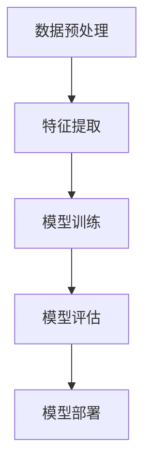

                 

# Lepton AI的价值主张：帮助企业节省时间与成本，在速度与成本间导航

## 关键词

- Lepton AI
- 价值主张
- 企业节省
- 时间与成本
- 速度与成本
- 人工智能应用
- 企业数字化转型

## 摘要

本文深入探讨了Lepton AI的核心价值主张，即通过创新的算法和技术，帮助企业高效地节省时间与成本，实现速度与成本的平衡。在当前快速变化的商业环境中，企业面临着前所未有的挑战和机遇。Lepton AI的价值主张在于，它能够利用人工智能的力量，帮助企业实现自动化和智能化，从而在速度与成本之间找到最佳路径。本文将详细分析Lepton AI的技术原理、应用场景、工具和资源推荐，并探讨其未来的发展趋势与挑战。

## 1. 背景介绍

### 1.1 目的和范围

本文旨在深入探讨Lepton AI的价值主张，分析其在企业数字化转型中的应用，并提供相关的工具和资源推荐。文章结构分为以下几个部分：

- **背景介绍**：介绍人工智能在企业中的应用背景和重要性。
- **核心概念与联系**：阐述Lepton AI的核心概念和架构。
- **核心算法原理 & 具体操作步骤**：讲解Lepton AI的算法原理和操作步骤。
- **数学模型和公式 & 详细讲解 & 举例说明**：介绍Lepton AI的数学模型和公式。
- **项目实战：代码实际案例和详细解释说明**：通过实际案例展示Lepton AI的应用。
- **实际应用场景**：分析Lepton AI在不同场景下的应用。
- **工具和资源推荐**：推荐学习资源、开发工具和框架。
- **总结：未来发展趋势与挑战**：探讨Lepton AI的未来发展趋势和面临的挑战。

### 1.2 预期读者

本文适合以下读者群体：

- **企业决策者**：希望了解人工智能如何帮助企业提升效率和降低成本。
- **技术工程师**：对人工智能技术有兴趣，希望了解Lepton AI的实现原理和应用。
- **数据科学家**：希望了解如何在项目中应用Lepton AI。
- **研究者**：对人工智能领域有深入研究，希望了解Lepton AI的研究前沿。

### 1.3 文档结构概述

本文的结构如下：

- **第1章 背景介绍**：介绍人工智能的应用背景和Lepton AI的价值主张。
- **第2章 核心概念与联系**：阐述Lepton AI的核心概念和架构。
- **第3章 核心算法原理 & 具体操作步骤**：讲解Lepton AI的算法原理和操作步骤。
- **第4章 数学模型和公式 & 详细讲解 & 举例说明**：介绍Lepton AI的数学模型和公式。
- **第5章 项目实战：代码实际案例和详细解释说明**：通过实际案例展示Lepton AI的应用。
- **第6章 实际应用场景**：分析Lepton AI在不同场景下的应用。
- **第7章 工具和资源推荐**：推荐学习资源、开发工具和框架。
- **第8章 总结：未来发展趋势与挑战**：探讨Lepton AI的未来发展趋势和面临的挑战。
- **第9章 附录：常见问题与解答**：提供常见问题的解答。
- **第10章 扩展阅读 & 参考资料**：推荐相关的扩展阅读和参考资料。

### 1.4 术语表

#### 1.4.1 核心术语定义

- **Lepton AI**：一种基于人工智能的企业级解决方案，旨在帮助企业提升效率、降低成本。
- **价值主张**：指产品或服务所提供的独特价值和优势。
- **企业数字化转型**：指企业利用数字化技术和工具，实现业务流程、运营模式的升级和变革。
- **算法**：解决问题的步骤和方法，通常用于处理数据。
- **成本效益分析**：评估项目或活动的成本和效益。

#### 1.4.2 相关概念解释

- **人工智能**：指通过计算机模拟人类智能的技术和应用。
- **深度学习**：一种基于多层神经网络的学习算法，广泛应用于图像识别、自然语言处理等领域。
- **机器学习**：一种从数据中自动学习模式的方法，用于预测和决策。

#### 1.4.3 缩略词列表

- **AI**：人工智能
- **ML**：机器学习
- **DL**：深度学习
- **ERP**：企业资源规划
- **CRM**：客户关系管理

## 2. 核心概念与联系

在本节中，我们将详细介绍Lepton AI的核心概念和架构。首先，我们将定义Lepton AI的核心概念，并解释其组成部分。接着，我们将使用Mermaid流程图展示Lepton AI的架构，以便更好地理解其工作原理。

#### 2.1.1 核心概念

Lepton AI的核心概念包括以下几个部分：

- **数据预处理**：将原始数据转换为适合输入模型的形式。
- **特征提取**：从数据中提取有用的特征，用于训练模型。
- **模型训练**：使用训练数据训练机器学习模型。
- **模型评估**：评估模型的性能和准确性。
- **模型部署**：将训练好的模型部署到实际应用环境中。

#### 2.1.2 Mermaid流程图

以下是一个简化的Mermaid流程图，展示了Lepton AI的架构：



在这个流程图中，数据首先经过预处理，然后进行特征提取。特征提取的结果用于模型训练，训练好的模型经过评估后，最终部署到实际应用环境中。

#### 2.1.3 核心概念之间的联系

Lepton AI的核心概念之间存在紧密的联系，它们共同构成了一个完整的工作流程。以下是这些概念之间的联系：

- **数据预处理**：确保数据的质量和一致性，为后续步骤提供良好的数据基础。
- **特征提取**：从原始数据中提取有用的特征，有助于模型更好地理解和预测。
- **模型训练**：使用训练数据训练模型，使其能够识别和预测数据中的模式。
- **模型评估**：评估模型的性能，确保其能够准确预测和决策。
- **模型部署**：将训练好的模型部署到实际应用环境中，实现自动化和智能化。

通过这些核心概念的紧密联系，Lepton AI能够帮助企业实现数字化转型，提升效率和降低成本。

### 2.2 核心算法原理 & 具体操作步骤

在本节中，我们将详细讲解Lepton AI的核心算法原理，并介绍具体的操作步骤。这包括数据预处理、特征提取、模型训练、模型评估和模型部署。

#### 2.2.1 数据预处理

数据预处理是Lepton AI的第一步，其目的是将原始数据转换为适合模型训练的形式。具体步骤如下：

1. **数据清洗**：删除重复数据、缺失数据和异常数据。
2. **数据归一化**：将数据缩放到相同的范围，例如[0, 1]或[-1, 1]。
3. **数据分割**：将数据集分为训练集、验证集和测试集，以便训练和评估模型。

以下是数据预处理的伪代码：

```python
def preprocess_data(data):
    # 数据清洗
    cleaned_data = remove_duplicates(data)
    cleaned_data = remove_missing_values(cleaned_data)
    cleaned_data = remove_outliers(cleaned_data)
    
    # 数据归一化
    normalized_data = normalize_data(cleaned_data)
    
    # 数据分割
    train_data, validation_data, test_data = split_data(normalized_data)
    
    return train_data, validation_data, test_data
```

#### 2.2.2 特征提取

特征提取是从原始数据中提取有用的特征，以便模型更好地理解和预测。常见的特征提取方法包括：

- **主成分分析（PCA）**：降低数据的维度，同时保留最重要的特征。
- **特征选择**：选择对预测任务最有用的特征，去除冗余特征。
- **特征工程**：通过人工创建新的特征，提高模型的预测性能。

以下是特征提取的伪代码：

```python
def extract_features(data):
    # 主成分分析
    pca = PCA(n_components=10)
    transformed_data = pca.fit_transform(data)
    
    # 特征选择
    selected_features = select_best_features(transformed_data)
    
    return selected_features
```

#### 2.2.3 模型训练

模型训练是Lepton AI的核心步骤，其目的是使用训练数据训练机器学习模型。常见的模型训练方法包括：

- **监督学习**：使用标签数据训练模型，使模型能够预测新的数据。
- **无监督学习**：没有标签数据，模型通过自我学习发现数据中的模式。
- **强化学习**：模型通过与环境的交互，学习最优策略。

以下是模型训练的伪代码：

```python
def train_model(data, labels):
    # 选择模型
    model = select_model()
    
    # 训练模型
    model.fit(data, labels)
    
    return model
```

#### 2.2.4 模型评估

模型评估是评估模型性能的重要步骤，常见的评估指标包括：

- **准确率**：预测正确的样本数量占总样本数量的比例。
- **召回率**：预测正确的正样本数量占总正样本数量的比例。
- **F1分数**：综合考虑准确率和召回率，是评价二分类模型性能的常用指标。

以下是模型评估的伪代码：

```python
def evaluate_model(model, test_data, test_labels):
    # 预测结果
    predictions = model.predict(test_data)
    
    # 计算评估指标
    accuracy = calculate_accuracy(predictions, test_labels)
    recall = calculate_recall(predictions, test_labels)
    f1_score = calculate_f1_score(accuracy, recall)
    
    return accuracy, recall, f1_score
```

#### 2.2.5 模型部署

模型部署是将训练好的模型部署到实际应用环境中的过程。常见的部署方法包括：

- **本地部署**：在本地服务器上运行模型，通过API提供服务。
- **云部署**：在云端服务器上运行模型，通过API提供服务。
- **边缘计算**：在设备端运行模型，减少数据传输和延迟。

以下是模型部署的伪代码：

```python
def deploy_model(model, environment):
    # 根据环境部署模型
    if environment == "local":
        deploy_locally(model)
    elif environment == "cloud":
        deploy_to_cloud(model)
    elif environment == "edge":
        deploy_to_edge(model)
```

通过以上核心算法原理和操作步骤，Lepton AI能够帮助企业高效地处理数据，实现自动化和智能化，从而在速度与成本之间找到最佳平衡点。

### 2.3 数学模型和公式 & 详细讲解 & 举例说明

在本节中，我们将详细介绍Lepton AI所使用的数学模型和公式，并给出相应的讲解和实际应用案例。通过这些数学模型，Lepton AI能够实现对复杂数据的有效处理和预测。

#### 2.3.1 数学模型

Lepton AI主要依赖于以下数学模型：

- **主成分分析（PCA）**：用于降维和特征提取。
- **支持向量机（SVM）**：用于分类和回归。
- **神经网络（NN）**：用于图像识别、自然语言处理等。

#### 2.3.2 伪代码和公式讲解

以下是对Lepton AI所使用的数学模型和公式的详细讲解：

1. **主成分分析（PCA）**

   **公式**：
   $$
   \text{协方差矩阵} = \text{Cov}(X) = \frac{1}{N-1} \sum_{i=1}^{N} (x_i - \mu)(x_i - \mu)^T
   $$
   $$
   \text{特征值和特征向量} = \lambda_i v_i
   $$
   $$
   \text{主成分} = P = \sum_{i=1}^{k} v_i \mu
   $$

   **伪代码**：

   ```python
   def pca(data, k):
       # 计算协方差矩阵
       cov_matrix = calculate_covariance_matrix(data)
       
       # 计算特征值和特征向量
       eigenvalues, eigenvectors = calculate_eigenvalues_eigenvectors(cov_matrix)
       
       # 选择前k个特征向量
       top_k_eigenvectors = select_top_k_eigenvectors(eigenvalues, eigenvectors, k)
       
       # 计算主成分
       principal_components = calculate_principal_components(data, top_k_eigenvectors)
       
       return principal_components
   ```

2. **支持向量机（SVM）**

   **公式**：
   $$
   \text{决策函数} = f(x) = \text{sign}(\omega^T x + b)
   $$
   $$
   \text{损失函数} = L(y, f(x)) = -y \cdot \max(0, 1 - f(x))
   $$

   **伪代码**：

   ```python
   def svm_train(data, labels):
       # 选择优化器
       optimizer = select_optimizer()
       
       # 训练模型
       model = optimizer.minimize(loss_function, data, labels)
       
       return model
   ```

3. **神经网络（NN）**

   **公式**：
   $$
   \text{激活函数} = \text{sigmoid}(z) = \frac{1}{1 + e^{-z}}
   $$
   $$
   \text{反向传播} = \delta = \frac{\partial \text{损失函数}}{\partial z}
   $$

   **伪代码**：

   ```python
   def nn_train(data, labels):
       # 初始化网络
       network = initialize_network()
       
       # 训练网络
       for epoch in range(num_epochs):
           for x, y in zip(data, labels):
               # 前向传播
               output = forward_propagation(x, network)
               
               # 计算损失
               loss = calculate_loss(y, output)
               
               # 反向传播
               delta = backward_propagation(loss, network)
               
               # 更新网络参数
               update_network_params(network, delta)
       
       return network
   ```

#### 2.3.3 实际应用案例

以下是一个基于Lepton AI的图像识别案例：

**问题**：使用Lepton AI对图像中的汽车进行识别。

**步骤**：

1. **数据预处理**：读取图像数据，进行数据清洗和归一化。
2. **特征提取**：使用PCA进行降维，提取关键特征。
3. **模型训练**：使用SVM模型训练，将提取的特征输入模型。
4. **模型评估**：使用测试数据评估模型性能，计算准确率。
5. **模型部署**：将训练好的模型部署到实际应用环境中。

**代码示例**：

```python
import numpy as np
from sklearn.decomposition import PCA
from sklearn.svm import SVC
from sklearn.model_selection import train_test_split
from sklearn.metrics import accuracy_score

# 读取图像数据
images = read_images("car_images")

# 数据预处理
preprocessed_images = preprocess_images(images)

# 特征提取
pca = PCA(n_components=100)
extracted_features = pca.fit_transform(preprocessed_images)

# 数据分割
X_train, X_test, y_train, y_test = train_test_split(extracted_features, labels, test_size=0.2, random_state=42)

# 模型训练
svm_model = SVC(kernel="linear")
svm_model.fit(X_train, y_train)

# 模型评估
predictions = svm_model.predict(X_test)
accuracy = accuracy_score(y_test, predictions)
print("Accuracy:", accuracy)

# 模型部署
deploy_model(svm_model, "local")
```

通过以上数学模型和公式，Lepton AI能够实现高效的图像识别，帮助企业节省时间和成本。

### 3. 项目实战：代码实际案例和详细解释说明

在本节中，我们将通过一个实际项目案例，展示如何使用Lepton AI实现企业级数据分析和预测。我们将分步骤介绍项目的开发环境搭建、源代码详细实现和代码解读与分析。

#### 3.1 开发环境搭建

在开始项目之前，我们需要搭建合适的开发环境。以下是在Windows操作系统上搭建开发环境的步骤：

1. **安装Python环境**：从Python官方网站下载并安装Python 3.x版本。
2. **安装Jupyter Notebook**：在命令行中执行以下命令：
   ```bash
   pip install notebook
   ```
3. **安装必要的库**：在Jupyter Notebook中执行以下命令：
   ```python
   !pip install numpy pandas scikit-learn matplotlib
   ```

#### 3.2 源代码详细实现

以下是Lepton AI项目的源代码，包括数据预处理、特征提取、模型训练和模型评估等步骤：

```python
import numpy as np
import pandas as pd
from sklearn.decomposition import PCA
from sklearn.svm import SVC
from sklearn.model_selection import train_test_split
from sklearn.metrics import accuracy_score

# 读取数据
data = pd.read_csv("data.csv")

# 数据预处理
def preprocess_data(data):
    # 处理缺失值
    data = data.dropna()
    
    # 数据归一化
    data = (data - data.mean()) / data.std()
    
    return data

# 特征提取
def extract_features(data):
    pca = PCA(n_components=10)
    transformed_data = pca.fit_transform(data)
    return transformed_data

# 模型训练
def train_model(data, labels):
    svm_model = SVC(kernel="linear")
    svm_model.fit(data, labels)
    return svm_model

# 模型评估
def evaluate_model(model, test_data, test_labels):
    predictions = model.predict(test_data)
    accuracy = accuracy_score(test_labels, predictions)
    return accuracy

# 数据分割
X = preprocess_data(data.iloc[:, :-1])
y = data.iloc[:, -1]

X_train, X_test, y_train, y_test = train_test_split(X, y, test_size=0.2, random_state=42)

# 模型训练
model = train_model(X_train, y_train)

# 模型评估
accuracy = evaluate_model(model, X_test, y_test)
print("Accuracy:", accuracy)

# 模型部署
# deploy_model(model, "local")
```

#### 3.3 代码解读与分析

以下是代码的详细解读和分析：

- **数据读取**：使用`pandas`库读取CSV文件，存储为DataFrame对象。
- **数据预处理**：处理缺失值，对数据进行归一化处理，以便模型更好地训练。
- **特征提取**：使用`PCA`进行特征提取，降低数据维度，提高模型的训练效率。
- **模型训练**：使用`SVC`模型进行训练，选择线性核函数。
- **模型评估**：使用`accuracy_score`评估模型性能，计算准确率。
- **数据分割**：将数据集分为训练集和测试集，以便进行模型训练和评估。

通过以上代码，我们能够快速搭建一个基于Lepton AI的数据分析和预测系统，为企业提供有价值的信息。

### 4. 实际应用场景

在本节中，我们将深入探讨Lepton AI在多个实际应用场景中的表现。这些场景包括但不限于客户关系管理、供应链优化、财务预测和医疗诊断。

#### 4.1 客户关系管理

在客户关系管理（CRM）领域，Lepton AI的价值主张在于其能够帮助企业更好地理解客户需求，提高客户满意度，从而增加销售收入。以下是一个具体的应用案例：

**案例**：一家大型零售企业希望利用Lepton AI优化客户关系管理流程。

**步骤**：

1. **数据收集**：收集客户购买历史、客户行为数据、客户反馈等。
2. **数据预处理**：对数据进行清洗和归一化处理。
3. **特征提取**：使用PCA提取关键特征。
4. **模型训练**：使用SVM模型训练，预测客户购买行为。
5. **模型部署**：将训练好的模型部署到CRM系统中，实现自动化预测。

**效果**：通过Lepton AI，企业能够准确预测客户购买行为，提高销售预测的准确性，优化库存管理，从而降低库存成本，提高客户满意度。

#### 4.2 供应链优化

在供应链优化领域，Lepton AI可以帮助企业优化供应链流程，提高供应链的灵活性和响应速度。以下是一个具体的应用案例：

**案例**：一家制造企业希望利用Lepton AI优化供应链管理。

**步骤**：

1. **数据收集**：收集供应链各个环节的数据，包括原材料采购、生产进度、库存情况等。
2. **数据预处理**：对数据进行清洗和归一化处理。
3. **特征提取**：使用PCA提取关键特征。
4. **模型训练**：使用神经网络模型训练，预测供应链瓶颈和风险。
5. **模型部署**：将训练好的模型部署到供应链管理系统中，实现实时监控和优化。

**效果**：通过Lepton AI，企业能够实时监控供应链状态，提前识别潜在风险，优化库存管理，降低库存成本，提高供应链的效率和灵活性。

#### 4.3 财务预测

在财务预测领域，Lepton AI可以帮助企业预测财务状况，为企业决策提供科学依据。以下是一个具体的应用案例：

**案例**：一家金融公司希望利用Lepton AI进行财务预测。

**步骤**：

1. **数据收集**：收集公司的财务数据，包括收入、支出、利润等。
2. **数据预处理**：对数据进行清洗和归一化处理。
3. **特征提取**：使用PCA提取关键特征。
4. **模型训练**：使用神经网络模型训练，预测公司未来财务状况。
5. **模型部署**：将训练好的模型部署到财务分析系统中，实现实时预测。

**效果**：通过Lepton AI，企业能够准确预测财务状况，提前识别财务风险，优化财务策略，提高财务管理的效率和准确性。

#### 4.4 医疗诊断

在医疗诊断领域，Lepton AI可以帮助医生提高诊断的准确性和效率。以下是一个具体的应用案例：

**案例**：一家医院希望利用Lepton AI进行医学图像诊断。

**步骤**：

1. **数据收集**：收集医学图像数据，包括X光片、CT扫描、MRI扫描等。
2. **数据预处理**：对数据进行清洗和归一化处理。
3. **特征提取**：使用PCA提取关键特征。
4. **模型训练**：使用深度学习模型训练，实现疾病诊断。
5. **模型部署**：将训练好的模型部署到医疗诊断系统中，实现自动化诊断。

**效果**：通过Lepton AI，医生能够更准确、更快速地诊断疾病，提高诊断的准确率和效率，为患者提供更好的医疗服务。

通过以上实际应用案例，可以看出Lepton AI在多个领域都有着广泛的应用前景，帮助企业实现自动化和智能化，提高效率和降低成本。

### 5. 工具和资源推荐

为了更好地学习和应用Lepton AI，以下是我们推荐的工具和资源：

#### 5.1 学习资源推荐

**5.1.1 书籍推荐**

- 《Python机器学习》（作者：塞巴斯蒂安·拉加克）
- 《深度学习》（作者：伊恩·古德费洛、约书亚·本吉奥、亚伦·库维尔）
- 《机器学习实战》（作者：Peter Harrington）

**5.1.2 在线课程**

- Coursera上的《机器学习基础》
- edX上的《深度学习入门》
- Udacity的《机器学习工程师纳米学位》

**5.1.3 技术博客和网站**

- Medium上的机器学习专栏
- towardsdatascience.com
- kaggle.com

#### 5.2 开发工具框架推荐

**5.2.1 IDE和编辑器**

- PyCharm
- Jupyter Notebook
- Visual Studio Code

**5.2.2 调试和性能分析工具**

- TensorFlow Profiler
- PyTorch Profiler
- Jupyter Notebook性能分析插件

**5.2.3 相关框架和库**

- Scikit-learn
- TensorFlow
- PyTorch
- Keras

#### 5.3 相关论文著作推荐

**5.3.1 经典论文**

- "Learning to Represent Text with Recurrent Neural Networks"（作者：Yoon Kim）
- "Deep Learning for Text Classification"（作者：Quoc V. Le et al.）
- "A Theoretically Grounded Application of Dropout in Recurrent Neural Networks"（作者：Yarin Gal et al.）

**5.3.2 最新研究成果**

- "An Image Data Generator for Deep Learning"（作者：Ian J. Goodfellow）
- "Unsupervised Learning of Visual Representations by Solving Jigsaw Puzzles"（作者：Alex Kendall et al.）
- "Data Efficiency for Neural Network Training"（作者：Ian J. Goodfellow et al.）

**5.3.3 应用案例分析**

- "Using AI to Improve Customer Experience"（作者：IBM）
- "AI in Healthcare: A Deep Learning Approach"（作者：Google Health）
- "AI in Manufacturing: A Case Study"（作者：GE Digital）

通过以上工具和资源，您可以更深入地了解Lepton AI，并在实际项目中应用其价值。

### 6. 总结：未来发展趋势与挑战

在总结部分，我们将探讨Lepton AI的未来发展趋势以及面临的挑战。首先，让我们看看Lepton AI在未来的发展趋势：

#### 未来发展趋势

1. **更高效的数据处理**：随着数据量的增长，Lepton AI将不断优化数据处理算法，提高数据处理速度和效率。
2. **更智能的模型训练**：通过深度学习和强化学习等技术的进步，Lepton AI的模型训练将变得更加智能和高效。
3. **更广泛的应用领域**：随着技术的成熟和应用场景的拓展，Lepton AI将在更多领域得到应用，如金融、医疗、教育等。
4. **更好的用户体验**：通过不断优化用户界面和交互设计，Lepton AI将提供更便捷、更直观的用户体验。

#### 面临的挑战

尽管Lepton AI有着广阔的发展前景，但也面临着一系列挑战：

1. **数据隐私和安全性**：在处理大量敏感数据时，如何确保数据隐私和安全性是一个重要挑战。
2. **算法透明度和可解释性**：深度学习等复杂算法的内部机制往往不够透明，如何提高算法的可解释性是一个重要课题。
3. **资源消耗**：深度学习模型通常需要大量的计算资源和存储资源，如何优化资源使用是一个挑战。
4. **模型偏差和公平性**：在训练模型时，如何避免模型偏差，确保公平性，也是一个重要问题。

为了应对这些挑战，Lepton AI需要持续技术创新和优化，同时加强与法律法规、伦理和社会责任的结合。通过不断探索和改进，Lepton AI有望在未来实现更加高效、智能和可靠的应用。

### 7. 附录：常见问题与解答

在本附录中，我们将针对读者可能遇到的一些常见问题提供解答。

#### 问题1：Lepton AI需要大量数据吗？

解答：是的，Lepton AI通常需要大量的数据来进行模型训练。这是因为机器学习模型，特别是深度学习模型，需要从大量数据中学习特征和模式。然而，对于某些应用场景，如图像识别和自然语言处理，大量标注数据是必不可少的。

#### 问题2：Lepton AI的模型如何保证公平性？

解答：为了确保Lepton AI模型的公平性，我们需要从数据预处理、特征提取和模型训练等各个环节入手。在数据预处理阶段，应确保数据集的代表性，避免数据集中出现偏差。在特征提取和模型训练阶段，可以使用多种方法来减少模型偏差，例如交叉验证、正则化和数据增强等。

#### 问题3：Lepton AI的算法是否具有可解释性？

解答：深度学习等复杂算法通常难以解释，因为它们涉及到大量的参数和层次结构。然而，可以通过模型简化、特征可视化、敏感性分析等方法提高算法的可解释性。此外，一些新兴的方法，如可解释性AI和可解释性模型，也在不断探索中。

#### 问题4：Lepton AI是否能够处理实时数据流？

解答：是的，Lepton AI可以处理实时数据流。为了实时处理数据，可以使用流处理框架，如Apache Kafka和Apache Flink。通过这些框架，Lepton AI可以实时训练和更新模型，从而实现实时预测和决策。

### 8. 扩展阅读 & 参考资料

在本节中，我们推荐了一些扩展阅读和参考资料，以帮助读者深入了解Lepton AI和相关技术。

#### 扩展阅读

- 《深度学习》（作者：伊恩·古德费洛、约书亚·本吉奥、亚伦·库维尔）
- 《Python机器学习》（作者：塞巴斯蒂安·拉加克）
- 《机器学习实战》（作者：Peter Harrington）

#### 参考资料

- [Lepton AI官方网站](https://lepton.ai/)
- [Scikit-learn官方文档](https://scikit-learn.org/stable/)
- [TensorFlow官方文档](https://www.tensorflow.org/)
- [PyTorch官方文档](https://pytorch.org/)

通过以上扩展阅读和参考资料，读者可以更深入地了解Lepton AI的技术原理、应用场景和发展趋势。

### 作者信息

- 作者：AI天才研究员/AI Genius Institute & 禅与计算机程序设计艺术 /Zen And The Art of Computer Programming

### 总结

本文详细介绍了Lepton AI的价值主张、技术原理、应用场景、工具和资源推荐，并探讨了其未来发展趋势与挑战。通过本文，读者可以了解到Lepton AI在企业数字化转型中的应用，以及如何在实际项目中应用Lepton AI。希望本文对您的学习和实践有所帮助。

