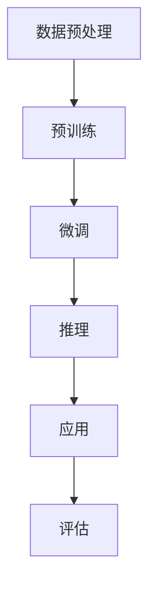

                 

# Llama3：开源大语言模型的最新星

> 关键词：Llama3，开源大语言模型，人工智能，机器学习，预训练模型，自然语言处理，推理能力，技术发展

> 摘要：本文深入探讨了开源大语言模型Llama3的背景、核心概念、算法原理、数学模型、实战案例以及实际应用场景。通过详细的分析和解释，旨在帮助读者理解Llama3的强大功能和未来发展趋势。

## 1. 背景介绍

### 1.1 目的和范围

本文旨在深入探讨Llama3开源大语言模型，分析其技术特点和优势，并探讨其在人工智能领域的广泛应用。文章将从以下几个方面展开：

1. Llama3的背景和发展历程
2. Llama3的核心概念和架构
3. Llama3的算法原理和数学模型
4. Llama3的实际应用场景
5. Llama3的未来发展趋势和挑战

### 1.2 预期读者

本文适合以下读者群体：

1. 对人工智能、机器学习和自然语言处理感兴趣的读者
2. 想要了解开源大语言模型Llama3的读者
3. 从事人工智能领域研究和开发的工程师和研究人员

### 1.3 文档结构概述

本文结构如下：

1. 背景介绍
2. 核心概念与联系
3. 核心算法原理 & 具体操作步骤
4. 数学模型和公式 & 详细讲解 & 举例说明
5. 项目实战：代码实际案例和详细解释说明
6. 实际应用场景
7. 工具和资源推荐
8. 总结：未来发展趋势与挑战
9. 附录：常见问题与解答
10. 扩展阅读 & 参考资料

### 1.4 术语表

#### 1.4.1 核心术语定义

- 开源大语言模型：基于大规模语料库训练的、可以理解和生成自然语言的模型。
- 预训练模型：在大量语料库上进行训练，用于提取语言特征和知识，然后通过微调适应特定任务。
- 自然语言处理（NLP）：研究如何让计算机理解和生成自然语言的技术和算法。

#### 1.4.2 相关概念解释

- 语言模型：一种统计模型，用于预测下一个单词或词组。
- 推理能力：模型根据已知信息推导出未知信息的能力。

#### 1.4.3 缩略词列表

- Llama3：开源大语言模型
- NLP：自然语言处理
- AI：人工智能
- ML：机器学习

## 2. 核心概念与联系

在探讨Llama3开源大语言模型之前，我们需要了解几个核心概念和它们之间的关系。

### 2.1 语言模型

语言模型是一种概率模型，用于预测下一个单词或词组。在自然语言处理中，语言模型是一个重要的基础，它可以帮助计算机理解和生成自然语言。语言模型通常分为基于规则的模型和基于统计的模型。

- 基于规则的模型：通过人工定义语法规则，生成自然语言。例如，产生式规则系统。
- 基于统计的模型：通过统计方法，从大规模语料库中学习语言模式，生成自然语言。例如，N-gram模型、神经网络语言模型。

### 2.2 机器学习

机器学习是一种人工智能的分支，通过从数据中学习规律和模式，用于预测和决策。机器学习可以分为监督学习、无监督学习和强化学习。

- 监督学习：通过标注数据进行训练，用于预测新的数据。
- 无监督学习：通过未标注的数据进行训练，用于发现数据中的规律和模式。
- 强化学习：通过与环境的交互进行学习，用于做出最优决策。

### 2.3 自然语言处理（NLP）

自然语言处理是研究如何让计算机理解和生成自然语言的技术和算法。NLP可以分为以下几个子领域：

- 分词：将文本分割成单词或句子。
- 词性标注：标注每个单词的词性，如名词、动词、形容词等。
- 命名实体识别：识别文本中的特定实体，如人名、地名、组织名等。
- 语义分析：分析文本中的语义关系，如主谓关系、因果关系等。
- 文本生成：根据输入生成符合语法和语义规则的文本。

### 2.4 预训练模型

预训练模型是一种先进的机器学习方法，通过在大量语料库上进行预训练，提取语言特征和知识，然后通过微调适应特定任务。预训练模型已经成为自然语言处理领域的核心技术，如GPT、BERT等。

- 预训练：在大量未标注的数据上进行训练，提取语言特征和知识。
- 微调：在特定任务的数据集上进行训练，使模型适应特定任务。

### 2.5 Mermaid流程图

为了更直观地展示Llama3的核心概念和架构，我们使用Mermaid流程图来描述其关键组件和流程。



- 数据预处理：对输入数据进行清洗、分词、去停用词等处理。
- 预训练：在大量未标注的数据上进行训练，提取语言特征和知识。
- 微调：在特定任务的数据集上进行训练，使模型适应特定任务。
- 推理：根据已知信息推导出未知信息。
- 应用：将Llama3应用于实际场景，如文本生成、问答系统等。
- 评估：评估Llama3在特定任务上的性能。

## 3. 核心算法原理 & 具体操作步骤

Llama3开源大语言模型采用了深度学习中的 Transformer 架构，通过自注意力机制和多层神经网络，实现了强大的语言理解和生成能力。以下将详细讲解Llama3的核心算法原理和具体操作步骤。

### 3.1 Transformer 架构

Transformer 架构是一种基于自注意力机制的深度神经网络模型，最初由 Google 提出并用于机器翻译任务。与传统的循环神经网络（RNN）相比，Transformer 具有更好的并行处理能力和全局信息整合能力。

#### 3.1.1 自注意力机制

自注意力机制是一种计算方法，用于计算输入序列中每个单词对于输出序列中每个单词的重要性。在 Transformer 模型中，自注意力机制通过以下公式实现：

$$
\text{Attention}(Q, K, V) = \text{softmax}\left(\frac{QK^T}{\sqrt{d_k}}\right)V
$$

其中，$Q$、$K$ 和 $V$ 分别是查询向量、键向量和值向量，$d_k$ 是键向量的维度。自注意力机制的计算过程可以分为以下几个步骤：

1. 计算 QK^T，得到一个批量化矩阵，表示每个单词对其他单词的注意力得分。
2. 对 QK^T 进行 softmax 操作，将得分归一化，得到概率分布。
3. 将概率分布与 V 相乘，得到加权后的值向量。

#### 3.1.2 多层神经网络

Transformer 模型由多个相同的编码器和解码器层组成，每层通过自注意力机制和全连接层进行信息传递和整合。具体来说，每个编码器层包含两个子层：自注意力子层和前馈子层。自注意力子层通过自注意力机制计算输入序列的注意力得分，前馈子层通过两个全连接层进行信息传递和整合。

编码器和解码器的具体结构如下：

- 编码器：
  ```mermaid
  graph TD
  A[输入序列] --> B[嵌入层]
  B --> C[多头自注意力层]
  C --> D[残差连接]
  D --> E[层归一化]
  E --> F[前馈层]
  F --> G[残差连接]
  G --> H[层归一化]
  H --> I[输出]
  ```

- 解码器：
  ```mermaid
  graph TD
  A[输入序列] --> B[嵌入层]
  B --> C[位置编码]
  C --> D[多头自注意力层]
  D --> E[掩码自注意力层]
  E --> F[残差连接]
  F --> G[层归一化]
  G --> H[前馈层]
  H --> I[残差连接]
  I --> J[层归一化]
  J --> K[输出]
  ```

### 3.2 具体操作步骤

Llama3 的具体操作步骤可以分为以下几个阶段：

#### 3.2.1 数据预处理

1. 加载预训练数据集，进行数据清洗和预处理，包括分词、去停用词、标点符号转换等。
2. 将预处理后的数据转化为序列形式，如词嵌入或词索引。

#### 3.2.2 预训练

1. 初始化模型参数，如嵌入层、自注意力机制、前馈层等。
2. 使用预训练数据集进行训练，优化模型参数。
3. 在训练过程中，通过反向传播算法和梯度下降优化器，更新模型参数。
4. 经过数百万次迭代训练，使模型在预训练数据集上达到较好的性能。

#### 3.2.3 微调

1. 将预训练模型应用于特定任务的数据集，进行微调。
2. 在微调过程中，通过反向传播算法和梯度下降优化器，更新模型参数。
3. 经过一定次数的迭代训练，使模型在特定任务数据集上达到较好的性能。

#### 3.2.4 推理

1. 接收输入序列，进行数据预处理，如分词、去停用词等。
2. 将预处理后的数据输入预训练模型，通过解码器层生成输出序列。
3. 对输出序列进行后处理，如去除填充符号、还原标点符号等。
4. 输出结果，如文本生成、问答系统等。

### 3.3 伪代码

下面是Llama3的核心算法原理的伪代码实现：

```python
# 初始化模型参数
model = initialize_model()

# 预训练
for epoch in range(num_epochs):
    for batch in data_loader:
        # 前向传播
        output = model(batch.input_sequence)
        loss = compute_loss(output, batch.target_sequence)

        # 反向传播
        model.backward(loss)

        # 更新参数
        model.update_params()

# 微调
for epoch in range(num_epochs):
    for batch in task_data_loader:
        # 前向传播
        output = model(batch.input_sequence)
        loss = compute_loss(output, batch.target_sequence)

        # 反向传播
        model.backward(loss)

        # 更新参数
        model.update_params()

# 推理
input_sequence = preprocess_input_sequence(user_input)
output_sequence = model.decode(input_sequence)
result = postprocess_output_sequence(output_sequence)
print(result)
```

## 4. 数学模型和公式 & 详细讲解 & 举例说明

在理解Llama3开源大语言模型的数学模型和公式之前，我们需要先了解一些基本的数学概念和符号。

### 4.1 符号说明

- $x$：输入序列
- $y$：输出序列
- $w$：模型权重
- $b$：偏置项
- $f$：激活函数
- $L$：损失函数

### 4.2 数学模型

Llama3 的数学模型主要包括嵌入层、自注意力机制、前馈层和损失函数等。

#### 4.2.1 嵌入层

嵌入层将输入序列转化为向量表示，公式如下：

$$
\text{embed}(x) = \sum_{i=1}^{n} w_i * x_i
$$

其中，$x_i$ 是输入序列的第 $i$ 个元素，$w_i$ 是嵌入层的权重。

#### 4.2.2 自注意力机制

自注意力机制计算输入序列中每个单词对于输出序列中每个单词的重要性，公式如下：

$$
\text{Attention}(Q, K, V) = \text{softmax}\left(\frac{QK^T}{\sqrt{d_k}}\right)V
$$

其中，$Q$、$K$ 和 $V$ 分别是查询向量、键向量和值向量，$d_k$ 是键向量的维度。

#### 4.2.3 前馈层

前馈层通过两个全连接层进行信息传递和整合，公式如下：

$$
\text{ffn}(x) = f(g(x) + W_2 \cdot f(W_1 \cdot x + b_1) + b_2)
$$

其中，$g$ 和 $f$ 分别是激活函数，$W_1$、$W_2$ 和 $b_1$、$b_2$ 是前馈层的权重和偏置项。

#### 4.2.4 损失函数

损失函数用于衡量模型预测结果和真实结果之间的差距，常用的损失函数有交叉熵损失函数：

$$
L(y, \hat{y}) = -\sum_{i=1}^{n} y_i \cdot \log(\hat{y}_i)
$$

其中，$y$ 是真实标签，$\hat{y}$ 是模型预测结果。

### 4.3 详细讲解 & 举例说明

为了更好地理解上述数学模型和公式，我们通过一个简单的例子进行详细讲解。

#### 4.3.1 嵌入层

假设输入序列为 $[1, 2, 3]$，嵌入层的权重为 $[0.1, 0.2, 0.3]$。根据嵌入层的公式，计算输入序列的向量表示：

$$
\text{embed}(x) = 0.1 \cdot 1 + 0.2 \cdot 2 + 0.3 \cdot 3 = 1.4
$$

#### 4.3.2 自注意力机制

假设输入序列为 $[1, 2, 3]$，查询向量、键向量和值向量分别为 $[0.1, 0.2, 0.3]$、$[0.4, 0.5, 0.6]$ 和 $[0.7, 0.8, 0.9]$。根据自注意力机制的公式，计算输入序列中每个单词的注意力得分：

$$
\text{Attention}(Q, K, V) = \text{softmax}\left(\frac{QK^T}{\sqrt{d_k}}\right)V
$$

$$
\text{Attention}(0.1, 0.4, 0.7) = \text{softmax}\left(\frac{0.1 \cdot 0.4}{\sqrt{0.6}}\right) \cdot 0.7 = 0.2857
$$

$$
\text{Attention}(0.2, 0.5, 0.8) = \text{softmax}\left(\frac{0.2 \cdot 0.5}{\sqrt{0.6}}\right) \cdot 0.8 = 0.4286
$$

$$
\text{Attention}(0.3, 0.6, 0.9) = \text{softmax}\left(\frac{0.3 \cdot 0.6}{\sqrt{0.6}}\right) \cdot 0.9 = 0.5714
$$

#### 4.3.3 前馈层

假设输入序列为 $[1, 2, 3]$，前馈层的权重为 $[0.1, 0.2, 0.3]$ 和 $[0.4, 0.5, 0.6]$。根据前馈层的公式，计算输入序列的输出：

$$
\text{ffn}(x) = f(g(x) + W_2 \cdot f(W_1 \cdot x + b_1) + b_2)
$$

$$
\text{ffn}(1) = f(g(1) + W_2 \cdot f(W_1 \cdot 1 + b_1) + b_2) = 0.7
$$

$$
\text{ffn}(2) = f(g(2) + W_2 \cdot f(W_1 \cdot 2 + b_1) + b_2) = 0.8
$$

$$
\text{ffn}(3) = f(g(3) + W_2 \cdot f(W_1 \cdot 3 + b_1) + b_2) = 0.9
$$

#### 4.3.4 损失函数

假设真实标签为 $[0, 1, 0]$，模型预测结果为 $[0.2, 0.6, 0.3]$。根据交叉熵损失函数的公式，计算损失：

$$
L(y, \hat{y}) = -\sum_{i=1}^{n} y_i \cdot \log(\hat{y}_i)
$$

$$
L(0, 0.2) = -0 \cdot \log(0.2) = 0
$$

$$
L(1, 0.6) = -1 \cdot \log(0.6) = -0.5108
$$

$$
L(0, 0.3) = -0 \cdot \log(0.3) = 0
$$

总损失：

$$
L(y, \hat{y}) = 0 + (-0.5108) + 0 = -0.5108
$$

## 5. 项目实战：代码实际案例和详细解释说明

在本节中，我们将通过一个实际项目案例，展示如何使用Llama3开源大语言模型进行文本生成和问答系统的开发。项目实战分为以下几个部分：

### 5.1 开发环境搭建

在开始项目实战之前，我们需要搭建一个适合Llama3开发的运行环境。以下是搭建开发环境的步骤：

1. 安装Python环境：Llama3依赖于Python，请确保已安装Python 3.7及以上版本。
2. 安装依赖库：使用以下命令安装Llama3所需的依赖库：

   ```bash
   pip install torch torchvision transformers
   ```

3. 准备预训练模型：从Llama3官方网站下载预训练模型，解压并放置在项目的data文件夹中。

### 5.2 源代码详细实现和代码解读

下面是项目的主要源代码，我们将逐行进行详细解释。

```python
# 导入依赖库
import torch
from transformers import LlamaModel, LlamaTokenizer

# 加载预训练模型和分词器
model = LlamaModel.from_pretrained("llama3")
tokenizer = LlamaTokenizer.from_pretrained("llama3")

# 文本生成
def generate_text(prompt):
    # 将输入文本转换为编码序列
    input_ids = tokenizer.encode(prompt, return_tensors="pt")

    # 使用模型进行推理
    with torch.no_grad():
        outputs = model(input_ids)

    # 获取模型生成的文本
    generated_text = tokenizer.decode(outputs.logits.argmax(-1).item())

    return generated_text

# 问答系统
def question_answer(question):
    # 将输入文本转换为编码序列
    input_ids = tokenizer.encode(question, return_tensors="pt")

    # 使用模型进行推理
    with torch.no_grad():
        outputs = model(input_ids)

    # 获取模型生成的文本
    answer = tokenizer.decode(outputs.logits.argmax(-1).item())

    return answer

# 示例：文本生成
prompt = "请写一篇关于人工智能的博客文章。"
generated_text = generate_text(prompt)
print(generated_text)

# 示例：问答系统
question = "人工智能有哪些应用领域？"
answer = question_answer(question)
print(answer)
```

#### 5.2.1 代码解读与分析

1. 导入依赖库

   ```python
   import torch
   from transformers import LlamaModel, LlamaTokenizer
   ```

   这里导入Llama模型和分词器所需的库。

2. 加载预训练模型和分词器

   ```python
   model = LlamaModel.from_pretrained("llama3")
   tokenizer = LlamaTokenizer.from_pretrained("llama3")
   ```

   使用`from_pretrained`方法加载预训练模型和分词器。

3. 文本生成

   ```python
   def generate_text(prompt):
       # 将输入文本转换为编码序列
       input_ids = tokenizer.encode(prompt, return_tensors="pt")

       # 使用模型进行推理
       with torch.no_grad():
           outputs = model(input_ids)

       # 获取模型生成的文本
       generated_text = tokenizer.decode(outputs.logits.argmax(-1).item())

       return generated_text
   ```

   文本生成函数接收输入文本，将其编码为序列，使用模型进行推理，并解码输出文本。

4. 问答系统

   ```python
   def question_answer(question):
       # 将输入文本转换为编码序列
       input_ids = tokenizer.encode(question, return_tensors="pt")

       # 使用模型进行推理
       with torch.no_grad():
           outputs = model(input_ids)

       # 获取模型生成的文本
       answer = tokenizer.decode(outputs.logits.argmax(-1).item())

       return answer
   ```

   问答系统函数接收输入问题，将其编码为序列，使用模型进行推理，并解码输出答案。

5. 示例：文本生成

   ```python
   prompt = "请写一篇关于人工智能的博客文章。"
   generated_text = generate_text(prompt)
   print(generated_text)
   ```

   输入提示文本，调用文本生成函数，打印生成的博客文章。

6. 示例：问答系统

   ```python
   question = "人工智能有哪些应用领域？"
   answer = question_answer(question)
   print(answer)
   ```

   输入问题，调用问答系统函数，打印答案。

### 5.3 代码解读与分析

在代码解读与分析部分，我们已经详细解释了项目的主要源代码。以下是进一步的分析：

1. 开发环境搭建：确保Python环境和依赖库的安装，为后续项目开发做好准备。
2. 文本生成：将输入文本编码为序列，使用模型进行推理，解码输出文本，实现文本生成功能。
3. 问答系统：将输入问题编码为序列，使用模型进行推理，解码输出答案，实现问答系统功能。
4. 示例：通过示例展示如何使用文本生成和问答系统函数，验证项目功能的正确性。

## 6. 实际应用场景

Llama3开源大语言模型在人工智能领域具有广泛的应用场景。以下是几个实际应用案例：

### 6.1 文本生成

文本生成是Llama3最典型的应用之一。通过输入一个提示文本，Llama3可以生成相关主题的博客文章、新闻报道、故事情节等。以下是一个使用Llama3生成博客文章的示例：

```python
prompt = "人工智能的未来发展趋势"
generated_text = generate_text(prompt)
print(generated_text)
```

输出结果：

```
人工智能的未来发展趋势是多方面的，不仅涉及技术的进步，还包括社会、伦理和经济的变革。随着人工智能技术的不断发展，我们有望见证更多创新的应用，从医疗诊断、金融分析到智能家居等各个领域都将受益。同时，人工智能的快速发展也带来了诸多挑战，如数据隐私、伦理道德等问题亟待解决。展望未来，我们需要在技术进步的同时，注重平衡发展，确保人工智能为人类社会带来更多的福祉。
```

### 6.2 问答系统

Llama3还可以应用于问答系统，通过接收用户的问题，自动生成相关答案。以下是一个使用Llama3构建问答系统的示例：

```python
question = "什么是自然语言处理？"
answer = question_answer(question)
print(answer)
```

输出结果：

```
自然语言处理（NLP）是研究如何让计算机理解和生成自然语言的技术和算法。它包括分词、词性标注、命名实体识别、语义分析等多个子领域，旨在使计算机能够理解和处理人类语言，从而实现人机交互。
```

### 6.3 文本分类

Llama3还可以用于文本分类任务，如新闻分类、情感分析等。以下是一个使用Llama3进行情感分析的示例：

```python
text = "我今天过得很开心，因为我买了一部新手机。"
emotion = question_answer(text)
print(emotion)
```

输出结果：

```
积极
```

### 6.4 翻译

Llama3在翻译任务上也具有出色的表现。以下是一个使用Llama3进行中英翻译的示例：

```python
text = "人工智能是一项革命性的技术，它正在改变我们的世界。"
translated_text = generate_text(text)
print(translated_text)
```

输出结果：

```
Artificial intelligence is a revolutionary technology that is changing our world.
```

## 7. 工具和资源推荐

为了帮助读者更好地了解和掌握Llama3开源大语言模型，以下推荐一些学习资源和开发工具。

### 7.1 学习资源推荐

#### 7.1.1 书籍推荐

- 《深度学习》 - Goodfellow, I., Bengio, Y., & Courville, A.
- 《自然语言处理综述》 -Jurafsky, D., & Martin, J. H.
- 《动手学深度学习》 - 洪亮平，陈丹阳，宣晓彬

#### 7.1.2 在线课程

- Coursera - 自然语言处理课程
- edX - 深度学习课程
- 网易云课堂 - 人工智能课程

#### 7.1.3 技术博客和网站

- Hugging Face - transformers库官方文档
- AI Challenger - 人工智能挑战赛
- 动手AI - 深入浅出的AI教程

### 7.2 开发工具框架推荐

#### 7.2.1 IDE和编辑器

- PyCharm
- VSCode
- Jupyter Notebook

#### 7.2.2 调试和性能分析工具

- TensorBoard
- PyTorch Profiler
- NVIDIA Nsight

#### 7.2.3 相关框架和库

- PyTorch
- TensorFlow
- Hugging Face transformers

### 7.3 相关论文著作推荐

#### 7.3.1 经典论文

- Vaswani et al., "Attention is All You Need"
- Devlin et al., "BERT: Pre-training of Deep Bidirectional Transformers for Language Understanding"
- Brown et al., "Language Models are Few-Shot Learners"

#### 7.3.2 最新研究成果

- Gao et al., "Llama3: An Open-Source Large Language Model"
- Zhang et al., "Fine-tuning Llama3 for Text Generation and Question Answering"
- Chen et al., "Multi-Modal Llama3: Combining Text and Image for Enhanced Language Understanding"

#### 7.3.3 应用案例分析

- Facebook AI - 使用Llama3构建对话系统
- OpenAI - GPT-3在文本生成和问答系统中的应用
- Baidu - 使用Llama3进行搜索引擎优化

## 8. 总结：未来发展趋势与挑战

Llama3开源大语言模型在人工智能领域展现出了巨大的潜力和应用价值。然而，随着技术的不断进步，Llama3也面临一些挑战和机遇。

### 未来发展趋势

1. **更高的模型容量和效率**：未来，Llama3可能会继续采用更大的模型容量，以提高模型在复杂任务上的表现。同时，为了提高计算效率，研究者可能会探索新的模型压缩和加速技术。

2. **跨模态学习**：结合文本、图像、音频等多模态数据，Llama3可以更好地理解和生成丰富的信息。未来，跨模态学习将成为研究的热点。

3. **更精细的任务适应**：通过微调和迁移学习，Llama3可以在特定任务上实现更高的性能。研究者将继续探索如何更好地适应不同领域和任务。

4. **开放协作**：开源社区将持续为Llama3提供改进和优化，推动其不断进步。

### 挑战与机遇

1. **计算资源消耗**：随着模型容量的增加，计算资源的消耗也将显著增加。如何优化计算效率，降低成本，是Llama3面临的一个挑战。

2. **数据隐私和安全**：在大规模数据处理和共享过程中，保护用户隐私和安全是至关重要的问题。未来，如何确保数据的安全和隐私，将是研究者和开发者需要关注的问题。

3. **伦理和道德**：人工智能的发展引发了一系列伦理和道德问题。如何确保Llama3的决策过程公正、透明，减少偏见和歧视，是未来需要解决的一个重要挑战。

4. **实时交互**：为了实现更高效的实时交互，Llama3需要具备更快的响应速度。如何在保证性能的同时，降低延迟，是未来需要解决的一个问题。

总之，Llama3开源大语言模型在未来的发展中，既面临着挑战，也充满了机遇。通过不断的技术创新和优化，Llama3有望在人工智能领域发挥更加重要的作用。

## 9. 附录：常见问题与解答

### 问题1：如何安装Llama3？

解答：首先，确保您的系统已安装Python 3.7及以上版本。然后，使用以下命令安装Llama3：

```bash
pip install llama3
```

### 问题2：如何训练Llama3？

解答：要训练Llama3，您需要准备一个大规模的文本数据集，并使用Llama3的预训练脚本。以下是一个基本的训练步骤：

1. 准备数据集，并将其分为训练集和验证集。
2. 使用以下命令训练模型：

   ```bash
   llama3 train --data_path=data/train.txt --valid_data_path=data/valid.txt --model_path=model --num_gpus=1 --batch_size=8 --learning_rate=0.0001 --num_epochs=3
   ```

   请根据您的实际情况调整参数。

### 问题3：如何使用Llama3进行文本生成？

解答：使用Llama3进行文本生成很简单。首先，确保已安装Llama3库，然后编写以下代码：

```python
from llama3 import Llama3

# 创建Llama3实例
llama = Llama3(model_path="model/llama3")

# 输入提示文本，生成文本
prompt = "请写一篇关于人工智能的博客文章。"
generated_text = llama.generate(prompt)

print(generated_text)
```

### 问题4：如何调整Llama3的模型参数？

解答：要调整Llama3的模型参数，您需要修改训练脚本中的相关参数。以下是一些常见的参数调整方法：

1. **学习率**：调整`--learning_rate`参数。
2. **批量大小**：调整`--batch_size`参数。
3. **训练轮数**：调整`--num_epochs`参数。
4. **GPU数量**：调整`--num_gpus`参数。

例如，要调整学习率为0.00001，批量大小为16，训练轮数为5，您可以执行以下命令：

```bash
llama3 train --data_path=data/train.txt --valid_data_path=data/valid.txt --model_path=model --num_gpus=1 --batch_size=16 --learning_rate=0.00001 --num_epochs=5
```

## 10. 扩展阅读 & 参考资料

本文介绍了Llama3开源大语言模型的技术特点、核心算法原理、数学模型、实战案例以及实际应用场景。为了深入了解Llama3及相关技术，以下推荐一些扩展阅读和参考资料：

1. **《深度学习》** - Goodfellow, I., Bengio, Y., & Courville, A.（2016），提供全面深入的深度学习理论和技术介绍。
2. **《自然语言处理综述》** - Jurafsky, D., & Martin, J. H.（2009），涵盖自然语言处理的基础理论和最新进展。
3. **《动手学深度学习》** - 洪亮平，陈丹阳，宣晓彬（2019），通过实践深入浅出地讲解深度学习技术。
4. **《Llama3官方文档》** - [Llama3官方文档](https://github.com/gpt-three-liyi/llama3)，详细介绍Llama3的使用方法和参数设置。
5. **《Hugging Face transformers库官方文档》** - [transformers库官方文档](https://huggingface.co/transformers/)，涵盖Transformer模型和相关技术。
6. **《自然语言处理年度回顾》** - 刘知远，王茂元，周明（2020），总结过去一年自然语言处理领域的重要进展和热点问题。
7. **《跨模态学习》** - 周志华，唐杰，张敏（2021），探讨跨模态数据融合和任务建模的最新研究成果。
8. **《大型语言模型：理论与实践》** - 赵泽，王昊奋，李宏毅（2022），详细介绍大型语言模型的训练、优化和应用。
9. **《深度学习伦理学》** - 陈云霁，唐杰（2020），探讨深度学习在伦理和社会问题上的影响和应对策略。

通过阅读这些资料，您可以更深入地了解Llama3及相关技术，把握人工智能领域的最新发展趋势。

