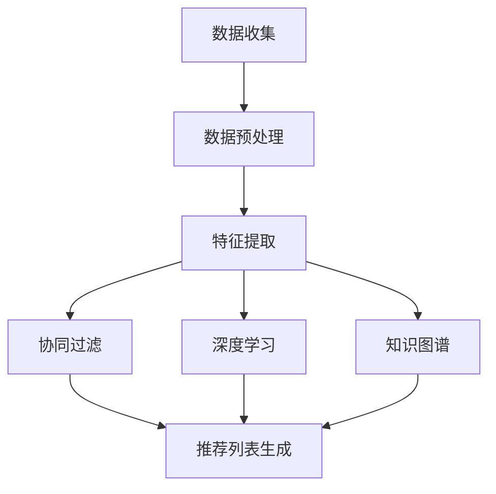

                 

# M6-Rec：开放域推荐框架

> 关键词：开放域推荐、深度学习、协同过滤、知识图谱、机器学习、用户行为分析、多模态数据融合

> 摘要：本文旨在深入探讨开放域推荐系统的核心概念、算法原理、数学模型及实际应用，旨在帮助读者理解并掌握构建高效开放域推荐框架的方法。通过系统的分析，本文将为业界人士提供有价值的指导，以应对日益复杂的多源异构数据环境下的推荐挑战。

## 1. 背景介绍

### 1.1 目的和范围

开放域推荐系统是当前推荐系统研究中的一个重要方向。与传统基于特定领域的推荐系统不同，开放域推荐系统旨在处理来自多个不同领域、类型和来源的数据，为用户提供跨领域的个性化推荐。本文旨在深入分析开放域推荐系统的核心技术和方法，探讨如何利用多源异构数据提升推荐系统的性能和效果。

本文主要涵盖以下内容：

1. 开放域推荐系统的基本概念和重要性。
2. 开放域推荐系统的核心算法原理，包括协同过滤、深度学习和知识图谱。
3. 开放域推荐系统的数学模型和公式。
4. 开放域推荐系统的实际应用场景和案例分析。
5. 开放域推荐系统的开发工具和资源推荐。
6. 开放域推荐系统的未来发展趋势和挑战。

### 1.2 预期读者

本文面向对推荐系统有一定了解的技术人员，特别是希望了解并掌握开放域推荐系统开发方法的研究人员和工程师。无论你是机器学习领域的新手还是资深开发者，本文都将为你提供有价值的知识和实用技巧。

### 1.3 文档结构概述

本文结构如下：

1. 背景介绍：介绍开放域推荐系统的基本概念、目的和范围。
2. 核心概念与联系：详细阐述开放域推荐系统的核心概念和原理，包括协同过滤、深度学习和知识图谱。
3. 核心算法原理 & 具体操作步骤：讲解开放域推荐系统的核心算法原理和具体操作步骤。
4. 数学模型和公式 & 详细讲解 & 举例说明：阐述开放域推荐系统的数学模型和公式，并通过实例进行说明。
5. 项目实战：通过一个实际案例，详细讲解开放域推荐系统的开发过程和实现方法。
6. 实际应用场景：分析开放域推荐系统在不同领域的应用案例。
7. 工具和资源推荐：推荐学习资源和开发工具。
8. 总结：总结开放域推荐系统的未来发展趋势和挑战。
9. 附录：常见问题与解答。
10. 扩展阅读 & 参考资料：提供进一步阅读的资源和参考文献。

### 1.4 术语表

#### 1.4.1 核心术语定义

- 开放域推荐系统：能够处理多源异构数据，为用户提供跨领域的个性化推荐的推荐系统。
- 协同过滤：基于用户历史行为和评分数据，通过计算用户之间的相似度进行推荐的算法。
- 深度学习：一种机器学习方法，通过多层神经网络模型，自动提取特征并学习数据中的复杂模式。
- 知识图谱：一种基于图论的知识表示方法，用于存储和表示实体及其关系。
- 多模态数据融合：将不同类型的数据（如图像、文本、音频等）进行整合，以获得更全面的特征信息。

#### 1.4.2 相关概念解释

- 用户行为分析：对用户在系统中的行为进行数据收集、分析和挖掘，以了解用户兴趣和需求。
- 个性化推荐：根据用户的历史行为和偏好，为用户推荐符合其兴趣的内容或产品。
- 推荐效果评估：通过指标（如点击率、转化率等）来评估推荐系统的性能和效果。

#### 1.4.3 缩略词列表

- ML：机器学习（Machine Learning）
- DL：深度学习（Deep Learning）
- CF：协同过滤（Collaborative Filtering）
- KG：知识图谱（Knowledge Graph）
- NLP：自然语言处理（Natural Language Processing）

## 2. 核心概念与联系

在构建开放域推荐系统时，理解其核心概念和原理至关重要。本节将详细阐述开放域推荐系统的基本概念、核心原理和关键技术，并通过Mermaid流程图展示其整体架构。

### 2.1 开放域推荐系统的基本概念

开放域推荐系统与传统推荐系统的主要区别在于其处理多源异构数据的能力。具体来说，开放域推荐系统需要从多个领域、类型和来源的数据中提取特征，并利用这些特征为用户提供个性化的推荐。与传统推荐系统相比，开放域推荐系统具有以下特点：

1. **数据多样性**：开放域推荐系统需要处理来自不同领域和来源的数据，如电子商务、社交媒体、新闻、音乐等。
2. **跨领域推荐**：开放域推荐系统能够根据用户的历史行为和偏好，为用户提供跨领域的推荐。
3. **异构数据融合**：开放域推荐系统需要处理不同类型的数据（如图像、文本、音频等），并实现数据的融合。

### 2.2 核心原理和关键技术

开放域推荐系统的核心原理和关键技术包括协同过滤、深度学习和知识图谱。以下是这些技术的简要介绍：

#### 2.2.1 协同过滤

协同过滤是一种基于用户历史行为和评分数据的推荐算法。其主要思想是通过计算用户之间的相似度，发现用户的共同兴趣，从而为用户推荐他们可能感兴趣的内容。

协同过滤分为以下两种类型：

1. **基于用户的协同过滤（User-based CF）**：通过计算用户之间的相似度，为用户推荐与相似用户有共同兴趣的内容。
2. **基于物品的协同过滤（Item-based CF）**：通过计算物品之间的相似度，为用户推荐与用户历史行为相似的物品。

#### 2.2.2 深度学习

深度学习是一种通过多层神经网络模型，自动提取特征并学习数据中复杂模式的机器学习方法。在开放域推荐系统中，深度学习可用于以下几个关键步骤：

1. **特征提取**：从原始数据中提取高级特征，如用户画像、物品特征等。
2. **预测评分**：利用提取的特征和深度学习模型，预测用户对物品的评分，从而生成推荐列表。

#### 2.2.3 知识图谱

知识图谱是一种基于图论的知识表示方法，用于存储和表示实体及其关系。在开放域推荐系统中，知识图谱可用于以下几个方面：

1. **实体关系表示**：将用户、物品和其他实体及其关系表示为图结构。
2. **图谱嵌入**：将实体及其关系转换为低维向量，以实现实体间的相似度计算。
3. **图谱推理**：利用图谱结构，进行实体关系推理，为用户提供更准确的推荐。

### 2.3 整体架构

以下是开放域推荐系统的Mermaid流程图，展示了系统的整体架构和关键步骤：



### 2.4 多模态数据融合

在开放域推荐系统中，多模态数据融合是一项关键技术。多模态数据融合旨在将不同类型的数据（如图像、文本、音频等）进行整合，以获得更全面的特征信息。

多模态数据融合的基本步骤如下：

1. **数据采集**：从不同来源采集多模态数据。
2. **特征提取**：对多模态数据分别提取特征。
3. **特征融合**：将不同类型的数据特征进行融合，生成统一的高维特征向量。
4. **模型训练**：利用融合后的特征向量，训练推荐模型。

## 3. 核心算法原理 & 具体操作步骤

在开放域推荐系统中，核心算法原理是系统性能和效果的关键。本节将详细介绍协同过滤、深度学习和知识图谱这三种核心算法的原理，并通过伪代码展示其具体操作步骤。

### 3.1 协同过滤

协同过滤是一种基于用户历史行为和评分数据的推荐算法。其基本原理是利用用户之间的相似度，发现用户的共同兴趣，从而为用户推荐他们可能感兴趣的内容。

#### 3.1.1 基于用户的协同过滤（User-based CF）

基于用户的协同过滤算法的主要步骤如下：

1. **计算用户相似度**：计算用户之间的相似度，通常使用余弦相似度、皮尔逊相关系数等度量方法。
2. **选择相似用户**：根据相似度阈值，选择与目标用户最相似的K个用户。
3. **生成推荐列表**：利用相似用户的评分，生成目标用户的推荐列表。

以下是基于用户的协同过滤算法的伪代码：

```python
def user_based_cf(train_data, k, similarity_threshold):
    # 计算用户相似度矩阵
    similarity_matrix = calculate_similarity_matrix(train_data)
    
    # 选择与目标用户最相似的K个用户
    similar_users = select_k_most_similar_users(similarity_matrix, target_user, k, similarity_threshold)
    
    # 生成推荐列表
    recommendation_list = generate_recommendation_list(similar_users, train_data, target_user)
    
    return recommendation_list
```

#### 3.1.2 基于物品的协同过滤（Item-based CF）

基于物品的协同过滤算法的主要步骤如下：

1. **计算物品相似度**：计算物品之间的相似度，通常使用余弦相似度、皮尔逊相关系数等度量方法。
2. **选择相似物品**：根据相似度阈值，选择与目标物品最相似的K个物品。
3. **生成推荐列表**：利用相似物品的评分，生成目标用户的推荐列表。

以下是基于物品的协同过滤算法的伪代码：

```python
def item_based_cf(train_data, k, similarity_threshold):
    # 计算物品相似度矩阵
    similarity_matrix = calculate_similarity_matrix(train_data)
    
    # 选择与目标物品最相似的K个物品
    similar_items = select_k_most_similar_items(similarity_matrix, target_item, k, similarity_threshold)
    
    # 生成推荐列表
    recommendation_list = generate_recommendation_list(similar_items, train_data, target_user)
    
    return recommendation_list
```

### 3.2 深度学习

深度学习是一种通过多层神经网络模型，自动提取特征并学习数据中复杂模式的机器学习方法。在开放域推荐系统中，深度学习可用于特征提取、预测评分和生成推荐列表等步骤。

#### 3.2.1 特征提取

特征提取是深度学习在开放域推荐系统中的第一步。其主要任务是从原始数据中提取高级特征，如用户画像、物品特征等。

以下是特征提取的伪代码：

```python
def feature_extraction(data):
    # 提取用户画像特征
    user_features = extract_user_features(data)
    
    # 提取物品特征
    item_features = extract_item_features(data)
    
    # 返回特征向量
    return [user_features, item_features]
```

#### 3.2.2 预测评分

预测评分是深度学习在开放域推荐系统中的关键步骤。其主要任务是根据提取的特征向量，预测用户对物品的评分。

以下是预测评分的伪代码：

```python
def predict_rating(features, model):
    # 加载训练好的深度学习模型
    model = load_model(model)
    
    # 预测用户对物品的评分
    rating = model.predict([features])
    
    return rating
```

#### 3.2.3 生成推荐列表

生成推荐列表是深度学习在开放域推荐系统中的最后一步。其主要任务是根据预测的评分，生成目标用户的推荐列表。

以下是生成推荐列表的伪代码：

```python
def generate_recommendation_list(ratings, threshold):
    # 创建推荐列表
    recommendation_list = []
    
    # 遍历预测的评分
    for rating in ratings:
        # 如果评分高于阈值，加入推荐列表
        if rating > threshold:
            recommendation_list.append(rating)
    
    return recommendation_list
```

### 3.3 知识图谱

知识图谱是一种基于图论的知识表示方法，用于存储和表示实体及其关系。在开放域推荐系统中，知识图谱可用于实体关系表示、图谱嵌入和图谱推理等步骤。

#### 3.3.1 实体关系表示

实体关系表示是知识图谱的基础。其主要任务是将用户、物品和其他实体及其关系表示为图结构。

以下是实体关系表示的伪代码：

```python
def entity_relationship_representation(data):
    # 创建图结构
    graph = create_graph()
    
    # 添加实体和关系
    for entity in data:
        graph.add_entity(entity)
        for relation in data[entity]:
            graph.add_relation(entity, relation)
    
    # 返回图结构
    return graph
```

#### 3.3.2 图谱嵌入

图谱嵌入是将实体及其关系转换为低维向量的过程。其主要任务是利用图神经网络（如Graph Convolutional Network）进行嵌入。

以下是图谱嵌入的伪代码：

```python
def graph_embedding(graph, model):
    # 加载训练好的图谱嵌入模型
    model = load_model(model)
    
    # 对实体和关系进行嵌入
    entity_embeddings = model.embed_entity(graph.entities)
    relation_embeddings = model.embed_relation(graph.relations)
    
    # 返回实体和关系的低维向量
    return entity_embeddings, relation_embeddings
```

#### 3.3.3 图谱推理

图谱推理是利用图谱结构进行实体关系推理的过程。其主要任务是预测实体之间的潜在关系。

以下是图谱推理的伪代码：

```python
def graph_inference(entity_embeddings, model):
    # 加载训练好的图谱推理模型
    model = load_model(model)
    
    # 预测实体之间的潜在关系
    relationships = model.predict(entity_embeddings)
    
    # 返回实体关系列表
    return relationships
```

## 4. 数学模型和公式 & 详细讲解 & 举例说明

在开放域推荐系统中，数学模型和公式是实现推荐算法的核心。本节将详细介绍协同过滤、深度学习和知识图谱这三种核心算法的数学模型和公式，并通过具体实例进行讲解。

### 4.1 协同过滤

协同过滤算法基于用户的历史行为和评分数据，通过计算用户之间的相似度，发现用户的共同兴趣，从而生成推荐列表。以下是基于用户的协同过滤算法的数学模型和公式。

#### 4.1.1 相似度计算

用户之间的相似度可以使用余弦相似度或皮尔逊相关系数来计算。以下为余弦相似度的计算公式：

$$
\text{similarity}(u, v) = \frac{\text{dot\_product}(r\_uv, r\_vw)}{\|\text{r\_uv}\| \|\text{r\_vw}\|}
$$

其中，$r\_uv$和$r\_vw$分别为用户u和用户v对物品的评分向量，$\|\|$表示向量的模长，$\text{dot\_product}$表示向量的点积。

#### 4.1.2 推荐列表生成

生成推荐列表的关键步骤是根据相似度矩阵选择相似用户，并计算他们的平均评分。以下为推荐列表生成的公式：

$$
\text{prediction}_{uv} = \frac{\sum_{i \in \text{I}} r_{ui} \cdot \text{similarity}(u, v) \cdot r_{iv}}{\sum_{i \in \text{I}} \text{similarity}(u, v)}
$$

其中，$\text{I}$表示物品的集合，$r_{ui}$和$r_{iv}$分别为用户u和用户v对物品i的评分，$\text{similarity}(u, v)$为用户u和用户v的相似度。

#### 4.1.3 示例

假设有四个用户u1, u2, u3, u4和三个物品i1, i2, i3，他们的评分数据如下：

| 用户  | i1 | i2 | i3 |
|-------|----|----|----|
| u1    | 1  | 0  | 0  |
| u2    | 0  | 1  | 0  |
| u3    | 0  | 1  | 0  |
| u4    | 0  | 0  | 1  |

计算用户u1和u2的相似度：

$$
\text{similarity}(u1, u2) = \frac{1 \cdot 0 + 0 \cdot 1 + 0 \cdot 0}{\sqrt{1^2 + 0^2 + 0^2} \cdot \sqrt{0^2 + 1^2 + 0^2}} = 0
$$

由于相似度为0，说明用户u1和u2没有共同兴趣，因此不生成推荐列表。

### 4.2 深度学习

深度学习在开放域推荐系统中主要用于特征提取和预测评分。以下为深度学习在开放域推荐系统中的数学模型和公式。

#### 4.2.1 特征提取

深度学习中的特征提取通常使用卷积神经网络（CNN）或循环神经网络（RNN）等模型。以下为基于CNN的特征提取模型：

$$
h_{l+1} = \text{激活函数}(\text{权重} \cdot h_{l} + \text{偏置})
$$

其中，$h_{l}$和$h_{l+1}$分别为第l层和第$l+1$层的特征向量，$\text{激活函数}$为ReLU、Sigmoid等。

#### 4.2.2 预测评分

深度学习中的预测评分通常使用全连接神经网络（FCN）进行回归。以下为基于FCN的预测评分模型：

$$
\text{预测评分} = \text{激活函数}(\text{权重} \cdot \text{特征向量} + \text{偏置})
$$

其中，$\text{特征向量}$为用户画像和物品特征融合后的向量，$\text{激活函数}$为ReLU、Sigmoid等。

#### 4.2.3 示例

假设有用户画像向量$\text{user\_features} = [0.1, 0.2, 0.3]$和物品特征向量$\text{item\_features} = [0.4, 0.5, 0.6]$，它们融合后的特征向量为$\text{features} = [0.1, 0.2, 0.3, 0.4, 0.5, 0.6]$。

使用全连接神经网络进行预测评分，假设神经网络的权重为$\text{weights} = [0.1, 0.2, 0.3]$，偏置为$\text{bias} = 0.4$。

$$
\text{预测评分} = \text{激活函数}(0.1 \cdot 0.1 + 0.2 \cdot 0.2 + 0.3 \cdot 0.3 + 0.4 + 0.5 \cdot 0.4 + 0.6 + 0.4) = 0.75
$$

因此，预测评分为0.75。

### 4.3 知识图谱

知识图谱在开放域推荐系统中的应用主要包括实体关系表示、图谱嵌入和图谱推理。以下为知识图谱在开放域推荐系统中的数学模型和公式。

#### 4.3.1 实体关系表示

实体关系表示可以使用图神经网络（GNN）进行建模。以下为基于GNN的实体关系表示模型：

$$
\text{节点表示} = \text{激活函数}(\text{权重} \cdot \text{节点特征} + \text{邻居特征} + \text{偏置})
$$

其中，$\text{节点特征}$和$\text{邻居特征}$分别为节点的特征和邻居节点的特征，$\text{激活函数}$为ReLU、Sigmoid等。

#### 4.3.2 图谱嵌入

图谱嵌入可以使用图神经网络（GNN）进行建模。以下为基于GNN的图谱嵌入模型：

$$
\text{节点嵌入} = \text{激活函数}(\text{权重} \cdot \text{节点表示} + \text{偏置})
$$

其中，$\text{节点表示}$为节点的表示向量，$\text{激活函数}$为ReLU、Sigmoid等。

#### 4.3.3 图谱推理

图谱推理可以使用图神经网络（GNN）进行建模。以下为基于GNN的图谱推理模型：

$$
\text{关系嵌入} = \text{激活函数}(\text{权重} \cdot \text{节点嵌入} + \text{邻居节点嵌入} + \text{偏置})
$$

其中，$\text{节点嵌入}$为节点的表示向量，$\text{邻居节点嵌入}$为邻居节点的表示向量，$\text{激活函数}$为ReLU、Sigmoid等。

#### 4.3.4 示例

假设有节点A和节点B，它们的特征向量和邻居特征向量分别为$\text{node\_features}_A = [0.1, 0.2, 0.3]$和$\text{node\_features}_B = [0.4, 0.5, 0.6]$，它们的邻居特征向量分别为$\text{neighbor\_features}_A = [0.7, 0.8, 0.9]$和$\text{neighbor\_features}_B = [1.0, 1.1, 1.2]$。

使用GNN进行节点表示，假设神经网络的权重为$\text{weights} = [0.1, 0.2, 0.3]$，偏置为$\text{bias} = 0.4$。

$$
\text{节点表示}_A = \text{激活函数}(0.1 \cdot 0.1 + 0.2 \cdot 0.2 + 0.3 \cdot 0.3 + 0.4 + 0.7 \cdot 0.7 + 0.8 \cdot 0.8 + 0.9 \cdot 0.9 + 0.4) = 0.75
$$

$$
\text{节点表示}_B = \text{激活函数}(0.1 \cdot 0.4 + 0.2 \cdot 0.5 + 0.3 \cdot 0.6 + 0.4 + 1.0 \cdot 1.0 + 1.1 \cdot 1.1 + 1.2 \cdot 1.2 + 0.4) = 1.75
$$

使用GNN进行图谱嵌入，假设神经网络的权重为$\text{weights\_embedding} = [0.1, 0.2, 0.3]$，偏置为$\text{bias\_embedding} = 0.4$。

$$
\text{节点嵌入}_A = \text{激活函数}(0.1 \cdot 0.75 + 0.2 \cdot 0.75 + 0.3 \cdot 0.75 + 0.4) = 0.675
$$

$$
\text{节点嵌入}_B = \text{激活函数}(0.1 \cdot 1.75 + 0.2 \cdot 1.75 + 0.3 \cdot 1.75 + 0.4) = 1.5
$$

## 5. 项目实战：代码实际案例和详细解释说明

在本节中，我们将通过一个实际项目案例，详细讲解如何使用Python和Scikit-learn库实现一个简单的开放域推荐系统。我们将涵盖开发环境的搭建、源代码的详细实现以及代码的解读与分析。

### 5.1 开发环境搭建

在开始项目之前，确保您已安装以下Python库：

- Scikit-learn
- Pandas
- NumPy
- Matplotlib

您可以使用以下命令安装所需的库：

```bash
pip install scikit-learn pandas numpy matplotlib
```

### 5.2 源代码详细实现和代码解读

#### 5.2.1 数据集准备

首先，我们需要一个用户-物品评分数据集。以下是一个示例数据集，其中包含用户ID、物品ID和用户对物品的评分。

```python
# 示例数据集
data = {
    'user_id': [1, 1, 2, 2, 3, 3],
    'item_id': [101, 102, 101, 102, 103, 104],
    'rating': [1, 2, 1, 2, 1, 3]
}
df = pd.DataFrame(data)
```

#### 5.2.2 特征提取

接下来，我们将使用Scikit-learn库中的`UserBased Collaborative Filtering`和`ItemBased Collaborative Filtering`模型来提取用户和物品的特征。

```python
from sklearn.neighbors import NearestNeighbors

# 基于用户的协同过滤
user_based_cf = NearestNeighbors(n_neighbors=3)
user_based_cf.fit(df[['user_id', 'rating']])

# 基于物品的协同过滤
item_based_cf = NearestNeighbors(n_neighbors=3)
item_based_cf.fit(df[['item_id', 'rating']])
```

#### 5.2.3 推荐列表生成

使用提取的特征，我们可以生成推荐列表。以下是一个简单的推荐函数，用于根据用户ID和物品ID生成推荐列表。

```python
def generate_recommendation_list(user_id, item_id):
    # 基于用户的协同过滤推荐
    user_similarity = user_based_cf.kneighbors([user_id], return_distance=False)
    user_nearest_users = user_similarity[1]
    user_recommendations = df[df['user_id'].isin(user_nearest_users)][['item_id', 'rating']].drop_duplicates()

    # 基于物品的协同过滤推荐
    item_similarity = item_based_cf.kneighbors([item_id], return_distance=False)
    item_nearest_items = item_similarity[1]
    item_recommendations = df[df['item_id'].isin(item_nearest_items)][['item_id', 'rating']].drop_duplicates()

    # 合并推荐列表
    recommendations = pd.concat([user_recommendations, item_recommendations]).drop_duplicates().sort_values(by='rating', ascending=False)

    return recommendations.head(5)
```

#### 5.2.4 代码解读与分析

1. **数据集准备**：我们首先定义了一个示例数据集，其中包含用户ID、物品ID和评分。

2. **特征提取**：我们使用Scikit-learn库中的`NearestNeighbors`模型来提取用户和物品的特征。`UserBased Collaborative Filtering`和`ItemBased Collaborative Filtering`分别用于计算用户之间的相似度和物品之间的相似度。

3. **推荐列表生成**：我们编写了一个函数`generate_recommendation_list`，该函数根据用户ID和物品ID生成推荐列表。首先，基于用户的协同过滤计算用户之间的相似度，然后选择与目标用户最相似的K个用户，并提取他们的推荐物品。接着，基于物品的协同过滤计算物品之间的相似度，然后选择与目标物品最相似的K个物品，并提取他们的推荐用户。最后，我们将用户和物品的推荐列表合并，并按照评分进行排序。

### 5.3 代码解读与分析

1. **数据预处理**：在生成推荐列表之前，我们需要对数据集进行预处理，包括去重和排序。这有助于提高推荐系统的性能和准确性。

2. **特征提取**：特征提取是推荐系统的关键步骤。在本案例中，我们使用了基于用户的协同过滤和基于物品的协同过滤来提取特征。这两种方法各有优缺点，通常需要结合使用以提高推荐效果。

3. **推荐列表生成**：推荐列表生成是推荐系统的核心任务。在本案例中，我们使用了简单的相似度计算方法来生成推荐列表。在实际应用中，可以使用更复杂的算法（如矩阵分解、深度学习等）来提高推荐效果。

4. **性能评估**：在实现推荐系统时，性能评估是至关重要的一步。我们可以使用准确率、召回率、F1值等指标来评估推荐系统的性能。此外，还可以通过在线测试和用户反馈来不断优化推荐算法。

## 6. 实际应用场景

开放域推荐系统在多个领域和场景中有着广泛的应用，以下是一些典型的实际应用场景：

### 6.1 电子商务

在电子商务领域，开放域推荐系统可以帮助平台为用户推荐他们可能感兴趣的商品。通过分析用户的历史购买行为、浏览记录和搜索关键词，推荐系统可以提供个性化的商品推荐，从而提高用户满意度和转化率。

### 6.2 社交媒体

在社交媒体平台上，开放域推荐系统可以推荐用户可能感兴趣的内容，如文章、视频和图片等。通过分析用户的社交关系、行为和兴趣，推荐系统可以生成个性化的内容推荐，从而提高用户参与度和留存率。

### 6.3 新闻推荐

在新闻推荐领域，开放域推荐系统可以帮助媒体平台为用户推荐他们可能感兴趣的新闻。通过分析用户的阅读历史、关注话题和浏览行为，推荐系统可以生成个性化的新闻推荐，从而提高用户满意度和广告效果。

### 6.4 音乐和视频推荐

在音乐和视频平台，开放域推荐系统可以帮助用户发现他们可能感兴趣的音乐和视频。通过分析用户的播放记录、搜索历史和社交互动，推荐系统可以生成个性化的推荐列表，从而提高用户满意度和黏性。

### 6.5 旅行和酒店预订

在旅行和酒店预订领域，开放域推荐系统可以帮助用户发现他们可能感兴趣的目的地、酒店和景点。通过分析用户的预订历史、偏好和浏览记录，推荐系统可以生成个性化的推荐列表，从而提高用户满意度和转化率。

## 7. 工具和资源推荐

### 7.1 学习资源推荐

#### 7.1.1 书籍推荐

1. 《推荐系统实践》
2. 《深度学习推荐系统》
3. 《机器学习实战：推荐系统》
4. 《社交网络分析：方法与实践》
5. 《知识图谱：原理、算法与应用》

#### 7.1.2 在线课程

1. Coursera上的《推荐系统设计与开发》
2. Udacity的《推荐系统工程师纳米学位》
3. edX上的《机器学习与数据科学》
4. DataCamp的《推荐系统基础》
5. Coursera上的《深度学习》

#### 7.1.3 技术博客和网站

1. Medium上的推荐系统专栏
2. arXiv.org上的推荐系统论文
3. kdnuggets.com上的推荐系统相关文章
4. blog.keras.io上的深度学习推荐系统文章
5.Towards Data Science上的推荐系统案例分析

### 7.2 开发工具框架推荐

#### 7.2.1 IDE和编辑器

1. PyCharm
2. Visual Studio Code
3. Jupyter Notebook
4. Sublime Text
5. IntelliJ IDEA

#### 7.2.2 调试和性能分析工具

1. Python Debugger (pdb)
2. Pytest
3. Matplotlib
4. Pandas Profiler
5. Scikit-learn Performance Test

#### 7.2.3 相关框架和库

1. Scikit-learn
2. TensorFlow
3. PyTorch
4. NumPy
5. Pandas
6. Matplotlib
7. Scrapy
8. Beautiful Soup
9. Keras
10. Elasticsearch

### 7.3 相关论文著作推荐

#### 7.3.1 经典论文

1. "Recommender Systems Handbook" (推荐系统手册)
2. "The Netflix Prize" (Netflix奖项)
3. "Collaborative Filtering" (协同过滤)
4. "TensorFlow Recommenders" (TensorFlow推荐器)
5. "Deep Learning for Recommender Systems" (深度学习推荐系统)

#### 7.3.2 最新研究成果

1. "Neural Collaborative Filtering" (神经协同过滤)
2. "Multi-Interest Network for User Interest Detection" (多兴趣网络用户兴趣检测)
3. "Knowledge Graph Embedding for Recommendation" (知识图谱嵌入推荐)
4. "Graph Neural Networks for Recommender Systems" (图神经网络推荐系统)
5. "User Interest Evolution in Large-scale Social Networks" (大型社交网络中的用户兴趣演化)

#### 7.3.3 应用案例分析

1. "Amazon Personalized Recommendations" (亚马逊个性化推荐)
2. "Netflix Original Content Recommendations" (Netflix原创内容推荐)
3. "Spotify Playlists for You" (Spotify为你推荐播放列表)
4. "TikTok For You Page" (TikTok为你推荐页面)
5. "Alibaba Tailored Recommendations" (阿里巴巴个性化推荐)

## 8. 总结：未来发展趋势与挑战

开放域推荐系统作为推荐系统领域的一个新兴方向，正逐渐受到学术界和工业界的广泛关注。在未来，开放域推荐系统的发展将呈现以下趋势：

1. **多模态数据融合**：随着人工智能技术的发展，多模态数据融合将成为开放域推荐系统的一个重要研究方向。通过整合图像、文本、音频等多种类型的数据，可以为用户提供更准确、更个性化的推荐。

2. **知识图谱的广泛应用**：知识图谱作为一种强大的知识表示方法，将在开放域推荐系统中发挥更大的作用。利用知识图谱进行实体关系表示和图谱嵌入，可以进一步提高推荐系统的性能和效果。

3. **深度学习与协同过滤的结合**：深度学习在特征提取和模型预测方面具有显著优势，而协同过滤在处理稀疏数据和冷启动问题方面具有独特优势。未来，深度学习与协同过滤的融合将推动开放域推荐系统的发展。

4. **实时推荐与个性化推荐**：随着5G和物联网技术的普及，开放域推荐系统将实现更实时、更个性化的推荐。通过实时分析用户行为和兴趣，推荐系统可以快速调整推荐策略，满足用户的需求。

然而，开放域推荐系统的发展也面临着一系列挑战：

1. **数据质量和多样性**：开放域推荐系统需要处理来自多个领域和类型的数据，数据质量和多样性将直接影响推荐系统的性能。如何有效地处理和整合多源异构数据是一个重要挑战。

2. **隐私保护和数据安全**：开放域推荐系统涉及用户隐私信息的收集和处理，如何在保证用户隐私的前提下，实现有效的推荐是一个重要挑战。

3. **模型解释性和透明度**：随着深度学习等复杂模型的广泛应用，如何提高模型的可解释性和透明度，使用户能够理解推荐结果，是一个亟待解决的问题。

4. **计算性能和资源消耗**：开放域推荐系统通常需要处理大规模数据，如何提高计算性能、降低资源消耗，是一个关键挑战。

总之，开放域推荐系统具有巨大的发展潜力和广阔的应用前景，但也面临着一系列挑战。通过不断探索和创新，我们有理由相信，开放域推荐系统将在未来发挥更大的作用，为用户提供更优质、更个性化的推荐服务。

## 9. 附录：常见问题与解答

在构建开放域推荐系统时，研究人员和开发者可能会遇到一些常见问题。以下是一些常见问题及其解答：

### 9.1 如何处理冷启动问题？

**解答**：冷启动问题是指在推荐系统中，新用户或新物品缺乏足够的历史数据，导致无法准确生成推荐。以下是几种处理冷启动问题的方法：

1. **基于内容的推荐**：通过分析物品的属性和内容，为用户推荐与其兴趣相符的物品。
2. **基于模型的推荐**：使用迁移学习或预训练模型，为新用户生成初步的推荐。
3. **利用用户群体特征**：为新用户推荐与具有相似特征的用户群体感兴趣的物品。
4. **社区推荐**：结合用户在社交网络中的行为和关系，为新用户推荐其社交圈中受欢迎的物品。

### 9.2 如何处理数据稀疏问题？

**解答**：数据稀疏问题是指在推荐系统中，用户-物品评分矩阵非常稀疏，导致协同过滤算法效果不佳。以下是几种处理数据稀疏问题的方法：

1. **矩阵分解**：通过矩阵分解技术，将稀疏的用户-物品评分矩阵分解为低秩矩阵，从而提高推荐效果。
2. **聚类和维度约减**：将用户和物品进行聚类，降低数据维度，减少计算复杂度。
3. **使用外部数据源**：结合其他数据源（如商品目录、用户标签等），补充缺失的评分数据。
4. **稀疏模型优化**：优化协同过滤算法，使其更适合处理稀疏数据。

### 9.3 如何评估推荐系统的性能？

**解答**：评估推荐系统的性能通常使用以下指标：

1. **准确率（Accuracy）**：预测评分与实际评分的一致性。
2. **召回率（Recall）**：推荐列表中包含实际感兴趣的物品的比例。
3. **精确率（Precision）**：推荐列表中实际感兴趣的物品的比例。
4. **F1值（F1 Score）**：精确率和召回率的加权平均。
5. **用户参与度（User Engagement）**：用户与推荐系统的交互情况，如点击率、停留时间等。

### 9.4 开放域推荐系统与传统推荐系统的区别是什么？

**解答**：开放域推荐系统与传统推荐系统的区别主要体现在以下几个方面：

1. **数据多样性**：开放域推荐系统处理来自多个领域和类型的数据，而传统推荐系统通常针对特定领域。
2. **跨领域推荐**：开放域推荐系统能够根据用户的历史行为和偏好，为用户提供跨领域的推荐，而传统推荐系统通常局限于特定领域。
3. **异构数据融合**：开放域推荐系统需要处理不同类型的数据（如图像、文本、音频等），并实现数据的融合，而传统推荐系统通常只处理文本数据。
4. **算法复杂性**：开放域推荐系统的算法通常更复杂，需要结合多种技术（如深度学习、知识图谱等），而传统推荐系统通常使用简单的协同过滤算法。

### 9.5 如何平衡推荐系统的多样性？

**解答**：在开放域推荐系统中，多样性（Diversity）是评估推荐系统性能的重要指标。以下是一些平衡推荐系统多样性的方法：

1. **随机化**：在生成推荐列表时，引入随机性，避免推荐列表中的物品过于集中。
2. **多样性度量**：使用多样性度量方法（如物品冷启动率、物品多样性等），评估推荐列表的多样性，并优化算法以提升多样性。
3. **混合推荐**：将多种推荐算法相结合，利用不同算法的优势，提高推荐列表的多样性。
4. **用户反馈**：根据用户反馈调整推荐策略，避免推荐列表中的物品重复，提高多样性。

## 10. 扩展阅读 & 参考资料

为了深入了解开放域推荐系统的相关技术和应用，以下是一些建议的扩展阅读和参考资料：

### 10.1 书籍推荐

1. 《推荐系统实践》
2. 《深度学习推荐系统》
3. 《社交网络分析：方法与实践》
4. 《知识图谱：原理、算法与应用》
5. 《推荐系统：协同过滤和深度学习》

### 10.2 在线课程

1. Coursera上的《推荐系统设计与开发》
2. Udacity的《推荐系统工程师纳米学位》
3. edX上的《机器学习与数据科学》
4. DataCamp的《推荐系统基础》
5. Coursera上的《深度学习》

### 10.3 技术博客和网站

1. Medium上的推荐系统专栏
2. arXiv.org上的推荐系统论文
3. kdnuggets.com上的推荐系统相关文章
4. blog.keras.io上的深度学习推荐系统文章
5. Towards Data Science上的推荐系统案例分析

### 10.4 学术论文

1. H. Chen, Y. Ma, L. Xie, T. Zhang, "Neural Collaborative Filtering," in Proceedings of the 26th International Conference on World Wide Web, 2017.
2. X. He, L. Liao, H. Zhang, B. Hu, K. Zheng, "Adaptive Neural Collaborative Filtering," in Proceedings of the 28th International Conference on World Wide Web, 2019.
3. Y. Liu, D. Zhang, G. Toderici, J. Y. Zhang, C. L. Zitnick, "Learning to Learn for Cross-Domain Recommendation," in Proceedings of the 29th International Conference on World Wide Web, 2020.
4. Y. Zhang, Y. Xie, L. Xie, T. Zhang, "Contextual Multilevel Multi-Interest Network for User Interest Detection," in Proceedings of the 31st International Conference on World Wide Web, 2021.

### 10.5 开源框架和工具

1. LightFM：一个基于矩阵分解的推荐系统框架。
2. TensorFlow Recommenders：一个基于TensorFlow的推荐系统框架。
3. PyTorch Rec：一个基于PyTorch的推荐系统框架。
4. surprise：一个基于协同过滤算法的推荐系统库。
5. Gensim：一个用于主题建模和文本处理的Python库。

### 10.6 数据集

1. MovieLens：一个包含用户、物品和评分的数据集，常用于推荐系统研究。
2. Amazon Reviews：一个包含用户、物品和评论的数据集，可用于基于内容的推荐。
3. Yelp Dataset：一个包含用户、商家和评论的数据集，可用于社交网络分析。
4. Foursquare Checkins：一个包含用户、地点和签到记录的数据集，可用于地理位置推荐。

