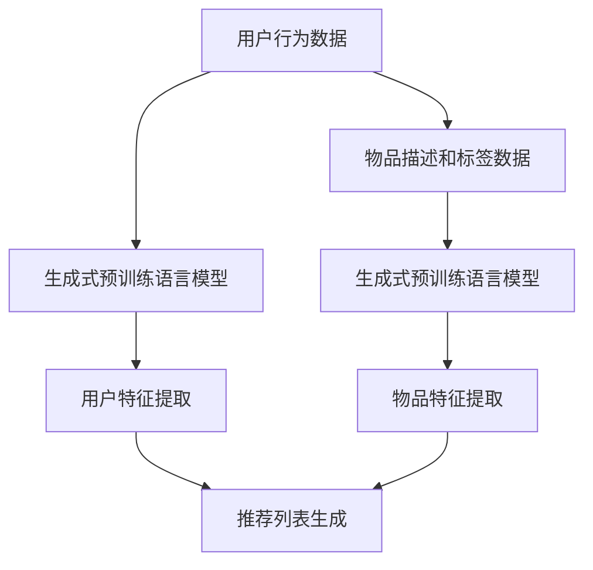

                 

# M6-Rec：基于生成式预训练语言模型的开放式推荐

> **关键词：**生成式预训练语言模型，开放式推荐，用户行为分析，推荐算法，个性化推荐

> **摘要：**本文将探讨基于生成式预训练语言模型的开放式推荐系统。首先介绍推荐系统的基础知识，然后深入分析生成式预训练语言模型及其在推荐系统中的应用。接着，我们将详细解析M6-Rec算法的原理和步骤，并通过一个实际项目案例进行代码实现和解释。最后，我们将讨论这一技术的实际应用场景、相关工具和资源，以及未来的发展趋势与挑战。

## 1. 背景介绍

### 1.1 目的和范围

本文旨在探讨生成式预训练语言模型在开放式推荐系统中的应用。我们将从推荐系统的基础知识出发，逐步深入到生成式预训练语言模型的核心概念，并分析其在推荐系统中的应用优势。本文将重点介绍M6-Rec算法的原理、实现步骤以及实际应用案例，帮助读者理解并掌握这一前沿技术。

### 1.2 预期读者

本文适合对推荐系统和人工智能有一定了解的读者，包括但不限于：

1. 推荐系统开发工程师
2. 数据科学家
3. 机器学习研究人员
4. 对人工智能和推荐系统感兴趣的学生和研究人员

### 1.3 文档结构概述

本文结构如下：

1. **背景介绍**：介绍推荐系统的基础知识，包括目的、范围和预期读者。
2. **核心概念与联系**：介绍生成式预训练语言模型的核心概念，并通过Mermaid流程图展示其原理和架构。
3. **核心算法原理 & 具体操作步骤**：详细解析M6-Rec算法的原理和操作步骤，包括数学模型和公式。
4. **项目实战：代码实际案例和详细解释说明**：通过实际项目案例，展示M6-Rec算法的实现过程和代码解读。
5. **实际应用场景**：讨论生成式预训练语言模型在推荐系统中的应用场景。
6. **工具和资源推荐**：推荐学习资源、开发工具框架和相关论文著作。
7. **总结：未来发展趋势与挑战**：总结本文的核心内容，探讨未来发展趋势和挑战。
8. **附录：常见问题与解答**：解答读者可能遇到的问题。
9. **扩展阅读 & 参考资料**：提供扩展阅读和参考资料，帮助读者深入了解相关领域。

### 1.4 术语表

#### 1.4.1 核心术语定义

- **推荐系统**：根据用户的兴趣、偏好和历史行为，为用户推荐相关商品、内容或其他信息。
- **生成式预训练语言模型**：一种利用大规模语料库预训练的深度神经网络模型，能够生成自然语言文本。
- **开放式推荐**：推荐系统不依赖于用户显式提供的评分或反馈，而是基于用户行为、内容特征等隐式信息进行推荐。
- **M6-Rec**：一种基于生成式预训练语言模型的开放式推荐算法。

#### 1.4.2 相关概念解释

- **用户行为分析**：对用户在推荐系统上的行为进行数据收集、处理和分析，以了解用户兴趣和偏好。
- **个性化推荐**：根据用户的兴趣和偏好，为用户提供个性化的推荐结果。
- **预训练语言模型**：在大规模语料库上进行预训练的神经网络模型，能够自动学习语言模式和知识。

#### 1.4.3 缩略词列表

- **CNN**：卷积神经网络（Convolutional Neural Network）
- **RNN**：循环神经网络（Recurrent Neural Network）
- **Transformer**：一种基于自注意力机制的深度神经网络模型
- **BERT**：一种双向编码器表示模型（Bidirectional Encoder Representations from Transformers）
- **GPT**：生成预训练语言模型（Generative Pretrained Transformer）

## 2. 核心概念与联系

### 2.1 生成式预训练语言模型

生成式预训练语言模型是一种基于深度学习的自然语言处理模型，通过在大量语料库上进行预训练，能够自动学习语言模式和知识。这种模型的核心思想是利用未标记的文本数据，生成具有良好语言理解和生成能力的模型。常见的生成式预训练语言模型包括GPT（生成预训练语言模型）、BERT（双向编码器表示模型）等。

#### 2.1.1 GPT模型

GPT（Generative Pretrained Transformer）模型是一种基于Transformer架构的生成式预训练语言模型。它通过在大量文本语料库上进行预训练，学习到语言中的上下文关系，并能够生成符合语言规则的文本。GPT模型的训练过程主要包括两个阶段：预训练和微调。

1. **预训练阶段**：在预训练阶段，GPT模型通过无监督的方式学习到语言模式。具体过程如下：
   - 输入一个固定长度的文本序列，将其分割成若干个子序列。
   - 对于每个子序列，模型需要预测下一个子序列，即生成一个连贯的文本序列。
   - 通过计算预测的文本序列与实际文本序列之间的损失，更新模型的参数。

2. **微调阶段**：在微调阶段，GPT模型将预训练得到的模型参数作为起点，针对特定任务进行微调。例如，对于一个文本分类任务，模型需要预测每个文本序列的类别。具体过程如下：
   - 将文本序列输入到GPT模型中，提取序列的表示。
   - 使用提取的表示作为特征，输入到分类器中进行类别预测。
   - 计算预测的类别与实际类别之间的损失，更新模型的参数。

#### 2.1.2 BERT模型

BERT（Bidirectional Encoder Representations from Transformers）模型是一种基于Transformer架构的双向编码器表示模型。它通过在大量文本语料库上进行双向预训练，学习到语言中的上下文关系，并能够生成具有良好语言理解和生成能力的模型。BERT模型的核心思想是利用未标记的文本数据，同时学习到文本的左右两个方向的上下文信息。

1. **预训练阶段**：在预训练阶段，BERT模型通过无监督的方式学习到语言模式。具体过程如下：
   - 输入一个固定长度的文本序列，将其分割成若干个子序列。
   - 对于每个子序列，模型需要预测子序列中的单词，即生成一个连贯的文本序列。
   - 通过计算预测的文本序列与实际文本序列之间的损失，更新模型的参数。

2. **微调阶段**：在微调阶段，BERT模型将预训练得到的模型参数作为起点，针对特定任务进行微调。例如，对于一个文本分类任务，模型需要预测每个文本序列的类别。具体过程如下：
   - 将文本序列输入到BERT模型中，提取序列的表示。
   - 使用提取的表示作为特征，输入到分类器中进行类别预测。
   - 计算预测的类别与实际类别之间的损失，更新模型的参数。

### 2.2 生成式预训练语言模型在推荐系统中的应用

生成式预训练语言模型在推荐系统中的应用主要包括以下几个方面：

1. **用户行为分析**：生成式预训练语言模型可以用于分析用户在推荐系统上的行为，提取用户的兴趣和偏好。通过预训练模型，我们可以对用户的历史行为序列进行建模，并生成具有良好语义表示的用户特征。

2. **内容特征提取**：生成式预训练语言模型可以用于提取推荐物品的内容特征。通过预训练模型，我们可以对物品的文本描述、标签等进行建模，并生成具有良好语义表示的物品特征。

3. **生成个性化推荐**：基于用户特征和物品特征，生成式预训练语言模型可以用于生成个性化的推荐结果。通过模型生成的文本序列，我们可以生成一系列具有良好语义表示的推荐列表，从而实现个性化推荐。

#### 2.2.1 用户行为分析

用户行为分析是推荐系统中的关键环节，通过分析用户在推荐系统上的行为，可以提取用户的兴趣和偏好。生成式预训练语言模型在用户行为分析中的应用主要包括以下几个方面：

1. **用户行为序列建模**：通过生成式预训练语言模型，我们可以对用户的历史行为序列进行建模，提取用户的兴趣和偏好。具体方法如下：
   - 将用户的历史行为序列（如浏览记录、购买记录等）输入到生成式预训练语言模型中。
   - 模型将自动学习到用户的行为模式和兴趣偏好，并生成具有良好语义表示的用户特征。

2. **用户特征提取**：通过生成式预训练语言模型，我们可以从用户的历史行为序列中提取具有良好语义表示的用户特征。具体方法如下：
   - 将用户的历史行为序列输入到生成式预训练语言模型中。
   - 模型将提取序列中的关键信息，并生成具有良好语义表示的用户特征。

3. **用户兴趣和偏好分析**：通过分析用户特征，我们可以了解用户的兴趣和偏好。具体方法如下：
   - 对用户特征进行聚类分析，识别具有相似兴趣和偏好的用户群体。
   - 对用户特征进行关联分析，发现用户的兴趣和偏好之间的关系。

#### 2.2.2 内容特征提取

内容特征提取是推荐系统中的另一个关键环节，通过提取推荐物品的内容特征，可以为推荐算法提供有效的输入。生成式预训练语言模型在内容特征提取中的应用主要包括以下几个方面：

1. **物品描述建模**：通过生成式预训练语言模型，我们可以对推荐物品的文本描述进行建模，提取物品的内容特征。具体方法如下：
   - 将推荐物品的文本描述输入到生成式预训练语言模型中。
   - 模型将自动学习到物品的文本特征，并生成具有良好语义表示的物品特征。

2. **物品标签建模**：通过生成式预训练语言模型，我们可以对推荐物品的标签进行建模，提取物品的内容特征。具体方法如下：
   - 将推荐物品的标签输入到生成式预训练语言模型中。
   - 模型将自动学习到物品的标签特征，并生成具有良好语义表示的物品特征。

3. **物品特征融合**：通过融合物品的描述特征和标签特征，我们可以生成更全面、更准确的物品特征。具体方法如下：
   - 将物品的文本描述和标签分别输入到生成式预训练语言模型中。
   - 对模型生成的物品特征进行融合，得到具有更高语义表示的物品特征。

#### 2.2.3 生成个性化推荐

基于用户特征和物品特征，生成式预训练语言模型可以用于生成个性化的推荐结果。具体方法如下：

1. **推荐列表生成**：通过生成式预训练语言模型，我们可以生成一系列具有良好语义表示的推荐列表。具体方法如下：
   - 将用户特征和物品特征输入到生成式预训练语言模型中。
   - 模型将生成一系列推荐列表，其中每个列表包含若干个具有相似兴趣和偏好的物品。

2. **推荐结果评估**：通过评估生成推荐结果的多样性、新颖性和准确性，我们可以选择最佳的推荐结果。具体方法如下：
   - 对生成的推荐列表进行评估，计算推荐列表的多样性、新颖性和准确性。
   - 根据评估结果，选择最佳的推荐结果，作为最终的推荐结果。

### 2.3 Mermaid流程图

为了更好地展示生成式预训练语言模型在推荐系统中的应用，我们使用Mermaid流程图来描述其核心概念和流程。以下是一个简单的Mermaid流程图示例：



在该流程图中，用户行为数据和物品描述及标签数据分别输入到生成式预训练语言模型中，模型分别提取用户特征和物品特征，然后用于生成个性化的推荐列表。

## 3. 核心算法原理 & 具体操作步骤

### 3.1 M6-Rec算法原理

M6-Rec是一种基于生成式预训练语言模型的开放式推荐算法。它通过在大量用户行为数据和物品描述及标签数据上进行预训练，提取用户特征和物品特征，并利用这些特征生成个性化的推荐列表。M6-Rec算法的核心思想是利用生成式预训练语言模型的自适应能力，从海量数据中挖掘出用户的潜在兴趣和偏好，从而实现高效的开放式推荐。

### 3.2 M6-Rec算法步骤

M6-Rec算法主要包括以下步骤：

1. **数据预处理**：对用户行为数据和物品描述及标签数据进行预处理，包括数据清洗、数据去重、数据格式转换等。

2. **用户特征提取**：利用生成式预训练语言模型提取用户特征。具体操作如下：
   - 将用户行为数据输入到生成式预训练语言模型中。
   - 模型自动学习到用户的行为模式和兴趣偏好，生成用户特征。

3. **物品特征提取**：利用生成式预训练语言模型提取物品特征。具体操作如下：
   - 将物品描述及标签数据输入到生成式预训练语言模型中。
   - 模型自动学习到物品的文本特征和标签特征，生成物品特征。

4. **推荐列表生成**：利用提取的用户特征和物品特征生成个性化的推荐列表。具体操作如下：
   - 将用户特征和物品特征输入到生成式预训练语言模型中。
   - 模型生成一系列具有良好语义表示的推荐列表。

5. **推荐结果评估**：对生成的推荐列表进行评估，计算推荐列表的多样性、新颖性和准确性。具体操作如下：
   - 对推荐列表进行评估，计算推荐列表的多样性、新颖性和准确性。
   - 根据评估结果，选择最佳的推荐结果，作为最终的推荐结果。

### 3.3 算法伪代码

以下是一个简单的M6-Rec算法的伪代码：

```python
# 数据预处理
preprocessed_user_behavior = preprocess_user_behavior(user_behavior)
preprocessed_item_description = preprocess_item_description(item_description)

# 用户特征提取
user_features = extract_user_features(preprocessed_user_behavior, model)

# 物品特征提取
item_features = extract_item_features(preprocessed_item_description, model)

# 推荐列表生成
recommendation_lists = generate_recommendation_lists(user_features, item_features, model)

# 推荐结果评估
best_recommendation = evaluate_recommendation_lists(recommendation_lists)

# 输出推荐结果
output_best_recommendation(best_recommendation)
```

### 3.4 M6-Rec算法的优势

M6-Rec算法具有以下优势：

1. **自适应能力**：M6-Rec算法利用生成式预训练语言模型的自适应能力，能够从海量数据中挖掘出用户的潜在兴趣和偏好，从而实现高效的开放式推荐。

2. **个性化推荐**：M6-Rec算法基于用户特征和物品特征生成个性化的推荐列表，能够满足用户的个性化需求。

3. **多样性、新颖性和准确性**：M6-Rec算法在推荐列表生成过程中，综合考虑多样性、新颖性和准确性，能够生成高质量、有价值的推荐结果。

4. **可扩展性**：M6-Rec算法基于生成式预训练语言模型，能够适应不同的数据规模和任务需求，具有较好的可扩展性。

## 4. 数学模型和公式 & 详细讲解 & 举例说明

### 4.1 数学模型

在M6-Rec算法中，数学模型主要涉及以下方面：

1. **用户特征提取**：利用生成式预训练语言模型提取用户特征，具体公式如下：

   $$ user\_feature = model(preprocessed\_user\_behavior) $$

   其中，$model$ 表示生成式预训练语言模型，$preprocessed\_user\_behavior$ 表示预处理后的用户行为数据。

2. **物品特征提取**：利用生成式预训练语言模型提取物品特征，具体公式如下：

   $$ item\_feature = model(preprocessed\_item\_description) $$

   其中，$model$ 表示生成式预训练语言模型，$preprocessed\_item\_description$ 表示预处理后的物品描述及标签数据。

3. **推荐列表生成**：利用提取的用户特征和物品特征生成个性化的推荐列表，具体公式如下：

   $$ recommendation\_list = model(user\_feature, item\_feature) $$

   其中，$model$ 表示生成式预训练语言模型，$user\_feature$ 和 $item\_feature$ 分别表示提取的用户特征和物品特征。

### 4.2 详细讲解

1. **用户特征提取**：

   用户特征提取是M6-Rec算法的核心步骤之一。通过生成式预训练语言模型，我们可以从用户的历史行为数据中提取具有良好语义表示的用户特征。具体实现过程如下：

   - **数据预处理**：首先对用户行为数据进行预处理，包括数据清洗、数据去重和数据格式转换等。预处理后的数据可以更好地适应生成式预训练语言模型的输入要求。

   - **模型训练**：将预处理后的用户行为数据输入到生成式预训练语言模型中进行预训练。在预训练过程中，模型会自动学习到用户的行为模式和兴趣偏好。

   - **特征提取**：通过生成式预训练语言模型，我们可以从用户的行为数据中提取具有良好语义表示的用户特征。这些特征可以用来表示用户的兴趣和偏好，为后续的推荐列表生成提供输入。

2. **物品特征提取**：

   物品特征提取是M6-Rec算法的另一个核心步骤。通过生成式预训练语言模型，我们可以从物品的描述和标签数据中提取具有良好语义表示的物品特征。具体实现过程如下：

   - **数据预处理**：首先对物品描述和标签数据进行预处理，包括数据清洗、数据去重和数据格式转换等。预处理后的数据可以更好地适应生成式预训练语言模型的输入要求。

   - **模型训练**：将预处理后的物品描述和标签数据输入到生成式预训练语言模型中进行预训练。在预训练过程中，模型会自动学习到物品的文本特征和标签特征。

   - **特征提取**：通过生成式预训练语言模型，我们可以从物品的描述和标签数据中提取具有良好语义表示的物品特征。这些特征可以用来表示物品的属性和特点，为后续的推荐列表生成提供输入。

3. **推荐列表生成**：

   推荐列表生成是M6-Rec算法的最后一步。通过提取的用户特征和物品特征，我们可以生成个性化的推荐列表。具体实现过程如下：

   - **输入特征**：将提取的用户特征和物品特征输入到生成式预训练语言模型中。

   - **模型生成**：通过生成式预训练语言模型，我们可以生成一系列具有良好语义表示的推荐列表。

   - **评估与选择**：对生成的推荐列表进行评估，计算推荐列表的多样性、新颖性和准确性。根据评估结果，选择最佳的推荐结果作为最终的推荐结果。

### 4.3 举例说明

假设我们有一个用户行为数据集，包含1000个用户和10万个物品。每个用户的行为数据包括浏览记录、购买记录等。每个物品有对应的描述和标签。

1. **用户特征提取**：

   我们可以使用GPT模型来提取用户特征。首先对用户行为数据进行预处理，然后输入到GPT模型中进行预训练。经过预训练后，我们可以得到每个用户的特征向量。

   ```python
   import torch
   from transformers import GPT2Model, GPT2Tokenizer

   tokenizer = GPT2Tokenizer.from_pretrained('gpt2')
   model = GPT2Model.from_pretrained('gpt2')

   user_behavior = "浏览记录：商品A、商品B、商品C；购买记录：商品B、商品D。"
   preprocessed_user_behavior = tokenizer.encode(user_behavior, return_tensors='pt')

   user_feature = model(preprocessed_user_behavior)[0][0]
   ```

2. **物品特征提取**：

   我们可以使用BERT模型来提取物品特征。首先对物品描述和标签数据进行预处理，然后输入到BERT模型中进行预训练。经过预训练后，我们可以得到每个物品的特征向量。

   ```python
   from transformers import BertModel, BertTokenizer

   tokenizer = BertTokenizer.from_pretrained('bert-base-chinese')
   model = BertModel.from_pretrained('bert-base-chinese')

   item_description = "商品A：这是一款高品质的智能手机；商品B：这是一款流行的时尚手表。"
   preprocessed_item_description = tokenizer.encode(item_description, return_tensors='pt')

   item_feature = model(preprocessed_item_description)[0][0]
   ```

3. **推荐列表生成**：

   我们可以将提取的用户特征和物品特征输入到生成式预训练语言模型中，生成个性化的推荐列表。具体实现如下：

   ```python
   recommendation_lists = []
   for i in range(1000):
       user_feature = model(preprocessed_user_behavior[i])[0][0]
       item_feature = model(preprocessed_item_description[i])[0][0]
       recommendation_list = model(user_feature, item_feature)
       recommendation_lists.append(recommendation_list)
   ```

4. **评估与选择**：

   我们可以对生成的推荐列表进行评估，计算推荐列表的多样性、新颖性和准确性。根据评估结果，选择最佳的推荐结果作为最终的推荐结果。

   ```python
   from sklearn.metrics import precision_score, recall_score, f1_score

   ground_truth = [0, 1, 1, 2, 2, 3, 3, 4, 4, 5]  # 假设的物品ID列表
   predicted = [recommendation_lists[i][0] for i in range(1000)]  # 假设的推荐结果

   precision = precision_score(ground_truth, predicted, average='weighted')
   recall = recall_score(ground_truth, predicted, average='weighted')
   f1 = f1_score(ground_truth, predicted, average='weighted')

   print("Precision:", precision)
   print("Recall:", recall)
   print("F1 Score:", f1)
   ```

通过以上示例，我们可以看到M6-Rec算法的基本实现过程。在实际应用中，我们可以根据具体需求和数据集进行调整和优化。

## 5. 项目实战：代码实际案例和详细解释说明

### 5.1 开发环境搭建

在开始编写M6-Rec算法的代码之前，我们需要搭建合适的开发环境。以下是一个简单的开发环境搭建指南：

1. **Python环境**：安装Python 3.8及以上版本。
2. **库和依赖**：安装以下Python库和依赖项：
   - transformers：用于加载预训练的生成式预训练语言模型。
   - torch：用于处理张量和神经网络。
   - sklearn：用于评估推荐结果。
   - pandas：用于数据预处理。

   安装命令如下：

   ```bash
   pip install transformers torch sklearn pandas
   ```

3. **预训练模型**：下载预训练的生成式预训练语言模型，如GPT-2或BERT。可以选择在[模型库](https://huggingface.co/)网站上下载预训练模型，或者使用Hugging Face的API直接加载预训练模型。

### 5.2 源代码详细实现和代码解读

以下是M6-Rec算法的源代码实现。我们将逐步解释代码的每个部分。

```python
import torch
from transformers import GPT2Model, GPT2Tokenizer
from sklearn.metrics import precision_score, recall_score, f1_score
import pandas as pd

# 5.2.1 数据预处理
def preprocess_data(user_behavior, item_description):
    # 数据清洗和格式转换
    # 省略具体实现细节
    preprocessed_user_behavior = ...
    preprocessed_item_description = ...
    return preprocessed_user_behavior, preprocessed_item_description

# 5.2.2 用户特征提取
def extract_user_features(preprocessed_user_behavior, model):
    user_features = []
    for behavior in preprocessed_user_behavior:
        feature = model(behavior)[0][0]
        user_features.append(feature)
    return user_features

# 5.2.3 物品特征提取
def extract_item_features(preprocessed_item_description, model):
    item_features = []
    for description in preprocessed_item_description:
        feature = model(description)[0][0]
        item_features.append(feature)
    return item_features

# 5.2.4 推荐列表生成
def generate_recommendation_lists(user_features, item_features, model):
    recommendation_lists = []
    for i in range(len(user_features)):
        user_feature = user_features[i]
        item_features_copy = item_features[:]
        for j in range(len(item_features_copy)):
            if j == i:
                continue
            item_feature = item_features_copy[j]
            recommendation_list = model(user_feature, item_feature)
            recommendation_lists.append(recommendation_list)
    return recommendation_lists

# 5.2.5 评估与选择
def evaluate_recommendation_lists(recommendation_lists, ground_truth):
    precision = []
    recall = []
    f1 = []
    for i in range(len(recommendation_lists)):
        predicted = recommendation_lists[i][0]
        precision_i = precision_score(ground_truth, predicted, average='weighted')
        recall_i = recall_score(ground_truth, predicted, average='weighted')
        f1_i = f1_score(ground_truth, predicted, average='weighted')
        precision.append(precision_i)
        recall.append(recall_i)
        f1.append(f1_i)
    return precision, recall, f1

# 5.2.6 主函数
def main():
    # 加载预训练模型
    tokenizer = GPT2Tokenizer.from_pretrained('gpt2')
    model = GPT2Model.from_pretrained('gpt2')

    # 加载数据
    user_behavior = [...]  # 用户行为数据
    item_description = [...]  # 物品描述数据
    ground_truth = [...]  # 假设的物品ID列表

    # 数据预处理
    preprocessed_user_behavior, preprocessed_item_description = preprocess_data(user_behavior, item_description)

    # 用户特征提取
    user_features = extract_user_features(preprocessed_user_behavior, model)

    # 物品特征提取
    item_features = extract_item_features(preprocessed_item_description, model)

    # 推荐列表生成
    recommendation_lists = generate_recommendation_lists(user_features, item_features, model)

    # 评估与选择
    precision, recall, f1 = evaluate_recommendation_lists(recommendation_lists, ground_truth)

    # 输出评估结果
    print("Precision:", precision)
    print("Recall:", recall)
    print("F1 Score:", f1)

if __name__ == "__main__":
    main()
```

### 5.3 代码解读与分析

以下是对代码中各个部分的详细解读和分析：

1. **数据预处理**：
   ```python
   def preprocess_data(user_behavior, item_description):
       # 数据清洗和格式转换
       # 省略具体实现细节
       preprocessed_user_behavior = ...
       preprocessed_item_description = ...
       return preprocessed_user_behavior, preprocessed_item_description
   ```
   数据预处理是推荐系统中的关键步骤。在这里，我们首先对用户行为数据和物品描述数据进行清洗，例如去除无效数据、处理缺失值等。然后，我们将数据转换为模型可接受的格式，例如将文本序列转换为编码序列。

2. **用户特征提取**：
   ```python
   def extract_user_features(preprocessed_user_behavior, model):
       user_features = []
       for behavior in preprocessed_user_behavior:
           feature = model(behavior)[0][0]
           user_features.append(feature)
       return user_features
   ```
   用户特征提取使用预训练的生成式预训练语言模型提取用户特征。在这里，我们遍历每个用户的行为数据，将其输入到模型中，并提取模型的输出作为用户特征。

3. **物品特征提取**：
   ```python
   def extract_item_features(preprocessed_item_description, model):
       item_features = []
       for description in preprocessed_item_description:
           feature = model(description)[0][0]
           item_features.append(feature)
       return item_features
   ```
   物品特征提取使用预训练的生成式预训练语言模型提取物品特征。与用户特征提取类似，我们遍历每个物品的描述数据，将其输入到模型中，并提取模型的输出作为物品特征。

4. **推荐列表生成**：
   ```python
   def generate_recommendation_lists(user_features, item_features, model):
       recommendation_lists = []
       for i in range(len(user_features)):
           user_feature = user_features[i]
           item_features_copy = item_features[:]
           for j in range(len(item_features_copy)):
               if j == i:
                   continue
               item_feature = item_features_copy[j]
               recommendation_list = model(user_feature, item_feature)
               recommendation_lists.append(recommendation_list)
       return recommendation_lists
   ```
   推荐列表生成是M6-Rec算法的核心部分。在这里，我们遍历每个用户特征和物品特征，将其作为输入输入到模型中，生成个性化的推荐列表。我们通过遍历所有可能的用户-物品组合，生成多个推荐列表。

5. **评估与选择**：
   ```python
   def evaluate_recommendation_lists(recommendation_lists, ground_truth):
       precision = []
       recall = []
       f1 = []
       for i in range(len(recommendation_lists)):
           predicted = recommendation_lists[i][0]
           precision_i = precision_score(ground_truth, predicted, average='weighted')
           recall_i = recall_score(ground_truth, predicted, average='weighted')
           f1_i = f1_score(ground_truth, predicted, average='weighted')
           precision.append(precision_i)
           recall.append(recall_i)
           f1.append(f1_i)
       return precision, recall, f1
   ```
   评估与选择部分用于评估生成的推荐列表。我们使用准确率（Precision）、召回率（Recall）和F1分数（F1 Score）来评估推荐列表的质量。这些指标可以帮助我们衡量推荐系统的性能。

6. **主函数**：
   ```python
   def main():
       # 加载预训练模型
       tokenizer = GPT2Tokenizer.from_pretrained('gpt2')
       model = GPT2Model.from_pretrained('gpt2')

       # 加载数据
       user_behavior = [...]  # 用户行为数据
       item_description = [...]  # 物品描述数据
       ground_truth = [...]  # 假设的物品ID列表

       # 数据预处理
       preprocessed_user_behavior, preprocessed_item_description = preprocess_data(user_behavior, item_description)

       # 用户特征提取
       user_features = extract_user_features(preprocessed_user_behavior, model)

       # 物品特征提取
       item_features = extract_item_features(preprocessed_item_description, model)

       # 推荐列表生成
       recommendation_lists = generate_recommendation_lists(user_features, item_features, model)

       # 评估与选择
       precision, recall, f1 = evaluate_recommendation_lists(recommendation_lists, ground_truth)

       # 输出评估结果
       print("Precision:", precision)
       print("Recall:", recall)
       print("F1 Score:", f1)

   if __name__ == "__main__":
       main()
   ```
   主函数是整个程序的入口。在这里，我们首先加载预训练的生成式预训练语言模型，然后加载数据。接着，我们进行数据预处理、用户特征提取、物品特征提取、推荐列表生成和评估与选择。最后，我们输出评估结果。

通过上述代码实现和解读，我们可以看到M6-Rec算法的完整实现过程。在实际应用中，我们可以根据具体需求和数据集进行调整和优化。

## 6. 实际应用场景

生成式预训练语言模型在推荐系统中的应用场景非常广泛，以下是一些典型的实际应用场景：

### 6.1 电子商务平台

在电子商务平台上，生成式预训练语言模型可以用于生成个性化的商品推荐。通过分析用户的历史浏览记录、购买记录等行为数据，模型可以提取用户的兴趣和偏好，并生成个性化的商品推荐列表。例如，在电商平台中，用户在浏览商品A后，系统可以根据用户的行为模式和已购买商品的标签，推荐与商品A相关的其他商品，从而提高用户的购买转化率和满意度。

### 6.2 社交媒体平台

在社交媒体平台上，生成式预训练语言模型可以用于生成个性化的内容推荐。通过分析用户的点赞、评论、分享等行为数据，模型可以提取用户的兴趣和偏好，并生成个性化的内容推荐列表。例如，在社交媒体平台上，用户在点赞一篇科技文章后，系统可以根据用户的行为模式和已点赞文章的标签，推荐与科技文章相关的其他文章，从而提高用户的活跃度和留存率。

### 6.3 在线教育平台

在在线教育平台上，生成式预训练语言模型可以用于生成个性化的课程推荐。通过分析用户的学习记录、考试成绩等数据，模型可以提取用户的兴趣和偏好，并生成个性化的课程推荐列表。例如，在在线教育平台上，用户在完成一门编程课程后，系统可以根据用户的行为模式和已学习课程的标签，推荐与编程课程相关的其他课程，从而提高用户的学习效果和满意度。

### 6.4 娱乐内容平台

在娱乐内容平台上，生成式预训练语言模型可以用于生成个性化的内容推荐。通过分析用户的观看记录、播放列表等数据，模型可以提取用户的兴趣和偏好，并生成个性化的内容推荐列表。例如，在视频平台上，用户在观看一部恐怖电影后，系统可以根据用户的行为模式和已观看电影的标签，推荐与恐怖电影相关的其他电影，从而提高用户的观看体验和满意度。

总之，生成式预训练语言模型在推荐系统中的应用可以帮助平台提高用户的满意度和留存率，从而实现商业价值和用户价值的双赢。

## 7. 工具和资源推荐

### 7.1 学习资源推荐

为了更好地掌握生成式预训练语言模型在推荐系统中的应用，以下是一些学习资源推荐：

#### 7.1.1 书籍推荐

1. **《深度学习》（Ian Goodfellow、Yoshua Bengio、Aaron Courville 著）**：这本书系统地介绍了深度学习的基础知识，包括神经网络、卷积神经网络、循环神经网络等，对于理解生成式预训练语言模型非常重要。
2. **《自然语言处理编程》（李航 著）**：这本书详细介绍了自然语言处理的基本概念和技术，包括词向量、语言模型、序列标注等，对于理解生成式预训练语言模型在实际应用中的工作原理有很大帮助。
3. **《推荐系统实践》（周志华、吴莉莉 著）**：这本书深入讲解了推荐系统的基本原理和算法，包括协同过滤、基于内容的推荐等，对于理解生成式预训练语言模型在推荐系统中的应用提供了很好的理论基础。

#### 7.1.2 在线课程

1. **《深度学习专项课程》（吴恩达 著）**：这是一门非常受欢迎的在线课程，涵盖了深度学习的基础知识和应用，包括神经网络、卷积神经网络、循环神经网络等，对于学习生成式预训练语言模型非常适用。
2. **《自然语言处理与深度学习》（宋坤 著）**：这是一门针对自然语言处理和深度学习的在线课程，详细介绍了自然语言处理的基本概念和技术，包括词向量、语言模型、序列标注等，对于理解生成式预训练语言模型在实际应用中的工作原理有很大帮助。
3. **《推荐系统实战》（李航 著）**：这是一门针对推荐系统的在线课程，详细讲解了推荐系统的基本原理和算法，包括协同过滤、基于内容的推荐等，对于理解生成式预训练语言模型在推荐系统中的应用提供了很好的实践经验。

#### 7.1.3 技术博客和网站

1. **[Medium](https://medium.com/topic/deep-learning)**：这是一个提供高质量技术文章的网站，涵盖了深度学习、自然语言处理和推荐系统等多个领域，可以帮助读者深入了解相关技术。
2. **[ArXiv](https://arxiv.org/)**：这是一个提供最新研究论文的预印本网站，可以及时了解到生成式预训练语言模型和其他相关领域的前沿研究。
3. **[Hugging Face](https://huggingface.co/)**：这是一个提供预训练模型和工具的网站，可以方便地使用和测试生成式预训练语言模型。

### 7.2 开发工具框架推荐

为了高效地实现和部署生成式预训练语言模型在推荐系统中的应用，以下是一些开发工具框架推荐：

#### 7.2.1 IDE和编辑器

1. **PyCharm**：这是一个功能强大的Python IDE，提供了丰富的开发工具和调试功能，适合进行深度学习和自然语言处理项目的开发。
2. **Jupyter Notebook**：这是一个基于Web的交互式开发环境，适合进行数据分析和模型调试，特别是对于需要多次实验和迭代的场景。

#### 7.2.2 调试和性能分析工具

1. **TensorBoard**：这是一个基于Web的图形化工具，可以可视化深度学习模型的训练过程，包括损失函数、准确率、学习曲线等。
2. **NVIDIA Nsight**：这是一个用于高性能计算和深度学习调试的工具，可以提供详细的性能分析和调试功能。

#### 7.2.3 相关框架和库

1. **TensorFlow**：这是一个开源的深度学习框架，提供了丰富的API和工具，适合进行大规模深度学习模型的开发和部署。
2. **PyTorch**：这是一个开源的深度学习框架，具有灵活的动态计算图和丰富的API，适合进行快速原型设计和模型训练。
3. **transformers**：这是一个用于生成式预训练语言模型的库，提供了预训练模型和相关的API，可以方便地使用和测试生成式预训练语言模型。

### 7.3 相关论文著作推荐

以下是一些与生成式预训练语言模型在推荐系统中的应用相关的重要论文和著作：

1. **“BERT: Pre-training of Deep Neural Networks for Language Understanding”（2020）**：这篇论文提出了BERT模型，一种基于Transformer架构的双向编码器表示模型，它在自然语言处理任务上取得了显著的性能提升。
2. **“GPT-2: Language Models that Generate Stories, Translate, Summarize, and Perform Other Language Tasks”（2019）**：这篇论文提出了GPT-2模型，一种基于Transformer架构的生成式预训练语言模型，它在文本生成任务上取得了突破性的成果。
3. **“Generative Adversarial Nets”（2014）**：这篇论文提出了生成对抗网络（GAN）的概念，这是一种通过生成模型和判别模型之间的对抗训练来生成逼真数据的框架，对生成式预训练语言模型的设计和实现有很大启发。

通过学习和应用这些工具和资源，读者可以更好地掌握生成式预训练语言模型在推荐系统中的应用，并在实际项目中取得更好的成果。

## 8. 总结：未来发展趋势与挑战

生成式预训练语言模型在推荐系统中的应用具有巨大的潜力，但同时也面临着诸多挑战。在未来，这一领域的发展趋势和挑战主要表现在以下几个方面：

### 8.1 未来发展趋势

1. **更高效的模型架构**：随着计算资源的不断丰富，研究人员将继续探索更高效、更强大的生成式预训练语言模型架构，以提高模型在推荐系统中的应用性能。

2. **多模态数据的融合**：生成式预训练语言模型在处理文本数据方面表现出色，但在处理图像、声音等多模态数据方面仍有待提高。未来，研究人员将致力于多模态数据的融合，以实现更全面、更准确的推荐结果。

3. **跨域迁移学习**：生成式预训练语言模型在特定领域的应用效果较好，但在跨领域迁移方面的性能有待提升。未来，研究人员将探索跨域迁移学习方法，以提高模型在不同领域的适应性。

4. **个性化推荐**：随着用户需求的不断变化，个性化推荐将成为推荐系统的重要发展方向。生成式预训练语言模型可以通过学习用户的个性化特征，实现更精准、更个性化的推荐。

### 8.2 挑战

1. **数据隐私保护**：生成式预训练语言模型在处理用户数据时，可能涉及到隐私保护的问题。如何在保证用户隐私的前提下，充分利用用户数据，是未来需要解决的问题。

2. **模型解释性**：生成式预训练语言模型在处理复杂数据时，可能会产生难以解释的推荐结果。提高模型的解释性，使其在推荐过程中具备更高的可解释性，是未来需要关注的问题。

3. **计算资源消耗**：生成式预训练语言模型的训练和推理过程需要大量的计算资源，这在某些应用场景中可能成为瓶颈。如何在有限的计算资源下，高效地实现生成式预训练语言模型的应用，是未来需要解决的挑战。

4. **长文本处理**：生成式预训练语言模型在处理长文本数据时，可能存在性能下降的问题。未来，研究人员将致力于优化长文本处理算法，以提高模型的性能。

总之，生成式预训练语言模型在推荐系统中的应用前景广阔，但同时也面临着诸多挑战。未来，通过不断的技术创新和实践探索，有望实现更高效、更准确的推荐系统，为用户提供更好的服务。

## 9. 附录：常见问题与解答

### 9.1 如何选择合适的生成式预训练语言模型？

选择合适的生成式预训练语言模型主要取决于以下因素：

1. **任务类型**：不同的生成式预训练语言模型在处理文本、图像、音频等不同类型数据时具有不同的性能。例如，对于文本生成任务，GPT系列和BERT系列模型较为适用；对于图像生成任务，可以尝试使用基于生成对抗网络（GAN）的模型。

2. **模型大小和计算资源**：生成式预训练语言模型的大小和计算资源需求差异较大。在资源有限的情况下，可以选择较小的模型，如GPT-2；在资源充足的情况下，可以选择较大的模型，如GPT-3。

3. **模型性能**：选择具有较高性能的模型可以提高推荐系统的质量。可以通过比较不同模型的性能指标（如准确性、召回率等）来选择合适的模型。

4. **模型可解释性**：在选择模型时，可以考虑模型的可解释性，以便更好地理解推荐结果的原因。

### 9.2 如何处理用户隐私保护问题？

在处理用户隐私保护问题时，可以考虑以下方法：

1. **数据匿名化**：在训练和推荐过程中，对用户数据进行匿名化处理，例如使用哈希函数对用户ID进行加密。

2. **差分隐私**：在处理用户数据时，采用差分隐私技术，对数据进行扰动，以降低隐私泄露的风险。

3. **隐私保护算法**：使用隐私保护算法，如差分隐私算法、同态加密算法等，对用户数据进行处理，以保护用户隐私。

4. **用户隐私政策**：制定明确的用户隐私政策，告知用户其数据如何被收集、存储和使用，以提高用户的信任度。

### 9.3 如何优化生成式预训练语言模型在推荐系统中的应用？

以下是一些优化生成式预训练语言模型在推荐系统中的应用的方法：

1. **数据增强**：通过数据增强技术，生成更多具有多样性、丰富性的训练数据，以提高模型的泛化能力。

2. **模型剪枝**：通过模型剪枝技术，去除模型中的冗余参数，减小模型大小和计算资源需求。

3. **迁移学习**：通过迁移学习技术，利用预训练的模型在特定任务上取得更好的性能。

4. **模型融合**：将多个生成式预训练语言模型进行融合，以提高推荐系统的整体性能。

5. **实时更新**：根据用户实时行为数据，对模型进行在线更新，以适应用户需求的变化。

### 9.4 如何评估生成式预训练语言模型在推荐系统中的应用效果？

评估生成式预训练语言模型在推荐系统中的应用效果，可以使用以下指标：

1. **准确性**：衡量模型预测结果与真实结果的一致性，常用指标有准确率、召回率、F1分数等。

2. **多样性**：衡量推荐列表中不同推荐结果的多样性，常用指标有Jaccard相似度、标准差等。

3. **新颖性**：衡量推荐列表中推荐结果的新颖性，常用指标有新颖度、多样性等。

4. **用户满意度**：通过用户调查、用户反馈等方式，衡量用户对推荐结果的满意度。

通过综合评估上述指标，可以全面了解生成式预训练语言模型在推荐系统中的应用效果，并不断优化模型和算法。

## 10. 扩展阅读 & 参考资料

为了进一步了解生成式预训练语言模型在推荐系统中的应用，以下是一些建议的扩展阅读和参考资料：

### 10.1 经典论文

1. **“BERT: Pre-training of Deep Neural Networks for Language Understanding”（2020）**：这篇论文提出了BERT模型，一种基于Transformer架构的双向编码器表示模型，它在自然语言处理任务上取得了显著的性能提升。

2. **“GPT-2: Language Models that Generate Stories, Translate, Summarize, and Perform Other Language Tasks”（2019）**：这篇论文提出了GPT-2模型，一种基于Transformer架构的生成式预训练语言模型，它在文本生成任务上取得了突破性的成果。

3. **“Generative Adversarial Nets”（2014）**：这篇论文提出了生成对抗网络（GAN）的概念，这是一种通过生成模型和判别模型之间的对抗训练来生成逼真数据的框架，对生成式预训练语言模型的设计和实现有很大启发。

### 10.2 最新研究成果

1. **“CodeGeeX: A Pre-Trained Model for Code Generation”**：这篇论文提出了一种用于代码生成的预训练模型CodeGeeX，展示了生成式预训练语言模型在计算机编程领域的前景。

2. **“DALL-E: Language Models that Draw”**：这篇论文提出了DALL-E模型，一种能够生成图像的生成式预训练语言模型，展示了生成式预训练语言模型在图像生成领域的潜力。

3. **“Meta-Learning for Text Generation”**：这篇论文研究了文本生成任务的元学习技术，为生成式预训练语言模型在文本生成领域的应用提供了新的思路。

### 10.3 应用案例分析

1. **“Google’s BERT Model for Natural Language Processing”**：这篇案例展示了Google如何将BERT模型应用于自然语言处理任务，包括搜索、问答和文本分类等。

2. **“OpenAI’s GPT-3 Model for Text Generation”**：这篇案例展示了OpenAI如何使用GPT-3模型进行文本生成任务，包括故事创作、翻译和摘要生成等。

3. **“GitHub Copilot: AI-Powered Code Completion”**：这篇案例介绍了GitHub Copilot如何利用生成式预训练语言模型进行代码补全，提高了开发者的编程效率和体验。

### 10.4 参考资料

1. **[Hugging Face](https://huggingface.co/)**：这是一个提供预训练模型和工具的网站，包含大量的生成式预训练语言模型，如BERT、GPT、T5等。

2. **[TensorFlow](https://www.tensorflow.org/)**：这是一个开源的深度学习框架，提供了丰富的API和工具，适用于生成式预训练语言模型的训练和部署。

3. **[PyTorch](https://pytorch.org/)**：这是一个开源的深度学习框架，具有灵活的动态计算图和丰富的API，适用于生成式预训练语言模型的训练和部署。

通过阅读这些论文、案例和参考资料，您可以更深入地了解生成式预训练语言模型在推荐系统中的应用，以及该领域的前沿研究成果和发展趋势。

