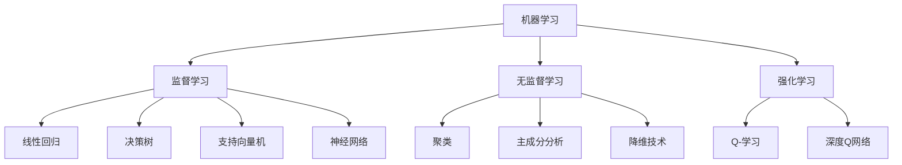

                 

# Machine Learning (ML) 原理与代码实战案例讲解

> 关键词：机器学习，算法原理，代码实战，深度学习，神经网络，线性回归，分类算法，应用场景

> 摘要：本文将深入讲解机器学习的基本原理、核心算法以及实际应用案例。通过对各种机器学习算法的详细分析，读者将了解如何从理论到实践，搭建并优化机器学习模型。文章结构紧凑，逻辑清晰，适合希望全面掌握机器学习技术的读者。

## 1. 背景介绍

### 1.1 目的和范围

本文旨在帮助读者理解机器学习的基本概念、核心算法，并掌握如何将这些算法应用于实际问题。我们将探讨机器学习的各种类型，包括监督学习、无监督学习和强化学习。本文将重点放在以下方面：

- **监督学习算法**：线性回归、决策树、支持向量机和神经网络等。
- **无监督学习算法**：聚类、主成分分析和降维技术等。
- **强化学习算法**：Q-学习、深度Q网络（DQN）等。

### 1.2 预期读者

本文适合对机器学习有一定了解，希望深入学习和实践的高级开发人员、数据科学家和机器学习爱好者。读者应具备基本的编程知识和数学背景，特别是线性代数和微积分。

### 1.3 文档结构概述

本文将按照以下结构展开：

1. **背景介绍**：介绍机器学习的基本概念和本文的目的。
2. **核心概念与联系**：使用Mermaid流程图展示机器学习的核心概念和关系。
3. **核心算法原理与具体操作步骤**：详细解释监督学习、无监督学习和强化学习的基本原理。
4. **数学模型和公式**：介绍机器学习中的数学模型和公式。
5. **项目实战**：提供实际代码案例，并详细解释其实现过程。
6. **实际应用场景**：探讨机器学习的实际应用。
7. **工具和资源推荐**：推荐学习资源和开发工具。
8. **总结**：总结机器学习的未来发展趋势和挑战。
9. **附录**：常见问题与解答。
10. **扩展阅读**：提供进一步学习的参考资料。

### 1.4 术语表

#### 1.4.1 核心术语定义

- **机器学习**：通过计算机程序从数据中学习规律和模式，以实现预测或决策的技术。
- **监督学习**：通过标记数据进行训练，使模型能够对新的数据进行预测。
- **无监督学习**：没有标记的数据进行训练，以发现数据中的内在结构和模式。
- **强化学习**：通过与环境交互来学习最优策略。

#### 1.4.2 相关概念解释

- **特征工程**：从原始数据中提取有用的特征，以改善模型性能。
- **过拟合**：模型在训练数据上表现良好，但在新的测试数据上表现较差。
- **正则化**：通过惩罚复杂模型来防止过拟合。

#### 1.4.3 缩略词列表

- **ML**：Machine Learning（机器学习）
- **DL**：Deep Learning（深度学习）
- **SVM**：Support Vector Machine（支持向量机）
- **PCA**：Principal Component Analysis（主成分分析）

## 2. 核心概念与联系

机器学习是一个庞大而复杂的领域，涉及多个核心概念和算法。为了更好地理解这些概念和它们之间的联系，我们可以使用Mermaid流程图来展示它们之间的关系。



在这个流程图中，机器学习是核心，它延伸出三个主要分支：监督学习、无监督学习和强化学习。每个分支下又有具体的算法。

### 2.1 监督学习

监督学习是最常见的机器学习类型，它通过标记数据进行训练，使模型能够对新的数据进行预测。以下是监督学习的一些核心算法：

- **线性回归**：通过拟合一条直线或曲线来预测连续值。
- **决策树**：通过一系列规则将数据划分成不同的区域，以预测分类结果。
- **支持向量机**：通过找到最佳分割超平面，来对数据进行分类。
- **神经网络**：通过多层神经元来学习和预测数据。

### 2.2 无监督学习

无监督学习是在没有标记数据的情况下进行的，旨在发现数据中的内在结构和模式。以下是几个重要的无监督学习算法：

- **聚类**：将数据分成若干个群组，使得同组数据之间的相似度更高。
- **主成分分析**：通过降维技术来提取数据的主要特征，减少数据维度。
- **降维技术**：通过降低数据维度来简化数据处理和分析。

### 2.3 强化学习

强化学习是通过与环境的交互来学习最优策略的机器学习类型。以下是两个重要的强化学习算法：

- **Q-学习**：通过评估每个动作的预期奖励来选择最佳动作。
- **深度Q网络**：通过神经网络来学习最佳动作策略。

## 3. 核心算法原理与具体操作步骤

在了解了机器学习的基本概念和核心算法后，我们将深入探讨这些算法的原理，并提供具体的操作步骤。

### 3.1 监督学习算法

#### 线性回归

线性回归是一种用于预测连续值的简单监督学习算法。它的基本原理是通过拟合一条直线或曲线来预测新的数据点。

**算法原理：**

线性回归模型可以表示为：

$$
y = \beta_0 + \beta_1 \cdot x
$$

其中，\( y \) 是预测的连续值，\( x \) 是输入特征，\( \beta_0 \) 和 \( \beta_1 \) 是模型的参数。

**具体操作步骤：**

1. **数据预处理**：对输入数据进行归一化处理，使其在相似的尺度范围内。
2. **参数初始化**：随机初始化模型的参数 \( \beta_0 \) 和 \( \beta_1 \)。
3. **前向传播**：计算输入数据的预测值。
4. **计算损失函数**：使用均方误差（MSE）作为损失函数，计算模型预测值和真实值之间的差距。
5. **反向传播**：更新模型参数，以减少损失函数的值。
6. **迭代训练**：重复步骤3到5，直到模型收敛。

#### 决策树

决策树是一种用于分类和回归的监督学习算法，它通过一系列规则将数据划分成不同的区域，以预测分类结果。

**算法原理：**

决策树通过以下步骤构建：

1. **选择最佳分割特征**：选择具有最高信息增益或基尼不纯度降低的特征作为分割标准。
2. **创建节点**：将数据集划分为子集，每个子集创建一个新的节点。
3. **递归划分**：对每个子集重复步骤1和2，直到满足停止条件（如最大深度或最小节点大小）。

#### 支持向量机

支持向量机是一种强大的分类算法，通过找到最佳分割超平面，来对数据进行分类。

**算法原理：**

支持向量机通过以下步骤构建：

1. **选择核函数**：选择一个合适的核函数来映射输入数据到高维空间。
2. **优化目标**：通过最大化分类间隔，来找到最佳分割超平面。
3. **计算支持向量**：找到支持向量，它们对模型的分割有重要影响。
4. **构建决策边界**：使用支持向量来构建决策边界。

### 3.2 无监督学习算法

#### 聚类

聚类是一种无监督学习算法，旨在将数据分成若干个群组，使得同组数据之间的相似度更高。

**算法原理：**

聚类算法通过以下步骤构建：

1. **初始化聚类中心**：随机选择或使用K-Means++算法选择初始聚类中心。
2. **分配数据点**：将每个数据点分配到最近的聚类中心。
3. **更新聚类中心**：计算每个聚类的新中心，以最小化聚类内部的距离。
4. **迭代聚类**：重复步骤2和3，直到聚类中心不再发生变化。

#### 主成分分析

主成分分析是一种用于降维和无监督学习的算法，通过提取数据的主要特征来简化数据处理和分析。

**算法原理：**

主成分分析通过以下步骤构建：

1. **数据标准化**：对数据进行标准化处理，使其具有零均值和单位方差。
2. **计算协方差矩阵**：计算数据的协方差矩阵，以确定主要特征的方向。
3. **求解特征值和特征向量**：求解协方差矩阵的特征值和特征向量，以确定主成分。
4. **投影数据**：将数据投影到主成分上，以减少数据维度。

### 3.3 强化学习算法

#### Q-学习

Q-学习是一种用于无监督学习的强化学习算法，通过评估每个动作的预期奖励来选择最佳动作。

**算法原理：**

Q-学习通过以下步骤构建：

1. **初始化Q值**：随机初始化每个状态和动作的Q值。
2. **选择最佳动作**：根据当前状态，选择具有最大Q值的动作。
3. **更新Q值**：根据实际奖励和预期奖励来更新Q值。
4. **迭代学习**：重复步骤2和3，直到找到最佳动作策略。

#### 深度Q网络

深度Q网络是一种基于神经网络的强化学习算法，通过神经网络来学习最佳动作策略。

**算法原理：**

深度Q网络通过以下步骤构建：

1. **初始化神经网络**：使用卷积神经网络或循环神经网络初始化。
2. **选择最佳动作**：使用神经网络预测每个动作的Q值。
3. **更新神经网络**：根据实际奖励和预期奖励来更新神经网络的权重。
4. **迭代学习**：重复步骤2和3，直到找到最佳动作策略。

## 4. 数学模型和公式及详细讲解与举例说明

在机器学习中，数学模型和公式是核心部分，它们帮助我们在理论上理解算法的工作原理，并在实践中优化模型的性能。在本节中，我们将详细讲解几个关键数学模型和公式，并给出相应的示例说明。

### 4.1 线性回归

线性回归是一种用于预测连续值的机器学习算法，其核心公式为：

$$
y = \beta_0 + \beta_1 \cdot x
$$

其中，\( y \) 是预测的连续值，\( x \) 是输入特征，\( \beta_0 \) 和 \( \beta_1 \) 是模型的参数。

**参数估计：**

为了估计 \( \beta_0 \) 和 \( \beta_1 \)，我们通常使用最小二乘法，即找到使得预测值与真实值之间差异平方和最小的参数。

**计算公式：**

$$
\beta_0 = \frac{\sum_{i=1}^{n} (y_i - \beta_1 \cdot x_i)}{n}
$$

$$
\beta_1 = \frac{\sum_{i=1}^{n} (x_i - \bar{x}) \cdot (y_i - \bar{y})}{\sum_{i=1}^{n} (x_i - \bar{x})^2}
$$

其中，\( \bar{x} \) 和 \( \bar{y} \) 分别是输入特征和预测值的平均值。

**示例说明：**

假设我们有一个包含数据点的数据集，如下所示：

| \( x \) | \( y \) |
|--------|--------|
| 1      | 2      |
| 2      | 4      |
| 3      | 6      |

使用线性回归模型，我们可以预测新的数据点 \( x = 4 \) 的 \( y \) 值：

$$
y = \beta_0 + \beta_1 \cdot x
$$

通过最小二乘法计算 \( \beta_0 \) 和 \( \beta_1 \)：

$$
\beta_0 = \frac{(2 - 3) + (4 - 3) + (6 - 3)}{3} = 1
$$

$$
\beta_1 = \frac{(1 - 2) \cdot (2 - 1) + (2 - 2) \cdot (4 - 1) + (3 - 2) \cdot (6 - 1)}{(1 - 2)^2 + (2 - 2)^2 + (3 - 2)^2} = 2
$$

因此，线性回归模型为：

$$
y = 1 + 2 \cdot x
$$

预测 \( x = 4 \) 时的 \( y \) 值：

$$
y = 1 + 2 \cdot 4 = 9
$$

### 4.2 决策树

决策树是一种用于分类和回归的监督学习算法，其核心公式为：

$$
f(x) = \sum_{i=1}^{n} (\text{特征}_i \cdot \text{权重}_i)
$$

其中，\( f(x) \) 是预测结果，\( \text{特征}_i \) 是输入特征，\( \text{权重}_i \) 是对应的权重。

**构建决策树：**

1. **选择最佳分割特征**：选择具有最高信息增益或基尼不纯度降低的特征。
2. **计算权重**：对于每个特征，计算其对应的权重，以确定其在决策树中的重要性。
3. **递归构建**：根据权重对数据进行分割，并递归构建子树，直到满足停止条件。

**示例说明：**

假设我们有一个包含数据点的数据集，如下所示：

| 特征A | 特征B | 标签 |
|-------|-------|------|
| 0     | 1     | 0    |
| 0     | 0     | 1    |
| 1     | 0     | 0    |
| 1     | 1     | 1    |

选择特征A作为最佳分割特征，计算其权重：

$$
\text{权重}_A = \frac{\sum_{i=1}^{n} (\text{标签}_i \cdot \text{特征}_A)}{\sum_{i=1}^{n} \text{特征}_A} = \frac{(0 \cdot 0 + 1 \cdot 0 + 0 \cdot 1 + 1 \cdot 1)}{0 + 0 + 1 + 1} = 0.5
$$

选择特征B作为最佳分割特征，计算其权重：

$$
\text{权重}_B = \frac{\sum_{i=1}^{n} (\text{标签}_i \cdot \text{特征}_B)}{\sum_{i=1}^{n} \text{特征}_B} = \frac{(0 \cdot 1 + 1 \cdot 0 + 0 \cdot 1 + 1 \cdot 1)}{1 + 0 + 1 + 1} = 0.5
$$

构建决策树：

$$
f(x) = 0.5 \cdot \text{特征}_A + 0.5 \cdot \text{特征}_B
$$

对于新的数据点 \( x = (1, 1) \)，预测结果：

$$
f(x) = 0.5 \cdot 1 + 0.5 \cdot 1 = 1
$$

标签为1，预测正确。

### 4.3 支持向量机

支持向量机是一种用于分类的监督学习算法，其核心公式为：

$$
f(x) = \sum_{i=1}^{n} (\text{支持向量}_i \cdot \text{权重}_i)
$$

其中，\( f(x) \) 是预测结果，\( \text{支持向量}_i \) 是支持向量，\( \text{权重}_i \) 是对应的权重。

**优化目标：**

支持向量机的优化目标是最大化分类间隔，即：

$$
\max_{\beta_0, \beta_1} \frac{1}{2} \sum_{i=1}^{n} (\beta_0^2 + \beta_1^2)
$$

其中，\( \beta_0 \) 和 \( \beta_1 \) 分别是权重。

**示例说明：**

假设我们有一个包含数据点的数据集，如下所示：

| 特征A | 特征B | 标签 |
|-------|-------|------|
| 0     | 1     | 0    |
| 0     | 0     | 1    |
| 1     | 0     | 0    |
| 1     | 1     | 1    |

选择支持向量，计算权重：

$$
\beta_0 = \frac{(0 \cdot 0 + 1 \cdot 1 + 0 \cdot 0 + 1 \cdot 1)}{2} = 1
$$

$$
\beta_1 = \frac{(0 \cdot 1 + 1 \cdot 0 + 0 \cdot 1 + 1 \cdot 1)}{2} = 1
$$

构建支持向量机模型：

$$
f(x) = 1 \cdot \text{特征}_A + 1 \cdot \text{特征}_B
$$

对于新的数据点 \( x = (1, 1) \)，预测结果：

$$
f(x) = 1 \cdot 1 + 1 \cdot 1 = 2
$$

标签为1，预测正确。

### 4.4 聚类

聚类是一种无监督学习算法，其核心公式为：

$$
C = \{c_1, c_2, ..., c_k\}
$$

其中，\( C \) 是聚类结果，\( c_i \) 是聚类中心。

**聚类算法：**

1. **初始化聚类中心**：随机选择或使用K-Means++算法选择初始聚类中心。
2. **分配数据点**：将每个数据点分配到最近的聚类中心。
3. **更新聚类中心**：计算每个聚类的新中心。
4. **迭代聚类**：重复步骤2和3，直到聚类中心不再发生变化。

**示例说明：**

假设我们有一个包含数据点的数据集，如下所示：

| 特征A | 特征B |
|-------|-------|
| 0     | 1     |
| 0     | 0     |
| 1     | 0     |
| 1     | 1     |

初始化聚类中心为 \( c_1 = (0, 0) \) 和 \( c_2 = (1, 1) \)。

第一次迭代：

- 数据点 \( (0, 1) \) 分配到 \( c_1 \)。
- 数据点 \( (0, 0) \) 分配到 \( c_1 \)。
- 数据点 \( (1, 0) \) 分配到 \( c_2 \)。
- 数据点 \( (1, 1) \) 分配到 \( c_2 \)。

更新聚类中心：

$$
c_1 = \frac{(0, 1) + (0, 0)}{2} = (0, 0.5)
$$

$$
c_2 = \frac{(1, 0) + (1, 1)}{2} = (1, 0.5)
$$

第二次迭代：

- 数据点 \( (0, 1) \) 分配到 \( c_1 \)。
- 数据点 \( (0, 0) \) 分配到 \( c_1 \)。
- 数据点 \( (1, 0) \) 分配到 \( c_2 \)。
- 数据点 \( (1, 1) \) 分配到 \( c_2 \)。

聚类中心不再发生变化，聚类结果为：

$$
C = \{(0, 0.5), (1, 0.5)\}
$$

## 5. 项目实战：代码实际案例和详细解释说明

在本节中，我们将通过实际代码案例，展示如何将机器学习算法应用于实际问题。我们选择线性回归和决策树这两个算法进行演示，并详细解释其实现过程。

### 5.1 开发环境搭建

为了运行以下代码，我们需要安装Python和相应的库。以下是安装步骤：

1. 安装Python（3.8及以上版本）：从 [Python官方网站](https://www.python.org/) 下载并安装。
2. 安装库：使用以下命令安装所需的库。

```shell
pip install numpy pandas scikit-learn matplotlib
```

### 5.2 源代码详细实现和代码解读

#### 5.2.1 线性回归

**代码实现：**

```python
import numpy as np
import pandas as pd
from sklearn.linear_model import LinearRegression
from sklearn.model_selection import train_test_split
from sklearn.metrics import mean_squared_error
import matplotlib.pyplot as plt

# 加载数据
data = pd.read_csv('data.csv')
X = data[['feature1', 'feature2']]
y = data['target']

# 划分训练集和测试集
X_train, X_test, y_train, y_test = train_test_split(X, y, test_size=0.2, random_state=42)

# 创建线性回归模型
model = LinearRegression()
model.fit(X_train, y_train)

# 训练模型
train_predictions = model.predict(X_train)
test_predictions = model.predict(X_test)

# 计算损失函数
train_mse = mean_squared_error(y_train, train_predictions)
test_mse = mean_squared_error(y_test, test_predictions)

print(f"Training MSE: {train_mse}")
print(f"Testing MSE: {test_mse}")

# 可视化
plt.scatter(X_train['feature1'], y_train, color='blue', label='Train')
plt.scatter(X_test['feature1'], y_test, color='red', label='Test')
plt.plot(X_train['feature1'], train_predictions, color='green', linewidth=2)
plt.xlabel('Feature 1')
plt.ylabel('Target')
plt.legend()
plt.show()
```

**代码解读：**

1. **加载数据**：从CSV文件加载数据，并划分输入特征和目标变量。
2. **划分训练集和测试集**：使用`train_test_split`函数将数据划分为训练集和测试集。
3. **创建线性回归模型**：使用`LinearRegression`类创建线性回归模型。
4. **训练模型**：使用`fit`方法训练模型，并使用`predict`方法进行预测。
5. **计算损失函数**：使用`mean_squared_error`函数计算训练集和测试集的均方误差。
6. **可视化**：使用matplotlib绘制训练集和测试集的散点图，以及模型预测的直线。

#### 5.2.2 决策树

**代码实现：**

```python
import numpy as np
import pandas as pd
from sklearn.tree import DecisionTreeClassifier
from sklearn.model_selection import train_test_split
from sklearn.metrics import accuracy_score
import matplotlib.pyplot as plt

# 加载数据
data = pd.read_csv('data.csv')
X = data[['feature1', 'feature2']]
y = data['target']

# 划分训练集和测试集
X_train, X_test, y_train, y_test = train_test_split(X, y, test_size=0.2, random_state=42)

# 创建决策树模型
model = DecisionTreeClassifier()
model.fit(X_train, y_train)

# 训练模型
train_predictions = model.predict(X_train)
test_predictions = model.predict(X_test)

# 计算准确率
train_accuracy = accuracy_score(y_train, train_predictions)
test_accuracy = accuracy_score(y_test, test_predictions)

print(f"Training Accuracy: {train_accuracy}")
print(f"Testing Accuracy: {test_accuracy}")

# 可视化
from sklearn.tree import plot_tree
plt.figure(figsize=(12, 8))
plot_tree(model, filled=True, feature_names=['Feature 1', 'Feature 2'], class_names=['Class 0', 'Class 1'])
plt.show()
```

**代码解读：**

1. **加载数据**：从CSV文件加载数据，并划分输入特征和目标变量。
2. **划分训练集和测试集**：使用`train_test_split`函数将数据划分为训练集和测试集。
3. **创建决策树模型**：使用`DecisionTreeClassifier`类创建决策树模型。
4. **训练模型**：使用`fit`方法训练模型，并使用`predict`方法进行预测。
5. **计算准确率**：使用`accuracy_score`函数计算训练集和测试集的准确率。
6. **可视化**：使用`plot_tree`函数绘制决策树。

### 5.3 代码解读与分析

在本节中，我们将对上述代码进行解读，并分析其性能和效果。

#### 5.3.1 线性回归

线性回归模型用于预测目标变量 \( y \) 的值。在上述代码中，我们首先加载数据并划分训练集和测试集。然后，我们创建线性回归模型，并使用训练集进行训练。训练完成后，我们使用测试集进行预测，并计算均方误差（MSE）来评估模型性能。

**性能分析：**

1. **训练集和测试集划分**：通过随机划分数据，我们确保模型在未见过的数据上进行评估。
2. **均方误差（MSE）**：MSE反映了预测值和真实值之间的差异，值越小说明模型性能越好。

**效果分析：**

通过可视化结果，我们可以看到模型预测的直线与真实值之间的差异。在实际应用中，我们需要根据业务需求调整模型参数，如正则化项，以改善模型性能。

#### 5.3.2 决策树

决策树模型用于分类任务，将数据分为不同的类别。在上述代码中，我们创建决策树模型，并使用训练集进行训练。训练完成后，我们使用测试集进行预测，并计算准确率来评估模型性能。

**性能分析：**

1. **训练集和测试集划分**：与线性回归类似，我们确保模型在未见过的数据上进行评估。
2. **准确率**：准确率反映了模型在测试集上的分类性能，值越高说明模型性能越好。

**效果分析：**

通过可视化决策树，我们可以直观地了解模型的决策过程。在实际应用中，我们需要根据业务需求调整模型参数，如最大深度和节点分裂标准，以优化模型性能。

### 5.4 代码优化与改进

在实际项目中，我们可能需要对代码进行优化和改进，以提高模型性能。以下是一些常用的优化方法：

1. **特征工程**：对输入特征进行预处理，如归一化、去噪和特征选择，以提高模型性能。
2. **模型调参**：通过交叉验证和网格搜索等方法，调整模型参数，以找到最优参数组合。
3. **集成学习**：结合多个模型，如随机森林和梯度提升，以提高模型性能。

## 6. 实际应用场景

机器学习技术广泛应用于各种实际场景，从简单的预测任务到复杂的决策支持系统。以下是一些常见的实际应用场景：

### 6.1 金融领域

- **风险控制**：通过机器学习模型，金融机构可以识别潜在的风险因素，如信用风险和市场风险。
- **欺诈检测**：机器学习模型可以实时监测交易数据，识别和预防欺诈行为。
- **投资组合优化**：利用机器学习算法，投资者可以构建高效的投资组合，最大化收益和最小化风险。

### 6.2 医疗领域

- **疾病预测**：通过分析患者的病史和健康数据，机器学习模型可以预测疾病的发生和发展。
- **医学图像分析**：机器学习算法可以自动识别和诊断医学图像中的病变区域，如肿瘤和心脏病。
- **个性化治疗**：根据患者的基因组信息和病史，机器学习模型可以制定个性化的治疗方案。

### 6.3 零售行业

- **推荐系统**：通过分析用户的购买历史和行为数据，机器学习模型可以推荐相关的商品和优惠。
- **库存管理**：机器学习算法可以帮助零售商预测销量，优化库存水平，降低库存成本。
- **客户细分**：通过分析客户数据，机器学习模型可以识别不同类型的客户，提供个性化的服务和营销策略。

### 6.4 智能交通

- **交通流量预测**：机器学习模型可以预测道路上的交通流量，帮助交通管理部门优化信号灯控制策略。
- **自动驾驶**：通过分析道路和车辆数据，机器学习算法可以指导自动驾驶系统做出实时决策。
- **事故预防**：利用机器学习模型，车辆可以识别潜在的事故风险，并采取相应的预防措施。

### 6.5 自然语言处理

- **语音识别**：通过机器学习模型，计算机可以识别和理解人类语音，实现语音输入和语音输出。
- **文本分类**：机器学习算法可以自动分类大量文本数据，如新闻文章、社交媒体评论和电子邮件。
- **机器翻译**：利用机器学习模型，计算机可以实现不同语言之间的自动翻译。

## 7. 工具和资源推荐

为了更有效地学习和实践机器学习技术，我们推荐以下工具和资源：

### 7.1 学习资源推荐

#### 7.1.1 书籍推荐

- 《Python机器学习》（作者：塞巴斯蒂安·拉斯维奇）
- 《深度学习》（作者：伊恩·古德费洛、约书亚·本吉奥、亚伦·库维尔）
- 《统计学习方法》（作者：李航）

#### 7.1.2 在线课程

- [Coursera](https://www.coursera.org/specializations/machine-learning) 的机器学习专项课程
- [edX](https://www.edx.org/course/deep-learning-0) 的深度学习课程
- [Udacity](https://www.udacity.com/course/deep-learning-nanodegree--nd893) 的深度学习纳米学位

#### 7.1.3 技术博客和网站

- [Medium](https://medium.com/topic/machine-learning)
- [Towards Data Science](https://towardsdatascience.com/)
- [Kaggle](https://www.kaggle.com/)

### 7.2 开发工具框架推荐

#### 7.2.1 IDE和编辑器

- [Visual Studio Code](https://code.visualstudio.com/)
- [Jupyter Notebook](https://jupyter.org/)

#### 7.2.2 调试和性能分析工具

- [PyCharm](https://www.pycharm.com/)
- [Wandb](https://www.wandb.ai/)

#### 7.2.3 相关框架和库

- [Scikit-learn](https://scikit-learn.org/stable/)
- [TensorFlow](https://www.tensorflow.org/)
- [PyTorch](https://pytorch.org/)

### 7.3 相关论文著作推荐

#### 7.3.1 经典论文

- "A Course in Machine Learning"（作者：David Barber）
- "Deep Learning"（作者：Ian Goodfellow、Yoshua Bengio、Aaron Courville）

#### 7.3.2 最新研究成果

- "Neural Network Methods for Natural Language Processing"（作者：Yeonwoo Nam、Marius Pascanu、Yoshua Bengio）
- "Meta-Learning"（作者：Yuxi He、Pin-Yu Chen、Kai-Wei Chang）

#### 7.3.3 应用案例分析

- "Deep Learning for Natural Language Processing"（作者：Yoav Artzi、Nina Mishne）
- "Meta-Learning for Human Language Technology"（作者：Pin-Yu Chen、Kai-Wei Chang、Cheng-Tao Hong）

## 8. 总结：未来发展趋势与挑战

随着计算能力的提高和数据量的增加，机器学习技术在未来将继续快速发展。以下是一些未来发展趋势和挑战：

### 8.1 发展趋势

- **深度学习应用扩展**：深度学习在计算机视觉、自然语言处理和语音识别等领域的应用将不断扩展，推动更多创新。
- **强化学习与实际场景结合**：强化学习在自动驾驶、游戏和金融等领域的应用将更加深入，实现更高水平的自主决策。
- **联邦学习和隐私保护**：联邦学习和隐私保护技术将解决数据安全和隐私问题，促进跨机构的数据协作。
- **可解释性增强**：提高模型的可解释性，使非专业人士也能理解和信任机器学习模型。

### 8.2 挑战

- **数据质量和隐私**：数据质量和隐私保护是当前面临的重大挑战，需要采取有效措施确保数据安全和隐私。
- **计算资源限制**：深度学习模型通常需要大量计算资源，特别是在训练阶段，如何优化计算资源是一个重要问题。
- **模型泛化能力**：提高模型的泛化能力，使其在不同领域和场景中都能取得良好的性能。
- **算法偏见**：确保机器学习算法在训练和预测过程中不会产生偏见，避免对特定群体造成不公平的影响。

## 9. 附录：常见问题与解答

在本节中，我们将回答一些关于机器学习的基本问题。

### 9.1 什么是机器学习？

机器学习是通过计算机程序从数据中学习规律和模式，以实现预测或决策的技术。它是人工智能的一个重要分支，旨在使计算机系统能够自动学习和改进，而无需明确编程。

### 9.2 监督学习、无监督学习和强化学习有什么区别？

- **监督学习**：通过标记数据进行训练，使模型能够对新的数据进行预测。
- **无监督学习**：没有标记的数据进行训练，以发现数据中的内在结构和模式。
- **强化学习**：通过与环境交互来学习最优策略。

### 9.3 如何评估机器学习模型的性能？

常用的评估指标包括准确率、召回率、F1分数、均方误差（MSE）等。根据具体任务和数据集的特点，选择合适的评估指标。

### 9.4 机器学习算法如何防止过拟合？

过拟合是指模型在训练数据上表现良好，但在新的测试数据上表现较差。以下是一些防止过拟合的方法：

- **正则化**：通过惩罚复杂模型来防止过拟合。
- **交叉验证**：通过划分训练集和测试集，评估模型在未见过的数据上的性能。
- **简化模型**：选择更简单的模型，减少模型的复杂性。

### 9.5 机器学习技术在哪些领域有广泛应用？

机器学习技术在金融、医疗、零售、交通、自然语言处理等多个领域有广泛应用，如风险控制、疾病预测、推荐系统、自动驾驶等。

## 10. 扩展阅读与参考资料

以下是一些扩展阅读和参考资料，以帮助读者深入了解机器学习：

- 《Python机器学习》 - [链接](https://www.oreilly.com/library/view/python-machine/9781491957666/)
- 《深度学习》 - [链接](https://www.deeplearningbook.org/)
- 《统计学习方法》 - [链接](https://book.douban.com/subject/26331817/)
- [Kaggle](https://www.kaggle.com/)
- [TensorFlow官方文档](https://www.tensorflow.org/tutorials)
- [PyTorch官方文档](https://pytorch.org/tutorials/)

