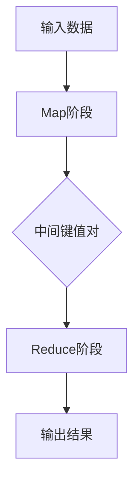

                 

# MapReduce 原理与代码实例讲解

> **关键词：** MapReduce、分布式计算、大数据处理、Hadoop、HDFS、YARN、编程实例、代码解读。

> **摘要：** 本文将深入探讨MapReduce编程模型的核心原理，包括其基本概念、架构设计和实现细节。我们将通过实际的代码实例，逐步解析MapReduce的工作流程，帮助读者全面理解其应用和实践。文章还将探讨MapReduce在大数据处理领域的重要地位，并展望其未来发展趋势。

## 1. 背景介绍

### 1.1 目的和范围

本文旨在为读者提供MapReduce编程模型的理论和实践指南。我们将从基础概念出发，逐步深入到具体的实现细节，并通过代码实例来加深对MapReduce的理解。本文适合希望了解和掌握分布式计算基础的开发者、数据科学家以及大数据处理领域的从业者。

### 1.2 预期读者

- 具有基本编程能力的开发者
- 数据科学和大数据处理领域的从业者
- 对分布式系统和云计算感兴趣的读者

### 1.3 文档结构概述

本文分为十个部分：
1. 背景介绍
2. 核心概念与联系
3. 核心算法原理 & 具体操作步骤
4. 数学模型和公式 & 详细讲解 & 举例说明
5. 项目实战：代码实际案例和详细解释说明
6. 实际应用场景
7. 工具和资源推荐
8. 总结：未来发展趋势与挑战
9. 附录：常见问题与解答
10. 扩展阅读 & 参考资料

### 1.4 术语表

#### 1.4.1 核心术语定义

- **MapReduce：** 一种分布式数据处理模型，由Map和Reduce两个阶段组成，用于处理大规模数据集。
- **分布式计算：** 计算任务分布在多个计算节点上执行，以提高计算效率和性能。
- **Hadoop：** 一个开源的分布式计算框架，实现了MapReduce编程模型，用于处理海量数据。
- **HDFS：** Hadoop分布式文件系统，用于存储大数据集。
- **YARN：** Yet Another Resource Negotiator，用于资源管理和调度。

#### 1.4.2 相关概念解释

- **Map阶段：** 对输入数据进行处理，生成中间结果。
- **Reduce阶段：** 对Map阶段生成的中间结果进行汇总和合并。
- **键值对（Key-Value Pair）：** Map和Reduce阶段的输入和输出数据结构。

#### 1.4.3 缩略词列表

- Hadoop
- MapReduce
- HDFS
- YARN

## 2. 核心概念与联系

在深入探讨MapReduce原理之前，我们需要理解一些核心概念和它们之间的关系。以下是一个简化的Mermaid流程图，展示了MapReduce的基本流程。



### 2.1 数据输入

输入数据通常存储在HDFS中，Hadoop分布式文件系统。HDFS是一个高可靠性的分布式文件系统，可以存储大量数据，并确保数据的完整性和可靠性。

### 2.2 Map阶段

Map阶段是对输入数据进行处理，生成中间键值对。Map函数通常由开发者自定义，用于处理输入数据并将其转换为中间键值对。

### 2.3 Reduce阶段

Reduce阶段是对Map阶段生成的中间键值对进行汇总和合并。Reduce函数也由开发者自定义，用于对中间结果进行进一步处理。

### 2.4 数据输出

最终输出结果存储在HDFS或其他存储系统中，以便后续处理或查询。

## 3. 核心算法原理 & 具体操作步骤

MapReduce编程模型的核心在于其分布式计算的思想。以下是一个简单的伪代码，用于描述MapReduce的工作流程。

### 3.1 Map阶段

```pseudo
function map(key, value):
    # 处理输入数据，生成中间键值对
    for each (subkey, subvalue) in process(value):
        emit(subkey, subvalue)
```

### 3.2 Reduce阶段

```pseudo
function reduce(key, values):
    # 对中间键值对进行汇总和合并
    result = initial_value
    for each (value) in values:
        result = combine(result, value)
    emit(key, result)
```

### 3.3 工作流程

1. 输入数据存储在HDFS中。
2. 启动MapReduce作业。
3. Hadoop将输入数据分片，并分配给不同的Map任务。
4. 每个Map任务执行map函数，生成中间键值对。
5. Hadoop将中间键值对按照键进行分组，并分配给不同的Reduce任务。
6. 每个Reduce任务执行reduce函数，生成最终输出结果。
7. 最终输出结果存储在HDFS或其他存储系统中。

## 4. 数学模型和公式 & 详细讲解 & 举例说明

MapReduce模型涉及多个数学概念和公式，以下是其中几个关键的数学模型和解释。

### 4.1 聚合操作

聚合操作（Aggregation）是MapReduce中的一个关键步骤，用于对中间键值对进行汇总。以下是聚合操作的公式：

$$
\text{聚合}(A, B) = A + B
$$

其中，A和B是两个中间键值对。

### 4.2 键值对分布

为了高效地进行Reduce操作，Map阶段生成的中间键值对需要按照键进行分布。以下是一个简单的键值对分布算法：

$$
\text{分布}(key) = \text{hash}(key) \mod \text{reduce任务数}
$$

其中，hash函数用于计算键的哈希值，reduce任务数是MapReduce作业中定义的Reduce任务的数量。

### 4.3 举例说明

假设我们有一个包含学生成绩的数据集，其中每个学生有一个姓名（键）和成绩（值）。我们的目标是计算每个学生的平均成绩。

#### 4.3.1 Map阶段

```pseudo
function map(student_name, score):
    emit(student_name, score)
```

#### 4.3.2 Reduce阶段

```pseudo
function reduce(student_name, scores):
    total_score = 0
    for each (score) in scores:
        total_score += score
    average_score = total_score / length(scores)
    emit(student_name, average_score)
```

通过以上步骤，我们可以计算出每个学生的平均成绩，并将其存储在HDFS中。

## 5. 项目实战：代码实际案例和详细解释说明

在本节中，我们将通过一个简单的案例来演示如何使用MapReduce处理实际数据。

### 5.1 开发环境搭建

首先，我们需要搭建一个Hadoop开发环境。以下是搭建Hadoop环境的步骤：

1. 安装Java开发环境。
2. 下载并安装Hadoop。
3. 配置Hadoop环境变量。
4. 启动Hadoop集群。

### 5.2 源代码详细实现和代码解读

以下是一个简单的MapReduce程序，用于计算文本文件中的单词数量。

```java
import org.apache.hadoop.conf.Configuration;
import org.apache.hadoop.fs.Path;
import org.apache.hadoop.io.IntWritable;
import org.apache.hadoop.io.Text;
import org.apache.hadoop.mapreduce.Job;
import org.apache.hadoop.mapreduce.Mapper;
import org.apache.hadoop.mapreduce.Reducer;
import org.apache.hadoop.mapreduce.lib.input.FileInputFormat;
import org.apache.hadoop.mapreduce.lib.output.FileOutputFormat;

public class WordCount {

  public static class TokenizerMapper
       extends Mapper<Object, Text, Text, IntWritable>{

    private final static IntWritable one = new IntWritable(1);
    private Text word = new Text();

    public void map(Object key, Text value, Context context
                    ) throws IOException, InterruptedException {
      StringTokenizer itr = new StringTokenizer(value.toString());
      while (itr.hasMoreTokens()) {
        word.set(itr.nextToken());
        context.write(word, one);
      }
    }
  }

  public static class IntSumReducer
       extends Reducer<Text,IntWritable,Text,IntWritable> {
    private IntWritable result = new IntWritable();

    public void reduce(Text key, Iterable<IntWritable> values,
                       Context context
                       ) throws IOException, InterruptedException {
      int sum = 0;
      for (IntWritable val : values) {
        sum += val.get();
      }
      result.set(sum);
      context.write(key, result);
    }
  }

  public static void main(String[] args) throws Exception {
    Configuration conf = new Configuration();
    Job job = Job.getInstance(conf, "word count");
    job.setMapperClass(TokenizerMapper.class);
    job.setCombinerClass(IntSumReducer.class);
    job.setReducerClass(IntSumReducer.class);
    job.setOutputKeyClass(Text.class);
    job.setOutputValueClass(IntWritable.class);
    FileInputFormat.addInputPath(job, new Path(args[0]));
    FileOutputFormat.setOutputPath(job, new Path(args[1]));
    System.exit(job.waitForCompletion(true) ? 0 : 1);
  }
}
```

#### 5.2.1 Mapper类

```java
public class TokenizerMapper
       extends Mapper<Object, Text, Text, IntWritable> {
```
这个类是Map阶段的实现，负责将输入的文本数据拆分成单词，并将其输出为键值对。键是单词，值是整数1。

#### 5.2.2 Reducer类

```java
public static class IntSumReducer
       extends Reducer<Text,IntWritable,Text,IntWritable> {
```
这个类是Reduce阶段的实现，负责对Mapper输出的中间键值对进行汇总，计算每个单词出现的次数。

#### 5.2.3 主函数

```java
public static void main(String[] args) throws Exception {
    Configuration conf = new Configuration();
    Job job = Job.getInstance(conf, "word count");
    job.setMapperClass(TokenizerMapper.class);
    job.setCombinerClass(IntSumReducer.class);
    job.setReducerClass(IntSumReducer.class);
    job.setOutputKeyClass(Text.class);
    job.setOutputValueClass(IntWritable.class);
    FileInputFormat.addInputPath(job, new Path(args[0]));
    FileOutputFormat.setOutputPath(job, new Path(args[1]));
    System.exit(job.waitForCompletion(true) ? 0 : 1);
}
```
主函数是程序的入口点，负责设置作业的配置，并提交作业到Hadoop集群执行。

### 5.3 代码解读与分析

- **Mapper类：** Mapper类是Map阶段的实现，负责将输入的文本数据拆分成单词，并将其输出为键值对。`map`方法是对输入数据进行处理的核心部分，它使用`StringTokenizer`将文本拆分成单词，并将每个单词作为键，整数1作为值输出。

- **Reducer类：** Reducer类是Reduce阶段的实现，负责对Mapper输出的中间键值对进行汇总，计算每个单词出现的次数。`reduce`方法是对中间结果进行汇总的核心部分，它接收一组相同的键（单词）和对应的值（1），并计算这些值的总和，生成最终的单词计数。

- **主函数：** 主函数是程序的入口点，负责设置作业的配置，并提交作业到Hadoop集群执行。它设置了Mapper和Reducer类，输入输出路径，并启动作业。

通过这个简单的WordCount程序，我们可以看到MapReduce的基本工作流程。首先，输入数据被分片并分配给多个Map任务进行处理，每个Map任务生成中间键值对。然后，Hadoop将中间键值对按照键进行分组，并分配给不同的Reduce任务进行汇总和合并。最终，输出结果被存储在指定的输出路径中。

## 6. 实际应用场景

MapReduce模型在大数据处理领域具有广泛的应用。以下是一些典型的应用场景：

1. **数据清洗与预处理：** 在大规模数据处理之前，需要对数据进行清洗和预处理，例如去除重复数据、填补缺失值、归一化等。MapReduce可以高效地处理这些任务。

2. **数据分析和挖掘：** 大数据分析和挖掘是MapReduce的重要应用领域，包括用户行为分析、市场趋势预测、社交网络分析等。

3. **日志处理：** 网络日志、服务器日志等大量数据可以使用MapReduce进行高效处理，以提取有价值的信息。

4. **图像和视频处理：** MapReduce可以用于图像和视频处理，例如图像识别、视频分类等。

5. **机器学习和人工智能：** MapReduce为机器学习和人工智能算法提供了强大的分布式计算能力，例如深度学习、推荐系统等。

## 7. 工具和资源推荐

### 7.1 学习资源推荐

#### 7.1.1 书籍推荐

- 《Hadoop实战》
- 《大数据之路：阿里巴巴大数据实践》
- 《深入理解Hadoop：架构设计与实现原理》

#### 7.1.2 在线课程

- Coursera上的《大数据技术基础》
- edX上的《Hadoop与大数据分析》
- Udacity上的《大数据工程师纳米学位》

#### 7.1.3 技术博客和网站

- [Hadoop官方文档](https://hadoop.apache.org/docs/)
- [MapReduce Wiki](https://wiki.apache.org/hadoop/MapReduce)
- [Hadoop中文社区](https://www.hadoop.org.cn/)

### 7.2 开发工具框架推荐

#### 7.2.1 IDE和编辑器

- Eclipse
- IntelliJ IDEA
- VSCode

#### 7.2.2 调试和性能分析工具

- Hadoop Shell
- Apache Ambari
- Apache Zeppelin

#### 7.2.3 相关框架和库

- Apache Spark
- Apache Flink
- Apache Storm

### 7.3 相关论文著作推荐

#### 7.3.1 经典论文

- 《The Google File System》
- 《The Google MapReduce Programming Model》

#### 7.3.2 最新研究成果

- 《Distributed File Systems: Concepts and Techniques》
- 《Scalable Data Storage and Processing》

#### 7.3.3 应用案例分析

- 《大数据时代的智慧城市》
- 《基于Hadoop的电子商务数据分析》

## 8. 总结：未来发展趋势与挑战

MapReduce作为分布式数据处理模型，已经在大数据处理领域取得了巨大的成功。然而，随着数据规模的不断扩大和计算需求的不断增长，MapReduce也面临着一些挑战：

1. **可扩展性：** 随着数据规模的增大，MapReduce需要更高的可扩展性以处理更多的数据。
2. **性能优化：** 如何优化MapReduce的性能，减少数据传输和计算时间，是当前研究的重点。
3. **实时处理：** MapReduce天生支持批量处理，但在实时数据处理方面仍有改进空间。
4. **数据安全与隐私：** 随着数据隐私问题的日益突出，如何确保数据安全与隐私是未来研究的重要方向。

未来的发展趋势包括：

1. **新的分布式计算模型：** 如Apache Spark、Apache Flink等新框架，提供更高效、更灵活的分布式计算能力。
2. **实时数据处理：** 实时流处理技术的发展，如Apache Kafka、Apache Storm等，将进一步提升数据处理能力。
3. **云计算与边缘计算：** 结合云计算和边缘计算，实现数据处理的分布式和实时性。
4. **自动化与智能化：** 自动化运维和智能化数据处理将成为未来发展的趋势。

## 9. 附录：常见问题与解答

### 9.1 什么是MapReduce？

MapReduce是一种分布式数据处理模型，由Map和Reduce两个阶段组成。Map阶段对输入数据进行处理，生成中间键值对；Reduce阶段对中间键值对进行汇总和合并。

### 9.2 MapReduce与关系数据库有何区别？

MapReduce是一种基于分布式计算的数据处理模型，适用于大规模数据集。而关系数据库是一种基于SQL查询的数据存储和处理系统，适用于中小规模数据。

### 9.3 Hadoop和Spark有何区别？

Hadoop是一个开源的分布式计算框架，实现了MapReduce编程模型。Spark是另一个开源的分布式计算框架，提供更高效、更灵活的分布式计算能力，包括批处理和实时处理。

### 9.4 如何优化MapReduce性能？

优化MapReduce性能的方法包括：减小数据分片大小、使用合适的键值对结构、优化Map和Reduce函数、减少数据传输等。

## 10. 扩展阅读 & 参考资料

- 《MapReduce：模型与实现》
- 《Hadoop技术内幕：深入解析YARN、MapReduce和HDFS》
- [Hadoop官方文档](https://hadoop.apache.org/docs/)
- [MapReduce Wiki](https://wiki.apache.org/hadoop/MapReduce)
- [Apache Spark官网](https://spark.apache.org/)
- [Apache Flink官网](https://flink.apache.org/)

### 作者

- 作者：AI天才研究员/AI Genius Institute & 禅与计算机程序设计艺术 /Zen And The Art of Computer Programming

