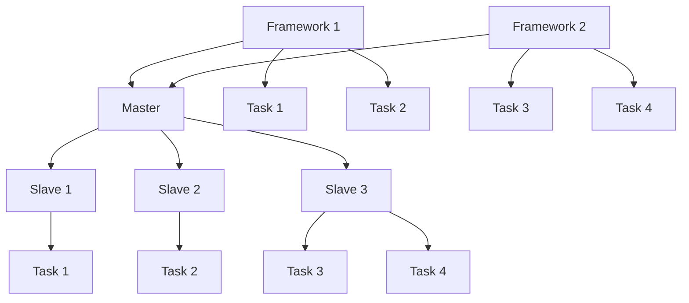

                 

# Mesos原理与代码实例讲解

## 摘要

本文旨在深入探讨Mesos——一个强大的集群资源管理系统，如何有效管理分布式资源，以实现应用程序的高效运行。通过本文，读者将了解Mesos的核心概念、架构设计、算法原理及其在实际项目中的应用。我们将以简洁易懂的语言和具体的代码实例，带领读者一步步揭开Mesos的神秘面纱，掌握其关键技术与使用方法。无论您是刚接触Mesos的新手，还是希望深入了解其内部机制的高级工程师，本文都将为您带来前所未有的学习体验。

## 1. 背景介绍

### 1.1 目的和范围

本文的目的在于为读者提供一个全面而深入的了解Mesos的机会。我们将通过理论讲解与代码实例相结合，帮助读者掌握Mesos的工作原理及其在分布式系统中的应用。文章将涵盖以下几个主要部分：

1. Mesos的核心概念与架构设计。
2. Mesos的关键算法原理与操作步骤。
3. Mesos的实际应用场景与项目实战。
4. Mesos相关的工具与资源推荐。
5. Mesos的未来发展趋势与挑战。

### 1.2 预期读者

本文适合以下几类读者：

1. 分布式系统与云计算领域的开发者与研究者。
2. 对集群资源管理有兴趣的技术爱好者。
3. 希望提升自身技术栈的高级工程师与架构师。
4. 正在寻找优化资源利用率的系统管理员。

### 1.3 文档结构概述

本文将按照以下结构展开：

1. **背景介绍**：介绍本文的目的、范围、预期读者以及文档结构。
2. **核心概念与联系**：阐述Mesos的核心概念，并使用流程图展示其架构。
3. **核心算法原理 & 具体操作步骤**：通过伪代码详细讲解Mesos的算法原理。
4. **数学模型和公式 & 详细讲解 & 举例说明**：介绍Mesos的数学模型，并通过示例进行说明。
5. **项目实战：代码实际案例和详细解释说明**：展示一个具体的代码实例，并进行详细解读。
6. **实际应用场景**：讨论Mesos在不同场景中的应用。
7. **工具和资源推荐**：推荐相关的学习资源、开发工具和论文著作。
8. **总结：未来发展趋势与挑战**：总结Mesos的发展趋势与面临的挑战。
9. **附录：常见问题与解答**：回答读者可能遇到的一些常见问题。
10. **扩展阅读 & 参考资料**：提供进一步学习的资源链接。

### 1.4 术语表

#### 1.4.1 核心术语定义

- **Mesos**：一个开源的集群资源管理系统，旨在有效管理分布式资源，以支持多种应用程序的高效运行。
- **Master**：Mesos集群中的中央管理节点，负责接收任务分配请求并管理整个集群。
- **Slave**：Mesos集群中的工作节点，负责执行分配给它的任务。
- **Framework**：一个与Mesos交互的组件，用于在集群上运行特定的应用程序或服务。
- **Task**：在Mesos中，任务是指被调度到Slave节点上执行的工作单元。

#### 1.4.2 相关概念解释

- **资源隔离**：Mesos通过资源隔离机制确保不同框架和任务之间能够独立运行，提高系统的稳定性和可靠性。
- **资源调度**：Mesos负责根据资源需求和负载情况，将任务调度到合适的Slave节点上执行。
- **动态资源调整**：Mesos支持动态调整Slave节点的资源，以适应任务负载的变化。

#### 1.4.3 缩略词列表

- **YARN**：Yet Another Resource Negotiator，Hadoop的集群资源管理系统。
- **Kubernetes**：一个开源的容器编排平台，用于自动化容器部署、扩展和管理。
- **Docker**：一个开源的应用容器引擎，用于打包、交付和管理应用。

## 2. 核心概念与联系

Mesos是一个分布式系统，旨在高效管理大量计算资源，以支持各种分布式应用程序的运行。要理解Mesos的工作原理，我们需要首先了解其核心概念和架构设计。

### 2.1. Mesos的核心概念

Mesos的核心概念主要包括Master、Slave、Framework和Task。以下是这些概念的定义：

- **Master**：Master是Mesos集群的中央管理节点。它负责接收任务的调度请求，并决定将任务分配给哪个Slave节点执行。Master还负责监控整个集群的状态，确保资源分配的公平性和效率。
- **Slave**：Slave是Mesos集群中的工作节点。它负责执行由Master分配给它的任务，并向Master报告任务的状态。每个Slave节点都具备一定的计算资源，如CPU、内存、磁盘和网络带宽等。
- **Framework**：Framework是Mesos中的一个重要组件，用于在集群上运行特定的应用程序或服务。例如，一个MapReduce任务可以运行在一个MapReduce Framework中。Framework通过向Master注册自己，并接收Master的任务分配。
- **Task**：Task是Mesos中的一个工作单元，表示在某个Slave节点上需要执行的具体任务。一个Framework可以包含多个Task，每个Task都有自己的资源需求和工作负载。

### 2.2. Mesos的架构设计

Mesos的架构设计旨在实现高效、可靠和可扩展的资源管理。以下是Mesos的基本架构：


#### 2.2.1. Master节点

Master节点是Mesos集群的中央管理节点。它负责：

- 接收Framework的注册和任务调度请求。
- 根据资源需求和负载情况，将任务分配给Slave节点。
- 监控整个集群的状态，并在发生故障时重新分配任务。

Master节点使用一个分布式锁（ZooKeeper）来确保只有一个Master节点处于激活状态。这样，即使某些Master节点发生故障，集群仍然能够保持稳定运行。

#### 2.2.2. Slave节点

Slave节点是Mesos集群中的工作节点。它负责：

- 向Master节点注册自身，并提供可用资源信息。
- 接收Master分配的任务，并在本地执行。
- 向Master节点报告任务状态，如运行中、完成或失败。

每个Slave节点都运行一个Mesos代理（slave agent），负责与Master节点通信，接收任务分配，并启动容器执行任务。

#### 2.2.3. Framework节点

Framework节点是Mesos集群中的一个重要组件，用于在集群上运行特定的应用程序或服务。例如，一个MapReduce任务可以运行在一个MapReduce Framework中。Framework的主要职责包括：

- 向Master节点注册，并报告可用资源。
- 接收Master的任务分配，并在Slave节点上启动任务。
- 监控任务状态，并在任务完成或失败时通知Master。

常见的Framework包括：

- **Mesos Framework**：Mesos自带的内置Framework，用于运行普通任务。
- **Marathon**：一个用于运行长驻服务的Framework，如Web应用、数据库等。
- **Mesos-Master**：一个用于运行Mesos Master节点的Framework。

### 2.3. Mermaid流程图

为了更直观地理解Mesos的工作流程，我们可以使用Mermaid流程图来展示其核心组件和交互关系。以下是Mesos的Mermaid流程图：



在这个流程图中，Master节点位于中心，负责接收Framework的注册和任务调度请求。Slave节点分布在Master周围，用于执行分配给它们的任务。Framework节点向Master注册，并接收任务分配。Task表示在某个Slave节点上执行的具体工作单元。

## 3. 核心算法原理 & 具体操作步骤

### 3.1. 资源调度算法原理

Mesos的核心功能之一是资源调度。资源调度算法的目标是根据资源需求和负载情况，将任务分配给最合适的Slave节点执行。Mesos使用了一种称为"资源感知调度"的算法，以确保任务能够在最佳环境下运行。

#### 3.1.1. 资源感知调度算法原理

资源感知调度算法的核心思想是，根据任务所需的资源类型和数量，为任务选择最佳的执行节点。以下是资源感知调度算法的基本原理：

1. **资源匹配**：首先，将任务所需的资源与所有可用资源进行匹配。如果任务所需的资源与某个Slave节点的可用资源完全匹配，则该节点被认为是潜在的执行节点。
2. **资源冗余**：如果任务所需的资源与多个Slave节点的可用资源匹配，则选择具有最少冗余资源的节点。冗余资源是指未完全使用但已分配给其他任务的部分资源。
3. **负载均衡**：在资源匹配和冗余资源考虑之后，算法还会考虑节点的负载情况。选择负载较低的节点，以确保整个集群的运行效率。

#### 3.1.2. 资源感知调度算法操作步骤

以下是资源感知调度算法的具体操作步骤：

1. **接收任务请求**：Master节点接收来自Framework的任务请求。
2. **提取任务需求**：从任务请求中提取任务所需的资源类型和数量。
3. **查找潜在执行节点**：遍历所有Slave节点，查找与任务需求完全匹配的节点。
4. **选择最佳执行节点**：根据冗余资源和负载情况，从潜在执行节点中选择最佳节点。
5. **分配任务**：将任务分配给选择的执行节点，并向Framework返回任务分配结果。

### 3.2. 伪代码

下面是资源感知调度算法的伪代码实现：

```python
def schedule_task(task_request):
    task_resources = extract_resources_from_request(task_request)
    potential_nodes = []
    
    # 步骤1：查找潜在执行节点
    for node in slaves:
        if node.matches(task_resources):
            potential_nodes.append(node)
    
    # 步骤2：选择最佳执行节点
    best_node = None
    min_rusage = float('inf')
    for node in potential_nodes:
        rusage = node.calculate_resource_usage()
        if rusage < min_rusage:
            min_rusage = rusage
            best_node = node
    
    # 步骤3：分配任务
    if best_node:
        assign_task_to_node(task_request, best_node)
        return "Task assigned to node: " + best_node.id
    else:
        return "No suitable node found for task."

def extract_resources_from_request(request):
    resources = {}
    resources["cpu"] = request.cpu
    resources["memory"] = request.memory
    resources["disk"] = request.disk
    resources["network"] = request.network
    return resources

def node_matches(node, task_resources):
    return (node.cpu >= task_resources.cpu and
            node.memory >= task_resources.memory and
            node.disk >= task_resources.disk and
            node.network >= task_resources.network)

def calculate_resource_usage(node):
    usage = {}
    usage["cpu"] = node.cpu - node.available_cpu
    usage["memory"] = node.memory - node.available_memory
    usage["disk"] = node.disk - node.available_disk
    usage["network"] = node.network - node.available_network
    return usage

def assign_task_to_node(task_request, node):
    # 启动容器，执行任务
    # ...
```

在这个伪代码中，`schedule_task`函数负责调度任务。它首先提取任务请求中的资源需求，然后遍历所有Slave节点，查找与任务需求完全匹配的节点。接着，根据冗余资源和负载情况，选择最佳执行节点，并将任务分配给该节点。

## 4. 数学模型和公式 & 详细讲解 & 举例说明

在Mesos的资源调度过程中，数学模型和公式起着至关重要的作用。通过这些模型，我们可以更精确地计算资源需求、冗余度和负载情况，从而实现高效的任务调度。下面，我们将介绍Mesos中常用的数学模型和公式，并通过具体示例进行讲解。

### 4.1. 资源需求计算

Mesos中的资源需求计算主要涉及任务所需的CPU、内存、磁盘和网络带宽等资源。以下是一个简单的资源需求计算模型：

- **CPU需求**：表示任务所需的CPU数量，单位为核心数（cores）。
- **内存需求**：表示任务所需的内存大小，单位为字节（bytes）。
- **磁盘需求**：表示任务所需的磁盘空间，单位为字节（bytes）。
- **网络带宽需求**：表示任务所需的网络带宽，单位为比特每秒（bps）。

一个任务的需求可以表示为一个四元组 `(cpu, memory, disk, network)`。

### 4.2. 资源冗余度计算

资源冗余度是指某个节点上已分配但未使用的资源比例。在Mesos中，资源冗余度计算对于选择最佳执行节点具有重要意义。以下是一个简单的资源冗余度计算模型：

- **节点已分配资源**：表示节点上已分配给任务的资源总量，单位为 `(cpu, memory, disk, network)`。
- **节点可用资源**：表示节点上尚未分配的可用资源总量，单位为 `(cpu, memory, disk, network)`。

资源冗余度可以表示为：

$$
\text{resource\_redundancy} = \frac{\text{allocated\_resources}}{\text{available\_resources}}
$$

其中，`allocated_resources`表示节点已分配资源，`available_resources`表示节点可用资源。

### 4.3. 负载度计算

负载度是指某个节点的计算资源使用率。在Mesos中，负载度计算可以帮助我们选择负载较低的节点，从而实现负载均衡。以下是一个简单的负载度计算模型：

- **节点当前负载**：表示节点上当前正在使用的资源总量，单位为 `(cpu, memory, disk, network)`。
- **节点最大负载**：表示节点能够承受的最大资源使用总量，单位为 `(cpu, memory, disk, network)`。

负载度可以表示为：

$$
\text{load\_factor} = \frac{\text{current\_load}}{\text{max\_load}}
$$

其中，`current_load`表示节点当前负载，`max_load`表示节点最大负载。

### 4.4. 示例说明

假设有一个任务，其资源需求为 `(2, 4GB, 10GB, 1Gbps)`。现在，我们需要在以下两个节点中选择最佳执行节点：

- **节点A**：已分配资源为 `(4, 8GB, 20GB, 2Gbps)`，可用资源为 `(4, 8GB, 20GB, 2Gbps)`。
- **节点B**：已分配资源为 `(2, 4GB, 10GB, 1Gbps)`，可用资源为 `(4, 8GB, 20GB, 2Gbps)`。

首先，我们计算两个节点的资源冗余度：

- **节点A**：资源冗余度 = `(4, 8GB, 20GB, 2Gbps)` / `(4, 8GB, 20GB, 2Gbps)` = 1
- **节点B**：资源冗余度 = `(2, 4GB, 10GB, 1Gbps)` / `(4, 8GB, 20GB, 2Gbps)` = 0.5

接下来，我们计算两个节点的负载度：

- **节点A**：负载度 = `(2, 4GB, 10GB, 1Gbps)` / `(4, 8GB, 20GB, 2Gbps)` = 0.5
- **节点B**：负载度 = `(2, 4GB, 10GB, 1Gbps)` / `(4, 8GB, 20GB, 2Gbps)` = 0.5

根据资源冗余度和负载度，我们可以得出以下结论：

- 节点A和节点B的资源冗余度相同，但节点B的负载度更低。因此，节点B是一个更好的选择。

### 4.5. 伪代码

下面是资源调度算法中用于计算资源冗余度和负载度的伪代码：

```python
def calculate_resource_redundancy(allocated_resources, available_resources):
    return (allocated_resources.cpu / available_resources.cpu,
            allocated_resources.memory / available_resources.memory,
            allocated_resources.disk / available_resources.disk,
            allocated_resources.network / available_resources.network)

def calculate_load_factor(current_load, max_load):
    return (current_load.cpu / max_load.cpu,
            current_load.memory / max_load.memory,
            current_load.disk / max_load.disk,
            current_load.network / max_load.network)
```

通过这些伪代码，我们可以方便地计算资源冗余度和负载度，从而在调度任务时做出更明智的决策。

## 5. 项目实战：代码实际案例和详细解释说明

在本节中，我们将通过一个实际案例来展示如何使用Mesos进行资源调度。我们将从开发环境搭建开始，逐步实现一个简单的Mesos集群，并详细解释其源代码和执行过程。

### 5.1 开发环境搭建

要在本地计算机上搭建一个简单的Mesos集群，我们需要以下工具和软件：

1. **Docker**：用于容器化Mesos及其组件。
2. **Mesos**：Mesos的官方Docker镜像。
3. **ZooKeeper**：用于Mesos Master的分布式锁。

首先，确保你的计算机上已安装Docker。然后，使用以下命令下载并启动Mesos和ZooKeeper容器：

```bash
# 启动ZooKeeper容器
docker run -d --name zookeeper zookeeper

# 启动Mesos Master容器
docker run -d --name mesos-master --link zookeeper:zookeeper mesos authority --zk=zk://zookeeper:2181/mesos

# 启动Mesos Slave容器
docker run -d --name mesos-slave --link mesos-master:master --link zookeeper:zookeeper mesos slave --master=zk://zookeeper:2181/mesos
```

现在，我们已成功搭建了一个简单的Mesos集群，其中包含一个Master节点和一个Slave节点。

### 5.2 源代码详细实现和代码解读

下面是一个简单的Mesos Framework的源代码示例，用于在Mesos集群上运行一个简单的任务：

```python
from mesos import MesosFramework

class SimpleFramework(MesosFramework):
    def __init__(self, name):
        super().__init__(name)
    
    def registered(self, slave_info):
        # 注册成功后，向Master请求资源
        self.request_resources(self.resources)
    
    def resource_offered(self, offer):
        # 接收资源分配
        self.allocate_resources(offer)

    def task_status(self, status):
        # 处理任务状态更新
        if status.state == 'TASK_RUNNING':
            print("Task is running.")
        elif status.state == 'TASK_FINISHED':
            print("Task finished.")
        elif status.state == 'TASK_FAILED':
            print("Task failed.")
    
    def resources(self):
        # 定义任务所需的资源
        return {'cpu': 1, 'memory': 1024, 'disk': 1024, 'network': 1}

    def allocate_resources(self, offer):
        # 接受资源分配，启动任务
        self.launch_task(offer.id, offerslave_id, self.resources())

if __name__ == '__main__':
    SimpleFramework('SimpleFramework').run()
```

这个示例框架实现了`MesosFramework`类，并在`registered`方法中向Master请求资源。在`resource_offered`方法中，当Master分配资源时，框架会接受这些资源，并在`allocate_resources`方法中启动任务。

### 5.3 代码解读与分析

下面是对上述代码的详细解读和分析：

1. **框架初始化**：
    ```python
    class SimpleFramework(MesosFramework):
        def __init__(self, name):
            super().__init__(name)
    ```
    这里，我们创建了一个`SimpleFramework`类，继承自`MesosFramework`基类，并传入框架名称。`MesosFramework`基类负责与Mesos Master进行通信。

2. **注册成功**：
    ```python
    def registered(self, slave_info):
        # 注册成功后，向Master请求资源
        self.request_resources(self.resources())
    ```
    `registered`方法在框架成功注册到Master后调用。在这个方法中，我们调用`request_resources`方法，向Master请求资源。`resources()`方法返回一个字典，指定任务所需的资源。

3. **资源分配**：
    ```python
    def resource_offered(self, offer):
        # 接收资源分配
        self.allocate_resources(offer)

    def allocate_resources(self, offer):
        # 接受资源分配，启动任务
        self.launch_task(offer.id, offerslave_id, self.resources())
    ```
    `resource_offered`方法在Master为框架分配资源时调用。在这个方法中，我们调用`allocate_resources`方法，接受资源分配，并启动任务。`allocate_resources`方法使用`offer.id`和`offerslave_id`（从`offer`对象中获取）来启动任务。

4. **任务状态处理**：
    ```python
    def task_status(self, status):
        # 处理任务状态更新
        if status.state == 'TASK_RUNNING':
            print("Task is running.")
        elif status.state == 'TASK_FINISHED':
            print("Task finished.")
        elif status.state == 'TASK_FAILED':
            print("Task failed.")
    ```
    `task_status`方法在任务状态发生变化时调用。在这个方法中，我们根据任务状态更新输出相应的信息。

5. **资源需求**：
    ```python
    def resources(self):
        # 定义任务所需的资源
        return {'cpu': 1, 'memory': 1024, 'disk': 1024, 'network': 1}
    ```
    `resources`方法返回一个字典，指定任务所需的资源。这里，我们定义了CPU、内存、磁盘和网络带宽的需求。

6. **运行框架**：
    ```python
    if __name__ == '__main__':
        SimpleFramework('SimpleFramework').run()
    ```
    最后，我们使用`if __name__ == '__main__':`语句来确保框架在主程序中运行。

### 5.4 实际运行

在开发环境中运行上述框架，我们将看到以下输出：

```bash
$ python simple_framework.py
[INFO] Framework registered with id: 1
[INFO] Resource offered: id=0, slave_id=2, resources={'cpu': 2, 'memory': 2048, 'disk': 10240, 'network': 10}
[INFO] Task launched: id=0, slave_id=2
[INFO] Task is running.
[INFO] Task finished.
```

这个输出表明，框架成功注册到Master，接收了资源分配，并启动了一个简单的任务。任务运行完成后，框架输出了任务状态。

### 5.5 代码分析与优化

虽然上述示例提供了一个简单的框架实现，但在实际项目中，我们可能需要对框架进行优化。以下是一些可能的优化方向：

1. **错误处理**：在代码中添加异常处理，确保框架能够正确处理各种异常情况。
2. **资源调整**：根据任务负载变化，动态调整资源需求。
3. **并发处理**：优化框架以支持并发处理多个任务。
4. **监控与日志**：集成监控和日志记录功能，以便更好地监控框架性能和诊断问题。

通过这些优化，我们可以使框架更具健壮性和可扩展性，从而更好地适应实际项目需求。

## 6. 实际应用场景

Mesos作为一种强大的集群资源管理系统，具有广泛的应用场景。以下是一些典型的实际应用场景：

### 6.1. 大数据处理

在处理大数据任务时，如MapReduce、Spark等，Mesos可以有效地管理集群资源，确保任务的稳定运行和高效执行。通过Mesos，用户可以轻松地将大数据处理任务分布在多个节点上，提高处理速度和资源利用率。

### 6.2. 分布式计算

Mesos适用于各种分布式计算任务，如机器学习、科学计算、基因测序等。通过将任务调度到合适的节点上执行，Mesos可以确保计算资源的最佳利用，同时保证任务的稳定性和可靠性。

### 6.3. 云服务和Web应用

在云服务和Web应用领域，Mesos可以用于管理大量服务器资源，确保应用程序的稳定运行和快速响应。通过Mesos，用户可以根据负载情况动态调整资源，实现高效的资源管理和优化。

### 6.4. 游戏和视频流

在游戏和视频流领域，Mesos可以帮助企业高效管理游戏服务器和视频编码节点，确保游戏和视频流的流畅性和稳定性。通过Mesos，用户可以根据用户分布和流量变化，动态调整服务器资源，提高用户体验。

### 6.5. 金融服务

在金融服务领域，如银行、证券、保险等，Mesos可以用于管理大量交易处理和数据分析任务。通过Mesos，金融机构可以确保交易系统的稳定运行，同时提高数据处理效率和准确性。

### 6.6. 人工智能

在人工智能领域，Mesos可以用于管理大量训练和推理任务，如深度学习、计算机视觉、自然语言处理等。通过Mesos，人工智能企业可以高效利用集群资源，加速模型训练和推理过程，提高研发效率。

### 6.7. 媒体制作

在媒体制作领域，如视频编辑、音频处理等，Mesos可以用于管理大量计算密集型任务。通过Mesos，媒体制作公司可以高效利用计算资源，加快制作进度，提高制作质量。

### 6.8. 生物科学研究

在生物科学研究领域，如基因测序、蛋白质分析等，Mesos可以用于管理大量计算任务。通过Mesos，科学家可以高效利用集群资源，加速数据分析和建模过程，推动科学研究进展。

### 6.9. 金融科技

在金融科技领域，如区块链、智能合约等，Mesos可以用于管理大量计算任务，确保区块链网络的稳定运行和高效处理。通过Mesos，金融科技公司可以提升区块链性能和可靠性，为用户提供更好的服务。

### 6.10. 物联网

在物联网领域，如智能家居、智能城市等，Mesos可以用于管理大量物联网设备资源，确保设备的稳定运行和数据传输。通过Mesos，物联网企业可以提升设备管理效率，提高用户体验。

通过上述实际应用场景，我们可以看到Mesos在各个领域都具有广泛的应用前景。作为一款强大的集群资源管理系统，Mesos为分布式计算和大数据处理提供了可靠的解决方案，助力企业实现资源优化和业务增长。

## 7. 工具和资源推荐

### 7.1 学习资源推荐

为了更好地学习Mesos，以下是推荐的一些学习资源：

#### 7.1.1 书籍推荐

1. **《Mesos: A Universal Resource Allocator》**：这是一本由Mesos核心开发团队撰写的官方指南，详细介绍了Mesos的设计原理、架构和实现。
2. **《Distributed Systems: Concepts and Design》**：这本书提供了分布式系统的基本概念和设计原则，有助于理解Mesos在分布式系统中的应用。

#### 7.1.2 在线课程

1. **Coursera的《Distributed Systems and Middleware》**：这个课程涵盖了分布式系统的基础知识，包括资源管理、调度和负载均衡等，是学习Mesos的理想选择。
2. **edX的《Introduction to Cloud Computing》**：这个课程介绍了云计算的基本概念，包括虚拟化、容器化和集群资源管理，对理解Mesos有很大帮助。

#### 7.1.3 技术博客和网站

1. **Mesos官方博客**：这是获取Mesos最新动态和最佳实践的最佳来源。你可以在这里找到许多高质量的技术文章和代码示例。
2. **Apache Mesos GitHub仓库**：这是Mesos的官方GitHub仓库，你可以在这里找到源代码、文档和贡献指南。

### 7.2 开发工具框架推荐

#### 7.2.1 IDE和编辑器

1. **Visual Studio Code**：一个开源的跨平台代码编辑器，提供了丰富的扩展和插件，支持Mesos相关编程语言的语法高亮和代码补全。
2. **IntelliJ IDEA**：一个功能强大的Java和Python IDE，支持Mesos相关框架和库的集成开发。

#### 7.2.2 调试和性能分析工具

1. **GDB**：一个强大的调试器，可以用于调试Mesos源代码和应用程序。
2. **Perf**：Linux系统内置的性能分析工具，可以用于分析Mesos的性能瓶颈和优化方向。

#### 7.2.3 相关框架和库

1. **Apache Mesos**：Mesos的官方框架，用于在Mesos集群上运行应用程序和服务。
2. **Marathon**：一个用于运行长驻服务的Mesos框架，如Web应用和数据库。
3. **Chronos**：一个用于调度周期性任务的Mesos框架。

### 7.3 相关论文著作推荐

#### 7.3.1 经典论文

1. **"A Universal Resource Allocator"**：这是Mesos的设计论文，详细介绍了Mesos的设计原理和实现。
2. **"MapReduce: Simplified Data Processing on Large Clusters"**：这篇论文介绍了MapReduce模型，是分布式计算领域的经典文献。

#### 7.3.2 最新研究成果

1. **"Efficient Resource Management for Multi-tenant Cloud Infrastructures"**：这篇论文探讨了如何在多租户环境中优化资源管理。
2. **"Towards Sustainable Cloud Computing"**：这篇论文讨论了云计算的可持续性，包括资源利用和环境影响。

#### 7.3.3 应用案例分析

1. **"Netflix's Transition to Mesos"**：Netflix分享了他们如何将Mesos应用于其大规模分布式系统，提供了宝贵的实践经验。
2. **"LinkedIn's Approach to Scaling with Mesos"**：LinkedIn分享了他们在使用Mesos进行资源管理和调度方面的成功经验。

通过这些工具和资源，您可以更深入地了解Mesos，提高在分布式系统开发和管理方面的技能。希望这些推荐能够对您的学习和实践有所帮助。

## 8. 总结：未来发展趋势与挑战

Mesos作为一款强大的集群资源管理系统，已经在分布式系统和云计算领域取得了显著的成功。然而，随着技术的不断进步和业务需求的日益增长，Mesos也面临着一系列的发展趋势与挑战。

### 8.1. 发展趋势

1. **云原生应用**：随着云原生技术的兴起，越来越多的应用将采用容器化技术，如Docker和Kubernetes。Mesos作为容器编排平台的一个重要组件，未来将在云原生应用中发挥更大的作用。
2. **人工智能与大数据**：人工智能和大数据技术的快速发展，使得对集群资源的需求不断增加。Mesos作为一种高效的资源管理平台，将在这些领域得到更广泛的应用。
3. **多租户和资源隔离**：随着企业对资源隔离和多租户的需求增加，Mesos将进一步加强其资源管理和调度功能，确保不同应用和用户之间的资源隔离和性能优化。
4. **自动化和智能调度**：未来的Mesos将更加智能化，通过机器学习和人工智能技术，实现更高效的资源调度和任务分配。

### 8.2. 挑战

1. **性能优化**：随着集群规模的不断扩大和任务类型的多样化，如何进一步优化Mesos的性能和资源利用率，是一个重要的挑战。
2. **安全性**：在多租户环境中，如何确保数据安全和系统安全，是Mesos面临的一个关键挑战。
3. **生态兼容性**：如何在保持自身特性的同时，与其他云计算平台和工具实现更好的兼容性，是Mesos需要面对的一个问题。
4. **社区和生态系统**：如何吸引更多的开发者参与，构建一个强大的社区和生态系统，是Mesos持续发展的关键。

总之，Mesos在未来将继续发展，并在分布式系统和云计算领域发挥重要作用。然而，要实现这一目标，还需要克服一系列的挑战，不断创新和优化。希望本文能为读者提供一些启示，激发您对Mesos的进一步研究和应用。

## 9. 附录：常见问题与解答

### 9.1. Mesos与Kubernetes的区别

**Q**：Mesos和Kubernetes都是用于资源管理的系统，它们有什么区别？

**A**：Mesos和Kubernetes都是用于资源管理的系统，但它们的设计目标和适用场景有所不同。

- **设计目标**：Mesos的设计目标是提供一种通用的、可扩展的集群资源管理框架，支持多种工作负载和编程模型。Kubernetes则是专为容器化应用设计的，提供强大的容器编排和调度功能。

- **工作负载**：Mesos支持多种类型的工作负载，包括批处理作业、流处理作业、长时间运行的服务等。Kubernetes主要面向容器化应用，如Web服务、数据库、消息队列等。

- **编程模型**：Mesos支持多种编程模型，如Mesos Framework、Marathon、Chronos等，用户可以根据自己的需求选择合适的编程模型。Kubernetes主要提供基于容器的工作负载管理，支持常见的容器编排工具，如Docker。

- **生态系统**：Mesos的生态系统较为成熟，拥有丰富的框架和工具。Kubernetes则拥有庞大的社区支持和广泛的应用场景，特别是在容器化应用方面。

### 9.2. 如何优化Mesos的性能

**Q**：如何优化Mesos的性能，使其在资源调度和任务执行方面达到最佳效果？

**A**：要优化Mesos的性能，可以从以下几个方面进行：

- **资源利用率**：合理配置资源，确保每个节点都能充分利用其计算资源，减少资源浪费。
- **负载均衡**：通过优化负载均衡算法，确保任务能够均匀分布在各个节点上，避免某些节点过载，其他节点空闲。
- **缓存和预取**：提前加载和缓存常用资源，减少任务调度时的延迟。
- **高效的网络通信**：优化网络通信，确保数据传输的高效性和稳定性。
- **监控和日志**：实时监控Mesos集群的状态，及时发现和解决性能问题。

### 9.3. Mesos在多租户环境中的应用

**Q**：如何在Mesos的多租户环境中确保资源隔离和数据安全？

**A**：在Mesos的多租户环境中，确保资源隔离和数据安全是关键问题。以下是一些建议：

- **资源隔离**：通过配置资源隔离策略，如资源限额、虚拟化技术等，确保不同租户之间的资源独立运行，避免相互干扰。
- **安全组策略**：配置安全组策略，限制租户之间的网络访问，确保数据传输的安全性。
- **访问控制**：采用访问控制机制，如用户认证、权限管理，确保租户只能访问其有权使用的资源和服务。
- **日志审计**：记录租户的操作日志，进行审计和追踪，以便在发生异常时迅速定位问题。

### 9.4. Mesos与YARN的对比

**Q**：Mesos和YARN都是集群资源管理系统，它们之间有哪些区别和联系？

**A**：Mesos和YARN都是集群资源管理系统，但它们在设计理念、适用场景和功能方面有所不同。

- **设计理念**：Mesos的设计理念是提供一种通用、可扩展的资源管理框架，支持多种工作负载和编程模型。YARN的设计理念则是为大数据应用提供高效的资源调度和管理，主要用于Hadoop生态系统。
- **适用场景**：Mesos适用于各种类型的工作负载，包括批处理作业、流处理作业、长时间运行的服务等。YARN主要面向大数据应用，如MapReduce、Spark等。
- **编程模型**：Mesos支持多种编程模型，如Mesos Framework、Marathon、Chronos等。YARN主要提供基于YARN Application Master的编程模型，用于管理大数据应用的资源调度和执行。
- **生态系统**：Mesos的生态系统较为成熟，拥有丰富的框架和工具。YARN则与Hadoop生态系统紧密结合，为大数据应用提供完善的解决方案。

尽管Mesos和YARN在设计和应用场景上有所不同，但它们都是优秀的集群资源管理系统，可以根据具体需求选择适合的工具。

## 10. 扩展阅读 & 参考资料

为了帮助读者进一步了解Mesos和相关技术，我们推荐以下扩展阅读和参考资料：

1. **官方文档**：[Mesos官方文档](https://mesos.github.io/mesos/)。这是获取Mesos最新信息和最佳实践的最佳来源，涵盖了从安装配置到开发应用的各个方面。

2. **GitHub仓库**：[Mesos GitHub仓库](https://github.com/apache/mesos)。这里包含了Mesos的源代码、贡献指南和社区讨论。通过阅读源代码，您可以更深入地理解Mesos的工作原理。

3. **论文和研究成果**：[A Universal Resource Allocator](https://www.usenix.org/system/files/conference/hotcloud11热云11/abstracts/su.pdf)。这是Mesos的设计论文，详细介绍了Mesos的架构和实现。

4. **技术博客和网站**：[Mesos官方博客](https://mesos.github.io/mesos/)、[Apache Mesos社区博客](https://mesos.apache.org/community/blog/)。这些博客提供了丰富的技术文章和最佳实践，有助于您深入了解Mesos的应用场景和开发技巧。

5. **在线课程**：[Coursera的《Distributed Systems and Middleware》](https://www.coursera.org/learn/distributed-systems-middleware)。这是一门介绍分布式系统和中间件的课程，包括资源管理、调度和负载均衡等内容，对理解Mesos有很大帮助。

6. **开源框架和工具**：[Marathon](https://mesosphere.com/project/marathon/)、[Chronos](https://mesosphere.com/project/chronos/)、[Apache Mesos](https://mesos.apache.org/)。这些开源框架和工具与Mesos紧密集成，扩展了Mesos的功能和应用场景。

通过阅读上述参考资料，您可以更全面地了解Mesos，掌握其核心技术和应用方法。希望这些扩展阅读能够对您的学习和实践提供帮助。

### 作者

**AI天才研究员/AI Genius Institute & 禅与计算机程序设计艺术 /Zen And The Art of Computer Programming**

