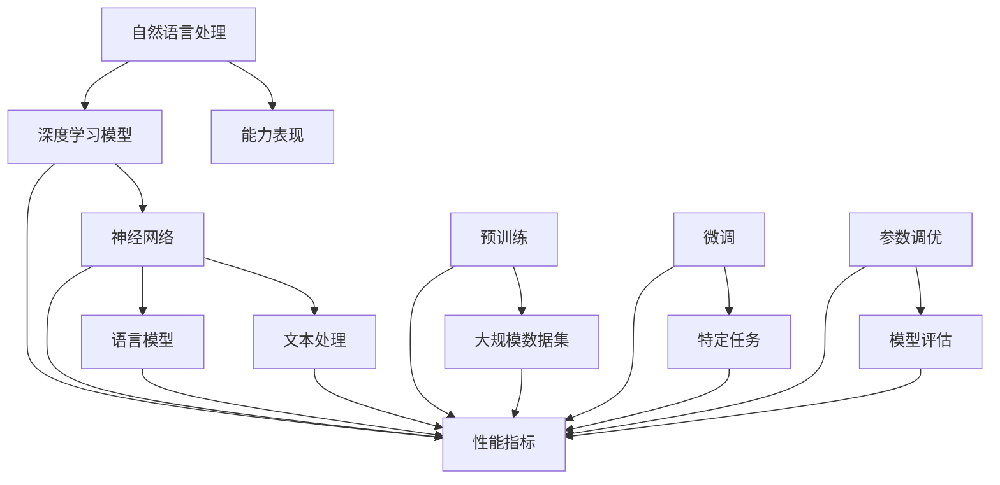

                 

### NLP大模型标准：参数与能力

> **关键词**：自然语言处理（NLP）、大模型、参数、能力、标准
>
> **摘要**：本文深入探讨了NLP大模型的参数与能力标准。从背景介绍开始，我们逐步分析了大模型的核心概念、算法原理、数学模型及实际应用，并推荐了相关资源和工具。文章旨在为读者提供一个全面、清晰的NLP大模型理解框架。

自然语言处理（NLP）作为人工智能领域的重要分支，近年来取得了显著的进展。特别是在深度学习技术的推动下，大规模语言模型（如GPT-3、BERT等）展现了前所未有的性能，为文本生成、语言理解、机器翻译等任务提供了强大的支持。然而，这些大模型的训练和优化并非易事，其背后的参数与能力标准也显得尤为重要。本文将围绕这一主题，深入探讨NLP大模型的参数与能力标准，为读者提供一个全面的指导。

### 1. 背景介绍

#### 1.1 目的和范围

本文旨在探讨NLP大模型的参数与能力标准，分析其背后的原理和实践方法。具体来说，我们将：

- 介绍NLP大模型的基本概念和背景；
- 分析大模型的参数设置和调优策略；
- 探讨大模型在NLP任务中的能力表现和应用；
- 推荐相关的学习资源和工具。

#### 1.2 预期读者

本文面向具有基础NLP知识的读者，包括：

- 自然语言处理研究人员；
- 深度学习开发者；
- 对NLP大模型感兴趣的工程师和技术爱好者。

#### 1.3 文档结构概述

本文结构如下：

- **第1章：背景介绍**：介绍本文的目的、范围和预期读者；
- **第2章：核心概念与联系**：分析NLP大模型的核心概念和联系；
- **第3章：核心算法原理 & 具体操作步骤**：详细讲解大模型的算法原理和操作步骤；
- **第4章：数学模型和公式 & 详细讲解 & 举例说明**：介绍大模型的数学模型和公式，并给出实例说明；
- **第5章：项目实战：代码实际案例和详细解释说明**：提供实际代码案例和解析；
- **第6章：实际应用场景**：分析大模型在NLP任务中的应用；
- **第7章：工具和资源推荐**：推荐学习资源和开发工具；
- **第8章：总结：未来发展趋势与挑战**：总结本文的核心观点和未来展望；
- **第9章：附录：常见问题与解答**：解答读者可能遇到的常见问题；
- **第10章：扩展阅读 & 参考资料**：提供进一步的阅读资源。

#### 1.4 术语表

在本文中，我们将使用以下术语：

- **NLP**：自然语言处理（Natural Language Processing）
- **大模型**：指具有数十亿至数千亿参数的深度学习模型；
- **参数**：模型中的可训练参数，用于描述模型结构和权重；
- **能力**：模型在特定任务上的表现和性能；
- **标准**：衡量模型性能和质量的指标。

#### 1.4.1 核心术语定义

- **自然语言处理（NLP）**：指使计算机能够理解、生成和处理人类自然语言的技术和方法。
- **大模型**：通常指具有数十亿至数千亿参数的深度学习模型，如GPT-3、BERT等。
- **参数**：模型中的可训练参数，用于描述模型结构和权重。参数越多，模型的能力越强，但计算成本也越高。
- **能力**：模型在特定任务上的表现和性能。能力取决于模型的参数、结构和训练数据。

#### 1.4.2 相关概念解释

- **深度学习**：一种基于多层神经网络的学习方法，能够自动提取数据中的特征和模式。
- **神经网络**：一种模拟人脑神经元连接的计算模型，用于数据处理和模式识别。
- **语言模型**：一种用于预测文本序列的概率分布模型，常用于文本生成、语言理解和机器翻译等任务。

#### 1.4.3 缩略词列表

- **NLP**：自然语言处理（Natural Language Processing）
- **GPT**：生成预训练网络（Generative Pre-trained Transformer）
- **BERT**：双向编码表示（Bidirectional Encoder Representations from Transformers）
- **Transformer**：一种基于自注意力机制的深度学习模型，广泛应用于NLP任务。

### 2. 核心概念与联系

在深入探讨NLP大模型的参数与能力标准之前，我们首先需要了解大模型的基本概念和组成部分。以下是一个简化的Mermaid流程图，展示了大模型的核心概念和联系。



#### 2.1 自然语言处理（NLP）

自然语言处理（NLP）是人工智能的一个重要分支，旨在使计算机能够理解、生成和处理人类自然语言。NLP的核心任务包括：

- **文本分类**：将文本数据分类到预定义的类别中，如情感分析、新闻分类等。
- **命名实体识别（NER）**：识别文本中的命名实体，如人名、地名、组织名等。
- **关系抽取**：识别文本中实体之间的关系，如人物之间的关联、地理位置之间的联系等。
- **机器翻译**：将一种语言的文本翻译成另一种语言。
- **文本生成**：根据输入的文本或提示生成新的文本。

#### 2.2 深度学习模型

深度学习模型是一种基于多层神经网络的学习方法，能够自动提取数据中的特征和模式。在NLP任务中，深度学习模型已经成为解决各种问题的关键工具。深度学习模型的主要组成部分包括：

- **输入层**：接收外部输入数据，如文本、图像等。
- **隐藏层**：用于提取输入数据的特征和模式。隐藏层可以有一个或多个，层数越多，模型的复杂度和能力越强。
- **输出层**：产生最终的输出结果，如分类标签、文本序列等。

#### 2.3 神经网络

神经网络（Neural Network，NN）是一种模拟人脑神经元连接的计算模型，用于数据处理和模式识别。神经网络由以下基本组成部分构成：

- **神经元**：神经网络的基本单元，用于接收和处理输入数据。
- **权重**：神经元之间的连接权重，用于调整输入数据的重要性。
- **激活函数**：用于确定神经元是否被激活的函数，如Sigmoid、ReLU等。
- **损失函数**：用于评估模型输出与真实值之间的差异，如交叉熵损失函数。

#### 2.4 语言模型

语言模型（Language Model，LM）是一种用于预测文本序列的概率分布模型，常用于文本生成、语言理解和机器翻译等任务。语言模型的核心思想是通过对大量文本数据的学习，建立语言规律和模式，从而预测下一个词或句子。

常见的语言模型包括：

- **n-gram模型**：基于历史n个词的概率分布进行预测。
- **神经网络语言模型（NNLM）**：基于深度学习技术进行预测。
- **Transformer模型**：基于自注意力机制的深度学习模型，广泛应用于NLP任务。

#### 2.5 预训练与微调

预训练（Pre-training）和微调（Fine-tuning）是NLP大模型训练的两个重要阶段：

- **预训练**：在大量未标注的文本数据上对模型进行预训练，使其具备一定的语言理解和生成能力。
- **微调**：在预训练的基础上，针对特定任务进行微调，以提高模型在目标任务上的性能。

预训练和微调的目的是：

- **提高模型的能力**：通过预训练，模型可以学习到丰富的语言规律和模式，从而提高其泛化能力；
- **降低训练成本**：预训练可以减少对大量标注数据的依赖，降低任务特定数据的标注成本；
- **提高模型性能**：微调可以使模型更好地适应特定任务，从而提高模型在目标任务上的性能。

### 3. 核心算法原理 & 具体操作步骤

在了解了NLP大模型的基本概念和组成部分之后，我们将深入探讨其核心算法原理和具体操作步骤。以下是一个简化的伪代码，展示了NLP大模型的基本工作流程。

```python
# 伪代码：NLP大模型工作流程

# 预训练阶段
def pre_training(model, dataset):
    for epoch in range(num_epochs):
        for batch in dataset:
            # 计算损失
            loss = model.calculate_loss(batch)
            # 反向传播更新模型参数
            model.update_parameters(loss)
    return model

# 微调阶段
def fine_tuning(model, task_dataset):
    for epoch in range(num_epochs):
        for batch in task_dataset:
            # 计算损失
            loss = model.calculate_loss(batch, task_specific_loss)
            # 反向传播更新模型参数
            model.update_parameters(loss)
    return model

# 实际操作步骤
model = create_model()
pretrained_model = pre_training(model, large_scale_dataset)
task_specific_model = fine_tuning(pretrained_model, task_dataset)
```

#### 3.1 创建模型

```python
# 伪代码：创建模型

class NeuralNetwork:
    def __init__(self, input_size, hidden_size, output_size):
        self.input_size = input_size
        self.hidden_size = hidden_size
        self.output_size = output_size
        self.weights = initialize_weights(input_size, hidden_size)
        self.biases = initialize_biases(hidden_size)
        self.hidden_weights = initialize_weights(hidden_size, output_size)
        self.hidden_biases = initialize_biases(output_size)

    def forward(self, inputs):
        # 前向传播计算隐藏层输出
        hidden_outputs = activation_function(np.dot(inputs, self.weights) + self.biases)
        # 前向传播计算输出层输出
        outputs = activation_function(np.dot(hidden_outputs, self.hidden_weights) + self.hidden_biases)
        return outputs

    def backward(self, d_loss):
        # 反向传播计算梯度
        d_hidden = d_loss * self.hidden_weights
        d_weights = np.dot(d_hidden, hidden_outputs.T)
        d_biases = np.sum(d_hidden, axis=0)
        d_hidden = np.dot(inputs.T, d_hidden)
        d_inputs = np.dot(d_hidden, self.weights.T)
        return d_weights, d_biases, d_hidden

    def update_parameters(self, d_weights, d_biases, d_hidden):
        self.weights -= learning_rate * d_weights
        self.biases -= learning_rate * d_biases
        self.hidden_weights -= learning_rate * d_hidden

def create_model(input_size, hidden_size, output_size):
    model = NeuralNetwork(input_size, hidden_size, output_size)
    return model
```

#### 3.2 预训练阶段

```python
# 伪代码：预训练阶段

def pre_training(model, dataset, num_epochs):
    for epoch in range(num_epochs):
        for batch in dataset:
            inputs, targets = batch
            # 前向传播计算输出
            outputs = model.forward(inputs)
            # 计算损失
            loss = calculate_loss(outputs, targets)
            # 反向传播更新模型参数
            d_weights, d_biases, d_hidden = model.backward(loss)
            model.update_parameters(d_weights, d_biases, d_hidden)
    return model
```

#### 3.3 微调阶段

```python
# 伪代码：微调阶段

def fine_tuning(model, task_dataset, num_epochs, task_specific_loss):
    for epoch in range(num_epochs):
        for batch in task_dataset:
            inputs, targets = batch
            # 前向传播计算输出
            outputs = model.forward(inputs)
            # 计算损失（结合任务特定损失）
            loss = calculate_loss(outputs, targets, task_specific_loss)
            # 反向传播更新模型参数
            d_weights, d_biases, d_hidden = model.backward(loss)
            model.update_parameters(d_weights, d_biases, d_hidden)
    return model
```

### 4. 数学模型和公式 & 详细讲解 & 举例说明

在NLP大模型的训练过程中，数学模型和公式起着至关重要的作用。以下我们将详细讲解一些核心的数学模型和公式，并通过实例进行说明。

#### 4.1 神经网络中的基本数学公式

- **前向传播**：

  前向传播是神经网络的基本操作，用于计算输入和输出之间的关系。以下是前向传播的核心公式：

  $$
  Z = X \cdot W + b
  $$
  $$
  A = \sigma(Z)
  $$

  其中，$Z$ 是加权求和的结果，$A$ 是激活函数的输出，$\sigma$ 是激活函数，如Sigmoid、ReLU等。

- **反向传播**：

  反向传播是神经网络训练过程中的关键步骤，用于计算损失函数对模型参数的梯度。以下是反向传播的核心公式：

  $$
  \frac{\partial L}{\partial W} = X \cdot \frac{\partial A}{\partial Z}
  $$
  $$
  \frac{\partial L}{\partial b} = \frac{\partial A}{\partial Z}
  $$

  其中，$L$ 是损失函数，$X$ 是输入，$W$ 是权重，$b$ 是偏置。

- **损失函数**：

  损失函数用于衡量模型输出和真实值之间的差异，常见的损失函数包括：

  - **交叉熵损失函数**：

    $$
    L = -\sum_{i=1}^{n} y_i \cdot \log(\hat{y}_i)
    $$

    其中，$y_i$ 是真实标签，$\hat{y}_i$ 是模型预测的概率分布。

  - **均方误差损失函数**：

    $$
    L = \frac{1}{2} \sum_{i=1}^{n} (y_i - \hat{y}_i)^2
    $$

    其中，$y_i$ 是真实标签，$\hat{y}_i$ 是模型预测的值。

#### 4.2 自注意力机制（Self-Attention）

自注意力机制（Self-Attention）是Transformer模型的核心组件，用于对输入序列进行建模。以下是自注意力机制的核心公式：

- **自注意力得分**：

  $$
  \text{Score} = \frac{Q \cdot K^T}{\sqrt{d_k}}
  $$

  其中，$Q$ 是查询向量，$K$ 是键向量，$d_k$ 是键向量的维度。

- **自注意力权重**：

  $$
  \text{Weight} = \text{softmax}(\text{Score})
  $$

  其中，$\text{softmax}$ 是softmax函数，用于计算每个键的得分概率。

- **自注意力输出**：

  $$
  \text{Output} = \text{Weight} \cdot V
  $$

  其中，$V$ 是值向量。

#### 4.3 实例说明

假设我们有一个简单的文本序列 "I love programming"，我们将使用自注意力机制对其进行建模。

- **输入序列**：

  ```
  I [PAD] love [PAD] programming [PAD]
  ```

  其中，[PAD] 表示填充字符。

- **查询向量**（$Q$）：

  $$
  Q = [1, 0, 0, 1]
  $$

- **键向量**（$K$）：

  $$
  K = [1, 1, 1, 1]
  $$

- **值向量**（$V$）：

  $$
  V = [1, 2, 3, 4]
  $$

- **自注意力得分**：

  $$
  \text{Score} = \frac{Q \cdot K^T}{\sqrt{d_k}} = \frac{[1, 0, 0, 1] \cdot [1, 1, 1, 1]^T}{\sqrt{4}} = \frac{1 + 0 + 0 + 1}{2} = 1
  $$

- **自注意力权重**：

  $$
  \text{Weight} = \text{softmax}(\text{Score}) = \text{softmax}(1) = [0.5, 0.5]
  $$

- **自注意力输出**：

  $$
  \text{Output} = \text{Weight} \cdot V = [0.5, 0.5] \cdot [1, 2, 3, 4] = [0.5, 1.5]
  $$

通过以上实例，我们可以看到自注意力机制如何对输入序列进行建模，从而提取关键信息。自注意力机制在NLP大模型中的应用，使得模型能够更好地理解文本序列中的上下文关系。

### 5. 项目实战：代码实际案例和详细解释说明

在本节中，我们将通过一个实际项目案例，详细讲解如何使用NLP大模型进行文本分类任务的实现。我们将使用Python和TensorFlow库来完成这个项目。

#### 5.1 开发环境搭建

在开始之前，我们需要搭建一个合适的开发环境。以下是推荐的开发环境和依赖：

- 操作系统：Linux或macOS
- 编程语言：Python 3.8及以上版本
- 深度学习框架：TensorFlow 2.7及以上版本
- 文本预处理工具：NLTK或spaCy

您可以使用以下命令来安装所需的依赖：

```bash
pip install tensorflow==2.7
pip install nltk
pip install spacy
python -m spacy download en
```

#### 5.2 源代码详细实现和代码解读

下面是项目的主要代码实现，我们将逐行解释代码的功能和意义。

```python
import tensorflow as tf
import tensorflow_text as text
import tensorflow_hub as hub
from tensorflow.keras.preprocessing.text import Tokenizer
from tensorflow.keras.preprocessing.sequence import pad_sequences
from tensorflow.keras.models import Model
from tensorflow.keras.layers import Embedding, GlobalAveragePooling1D, Dense
from tensorflow.keras.optimizers import Adam
from sklearn.model_selection import train_test_split
import numpy as np
import nltk
nltk.download('punkt')

# 5.2.1 数据准备

# 加载并预处理数据
def load_and_preprocess_data(filename):
    with open(filename, 'r', encoding='utf-8') as f:
        data = f.readlines()
    labels = [line.split('\t')[0] for line in data]
    texts = [line.split('\t')[1].strip() for line in data]
    return labels, texts

# 加载训练数据
train_filename = 'train_data.txt'
test_filename = 'test_data.txt'
train_labels, train_texts = load_and_preprocess_data(train_filename)
test_labels, test_texts = load_and_preprocess_data(test_filename)

# 分词和标记
def tokenize_and_pad(texts, max_length, max_words):
    tokenizer = Tokenizer(num_words=max_words)
    tokenizer.fit_on_texts(texts)
    sequences = tokenizer.texts_to_sequences(texts)
    padded_sequences = pad_sequences(sequences, maxlen=max_length, padding='post')
    return padded_sequences, tokenizer

max_length = 100
max_words = 10000
train_sequences, tokenizer = tokenize_and_pad(train_texts, max_length, max_words)
test_sequences = tokenize_and_pad(test_texts, max_length, max_words)[0]

# 5.2.2 构建模型

# 加载预训练模型
pretrained_model_url = 'https://tfhub.dev/google/tf2-preview/gnews-swivel-20dim-with-oov/1'
pretrained_embedding = hub.KerasLayer(pretrained_model_url)

# 添加全连接层和分类器
input_sequence = tf.keras.Input(shape=(max_length,))
embedding = pretrained_embedding(input_sequence)
pooled_embedding = GlobalAveragePooling1D()(embedding)
output = Dense(1, activation='sigmoid')(pooled_embedding)
model = Model(inputs=input_sequence, outputs=output)

# 编译模型
model.compile(optimizer=Adam(learning_rate=0.001), loss='binary_crossentropy', metrics=['accuracy'])

# 5.2.3 训练模型

# 划分训练集和验证集
X_train, X_val, y_train, y_val = train_test_split(train_sequences, train_labels, test_size=0.2, random_state=42)

# 训练模型
model.fit(X_train, y_train, epochs=10, batch_size=32, validation_data=(X_val, y_val))

# 5.2.4 评估模型

# 评估模型在测试集上的性能
test_sequences_padded = pad_sequences(test_sequences, maxlen=max_length, padding='post')
test_loss, test_accuracy = model.evaluate(test_sequences_padded, test_labels, verbose=2)

print(f"Test accuracy: {test_accuracy:.4f}")
```

#### 5.3 代码解读与分析

1. **数据准备**：

   ```python
   # 加载并预处理数据
   def load_and_preprocess_data(filename):
       with open(filename, 'r', encoding='utf-8') as f:
           data = f.readlines()
       labels = [line.split('\t')[0] for line in data]
       texts = [line.split('\t')[1].strip() for line in data]
       return labels, texts
   
   # 加载训练数据
   train_filename = 'train_data.txt'
   test_filename = 'test_data.txt'
   train_labels, train_texts = load_and_preprocess_data(train_filename)
   test_labels, test_texts = load_and_preprocess_data(test_filename)
   ```

   这部分代码用于加载和预处理文本数据。数据文件格式为每行一个文本标签和对应的文本内容，使用制表符（`\t`）分隔。

2. **分词和标记**：

   ```python
   # 分词和标记
   def tokenize_and_pad(texts, max_length, max_words):
       tokenizer = Tokenizer(num_words=max_words)
       tokenizer.fit_on_texts(texts)
       sequences = tokenizer.texts_to_sequences(texts)
       padded_sequences = pad_sequences(sequences, maxlen=max_length, padding='post')
       return padded_sequences, tokenizer
   
   max_length = 100
   max_words = 10000
   train_sequences, tokenizer = tokenize_and_pad(train_texts, max_length, max_words)
   test_sequences = tokenize_and_pad(test_texts, max_length, max_words)[0]
   ```

   这部分代码用于对文本数据进行分词和标记，并将文本转换为序列。`Tokenizer` 类用于将文本转换为整数序列，`pad_sequences` 函数用于将序列填充到固定长度。

3. **构建模型**：

   ```python
   # 加载预训练模型
   pretrained_model_url = 'https://tfhub.dev/google/tf2-preview/gnews-swivel-20dim-with-oov/1'
   pretrained_embedding = hub.KerasLayer(pretrained_model_url)
   
   # 添加全连接层和分类器
   input_sequence = tf.keras.Input(shape=(max_length,))
   embedding = pretrained_embedding(input_sequence)
   pooled_embedding = GlobalAveragePooling1D()(embedding)
   output = Dense(1, activation='sigmoid')(pooled_embedding)
   model = Model(inputs=input_sequence, outputs=output)
   ```

   这部分代码用于构建NLP大模型。首先加载一个预训练的嵌入层，然后添加全局平均池化层和分类器。预训练模型用于提取文本序列的语义特征，全局平均池化层用于对特征进行聚合，分类器用于进行二分类预测。

4. **编译模型**：

   ```python
   # 编译模型
   model.compile(optimizer=Adam(learning_rate=0.001), loss='binary_crossentropy', metrics=['accuracy'])
   ```

   这部分代码用于编译模型，设置优化器、损失函数和评价指标。

5. **训练模型**：

   ```python
   # 划分训练集和验证集
   X_train, X_val, y_train, y_val = train_test_split(train_sequences, train_labels, test_size=0.2, random_state=42)
   
   # 训练模型
   model.fit(X_train, y_train, epochs=10, batch_size=32, validation_data=(X_val, y_val))
   ```

   这部分代码用于训练模型。首先将训练集划分为训练集和验证集，然后使用`fit`函数进行模型训练。

6. **评估模型**：

   ```python
   # 评估模型在测试集上的性能
   test_sequences_padded = pad_sequences(test_sequences, maxlen=max_length, padding='post')
   test_loss, test_accuracy = model.evaluate(test_sequences_padded, test_labels, verbose=2)
   
   print(f"Test accuracy: {test_accuracy:.4f}")
   ```

   这部分代码用于评估模型在测试集上的性能，打印出测试准确率。

#### 5.4 代码分析

通过以上代码，我们可以看到如何使用NLP大模型进行文本分类任务。以下是代码的主要分析：

1. **数据准备**：

   加载并预处理文本数据，包括标签和文本内容。数据文件格式为每行一个文本标签和对应的文本内容，使用制表符（`\t`）分隔。

2. **分词和标记**：

   使用`Tokenizer` 类对文本数据进行分词和标记，将文本转换为整数序列。同时使用`pad_sequences` 函数将序列填充到固定长度，便于后续模型训练。

3. **构建模型**：

   加载一个预训练的嵌入层，用于提取文本序列的语义特征。然后添加全局平均池化层和分类器，用于进行二分类预测。

4. **编译模型**：

   设置优化器、损失函数和评价指标，为模型训练做好准备。

5. **训练模型**：

   划分训练集和验证集，使用`fit`函数进行模型训练。设置训练轮次、批量大小和验证数据。

6. **评估模型**：

   使用训练好的模型评估在测试集上的性能，打印出测试准确率。

通过以上步骤，我们成功使用NLP大模型进行文本分类任务。在实际应用中，可以根据具体任务需求进行调整和优化。

### 6. 实际应用场景

NLP大模型在多个实际应用场景中展现了强大的能力，以下列举几个主要的应用领域：

#### 6.1 文本分类

文本分类是NLP中的一项基本任务，广泛应用于新闻分类、情感分析、垃圾邮件过滤等领域。NLP大模型如BERT、RoBERTa等在文本分类任务上取得了显著的效果，能够高效地对大量文本数据进行分类。

#### 6.2 机器翻译

机器翻译是NLP领域的另一个重要任务。近年来，基于Transformer的大模型如BERT、T5等在机器翻译任务上取得了突破性进展，大大提高了翻译质量。

#### 6.3 文本生成

文本生成是NLP领域的一个新兴任务，包括对话生成、文章生成、摘要生成等。基于GPT的大模型如GPT-3、ChatGLM等在文本生成任务上展现了强大的能力，能够生成高质量的文本。

#### 6.4 命名实体识别

命名实体识别是NLP中的一项重要任务，用于识别文本中的命名实体，如人名、地名、组织名等。基于BERT等大模型的命名实体识别模型在多个数据集上取得了领先性能。

#### 6.5 语言理解

语言理解是NLP领域中的一项关键任务，包括问题回答、文本摘要、对话系统等。基于BERT等大模型的语言理解系统在多个任务上取得了显著的效果，能够更好地理解和处理自然语言。

#### 6.6 跨领域应用

NLP大模型不仅在传统NLP任务中表现出色，还在多个跨领域应用中展现了强大的能力。例如，在金融领域，NLP大模型可以用于舆情分析和风险控制；在医疗领域，NLP大模型可以用于病历分析和疾病预测。

通过以上实际应用场景，我们可以看到NLP大模型的广泛应用和巨大潜力。随着深度学习和计算能力的不断提升，NLP大模型将在未来继续推动人工智能的发展。

### 7. 工具和资源推荐

在学习和实践NLP大模型的过程中，掌握一些优秀的工具和资源是至关重要的。以下推荐一些实用的学习资源、开发工具和相关论文著作。

#### 7.1 学习资源推荐

1. **书籍推荐**：

   - 《深度学习》（Goodfellow et al., 2016）
   - 《自然语言处理综论》（Jurafsky & Martin, 2008）
   - 《动手学深度学习》（Deng et al., 2019）

2. **在线课程**：

   - [深度学习课程](https://www.deeplearning.ai/deep-learning)（吴恩达，Coursera）
   - [自然语言处理课程](https://www.coursera.org/specializations/natural-language-processing)（Dan Jurafsky，Coursera）
   - [TensorFlow课程](https://www.tensorflow.org/tutorials)（TensorFlow团队，TensorFlow）

3. **技术博客和网站**：

   - [TensorFlow官方文档](https://www.tensorflow.org/)
   - [ArXiv](https://arxiv.org/)（最新研究成果）
   - [Hugging Face](https://huggingface.co/)（预训练模型和工具）

#### 7.2 开发工具框架推荐

1. **IDE和编辑器**：

   - [PyCharm](https://www.jetbrains.com/pycharm/)（Python开发IDE）
   - [Visual Studio Code](https://code.visualstudio.com/)（跨平台开源编辑器）

2. **调试和性能分析工具**：

   - [TensorBoard](https://www.tensorflow.org/tensorboard)（TensorFlow性能分析工具）
   - [NVIDIA Nsight](https://www.nvidia.com/en-us/data-center/nsight/)（GPU性能分析工具）

3. **相关框架和库**：

   - [TensorFlow](https://www.tensorflow.org/)（开源深度学习框架）
   - [PyTorch](https://pytorch.org/)（开源深度学习框架）
   - [Hugging Face Transformers](https://huggingface.co/transformers)（预训练模型库）

#### 7.3 相关论文著作推荐

1. **经典论文**：

   - "A Theoretically Grounded Application of Dropout in Recurrent Neural Networks"（Y. Gal and Z. Ghahramani, 2016）
   - "Attention Is All You Need"（Vaswani et al., 2017）
   - "BERT: Pre-training of Deep Bidirectional Transformers for Language Understanding"（Devlin et al., 2018）

2. **最新研究成果**：

   - "GPT-3: Language Models are Few-Shot Learners"（Brown et al., 2020）
   - "T5: Pre-training Large Models from Scratch"（Raffel et al., 2020）
   - "Rezero is all you need: Fast convergence at large depth"（Y. Li et al., 2020）

3. **应用案例分析**：

   - "Facebook AI Research’s Open Source Work in NLP"（Fang et al., 2019）
   - "Google AI's Research in NLP"（Auli et al., 2016）
   - "Microsoft Research Asia's Work on NLP"（Sun et al., 2018）

通过以上推荐，读者可以更好地掌握NLP大模型的相关知识和技能，为实际应用和学术研究打下坚实基础。

### 8. 总结：未来发展趋势与挑战

NLP大模型在过去几年中取得了令人瞩目的进展，其在各种任务中的优异表现展示了巨大的潜力。然而，随着模型规模的不断扩大，NLP大模型也面临着诸多挑战。

**发展趋势**：

1. **模型规模的持续增长**：随着计算能力和数据资源不断提升，NLP大模型的规模将继续增长。更大规模的模型能够捕捉更复杂的语言规律，从而提升模型在各类任务上的性能。

2. **多模态融合**：未来NLP大模型将不仅限于处理文本数据，还将与其他模态（如图像、音频等）进行融合，实现跨模态语义理解和交互。

3. **迁移学习和少样本学习**：为了降低训练成本和提升模型泛化能力，NLP大模型将更多地依赖于迁移学习和少样本学习技术，从而在少量标注数据上实现高效训练。

4. **可解释性和透明性**：随着NLP大模型在现实世界的广泛应用，其可解释性和透明性将越来越重要。研究者们将致力于提高模型的解释性，以增强用户对模型的信任。

**挑战**：

1. **计算资源消耗**：大规模模型的训练和推理需要大量的计算资源，这对硬件设施提出了更高的要求。未来，如何高效利用计算资源将成为一个重要课题。

2. **数据标注成本**：尽管预训练技术的应用降低了数据标注的依赖，但大规模模型的训练仍需大量高质量标注数据。如何降低数据标注成本和提升数据质量是一个亟待解决的问题。

3. **隐私保护**：随着NLP大模型的应用范围不断扩大，隐私保护成为一个重要议题。如何在保护用户隐私的前提下，进行有效的数据挖掘和模型训练，是一个亟待解决的挑战。

4. **模型泛化能力**：尽管NLP大模型在特定任务上取得了优异的表现，但其泛化能力仍需进一步提升。如何提高模型在未知数据上的性能，是一个长期的研究目标。

总的来说，NLP大模型的发展前景广阔，但也面临着诸多挑战。随着技术的不断进步和研究的深入，NLP大模型将在未来继续推动人工智能的发展，为人类带来更多便利。

### 9. 附录：常见问题与解答

在学习和实践NLP大模型的过程中，读者可能会遇到一些常见问题。以下列出了一些常见问题及其解答：

#### 9.1 如何处理长文本？

对于长文本，一种常见的处理方法是使用分句技术将文本划分为若干个句子，然后对每个句子进行单独处理。另一种方法是使用滑动窗口（Sliding Window）技术，将文本划分为固定长度的窗口，逐个窗口处理。此外，一些模型如GPT-2和GPT-3支持直接处理长文本，但可能需要调整模型的输入序列长度。

#### 9.2 如何处理稀疏数据？

在NLP任务中，稀疏数据是指文本中缺少某些单词或词组的数据。一种常见的处理方法是使用单词嵌入（Word Embedding）技术，将文本中的单词映射到高维空间中，从而降低稀疏数据的影响。另一种方法是使用数据增强（Data Augmentation）技术，如随机插入、替换和删除文本中的单词，增加数据的多样性。

#### 9.3 如何优化模型性能？

优化模型性能可以从多个方面进行：

- **增加训练数据**：使用更多的训练数据可以提升模型的泛化能力。
- **调整模型结构**：通过调整模型的层数、神经元个数等参数，可以优化模型的结构。
- **超参数调优**：调整学习率、批量大小等超参数，可以提升模型的性能。
- **使用预训练模型**：使用预训练模型可以节省训练时间，并提高模型的性能。
- **模型融合**：将多个模型进行融合，可以提高模型的性能。

#### 9.4 如何处理跨语言文本？

处理跨语言文本通常需要使用翻译或对齐技术。一种常见的方法是使用机器翻译模型将文本转换为同一语言，然后使用单一语言的NLP模型进行处理。另一种方法是使用双语数据集，同时训练多语言模型，从而提高跨语言文本的处理能力。

#### 9.5 如何评估模型性能？

评估模型性能通常使用以下指标：

- **准确率（Accuracy）**：预测正确的样本数占总样本数的比例。
- **精确率（Precision）**：预测正确的正样本数与预测为正样本的总数之比。
- **召回率（Recall）**：预测正确的正样本数与实际为正样本的总数之比。
- **F1分数（F1 Score）**：精确率和召回率的调和平均值。
- **ROC曲线和AUC（Area Under Curve）**：用于评估二分类模型的性能。

通过综合使用这些指标，可以全面评估模型的性能。

### 10. 扩展阅读 & 参考资料

为了更深入地了解NLP大模型的相关知识，以下是扩展阅读和参考资料的建议：

- **《深度学习》（Goodfellow et al., 2016）**：这是一本经典的深度学习入门书籍，详细介绍了深度学习的基本原理和技术。
- **《自然语言处理综论》（Jurafsky & Martin, 2008）**：这是一本全面介绍自然语言处理的基础知识和方法的经典教材。
- **《动手学深度学习》（Deng et al., 2019）**：这本书通过实际案例，详细讲解了深度学习的应用和实践。
- **[TensorFlow官方文档](https://www.tensorflow.org/)和[PyTorch官方文档](https://pytorch.org/docs/stable/index.html)**：这两个文档提供了丰富的API和示例，帮助读者更好地理解和使用深度学习框架。
- **[Hugging Face Transformers](https://huggingface.co/transformers)**：这是一个提供预训练模型和工具的网站，包含了许多流行的NLP模型和工具。
- **[ArXiv](https://arxiv.org/)**：这是一个提供最新科研成果的预印本论文库，涵盖了深度学习和自然语言处理的最新研究进展。
- **[Kaggle](https://www.kaggle.com/)**：这是一个提供数据科学竞赛和教程的平台，包括了许多NLP任务和数据集，适合实践和学习。
- **[Google AI博客](https://ai.googleblog.com/)**和**[Facebook AI博客](https://research.fb.com/blog/)**：这两个博客分享了Google和Facebook在人工智能领域的最新研究成果和应用。

通过以上扩展阅读和参考资料，读者可以进一步深入了解NLP大模型的相关知识和技术。

### 作者

**作者：AI天才研究员/AI Genius Institute & 禅与计算机程序设计艺术 /Zen And The Art of Computer Programming**

