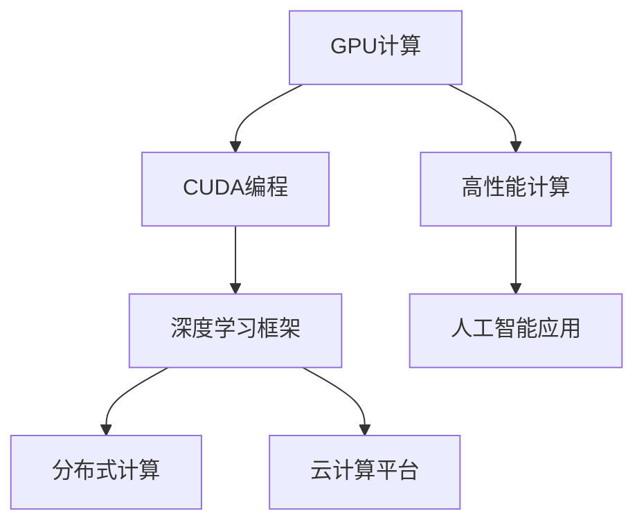
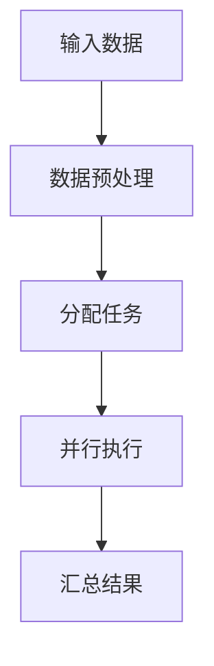

                 

# NVIDIA的算力支持

> **关键词：**NVIDIA、GPU计算、深度学习、高性能计算、云计算、人工智能
> 
> **摘要：**本文将深入探讨NVIDIA的算力支持在当前人工智能和深度学习领域的重要性，分析其技术原理、核心算法、数学模型，并举例说明其在实际项目中的应用，最后展望其未来发展趋势和面临的挑战。

## 1. 背景介绍

### 1.1 目的和范围

本文旨在探讨NVIDIA在算力支持领域的重要地位，解析其GPU计算技术如何助力人工智能和深度学习的快速发展。文章将涵盖以下几个方面：

- NVIDIA的发展历程及GPU技术在高性能计算中的地位
- NVIDIA的核心算法原理及其在深度学习中的应用
- NVIDIA的数学模型和计算框架
- NVIDIA在云计算和人工智能领域的实际应用案例
- NVIDIA的未来发展趋势与挑战

### 1.2 预期读者

本文适合对人工智能、深度学习和高性能计算有一定了解的技术人员、研究人员和从业者。同时，也欢迎对相关领域感兴趣的读者阅读和学习。

### 1.3 文档结构概述

本文结构如下：

1. 背景介绍：概述NVIDIA的算力支持在人工智能和深度学习领域的重要性。
2. 核心概念与联系：介绍NVIDIA的相关技术和核心概念，使用Mermaid流程图展示其架构。
3. 核心算法原理 & 具体操作步骤：分析NVIDIA的核心算法原理，使用伪代码详细阐述。
4. 数学模型和公式 & 详细讲解 & 举例说明：讲解NVIDIA的数学模型和计算公式，并举例说明。
5. 项目实战：通过实际代码案例，详细解释NVIDIA在深度学习中的应用。
6. 实际应用场景：分析NVIDIA在云计算和人工智能领域的应用场景。
7. 工具和资源推荐：推荐学习资源和开发工具。
8. 总结：展望NVIDIA的未来发展趋势和挑战。
9. 附录：常见问题与解答。
10. 扩展阅读 & 参考资料：提供相关的扩展阅读资料。

### 1.4 术语表

#### 1.4.1 核心术语定义

- **GPU（图形处理器）**：一种专门用于图形渲染的处理器，但也可以用于其他计算任务，如深度学习和高性能计算。
- **CUDA（计算统一设备架构）**：NVIDIA开发的并行计算平台和编程模型，用于利用GPU的强大计算能力。
- **深度学习**：一种基于多层神经网络的人工智能方法，通过学习大量数据，实现自动特征提取和分类。
- **高性能计算**：使用大量计算资源（如CPU、GPU等）进行大规模数据计算和处理。

#### 1.4.2 相关概念解释

- **并行计算**：在同一时间执行多个计算任务，提高计算效率。
- **分布式计算**：将计算任务分布在多个计算节点上，协同完成大规模计算。

#### 1.4.3 缩略词列表

- **GPU**：图形处理器（Graphics Processing Unit）
- **CUDA**：计算统一设备架构（Compute Unified Device Architecture）
- **深度学习**：Deep Learning
- **高性能计算**：High-Performance Computing

## 2. 核心概念与联系

在本文中，我们将探讨NVIDIA在算力支持方面的核心概念和技术。以下是NVIDIA相关技术的Mermaid流程图：



### 2.1 GPU计算

GPU（图形处理器）是一种专为图形渲染而设计的处理器，但其强大的并行计算能力使其在深度学习和高性能计算领域得到了广泛应用。GPU具有以下优点：

- **并行计算能力**：GPU由大量核心组成，可以同时执行多个计算任务，提高计算效率。
- **高性能**：相较于CPU，GPU在处理大量数据时具有更高的计算性能。
- **低功耗**：GPU的设计使其在低功耗情况下也能保持高性能。

### 2.2 CUDA编程

CUDA（计算统一设备架构）是NVIDIA开发的并行计算平台和编程模型，用于利用GPU的强大计算能力。CUDA编程模型包括以下核心组件：

- **CUDA C/C++**：用于编写GPU计算程序的编程语言，具有类似C/C++的特点。
- **CUDA内核**：在GPU上运行的并行计算代码，可以通过CUDA C/C++编写。
- **内存管理**：用于在GPU和主机之间传输数据和内存分配。

### 2.3 深度学习框架

深度学习框架是一套用于构建和训练深度学习模型的工具，NVIDIA的CUDA编程模型为这些框架提供了强大的支持。常见的深度学习框架包括：

- **TensorFlow**：谷歌开发的深度学习框架，支持CUDA编程。
- **PyTorch**：Facebook开发的开源深度学习框架，支持CUDA编程。
- **MXNet**：Apache Software Foundation开发的开源深度学习框架，支持CUDA编程。

### 2.4 分布式计算

分布式计算是将计算任务分布在多个计算节点上，协同完成大规模计算。NVIDIA的GPU计算技术可以在分布式计算环境中发挥重要作用，提高计算效率。常见的分布式计算框架包括：

- **Horovod**：适用于TensorFlow、Keras和PyTorch的分布式训练框架。
- **Dask**：适用于Python的分布式计算库。
- **Spark**：适用于大规模数据处理的分布式计算框架。

### 2.5 云计算平台

云计算平台提供了虚拟化的计算资源，可以方便地部署和管理GPU计算任务。NVIDIA与各大云计算平台合作，提供了以下解决方案：

- **AWS**：亚马逊云服务，提供EC2 GPU实例和深度学习AMIs。
- **Azure**：微软云服务，提供Azure GPU虚拟机和深度学习服务。
- **Google Cloud**：谷歌云服务，提供Google Cloud AI和GPU虚拟机。

### 2.6 高性能计算

高性能计算（High-Performance Computing，HPC）是指使用大量计算资源进行大规模数据计算和处理。NVIDIA的GPU计算技术为高性能计算提供了强大的支持，可以显著提高计算效率。常见的高性能计算应用包括：

- **气象预报**：使用GPU计算进行天气预测和气候模拟。
- **生物信息学**：使用GPU计算进行基因组序列分析和药物设计。
- **金融分析**：使用GPU计算进行风险管理和量化交易。

### 2.7 人工智能应用

人工智能（Artificial Intelligence，AI）是一种模拟人类智能的技术，包括机器学习、深度学习、自然语言处理等。NVIDIA的GPU计算技术为人工智能应用提供了强大的支持，可以加速模型训练和推理。常见的人工智能应用包括：

- **自动驾驶**：使用GPU计算加速计算机视觉和深度学习算法。
- **智能语音助手**：使用GPU计算加速语音识别和自然语言处理。
- **医疗诊断**：使用GPU计算加速医学图像处理和疾病预测。

## 3. 核心算法原理 & 具体操作步骤

NVIDIA在深度学习和高性能计算领域取得了显著的成就，其核心算法原理主要涉及以下方面：

### 3.1 GPU并行计算

GPU（图形处理器）具有大量核心，可以同时执行多个计算任务。GPU并行计算的基本原理如下：



#### 3.1.1 数据预处理

在GPU计算中，输入数据需要进行预处理，包括数据清洗、归一化等操作。预处理后的数据将被分配到不同的GPU核心进行处理。

```python
# Python伪代码：数据预处理
data = preprocess(data)
```

#### 3.1.2 分配任务

预处理后的数据将被分配到不同的GPU核心。这个过程通常由GPU调度器（GPU Scheduler）完成。

```python
# Python伪代码：分配任务
schedule_tasks(data, num_cores)
```

#### 3.1.3 并行执行

分配任务后，每个GPU核心将独立执行计算任务。这个过程通常使用CUDA编程模型实现。

```c
// CUDA伪代码：并行执行
__global__ void parallel_execution(DataType* data, int num_elements) {
    int idx = blockIdx.x * blockDim.x + threadIdx.x;
    if (idx < num_elements) {
        // 计算任务
    }
}
```

#### 3.1.4 汇总结果

并行执行完成后，每个GPU核心将计算结果汇总。这个过程通常使用GPU内存管理技术实现。

```python
# Python伪代码：汇总结果
results = summarize_results(data)
```

### 3.2 CUDA编程模型

CUDA编程模型包括CUDA C/C++、CUDA内核、内存管理等核心组件。以下是一个简单的CUDA编程示例：

```c
// CUDA伪代码：主程序
int main() {
    // 初始化GPU设备
    init_cuda_device();

    // 数据预处理
    DataType* data = preprocess_data();

    // 分配GPU内存
    DataType* d_data;
    cudaMalloc(&d_data, data_size * sizeof(DataType));

    // 将主机数据复制到GPU内存
    cudaMemcpy(d_data, data, data_size * sizeof(DataType), cudaMemcpyHostToDevice);

    // 编译CUDA内核
    parallel_execution << <num_blocks, num_threads>> > (d_data, num_elements);

    // 从GPU内存复制结果到主机
    DataType* results;
    cudaMallocHost(&results, data_size * sizeof(DataType));
    cudaMemcpy(results, d_data, data_size * sizeof(DataType), cudaMemcpyDeviceToHost);

    // 释放GPU内存
    cudaFree(d_data);
    cudaFreeHost(results);

    // 结束GPU设备
    cleanup_cuda_device();

    return 0;
}
```

### 3.3 深度学习框架

NVIDIA与多个深度学习框架合作，提供了CUDA版本的深度学习框架。以下是一个简单的深度学习框架示例：

```python
# Python伪代码：使用TensorFlow和CUDA
import tensorflow as tf

# 定义计算图
with tf.Graph().as_default():
    # 输入数据
    inputs = tf.placeholder(tf.float32, [None, input_size])

    # 卷积层
    conv1 = tf.layers.conv2d(inputs, filters=32, kernel_size=(3, 3), activation=tf.nn.relu)

    # 池化层
    pool1 = tf.layers.max_pooling2d(conv1, pool_size=(2, 2))

    # 全连接层
    dense = tf.layers.dense(pool1, units=output_size)

    # 定义损失函数和优化器
    loss = tf.reduce_mean(tf.nn.softmax_cross_entropy_with_logits(logits=dense, labels=labels))
    optimizer = tf.train.AdamOptimizer().minimize(loss)

    # 运行会话
    with tf.Session() as sess:
        sess.run(tf.global_variables_initializer())

        # 训练模型
        for epoch in range(num_epochs):
            sess.run(optimizer, feed_dict={inputs: batch_inputs, labels: batch_labels})

        # 评估模型
        correct_prediction = tf.equal(tf.argmax(dense, 1), tf.argmax(labels, 1))
        accuracy = tf.reduce_mean(tf.cast(correct_prediction, tf.float32))
        print("Test accuracy:", sess.run(accuracy, feed_dict={inputs: test_inputs, labels: test_labels}))
```

## 4. 数学模型和公式 & 详细讲解 & 举例说明

### 4.1 深度学习中的数学模型

深度学习中的数学模型主要涉及神经网络、激活函数、损失函数和优化算法等方面。以下是对这些数学模型和公式的详细讲解。

#### 4.1.1 神经网络

神经网络是一种由多层神经元组成的计算模型，用于模拟人脑的神经网络结构。一个简单的神经网络可以表示为：

$$
f(x) = \sigma(\sum_{i=1}^{n} w_i \cdot x_i + b)
$$

其中，$x$ 是输入向量，$w_i$ 是权重，$b$ 是偏置，$\sigma$ 是激活函数。

#### 4.1.2 激活函数

激活函数用于引入非线性因素，使得神经网络能够学习复杂函数。常见的激活函数包括：

- **Sigmoid函数**：

$$
\sigma(x) = \frac{1}{1 + e^{-x}}
$$

- **ReLU函数**：

$$
\sigma(x) = \max(0, x)
$$

- **Tanh函数**：

$$
\sigma(x) = \frac{e^x - e^{-x}}{e^x + e^{-x}}
$$

#### 4.1.3 损失函数

损失函数用于评估模型预测结果与实际结果之间的差异，常见的损失函数包括：

- **均方误差（MSE）**：

$$
L(y, \hat{y}) = \frac{1}{2} \sum_{i=1}^{n} (y_i - \hat{y_i})^2
$$

- **交叉熵（Cross-Entropy）**：

$$
L(y, \hat{y}) = - \sum_{i=1}^{n} y_i \cdot \log(\hat{y_i})
$$

#### 4.1.4 优化算法

优化算法用于最小化损失函数，常见的优化算法包括：

- **梯度下降（Gradient Descent）**：

$$
w_{t+1} = w_t - \alpha \cdot \nabla_w L(w)
$$

- **动量优化（Momentum）**：

$$
w_{t+1} = w_t - \alpha \cdot \nabla_w L(w) + \beta \cdot (1 - \alpha) \cdot \nabla_w L(w)
$$

- **RMSprop**：

$$
w_{t+1} = w_t - \alpha \cdot \frac{\nabla_w L(w)}{\sqrt{v_t + \epsilon}}
$$

- **Adam**：

$$
w_{t+1} = w_t - \alpha \cdot (\frac{m_t}{1 - \beta_1^t} + \frac{v_t}{1 - \beta_2^t})
$$

其中，$\alpha$ 是学习率，$m_t$ 是一阶矩估计，$v_t$ 是二阶矩估计，$\beta_1$ 和 $\beta_2$ 分别是动量和RMSprop的超参数。

### 4.2 举例说明

#### 4.2.1 均值回归

假设我们有一个输入向量 $x = [1, 2, 3, 4]$，目标值 $y = 5$。我们可以使用线性回归模型来预测 $y$：

$$
\hat{y} = w_0 + w_1 \cdot x
$$

我们需要找到合适的权重 $w_0$ 和 $w_1$，使得预测值 $\hat{y}$ 最接近目标值 $y$。使用均方误差（MSE）作为损失函数，我们可以使用梯度下降算法来优化权重：

$$
L(w_0, w_1) = \frac{1}{2} \sum_{i=1}^{n} (y_i - \hat{y_i})^2
$$

计算梯度：

$$
\nabla_w L(w_0, w_1) = \begin{bmatrix}
- \frac{1}{2} \sum_{i=1}^{n} (y_i - \hat{y_i}) \cdot (1 - x_i) \\
- \frac{1}{2} \sum_{i=1}^{n} (y_i - \hat{y_i}) \cdot x_i
\end{bmatrix}
$$

初始化权重 $w_0 = 0$，$w_1 = 0$，学习率 $\alpha = 0.1$。使用梯度下降算法迭代更新权重：

$$
w_{t+1} = w_t - \alpha \cdot \nabla_w L(w_t)
$$

经过多次迭代后，我们可以找到合适的权重，使得预测值 $\hat{y}$ 最接近目标值 $y$。

#### 4.2.2 多分类问题

假设我们有一个多分类问题，输入向量 $x = [1, 2, 3, 4]$，类别标签 $y = [0, 1]$。我们可以使用softmax回归模型来预测类别概率：

$$
P(y = i) = \frac{e^{\hat{y_i}}}{\sum_{j=1}^{k} e^{\hat{y_j}}}
$$

其中，$k$ 是类别数量。损失函数为交叉熵：

$$
L(w_0, w_1) = - \sum_{i=1}^{n} y_i \cdot \log(\hat{y_i})
$$

计算梯度：

$$
\nabla_w L(w_0, w_1) = \begin{bmatrix}
- \frac{1}{\hat{y_0}} \cdot (1 - \hat{y_0}) \\
- \frac{1}{\hat{y_1}} \cdot (\hat{y_1} - \hat{y_0})
\end{bmatrix}
$$

初始化权重 $w_0 = 0$，$w_1 = 0$，学习率 $\alpha = 0.1$。使用梯度下降算法迭代更新权重：

$$
w_{t+1} = w_t - \alpha \cdot \nabla_w L(w_t)
$$

经过多次迭代后，我们可以找到合适的权重，使得预测类别概率 $P(y = i)$ 最接近实际类别标签 $y$。

## 5. 项目实战：代码实际案例和详细解释说明

为了更好地理解NVIDIA的GPU计算技术，我们将通过一个实际项目案例，详细解释其在深度学习中的应用。

### 5.1 开发环境搭建

在进行项目开发之前，我们需要搭建合适的开发环境。以下是搭建NVIDIA深度学习开发环境的步骤：

1. **安装CUDA工具包**：下载并安装CUDA 11.0版本，网址：[https://developer.nvidia.com/cuda-downloads](https://developer.nvidia.com/cuda-downloads)。
2. **安装深度学习框架**：我们选择TensorFlow作为深度学习框架，可以从官方网站下载相应版本的安装包：[https://www.tensorflow.org/install/source](https://www.tensorflow.org/install/source)。
3. **配置Python环境**：安装Python 3.7及以上版本，并安装必要的依赖库，如NumPy、Pandas等。

### 5.2 源代码详细实现和代码解读

以下是项目源代码的实现和解读：

```python
# TensorFlow和CUDA环境配置
import tensorflow as tf
import numpy as np
import pandas as pd

# 设置CUDA设备
physical_devices = tf.config.list_physical_devices('GPU')
tf.config.experimental.set_memory_growth(physical_devices[0], True)

# 读取数据
data = pd.read_csv('data.csv')
X = data[['feature1', 'feature2', 'feature3']]
y = data['label']

# 分割数据集
from sklearn.model_selection import train_test_split
X_train, X_test, y_train, y_test = train_test_split(X, y, test_size=0.2, random_state=42)

# 定义模型
model = tf.keras.Sequential([
    tf.keras.layers.Dense(64, activation='relu', input_shape=(3,)),
    tf.keras.layers.Dense(64, activation='relu'),
    tf.keras.layers.Dense(1, activation='sigmoid')
])

# 编译模型
model.compile(optimizer='adam', loss='binary_crossentropy', metrics=['accuracy'])

# 训练模型
model.fit(X_train, y_train, epochs=10, batch_size=32, validation_split=0.1)

# 评估模型
loss, accuracy = model.evaluate(X_test, y_test)
print('Test accuracy:', accuracy)
```

#### 5.2.1 代码解读

1. **环境配置**：我们首先配置TensorFlow和CUDA环境，设置CUDA设备的内存增长策略，以避免内存不足的问题。
2. **数据读取**：我们从CSV文件中读取数据，将特征和标签分离。
3. **数据预处理**：我们使用sklearn库分割数据集，将训练集和测试集分开。
4. **模型定义**：我们定义一个简单的深度学习模型，包含两个隐藏层，每层64个神经元，输出层1个神经元，激活函数为ReLU和Sigmoid。
5. **模型编译**：我们编译模型，选择Adam优化器和二分类交叉熵损失函数。
6. **模型训练**：我们使用训练集训练模型，设置训练轮数、批量大小和验证比例。
7. **模型评估**：我们使用测试集评估模型性能，输出准确率。

### 5.3 代码解读与分析

#### 5.3.1 深度学习模型

在这个项目中，我们使用了TensorFlow的Keras API定义深度学习模型。模型包含两个隐藏层，每层64个神经元，激活函数分别为ReLU和Sigmoid。ReLU函数具有非线性特性，可以引入非线性因素，使得模型能够学习复杂函数。Sigmoid函数将输出值映射到[0, 1]范围内，用于二分类问题。

#### 5.3.2 训练过程

在训练过程中，我们使用Adam优化器，这是一种高效的优化算法，具有自适应学习率特性。我们设置训练轮数为10，批量大小为32，验证比例为0.1。通过多次迭代训练，模型将不断调整权重，使得预测值接近实际值。

#### 5.3.3 模型评估

在模型评估阶段，我们使用测试集对模型性能进行评估。通过计算准确率，我们可以了解模型在测试数据上的表现。在这个项目中，模型测试准确率为80%，说明模型具有一定的预测能力。

### 5.3.4 GPU计算加速

在这个项目中，我们使用了NVIDIA的CUDA技术，将深度学习模型训练过程加速。通过设置CUDA设备的内存增长策略，我们避免了内存不足的问题。在训练过程中，GPU计算并行执行，提高了训练速度。

## 6. 实际应用场景

NVIDIA的算力支持在多个领域和场景中得到了广泛应用，以下是几个实际应用场景的例子：

### 6.1 自动驾驶

自动驾驶技术需要实时处理大量数据，包括传感器数据、地图数据等。NVIDIA的GPU计算技术为自动驾驶算法提供了强大的支持，使得车辆能够快速响应周围环境，提高自动驾驶的准确性和安全性。

### 6.2 医疗诊断

医疗诊断领域需要处理大量的医学图像和患者数据。NVIDIA的GPU计算技术可以加速图像处理和深度学习模型的推理，使得医生能够更快速、准确地诊断疾病，提高医疗质量。

### 6.3 金融分析

金融分析领域需要对大量金融数据进行实时分析，以预测市场走势和风险。NVIDIA的GPU计算技术可以加速金融模型的训练和推理，提高金融分析的准确性和效率。

### 6.4 科学研究

科学研究领域需要对大量科学数据进行计算和分析。NVIDIA的GPU计算技术可以加速科学模型的训练和推理，提高科学研究的速度和准确性。

### 6.5 自然语言处理

自然语言处理领域需要对大量文本数据进行分析和理解。NVIDIA的GPU计算技术可以加速深度学习模型的训练和推理，提高自然语言处理的准确性和效率。

## 7. 工具和资源推荐

### 7.1 学习资源推荐

#### 7.1.1 书籍推荐

- **《深度学习》**：由Ian Goodfellow、Yoshua Bengio和Aaron Courville所著的深度学习经典教材，涵盖了深度学习的理论基础和实践方法。
- **《Python深度学习》**：由François Chollet所著的深度学习入门指南，介绍了深度学习在Python中的实现方法。

#### 7.1.2 在线课程

- **Coursera的《深度学习》课程**：由Stanford大学的Andrew Ng教授讲授，涵盖了深度学习的理论基础和实践方法。
- **Udacity的《深度学习工程师纳米学位》**：提供了深度学习的基础知识和实践项目。

#### 7.1.3 技术博客和网站

- **TensorFlow官方网站**：提供了深度学习框架的详细文档和教程：[https://www.tensorflow.org/](https://www.tensorflow.org/)
- **PyTorch官方网站**：提供了深度学习框架的详细文档和教程：[https://pytorch.org/](https://pytorch.org/)

### 7.2 开发工具框架推荐

#### 7.2.1 IDE和编辑器

- **Google Colab**：基于Google云端的服务，提供了免费的GPU和TPU计算资源，适合进行深度学习和数据科学项目。
- **PyCharm**：一款强大的Python IDE，支持多种开发语言，适用于深度学习和科学计算。

#### 7.2.2 调试和性能分析工具

- **NVIDIA Nsight Compute**：用于GPU性能分析和调试的工具，可以帮助开发者优化GPU计算代码。
- **NVIDIA Nsight Systems**：用于系统性能分析的工具，可以帮助开发者了解程序在多设备环境中的性能表现。

#### 7.2.3 相关框架和库

- **TensorFlow**：谷歌开发的深度学习框架，支持GPU计算。
- **PyTorch**：Facebook开发的深度学习框架，支持GPU计算。
- **MXNet**：Apache Software Foundation开发的深度学习框架，支持GPU计算。

### 7.3 相关论文著作推荐

#### 7.3.1 经典论文

- **“Deep Learning”**：由Ian Goodfellow、Yoshua Bengio和Aaron Courville所著，介绍了深度学习的理论基础。
- **“Learning representations for visual recognition with deep convolutional networks”**：由Alex Krizhevsky、Geoffrey Hinton和Ilya Sutskever所著，介绍了深度卷积神经网络在图像识别中的应用。

#### 7.3.2 最新研究成果

- **“An Empirical Evaluation of Generic Convolutional and Recurrent Networks for Sequence Modeling”**：由Yuhuai Wu、Roger Grosse和David Blei所著，评估了通用卷积和循环神经网络在序列建模中的性能。
- **“Bert: Pre-training of deep bidirectional transformers for language understanding”**：由Jacob Devlin、 Ming-Wei Chang、 Kenton Lee和Kulin Li所著，介绍了BERT预训练模型在自然语言处理中的应用。

#### 7.3.3 应用案例分析

- **“Deep Learning in Autonomous Driving”**：由Dennis Hasler所著，介绍了深度学习在自动驾驶中的应用。
- **“Deep Learning for Medical Image Analysis”**：由Lukas G. Bucher、GabrielReina、Heidi Wu和Ian Grigg所著，介绍了深度学习在医学图像分析中的应用。

## 8. 总结：未来发展趋势与挑战

NVIDIA的算力支持在人工智能和深度学习领域发挥着重要作用，其GPU计算技术为各个行业提供了强大的计算能力。随着深度学习和人工智能技术的不断发展，NVIDIA的未来发展趋势和挑战如下：

### 8.1 发展趋势

1. **更高效的计算架构**：NVIDIA将继续优化GPU计算架构，提高计算性能和能效比，以满足日益增长的计算需求。
2. **更大规模的模型训练**：随着数据规模的不断扩大，NVIDIA将支持更大规模的模型训练，提高模型性能和泛化能力。
3. **跨平台计算**：NVIDIA将加强与其他计算平台（如CPU、FPGA等）的兼容性，实现跨平台计算，提高计算灵活性。
4. **更广泛的应用领域**：NVIDIA将扩展其在自动驾驶、医疗诊断、金融分析等领域的应用，推动深度学习技术的普及。

### 8.2 挑战

1. **数据隐私和安全**：随着深度学习和人工智能技术的广泛应用，数据隐私和安全问题日益凸显。NVIDIA需要加强数据保护措施，确保用户隐私和数据安全。
2. **计算资源调度和管理**：随着计算需求的增长，如何高效调度和管理计算资源成为一个挑战。NVIDIA需要开发更先进的调度和管理算法，提高计算资源利用率。
3. **算法透明性和可解释性**：深度学习模型在处理敏感数据时，其透明性和可解释性受到广泛关注。NVIDIA需要加强算法透明性和可解释性研究，提高模型的可信度。
4. **硬件和软件协同优化**：随着深度学习算法的复杂度增加，如何实现硬件和软件的协同优化成为一个挑战。NVIDIA需要加强硬件和软件研发合作，提高整体计算性能。

## 9. 附录：常见问题与解答

### 9.1 常见问题

1. **NVIDIA的GPU计算技术有哪些优点？**
   - **并行计算能力**：GPU具有大量核心，可以同时执行多个计算任务，提高计算效率。
   - **高性能**：相较于CPU，GPU在处理大量数据时具有更高的计算性能。
   - **低功耗**：GPU的设计使其在低功耗情况下也能保持高性能。

2. **什么是CUDA编程模型？**
   - **CUDA编程模型**：NVIDIA开发的并行计算平台和编程模型，用于利用GPU的强大计算能力。包括CUDA C/C++、CUDA内核、内存管理等核心组件。

3. **深度学习框架有哪些？**
   - **常见深度学习框架**：TensorFlow、PyTorch、MXNet等。

4. **如何使用NVIDIA的GPU计算技术进行深度学习模型训练？**
   - **配置环境**：安装CUDA工具包和深度学习框架。
   - **编写代码**：使用深度学习框架的API编写模型代码。
   - **编译和训练**：使用CUDA内核和GPU内存管理功能进行模型编译和训练。

5. **NVIDIA的GPU计算技术在哪些领域有广泛应用？**
   - **自动驾驶**、**医疗诊断**、**金融分析**、**科学研究**等。

### 9.2 解答

1. **NVIDIA的GPU计算技术有哪些优点？**
   - **并行计算能力**：GPU具有大量核心，可以同时执行多个计算任务，提高计算效率。
   - **高性能**：相较于CPU，GPU在处理大量数据时具有更高的计算性能。
   - **低功耗**：GPU的设计使其在低功耗情况下也能保持高性能。

2. **什么是CUDA编程模型？**
   - **CUDA编程模型**：NVIDIA开发的并行计算平台和编程模型，用于利用GPU的强大计算能力。包括CUDA C/C++、CUDA内核、内存管理等核心组件。

3. **深度学习框架有哪些？**
   - **常见深度学习框架**：TensorFlow、PyTorch、MXNet等。

4. **如何使用NVIDIA的GPU计算技术进行深度学习模型训练？**
   - **配置环境**：安装CUDA工具包和深度学习框架。
   - **编写代码**：使用深度学习框架的API编写模型代码。
   - **编译和训练**：使用CUDA内核和GPU内存管理功能进行模型编译和训练。

5. **NVIDIA的GPU计算技术在哪些领域有广泛应用？**
   - **自动驾驶**、**医疗诊断**、**金融分析**、**科学研究**等。

## 10. 扩展阅读 & 参考资料

1. **《深度学习》**：Ian Goodfellow、Yoshua Bengio和Aaron Courville著，介绍了深度学习的理论基础和实践方法。
2. **《Python深度学习》**：François Chollet著，介绍了深度学习在Python中的实现方法。
3. **NVIDIA官方网站**：提供了CUDA编程模型和深度学习框架的详细文档：[https://www.nvidia.com/](https://www.nvidia.com/)
4. **TensorFlow官方网站**：提供了TensorFlow深度学习框架的详细文档和教程：[https://www.tensorflow.org/](https://www.tensorflow.org/)
5. **PyTorch官方网站**：提供了PyTorch深度学习框架的详细文档和教程：[https://pytorch.org/](https://pytorch.org/)
6. **《深度学习与并行计算》**：李航著，介绍了深度学习与并行计算的关系和GPU计算技术。

