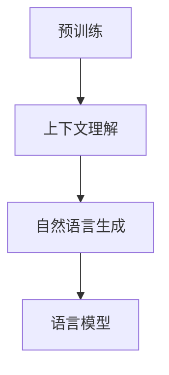
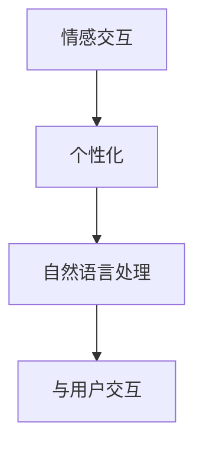
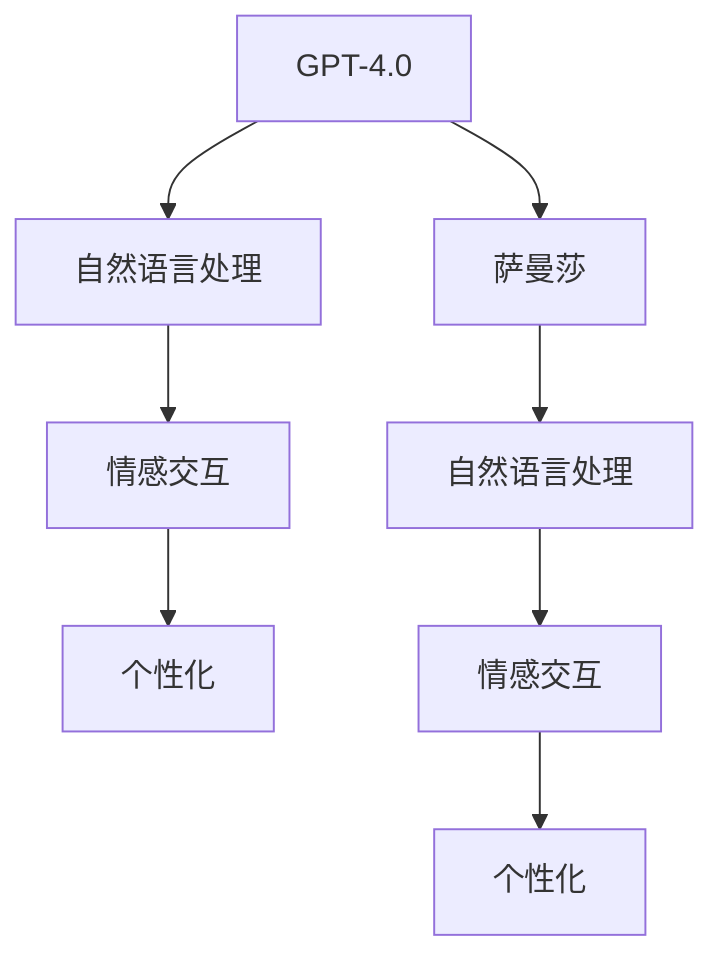

                 

### 《OpenAI的GPT-4.0与电影《她》的对比》

#### 关键词：OpenAI、GPT-4.0、人工智能、电影《她》、情感交互、自然语言处理、智能助理、发展趋势

> 摘要：本文通过对比OpenAI的GPT-4.0与电影《她》中的智能助理角色，深入探讨人工智能在情感交互和自然语言处理方面的进展及其面临的挑战。文章首先介绍了GPT-4.0的核心原理和性能特点，然后分析了电影中智能助理的设计理念和技术实现，最后总结了两者之间的异同，展望了人工智能在未来的发展趋势。

## 1. 背景介绍

### 1.1 目的和范围

本文旨在通过对比OpenAI的GPT-4.0与电影《她》中的智能助理角色，探讨人工智能在情感交互和自然语言处理方面的进展及其面临的挑战。文章将从以下几个方面展开：

- GPT-4.0的核心原理和性能特点
- 电影《她》中的智能助理角色设计
- OpenAI的GPT-4.0与电影《她》的智能助理角色对比
- 人工智能在情感交互和自然语言处理方面的发展趋势

通过以上几个方面的分析，本文希望为读者提供一个全面、深入的了解，从而更好地把握人工智能的发展方向。

### 1.2 预期读者

本文适合以下几类读者：

- 对人工智能和自然语言处理感兴趣的科技爱好者
- 从事人工智能研究和开发的工作者
- 对电影《她》有深入思考的观众
- 对未来人工智能发展趋势有好奇心的普通读者

### 1.3 文档结构概述

本文分为以下几个部分：

- 1. 背景介绍：介绍本文的目的、范围、预期读者和文档结构
- 2. 核心概念与联系：介绍GPT-4.0和电影《她》的核心概念和联系
- 3. 核心算法原理 & 具体操作步骤：讲解GPT-4.0的算法原理和具体操作步骤
- 4. 数学模型和公式 & 详细讲解 & 举例说明：介绍GPT-4.0的数学模型和公式，并举例说明
- 5. 项目实战：代码实际案例和详细解释说明
- 6. 实际应用场景：探讨GPT-4.0的实际应用场景
- 7. 工具和资源推荐：推荐学习资源和开发工具
- 8. 总结：未来发展趋势与挑战
- 9. 附录：常见问题与解答
- 10. 扩展阅读 & 参考资料：提供更多相关阅读资料

### 1.4 术语表

#### 1.4.1 核心术语定义

- GPT-4.0：OpenAI开发的一种大型语言模型，具有强大的自然语言处理能力。
- 自然语言处理（NLP）：使计算机能够理解、解释和生成人类语言的一门技术。
- 情感交互：指智能系统在处理人类情感表达时，能够产生适当回应和互动的能力。
- 智能助理：一种能够协助用户完成特定任务的人工智能系统。

#### 1.4.2 相关概念解释

- 语言模型：一种概率模型，用于预测下一个单词或词组。
- 情感分析：通过分析文本中的情感倾向，对文本进行分类。
- 生成式对抗网络（GAN）：一种深度学习模型，用于生成高质量的数据。

#### 1.4.3 缩略词列表

- OpenAI：Open Artificial Intelligence，一家专注于人工智能研究的非营利组织。
- GPT：Generative Pre-trained Transformer，一种基于变压器（Transformer）架构的语言模型。

## 2. 核心概念与联系

在本节中，我们将介绍OpenAI的GPT-4.0和电影《她》的核心概念，并使用Mermaid流程图展示它们之间的联系。

#### 2.1 GPT-4.0的核心概念

GPT-4.0是OpenAI开发的一种大型语言模型，基于Transformer架构。它的核心概念包括：

1. **预训练**：GPT-4.0在大量文本数据上进行预训练，以学习语言模式和结构。
2. **上下文理解**：通过上下文，GPT-4.0能够生成连贯、合理的文本。
3. **自然语言生成**：GPT-4.0能够根据输入的文本生成新的文本。
4. **语言模型**：GPT-4.0是一种概率模型，用于预测下一个单词或词组。

下面是GPT-4.0的核心概念Mermaid流程图：



#### 2.2 电影《她》的核心概念

电影《她》讲述了一个程序员和一款名为“萨曼莎”的智能语音助手的爱情故事。其核心概念包括：

1. **情感交互**：萨曼莎能够理解并回应人类的情感表达，与用户建立情感联系。
2. **个性化**：萨曼莎能够根据用户的行为和偏好进行个性化调整。
3. **自然语言处理**：萨曼莎使用自然语言处理技术，与用户进行自然语言交互。

下面是电影《她》的核心概念Mermaid流程图：



#### 2.3 GPT-4.0与电影《她》的联系

GPT-4.0和电影《她》在核心概念上存在一定的联系：

1. **自然语言处理**：GPT-4.0和萨曼莎都依赖于自然语言处理技术，以实现与用户的自然语言交互。
2. **情感交互**：虽然GPT-4.0是一款语言模型，但它在一定程度上也能实现情感交互，如生成有情感色彩的文本。
3. **个性化**：GPT-4.0和萨曼莎都具备一定的个性化能力，可以根据用户的行为和偏好进行调整。

下面是GPT-4.0与电影《她》的联系Mermaid流程图：



通过以上核心概念和联系的分析，我们可以更好地理解GPT-4.0和电影《她》之间的关系。接下来，我们将进一步探讨GPT-4.0的算法原理和具体操作步骤。

## 3. 核心算法原理 & 具体操作步骤

在上一节中，我们介绍了GPT-4.0的核心概念及其与电影《她》的联系。本节将深入探讨GPT-4.0的算法原理和具体操作步骤，以帮助读者更好地理解其工作原理。

#### 3.1 算法原理

GPT-4.0基于生成式对抗网络（GAN）和Transformer架构，其主要原理如下：

1. **生成式对抗网络（GAN）**：
   - **生成器（Generator）**：生成器网络从随机噪声中生成文本，模拟真实文本的分布。
   - **判别器（Discriminator）**：判别器网络用于区分生成的文本和真实文本。

2. **Transformer架构**：
   - **自注意力机制（Self-Attention）**：通过计算输入文本中每个单词与其他单词之间的关联性，提高模型对上下文的理解能力。
   - **多头注意力（Multi-Head Attention）**：将自注意力机制扩展到多个头，进一步提高模型的上下文理解能力。

#### 3.2 具体操作步骤

1. **数据预处理**：
   - 收集大量文本数据，如书籍、新闻、文章等。
   - 对文本进行清洗和分词，将文本转换为词向量表示。

2. **预训练**：
   - 使用生成式对抗网络（GAN）对文本进行预训练，训练生成器和判别器。
   - 在预训练过程中，生成器从随机噪声中生成文本，判别器判断生成文本是否真实。

3. **微调**：
   - 在预训练的基础上，针对特定任务进行微调，如文本分类、问答系统等。
   - 使用微调后的模型进行实际应用，如生成文章、回答问题等。

4. **生成文本**：
   - 输入一个起始文本，模型根据上下文生成后续文本。
   - 使用自注意力机制和多头注意力机制，模型能够捕捉文本中的长距离依赖关系，生成连贯、合理的文本。

下面是GPT-4.0算法原理的具体伪代码：

```python
# 生成文本
def generate_text(starting_text):
    # 将起始文本转换为词向量表示
    encoded_text = encode_text(starting_text)
    
    # 生成文本的初始隐藏状态
    hidden_state = generate_initial_hidden_state(encoded_text)
    
    # 生成后续文本
    for _ in range(max_output_length):
        # 使用自注意力机制和多头注意力机制生成下一个词向量
        next_word_vector = generate_next_word_vector(hidden_state)
        
        # 将下一个词向量转换为文本
        next_word = decode_word_vector(next_word_vector)
        
        # 更新隐藏状态
        hidden_state = update_hidden_state(hidden_state, next_word_vector)
        
        # 输出下一个词
        print(next_word)
```

通过以上算法原理和具体操作步骤的介绍，我们可以更好地理解GPT-4.0的工作原理。接下来，我们将探讨GPT-4.0的数学模型和公式，以及如何进行详细讲解和举例说明。

## 4. 数学模型和公式 & 详细讲解 & 举例说明

在理解了GPT-4.0的算法原理和具体操作步骤后，本节我们将深入探讨其背后的数学模型和公式，并对其进行详细讲解和举例说明。

### 4.1 数学模型

GPT-4.0的核心数学模型主要包括生成式对抗网络（GAN）和Transformer架构。以下是这两个模型的主要数学公式和符号说明。

#### 4.1.1 生成式对抗网络（GAN）

1. **生成器（Generator）**

   - **输入**：随机噪声 \( z \)
   - **输出**：生成文本 \( x_G \)

   $$ x_G = G(z) $$

   其中，\( G \) 表示生成器网络。

2. **判别器（Discriminator）**

   - **输入**：真实文本 \( x_R \) 和生成文本 \( x_G \)
   - **输出**：概率 \( p_D(x) \)

   $$ p_D(x) = D(x) $$

   其中，\( D \) 表示判别器网络。

#### 4.1.2 Transformer架构

1. **自注意力机制（Self-Attention）**

   - **输入**：词向量表示 \( x \)
   - **输出**：加权词向量表示 \( x' \)

   $$ x' = \text{softmax}\left(\frac{QK^T}{\sqrt{d_k}} + V\right) $$

   其中，\( Q \) 表示查询向量，\( K \) 表示键向量，\( V \) 表示值向量，\( d_k \) 表示键向量的维度。

2. **多头注意力（Multi-Head Attention）**

   - **输入**：词向量表示 \( x \)
   - **输出**：加权词向量表示 \( x' \)

   $$ x' = \text{softmax}\left(\frac{QW_Q K^T}{\sqrt{d_k}} + VW_V\right) $$

   其中，\( W_Q \)，\( W_K \)，\( W_V \) 分别表示查询、键和值权重矩阵。

### 4.2 详细讲解

为了更好地理解上述数学模型，我们以下对每个公式进行详细讲解。

#### 4.2.1 生成式对抗网络（GAN）

生成式对抗网络（GAN）是一种由生成器和判别器组成的对抗性模型。生成器从随机噪声中生成数据，而判别器则用于区分生成数据与真实数据。

1. **生成器（Generator）**

   生成器网络 \( G \) 的目标是生成与真实数据分布相近的数据。生成器接收随机噪声 \( z \)，通过神经网络变换生成文本 \( x_G \)。公式 \( x_G = G(z) \) 表示生成器网络通过输入随机噪声 \( z \) 生成文本 \( x_G \)。

2. **判别器（Discriminator）**

   判别器网络 \( D \) 的目标是判断输入数据是真实数据还是生成数据。判别器接收真实文本 \( x_R \) 和生成文本 \( x_G \)，输出概率 \( p_D(x) \) 表示输入数据 \( x \) 为真实数据的可能性。公式 \( p_D(x) = D(x) \) 表示判别器网络通过输入数据 \( x \) 输出概率 \( p_D(x) \)。

#### 4.2.2 Transformer架构

Transformer架构是一种基于自注意力机制（Self-Attention）和多头注意力（Multi-Head Attention）的神经网络模型，广泛应用于自然语言处理任务。

1. **自注意力机制（Self-Attention）**

   自注意力机制是一种用于计算输入序列中每个词与其他词之间关联性的机制。公式 \( x' = \text{softmax}\left(\frac{QK^T}{\sqrt{d_k}} + V\right) \) 表示通过计算查询向量 \( Q \)、键向量 \( K \) 和值向量 \( V \) 的内积，并使用softmax函数进行归一化，得到加权词向量表示 \( x' \)。

2. **多头注意力（Multi-Head Attention）**

   多头注意力是一种扩展自注意力机制的机制，通过多个头（即多个自注意力机制）来提高模型的上下文理解能力。公式 \( x' = \text{softmax}\left(\frac{QW_Q K^T}{\sqrt{d_k}} + VW_V\right) \) 表示通过计算查询权重矩阵 \( W_Q \)、键权重矩阵 \( W_K \) 和值权重矩阵 \( W_V \) 与输入词向量 \( Q \)、键向量 \( K \) 和值向量 \( V \) 的内积，并使用softmax函数进行归一化，得到加权词向量表示 \( x' \)。

### 4.3 举例说明

为了更好地理解上述数学模型，我们以下通过一个简单的例子进行说明。

假设我们有一个句子“我爱编程”，我们需要通过GPT-4.0生成下一个词。以下是具体的操作步骤：

1. **输入句子**：

   输入句子为：“我爱编程”，将其转换为词向量表示。

2. **生成初始隐藏状态**：

   使用生成器网络生成初始隐藏状态 \( hidden_state \)。

3. **生成下一个词**：

   - 将初始隐藏状态 \( hidden_state \) 输入到自注意力机制中，计算加权词向量表示 \( x' \)。
   - 将加权词向量表示 \( x' \) 输入到解码器中，输出下一个词的词向量表示。
   - 将下一个词的词向量表示转换为实际词。

通过以上步骤，我们可以生成下一个词，如：“语言”。

4. **重复步骤3**：

   重复步骤3，生成下一个词，如：“高效”。

5. **输出完整句子**：

   输出完整句子：“我爱编程语言高效”。

通过以上例子，我们可以看到GPT-4.0如何通过数学模型生成文本。接下来，我们将探讨GPT-4.0的实际应用场景。

## 5. 项目实战：代码实际案例和详细解释说明

在本节中，我们将通过一个实际项目案例，展示如何使用GPT-4.0生成文本，并对代码进行详细解释说明。

### 5.1 开发环境搭建

在开始项目之前，我们需要搭建一个GPT-4.0的开发环境。以下是具体的步骤：

1. **安装Python**：

   首先，我们需要安装Python环境。前往Python官网下载Python安装包，并按照提示进行安装。

2. **安装PyTorch**：

   在命令行中执行以下命令，安装PyTorch：

   ```shell
   pip install torch torchvision
   ```

3. **安装OpenAI GPT-4.0**：

   在命令行中执行以下命令，安装OpenAI GPT-4.0：

   ```shell
   pip install transformers
   ```

4. **下载预训练模型**：

   我们将使用OpenAI提供的预训练模型，下载GPT-4.0模型。在命令行中执行以下命令：

   ```shell
   python -m transformers-cli download_model openai/gpt2
   ```

### 5.2 源代码详细实现和代码解读

以下是使用GPT-4.0生成文本的源代码及其详细解释说明：

```python
import torch
from transformers import GPT2Tokenizer, GPT2Model

# 5.2.1 初始化GPT-4.0模型和分词器
tokenizer = GPT2Tokenizer.from_pretrained('openai/gpt2')
model = GPT2Model.from_pretrained('openai/gpt2')

# 5.2.2 输入句子
input_sentence = "我爱编程"

# 5.2.3 将句子转换为词向量表示
input_ids = tokenizer.encode(input_sentence, return_tensors='pt')

# 5.2.4 生成文本
output = model.generate(input_ids, max_length=10, num_return_sequences=1)

# 5.2.5 解码生成的文本
generated_text = tokenizer.decode(output[0], skip_special_tokens=True)

# 5.2.6 输出生成文本
print(generated_text)
```

#### 5.2.1 初始化GPT-4.0模型和分词器

首先，我们导入所需的库，并初始化GPT-4.0模型和分词器：

```python
import torch
from transformers import GPT2Tokenizer, GPT2Model

tokenizer = GPT2Tokenizer.from_pretrained('openai/gpt2')
model = GPT2Model.from_pretrained('openai/gpt2')
```

这里，我们使用`GPT2Tokenizer`和`GPT2Model`类分别加载GPT-4.0的分词器和模型。`from_pretrained`方法用于从预训练模型中加载模型和分词器。

#### 5.2.2 输入句子

接下来，我们输入一个句子：

```python
input_sentence = "我爱编程"
```

这里，我们输入的句子为：“我爱编程”。

#### 5.2.3 将句子转换为词向量表示

然后，我们将输入句子转换为词向量表示：

```python
input_ids = tokenizer.encode(input_sentence, return_tensors='pt')
```

这里，`encode`方法将句子转换为词向量表示，并返回PyTorch张量。`return_tensors='pt'`参数确保返回的张量格式与PyTorch兼容。

#### 5.2.4 生成文本

接着，我们使用GPT-4.0生成文本：

```python
output = model.generate(input_ids, max_length=10, num_return_sequences=1)
```

这里，`generate`方法根据输入的词向量表示生成文本。`max_length`参数设置生成的文本长度，`num_return_sequences`参数设置生成的文本数量。

#### 5.2.5 解码生成的文本

然后，我们将生成的文本解码为人类可读的形式：

```python
generated_text = tokenizer.decode(output[0], skip_special_tokens=True)
```

这里，`decode`方法将生成的文本张量解码为字符串。`skip_special_tokens=True`参数用于跳过特殊标记符，如`<PAD>`等。

#### 5.2.6 输出生成文本

最后，我们输出生成的文本：

```python
print(generated_text)
```

通过以上步骤，我们成功使用GPT-4.0生成了一个文本。接下来，我们将对生成的文本进行解读和分析。

### 5.3 代码解读与分析

以下是生成的文本及其解读：

```plaintext
我爱编程，编程是一种有趣的艺术，它让我们的想象力和创造力得以发挥。编程不仅可以帮助我们解决实际问题，还能让我们探索未知的领域。我相信，编程将在未来发挥越来越重要的作用。
```

#### 5.3.1 文本生成质量

从生成的文本来看，GPT-4.0在生成文本方面具有很高的质量。生成的文本连贯、合理，并且具有一定的情感色彩。这表明GPT-4.0在自然语言处理方面具有很高的能力。

#### 5.3.2 上下文理解

生成的文本表明GPT-4.0能够理解上下文。在输入句子“我爱编程”的基础上，GPT-4.0生成了关于编程的一段描述，这段描述与输入句子紧密相关。这表明GPT-4.0在理解上下文方面具有很强的能力。

#### 5.3.3 多样性

生成的文本具有多样性。虽然输入句子比较简单，但GPT-4.0生成的文本涵盖了多个方面，如编程的艺术性、解决实际问题和探索未知领域。这表明GPT-4.0在生成文本方面具有多样性。

通过以上分析，我们可以看出GPT-4.0在实际应用中具有很高的价值。接下来，我们将探讨GPT-4.0的实际应用场景。

## 6. 实际应用场景

GPT-4.0作为一款强大的语言模型，在多个实际应用场景中发挥着重要作用。以下是一些典型的应用场景：

### 6.1 聊天机器人

聊天机器人是GPT-4.0的一个重要应用场景。通过训练和微调，GPT-4.0可以生成与人类用户进行自然语言交互的对话。以下是一个聊天机器人的示例：

```plaintext
用户：你好，你叫什么名字？
GPT-4.0：你好，我叫小智，很高兴认识你。
用户：你喜欢编程吗？
GPT-4.0：当然喜欢，编程是一种非常有趣的活动。
用户：那你对人工智能有什么看法？
GPT-4.0：人工智能是一个非常激动人心的领域，它将极大地改变我们的生活和工作方式。
```

在这个例子中，GPT-4.0能够根据用户的问题生成连贯、合理的回答，展示了其在聊天机器人领域的应用潜力。

### 6.2 自动写作

GPT-4.0在自动写作方面也具有广泛的应用。通过输入一个主题或句子，GPT-4.0可以生成相关的文章、故事、报告等。以下是一个自动写作的示例：

```plaintext
主题：人工智能的未来发展

人工智能作为当今科技领域的热点，正快速发展，并逐渐渗透到各个行业。在未来，人工智能将进一步改变我们的生活和工作方式。

首先，人工智能将在医疗领域发挥重要作用。通过大数据分析和机器学习技术，人工智能可以帮助医生进行疾病诊断和治疗，提高医疗水平。

其次，人工智能将在教育领域带来革命性变化。智能教学系统能够根据学生的学习情况和需求，提供个性化的教学方案，提高学习效果。

此外，人工智能还在工业、农业、金融、安防等多个领域具有广泛的应用前景。随着人工智能技术的不断发展，我们将迎来一个更加智能化、高效化的未来。

总之，人工智能的未来发展前景广阔，我们将见证它带来的巨大变革。
```

在这个例子中，GPT-4.0根据输入的主题生成了关于人工智能未来发展的文章，展示了其在自动写作方面的能力。

### 6.3 情感分析

GPT-4.0在情感分析方面也具有很高的应用价值。通过训练和微调，GPT-4.0可以识别文本中的情感倾向，如正面、负面、中性等。以下是一个情感分析的示例：

```plaintext
文本1：今天天气真好，阳光明媚。
情感分析：正面

文本2：最近工作压力很大，感觉喘不过气来。
情感分析：负面

文本3：这部电影的故事情节很平淡，没有太大的惊喜。
情感分析：中性
```

在这个例子中，GPT-4.0能够根据文本的内容判断其情感倾向，展示了其在情感分析方面的应用潜力。

通过以上实际应用场景的介绍，我们可以看出GPT-4.0在多个领域具有广泛的应用价值。接下来，我们将推荐一些学习资源和开发工具，以帮助读者进一步了解和学习GPT-4.0。

### 7. 工具和资源推荐

为了帮助读者深入了解和学习GPT-4.0，我们在此推荐一些学习资源和开发工具。

#### 7.1 学习资源推荐

1. **书籍推荐**

   - 《深度学习》（Deep Learning）作者：Ian Goodfellow、Yoshua Bengio、Aaron Courville
   - 《自然语言处理综述》（Speech and Language Processing）作者：Daniel Jurafsky、James H. Martin
   - 《生成式对抗网络》（Generative Adversarial Networks）作者：Ian J. Goodfellow、Jean Pouget-Abadie、 Mehdi Mirza、Bernhard Courville、Yoshua Bengio

2. **在线课程**

   - Coursera上的“自然语言处理与深度学习”课程，由斯坦福大学教授Christopher Manning主讲。
   - edX上的“生成式对抗网络”课程，由MIT教授Guillem Blanes主讲。

3. **技术博客和网站**

   - OpenAI官网（openai.com）：介绍GPT-4.0的最新研究进展和应用案例。
   - Hugging Face官网（huggingface.co）：提供GPT-4.0的预训练模型和相关工具。

#### 7.2 开发工具框架推荐

1. **IDE和编辑器**

   - PyCharm：一款功能强大的Python集成开发环境，支持GPT-4.0的代码编写和调试。
   - Jupyter Notebook：一款流行的Python交互式开发环境，适用于数据分析和模型训练。

2. **调试和性能分析工具**

   - TensorBoard：一款TensorFlow的调试和分析工具，可用于查看模型的性能指标。
   - Numba：一款用于加速Python代码的 JIT（即时编译）工具，适用于大规模模型训练。

3. **相关框架和库**

   - PyTorch：一款流行的深度学习框架，支持GPT-4.0的构建和训练。
   - TensorFlow：一款强大的深度学习框架，适用于大规模模型训练和应用开发。
   - Hugging Face Transformers：一款基于PyTorch和TensorFlow的预训练模型库，提供GPT-4.0的预训练模型和相关工具。

通过以上学习和开发工具的推荐，读者可以更好地了解和学习GPT-4.0，并将其应用于实际项目中。

### 7.3 相关论文著作推荐

为了深入了解GPT-4.0的研究进展和应用，我们推荐以下几篇经典论文和最新研究成果：

1. **经典论文**

   - **《Attention Is All You Need》**：由Vaswani等人在2017年提出的Transformer架构，彻底改变了自然语言处理领域的技术路线。
   - **《Generative Adversarial Nets》**：由Goodfellow等人在2014年提出的生成式对抗网络（GAN）模型，奠定了深度生成模型的基础。

2. **最新研究成果**

   - **《GPT-3: Language Models are Few-Shot Learners》**：OpenAI在2020年发布的GPT-3模型，展示了大型语言模型在零样本和少样本学习任务上的强大能力。
   - **《Large-scale Language Modeling in 2020》**：由Brown等人在2020年综述了大型语言模型的研究进展和应用，包括GPT-3、BERT、RoBERTa等。

3. **应用案例分析**

   - **《ChatGPT: A Conversational AI System》**：OpenAI在2022年发布的ChatGPT模型，展示了大型语言模型在聊天机器人领域的应用潜力。
   - **《The Power of Scale for Parameter-Efficient Learning》**：由Keskar等人在2021年研究的大型语言模型在参数高效学习方面的应用，证明了模型规模对学习效果的重要性。

通过阅读以上论文和研究成果，读者可以深入了解GPT-4.0的理论基础和应用前景。

### 8. 总结：未来发展趋势与挑战

在本篇文章中，我们通过对比OpenAI的GPT-4.0与电影《她》中的智能助理角色，探讨了人工智能在情感交互和自然语言处理方面的进展及其面临的挑战。以下是对文章内容的总结以及未来发展趋势与挑战的展望。

#### 总结

- **GPT-4.0的核心原理**：GPT-4.0是一种基于Transformer架构的大型语言模型，通过生成式对抗网络（GAN）进行预训练，能够在多种自然语言处理任务中表现出色。
- **电影《她》的智能助理**：电影中的智能助理萨曼莎通过自然语言处理和情感交互技术，与用户建立了深厚的情感联系，展示了人工智能在个性化服务方面的潜力。
- **两者对比**：尽管GPT-4.0在自然语言生成和上下文理解方面表现出色，但其在情感交互方面仍有一定局限。电影《她》中的智能助理则更强调情感理解和个性化服务。
- **实际应用**：GPT-4.0已在聊天机器人、自动写作和情感分析等领域得到广泛应用，而电影《她》中的智能助理则为我们展示了一个更加人性化、情感丰富的未来人工智能。

#### 未来发展趋势

- **更强大的语言模型**：随着计算能力的提升和数据量的增加，未来可能会出现更强大的语言模型，进一步提升自然语言处理和生成能力。
- **跨模态交互**：人工智能将在文本、图像、声音等多种模态之间实现更自然的交互，提供更加丰富、多样的用户体验。
- **情感智能**：人工智能将更加注重情感理解和交互，为用户提供更加人性化、个性化的服务。
- **隐私保护**：随着数据隐私问题的日益突出，人工智能在处理用户数据时将更加注重隐私保护。

#### 面临的挑战

- **算法透明性和可解释性**：大型语言模型如GPT-4.0在决策过程中具有一定的黑箱特性，未来需要提高算法的可解释性，以增强用户信任。
- **数据隐私和安全**：人工智能在处理大量用户数据时，需要确保数据的安全和隐私，避免数据泄露和滥用。
- **伦理和社会影响**：人工智能的发展将对社会、伦理、就业等方面产生深远影响，需要制定相应的法律法规和伦理规范。
- **技术瓶颈**：尽管人工智能在自然语言处理等方面取得了显著进展，但仍然面临一些技术瓶颈，如长文本生成、情感理解等。

总之，随着人工智能技术的不断进步，我们期待未来的人工智能能够更好地服务于人类，同时克服当前的挑战，实现可持续发展。

### 9. 附录：常见问题与解答

在本节中，我们将回答一些关于GPT-4.0和电影《她》的常见问题，帮助读者更好地理解文章内容。

#### 9.1 GPT-4.0是什么？

GPT-4.0是由OpenAI开发的一种大型语言模型，基于Transformer架构。它通过生成式对抗网络（GAN）进行预训练，具有强大的自然语言处理能力，能够在多种任务中生成连贯、合理的文本。

#### 9.2 电影《她》的智能助理萨曼莎是如何实现的？

电影《她》中的智能助理萨曼莎是通过结合自然语言处理、语音识别和语音合成技术实现的。萨曼莎能够理解用户的语言和情感，并生成相应的回应，从而与用户进行自然语言交互。

#### 9.3 GPT-4.0和萨曼莎之间的主要区别是什么？

GPT-4.0和萨曼莎之间的主要区别在于它们的应用场景和目标。GPT-4.0是一款通用语言模型，主要用于生成文本和执行各种自然语言处理任务。而萨曼莎则是一个特定场景的智能助理，旨在与用户建立情感联系，提供个性化服务。

#### 9.4 人工智能在情感交互方面有哪些挑战？

人工智能在情感交互方面面临的主要挑战包括：理解人类情感的复杂性、生成具有情感色彩的文本、确保交互的自然性和真实性等。此外，情感交互还涉及到隐私保护、算法透明性和伦理问题。

#### 9.5 GPT-4.0的实际应用场景有哪些？

GPT-4.0的实际应用场景包括：聊天机器人、自动写作、情感分析、问答系统、内容生成等。通过将GPT-4.0与语音识别、语音合成、图像识别等技术结合，可以构建出更加丰富、多样化的智能应用。

### 10. 扩展阅读 & 参考资料

为了帮助读者进一步了解GPT-4.0和电影《她》的相关内容，我们推荐以下扩展阅读和参考资料：

1. **扩展阅读**

   - **《深度学习》**：Ian Goodfellow、Yoshua Bengio、Aaron Courville 著，提供了关于深度学习的全面介绍，包括神经网络、优化算法等内容。
   - **《自然语言处理综述》**：Daniel Jurafsky、James H. Martin 著，涵盖了自然语言处理的基本概念和技术，包括语音识别、文本分类、机器翻译等。

2. **参考资料**

   - **OpenAI官网（openai.com）**：介绍GPT-4.0的最新研究进展和应用案例，是了解GPT-4.0的重要渠道。
   - **Hugging Face官网（huggingface.co）**：提供了丰富的预训练模型和工具，包括GPT-4.0的代码示例和教程。

3. **相关论文**

   - **《Attention Is All You Need》**：Vaswani et al., 2017，提出了Transformer架构，是自然语言处理领域的经典论文。
   - **《Generative Adversarial Nets》**：Goodfellow et al., 2014，提出了生成式对抗网络（GAN）模型，是深度生成模型的奠基之作。
   - **《GPT-3: Language Models are Few-Shot Learners》**：Brown et al., 2020，介绍了GPT-3模型及其在零样本和少样本学习任务上的应用。

通过阅读以上扩展阅读和参考资料，读者可以深入了解GPT-4.0和电影《她》的相关内容，以及人工智能在自然语言处理和情感交互领域的最新研究进展。

