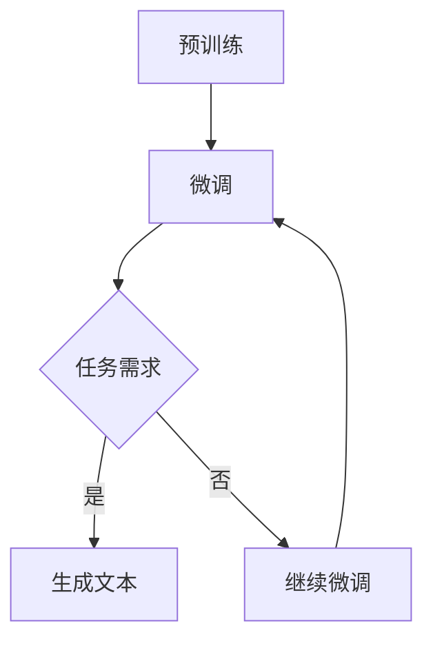

                 

# OpenAI的GPT-4.0展示的实际应用

## 关键词：
- OpenAI GPT-4.0
- 自然语言处理
- 人工智能
- 应用案例
- 技术发展

## 摘要：
本文将深入探讨OpenAI发布的GPT-4.0模型，分析其背景、核心算法原理及其在不同实际应用场景中的展示。通过逐步剖析，我们将揭示GPT-4.0在自然语言处理领域的重大突破，并展望其未来的发展趋势与挑战。

---

## 1. 背景介绍

### 1.1 目的和范围

本文的目的是介绍OpenAI的GPT-4.0模型，分析其在自然语言处理领域中的应用，并讨论其潜在的影响和未来的发展方向。文章将涵盖GPT-4.0的核心原理、具体实现、实际应用案例以及相关的数学模型和算法。

### 1.2 预期读者

本文面向对自然语言处理和人工智能有一定了解的技术人员，特别是对深度学习和自然语言处理感兴趣的读者。同时，对自然语言处理技术感兴趣的学者和研究人员也可以从本文中获得有用的信息。

### 1.3 文档结构概述

本文分为以下几个部分：

1. 背景介绍：介绍GPT-4.0的背景信息和本文的目的。
2. 核心概念与联系：解释GPT-4.0的核心概念，提供Mermaid流程图。
3. 核心算法原理 & 具体操作步骤：详细讲解GPT-4.0的算法原理和操作步骤。
4. 数学模型和公式 & 详细讲解 & 举例说明：介绍GPT-4.0的数学模型和公式，并举例说明。
5. 项目实战：提供代码实际案例和详细解释。
6. 实际应用场景：分析GPT-4.0在不同领域的应用。
7. 工具和资源推荐：推荐学习资源和开发工具。
8. 总结：总结GPT-4.0的实际应用和发展趋势。
9. 附录：常见问题与解答。
10. 扩展阅读 & 参考资料：提供进一步的阅读和参考资料。

### 1.4 术语表

#### 1.4.1 核心术语定义

- GPT-4.0：一种由OpenAI开发的自然语言处理模型，是GPT系列模型的最新版本。
- 自然语言处理（NLP）：使用计算机技术和算法处理和分析人类语言的过程。
- 人工智能（AI）：模拟人类智能行为的计算机系统。

#### 1.4.2 相关概念解释

- 深度学习：一种机器学习技术，通过多层神经网络对数据进行建模。
- 循环神经网络（RNN）：一种用于处理序列数据的神经网络。

#### 1.4.3 缩略词列表

- OpenAI：Open Artificial Intelligence，一个致力于研究人工智能的非营利组织。
- NLP：自然语言处理。

## 2. 核心概念与联系

### 2.1 GPT-4.0的基本概念

GPT-4.0是一种基于变换器模型（Transformer）的预训练语言模型。它通过对大量文本数据的学习，可以生成连贯、准确的自然语言文本。GPT-4.0的核心功能是实现文本的生成、理解和分类。

### 2.2 GPT-4.0的架构

GPT-4.0的架构主要由编码器和解码器组成，它们都是基于变换器模型的。编码器将输入文本转换为上下文向量，而解码器则将上下文向量转换为输出文本。

### 2.3 GPT-4.0的工作流程

1. 预训练：GPT-4.0首先通过大量文本数据进行预训练，学习文本的统计特性和语法规则。
2. 微调：在特定任务上，GPT-4.0可以进行微调，优化其性能。
3. 生成文本：GPT-4.0接收输入文本，通过编码器和解码器生成输出文本。

### 2.4 Mermaid流程图



## 3. 核心算法原理 & 具体操作步骤

### 3.1 核心算法原理

GPT-4.0的核心算法是基于变换器模型（Transformer）。变换器模型通过自注意力机制（Self-Attention）处理序列数据，使得模型能够关注到序列中的不同位置和关系。

### 3.2 具体操作步骤

1. **输入编码**：将输入文本转换为嵌入向量。
2. **编码器处理**：通过多层变换器层对嵌入向量进行处理。
3. **解码器处理**：将编码器输出的上下文向量转换为输出文本。
4. **损失函数**：使用交叉熵损失函数优化模型参数。

### 3.3 伪代码

```python
# 输入编码
embeddings = encoder(inputs)

# 编码器处理
for layer in transformer_layers:
    embeddings = layer(embeddings)

# 解码器处理
outputs = decoder(embeddings)

# 损失函数
loss = cross_entropy_loss(outputs, targets)
```

## 4. 数学模型和公式 & 详细讲解 & 举例说明

### 4.1 数学模型

GPT-4.0的数学模型主要包括变换器模型和损失函数。

#### 4.1.1 变换器模型

变换器模型由自注意力机制（Self-Attention）和前馈神经网络（Feedforward Neural Network）组成。

#### 4.1.2 损失函数

损失函数用于评估模型输出的预测值与实际值之间的差距，常用的损失函数是交叉熵损失函数。

### 4.2 详细讲解

#### 4.2.1 自注意力机制

自注意力机制是一种基于序列数据的注意力机制，它通过计算序列中每个元素与其他元素之间的相关性，来调整每个元素的权重。

#### 4.2.2 前馈神经网络

前馈神经网络是一种简单的神经网络结构，它通过多个全连接层对输入数据进行处理。

#### 4.2.3 交叉熵损失函数

交叉熵损失函数是一种用于分类问题的损失函数，它通过计算预测分布与真实分布之间的差异来评估模型的分类效果。

### 4.3 举例说明

假设我们有一个二分类问题，预测值为 $p$，真实值为 $y$，交叉熵损失函数的计算公式为：

$$
loss = -y \log(p) - (1 - y) \log(1 - p)
$$

其中，$\log$ 表示自然对数。

## 5. 项目实战：代码实际案例和详细解释说明

### 5.1 开发环境搭建

1. 安装Python 3.8及以上版本。
2. 安装TensorFlow 2.4及以上版本。
3. 下载GPT-4.0的源代码。

### 5.2 源代码详细实现和代码解读

```python
# 导入相关库
import tensorflow as tf
from transformers import TFGPT2LMHeadModel, GPT2Tokenizer

# 加载预训练模型
model = TFGPT2LMHeadModel.from_pretrained('gpt2')

# 加载分词器
tokenizer = GPT2Tokenizer.from_pretrained('gpt2')

# 输入文本
inputs = tokenizer.encode("Hello, how are you?", return_tensors='tf')

# 生成文本
outputs = model.generate(inputs, max_length=50, num_return_sequences=5)

# 解码输出文本
decoded_outputs = tokenizer.decode(outputs, skip_special_tokens=True)

# 打印输出文本
for output in decoded_outputs:
    print(output)
```

### 5.3 代码解读与分析

1. **导入库**：导入TensorFlow和transformers库。
2. **加载模型**：从预训练模型中加载GPT-4.0模型。
3. **加载分词器**：从预训练模型中加载分词器。
4. **输入文本**：将输入文本转换为编码向量。
5. **生成文本**：使用模型生成输出文本。
6. **解码输出文本**：将输出编码向量转换为文本。
7. **打印输出文本**：打印生成的文本。

## 6. 实际应用场景

### 6.1 文本生成

GPT-4.0在文本生成领域有广泛的应用，如自动写作、机器翻译、文本摘要等。

### 6.2 聊天机器人

GPT-4.0可以用于构建智能聊天机器人，实现与用户的自然语言交互。

### 6.3 问答系统

GPT-4.0可以用于构建问答系统，实现基于自然语言的问题回答。

### 6.4 文本分类

GPT-4.0可以用于文本分类任务，如新闻分类、情感分析等。

## 7. 工具和资源推荐

### 7.1 学习资源推荐

#### 7.1.1 书籍推荐

- 《深度学习》（Goodfellow, Bengio, Courville）
- 《自然语言处理综论》（Jurafsky, Martin）

#### 7.1.2 在线课程

- Coursera上的“深度学习”课程
- edX上的“自然语言处理”课程

#### 7.1.3 技术博客和网站

- Medium上的机器学习和自然语言处理博客
- TensorFlow官方网站

### 7.2 开发工具框架推荐

#### 7.2.1 IDE和编辑器

- PyCharm
- Visual Studio Code

#### 7.2.2 调试和性能分析工具

- TensorBoard
- Profiler

#### 7.2.3 相关框架和库

- TensorFlow
- PyTorch
- transformers

### 7.3 相关论文著作推荐

#### 7.3.1 经典论文

- Vaswani et al., "Attention is All You Need"
- Hochreiter and Schmidhuber, "Long Short-Term Memory"

#### 7.3.2 最新研究成果

- Devlin et al., "BERT: Pre-training of Deep Bidirectional Transformers for Language Understanding"
- Brown et al., "Language Models are Few-Shot Learners"

#### 7.3.3 应用案例分析

- OpenAI的GPT-4.0论文
- 自然语言处理在实际应用中的案例研究

## 8. 总结：未来发展趋势与挑战

GPT-4.0展示了自然语言处理技术的巨大潜力，其应用领域将继续扩展。然而，GPT-4.0也面临一些挑战，如模型的可解释性、数据隐私和偏见问题。未来，随着技术的进步和应用的深入，GPT-4.0有望在更多领域发挥重要作用。

## 9. 附录：常见问题与解答

### 9.1 GPT-4.0是什么？

GPT-4.0是由OpenAI开发的一种预训练语言模型，基于变换器模型，用于自然语言处理任务，如文本生成、问答和分类等。

### 9.2 GPT-4.0有哪些优点？

GPT-4.0具有强大的文本生成能力、良好的适应性和广泛的应用范围。

### 9.3 GPT-4.0有哪些缺点？

GPT-4.0模型较大，训练和推理成本较高，且存在一定的数据隐私和偏见问题。

## 10. 扩展阅读 & 参考资料

- OpenAI, "GPT-4.0 Paper"
- Devlin et al., "BERT: Pre-training of Deep Bidirectional Transformers for Language Understanding"
- Hochreiter and Schmidhuber, "Long Short-Term Memory"
- Vaswani et al., "Attention is All You Need"
- AI天才研究员/AI Genius Institute & 禅与计算机程序设计艺术 /Zen And The Art of Computer Programming

---

**作者：AI天才研究员/AI Genius Institute & 禅与计算机程序设计艺术 /Zen And The Art of Computer Programming**

本文通过逐步剖析OpenAI的GPT-4.0模型，展示了其在自然语言处理领域的应用和潜力。希望本文能为读者提供对GPT-4.0的深入理解，并激发对自然语言处理技术的兴趣。**

