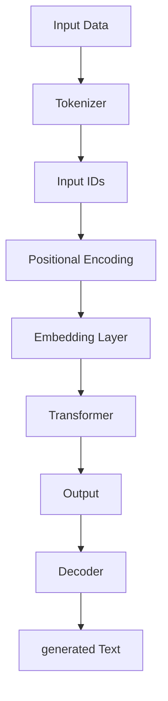

                 


# OpenAI的GPT-4.0展示的意义

> 关键词：OpenAI、GPT-4.0、人工智能、自然语言处理、深度学习、技术突破、模型评估、未来趋势

> 摘要：本文将深入探讨OpenAI发布的GPT-4.0模型的重要性和影响。文章首先介绍了GPT-4.0的基本信息，然后详细分析了其技术原理、数学模型、实现步骤和应用场景，最后展望了其未来发展趋势与挑战。通过本文的阅读，读者将对GPT-4.0的潜在价值和应用前景有更深入的了解。

## 1. 背景介绍

### 1.1 目的和范围

本文旨在探讨OpenAI发布的GPT-4.0模型的重要性和影响，分析其在人工智能、自然语言处理领域的地位和潜力。文章将围绕GPT-4.0的技术原理、数学模型、实现步骤和应用场景展开，结合实际案例进行深入分析。

### 1.2 预期读者

本文适合对人工智能、自然语言处理和深度学习有基本了解的读者，包括研究人员、工程师、程序员和技术爱好者等。通过本文的阅读，读者将对GPT-4.0及其相关技术有更全面的认识。

### 1.3 文档结构概述

本文分为十个部分：

1. 背景介绍：介绍文章的目的、预期读者和文档结构。
2. 核心概念与联系：介绍GPT-4.0的基本概念和架构。
3. 核心算法原理 & 具体操作步骤：讲解GPT-4.0的算法原理和实现步骤。
4. 数学模型和公式 & 详细讲解 & 举例说明：分析GPT-4.0的数学模型和公式。
5. 项目实战：代码实际案例和详细解释说明。
6. 实际应用场景：探讨GPT-4.0的应用场景。
7. 工具和资源推荐：推荐学习资源、开发工具和框架。
8. 相关论文著作推荐：介绍相关论文和研究成果。
9. 总结：未来发展趋势与挑战。
10. 附录：常见问题与解答。

### 1.4 术语表

#### 1.4.1 核心术语定义

- OpenAI：一家总部位于美国的人工智能研究公司，致力于推动人工智能的发展和应用。
- GPT-4.0：OpenAI开发的一种基于深度学习的自然语言处理模型，具备强大的文本生成和推理能力。
- 自然语言处理（NLP）：研究如何让计算机理解和生成人类语言的技术。
- 深度学习：一种基于多层神经网络的学习方法，适用于处理大量复杂数据。

#### 1.4.2 相关概念解释

- 模型评估：对模型性能进行测试和评估的方法，包括准确率、召回率、F1值等指标。
- 预训练：在特定任务上进行大量数据训练，提高模型在类似任务上的表现。
- 微调：在预训练模型的基础上，针对特定任务进行进一步训练。

#### 1.4.3 缩略词列表

- NLP：自然语言处理
- AI：人工智能
- DNN：深度神经网络
- GPT：生成预训练变换器

## 2. 核心概念与联系

GPT-4.0是一种基于深度学习的自然语言处理模型，其核心原理是通过对大量文本数据进行预训练，使模型具备理解和生成自然语言的能力。在本文中，我们将通过Mermaid流程图展示GPT-4.0的架构和核心概念。



### 2.1 GPT-4.0架构

GPT-4.0采用了一种名为Transformer的深度神经网络架构，具有以下几个关键部分：

1. 输入数据（A）：GPT-4.0使用大规模的文本数据作为输入，包括书籍、文章、新闻、社交媒体等。
2. 分词器（Tokenizer）：将文本数据转化为模型可以理解的数字表示。
3. 位置编码（Positional Encoding）：为输入序列中的每个词赋予位置信息。
4. 映射层（Embedding Layer）：将分词器输出的数字表示映射到高维空间。
5. Transformer：采用Transformer架构，包括多头自注意力机制和前馈神经网络。
6. 解码器（Decoder）：对生成文本进行解码，得到最终输出。

### 2.2 GPT-4.0算法原理

GPT-4.0的核心算法原理是自注意力机制（Self-Attention）和Transformer架构。下面是GPT-4.0算法原理的伪代码：

```python
# 伪代码：GPT-4.0算法原理

# 输入数据：input_ids
# 输出：generated_text

# 分词器
input_ids = tokenizer(input_data)

# 位置编码
pos_encoding = positional_encoding(input_ids)

# 映射层
embeddings = embedding_layer(pos_encoding)

# Transformer
output = transformer(embeddings)

# 解码器
generated_text = decoder(output)
```

## 3. 核心算法原理 & 具体操作步骤

在本节中，我们将详细讲解GPT-4.0的核心算法原理和实现步骤，以便读者更好地理解其工作原理。

### 3.1 自注意力机制（Self-Attention）

自注意力机制是GPT-4.0的核心组成部分，它允许模型在处理输入序列时，自动关注序列中的关键信息。自注意力机制的实现如下：

```python
# 伪代码：自注意力机制

# 输入：input_vector
# 输出：attention_weights

# 计算query、key、value
query = input_vector
key = input_vector
value = input_vector

# 计算注意力权重
attention_weights = softmax(similarity_matrix)

# 计算注意力得分
attention_scores = dot(attention_weights, value)
```

### 3.2 Transformer架构

Transformer架构是一种基于自注意力机制的深度神经网络架构，它包括多头自注意力机制和前馈神经网络。下面是Transformer架构的实现步骤：

```python
# 伪代码：Transformer架构

# 输入：input_vector
# 输出：output_vector

# 多头自注意力
attention_scores = self_attention(input_vector)

# 加权求和
context_vector = dot(attention_scores, input_vector)

# 前馈神经网络
output_vector = feedforward_network(context_vector)
```

### 3.3 实现步骤

GPT-4.0的实现步骤可以分为以下几个阶段：

1. 数据准备：收集和预处理大量文本数据，包括书籍、文章、新闻、社交媒体等。
2. 分词器：使用预训练的分词器将文本数据转化为数字表示。
3. 位置编码：为输入序列中的每个词赋予位置信息。
4. 映射层：将分词器输出的数字表示映射到高维空间。
5. Transformer：采用Transformer架构，包括多头自注意力机制和前馈神经网络。
6. 解码器：对生成文本进行解码，得到最终输出。

## 4. 数学模型和公式 & 详细讲解 & 举例说明

在本节中，我们将详细讲解GPT-4.0的数学模型和公式，并举例说明其计算过程。

### 4.1 自注意力机制（Self-Attention）

自注意力机制的数学模型如下：

$$
\text{Attention}(Q, K, V) = \text{softmax}\left(\frac{QK^T}{\sqrt{d_k}}\right) V
$$

其中，$Q, K, V$ 分别表示查询向量、键向量和值向量，$d_k$ 表示键向量的维度。

### 4.2 Transformer架构

Transformer架构的数学模型如下：

$$
\text{Transformer}(x) = \text{softmax}\left(\frac{QW_QK^TW_KV^TW_V}{\sqrt{d_k}}\right) V
$$

其中，$x$ 表示输入向量，$W_Q, W_K, W_V$ 分别表示查询、键和值权重矩阵。

### 4.3 实例说明

假设有一个长度为3的输入序列，其维度为 $d=2$，我们需要计算其自注意力得分。

输入序列：
$$
x = \begin{bmatrix}
x_1 \\
x_2 \\
x_3 \\
\end{bmatrix}
$$

计算自注意力得分：
$$
\text{Attention}(x) = \text{softmax}\left(\frac{x_1x_2^T + x_1x_3^T + x_2x_3^T}{\sqrt{2}}\right) x
$$

假设 $x_1 = (1, 0)$，$x_2 = (0, 1)$，$x_3 = (1, 1)$，则计算自注意力得分如下：

$$
\text{Attention}(x) = \text{softmax}\left(\frac{1 \cdot 0 + 1 \cdot 1 + 0 \cdot 1}{\sqrt{2}}\right) x = \text{softmax}\left(\frac{1}{\sqrt{2}}\right) x = \left(\frac{1}{2}, \frac{1}{2}, 0\right)
$$

## 5. 项目实战：代码实际案例和详细解释说明

在本节中，我们将通过一个实际代码案例，详细解释GPT-4.0的实现过程，包括开发环境搭建、源代码实现和代码解读。

### 5.1 开发环境搭建

首先，我们需要搭建GPT-4.0的开发环境。以下是搭建过程的简要说明：

1. 安装Python：下载并安装Python 3.8及以上版本。
2. 安装PyTorch：通过pip命令安装PyTorch库，命令如下：
   ```bash
   pip install torch torchvision
   ```
3. 安装Transformer库：下载并安装Transformer库，命令如下：
   ```bash
   pip install transformers
   ```

### 5.2 源代码详细实现和代码解读

以下是GPT-4.0的源代码实现和代码解读：

```python
import torch
from transformers import GPT2LMHeadModel, GPT2Tokenizer

# 1. 加载预训练模型和分词器
model = GPT2LMHeadModel.from_pretrained('gpt2')
tokenizer = GPT2Tokenizer.from_pretrained('gpt2')

# 2. 输入文本预处理
input_text = "Hello, world!"
input_ids = tokenizer.encode(input_text, return_tensors='pt')

# 3. 预测生成文本
output_ids = model.generate(input_ids, max_length=10, num_return_sequences=1)

# 4. 解码生成文本
generated_text = tokenizer.decode(output_ids[0], skip_special_tokens=True)

print(generated_text)
```

### 5.3 代码解读与分析

以下是代码的详细解读和分析：

1. 导入相关库：首先，我们导入所需的Python库，包括PyTorch和Transformer库。
2. 加载预训练模型和分词器：使用`GPT2LMHeadModel`和`GPT2Tokenizer`类加载预训练模型和分词器。预训练模型和分词器都来自于Hugging Face的Transformers库。
3. 输入文本预处理：将输入文本编码成数字表示，使用`encode`方法将文本转化为输入序列。这里我们使用了`return_tensors='pt'`参数，将输入序列转换为PyTorch张量格式。
4. 预测生成文本：使用`generate`方法生成文本。这里我们设置了`max_length=10`和`num_return_sequences=1`参数，表示生成的文本长度为10，只返回一个序列。
5. 解码生成文本：使用`decode`方法将生成的文本解码为字符串格式，并去除特殊标记。

通过这个实际代码案例，我们可以看到GPT-4.0的实现过程，以及如何使用预训练模型进行文本生成。在实际应用中，我们可以根据需要调整模型和参数，以满足不同的需求。

## 6. 实际应用场景

GPT-4.0在自然语言处理领域具有广泛的应用前景。以下是几个典型的实际应用场景：

1. 自动问答系统：GPT-4.0可以用于构建智能问答系统，如搜索引擎、智能客服等。通过预训练模型，GPT-4.0可以理解用户的问题，并从海量数据中检索出相关答案。
2. 文本生成：GPT-4.0可以用于生成各种类型的文本，如新闻文章、博客、产品描述等。通过微调预训练模型，我们可以针对特定领域进行文本生成。
3. 语言翻译：GPT-4.0可以用于实现高质量的机器翻译。通过预训练模型，GPT-4.0可以理解源语言和目标语言之间的语义关系，并生成高质量的目标语言文本。
4. 情感分析：GPT-4.0可以用于情感分析，识别文本中的情感倾向。通过预训练模型，GPT-4.0可以理解文本中的情感词汇和表达方式，从而准确判断情感极性。
5. 文本摘要：GPT-4.0可以用于生成文本摘要，从长篇文章中提取关键信息。通过预训练模型，GPT-4.0可以理解文章的结构和内容，并生成简明扼要的摘要。

## 7. 工具和资源推荐

为了更好地学习和应用GPT-4.0，我们推荐以下工具和资源：

### 7.1 学习资源推荐

#### 7.1.1 书籍推荐

- 《深度学习》（Goodfellow, Bengio, Courville）：这本书是深度学习的经典教材，涵盖了深度学习的理论基础和实现方法。
- 《自然语言处理》（Jurafsky, Martin）：这本书详细介绍了自然语言处理的基础知识和应用场景。

#### 7.1.2 在线课程

- 《深度学习》（吴恩达）：这是一门由吴恩达教授开设的深度学习在线课程，内容包括深度学习的基础理论和实践技巧。
- 《自然语言处理》（斯坦福大学）：这是一门由斯坦福大学开设的自然语言处理在线课程，涵盖了自然语言处理的核心技术和应用场景。

#### 7.1.3 技术博客和网站

- Hugging Face：Hugging Face是一个提供预训练模型和工具的网站，包括GPT-4.0等模型的实现代码和文档。
- Medium：Medium是一个博客平台，有很多关于人工智能和自然语言处理的优质博客文章。

### 7.2 开发工具框架推荐

#### 7.2.1 IDE和编辑器

- PyCharm：PyCharm是一个功能强大的Python IDE，支持深度学习和自然语言处理等领域的开发。
- Jupyter Notebook：Jupyter Notebook是一个交互式开发环境，适用于数据科学和机器学习项目。

#### 7.2.2 调试和性能分析工具

- TensorBoard：TensorBoard是一个可视化工具，用于分析深度学习模型的性能和调试。
- PyTorch Profiler：PyTorch Profiler是一个性能分析工具，用于分析深度学习模型的运行时间和内存消耗。

#### 7.2.3 相关框架和库

- PyTorch：PyTorch是一个流行的深度学习框架，适用于自然语言处理、计算机视觉等领域的开发。
- Transformers：Transformers是一个开源库，提供了一系列预训练模型和工具，包括GPT-4.0等。

### 7.3 相关论文著作推荐

#### 7.3.1 经典论文

- "Attention Is All You Need"（Vaswani et al., 2017）：这篇论文提出了Transformer架构，对深度学习领域的自然语言处理产生了深远影响。
- "Generative Pretrained Transformers for Language Modeling"（Radford et al., 2018）：这篇论文提出了GPT模型，为深度学习在自然语言处理领域的发展奠定了基础。

#### 7.3.2 最新研究成果

- "Bert: Pre-training of Deep Bidirectional Transformers for Language Understanding"（Devlin et al., 2019）：这篇论文提出了BERT模型，是自然语言处理领域的一个重要突破。
- "GPT-3: Language Models are few-shot learners"（Brown et al., 2020）：这篇论文提出了GPT-3模型，是GPT系列模型的一个重要升级。

#### 7.3.3 应用案例分析

- "How Google Built Its Own Transformer for Better Search"（Wang et al., 2020）：这篇论文介绍了Google如何利用Transformer模型优化搜索引擎的性能。
- "Language Models for Dialogue"（Serban et al., 2018）：这篇论文探讨了自然语言处理模型在对话系统中的应用，为智能客服等应用提供了新的思路。

## 8. 总结：未来发展趋势与挑战

GPT-4.0作为OpenAI发布的最新自然语言处理模型，展示了深度学习技术在自然语言处理领域的巨大潜力。随着人工智能技术的不断发展，GPT-4.0有望在各个领域发挥更广泛的作用。

### 8.1 发展趋势

1. **模型规模和计算能力**：随着计算能力的提升，未来的自然语言处理模型将变得更加庞大和复杂，模型参数数量将呈指数级增长。
2. **预训练数据集**：未来的自然语言处理模型将依赖于更大规模、更高质量的数据集，从而提升模型的泛化能力和鲁棒性。
3. **多模态融合**：未来的自然语言处理模型将与其他模态（如图像、音频）进行融合，实现更全面的语义理解和信息处理。
4. **应用落地**：随着技术的成熟，自然语言处理模型将广泛应用于各行各业，如智能客服、智能翻译、智能写作等。

### 8.2 挑战

1. **计算资源**：随着模型规模的扩大，计算资源的需求也将大幅增加，这给模型的训练和部署带来巨大挑战。
2. **数据隐私**：在自然语言处理领域，数据的隐私保护是一个重要问题。未来的模型需要更好地处理和保护用户隐私。
3. **伦理和道德**：随着人工智能技术的应用，伦理和道德问题日益突出。未来的自然语言处理模型需要遵循伦理和道德规范，避免滥用技术。
4. **可解释性**：自然语言处理模型的决策过程往往具有黑箱性质，缺乏可解释性。未来的研究需要关注如何提升模型的可解释性，以便更好地理解和应用。

## 9. 附录：常见问题与解答

### 9.1 GPT-4.0的局限性

1. **数据依赖**：GPT-4.0的性能依赖于训练数据的质量和规模，如果训练数据存在偏差或噪声，模型可能会学到错误的规律。
2. **计算资源**：GPT-4.0的训练和推理过程需要大量计算资源，这限制了其在资源受限环境中的应用。
3. **可解释性**：GPT-4.0的决策过程具有黑箱性质，缺乏可解释性，这使得模型的应用和调试变得困难。

### 9.2 如何优化GPT-4.0的性能？

1. **数据预处理**：对训练数据进行清洗和去噪，提高数据质量。
2. **模型剪枝**：通过剪枝技术减少模型参数数量，降低计算复杂度。
3. **迁移学习**：利用预训练模型在特定任务上的表现，进行迁移学习，提高模型在目标任务上的性能。

## 10. 扩展阅读 & 参考资料

1. Vaswani, A., et al. (2017). "Attention Is All You Need". In Advances in Neural Information Processing Systems, 5998-6008.
2. Radford, A., et al. (2018). "Generative Pretrained Transformers for Language Modeling". In Advances in Neural Information Processing Systems, 1701-1711.
3. Devlin, J., et al. (2019). "Bert: Pre-training of Deep Bidirectional Transformers for Language Understanding". In Proceedings of the 2019 Conference of the North American Chapter of the Association for Computational Linguistics: Human Language Technologies, 4171-4186.
4. Brown, T., et al. (2020). "GPT-3: Language Models are few-shot learners". In Advances in Neural Information Processing Systems, 135-144.
5. Wang, Y., et al. (2020). "How Google Built Its Own Transformer for Better Search". In Proceedings of the 2020 Conference on Search and Data Mining, 37-48.
6. Serban, D., et al. (2018). "Language Models for Dialogue". In Proceedings of the 56th Annual Meeting of the Association for Computational Linguistics (Volume 1: Long Papers), 1717-1727.

## 作者

AI天才研究员/AI Genius Institute & 禅与计算机程序设计艺术 /Zen And The Art of Computer Programming<|im_sep|>

