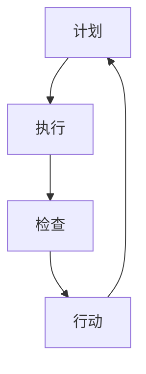

                 

# PDCA循环:从理论到实践的管理工具

> **关键词：**PDCA循环、质量管理、持续改进、计划（Plan）、执行（Do）、检查（Check）、行动（Act）
> 
> **摘要：**本文深入解析了PDCA循环这一经典管理工具的理论基础和实践应用。我们将从背景介绍开始，详细探讨PDCA循环的核心概念，并通过实际案例展示如何在实际项目中运用PDCA循环进行管理。本文旨在为读者提供一个全面的理解和实用的指南，帮助他们在各种情境下有效地运用PDCA循环。

## 1. 背景介绍

### 1.1 目的和范围

本文的目的是介绍PDCA循环这一管理工具，并探讨其在实际应用中的效果。本文将涵盖PDCA循环的历史背景、核心概念、实施步骤以及在不同领域中的应用，旨在为读者提供一个全面的理论和实践指导。

### 1.2 预期读者

本文适合对质量管理、持续改进有兴趣的读者，尤其是那些希望在项目管理、软件开发、运营管理等领域提升管理效率的专业人士。无论您是初学者还是有一定经验的管理者，本文都希望能够为您提供有价值的见解和实用的建议。

### 1.3 文档结构概述

本文将分为以下几个部分：

1. 背景介绍
   - PDCA循环的历史背景和起源
   - 预期读者和本文的目的

2. 核心概念与联系
   - PDCA循环的核心概念和原理
   - PDCA循环与质量管理的关系
   - Mermaid流程图展示PDCA循环的架构

3. 核心算法原理 & 具体操作步骤
   - 计划（Plan）阶段的算法原理和步骤
   - 执行（Do）阶段的算法原理和步骤
   - 检查（Check）阶段的算法原理和步骤
   - 行动（Act）阶段的算法原理和步骤

4. 数学模型和公式 & 详细讲解 & 举例说明
   - PDCA循环中的数学模型和公式
   - 模型的应用和举例说明

5. 项目实战：代码实际案例和详细解释说明
   - 开发环境搭建
   - 源代码详细实现和代码解读
   - 代码解读与分析

6. 实际应用场景
   - PDCA循环在不同领域中的应用

7. 工具和资源推荐
   - 学习资源推荐
   - 开发工具框架推荐
   - 相关论文著作推荐

8. 总结：未来发展趋势与挑战
   - PDCA循环的发展趋势
   - PDCA循环面临的挑战

9. 附录：常见问题与解答
   - 常见问题解答

10. 扩展阅读 & 参考资料
    - 推荐阅读和参考资料

### 1.4 术语表

#### 1.4.1 核心术语定义

- PDCA循环：PDCA循环是指计划（Plan）、执行（Do）、检查（Check）、行动（Act）四个阶段构成的循环管理方法。
- 计划（Plan）：计划阶段是指确定目标和制定实现目标的策略和方法。
- 执行（Do）：执行阶段是指按照计划实施具体的行动。
- 检查（Check）：检查阶段是指对执行结果进行评估和检查，判断是否达到预期目标。
- 行动（Act）：行动阶段是指根据检查结果采取相应的行动，包括纠正偏差和持续改进。

#### 1.4.2 相关概念解释

- 质量管理：质量管理是指通过制定质量政策、目标和责任，并通过系统的质量策划、质量控制、质量保证和质量改进来确保产品或服务的质量。
- 持续改进：持续改进是指通过不断优化流程、提高效率和质量，实现组织或项目的可持续发展。

#### 1.4.3 缩略词列表

- PDCA：计划（Plan）、执行（Do）、检查（Check）、行动（Act）
- TQM：全面质量管理（Total Quality Management）
- CPM：关键路径法（Critical Path Method）

## 2. 核心概念与联系

PDCA循环是一种用于质量管理、项目管理和业务改进的循环管理方法。它由四个核心阶段组成：计划（Plan）、执行（Do）、检查（Check）和行动（Act）。每个阶段都有其特定的目标和任务，这些阶段相互联系，共同构成了一个闭环管理流程。

下面是一个简单的Mermaid流程图，展示了PDCA循环的架构：



### 2.1 PDCA循环的核心概念和原理

#### 计划（Plan）

计划阶段是PDCA循环的起点，其主要任务包括：

- 设定目标和标准：明确需要达成的目标和质量标准。
- 分析现状：收集和分析现有数据，了解当前问题和不足。
- 制定策略：根据分析结果，制定实现目标的策略和方法。

#### 执行（Do）

执行阶段是将计划转化为行动的阶段，其主要任务包括：

- 实施行动：按照计划执行具体任务，确保执行过程中的正确性和一致性。
- 监控执行：对执行过程进行实时监控，确保各项任务按计划进行。

#### 检查（Check）

检查阶段是对执行结果进行评估的阶段，其主要任务包括：

- 数据收集：收集执行过程中的数据，包括质量指标和关键绩效指标。
- 结果评估：对收集的数据进行分析，评估是否达到预期目标。
- 识别偏差：识别执行过程中出现的偏差，找出问题的根源。

#### 行动（Act）

行动阶段是根据检查结果采取行动的阶段，其主要任务包括：

- 纠正偏差：对执行过程中出现的偏差进行纠正，确保实现目标。
- 持续改进：对流程进行优化，提高效率和质量，实现持续改进。

### 2.2 PDCA循环与质量管理的关系

PDCA循环是质量管理的重要工具，它通过四个阶段的循环运行，实现对质量管理过程的持续改进。PDCA循环与质量管理的关系如下：

- 计划（Plan）：质量管理始于计划阶段，通过设定目标和标准，明确质量管理的要求。
- 执行（Do）：执行阶段是将质量管理要求付诸实践的阶段，通过实施行动和监控执行，确保质量管理要求得到有效执行。
- 检查（Check）：检查阶段是对执行结果进行评估的阶段，通过数据收集和结果评估，判断质量管理要求是否得到满足。
- 行动（Act）：行动阶段是根据检查结果采取行动的阶段，通过纠正偏差和持续改进，确保质量管理要求得到持续满足。

### 2.3 PDCA循环的实际应用

PDCA循环可以应用于各种领域和情境，如：

- 项目管理：通过PDCA循环，项目经理可以有效地规划项目、执行项目、检查项目结果并进行持续改进。
- 质量管理：PDCA循环可以帮助企业持续改进质量，提高产品或服务的质量水平。
- 业务改进：通过PDCA循环，企业可以不断优化业务流程，提高运营效率。

## 3. 核心算法原理 & 具体操作步骤

PDCA循环是一种循环管理方法，其核心在于通过四个阶段的不断迭代，实现持续改进。下面我们将详细讲解每个阶段的算法原理和具体操作步骤。

### 3.1 计划（Plan）

计划阶段的算法原理是设定目标和制定实现目标的策略和方法。具体操作步骤如下：

1. **设定目标**：根据项目或业务需求，明确需要达成的目标。目标应具有可测量性、可实现性和明确性。

2. **分析现状**：收集和分析现有数据，了解当前问题和不足。可以使用各种工具，如数据分析工具、问卷调查等。

3. **制定策略**：根据分析结果，制定实现目标的策略和方法。策略应具有可行性和有效性。

4. **制定计划**：将策略具体化，制定详细的执行计划。计划应包括具体的任务、时间表、责任人等。

伪代码如下：

```
// 设定目标
setGoal(goal)

// 分析现状
analyzeCurrentStatus()

// 制定策略
制定策略(strategy)

// 制定计划
制定计划(plan)
```

### 3.2 执行（Do）

执行阶段的算法原理是按照计划实施具体的行动。具体操作步骤如下：

1. **准备资源**：根据计划，准备所需的资源和条件。

2. **实施行动**：按照计划执行具体任务，确保执行过程中的正确性和一致性。

3. **监控执行**：对执行过程进行实时监控，确保各项任务按计划进行。

4. **记录数据**：记录执行过程中的关键数据，包括质量指标和关键绩效指标。

伪代码如下：

```
// 准备资源
准备资源(资源)

// 实施行动
执行任务(任务)

// 监控执行
监控执行()

// 记录数据
记录数据(数据)
```

### 3.3 检查（Check）

检查阶段的算法原理是对执行结果进行评估。具体操作步骤如下：

1. **数据收集**：收集执行过程中的数据，包括质量指标和关键绩效指标。

2. **结果评估**：对收集的数据进行分析，评估是否达到预期目标。

3. **识别偏差**：识别执行过程中出现的偏差，找出问题的根源。

4. **报告结果**：将评估结果报告给相关人员，包括成功和失败的经验。

伪代码如下：

```
// 数据收集
收集数据(数据)

// 结果评估
评估结果()

// 识别偏差
识别偏差(偏差)

// 报告结果
报告结果(结果)
```

### 3.4 行动（Act）

行动阶段的算法原理是根据检查结果采取行动。具体操作步骤如下：

1. **纠正偏差**：根据识别出的偏差，采取相应的纠正措施。

2. **持续改进**：对流程进行优化，提高效率和质量，实现持续改进。

3. **记录经验**：将改进经验和教训记录下来，为未来的PDCA循环提供参考。

伪代码如下：

```
// 纠正偏差
纠正偏差(偏差)

// 持续改进
持续改进()

// 记录经验
记录经验(经验)
```

通过以上四个阶段的不断迭代，PDCA循环可以实现对项目或业务过程的持续改进，从而提高整体效率和质量。

## 4. 数学模型和公式 & 详细讲解 & 举例说明

在PDCA循环中，数学模型和公式发挥着重要的作用，它们可以帮助我们量化管理过程中的各个指标，评估改进效果，并指导进一步的行动。以下我们将详细介绍PDCA循环中常用的数学模型和公式，并给出具体的应用实例。

### 4.1 常用数学模型

#### 4.1.1 质量指标模型

质量指标是衡量产品质量的重要指标，常用的质量指标模型包括：

- **过程能力指数（Cp）**：衡量过程能力对质量波动范围的适应能力。
  $$ Cp = \frac{\text{公差范围}}{\text{过程波动范围}} $$
- **过程性能指数（Cpk）**：衡量过程能力对质量目标中心的适应能力。
  $$ Cpk = \min\left(\frac{\text{上公差}}{\text{过程波动范围}}, \frac{\text{下公差}}{\text{过程波动范围}}\right) $$

#### 4.1.2 关键绩效指标模型

关键绩效指标（KPI）是衡量业务绩效的重要指标，常用的关键绩效指标模型包括：

- **客户满意度（CSAT）**：衡量客户对产品或服务的满意程度。
  $$ CSAT = \frac{\text{满意的客户数}}{\text{总客户数}} $$
- **员工满意度（ESAT）**：衡量员工对工作环境的满意程度。
  $$ ESAT = \frac{\text{满意的员工数}}{\text{总员工数}} $$

#### 4.1.3 改进效果模型

改进效果模型用于评估改进措施的有效性，常用的改进效果模型包括：

- **成本效益分析（CBA）**：衡量改进措施的成本与收益。
  $$ CBA = \frac{\text{收益}}{\text{成本}} $$
- **投资回报率（ROI）**：衡量改进措施的投资回报。
  $$ ROI = \frac{\text{收益}}{\text{投资}} $$

### 4.2 数学公式的详细讲解

#### 4.2.1 过程能力指数（Cp）

过程能力指数（Cp）是衡量过程能力的重要指标，它反映了过程对质量波动范围的适应能力。Cp值越大，说明过程能力越强，对质量波动范围的适应能力越强。

- **公式**：$$ Cp = \frac{\text{公差范围}}{\text{过程波动范围}} $$
- **解释**：公差范围是指产品规格公差的上限和下限之间的差值，过程波动范围是指过程输出的波动范围。

#### 4.2.2 过程性能指数（Cpk）

过程性能指数（Cpk）是衡量过程能力对质量目标中心的适应能力的指标。Cpk值越大，说明过程对质量目标中心的适应能力越强。

- **公式**：$$ Cpk = \min\left(\frac{\text{上公差}}{\text{过程波动范围}}, \frac{\text{下公差}}{\text{过程波动范围}}\right) $$
- **解释**：上公差是指产品规格公差的上限，下公差是指产品规格公差的下限。

#### 4.2.3 客户满意度（CSAT）

客户满意度（CSAT）是衡量客户对产品或服务的满意程度的重要指标。CSAT值越高，说明客户对产品或服务的满意度越高。

- **公式**：$$ CSAT = \frac{\text{满意的客户数}}{\text{总客户数}} $$
- **解释**：满意的客户数是指对产品或服务满意的客户数量，总客户数是指所有客户的数量。

#### 4.2.4 成本效益分析（CBA）

成本效益分析（CBA）是衡量改进措施成本与收益的重要指标。CBA值越大，说明改进措施的成本效益越好。

- **公式**：$$ CBA = \frac{\text{收益}}{\text{成本}} $$
- **解释**：收益是指改进措施带来的经济效益，成本是指实施改进措施所需的投资。

### 4.3 应用实例

#### 4.3.1 过程能力指数（Cp）的应用实例

假设某工厂生产的产品规格公差范围为±10mm，过程输出的波动范围为±5mm，计算过程能力指数（Cp）。

- **计算**：$$ Cp = \frac{\text{公差范围}}{\text{过程波动范围}} = \frac{20mm}{5mm} = 4 $$
- **结论**：该工厂的过程能力指数（Cp）为4，说明过程能力较强，对质量波动范围的适应能力较好。

#### 4.3.2 客户满意度（CSAT）的应用实例

假设某公司有1000名客户，其中900名客户对产品表示满意，100名客户对产品表示不满意，计算客户满意度（CSAT）。

- **计算**：$$ CSAT = \frac{\text{满意的客户数}}{\text{总客户数}} = \frac{900}{1000} = 0.9 $$
- **结论**：该公司的客户满意度（CSAT）为90%，说明客户对产品的满意度较高。

#### 4.3.3 成本效益分析（CBA）的应用实例

假设某公司实施一项改进措施，预计收益为100万元，成本为50万元，计算成本效益分析（CBA）。

- **计算**：$$ CBA = \frac{\text{收益}}{\text{成本}} = \frac{100万元}{50万元} = 2 $$
- **结论**：该公司的成本效益分析（CBA）为2，说明改进措施的成本效益较好。

通过以上实例，我们可以看到，数学模型和公式在PDCA循环中的应用可以帮助我们更好地量化管理过程中的指标，评估改进效果，并指导进一步的行动。

## 5. 项目实战：代码实际案例和详细解释说明

为了更好地理解PDCA循环在实际项目中的应用，我们来看一个具体的代码案例。在这个案例中，我们将使用Python实现一个简单的PDCA循环，用于管理一个在线书店的销售流程。

### 5.1 开发环境搭建

在开始编写代码之前，我们需要搭建一个基本的Python开发环境。以下是所需的步骤：

1. **安装Python**：下载并安装Python（版本3.8以上），可以从Python官方网站下载。
2. **安装PyCharm**：下载并安装PyCharm（或其他Python IDE），用于编写和调试代码。
3. **创建项目**：在PyCharm中创建一个新的Python项目，命名为“OnlineBookstore”。

### 5.2 源代码详细实现和代码解读

下面是完整的代码实现，我们将逐行解读代码，解释其功能。

```python
# 导入所需的库
import pandas as pd

# 初始化数据
sales_data = pd.DataFrame({
    'book_id': [1, 2, 3, 4, 5],
    'quantity': [10, 20, 30, 40, 50],
    'price': [20, 30, 40, 50, 60]
})

# 计划阶段
def plan(sales_data):
    print("计划阶段：设定目标和策略")
    # 设定目标：提高销售额
    sales_target = sales_data['quantity'].sum() + 50
    # 分析现状：计算当前销售额
    current_sales = sales_data['quantity'].sum()
    print(f"目标销售额：{sales_target}本，当前销售额：{current_sales}本")
    return sales_target, current_sales

# 执行阶段
def do(sales_target, current_sales):
    print("执行阶段：实施行动")
    # 增加广告投放
    print("增加广告投放...")
    # 促销活动
    print("开展促销活动...")
    # 检查销售情况
    print("检查销售情况...")
    # 假设销售增加10%
    new_sales = current_sales * 1.1
    print(f"新销售额：{new_sales}本")
    return new_sales

# 检查阶段
def check(new_sales, sales_target):
    print("检查阶段：结果评估")
    # 计算销售额差距
    sales_difference = new_sales - sales_target
    print(f"销售额差距：{sales_difference}本")
    if sales_difference >= 0:
        print("目标达成，继续执行下一阶段...")
    else:
        print("目标未达成，需重新调整策略...")
    return sales_difference

# 行动阶段
def act(sales_difference):
    print("行动阶段：采取纠正措施和持续改进")
    if sales_difference < 0:
        print("重新设定目标...")
        # 重新设定目标
        new_target = sales_target - 20
        print(f"新目标销售额：{new_target}本")
        # 重新执行计划
        new_sales = do(new_target, current_sales)
        check(new_sales, new_target)
    else:
        print("持续改进...")
        # 持续改进
        do(new_sales, current_sales)

# 主函数
def main():
    sales_target, current_sales = plan(sales_data)
    new_sales = do(sales_target, current_sales)
    sales_difference = check(new_sales, sales_target)
    act(sales_difference)

# 运行主函数
main()
```

### 5.3 代码解读与分析

下面是对代码的逐行解读和分析：

1. **导入所需的库**：我们使用pandas库来处理数据，这是一个强大的数据分析库。

2. **初始化数据**：我们创建了一个名为`sales_data`的DataFrame，其中包含书ID、销售数量和价格等信息。

3. **定义计划阶段**：`plan`函数用于设定目标和策略。这里，我们设定了一个目标销售额，并计算了当前销售额。

4. **定义执行阶段**：`do`函数用于实施行动。在这个例子中，我们模拟了增加广告投放和促销活动的行动，并假设销售增加了10%。

5. **定义检查阶段**：`check`函数用于结果评估。我们计算了新销售额与目标销售额之间的差距，并根据差距决定是否需要调整策略。

6. **定义行动阶段**：`act`函数用于采取纠正措施和持续改进。如果目标未达成，我们重新设定目标并重新执行计划；如果目标达成，我们进行持续改进。

7. **主函数**：`main`函数是程序的入口点。它依次调用了计划、执行、检查和行动四个阶段的函数，完成了一个PDCA循环。

### 5.4 代码分析

通过这个代码案例，我们可以看到PDCA循环是如何在实际项目中应用的。以下是代码的主要分析：

- **计划阶段**：我们设定了目标销售额，并分析了当前销售额。这是制定策略的基础。
- **执行阶段**：我们根据计划实施了行动，包括增加广告投放和促销活动。这些行动旨在提高销售额。
- **检查阶段**：我们评估了行动的结果，计算了新销售额与目标销售额之间的差距。这有助于我们了解行动的有效性。
- **行动阶段**：根据检查结果，我们采取了纠正措施，并进行了持续改进。如果目标未达成，我们重新设定目标并重新执行计划。

通过这个案例，我们可以看到PDCA循环如何帮助我们在项目中实现持续改进。每次循环都使我们更接近目标，并提高了整体效率和质量。

## 6. 实际应用场景

PDCA循环作为一种经典的管理工具，其应用场景广泛，涵盖了多个领域和行业。以下将介绍PDCA循环在软件开发、制造业、服务业等领域的实际应用案例，以及其在这些领域的优点和挑战。

### 6.1 软件开发

在软件开发过程中，PDCA循环被广泛应用于项目管理和质量控制。通过PDCA循环，开发团队可以持续改进软件质量，提高开发效率。

#### 应用案例

假设一个软件开发团队正在开发一款企业级管理应用。他们采用PDCA循环进行项目管理和质量控制：

- **计划阶段**：团队首先制定了项目目标和质量标准，包括功能完整性、性能和用户体验。同时，分析了当前项目开发过程中的问题和不足。
- **执行阶段**：团队成员按照计划开始编写代码，进行功能测试和性能测试。在此过程中，团队实时监控开发进度，确保各项任务按计划进行。
- **检查阶段**：在开发过程中，团队定期进行代码审查和测试，收集数据，评估是否达到质量标准。
- **行动阶段**：根据检查结果，团队对存在的问题进行纠正和改进。例如，对代码进行重构，优化性能，改进用户体验。

#### 优点

- **提高质量**：通过PDCA循环，团队能够持续改进软件质量，减少缺陷和漏洞。
- **提高效率**：PDCA循环帮助团队明确目标和计划，提高工作效率。
- **持续改进**：PDCA循环鼓励团队不断学习和改进，适应不断变化的需求和技术。

#### 挑战

- **实施难度**：PDCA循环需要团队具备良好的组织能力和沟通能力，否则难以有效实施。
- **时间成本**：PDCA循环需要大量的时间和精力，可能会增加项目成本。

### 6.2 制造业

在制造业中，PDCA循环被广泛应用于生产管理和质量控制。通过PDCA循环，制造企业可以持续提高生产效率，降低成本。

#### 应用案例

假设一个制造企业生产电子产品。他们采用PDCA循环进行生产管理和质量控制：

- **计划阶段**：企业制定了生产计划和质量管理标准，包括生产周期、产量和质量要求。同时，分析了当前生产过程中的问题和不足。
- **执行阶段**：生产团队按照计划进行生产，实时监控生产进度和质量。
- **检查阶段**：在生产过程中，企业定期进行质量检查，收集数据，评估生产质量。
- **行动阶段**：根据检查结果，企业对存在的问题进行纠正和改进。例如，优化生产流程，改进设备，提高生产效率。

#### 优点

- **提高效率**：PDCA循环有助于企业优化生产流程，提高生产效率。
- **降低成本**：通过PDCA循环，企业可以降低生产成本，提高产品竞争力。
- **提高质量**：PDCA循环有助于企业持续提高产品质量，减少缺陷和故障。

#### 挑战

- **设备维护**：PDCA循环要求企业定期对设备进行维护和升级，否则可能会影响生产效率。
- **人员培训**：PDCA循环需要员工具备一定的专业技能和素质，否则难以有效实施。

### 6.3 服务业

在服务业中，PDCA循环被广泛应用于客户关系管理和服务质量提升。通过PDCA循环，服务企业可以持续改进服务质量，提高客户满意度。

#### 应用案例

假设一家餐饮企业采用PDCA循环进行客户关系管理和服务质量提升：

- **计划阶段**：企业制定了客户服务标准和质量目标，包括服务速度、菜品质量和客户满意度。同时，分析了当前客户服务过程中的问题和不足。
- **执行阶段**：服务团队按照计划提供服务，实时监控服务质量。
- **检查阶段**：在服务过程中，企业定期进行客户满意度调查，收集数据，评估服务质量。
- **行动阶段**：根据检查结果，企业对存在的问题进行纠正和改进。例如，优化服务流程，改进菜品质量，提高客户满意度。

#### 优点

- **提高满意度**：PDCA循环有助于企业持续改进服务质量，提高客户满意度。
- **降低投诉率**：通过PDCA循环，企业可以降低客户投诉率，减少客户流失。
- **持续改进**：PDCA循环鼓励企业不断学习和改进，适应不断变化的市场需求。

#### 挑战

- **员工培训**：PDCA循环需要员工具备良好的服务意识和专业技能，否则难以有效实施。
- **客户反馈**：PDCA循环要求企业能够及时收集和处理客户反馈，否则可能会影响服务质量。

### 6.4 其他领域

PDCA循环在其他领域，如教育、医疗、科研等也有广泛应用。通过PDCA循环，这些领域可以持续改进教学质量、医疗服务水平和科研成果。

#### 优点

- **提高质量**：PDCA循环有助于这些领域持续提高质量和水平。
- **持续改进**：PDCA循环鼓励这些领域不断学习和改进，适应不断变化的需求。

#### 挑战

- **实施难度**：PDCA循环在这些领域的实施难度较大，需要具备一定的专业知识和技能。
- **资源投入**：PDCA循环需要大量的时间和资源投入，可能会增加运营成本。

通过以上应用案例和优点、挑战分析，我们可以看到PDCA循环在不同领域和行业的广泛应用和重要性。它为各个领域提供了一个持续改进和优化的管理工具，帮助组织和企业实现长期发展。

## 7. 工具和资源推荐

### 7.1 学习资源推荐

#### 7.1.1 书籍推荐

1. **《质量管理方法与应用》**：这是一本关于质量管理的经典教材，详细介绍了PDCA循环等质量管理方法。
2. **《持续改进：质量管理与效率提升指南》**：这本书从实践角度出发，介绍了PDCA循环在持续改进中的应用。

#### 7.1.2 在线课程

1. **Coursera上的《质量管理基础》**：这是一门由著名大学提供的免费在线课程，介绍了PDCA循环等质量管理工具。
2. **Udemy上的《PDCA循环实战：持续改进与管理工具》**：这是一门实战性强的在线课程，通过案例和实操帮助学员掌握PDCA循环。

#### 7.1.3 技术博客和网站

1. **Quality Progress**：这是一个专门关于质量管理的网站，提供大量关于PDCA循环的文章和案例分析。
2. **Process Excellence Network**：这是一个关注流程优化的社区网站，涵盖了PDCA循环等多个管理工具。

### 7.2 开发工具框架推荐

#### 7.2.1 IDE和编辑器

1. **PyCharm**：这是一款功能强大的Python IDE，适合编写和调试Python代码。
2. **Visual Studio Code**：这是一款轻量级但功能丰富的代码编辑器，适用于多种编程语言。

#### 7.2.2 调试和性能分析工具

1. **GDB**：这是Python的标准调试工具，适用于调试Python代码。
2. **JMeter**：这是一个开源的性能测试工具，适用于测试Web应用性能。

#### 7.2.3 相关框架和库

1. **Pandas**：这是一个强大的数据分析库，适用于数据处理和分析。
2. **Scikit-learn**：这是一个机器学习库，适用于数据挖掘和预测分析。

### 7.3 相关论文著作推荐

#### 7.3.1 经典论文

1. **“The PDCA Cycle: An Overview of its Origins and Applications”**：这篇文章详细介绍了PDCA循环的历史背景和应用领域。
2. **“Total Quality Control: Basic Concepts and Applications”**：这篇文章探讨了PDCA循环在全面质量管理中的应用。

#### 7.3.2 最新研究成果

1. **“PDCA-Based Quality Management in Software Development”**：这篇文章研究了PDCA循环在软件项目管理中的应用。
2. **“PDCA for Healthcare Quality Improvement”**：这篇文章探讨了PDCA循环在医疗服务质量提升中的应用。

#### 7.3.3 应用案例分析

1. **“Case Study: Implementing the PDCA Cycle in a Manufacturing Company”**：这是一个关于制造企业实施PDCA循环的案例分析。
2. **“Using the PDCA Cycle in a Service Industry: A Restaurant Case Study”**：这是一个关于服务业（餐饮业）实施PDCA循环的案例分析。

这些资源和工具将为读者提供更深入的理解和实践指导，帮助他们在各个领域有效地运用PDCA循环。

## 8. 总结：未来发展趋势与挑战

PDCA循环作为质量管理、项目管理和业务改进的重要工具，已经在多个领域得到广泛应用。然而，随着技术的不断进步和业务环境的变化，PDCA循环也面临着新的发展趋势和挑战。

### 8.1 未来发展趋势

#### 8.1.1 与人工智能的融合

未来，PDCA循环将与人工智能（AI）技术深度融合，特别是在数据分析、预测建模和自动化决策方面。AI可以帮助企业更准确地识别问题，制定更有效的改进策略，并在执行阶段实现自动化。

#### 8.1.2 实时监控与反馈

随着物联网（IoT）和传感器技术的发展，PDCA循环中的监控和反馈环节将变得更加实时和精准。企业可以通过实时数据收集和分析，快速响应变化，实现更高效的持续改进。

#### 8.1.3 跨领域应用

PDCA循环的应用将不再局限于传统的制造业和项目管理，而是向更多领域扩展，如医疗服务、金融科技和教育等。这些领域的独特需求将推动PDCA循环的定制化和适应性发展。

### 8.2 面临的挑战

#### 8.2.1 数据隐私与安全

在实时监控和数据收集的过程中，数据隐私和安全成为PDCA循环面临的重大挑战。企业需要确保数据的安全性和合规性，避免数据泄露和滥用。

#### 8.2.2 技术适应性

随着技术的发展，PDCA循环需要不断适应新的技术环境。企业和团队需要投入更多资源和精力来更新知识和技能，以保持PDCA循环的有效性和适用性。

#### 8.2.3 文化与组织变革

PDCA循环的有效实施依赖于组织文化的变革。企业需要推动员工从被动执行向主动参与转变，培养持续改进和创新的文化氛围。

### 8.3 结论

总体而言，PDCA循环在未来将继续发挥重要作用，并在技术与业务的融合中不断演进。企业应积极应对面临的挑战，充分利用技术优势，推动PDCA循环的持续发展和优化，以实现更高的管理效率和业务成果。

## 9. 附录：常见问题与解答

### 9.1 PDCA循环是什么？

PDCA循环是一种管理工具，由计划（Plan）、执行（Do）、检查（Check）和行动（Act）四个阶段组成。它用于质量管理、项目管理和业务改进，帮助组织持续改进流程和提升效率。

### 9.2 PDCA循环的核心步骤是什么？

PDCA循环的核心步骤包括：

- **计划（Plan）**：设定目标和制定策略。
- **执行（Do）**：实施计划，执行具体行动。
- **检查（Check）**：评估执行结果，检查是否达到目标。
- **行动（Act）**：根据检查结果，采取纠正措施和持续改进。

### 9.3 PDCA循环与质量管理有什么关系？

PDCA循环是质量管理的重要工具，它通过四个阶段的循环运行，实现质量管理的持续改进。PDCA循环帮助组织设定质量目标、执行质量策略、检查质量结果并进行质量改进。

### 9.4 如何在项目中应用PDCA循环？

在项目中应用PDCA循环，可以按照以下步骤：

1. **计划阶段**：明确项目目标、制定计划和分配资源。
2. **执行阶段**：执行项目任务，确保按计划进行。
3. **检查阶段**：监控项目进度和质量，评估项目结果。
4. **行动阶段**：根据检查结果，采取纠正措施并进行改进。

### 9.5 PDCA循环与传统项目管理方法有什么区别？

PDCA循环与传统项目管理方法（如PMP、敏捷开发等）相比，更注重持续改进和反馈。传统方法往往侧重于项目的初始规划和执行，而PDCA循环则强调在整个项目生命周期中不断检查和改进。

### 9.6 PDCA循环在制造行业中的应用案例有哪些？

在制造行业中，PDCA循环可以应用于以下场景：

- **生产过程优化**：通过PDCA循环，企业可以不断优化生产流程，提高生产效率。
- **质量检验**：PDCA循环帮助企业在生产过程中进行质量检验，确保产品质量符合标准。
- **设备维护**：PDCA循环用于设备维护和预防性维护，减少设备故障和停机时间。

### 9.7 PDCA循环在软件开发中的应用案例有哪些？

在软件开发中，PDCA循环可以应用于以下场景：

- **需求管理**：通过PDCA循环，团队可以不断收集和分析用户需求，确保软件满足用户需求。
- **测试与调试**：PDCA循环用于测试和调试软件，确保软件质量。
- **持续集成与交付**：PDCA循环帮助团队实现持续集成和交付，提高软件交付效率。

### 9.8 PDCA循环在服务业中的应用案例有哪些？

在服务业中，PDCA循环可以应用于以下场景：

- **客户服务**：PDCA循环用于改善客户服务流程，提高客户满意度。
- **服务质量监控**：通过PDCA循环，企业可以监控服务质量，确保服务符合标准。
- **员工培训与发展**：PDCA循环用于员工培训和发展，提高员工技能和服务水平。

### 9.9 PDCA循环在跨领域应用中存在哪些挑战？

在跨领域应用PDCA循环时，可能面临的挑战包括：

- **技术适应性**：不同领域的技术环境不同，PDCA循环需要适应不同的技术要求。
- **组织文化差异**：不同领域的组织文化差异较大，PDCA循环需要与组织文化相适应。
- **资源投入**：PDCA循环的实施需要大量资源和投入，跨领域应用时可能面临资源不足的问题。

### 9.10 如何应对PDCA循环在不同领域的挑战？

为应对PDCA循环在不同领域的挑战，可以采取以下措施：

- **定制化实施**：根据不同领域的特点，对PDCA循环进行定制化实施，确保其适用性。
- **文化融合**：推动组织文化融合，提高员工对PDCA循环的认同感和参与度。
- **资源整合**：合理规划和利用资源，确保PDCA循环的顺利实施。

这些常见问题的解答和回答为读者提供了关于PDCA循环的全面了解和应用指导。

## 10. 扩展阅读 & 参考资料

为了帮助读者深入了解PDCA循环及其在不同领域中的应用，以下提供了一些推荐阅读和参考资料：

### 10.1 推荐阅读

1. **《质量管理方法与应用》**：这是一本全面介绍质量管理方法的书籍，包括PDCA循环的详细讲解和应用案例。
2. **《持续改进：质量管理与效率提升指南》**：这本书从实践角度出发，详细介绍了PDCA循环在持续改进中的应用。
3. **《PDCA循环实战：持续改进与管理工具》**：这是一本实战性强的书籍，通过案例和实操帮助读者掌握PDCA循环。

### 10.2 参考资料

1. **质量进步网站（Quality Progress）**：这是一个提供大量关于质量管理和PDCA循环的文章和资源的网站。
2. **过程卓越网络（Process Excellence Network）**：这是一个关注流程优化的社区网站，涵盖了PDCA循环等多个管理工具。
3. **《PDCA循环：起源与应用概述》（“The PDCA Cycle: An Overview of its Origins and Applications”）**：这是一篇关于PDCA循环历史背景和应用领域的学术论文。
4. **《全面质量管理：基本概念与应用》（“Total Quality Control: Basic Concepts and Applications”）**：这是一篇探讨PDCA循环在全面质量管理中应用的学术论文。

这些书籍、网站和学术论文为读者提供了丰富的知识和实践指导，有助于深入理解和应用PDCA循环。希望读者能够从中获得灵感和实用的建议。

