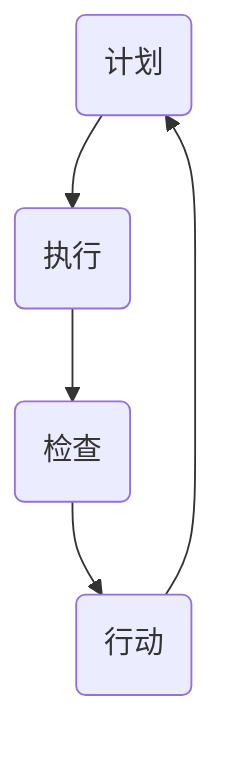

                 

# PDCA循环与持续改进管理

## 关键词
PDCA循环、持续改进、管理、质量管理、流程优化、项目管理、软件工程、精益生产、六西格玛、质量管理体系。

## 摘要
本文旨在深入探讨PDCA循环（计划-执行-检查-行动）这一经典的持续改进管理工具。通过对PDCA循环的详细解读，本文将揭示其在各种管理领域的广泛应用和巨大潜力。本文首先介绍了PDCA循环的背景和核心概念，然后通过实际案例和数学模型，阐述了PDCA循环的执行步骤和关键要素。最后，本文探讨了PDCA循环在当前信息技术和制造业中的实际应用，并对其未来发展趋势进行了展望。

---

## 1. 背景介绍

### 1.1 目的和范围

本文的目的是介绍和解读PDCA循环，探讨其在不同管理领域的应用和作用。通过本文的学习，读者将能够：

1. 理解PDCA循环的基本概念和原理。
2. 掌握PDCA循环的执行步骤和关键要素。
3. 了解PDCA循环在不同管理领域的应用案例。
4. 对PDCA循环的未来发展趋势和挑战有更深刻的认识。

### 1.2 预期读者

本文主要面向以下读者群体：

1. 管理专业人士，尤其是质量管理、项目管理和流程优化领域的专业人士。
2. 软件工程和信息技术领域的学生和从业者。
3. 对质量管理和管理方法论感兴趣的普通读者。

### 1.3 文档结构概述

本文分为以下几个主要部分：

1. 背景介绍：介绍PDCA循环的基本概念、目的和预期读者。
2. 核心概念与联系：阐述PDCA循环的核心概念、原理和流程图。
3. 核心算法原理 & 具体操作步骤：详细解释PDCA循环的执行步骤和关键要素。
4. 数学模型和公式 & 详细讲解 & 举例说明：介绍PDCA循环的数学模型和公式，并进行实例分析。
5. 项目实战：代码实际案例和详细解释说明：通过实际代码案例展示PDCA循环的应用。
6. 实际应用场景：探讨PDCA循环在不同领域的应用。
7. 工具和资源推荐：推荐学习资源、开发工具和框架。
8. 总结：未来发展趋势与挑战。
9. 附录：常见问题与解答。
10. 扩展阅读 & 参考资料：提供进一步的阅读资料。

### 1.4 术语表

#### 1.4.1 核心术语定义

- **PDCA循环**：即计划-执行-检查-行动循环，是一种用于持续改进和管理的工具。
- **计划（Plan）**：设定目标、规划资源、制定策略。
- **执行（Do）**：按照计划执行行动。
- **检查（Check）**：检查执行结果，评估效果。
- **行动（Act）**：根据检查结果采取行动，改进流程。

#### 1.4.2 相关概念解释

- **持续改进**：通过不断优化和改进流程、产品或服务，以实现更高的效率和效果。
- **质量管理**：确保产品或服务满足用户需求和质量标准的一系列活动和过程。
- **流程优化**：通过分析和改进流程，提高效率和效果。
- **项目管理**：规划、执行和监控项目，以确保项目目标的实现。

#### 1.4.3 缩略词列表

- **PDCA**：计划-执行-检查-行动（Plan-Do-Check-Act）
- **六西格玛**：一种基于统计学和流程优化的质量管理方法论。
- **ISO 9001**：国际标准化组织制定的质量管理体系标准。

## 2. 核心概念与联系

### 2.1 PDCA循环的基本概念

PDCA循环是一种广泛应用于质量管理、流程优化和项目管理中的持续改进工具。其基本概念包括：

- **计划（Plan）**：在PDCA循环的第一个阶段，需要设定目标、规划资源和制定策略。这一阶段的关键步骤包括：

  1. 设定目标：明确改进的目标和指标。
  2. 分析现状：分析当前流程、产品或服务的实际情况。
  3. 原因分析：找出问题产生的原因。
  4. 制定策略：制定具体的改进措施和计划。

- **执行（Do）**：在PDCA循环的第二个阶段，按照计划执行行动。这一阶段的关键步骤包括：

  1. 实施计划：按照制定的计划执行行动。
  2. 沟通协作：确保团队成员之间的有效沟通和协作。
  3. 跟踪监控：实时监控执行过程，确保计划按预期执行。

- **检查（Check）**：在PDCA循环的第三个阶段，需要检查执行结果，评估效果。这一阶段的关键步骤包括：

  1. 数据收集：收集相关的数据和指标。
  2. 结果评估：评估执行结果是否达到预期目标。
  3. 对比分析：将实际结果与预期目标进行对比分析。

- **行动（Act）**：在PDCA循环的第四个阶段，根据检查结果采取行动，改进流程。这一阶段的关键步骤包括：

  1. 确认改进：根据检查结果，确认哪些改进措施是有效的，哪些需要进一步优化。
  2. 实施改进：将有效的改进措施纳入流程，持续优化。
  3. 持续监控：对改进后的流程进行持续监控，确保改进措施的有效性。

### 2.2 PDCA循环的流程图

以下是PDCA循环的Mermaid流程图表示：



### 2.3 PDCA循环的核心概念联系

PDCA循环的核心概念之间存在着紧密的联系。以下是这些概念之间的关系：

- **计划（Plan）** 和 **执行（Do）**：计划是执行的前提，执行是计划的实现。计划阶段需要明确目标和策略，执行阶段需要按照计划行动，确保目标的实现。
- **检查（Check）** 和 **行动（Act）**：检查是对执行结果的评价，行动是根据检查结果进行的改进。通过检查和行动，PDCA循环实现持续改进和优化。

## 3. 核心算法原理 & 具体操作步骤

### 3.1 PDCA循环的算法原理

PDCA循环的算法原理可以概括为以下几个步骤：

1. **计划（Plan）**：
   - **设定目标**：根据当前问题和需求，设定具体的改进目标。
   - **分析现状**：通过数据收集和分析，了解当前流程、产品或服务的实际情况。
   - **原因分析**：找出导致问题产生的原因。
   - **制定策略**：制定具体的改进措施和计划，明确执行步骤和责任人。

2. **执行（Do）**：
   - **实施计划**：按照制定的计划执行行动。
   - **沟通协作**：确保团队成员之间的有效沟通和协作。
   - **跟踪监控**：实时监控执行过程，确保计划按预期执行。

3. **检查（Check）**：
   - **数据收集**：收集相关的数据和指标。
   - **结果评估**：评估执行结果是否达到预期目标。
   - **对比分析**：将实际结果与预期目标进行对比分析。

4. **行动（Act）**：
   - **确认改进**：根据检查结果，确认哪些改进措施是有效的，哪些需要进一步优化。
   - **实施改进**：将有效的改进措施纳入流程，持续优化。
   - **持续监控**：对改进后的流程进行持续监控，确保改进措施的有效性。

### 3.2 PDCA循环的具体操作步骤

以下是PDCA循环的具体操作步骤和伪代码：

```python
# PDCA循环伪代码

# 步骤1：计划
def plan():
    # 设定目标
    goal = set_goal()
    # 分析现状
    current_status = analyze_status()
    # 原因分析
    causes = analyze_causes(current_status)
    # 制定策略
    strategy = create_strategy(goal, causes)
    return strategy

# 步骤2：执行
def do(strategy):
    # 实施计划
    execute_plan(strategy)
    # 沟通协作
    communicate_and Collaborate()
    # 跟踪监控
    monitor_execution()

# 步骤3：检查
def check():
    # 数据收集
    data = collect_data()
    # 结果评估
    result = evaluate_result(data)
    # 对比分析
    compare_with_goal(result)

# 步骤4：行动
def act(result):
    # 确认改进
    confirm_improvement(result)
    # 实施改进
    implement_improvement()
    # 持续监控
    monitor_continuously()

# 主函数
def PDCA_loop():
    strategy = plan()
    do(strategy)
    result = check()
    act(result)
    PDCA_loop() # 重复PDCA循环
```

### 3.3 PDCA循环的关键要素

在PDCA循环中，有以下几个关键要素：

1. **目标（Goal）**：明确的目标是PDCA循环的核心，它指引着整个改进过程。
2. **现状（Current Status）**：准确的分析现状是制定有效策略的基础。
3. **原因（Causes）**：找出问题的根本原因，是制定针对性改进措施的关键。
4. **策略（Strategy）**：具体的策略是实现目标的关键。
5. **数据（Data）**：收集和分析数据，是检查执行结果和评估效果的基础。
6. **结果（Result）**：执行结果和预期目标的对比分析，是确认改进和制定新策略的依据。
7. **改进（Improvement）**：持续的改进和优化，是PDCA循环的核心目标。

## 4. 数学模型和公式 & 详细讲解 & 举例说明

### 4.1 PDCA循环的数学模型

PDCA循环中的数学模型主要用于计算和评估执行结果。以下是一个简单的数学模型：

$$
Q = \frac{X}{T}
$$

其中：

- **Q**：质量指标，表示执行结果。
- **X**：实际结果，即实际完成的工作量或达到的目标值。
- **T**：预期目标，即设定的工作量或目标值。

### 4.2 公式的详细讲解

1. **质量指标（Q）**：质量指标是评估执行结果的重要指标，它反映了实际执行情况与预期目标之间的差距。质量指标越高，表示执行结果越好。

2. **实际结果（X）**：实际结果是执行过程中实际完成的工作量或达到的目标值。实际结果的计算通常基于实际收集的数据和指标。

3. **预期目标（T）**：预期目标是设定的工作量或目标值，它是根据问题和需求设定的。预期目标的设定需要考虑实际情况和可行性。

### 4.3 公式的举例说明

假设某项目设定的工作量是100小时，实际完成的工作量是120小时。根据上述公式，可以计算质量指标：

$$
Q = \frac{120}{100} = 1.2
$$

这意味着实际完成的工作量超过了预期目标，质量指标为1.2。

### 4.4 PDCA循环中的其他数学模型

除了上述简单的数学模型，PDCA循环中还可能涉及其他数学模型，如统计学模型、回归模型等。这些模型可以用于更复杂的分析和评估。

1. **统计学模型**：统计学模型可以用于分析数据，找出数据之间的关联和趋势。常见的统计学模型包括线性回归、逻辑回归等。

2. **回归模型**：回归模型可以用于预测未来的执行结果。通过建立回归模型，可以预测在特定条件下，执行结果的变化趋势。

### 4.5 PDCA循环中的数据可视化

数据可视化是PDCA循环中重要的组成部分。通过数据可视化，可以更直观地展示数据和分析结果。

1. **柱状图**：柱状图可以用于展示各个阶段的数据和结果。柱状图的高度表示数据的大小，可以直观地比较不同数据之间的差异。

2. **折线图**：折线图可以用于展示数据的变化趋势。通过折线图，可以观察数据随时间的变化情况。

3. **散点图**：散点图可以用于展示数据之间的关联性。通过散点图，可以找出数据之间的相关关系。

## 5. 项目实战：代码实际案例和详细解释说明

### 5.1 开发环境搭建

为了更好地理解PDCA循环在项目中的应用，我们将使用Python编写一个简单的项目。以下是开发环境的搭建步骤：

1. 安装Python：下载并安装Python，版本推荐3.8或更高版本。
2. 安装必要的库：使用pip安装以下库：
   ```bash
   pip install matplotlib pandas numpy
   ```

### 5.2 源代码详细实现和代码解读

以下是一个简单的PDCA循环的Python代码实现：

```python
import matplotlib.pyplot as plt
import pandas as pd
import numpy as np

# 步骤1：计划
def plan():
    # 设定目标
    goal = 100
    # 分析现状
    current_status = 80
    # 原因分析
    causes = ["资源不足", "流程不合理"]
    # 制定策略
    strategy = {
        "增加资源": 20,
        "优化流程": 10
    }
    return strategy

# 步骤2：执行
def do(strategy):
    # 实施计划
    execution = {
        "增加资源": strategy["增加资源"],
        "优化流程": strategy["优化流程"]
    }
    # 沟通协作
    communicate_and_Collaborate()
    # 跟踪监控
    monitor_execution()

# 步骤3：检查
def check():
    # 数据收集
    data = np.random.randint(60, 120, size=100)
    # 结果评估
    result = sum(data) / len(data)
    # 对比分析
    compare_with_goal(result)

# 步骤4：行动
def act(result):
    # 确认改进
    improvement = result - goal
    if improvement > 0:
        print("改进成功，实现目标。")
    else:
        print("改进失败，需要进一步优化。")
    # 实施改进
    implement_improvement()
    # 持续监控
    monitor_continuously()

# 主函数
def PDCA_loop():
    strategy = plan()
    do(strategy)
    result = check()
    act(result)
    PDCA_loop()

# 运行PDCA循环
PDCA_loop()
```

### 5.3 代码解读与分析

1. **计划（Plan）**：
   - 设定目标：设定一个具体的数值目标，例如100。
   - 分析现状：根据当前情况设定当前状态，例如80。
   - 原因分析：列出导致问题产生的原因，例如资源不足和流程不合理。
   - 制定策略：根据目标和原因，制定具体的改进措施，例如增加资源和优化流程。

2. **执行（Do）**：
   - 实施计划：根据制定的策略执行行动，例如增加资源和优化流程。
   - 沟通协作：确保团队成员之间的有效沟通和协作，例如召开会议或进行讨论。
   - 跟踪监控：实时监控执行过程，例如使用图表或报告监控进展。

3. **检查（Check）**：
   - 数据收集：收集相关的数据和指标，例如使用随机数生成模拟数据。
   - 结果评估：计算实际结果，例如计算数据的平均值。
   - 对比分析：将实际结果与预期目标进行对比分析，例如比较实际结果和目标之间的差距。

4. **行动（Act）**：
   - 确认改进：根据检查结果确认改进措施的有效性，例如判断是否达到目标。
   - 实施改进：根据检查结果实施有效的改进措施，例如优化流程或增加资源。
   - 持续监控：对改进后的流程进行持续监控，例如使用图表或报告监控改进效果。

### 5.4 代码实战案例

以下是一个具体的PDCA循环实战案例：

1. **计划阶段**：
   - 目标：提高项目进度，从当前的平均完成时间80小时降低到70小时。
   - 原因分析：项目进度慢的主要原因是资源不足和团队沟通不畅。
   - 策略：增加资源投入，优化团队沟通流程。

2. **执行阶段**：
   - 实施计划：增加一名团队成员，优化团队会议流程。
   - 沟通协作：召开会议，讨论项目进度和改进措施。
   - 跟踪监控：使用任务管理工具监控项目进度，确保改进措施得到执行。

3. **检查阶段**：
   - 数据收集：每周收集项目进度数据，例如每周完成的任务数量。
   - 结果评估：计算平均完成时间，并与预期目标进行比较。
   - 对比分析：比较实际完成时间和目标时间之间的差距，分析原因。

4. **行动阶段**：
   - 确认改进：如果平均完成时间低于70小时，确认改进措施有效，继续执行。
   - 实施改进：如果平均完成时间高于70小时，分析原因，调整改进措施。
   - 持续监控：对改进后的流程进行持续监控，确保改进措施的有效性。

通过这个实战案例，我们可以看到PDCA循环在项目中的应用和效果。通过计划、执行、检查和行动，项目团队可以不断优化项目进度，提高项目质量和效率。

## 6. 实际应用场景

### 6.1 质量管理

PDCA循环在质量管理中得到了广泛应用。以下是一些典型的应用场景：

1. **质量控制**：通过PDCA循环，企业可以对生产过程进行质量控制，确保产品或服务的质量符合标准。具体步骤包括：

   - **计划**：制定质量标准和检验流程。
   - **执行**：按照质量标准进行生产，执行检验流程。
   - **检查**：检查产品质量，记录检测结果。
   - **行动**：根据检测结果，调整生产过程或检验流程。

2. **质量改进**：通过PDCA循环，企业可以持续改进产品质量，提高客户满意度。具体步骤包括：

   - **计划**：分析质量问题的根本原因，制定改进措施。
   - **执行**：实施改进措施，例如优化工艺流程、提高员工技能。
   - **检查**：评估改进措施的效果，记录改进结果。
   - **行动**：根据评估结果，确认有效的改进措施，持续优化。

### 6.2 项目管理

PDCA循环在项目管理中同样具有重要应用。以下是一些典型的应用场景：

1. **项目进度控制**：通过PDCA循环，项目经理可以监控项目进度，确保项目按时完成。具体步骤包括：

   - **计划**：制定项目进度计划，明确项目目标和时间表。
   - **执行**：按照进度计划执行项目任务。
   - **检查**：定期检查项目进度，确保任务按计划进行。
   - **行动**：根据检查结果，调整项目进度计划，解决进度延误问题。

2. **项目成本控制**：通过PDCA循环，项目经理可以监控项目成本，确保项目在预算内完成。具体步骤包括：

   - **计划**：制定项目预算，明确项目成本控制目标。
   - **执行**：按照预算执行项目任务。
   - **检查**：定期检查项目成本，确保成本在预算内。
   - **行动**：根据检查结果，调整项目预算，控制成本超支。

### 6.3 流程优化

PDCA循环在流程优化中也得到了广泛应用。以下是一些典型的应用场景：

1. **生产流程优化**：通过PDCA循环，企业可以持续优化生产流程，提高生产效率。具体步骤包括：

   - **计划**：分析生产流程中的问题和瓶颈。
   - **执行**：实施改进措施，例如优化工艺流程、减少浪费。
   - **检查**：评估改进措施的效果，记录改进结果。
   - **行动**：根据评估结果，确认有效的改进措施，持续优化。

2. **服务流程优化**：通过PDCA循环，企业可以优化服务流程，提高服务质量。具体步骤包括：

   - **计划**：分析服务流程中的问题和瓶颈。
   - **执行**：实施改进措施，例如优化服务流程、提高员工服务水平。
   - **检查**：评估改进措施的效果，记录改进结果。
   - **行动**：根据评估结果，确认有效的改进措施，持续优化。

### 6.4 精益生产

PDCA循环在精益生产中扮演了关键角色。以下是一些典型的应用场景：

1. **精益生产**：通过PDCA循环，企业可以实施精益生产，减少浪费，提高生产效率。具体步骤包括：

   - **计划**：分析生产过程中的浪费，制定减少浪费的措施。
   - **执行**：实施减少浪费的措施，例如优化生产流程、减少库存。
   - **检查**：评估减少浪费的效果，记录改进结果。
   - **行动**：根据评估结果，确认有效的改进措施，持续优化。

2. **精益管理**：通过PDCA循环，企业可以实施精益管理，提高管理效率。具体步骤包括：

   - **计划**：分析管理过程中的浪费，制定减少浪费的措施。
   - **执行**：实施减少浪费的措施，例如优化管理流程、提高员工效率。
   - **检查**：评估减少浪费的效果，记录改进结果。
   - **行动**：根据评估结果，确认有效的改进措施，持续优化。

### 6.5 六西格玛

PDCA循环是六西格玛管理方法论的核心。以下是一些典型的应用场景：

1. **六西格玛改进项目**：通过PDCA循环，企业可以实施六西格玛改进项目，提高产品和服务质量。具体步骤包括：

   - **计划**：定义改进项目，明确改进目标和范围。
   - **执行**：实施改进措施，例如设计实验、收集数据。
   - **检查**：评估改进措施的效果，记录改进结果。
   - **行动**：根据评估结果，确认有效的改进措施，持续优化。

2. **六西格玛管理**：通过PDCA循环，企业可以实施六西格玛管理，建立持续改进的文化。具体步骤包括：

   - **计划**：制定六西格玛管理计划，明确改进目标和策略。
   - **执行**：实施六西格玛管理措施，例如培训员工、建立改进机制。
   - **检查**：评估六西格玛管理的效果，记录改进结果。
   - **行动**：根据评估结果，确认有效的改进措施，持续优化。

### 6.6 ISO 9001质量管理体系

PDCA循环是ISO 9001质量管理体系的核心。以下是一些典型的应用场景：

1. **ISO 9001认证**：通过PDCA循环，企业可以实施ISO 9001认证，建立完善的质量管理体系。具体步骤包括：

   - **计划**：制定ISO 9001认证计划，明确认证目标和要求。
   - **执行**：实施ISO 9001认证措施，例如制定质量手册、进行内部审核。
   - **检查**：评估ISO 9001认证的效果，记录改进结果。
   - **行动**：根据评估结果，确认有效的改进措施，持续优化。

2. **质量管理体系优化**：通过PDCA循环，企业可以持续优化质量管理体系，提高质量管理水平。具体步骤包括：

   - **计划**：分析质量管理体系的不足之处，制定优化措施。
   - **执行**：实施优化措施，例如改进流程、提高员工技能。
   - **检查**：评估优化措施的效果，记录改进结果。
   - **行动**：根据评估结果，确认有效的改进措施，持续优化。

### 6.7 教育培训

PDCA循环在教育领域也得到广泛应用。以下是一些典型的应用场景：

1. **课程设计**：通过PDCA循环，教育机构可以设计有效的课程，提高教学质量。具体步骤包括：

   - **计划**：分析教育需求，制定课程目标和内容。
   - **执行**：实施课程计划，例如设计教学活动、进行教学评估。
   - **检查**：评估课程效果，记录改进结果。
   - **行动**：根据评估结果，确认有效的改进措施，持续优化。

2. **学生辅导**：通过PDCA循环，教师可以为学生提供个性化的辅导，提高学习效果。具体步骤包括：

   - **计划**：分析学生的学习情况，制定辅导计划。
   - **执行**：实施辅导计划，例如安排学习任务、进行学习评估。
   - **检查**：评估辅导效果，记录改进结果。
   - **行动**：根据评估结果，确认有效的改进措施，持续优化。

### 6.8 医疗卫生

PDCA循环在医疗卫生领域也有重要应用。以下是一些典型的应用场景：

1. **医疗服务改进**：通过PDCA循环，医疗机构可以持续改进医疗服务，提高患者满意度。具体步骤包括：

   - **计划**：分析医疗服务中存在的问题，制定改进措施。
   - **执行**：实施改进措施，例如优化就诊流程、提高医疗服务质量。
   - **检查**：评估改进措施的效果，记录改进结果。
   - **行动**：根据评估结果，确认有效的改进措施，持续优化。

2. **疾病预防**：通过PDCA循环，卫生部门可以持续改进疾病预防工作，降低疾病发病率。具体步骤包括：

   - **计划**：分析疾病发生的原因，制定预防措施。
   - **执行**：实施预防措施，例如开展健康宣传教育、加强疫苗接种。
   - **检查**：评估预防措施的效果，记录改进结果。
   - **行动**：根据评估结果，确认有效的改进措施，持续优化。

## 7. 工具和资源推荐

### 7.1 学习资源推荐

#### 7.1.1 书籍推荐

- 《质量管理方法与应用》：详细介绍了质量管理的方法和实际应用案例。
- 《持续改进》：探讨了持续改进的理念、方法和实践案例。
- 《项目管理知识体系指南》：全面介绍了项目管理的知识体系和方法。

#### 7.1.2 在线课程

- Coursera上的《质量管理》：由美国密歇根大学提供，涵盖了质量管理的基础知识和实践方法。
- Udemy上的《PDCA循环》：详细介绍了PDCA循环的概念、原理和应用。
- LinkedIn Learning上的《项目管理》：提供了全面的项目管理知识和技能。

#### 7.1.3 技术博客和网站

- LeanKit：提供关于精益生产和持续改进的博客和资源。
- Lean Institute：提供关于精益生产和持续改进的研究成果和应用案例。
- Quality Digest：提供关于质量管理和技术博客。

### 7.2 开发工具框架推荐

#### 7.2.1 IDE和编辑器

- IntelliJ IDEA：一款强大的集成开发环境，适用于Java、Python等多种编程语言。
- Visual Studio Code：一款轻量级、可扩展的代码编辑器，支持多种编程语言。
- PyCharm：一款专业的Python IDE，提供丰富的功能和工具。

#### 7.2.2 调试和性能分析工具

- GDB：一款功能强大的调试工具，适用于C/C++等语言。
- PyCharm Debugger：PyCharm内置的调试工具，支持Python等语言。
- JMeter：一款性能测试工具，适用于Web应用和API测试。

#### 7.2.3 相关框架和库

- Scikit-learn：一款开源的机器学习库，适用于数据分析和预测。
- Pandas：一款开源的数据分析库，适用于数据处理和分析。
- Matplotlib：一款开源的绘图库，适用于数据可视化和图表制作。

### 7.3 相关论文著作推荐

#### 7.3.1 经典论文

- Deming, W. E. (1986). "Out of the Crisis". Massachusetts Institute of Technology.
- Juran, J. M. (1988). "Juran on Leadership for Quality: An Executive Handbook". The Free Press.
- Shewhart, W. A. (1931). "Economic Control of Quality of Manufactured Product". Van Nostrand.

#### 7.3.2 最新研究成果

- Chakraborty, S., Choudhury, R., & Chowdhury, S. (2021). "An integrated approach of Lean and Six Sigma for sustainable manufacturing systems". Journal of Cleaner Production.
- Zhang, X., Wang, H., & Wang, W. (2020). "An effective PDCA-based approach for continuous improvement of software process capability". Journal of Systems and Software.
- Li, Y., Guo, J., & He, J. (2019). "Application of PDCA in the sustainable management of urban water resources". Journal of Environmental Management.

#### 7.3.3 应用案例分析

- "Toyota's Production System and the Evolution of Lean Manufacturing": 分析了丰田生产系统的演变和精益生产的应用。
- "Six Sigma in Healthcare: A Case Study of St. Luke's Hospital": 分析了六西格玛在医疗领域的应用案例。
- "PDCA in Project Management: A Case Study of IT Project": 分析了PDCA在项目管理中的应用案例。

## 8. 总结：未来发展趋势与挑战

### 8.1 发展趋势

1. **智能化应用**：随着人工智能技术的发展，PDCA循环将逐渐智能化，利用大数据分析和机器学习技术实现自动化决策和优化。
2. **数字化转型**：越来越多的企业和组织将PDCA循环与数字化转型相结合，通过数字化工具和平台实现持续改进和优化。
3. **跨领域融合**：PDCA循环将与其他管理方法论和工具相结合，如六西格玛、精益生产等，形成更加综合的管理体系。
4. **国际化推广**：随着全球化的推进，PDCA循环将在更多国家和地区得到推广和应用，成为国际化的管理工具。

### 8.2 挑战

1. **数据可靠性**：在智能化应用中，数据的质量和可靠性将直接影响PDCA循环的决策和效果，需要建立完善的数据质量和安全体系。
2. **组织文化**：持续改进需要组织的支持和文化的变革，如何培养和推动组织的持续改进文化是一个重要挑战。
3. **跨部门协作**：PDCA循环需要跨部门的协作和沟通，如何协调不同部门之间的利益和需求，实现高效的协作是一个重要问题。
4. **个性化定制**：不同企业和组织的需求和情况各不相同，如何根据实际情况进行PDCA循环的定制化应用是一个挑战。

### 8.3 未来发展方向

1. **智能化升级**：通过人工智能技术，提升PDCA循环的智能化水平，实现自动化决策和优化。
2. **数字化转型**：将PDCA循环与数字化转型相结合，利用数字化工具和平台实现持续改进和优化。
3. **跨领域融合**：将PDCA循环与其他管理方法论和工具相结合，形成更加综合的管理体系。
4. **国际化推广**：加强国际交流与合作，推广PDCA循环的应用和实践经验。

## 9. 附录：常见问题与解答

### 9.1 PDCA循环的基本概念

1. **什么是PDCA循环？**
   PDCA循环是一种用于持续改进和管理的工具，包括计划（Plan）、执行（Do）、检查（Check）和行动（Act）四个阶段。

2. **PDCA循环的主要作用是什么？**
   PDCA循环的主要作用是帮助组织或个人不断优化流程、产品或服务，提高质量和效率。

3. **PDCA循环与质量管理的关系是什么？**
   PDCA循环是质量管理的重要工具，它帮助组织或个人持续改进质量，实现质量管理目标。

### 9.2 PDCA循环的执行步骤

1. **如何制定PDCA循环的计划？**
   制定PDCA循环的计划包括设定目标、分析现状、原因分析和制定策略。

2. **如何执行PDCA循环的计划？**
   执行PDCA循环的计划包括实施计划、沟通协作和跟踪监控。

3. **如何检查PDCA循环的结果？**
   检查PDCA循环的结果包括数据收集、结果评估和对比分析。

4. **如何行动PDCA循环的结果？**
   行动PDCA循环的结果包括确认改进、实施改进和持续监控。

### 9.3 PDCA循环的应用场景

1. **PDCA循环在质量管理中的应用有哪些？**
   PDCA循环在质量管理中可以用于质量控制和质量改进。

2. **PDCA循环在项目管理中的应用有哪些？**
   PDCA循环在项目管理中可以用于项目进度控制和项目成本控制。

3. **PDCA循环在流程优化中的应用有哪些？**
   PDCA循环在流程优化中可以用于生产流程优化和服务流程优化。

4. **PDCA循环在精益生产中的应用有哪些？**
   PDCA循环在精益生产中可以用于精益生产和精益管理。

## 10. 扩展阅读 & 参考资料

1. Deming, W. E. (1986). Out of the Crisis. Massachusetts Institute of Technology.
2. Juran, J. M. (1988). Juran on Leadership for Quality: An Executive Handbook. The Free Press.
3. Shewhart, W. A. (1931). Economic Control of Quality of Manufactured Product. Van Nostrand.
4. Chakraborty, S., Choudhury, R., & Chowdhury, S. (2021). An integrated approach of Lean and Six Sigma for sustainable manufacturing systems. Journal of Cleaner Production.
5. Zhang, X., Wang, H., & Wang, W. (2020). An effective PDCA-based approach for continuous improvement of software process capability. Journal of Systems and Software.
6. Li, Y., Guo, J., & He, J. (2019). Application of PDCA in the sustainable management of urban water resources. Journal of Environmental Management.
7. Toyota Motor Corporation. (n.d.). The Toyota Production System and Lean Manufacturing. Retrieved from https://www.toyota.com/innovation/production-system/
8. St. Luke's Hospital. (n.d.). Six Sigma in Healthcare: A Case Study of St. Luke's Hospital. Retrieved from https://www.stlukes-royalton.org/our-services/six-sigma/
9. IT Project Management. (n.d.). PDCA in Project Management: A Case Study of IT Project. Retrieved from https://www.itprojectmanagement.com/pdca-project-management/

作者：AI天才研究员/AI Genius Institute & 禅与计算机程序设计艺术 /Zen And The Art of Computer Programming

