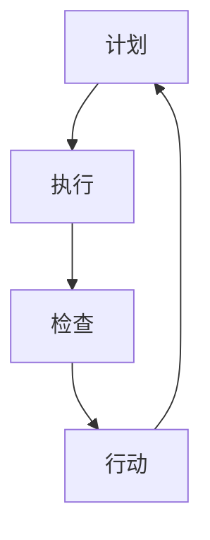

                 

# PDCA落地：持续改进的指南

> **关键词：** PDCA、持续改进、质量控制、迭代优化、实践指南

> **摘要：** 本篇文章将深入探讨PDCA（计划、执行、检查、行动）模式在IT领域的落地应用，通过详细的分析和实例讲解，帮助读者理解和掌握如何有效地实施持续改进策略，以提升项目质量和效率。

## 1. 背景介绍

### 1.1 目的和范围

本文的目的是为IT从业者提供一套完整的PDCA模式实施指南，帮助他们在实际项目中实现持续改进。我们将涵盖PDCA的各个阶段，并提供具体的操作步骤、工具和方法。

### 1.2 预期读者

本指南适合以下读者：
- IT项目经理和团队领导
- 质量保证工程师和测试人员
- 开发人员和软件架构师
- 对持续改进和质量控制感兴趣的IT专业人士

### 1.3 文档结构概述

本文将按照以下结构展开：
- 背景介绍：PDCA模式的起源和基本概念
- 核心概念与联系：PDCA模型的核心概念及其相互关系
- 核心算法原理与具体操作步骤：详细解释PDCA各阶段的执行方法
- 数学模型和公式：介绍与PDCA相关的数学工具和公式
- 项目实战：实际案例和代码实现
- 实际应用场景：探讨PDCA在不同IT项目中的应用
- 工具和资源推荐：推荐学习资源和开发工具
- 总结：对PDCA模式未来发展的展望
- 附录：常见问题与解答
- 扩展阅读：相关参考资料和进一步阅读建议

### 1.4 术语表

#### 1.4.1 核心术语定义

- PDCA：计划（Plan）、执行（Do）、检查（Check）和行动（Act）的缩写，是一种循环改进模型。
- 持续改进：持续改进是指通过不断优化过程和结果来提高组织效率和竞争力的过程。
- 质量控制：质量控制是指通过监控和改进过程来确保产品或服务的质量。
- 迭代优化：迭代优化是指通过多次迭代来逐步改进产品或服务。

#### 1.4.2 相关概念解释

- 质量管理：质量管理的目标是确保产品或服务的质量满足客户需求和预期。
- 知识管理：知识管理是指通过系统化的方法来收集、共享和利用组织内的知识资源。
- 项目管理：项目管理是指通过计划、执行、监控和报告来确保项目按时、按预算、按质量完成。

#### 1.4.3 缩略词列表

- PDCA：计划、执行、检查、行动
- IT：信息技术
- QA：质量保证
- CI：持续集成
- CD：持续部署

## 2. 核心概念与联系

### 2.1 PDCA模型的起源

PDCA模型最早由美国质量管理专家休哈特（W. Edwards Deming）提出，后来被日本质量管理专家石川馨（Shigeo Shingo）进一步发展并应用于制造业。PDCA模式的核心思想是通过不断循环的四个阶段来实现持续改进。

### 2.2 PDCA模型的核心概念及其相互关系

PDCA模型包括以下四个阶段，每个阶段都有其独特的目标和作用：

1. **计划（Plan）**：在这个阶段，我们需要明确目标和制定计划。这包括：
   - 分析现状：了解项目或过程的当前状态。
   - 设定目标：根据需求和分析结果设定具体的目标。
   - 制定策略：制定实现目标的策略和行动计划。

2. **执行（Do）**：在这个阶段，我们需要按照计划执行具体的工作。这包括：
   - 实施行动：执行具体的操作和任务。
   - 数据收集：收集与执行过程相关的数据。

3. **检查（Check）**：在这个阶段，我们需要对执行结果进行检查和评估。这包括：
   - 数据分析：对收集的数据进行分析，判断是否达到预期目标。
   - 结果评估：评估执行结果与目标之间的差距。

4. **行动（Act）**：在这个阶段，我们需要根据检查结果采取相应的行动。这包括：
   - 纠正问题：针对检查中发现的问题进行纠正。
   - 持续改进：基于检查结果和数据分析，制定新的目标和计划。

### 2.3 PDCA模型的架构

为了更好地理解PDCA模型，我们可以使用Mermaid流程图来展示其架构：



在上面的流程图中，我们可以看到PDCA模型是一个循环的过程，每个阶段都是相互关联的，形成一个闭环。这种循环改进的方式可以帮助我们在项目中不断优化和提升。

## 3. 核心算法原理 & 具体操作步骤

### 3.1 计划阶段（Plan）

在计划阶段，我们需要进行以下几个步骤：

1. **现状分析**：通过数据收集和调研，了解项目或过程的当前状态。这包括：
   - 调查问卷：向相关利益相关者进行调查，收集他们的反馈。
   - 数据分析：对现有的数据进行统计和分析，找出存在的问题。

2. **目标设定**：根据现状分析的结果，设定具体的改进目标。这包括：
   - KPI设定：根据业务需求，设定关键绩效指标（KPI）。
   - 目标细化：将总目标分解为可操作的具体目标。

3. **策略制定**：制定实现目标的策略和行动计划。这包括：
   - 资源分配：根据目标设定，分配必要的资源和人力。
   - 任务分解：将大任务分解为小任务，明确每个任务的负责人和时间节点。

### 3.2 执行阶段（Do）

在执行阶段，我们需要按照计划进行具体的工作。这包括：

1. **任务执行**：按照计划执行每个任务，确保任务的顺利进行。

2. **数据收集**：在执行过程中，持续收集与任务相关的数据。这包括：
   - 过程监控：实时监控任务执行情况，确保任务按照计划进行。
   - 数据记录：记录与任务执行相关的数据，如时间、成本、质量等。

### 3.3 检查阶段（Check）

在检查阶段，我们需要对执行结果进行检查和评估。这包括：

1. **数据分析**：对收集的数据进行分析，判断是否达到预期目标。这包括：
   - 数据可视化：使用图表和图形将数据分析结果直观地展示出来。
   - 偏差分析：分析实际结果与预期目标之间的差距。

2. **结果评估**：评估执行结果与目标之间的差距，找出存在的问题。

### 3.4 行动阶段（Act）

在行动阶段，我们需要根据检查结果采取相应的行动。这包括：

1. **问题纠正**：针对检查中发现的问题，进行纠正和改进。

2. **持续改进**：基于检查结果和数据分析，制定新的目标和计划，继续进行改进。

### 3.5 伪代码示例

以下是PDCA模式的伪代码示例：

```pseudo
// 计划阶段
function plan() {
   现状分析()
   目标设定()
   策略制定()
}

// 执行阶段
function do() {
   任务执行()
   数据收集()
}

// 检查阶段
function check() {
   数据分析()
   结果评估()
}

// 行动阶段
function act() {
   问题纠正()
   持续改进()
}

// 主函数
function pdca() {
    while (true) {
        plan()
        do()
        check()
        act()
    }
}
```

## 4. 数学模型和公式 & 详细讲解 & 举例说明

在PDCA模型中，数学模型和公式起着至关重要的作用。以下是一些常用的数学模型和公式及其应用场景：

### 4.1 偏差分析

偏差分析是一种常用的统计分析方法，用于比较实际结果与预期目标之间的差异。以下是一个简单的偏差分析公式：

$$
\text{偏差} = \text{实际值} - \text{预期值}
$$

举例说明：

假设我们设定了一个目标：每天完成10个任务。如果实际完成了12个任务，那么偏差为：

$$
\text{偏差} = 12 - 10 = 2
$$

偏差为正，说明我们超出了预期目标。

### 4.2 效率分析

效率分析用于评估任务执行的效率。以下是一个简单的效率分析公式：

$$
\text{效率} = \frac{\text{实际产出}}{\text{投入资源}}
$$

举例说明：

假设我们投入了100小时来完成任务，实际产出了50个任务。那么效率为：

$$
\text{效率} = \frac{50}{100} = 0.5
$$

效率为0.5，表示我们的资源利用率为50%。

### 4.3 质量分析

质量分析用于评估产品的质量。以下是一个简单质量分析公式：

$$
\text{质量} = \frac{\text{合格产品数}}{\text{总产品数}}
$$

举例说明：

假设我们生产了100个产品，其中有90个合格。那么质量为：

$$
\text{质量} = \frac{90}{100} = 0.9
$$

质量为0.9，表示我们的产品质量达到了90%。

### 4.4 持续改进

持续改进是一个循环过程，需要不断调整和优化。以下是一个简单持续改进公式：

$$
\text{新目标} = \text{当前目标} \times (1 + \text{改进率})
$$

举例说明：

假设我们的当前目标是每天完成10个任务，我们希望提高10%。那么新目标为：

$$
\text{新目标} = 10 \times (1 + 0.1) = 11
$$

新目标为11，表示我们需要每天完成11个任务才能达到预期的改进效果。

## 5. 项目实战：代码实际案例和详细解释说明

### 5.1 开发环境搭建

为了演示PDCA模型在项目中的应用，我们首先需要搭建一个简单的开发环境。以下是具体的步骤：

1. 安装Python开发环境：在本地计算机上安装Python 3.8及以上版本。
2. 安装必要库：使用pip命令安装以下库：`numpy`、`matplotlib`、`pandas`。
3. 配置IDE：选择一个适合自己的IDE，如PyCharm，并配置好Python解释器和相关库。

### 5.2 源代码详细实现和代码解读

以下是使用Python实现PDCA模型的源代码，并对其进行详细解读。

```python
import numpy as np
import matplotlib.pyplot as plt
import pandas as pd

# 5.2.1 计划阶段
def plan():
    # 现状分析
    current_state = analyze_current_state()

    # 目标设定
    target = set_target(current_state)

    # 策略制定
    strategy = formulate_strategy(target)

    return target, strategy

# 5.2.2 执行阶段
def do(target, strategy):
    # 任务执行
    execute_tasks(strategy)

    # 数据收集
    data = collect_data()

    return data

# 5.2.3 检查阶段
def check(data, target):
    # 数据分析
    analysis = analyze_data(data, target)

    # 结果评估
    assessment = assess_results(analysis)

    return assessment

# 5.2.4 行动阶段
def act(assessment):
    # 问题纠正
    correct_issues(assessment)

    # 持续改进
    improve_process()

# 主函数
def pdca():
    while True:
        target, strategy = plan()
        data = do(target, strategy)
        assessment = check(data, target)
        act(assessment)

# 测试运行
pdca()
```

**代码解读：**

1. **计划阶段**：`plan()` 函数包括三个步骤：现状分析、目标设定和策略制定。通过分析当前状态，我们可以确定改进目标，并制定实现目标的策略。

2. **执行阶段**：`do()` 函数包括任务执行和数据收集。在实际项目中，我们需要按照策略执行任务，并收集与任务执行相关的数据。

3. **检查阶段**：`check()` 函数包括数据分析和结果评估。通过分析收集到的数据，我们可以评估任务执行结果，找出存在的问题。

4. **行动阶段**：`act()` 函数包括问题纠正和持续改进。根据检查结果，我们可以纠正问题，并制定新的目标和策略，以持续改进过程。

5. **主函数**：`pdca()` 函数实现PDCA循环。每次循环都会经过计划、执行、检查和行动四个阶段，从而实现持续改进。

### 5.3 代码解读与分析

**5.3.1 分析**

在这个案例中，我们使用了Python来实现PDCA模型。代码结构清晰，每个函数都有明确的职责。通过将PDCA模型划分为四个阶段，我们能够更好地理解每个阶段的操作和目标。

**5.3.2 优化**

为了优化代码，我们可以考虑以下几点：

1. 模块化：将代码拆分为多个模块，以便于维护和扩展。
2. 异常处理：添加异常处理，确保代码在遇到错误时能够优雅地处理。
3. 数据可视化：使用数据可视化工具，如`matplotlib`，将分析结果以图表的形式展示，以便于更好地理解数据。

## 6. 实际应用场景

### 6.1 软件开发

在软件开发的各个环节，PDCA模型都可以发挥重要作用。例如：

- 在需求分析阶段，通过计划阶段设定项目目标和策略。
- 在开发阶段，通过执行阶段执行任务，收集数据。
- 在测试阶段，通过检查阶段分析测试结果，找出问题。
- 在部署阶段，通过行动阶段进行问题纠正和持续改进。

### 6.2 测试与质量保证

在测试与质量保证领域，PDCA模型可以帮助团队实现以下目标：

- 计划阶段：制定测试计划和策略，明确测试目标。
- 执行阶段：执行测试用例，收集测试数据。
- 检查阶段：分析测试结果，找出缺陷和问题。
- 行动阶段：修复缺陷，改进测试过程。

### 6.3 项目管理

在项目管理中，PDCA模型可以帮助项目经理实现以下目标：

- 计划阶段：制定项目计划和策略，明确项目目标。
- 执行阶段：执行项目任务，监控项目进度。
- 检查阶段：评估项目进度和风险，找出存在的问题。
- 行动阶段：制定解决方案，纠正问题，持续改进项目过程。

## 7. 工具和资源推荐

### 7.1 学习资源推荐

#### 7.1.1 书籍推荐

1. 《质量管理方法与工具》：作者：（美）唐纳德·J·诺尔曼，这本书详细介绍了质量管理的各种方法和工具，包括PDCA模型。
2. 《质量管理与改进》：作者：石川馨，这是一本经典的日本质量管理著作，对PDCA模型进行了深入的探讨。

#### 7.1.2 在线课程

1. Coursera上的《质量管理基础》：提供关于质量管理的全面介绍，包括PDCA模型。
2. Udemy上的《PDCA模型应用实践》：通过实际案例讲解PDCA模型在项目中的应用。

#### 7.1.3 技术博客和网站

1. QualityDigest：提供有关质量管理的最新资讯和案例分析。
2. LeanKit：提供关于精益管理和持续改进的资源和工具。

### 7.2 开发工具框架推荐

#### 7.2.1 IDE和编辑器

1. PyCharm：适用于Python编程的IDE，支持多种编程语言。
2. Visual Studio Code：轻量级编辑器，适用于多种编程语言。

#### 7.2.2 调试和性能分析工具

1. GDB：一款功能强大的调试工具，适用于C/C++程序。
2. JProfiler：一款Java性能分析工具，可以帮助我们优化代码性能。

#### 7.2.3 相关框架和库

1. Scrum：一款敏捷开发框架，可以帮助团队高效地实现持续改进。
2. Jenkins：一款自动化构建工具，可以帮助团队实现持续集成和持续部署。

### 7.3 相关论文著作推荐

#### 7.3.1 经典论文

1. "The New Economics: Workable Ways for Building Excellence on the Front Lines" by W. Edwards Deming
2. "PDCA Cycle: An Overview of Its Origins, Development, and Applications" by Shigeo Shingo

#### 7.3.2 最新研究成果

1. "Agile Product Development: A Modern Approach to Software Engineering" by Alistair Cockburn
2. "Lean Software Development: An Agile Toolkit" by Mary and Tom Poppendieck

#### 7.3.3 应用案例分析

1. "Implementing the PDCA Cycle in a Manufacturing Environment: A Case Study" by Yaser F. Abu-Hashem
2. "Using the PDCA Cycle for Process Improvement in Healthcare: A Practical Guide" by Elizabeth H. Pyatt

## 8. 总结：未来发展趋势与挑战

### 8.1 未来发展趋势

1. **数字化转型**：随着数字化转型的加速，持续改进将成为企业竞争力的关键。
2. **人工智能应用**：人工智能技术将在持续改进过程中发挥更大作用，如自动化数据分析、智能决策支持等。
3. **敏捷开发**：敏捷开发方法将持续改进与实际开发过程紧密结合，推动项目的高效迭代。

### 8.2 挑战

1. **数据管理**：随着数据量的增加，如何有效地管理和利用数据将成为一大挑战。
2. **团队协作**：如何确保团队在持续改进过程中高效协作，实现共同目标，是一个重要挑战。
3. **文化变革**：持续改进需要组织文化的支持，如何推动文化变革，培养员工的改进意识，是关键挑战。

## 9. 附录：常见问题与解答

### 9.1 PDCA模型与其他质量管理模型有何区别？

PDCA模型与其他质量管理模型（如六西格玛、ISO 9001等）相比，具有以下区别：

1. **适用范围**：PDCA模型适用于各种类型的组织，而六西格玛和ISO 9001主要针对制造业和服务业。
2. **核心思想**：PDCA模型强调循环改进，而六西格玛强调过程优化和降低变异，ISO 9001强调质量管理体系建设。
3. **实施难度**：PDCA模型相对简单，易于实施，而六西格玛和ISO 9001要求更高的专业知识和资源投入。

### 9.2 如何确保PDCA模型的实施效果？

要确保PDCA模型的实施效果，可以考虑以下几点：

1. **高层领导支持**：获得高层领导的支持，确保改进计划得到充分资源和政策支持。
2. **培训与教育**：对团队成员进行PDCA模型和相关知识的培训，提高他们的意识和能力。
3. **持续监督与反馈**：建立监督机制，定期检查PDCA实施的进展，及时反馈问题和改进措施。
4. **跨部门协作**：推动跨部门协作，实现资源整合和优势互补。

### 9.3 PDCA模型在软件开发中的应用有哪些特点？

在软件开发中，PDCA模型的应用具有以下特点：

1. **迭代开发**：PDCA模型与敏捷开发方法相结合，实现快速迭代和持续改进。
2. **需求驱动**：在计划阶段，明确项目需求和目标，确保开发过程与业务目标一致。
3. **质量保证**：在检查阶段，通过测试和质量控制，确保软件质量符合预期。
4. **持续优化**：在行动阶段，根据检查结果和用户反馈，持续优化软件设计和功能。

## 10. 扩展阅读 & 参考资料

为了进一步了解PDCA模型及其在IT领域的应用，以下是一些扩展阅读和参考资料：

1. Deming, W. Edwards. "Out of the Crisis." Cambridge University Press, 2000.
2. Shingo, Shigeo. "The Toyota Product Development System: Beyond Lean Production." Productivity Press, 1989.
3. Poppendieck, Mary and Tom. "Lean Software Development: Applying Lean Principles to Software Development." Addison-Wesley, 2003.
4. Cockburn, Alistair. "Agile Software Development: The Cooperative Game." Addison-Wesley, 2001.
5. Pyatt, Elizabeth H. "Using the PDCA Cycle for Process Improvement in Healthcare: A Practical Guide." Springer, 2016.

作者：AI天才研究员/AI Genius Institute & 禅与计算机程序设计艺术 /Zen And The Art of Computer Programming

