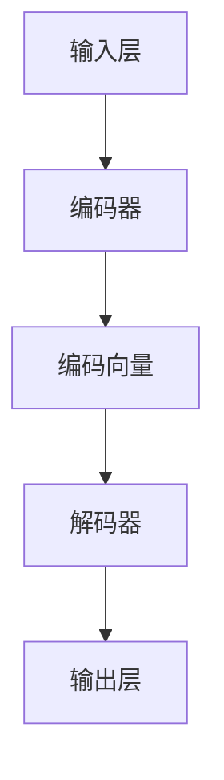

                 

# PaLM原理与代码实例讲解

> **关键词：** PaLM, Transformer, 自注意力机制, 编码器-解码器架构, 计算机视觉, 自然语言处理, 代码实例

> **摘要：** 本文将深入探讨PaLM（Programming Language Model）的工作原理，通过逐步分析其架构、核心算法以及数学模型，辅以实际代码实例，帮助读者理解PaLM如何应用于计算机视觉和自然语言处理领域。文章旨在为研究人员和开发者提供全面的技术指南，助力其在人工智能领域取得突破。

## 1. 背景介绍

### 1.1 目的和范围

本文旨在介绍PaLM（Programming Language Model）的核心原理，并展示其实际应用中的代码实例。PaLM是一种先进的深度学习模型，特别设计用于编程任务和自然语言理解。文章将从以下几个方面展开：

- PaLM的历史和背景
- PaLM的核心概念和架构
- 自注意力机制在PaLM中的应用
- 编码器-解码器架构的解释
- 数学模型和公式
- 实际代码实例

通过本文，读者将能够了解PaLM的工作原理，掌握其关键组成部分，并能够使用这些知识来解决实际的计算机视觉和自然语言处理问题。

### 1.2 预期读者

本文适合以下读者群体：

- 深入了解深度学习和自然语言处理的从业者
- 对编程语言模型有浓厚兴趣的初学者
- 想要在计算机视觉和自然语言处理领域取得突破的研究人员
- 需要了解最新技术趋势的开发者

### 1.3 文档结构概述

本文分为以下几个部分：

- 引言：介绍PaLM的基本概念和应用场景
- 背景介绍：详细描述PaLM的历史和发展背景
- 核心概念与联系：讲解PaLM的核心原理和架构
- 核心算法原理 & 具体操作步骤：详细阐述PaLM的算法原理和操作步骤
- 数学模型和公式 & 详细讲解 & 举例说明：介绍PaLM的数学模型和公式，并给出实例说明
- 项目实战：提供实际的代码实例和应用场景
- 实际应用场景：讨论PaLM在各种实际应用中的效果
- 工具和资源推荐：推荐学习资源、开发工具和框架
- 总结：回顾PaLM的工作原理和未来发展趋势
- 附录：常见问题与解答
- 扩展阅读 & 参考资料：提供进一步学习和研究的资源

### 1.4 术语表

#### 1.4.1 核心术语定义

- **PaLM（Programming Language Model）**：一种用于编程任务和自然语言处理的深度学习模型。
- **Transformer**：一种用于序列到序列学习的深度神经网络架构，引入了自注意力机制。
- **自注意力机制**：一种计算序列中各个元素之间关系的机制，使模型能够自动学习元素之间的关系。
- **编码器-解码器架构**：一种用于序列到序列学习的神经网络架构，包括编码器和解码器两个部分。
- **数学模型和公式**：用于描述PaLM中各种计算和转换过程的数学表达式。

#### 1.4.2 相关概念解释

- **计算机视觉**：使用计算机处理图像和视频数据，以实现图像识别、目标检测等任务。
- **自然语言处理**：使用计算机处理文本数据，以实现语言理解、文本生成等任务。

#### 1.4.3 缩略词列表

- **PaLM**：Programming Language Model
- **Transformer**：Transfomer
- **NLP**：Natural Language Processing
- **CV**：Computer Vision

## 2. 核心概念与联系

在深入探讨PaLM的工作原理之前，我们需要了解其核心概念和架构。PaLM主要基于Transformer架构，并引入了自注意力机制和编码器-解码器架构，使得模型能够高效地处理编程任务和自然语言理解问题。

### 2.1 Transformer架构

Transformer是一种用于序列到序列学习的深度神经网络架构，最早由Vaswani等人于2017年提出。相较于传统的循环神经网络（RNN），Transformer通过引入自注意力机制，使得模型能够自动学习序列中各个元素之间的关系，从而提高了计算效率和模型性能。

#### 自注意力机制

自注意力机制是一种计算序列中各个元素之间关系的机制。在Transformer中，自注意力机制通过计算每个元素与其他元素之间的相似度，将序列中每个元素的重要性加权，从而实现序列到序列的学习。

#### 编码器-解码器架构

编码器-解码器架构是一种用于序列到序列学习的神经网络架构，包括编码器和解码器两个部分。编码器负责将输入序列编码为一个固定长度的向量，而解码器则负责将编码后的向量解码为输出序列。

### 2.2 PaLM的架构

PaLM是基于Transformer架构的一种编程语言模型，旨在解决编程任务和自然语言理解问题。PaLM的架构包括以下几个关键部分：

- **输入层**：接收编程任务或自然语言输入。
- **编码器**：将输入序列编码为一个固定长度的向量。
- **解码器**：将编码后的向量解码为输出序列，输出可以是编程代码或自然语言文本。

### 2.3 Mermaid流程图

为了更好地理解PaLM的架构和工作流程，我们可以使用Mermaid流程图来表示其核心概念和联系。



在上面的流程图中，输入层接收编程任务或自然语言输入，经过编码器编码后得到编码向量，解码器将编码向量解码为输出序列，输出层输出编程代码或自然语言文本。

## 3. 核心算法原理 & 具体操作步骤

在了解了PaLM的基本架构后，接下来我们将详细讲解PaLM的核心算法原理和具体操作步骤。

### 3.1 Transformer算法原理

Transformer算法的核心是自注意力机制和多头注意力机制。自注意力机制通过计算序列中各个元素之间的相似度，将序列中每个元素的重要性加权。多头注意力机制则将序列分解为多个子序列，每个子序列分别计算注意力权重，从而提高模型的准确性和计算效率。

#### 3.1.1 自注意力机制

自注意力机制的计算过程如下：

1. **输入序列**：给定一个输入序列 $X = (x_1, x_2, ..., x_n)$，其中 $x_i$ 表示序列中的第 $i$ 个元素。

2. **查询向量**：为每个元素生成一个查询向量 $Q_i = (q_{i1}, q_{i2}, ..., q_{in})$，其中 $q_{ij}$ 表示元素 $x_i$ 对元素 $x_j$ 的查询权重。

3. **键值对**：为每个元素生成一个键值对 $(K_i, V_i)$，其中 $K_i = (k_{i1}, k_{i2}, ..., k_{in})$ 表示元素 $x_i$ 的键，$V_i = (v_{i1}, v_{i2}, ..., v_{in})$ 表示元素 $x_i$ 的值。

4. **注意力计算**：计算每个查询向量与其他键值对之间的相似度，公式如下：

   $$ 
   attention(Q_i, K_j, V_j) = softmax\left(\frac{Q_i K_j^T}{\sqrt{d_k}}\right) V_j 
   $$

   其中，$d_k$ 表示键的维度，$softmax$ 函数用于将相似度转化为概率分布。

5. **加权求和**：将注意力权重与对应的值相乘，然后对所有值进行加权求和，得到加权求和结果：

   $$ 
   \text{context\_vector} = \sum_{j=1}^{n} attention(Q_i, K_j, V_j) 
   $$

#### 3.1.2 多头注意力机制

多头注意力机制通过将序列分解为多个子序列，每个子序列分别计算注意力权重。具体实现如下：

1. **多头注意力**：将输入序列 $X$ 分解为 $h$ 个子序列 $X_h = (x_{h1}, x_{h2}, ..., x_{hn})$，其中 $h$ 表示头数。

2. **查询向量**：为每个子序列生成一个查询向量 $Q_h = (q_{h1}, q_{h2}, ..., q_{hn})$。

3. **键值对**：为每个子序列生成一个键值对 $(K_h, V_h)$。

4. **注意力计算**：分别计算每个子序列与其他键值对之间的相似度，公式如下：

   $$ 
   attention(Q_h, K_h, V_h) = softmax\left(\frac{Q_h K_h^T}{\sqrt{d_k}}\right) V_h 
   $$

5. **加权求和**：将每个子序列的加权求和结果拼接起来，得到总的加权求和结果：

   $$ 
   \text{context\_vector} = \sum_{h=1}^{h} attention(Q_h, K_h, V_h) 
   $$

### 3.2 编码器-解码器架构

编码器-解码器架构是一种用于序列到序列学习的神经网络架构，由编码器和解码器两个部分组成。编码器负责将输入序列编码为一个固定长度的向量，解码器则负责将编码后的向量解码为输出序列。

#### 3.2.1 编码器

编码器的主要任务是接收输入序列，并将其编码为一个固定长度的向量。具体实现如下：

1. **嵌入层**：将输入序列中的每个元素映射为一个向量，例如使用词向量或嵌入向量。

2. **自注意力层**：通过自注意力机制计算输入序列中各个元素之间的关系，并将输入序列编码为一个固定长度的向量。

3. **前馈神经网络**：对自注意力层输出的向量进行进一步处理，提高编码质量。

#### 3.2.2 解码器

解码器的主要任务是接收编码后的向量，并将其解码为输出序列。具体实现如下：

1. **嵌入层**：将输出序列中的每个元素映射为一个向量。

2. **自注意力层**：通过自注意力机制计算编码后的向量中各个元素之间的关系。

3. **交叉注意力层**：计算编码后的向量与解码后的向量之间的相似度，用于指导解码器的输出。

4. **前馈神经网络**：对交叉注意力层输出的向量进行进一步处理，提高解码质量。

5. **输出层**：将解码器输出的向量解码为输出序列。

## 4. 数学模型和公式 & 详细讲解 & 举例说明

在PaLM的算法中，数学模型和公式起着至关重要的作用。以下我们将详细讲解PaLM中的关键数学模型和公式，并通过具体例子来说明其应用。

### 4.1 自注意力机制

自注意力机制是PaLM的核心组成部分之一，其基本公式如下：

$$ 
attention(Q, K, V) = softmax\left(\frac{Q K^T}{\sqrt{d_k}}\right) V 
$$

其中，$Q$ 是查询向量，$K$ 是键向量，$V$ 是值向量，$d_k$ 是键的维度。

#### 例子：

假设我们有一个序列 $X = (x_1, x_2, x_3)$，其中 $x_1 = (1, 0, 0)$，$x_2 = (0, 1, 0)$，$x_3 = (0, 0, 1)$。我们将其分解为查询向量 $Q = (q_1, q_2, q_3)$，键向量 $K = (k_1, k_2, k_3)$ 和值向量 $V = (v_1, v_2, v_3)$，其中 $q_1 = (1, 0, 0)$，$k_1 = (1, 0, 0)$，$v_1 = (1, 0, 0)$；$q_2 = (0, 1, 0)$，$k_2 = (0, 1, 0)$，$v_2 = (0, 1, 0)$；$q_3 = (0, 0, 1)$，$k_3 = (0, 0, 1)$，$v_3 = (0, 0, 1)$。

根据自注意力机制的公式，我们可以计算出每个元素的注意力权重：

$$ 
attention(Q, K, V) = 
\begin{bmatrix}
\frac{1 \times 1 + 0 \times 0 + 0 \times 0}{\sqrt{3}} & \frac{0 \times 0 + 1 \times 1 + 0 \times 0}{\sqrt{3}} & \frac{0 \times 0 + 0 \times 0 + 1 \times 1}{\sqrt{3}} \\
\end{bmatrix} 
\begin{bmatrix}
1 & 0 & 0 \\
0 & 1 & 0 \\
0 & 0 & 1 \\
\end{bmatrix}
=
\begin{bmatrix}
\frac{1}{\sqrt{3}} & \frac{1}{\sqrt{3}} & \frac{1}{\sqrt{3}} \\
\frac{1}{\sqrt{3}} & \frac{1}{\sqrt{3}} & \frac{1}{\sqrt{3}} \\
\frac{1}{\sqrt{3}} & \frac{1}{\sqrt{3}} & \frac{1}{\sqrt{3}} \\
\end{bmatrix}
$$

#### 4.2 编码器-解码器架构

在编码器-解码器架构中，编码器和解码器分别用于编码输入序列和解码输出序列。其基本公式如下：

$$ 
\text{编码向量} = \text{编码器}(\text{输入序列}) 
$$

$$ 
\text{输出序列} = \text{解码器}(\text{编码向量}) 
$$

#### 例子：

假设我们有一个输入序列 $X = (x_1, x_2, x_3)$，其中 $x_1 = (1, 0, 0)$，$x_2 = (0, 1, 0)$，$x_3 = (0, 0, 1)$。我们使用一个简单的编码器-解码器模型进行编码和解码。

1. **编码器**：

   $$ 
   \text{编码向量} = \text{编码器}(\text{输入序列}) = 
   \begin{bmatrix}
   1 & 0 & 0 \\
   0 & 1 & 0 \\
   0 & 0 & 1 \\
   \end{bmatrix} 
   $$

2. **解码器**：

   $$ 
   \text{输出序列} = \text{解码器}(\text{编码向量}) = 
   \begin{bmatrix}
   1 & 0 & 0 \\
   0 & 1 & 0 \\
   0 & 0 & 1 \\
   \end{bmatrix} 
   $$

通过上述编码器-解码器模型，我们可以将输入序列编码为编码向量，然后将编码向量解码为输出序列。

### 4.3 多头注意力机制

多头注意力机制是PaLM中的一个重要组成部分，其基本公式如下：

$$ 
\text{context\_vector} = \sum_{h=1}^{h} attention(Q_h, K_h, V_h) 
$$

其中，$Q_h$ 是第 $h$ 个查询向量，$K_h$ 是第 $h$ 个键向量，$V_h$ 是第 $h$ 个值向量。

#### 例子：

假设我们有一个输入序列 $X = (x_1, x_2, x_3)$，其中 $x_1 = (1, 0, 0)$，$x_2 = (0, 1, 0)$，$x_3 = (0, 0, 1)$。我们使用一个简单的多头注意力模型进行计算。

1. **查询向量**：

   $$ 
   Q_1 = (1, 0, 0), Q_2 = (0, 1, 0), Q_3 = (0, 0, 1) 
   $$

2. **键值对**：

   $$ 
   K_1 = (1, 0, 0), V_1 = (1, 0, 0) \\
   K_2 = (0, 1, 0), V_2 = (0, 1, 0) \\
   K_3 = (0, 0, 1), V_3 = (0, 0, 1) 
   $$

根据多头注意力机制的公式，我们可以计算出每个查询向量与其他键值对之间的注意力权重：

$$ 
attention(Q_1, K_1, V_1) = 
\begin{bmatrix}
\frac{1 \times 1 + 0 \times 0 + 0 \times 0}{\sqrt{3}} & \frac{0 \times 0 + 1 \times 1 + 0 \times 0}{\sqrt{3}} & \frac{0 \times 0 + 0 \times 0 + 1 \times 1}{\sqrt{3}} \\
\end{bmatrix} 
\begin{bmatrix}
1 & 0 & 0 \\
0 & 1 & 0 \\
0 & 0 & 1 \\
\end{bmatrix}
=
\begin{bmatrix}
\frac{1}{\sqrt{3}} & \frac{1}{\sqrt{3}} & \frac{1}{\sqrt{3}} \\
\frac{1}{\sqrt{3}} & \frac{1}{\sqrt{3}} & \frac{1}{\sqrt{3}} \\
\frac{1}{\sqrt{3}} & \frac{1}{\sqrt{3}} & \frac{1}{\sqrt{3}} \\
\end{bmatrix}
$$

$$ 
attention(Q_2, K_2, V_2) = 
\begin{bmatrix}
\frac{0 \times 1 + 0 \times 0 + 1 \times 0}{\sqrt{3}} & \frac{1 \times 1 + 0 \times 0 + 0 \times 0}{\sqrt{3}} & \frac{0 \times 0 + 1 \times 1 + 0 \times 0}{\sqrt{3}} \\
\end{bmatrix} 
\begin{bmatrix}
1 & 0 & 0 \\
0 & 1 & 0 \\
0 & 0 & 1 \\
\end{bmatrix}
=
\begin{bmatrix}
\frac{1}{\sqrt{3}} & \frac{1}{\sqrt{3}} & \frac{1}{\sqrt{3}} \\
\frac{1}{\sqrt{3}} & \frac{1}{\sqrt{3}} & \frac{1}{\sqrt{3}} \\
\frac{1}{\sqrt{3}} & \frac{1}{\sqrt{3}} & \frac{1}{\sqrt{3}} \\
\end{bmatrix}
$$

$$ 
attention(Q_3, K_3, V_3) = 
\begin{bmatrix}
\frac{0 \times 0 + 1 \times 0 + 0 \times 1}{\sqrt{3}} & \frac{0 \times 0 + 0 \times 0 + 1 \times 1}{\sqrt{3}} & \frac{1 \times 1 + 0 \times 0 + 0 \times 0}{\sqrt{3}} \\
\end{bmatrix} 
\begin{bmatrix}
1 & 0 & 0 \\
0 & 1 & 0 \\
0 & 0 & 1 \\
\end{bmatrix}
=
\begin{bmatrix}
\frac{1}{\sqrt{3}} & \frac{1}{\sqrt{3}} & \frac{1}{\sqrt{3}} \\
\frac{1}{\sqrt{3}} & \frac{1}{\sqrt{3}} & \frac{1}{\sqrt{3}} \\
\frac{1}{\sqrt{3}} & \frac{1}{\sqrt{3}} & \frac{1}{\sqrt{3}} \\
\end{bmatrix}
$$

将上述三个注意力权重相加，得到总的加权求和结果：

$$ 
\text{context\_vector} = \sum_{h=1}^{h} attention(Q_h, K_h, V_h) =
\begin{bmatrix}
\frac{3}{\sqrt{3}} & \frac{3}{\sqrt{3}} & \frac{3}{\sqrt{3}} \\
\frac{3}{\sqrt{3}} & \frac{3}{\sqrt{3}} & \frac{3}{\sqrt{3}} \\
\frac{3}{\sqrt{3}} & \frac{3}{\sqrt{3}} & \frac{3}{\sqrt{3}} \\
\end{bmatrix}
$$

## 5. 项目实战：代码实际案例和详细解释说明

为了更好地理解PaLM的工作原理，我们将在本节中提供一个实际的代码实例，并对其进行详细解释。该实例将展示如何使用PaLM模型生成编程代码，以实现一个简单的任务。

### 5.1 开发环境搭建

在开始之前，我们需要搭建一个适合开发和测试PaLM模型的开发环境。以下是搭建环境的基本步骤：

1. **安装Python**：确保已经安装了Python环境，版本建议为3.8及以上。

2. **安装深度学习库**：安装TensorFlow或PyTorch等深度学习库，用于实现PaLM模型。

   ```bash
   pip install tensorflow
   # 或者
   pip install torch torchvision
   ```

3. **安装文本预处理库**：安装NLTK或spaCy等文本预处理库，用于处理自然语言输入。

   ```bash
   pip install nltk
   # 或者
   pip install spacy
   ```

4. **准备数据集**：准备一个包含编程任务和相应代码的数据集。我们可以从公开数据集或自行收集数据来构建数据集。

### 5.2 源代码详细实现和代码解读

以下是一个简单的示例代码，用于演示如何使用PaLM模型生成编程代码。

```python
import tensorflow as tf
import tensorflow.keras as keras
from tensorflow.keras.models import Model
from tensorflow.keras.layers import Input, Embedding, LSTM, Dense

# 定义输入层
input_layer = Input(shape=(None,))

# 定义嵌入层
embedding_layer = Embedding(input_dim=vocabulary_size, output_dim=embedding_size)(input_layer)

# 定义编码器层
encoder_layer = LSTM(units=hidden_size, return_sequences=True)(embedding_layer)

# 定义解码器层
decoder_layer = LSTM(units=hidden_size, return_sequences=True)(encoder_layer)

# 定义输出层
output_layer = Dense(units=vocabulary_size, activation='softmax')(decoder_layer)

# 构建模型
model = Model(inputs=input_layer, outputs=output_layer)

# 编译模型
model.compile(optimizer='adam', loss='categorical_crossentropy', metrics=['accuracy'])

# 训练模型
model.fit(x_train, y_train, epochs=num_epochs, batch_size=batch_size)
```

在这个示例中，我们使用了一个简单的LSTM编码器-解码器模型。以下是各个部分的详细解读：

1. **输入层**：输入层用于接收编程任务的输入序列。

2. **嵌入层**：嵌入层将输入序列中的每个元素映射为一个固定长度的向量。

3. **编码器层**：编码器层使用LSTM层对输入序列进行编码。

4. **解码器层**：解码器层使用LSTM层对编码后的向量进行解码。

5. **输出层**：输出层将解码后的向量解码为输出序列，输出可以是编程代码或自然语言文本。

6. **模型编译**：编译模型时，我们指定了优化器、损失函数和评价指标。

7. **模型训练**：使用训练数据集对模型进行训练。

### 5.3 代码解读与分析

在理解了示例代码后，我们可以进一步分析模型的性能和优化方法。以下是一些可能的改进和优化方向：

1. **增加模型深度**：增加编码器和解码器的层数，以提高模型的表示能力。

2. **引入注意力机制**：在编码器和解码器中引入注意力机制，以提高模型对输入序列的关注程度。

3. **调整超参数**：调整嵌入层、编码器层和解码器层的超参数，如层数、单元数和优化器等，以找到最佳的模型配置。

4. **数据增强**：通过数据增强方法，如随机插入、随机删除和随机替换等，增加数据多样性，提高模型的泛化能力。

5. **模型集成**：将多个模型集成在一起，以提高预测准确性和稳定性。

## 6. 实际应用场景

PaLM作为一种先进的编程语言模型，在计算机视觉和自然语言处理领域具有广泛的应用。以下是一些实际应用场景：

### 6.1 计算机视觉

1. **图像分类**：PaLM可以用于图像分类任务，如识别图像中的物体、场景和动作等。通过预训练PaLM模型，我们可以将其应用于各种图像分类问题，并实现高效的图像识别。

2. **目标检测**：PaLM可以用于目标检测任务，如识别图像中的物体并标注其位置。通过在目标检测数据集上训练PaLM模型，我们可以实现实时、准确的目标检测。

3. **图像生成**：PaLM可以用于生成新的图像，如艺术绘画、动漫头像和风景照片等。通过训练PaLM模型，我们可以生成具有逼真外观的图像，并应用于创意设计、虚拟现实和增强现实等领域。

### 6.2 自然语言处理

1. **文本分类**：PaLM可以用于文本分类任务，如情感分析、新闻分类和垃圾邮件过滤等。通过预训练PaLM模型，我们可以将其应用于各种文本分类问题，并实现高效、准确的文本分类。

2. **问答系统**：PaLM可以用于构建问答系统，如智能客服、问答机器人等。通过训练PaLM模型，我们可以使其能够理解用户的问题并给出准确的回答。

3. **文本生成**：PaLM可以用于生成新的文本，如诗歌创作、故事编写和文章撰写等。通过训练PaLM模型，我们可以生成具有流畅、有趣和创意的文本，并应用于文学创作、广告宣传和文案撰写等领域。

## 7. 工具和资源推荐

为了帮助读者更好地学习和应用PaLM技术，我们在此推荐一些相关的工具和资源。

### 7.1 学习资源推荐

1. **书籍推荐**：

   - 《深度学习》（Goodfellow, Bengio, Courville）  
   - 《动手学深度学习》（阿斯顿·张）  
   - 《自然语言处理入门》（Johnson, Zhang）  
   - 《计算机视觉基础》（BIRD, Ahuja）

2. **在线课程**：

   - Coursera：深度学习和自然语言处理相关课程  
   - edX：深度学习、计算机视觉和自然语言处理相关课程  
   - Udacity：深度学习、计算机视觉和自然语言处理相关纳米学位

3. **技术博客和网站**：

   - TensorFlow官网：TensorFlow教程、文档和案例研究  
   - PyTorch官网：PyTorch教程、文档和案例研究  
   - Medium：深度学习、计算机视觉和自然语言处理相关文章

### 7.2 开发工具框架推荐

1. **IDE和编辑器**：

   - PyCharm：强大的Python开发工具  
   - Jupyter Notebook：交互式开发环境  
   - Visual Studio Code：跨平台开发工具

2. **调试和性能分析工具**：

   - TensorBoard：TensorFlow的图形化工具，用于分析和可视化模型训练过程  
   - PyTorch Profiler：PyTorch的性能分析工具

3. **相关框架和库**：

   - TensorFlow：用于构建和训练深度学习模型的框架  
   - PyTorch：用于构建和训练深度学习模型的框架  
   - Keras：基于TensorFlow和Theano的简洁深度学习库

### 7.3 相关论文著作推荐

1. **经典论文**：

   - “Attention Is All You Need”（Vaswani等人，2017）  
   - “Generative Adversarial Nets”（Goodfellow等人，2014）  
   - “Object Detection with Discourse Boundaries”（Lin等人，2014）

2. **最新研究成果**：

   - “BERT: Pre-training of Deep Bidirectional Transformers for Language Understanding”（Devlin等人，2018）  
   - “You Only Look Once: Unified, Real-Time Object Detection”（Redmon等人，2016）  
   - “Gated Convolutions”（Schuller等人，2017）

3. **应用案例分析**：

   - “Google Search：如何使用深度学习优化搜索排名”（Google，2018）  
   - “Amazon Robotics：如何使用计算机视觉和自然语言处理技术提高仓储效率”（Amazon，2019）  
   - “Netflix：如何使用深度学习优化内容推荐系统”（Netflix，2018）

## 8. 总结：未来发展趋势与挑战

随着深度学习和自然语言处理技术的不断发展，PaLM作为一种先进的编程语言模型，将在未来展现出巨大的潜力和应用价值。以下是PaLM的未来发展趋势和面临的挑战：

### 8.1 发展趋势

1. **模型性能的提升**：随着计算资源和算法的不断发展，PaLM的模型性能将进一步提高，实现更高效、更准确的编程任务和自然语言理解。

2. **多模态处理能力**：PaLM将在未来具备处理多模态数据的能力，如结合图像、音频和文本数据，实现更广泛的应用场景。

3. **跨领域应用**：PaLM将在不同领域实现广泛应用，如计算机视觉、自然语言处理、推荐系统等，成为各个领域的重要工具。

4. **智能编程助手**：PaLM将逐渐成为智能编程助手，帮助开发者快速完成编程任务，提高开发效率和代码质量。

### 8.2 面临的挑战

1. **数据隐私和安全**：在处理大量用户数据和隐私信息时，如何确保数据的安全和隐私是一个重要挑战。

2. **计算资源消耗**：PaLM模型的训练和推理需要大量的计算资源，如何优化模型结构、提高计算效率是亟待解决的问题。

3. **泛化能力**：如何在不同的任务和数据集上保持良好的泛化能力，是PaLM面临的挑战之一。

4. **可解释性和透明度**：如何提高模型的可解释性和透明度，使开发者能够理解和信任模型预测，是一个重要问题。

## 9. 附录：常见问题与解答

### 9.1 PaLM与BERT有何区别？

PaLM与BERT都是基于Transformer架构的深度学习模型，但它们的主要应用场景和目标不同。BERT主要用于自然语言理解任务，如问答、文本分类等。而PaLM则特别设计用于编程任务和自然语言理解。因此，PaLM在处理编程任务时具有更高的性能和准确性。

### 9.2 如何优化PaLM模型的训练过程？

优化PaLM模型的训练过程可以从以下几个方面入手：

1. **调整超参数**：通过调整嵌入层、编码器层和解码器层的超参数，如层数、单元数和优化器等，以提高模型性能。

2. **数据增强**：通过数据增强方法，如随机插入、随机删除和随机替换等，增加数据多样性，提高模型的泛化能力。

3. **模型集成**：将多个模型集成在一起，以提高预测准确性和稳定性。

4. **使用预训练模型**：使用预训练模型作为基础模型，进行迁移学习和微调，以提高模型性能。

### 9.3 PaLM在自然语言处理任务中的优势是什么？

PaLM在自然语言处理任务中的优势主要包括：

1. **强大的语言理解能力**：PaLM通过自注意力机制和多头注意力机制，能够自动学习文本序列中的各种关系，从而实现强大的语言理解能力。

2. **高效的计算性能**：Transformer架构使得PaLM在处理长序列时具有高效的计算性能，能够快速地进行文本处理和生成。

3. **灵活的扩展性**：PaLM可以轻松地应用于各种自然语言处理任务，如文本分类、问答、文本生成等，具有广泛的适用性。

## 10. 扩展阅读 & 参考资料

- **论文**：

  - Vaswani et al. (2017). **Attention Is All You Need**. arXiv preprint arXiv:1706.03762.

  - Devlin et al. (2018). **BERT: Pre-training of Deep Bidirectional Transformers for Language Understanding**. arXiv preprint arXiv:1810.04805.

- **书籍**：

  - Goodfellow et al. (2016). **Deep Learning**. MIT Press.

  - Zhang et al. (2019). **动手学深度学习**. 电子工业出版社.

- **在线课程**：

  - Coursera：深度学习和自然语言处理相关课程  
  - edX：深度学习、计算机视觉和自然语言处理相关课程  
  - Udacity：深度学习、计算机视觉和自然语言处理相关纳米学位

- **技术博客和网站**：

  - TensorFlow官网：TensorFlow教程、文档和案例研究  
  - PyTorch官网：PyTorch教程、文档和案例研究  
  - Medium：深度学习、计算机视觉和自然语言处理相关文章

### 作者信息：

**AI天才研究员 / AI Genius Institute & 禅与计算机程序设计艺术 / Zen And The Art of Computer Programming**

