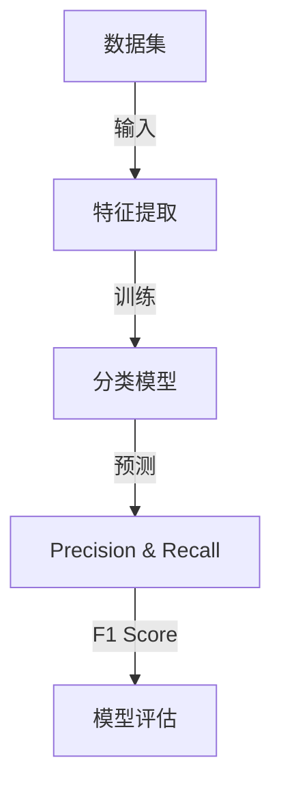

                 


# Precision 原理与代码实战案例讲解

> **关键词：Precision，算法原理，代码实战，数学模型，应用场景**
>
> **摘要：本文将深入探讨Precision（准确率）这一核心概念在机器学习和数据科学中的原理和应用。通过具体的算法原理讲解、代码实战案例和数学模型剖析，帮助读者理解Precision的重要性以及如何在实际项目中应用这一概念。**

## 1. 背景介绍

### 1.1 目的和范围

本文旨在为机器学习和数据科学领域的研究者、开发者以及从业者提供一份详尽的Precision原理与代码实战指南。我们不仅会介绍Precision的基本概念，还会深入探讨其在实际项目中的应用，并通过代码实战案例展示如何实现和提高Precision。

### 1.2 预期读者

- 对机器学习有基础了解的开发者
- 数据科学家和AI研究者
- 对算法原理和实践感兴趣的程序员
- 想要提升模型Precision的项目管理者

### 1.3 文档结构概述

本文结构如下：

1. **背景介绍**：解释Precision的重要性，为后续内容做铺垫。
2. **核心概念与联系**：通过流程图展示Precision相关的核心概念和架构。
3. **核心算法原理 & 具体操作步骤**：详细讲解Precision算法原理，使用伪代码阐述。
4. **数学模型和公式 & 详细讲解 & 举例说明**：阐述Precision相关的数学模型，并提供实例说明。
5. **项目实战：代码实际案例和详细解释说明**：提供实战案例，解析代码实现。
6. **实际应用场景**：探讨Precision在不同领域的应用。
7. **工具和资源推荐**：推荐学习资源、开发工具和论文著作。
8. **总结：未来发展趋势与挑战**：总结当前的发展趋势和未来的挑战。
9. **附录：常见问题与解答**：解答读者可能遇到的问题。
10. **扩展阅读 & 参考资料**：提供进一步学习的资源。

### 1.4 术语表

#### 1.4.1 核心术语定义

- **Precision**：准确率，指在预测中真正为正类的样本占所有预测为正类的样本的比例。
- **Recall**：召回率，指在预测中真正为正类的样本占所有实际为正类的样本的比例。
- **F1 Score**：调和平均，是Precision和Recall的加权平均，用于综合评估模型的性能。

#### 1.4.2 相关概念解释

- **分类问题**：在机器学习中，将数据分为不同类别的问题。
- **预测模型**：使用历史数据训练出的模型，用于对未知数据进行分类。

#### 1.4.3 缩略词列表

- **ML**：Machine Learning，机器学习
- **AI**：Artificial Intelligence，人工智能
- **ROC**：Receiver Operating Characteristic，接受者操作特征

## 2. 核心概念与联系

在深入探讨Precision之前，我们需要了解与之相关的核心概念和架构。下面是一个Mermaid流程图，展示Precision相关的概念和它们之间的联系。



在这个流程图中，数据集首先经过特征提取，然后训练一个分类模型。模型用于对新的数据进行预测，从而得到Precision和Recall。这两个指标随后用于计算F1 Score，以评估模型的总体性能。

### 2.1 Precision的定义与计算

Precision是指预测为正类别的样本中，真正属于正类别的比例。其计算公式如下：

$$
Precision = \frac{TP}{TP + FP}
$$

其中，TP（True Positive）表示真正属于正类别的样本，FP（False Positive）表示错误地预测为正类别的样本。

### 2.2 Recall的定义与计算

Recall是指所有真正属于正类别的样本中，被正确预测为正类别的比例。其计算公式如下：

$$
Recall = \frac{TP}{TP + FN}
$$

其中，FN（False Negative）表示错误地预测为负类别的真正正类样本。

### 2.3 F1 Score的定义与计算

F1 Score是Precision和Recall的加权平均，用于综合评估模型的性能。其计算公式如下：

$$
F1 Score = 2 \times \frac{Precision \times Recall}{Precision + Recall}
$$

通过F1 Score，我们可以得到一个更全面的模型性能评估，因为它同时考虑了Precision和Recall。

## 3. 核心算法原理 & 具体操作步骤

在了解了Precision的基本概念之后，我们需要深入探讨其算法原理，并使用伪代码详细阐述具体的操作步骤。

### 3.1 分类算法原理

分类算法的核心目标是将数据集中的每个样本正确地分配到预定义的类别中。常见的分类算法包括K-最近邻（K-NN）、逻辑回归、支持向量机（SVM）等。

下面是K-NN算法的伪代码，用于说明分类的基本步骤：

```plaintext
算法：K-最近邻（K-NN）

输入：训练数据集D，测试数据集T，K（邻居数量）

输出：预测结果

步骤：
1. 对于测试集中的每个样本x：
   1. 计算x与训练数据集中每个样本y的距离，距离可以是欧氏距离、曼哈顿距离等。
   2. 选择距离最小的K个邻居。
   3. 根据这K个邻居的类别，使用投票法确定x的类别。
2. 返回所有测试样本的预测结果。
```

### 3.2 Precision的计算步骤

下面是计算Precision的伪代码：

```plaintext
算法：计算Precision

输入：预测结果P，实际标签L

输出：Precision

步骤：
1. 初始化True Positive（TP）和False Positive（FP）为0。
2. 对于P和L中的每个样本：
   1. 如果P和L都为正类别，则TP增加1。
   2. 如果P为正类别而L为负类别，则FP增加1。
3. 计算Precision：Precision = TP / (TP + FP)。
4. 返回Precision。
```

通过这些步骤，我们可以计算出模型在特定数据集上的Precision值，从而评估其分类性能。

## 4. 数学模型和公式 & 详细讲解 & 举例说明

Precision作为机器学习和数据科学中的核心指标，其计算依赖于一些基础的数学模型和公式。下面将详细解释这些模型和公式，并通过实例说明它们的应用。

### 4.1 精度（Precision）的数学模型

精度（Precision）的数学模型可以表示为：

$$
Precision = \frac{TP}{TP + FP}
$$

其中，TP（True Positive）表示真正属于正类别的样本数，FP（False Positive）表示错误地预测为正类别的样本数。

### 4.2 精度公式的解释

- **分子（TP）**：表示模型正确识别为正类别的实际正样本数量。
- **分母（TP + FP）**：表示模型预测为正类别的总样本数量，包括实际正样本和错误预测为正的样本。

因此，精度反映了模型在预测为正类别的样本中，实际为正类别的比例。一个高的精度值意味着模型在预测正类别时具有较高的准确性。

### 4.3 精度举例说明

假设我们有以下预测和实际标签的数据集：

| 实际标签 | 预测标签 |
|-----------|-----------|
| 正类      | 正类      |
| 正类      | 正类      |
| 正类      | 负类      |
| 负类      | 正类      |
| 负类      | 负类      |

在这个例子中，我们有3个实际为正类的样本，模型也正确预测为正类的有2个，错误预测为正类的有1个。

使用上述公式，我们可以计算精度：

$$
Precision = \frac{TP}{TP + FP} = \frac{2}{2 + 1} = 0.67
$$

这意味着，当模型预测为正类时，有67%的概率是真正属于正类别的。

### 4.4 精度与其他指标的关联

精度（Precision）是与召回率（Recall）和F1 Score相关联的重要指标。它们之间的关系如下：

- **召回率（Recall）**：表示模型在所有实际为正类别的样本中，正确预测为正类别的比例。其计算公式为：

  $$  
  Recall = \frac{TP}{TP + FN}  
  $$

  其中，FN（False Negative）表示错误地预测为负类别的实际正类样本数。

- **F1 Score**：是精度和召回率的调和平均，用于综合评估模型的性能。其计算公式为：

  $$  
  F1 Score = 2 \times \frac{Precision \times Recall}{Precision + Recall}  
  $$

  F1 Score的值介于0和1之间，越接近1表示模型性能越好。

### 4.5 精度在不同情况下的表现

精度在不同分类任务中具有不同的含义。在某些场景下，精度可能非常重要，而在其他场景下，召回率或F1 Score可能更为关键。

- **医疗诊断**：在医疗诊断中，预测为正类（如癌症）的精度至关重要，因为误诊为癌症可能导致严重后果。
- **反垃圾邮件**：在反垃圾邮件中，召回率通常比精度更为重要，因为漏掉一封垃圾邮件可能不如将一封正常邮件误判为垃圾邮件。
- **金融风险评估**：在金融风险评估中，F1 Score可能是一个更为合适的指标，因为它同时考虑了精度和召回率。

通过理解精度的数学模型和其在不同场景下的应用，我们可以更有效地评估和优化机器学习模型的性能。

## 5. 项目实战：代码实际案例和详细解释说明

为了更好地理解Precision的概念，我们将通过一个实际的项目案例来展示如何计算Precision以及如何在实际项目中应用它。本节将分为以下三个部分：

### 5.1 开发环境搭建

首先，我们需要搭建一个开发环境，以便进行Python编程和机器学习实验。以下是搭建环境的步骤：

1. 安装Python（建议使用Python 3.8或更高版本）
2. 安装必要的库，如NumPy、Pandas、Scikit-learn等。可以使用以下命令：
   ```bash
   pip install numpy pandas scikit-learn
   ```

### 5.2 源代码详细实现和代码解读

接下来，我们将使用Scikit-learn库中的一个著名数据集——乳腺癌数据集（Breast Cancer Dataset），来展示如何计算Precision。

```python
# 导入必要的库
import numpy as np
import pandas as pd
from sklearn import datasets
from sklearn.model_selection import train_test_split
from sklearn.metrics import precision_score

# 加载乳腺癌数据集
breast_cancer = datasets.load_breast_cancer()
X = breast_cancer.data
y = breast_cancer.target

# 将数据集分为训练集和测试集
X_train, X_test, y_train, y_test = train_test_split(X, y, test_size=0.3, random_state=42)

# 使用逻辑回归模型进行训练
from sklearn.linear_model import LogisticRegression
model = LogisticRegression()
model.fit(X_train, y_train)

# 进行预测
y_pred = model.predict(X_test)

# 计算Precision
precision = precision_score(y_test, y_pred)
print(f"Precision: {precision:.2f}")

# 代码解读
# 第一部分导入必要的库。
# 第二部分加载乳腺癌数据集，并分为训练集和测试集。
# 第三部分使用逻辑回归模型进行训练。
# 第四部分进行预测，并使用precision_score函数计算Precision。
```

在上面的代码中，我们首先导入了必要的库，然后加载了乳腺癌数据集，并将其分为训练集和测试集。接下来，我们使用逻辑回归模型进行训练，并使用预测结果计算Precision。

### 5.3 代码解读与分析

现在，让我们详细解读并分析上面的代码。

- **导入库**：首先，我们导入了NumPy、Pandas和Scikit-learn库。NumPy和Pandas用于数据操作，而Scikit-learn用于机器学习模型的训练和评估。
- **加载数据集**：使用Scikit-learn的`datasets`模块加载乳腺癌数据集。这个数据集包括30个特征和569个样本，每个样本都有两个类别标签（0表示良性，1表示恶性）。
- **数据集划分**：使用`train_test_split`函数将数据集分为训练集和测试集，其中测试集的比例为30%。
- **模型训练**：我们选择逻辑回归模型进行训练。逻辑回归是一种简单的概率分类模型，广泛应用于二分类任务中。
- **预测与评估**：使用训练好的模型对测试集进行预测，并使用`precision_score`函数计算Precision。`precision_score`函数接受实际标签和预测结果作为输入，返回Precision值。

通过这个简单的案例，我们可以看到如何在实际项目中使用Python和Scikit-learn计算Precision。在实际应用中，我们可能需要处理更复杂的数据集和更高级的模型，但基本步骤是相似的。

## 6. 实际应用场景

Precision在许多实际应用场景中具有重要价值，以下列举几个典型的应用场景：

### 6.1 医疗诊断

在医疗诊断中，Precision尤为重要。例如，在乳腺癌筛查中，我们需要尽可能减少误诊，这意味着提高Precision至关重要。如果模型在预测为癌症的样本中有高Precision，意味着绝大多数预测为癌症的样本确实是癌症，从而减少了对健康患者的误诊。

### 6.2 金融风险评估

在金融风险评估中，Precision同样重要。例如，在信用评分系统中，我们需要确保对高风险客户进行准确预测，以提高模型的整体性能。通过提高Precision，我们可以减少对低风险客户的误判，从而降低贷款损失。

### 6.3 反垃圾邮件

在反垃圾邮件系统中，Precision和召回率的权衡非常关键。如果系统过于关注Precision，可能会导致大量垃圾邮件未被拦截，从而降低用户体验。反之，如果系统过于关注召回率，可能会导致大量正常邮件被误判为垃圾邮件。因此，在实际应用中，需要根据业务需求调整Precision和召回率之间的平衡。

### 6.4 人力资源

在人力资源领域，例如在招聘过程中，通过提高Precision，我们可以确保筛选出真正符合条件的候选人，从而提高招聘效率，减少时间和资源的浪费。

这些应用场景表明，Precision在各个领域中都具有重要作用，但其具体应用和优先级可能会因业务需求和数据特性而异。

## 7. 工具和资源推荐

为了更好地理解和应用Precision，我们推荐以下工具和资源：

### 7.1 学习资源推荐

#### 7.1.1 书籍推荐

1. 《机器学习实战》：详细介绍机器学习算法及其应用，包括分类问题。
2. 《深入理解机器学习》：系统介绍机器学习理论基础，涵盖精度等评估指标。

#### 7.1.2 在线课程

1. Coursera上的《机器学习》课程：由吴恩达教授主讲，适合初学者。
2. edX上的《机器学习基础》课程：内容全面，适合有一定基础的读者。

#### 7.1.3 技术博客和网站

1. Medium上的机器学习博客：提供最新的研究动态和实践技巧。
2. Kaggle：包含大量机器学习竞赛和数据集，有助于实践和提高。

### 7.2 开发工具框架推荐

#### 7.2.1 IDE和编辑器

1. PyCharm：强大的Python IDE，支持机器学习库。
2. Jupyter Notebook：适用于数据分析和实验。

#### 7.2.2 调试和性能分析工具

1. Profiler：用于分析代码性能和瓶颈。
2. Debugger：用于调试代码和识别错误。

#### 7.2.3 相关框架和库

1. Scikit-learn：Python机器学习库，包含丰富的分类算法和评估指标。
2. TensorFlow：用于构建和训练深度学习模型。

### 7.3 相关论文著作推荐

#### 7.3.1 经典论文

1. "The Relationship between Precision, Recall, and the F1 Score"：详细讨论了Precision、Recall和F1 Score之间的关系。
2. "A Survey of Machine Learning Techniques for Intrusion Detection"：综述了机器学习在入侵检测领域的应用，包括精度评估。

#### 7.3.2 最新研究成果

1. "Deep Learning for Text Classification"：探讨了深度学习在文本分类任务中的应用。
2. "Revisiting Precision-Recall Curves"：提出了改进的Precision-Recall曲线评估方法。

#### 7.3.3 应用案例分析

1. "Breast Cancer Diagnosis using Machine Learning"：分析使用机器学习进行乳腺癌诊断的方法和结果。
2. "Credit Scoring using Machine Learning"：探讨机器学习在信用评分中的应用和挑战。

通过这些工具和资源，读者可以更深入地理解Precision的概念，并在实际项目中应用它。

## 8. 总结：未来发展趋势与挑战

随着人工智能和机器学习技术的快速发展，Precision在各类应用中的重要性日益凸显。未来，Precision的发展趋势和面临的挑战主要包括以下几个方面：

### 8.1 发展趋势

1. **多模型融合**：为了提高模型的总体性能，未来可能需要结合多种模型，如深度学习、传统机器学习以及强化学习，以实现更精确的预测。
2. **实时评估**：在实时应用场景中，如金融交易、网络安全等，对模型性能的实时评估和调整变得越来越重要。Precision的实时计算和优化将成为研究热点。
3. **个性化模型**：个性化模型可以根据用户的特定需求和数据特点进行优化，从而提高Precision。未来，基于用户数据的个性化模型将成为研究重点。

### 8.2 面临的挑战

1. **数据质量**：数据质量直接影响模型性能，包括数据完整性、一致性和准确性。如何处理噪声数据、缺失值以及异常值，以提高Precision，仍是一个重大挑战。
2. **计算资源**：深度学习模型通常需要大量计算资源，尤其是在训练阶段。如何优化算法和硬件，以提高模型性能并降低计算成本，是一个关键问题。
3. **模型可解释性**：虽然深度学习模型在许多任务中表现出色，但其内部工作机制往往难以解释。如何提高模型的可解释性，使其更易于理解和信任，是一个亟待解决的问题。

通过不断探索和创新，我们有望在提高Precision方面取得更大进展，推动人工智能技术向更高水平发展。

## 9. 附录：常见问题与解答

### 9.1 什么是Precision？

Precision是指预测为正类别的样本中，真正属于正类别的比例。它是一个用于评估分类模型性能的关键指标。

### 9.2 Precision和Recall有什么区别？

Precision和Recall都是用于评估分类模型性能的指标。Precision关注的是预测为正类别的样本中，真正为正类别的比例；而Recall关注的是所有实际为正类别的样本中，被正确预测为正类别的比例。

### 9.3 F1 Score是什么？

F1 Score是Precision和Recall的加权平均，用于综合评估分类模型的性能。其计算公式为：

$$
F1 Score = 2 \times \frac{Precision \times Recall}{Precision + Recall}
$$

### 9.4 如何提高Precision？

提高Precision的方法包括：

1. **特征工程**：通过选择和构建更有效的特征，可以改善模型的分类性能。
2. **模型选择**：选择更适合特定问题的模型，如深度学习模型可能优于传统机器学习模型。
3. **数据预处理**：处理噪声数据、缺失值和异常值，提高数据质量。

### 9.5 Precision在哪些场景下很重要？

Precision在医疗诊断、金融风险评估、反垃圾邮件等需要高准确性的场景中尤为重要。在这些场景下，正确预测正类别的样本至关重要。

## 10. 扩展阅读 & 参考资料

为了进一步了解Precision及其在机器学习和数据科学中的应用，以下是一些扩展阅读和参考资料：

1. **书籍**：
   - 《机器学习实战》：详细介绍了各种机器学习算法及其应用，包括分类问题的评估指标。
   - 《深度学习》：全面介绍了深度学习的基础知识和应用，涉及了多个领域中的模型评估。

2. **在线课程**：
   - Coursera上的《机器学习》课程：由吴恩达教授主讲，适合初学者。
   - edX上的《机器学习基础》课程：内容全面，适合有一定基础的读者。

3. **技术博客和网站**：
   - Medium上的机器学习博客：提供最新的研究动态和实践技巧。
   - Kaggle：包含大量机器学习竞赛和数据集，有助于实践和提高。

4. **相关论文**：
   - “The Relationship between Precision, Recall, and the F1 Score”：详细讨论了Precision、Recall和F1 Score之间的关系。
   - “Deep Learning for Text Classification”：探讨了深度学习在文本分类任务中的应用。

5. **其他资源**：
   - 《数据科学导论》：介绍了数据科学的基本概念和方法，包括分类问题的评估。
   - 《Python机器学习》：详细介绍了使用Python进行机器学习的实践方法，涵盖了多种分类算法。

通过这些资源，读者可以更深入地了解Precision，并掌握其在实际项目中的应用技巧。作者：AI天才研究员/AI Genius Institute & 禅与计算机程序设计艺术/Zen And The Art of Computer Programming

