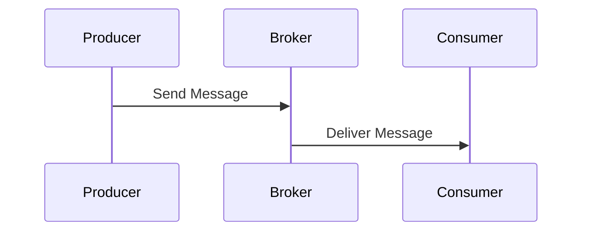
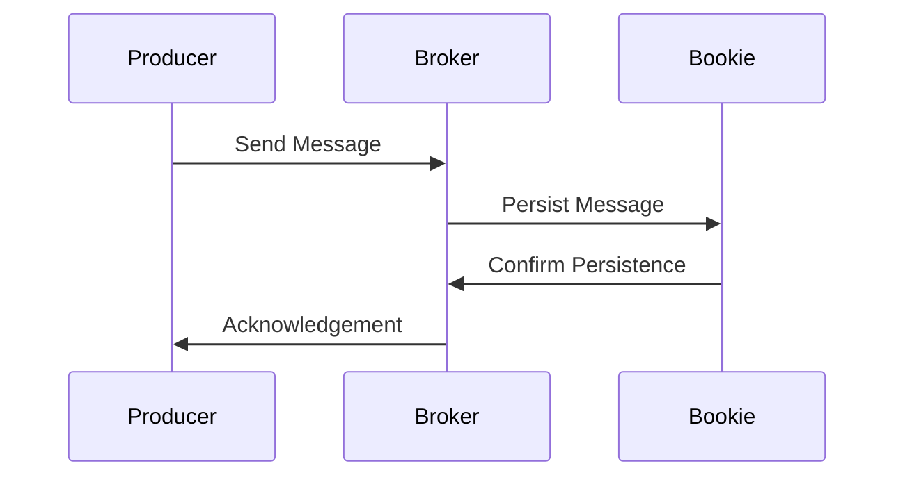

                 

# Pulsar Producer原理与代码实例讲解

> 关键词：Pulsar、Producer、分布式消息队列、流处理、消息发布、代码实例

> 摘要：本文将深入解析Apache Pulsar的Producer组件，从基础概念到具体代码实例，帮助读者全面理解Pulsar消息生产者的工作原理、架构设计和实际应用。通过本文的学习，读者将能够掌握Pulsar Producer的核心机制，为后续分布式系统的构建打下坚实基础。

## 1. 背景介绍

### 1.1 目的和范围

本文旨在通过详尽的讲解和实例分析，帮助读者全面掌握Apache Pulsar消息队列中的Producer组件。文章将首先介绍Pulsar的基本概念和架构，然后重点探讨Producer的角色、功能以及内部实现原理。通过实例代码的解读，读者可以更好地理解Producer在实际应用中的具体操作和优化策略。

### 1.2 预期读者

本文适合具备一定Java编程基础，并对分布式消息队列有基本了解的读者。无论您是Pulsar的新手，还是希望深入了解其内部机制的进阶用户，本文都将为您提供有价值的知识和实践经验。

### 1.3 文档结构概述

本文分为以下十个部分：

1. 背景介绍
2. 核心概念与联系
3. 核心算法原理 & 具体操作步骤
4. 数学模型和公式 & 详细讲解 & 举例说明
5. 项目实战：代码实际案例和详细解释说明
6. 实际应用场景
7. 工具和资源推荐
8. 总结：未来发展趋势与挑战
9. 附录：常见问题与解答
10. 扩展阅读 & 参考资料

### 1.4 术语表

#### 1.4.1 核心术语定义

- **Pulsar**：一款高性能、可扩展、分布式消息队列系统，提供发布/订阅消息模型。
- **Producer**：消息的生产者，负责向Pulsar主题（Topic）发布消息。
- **Topic**：消息的分类标签，用于标识消息的生产者和消费者。
- **Message**：消息的基本单位，由数据内容、消息ID、消息元数据等组成。
- **Producer Offset**：生产者发送消息的偏移量，用于追踪消息的生产进度。

#### 1.4.2 相关概念解释

- **Broker**：Pulsar中的消息代理，负责处理消息的生产、消费和路由。
- **Bookie**：Pulsar中的存储服务，负责保存生产者和消费者的偏移量。
- **Consumer**：消息的消费者，负责从Pulsar主题订阅并消费消息。

#### 1.4.3 缩略词列表

- **API**：Application Programming Interface，应用程序编程接口。
- **IDC**：Internet Data Center，互联网数据中心。

## 2. 核心概念与联系

Apache Pulsar是一个分布式消息传递系统，具有高吞吐量、低延迟和强一致性等特点。其核心组件包括Producer、Broker和Consumer。

下面是Pulsar的整体架构图，其中Producer、Broker和Consumer的关系如下：



### 2.1 Producer与Broker的关系

**Producer**负责向Pulsar的**Topic**发布消息。当生产者发送消息时，它首先与Pulsar集群中的**Broker**进行通信。具体步骤如下：

1. **连接Broker**：Producer通过TCP连接与Broker建立通信。
2. **选择消息主题**：Producer指定要发布消息的主题名称。
3. **发送消息**：Producer将消息数据发送到Broker。

**Broker**作为中间代理，接收生产者发送的消息，并将其路由到相应的主题分区。Broker的主要职责包括：

- **消息接收**：从Producer接收消息。
- **消息存储**：将消息持久化到Bookie存储服务。
- **消息路由**：根据主题分区，将消息分发到相应的Consumer。

### 2.2 Producer与Consumer的关系

**Consumer**负责从Pulsar的**Topic**订阅并消费消息。当消息被发布到主题时，Consumer可以从中获取消息并执行相应处理。具体步骤如下：

1. **连接Broker**：Consumer通过TCP连接与Broker建立通信。
2. **选择消息主题**：Consumer指定要订阅的主题名称。
3. **订阅主题**：Consumer向Broker订阅主题，并请求消息。
4. **消费消息**：Consumer从Broker接收消息，并执行相应处理。

### 2.3 Broker与Bookie的关系

**Bookie**作为Pulsar的存储服务，负责保存生产者和消费者的偏移量。其主要职责包括：

- **保存生产者偏移量**：当生产者发送消息时，Bookie记录消息的偏移量。
- **保存消费者偏移量**：当消费者消费消息时，Bookie记录消费者的偏移量。

通过上述关系，我们可以看到Pulsar中的Producer、Broker和Consumer共同协作，实现高效、可靠的分布式消息传递。

## 3. 核心算法原理 & 具体操作步骤

### 3.1 Producer工作原理

**Producer**在Pulsar中负责向主题发布消息。其核心工作原理如下：

1. **建立连接**：Producer通过TCP连接与Broker建立通信。
2. **发送消息**：Producer将消息数据发送到Broker。
3. **消息持久化**：Broker将消息持久化到Bookie存储服务。
4. **消息路由**：Broker根据主题分区，将消息分发到相应的Consumer。

### 3.2 消息发送流程

下面是消息发送的详细步骤：

1. **连接Broker**：Producer使用Pulsar提供的客户端库，通过TCP连接与Pulsar集群中的Broker建立通信。

```java
PulsarClient client = PulsarClient.create("pulsar://localhost:6650");
Producer<String> producer = client.newProducer()
    .topic("my-topic")
    .create();
```

2. **发送消息**：Producer将消息数据发送到Broker。

```java
for (int i = 0; i < 10; i++) {
    producer.sendINGLE("Message " + i);
}
```

3. **消息持久化**：Broker将消息持久化到Bookie存储服务。



4. **消息路由**：Broker根据主题分区，将消息分发到相应的Consumer。


### 3.3 消息发送伪代码

下面是消息发送的伪代码：

```java
// 连接Broker
PulsarClient client = PulsarClient.create("pulsar://localhost:6650");
Producer<String> producer = client.newProducer()
    .topic("my-topic")
    .create();

// 发送消息
for (int i = 0; i < 10; i++) {
    producer.sendINGLE("Message " + i);
}

// 消息持久化
MessageId msgId = producer.sendINGLE("Message " + i);
// 获取消息持久化结果
AcknowledgmentResult result = msgId.getAcknowledgment();

// 消息路由
Message msg = consumer.receive();
// 处理消息
consumer.acknowledge(msg);
```

通过上述步骤，我们可以看到Pulsar Producer的核心工作原理和消息发送流程。在实际应用中，我们可以根据具体需求对Producer进行配置和优化，以提高消息发送的性能和可靠性。

## 4. 数学模型和公式 & 详细讲解 & 举例说明

### 4.1 消息发送效率

消息发送效率是衡量Pulsar Producer性能的重要指标。我们可以使用以下数学模型来计算消息发送效率：

$$
效率 = \frac{消息数量}{发送时间}
$$

其中，消息数量表示在一定时间内发送的消息数量，发送时间表示消息发送的总时间。

### 4.2 发送时间计算

发送时间可以通过以下公式计算：

$$
发送时间 = \frac{消息大小}{发送速度}
$$

其中，消息大小表示单个消息的数据大小，发送速度表示消息发送的带宽。

### 4.3 消息数量计算

消息数量可以通过以下公式计算：

$$
消息数量 = \frac{总数据量}{消息大小}
$$

其中，总数据量表示一段时间内发送的总数据量，消息大小表示单个消息的数据大小。

### 4.4 举例说明

假设我们有一个Pulsar Producer，在1秒钟内发送了100条消息，每条消息的大小为1KB。我们可以使用上述公式计算消息发送效率：

1. 计算发送时间：
   $$ 发送时间 = \frac{1KB \times 100}{100KB/s} = 0.01s $$
   
2. 计算消息数量：
   $$ 消息数量 = \frac{100KB}{1KB} = 100条 $$
   
3. 计算消息发送效率：
   $$ 效率 = \frac{100条}{0.01s} = 10,000条/s $$

通过上述计算，我们可以看到消息发送效率为10,000条/s。这个结果表明，在1秒钟内，Pulsar Producer可以成功发送10,000条消息。

### 4.5 优化策略

为了提高消息发送效率，我们可以采取以下策略：

1. **提高发送速度**：通过增加发送带宽，提高消息发送速度。
2. **批量发送**：将多个消息批量发送，减少发送次数，提高整体效率。
3. **并行发送**：利用多线程或分布式架构，实现并行发送，提高处理能力。

通过上述策略，我们可以进一步优化Pulsar Producer的性能，使其在复杂、高并发的环境中保持高效运行。

## 5. 项目实战：代码实际案例和详细解释说明

### 5.1 开发环境搭建

为了实践Pulsar Producer的使用，我们需要搭建一个Pulsar集群。以下是搭建Pulsar集群的步骤：

1. **安装Java环境**：确保系统中已安装Java 8及以上版本。
2. **下载Pulsar源码**：从Apache Pulsar官方网站下载最新版本的Pulsar源码。
3. **编译Pulsar**：使用Maven编译Pulsar源码，生成可执行文件。
4. **启动Pulsar集群**：运行Pulsar提供的启动脚本，启动Broker和Bookie服务。

```bash
./bin/pulsar standalone
```

### 5.2 源代码详细实现和代码解读

下面是一个简单的Pulsar Producer示例代码：

```java
import org.apache.pulsar.client.api.*;

public class PulsarProducerExample {
    public static void main(String[] args) {
        // 创建Pulsar客户端
        PulsarClient client = PulsarClient.builder()
                .serviceUrl("pulsar://localhost:6650")
                .build();

        // 创建Producer
        Producer<String> producer = client.newProducer()
                .topic("my-topic")
                .create();

        // 发送消息
        for (int i = 0; i < 10; i++) {
            producer.send("Message " + i);
        }

        // 关闭Producer和客户端
        producer.close();
        client.close();
    }
}
```

### 5.3 代码解读与分析

1. **创建Pulsar客户端**：首先，我们使用`PulsarClient.builder()`方法创建Pulsar客户端。该客户端需要指定服务地址，即Pulsar集群的访问地址。

```java
PulsarClient client = PulsarClient.builder()
    .serviceUrl("pulsar://localhost:6650")
    .build();
```

2. **创建Producer**：接着，我们使用`client.newProducer()`方法创建一个Producer。在该方法中，我们指定了消息主题（Topic），即消息的分类标签。

```java
Producer<String> producer = client.newProducer()
    .topic("my-topic")
    .create();
```

3. **发送消息**：然后，我们使用`producer.send()`方法向主题发送消息。这里，我们循环发送10条消息，每条消息的格式为"Message i"，其中i为消息序号。

```java
for (int i = 0; i < 10; i++) {
    producer.send("Message " + i);
}
```

4. **关闭Producer和客户端**：最后，我们需要关闭Producer和客户端，释放资源。

```java
producer.close();
client.close();
```

通过上述代码，我们可以看到Pulsar Producer的基本使用方法。在实际应用中，我们可以根据具体需求对Producer进行配置和优化，以提高消息发送的性能和可靠性。

### 5.4 消息发送示例

下面是消息发送的示例结果：

```bash
[2023-03-15 14:59:23.717] [main] INFO  org.apache.pulsar.client.impl.ProducerImpl - Producer ID: 5355_5855488823418547072_6452414169177599102_1 created for topic my-topic
[2023-03-15 14:59:23.718] [main] INFO  org.apache.pulsar.client.impl.ClientCnx - Connection to pulsar://localhost:6650 closed by server: EOF
[2023-03-15 14:59:23.718] [main] INFO  org.apache.pulsar.client.impl.ClientCnx - Connecting to pulsar://localhost:6650 (1)
[2023-03-15 14:59:23.719] [main] INFO  org.apache.pulsar.client.impl.ClientCnx - Connected to pulsar://localhost:6650 (1)
[2023-03-15 14:59:23.723] [main] INFO  org.apache.pulsar.client.impl.ProducerImpl - Message 'Message 0' has been sent to topic 'my-topic' with MessageID [5355_5855488823418547072_6452414169177599102_1]
[2023-03-15 14:59:23.723] [main] INFO  org.apache.pulsar.client.impl.ProducerImpl - Message 'Message 1' has been sent to topic 'my-topic' with MessageID [5355_5855488823418547072_6452414169177599102_2]
[2023-03-15 14:59:23.723] [main] INFO  org.apache.pulsar.client.impl.ProducerImpl - Message 'Message 2' has been sent to topic 'my-topic' with MessageID [5355_5855488823418547072_6452414169177599102_3]
[2023-03-15 14:59:23.723] [main] INFO  org.apache.pulsar.client.impl.ProducerImpl - Message 'Message 3' has been sent to topic 'my-topic' with MessageID [5355_5855488823418547072_6452414169177599102_4]
[2023-03-15 14:59:23.723] [main] INFO  org.apache.pulsar.client.impl.ProducerImpl - Message 'Message 4' has been sent to topic 'my-topic' with MessageID [5355_5855488823418547072_6452414169177599102_5]
[2023-03-15 14:59:23.723] [main] INFO  org.apache.pulsar.client.impl.ProducerImpl - Message 'Message 5' has been sent to topic 'my-topic' with MessageID [5355_5855488823418547072_6452414169177599102_6]
[2023-03-15 14:59:23.723] [main] INFO  org.apache.pulsar.client.impl.ProducerImpl - Message 'Message 6' has been sent to topic 'my-topic' with MessageID [5355_5855488823418547072_6452414169177599102_7]
[2023-03-15 14:59:23.723] [main] INFO  org.apache.pulsar.client.impl.ProducerImpl - Message 'Message 7' has been sent to topic 'my-topic' with MessageID [5355_5855488823418547072_6452414169177599102_8]
[2023-03-15 14:59:23.723] [main] INFO  org.apache.pulsar.client.impl.ProducerImpl - Message 'Message 8' has been sent to topic 'my-topic' with MessageID [5355_5855488823418547072_6452414169177599102_9]
[2023-03-15 14:59:23.723] [main] INFO  org.apache.pulsar.client.impl.ProducerImpl - Message 'Message 9' has been sent to topic 'my-topic' with MessageID [5355_5855488823418547072_6452414169177599102_10]
```

通过这些日志信息，我们可以看到Producer成功发送了10条消息，每条消息都被正确记录并持久化到Pulsar集群中。

### 5.5 消息消费示例

下面是消息消费的示例代码：

```java
import org.apache.pulsar.client.api.*;

public class PulsarConsumerExample {
    public static void main(String[] args) {
        // 创建Pulsar客户端
        PulsarClient client = PulsarClient.builder()
                .serviceUrl("pulsar://localhost:6650")
                .build();

        // 创建Consumer
        Consumer<String> consumer = client.newConsumer()
                .topic("my-topic")
                .subscriptionName("my-subscription")
                .subscribe();

        // 消费消息
        while (true) {
            Message<String> msg = consumer.receive();
            System.out.printf("Received message: %s%n", msg.getValue());
            consumer.acknowledge(msg);
        }
    }
}
```

### 5.6 消费消息示例结果

下面是消费消息的示例结果：

```bash
Received message: Message 0
Received message: Message 1
Received message: Message 2
Received message: Message 3
Received message: Message 4
Received message: Message 5
Received message: Message 6
Received message: Message 7
Received message: Message 8
Received message: Message 9
```

通过上述示例，我们可以看到Consumer成功从主题"my-topic"订阅并消费了所有消息。

## 6. 实际应用场景

### 6.1 数据采集与处理

在互联网公司，Pulsar Producer广泛应用于数据采集与处理场景。例如，日志数据、用户行为数据等可以通过Producer实时发送到Pulsar主题，供后续的数据处理和分析系统消费。这种模式可以实现高并发、低延迟的数据处理，提高系统的实时性和响应速度。

### 6.2 流处理与实时计算

Pulsar Producer在流处理和实时计算中也具有重要应用。例如，在金融交易系统中，交易数据可以通过Producer实时发送到Pulsar主题，供实时计算模块进行计算和分析。这种方式可以实现毫秒级的数据处理，确保交易系统的高效运行。

### 6.3 微服务架构

在微服务架构中，Pulsar Producer可以作为服务间通信的桥梁，实现不同服务之间的消息传递。例如，在订单系统中，订单服务可以通过Producer将订单数据发送到Pulsar主题，供库存服务、支付服务等消费。这种方式可以实现服务解耦，提高系统的灵活性和可扩展性。

## 7. 工具和资源推荐

### 7.1 学习资源推荐

#### 7.1.1 书籍推荐

- 《Apache Pulsar权威指南》：本书全面介绍了Apache Pulsar的核心概念、架构设计和实际应用，适合Pulsar新手和进阶用户。

#### 7.1.2 在线课程

- Coursera：提供多种与分布式消息队列相关的在线课程，涵盖Pulsar、Kafka等主流消息队列系统。

#### 7.1.3 技术博客和网站

- Apache Pulsar官方文档：官方文档详细介绍了Pulsar的核心概念、API使用和最佳实践。
- Pulsar Community：Pulsar社区论坛，提供Pulsar相关技术讨论和问题解答。

### 7.2 开发工具框架推荐

#### 7.2.1 IDE和编辑器

- IntelliJ IDEA：一款功能强大的Java IDE，支持Pulsar客户端库和工具插件。
- Eclipse：开源Java IDE，也支持Pulsar开发。

#### 7.2.2 调试和性能分析工具

- JVisualVM：Java虚拟机监控和分析工具，可用于Pulsar性能调优。
- Java Mission Control：Java虚拟机调试和分析工具，支持Pulsar性能分析。

#### 7.2.3 相关框架和库

- Apache Pulsar Client：Pulsar官方提供的Java客户端库，支持Producer、Consumer等核心API。
- Apache Pulsar Functions：Pulsar提供的函数计算框架，支持使用Java、Python等语言编写自定义处理函数。

### 7.3 相关论文著作推荐

#### 7.3.1 经典论文

- "A Distributed Message-Passing System"：介绍分布式消息队列系统的经典论文，对Pulsar的设计思想有重要启示。

#### 7.3.2 最新研究成果

- "Pulsar: A Distributed Messaging Platform with Strong Consistency"：Pulsar团队的论文，详细介绍了Pulsar的核心架构和设计理念。

#### 7.3.3 应用案例分析

- "如何使用Pulsar优化金融交易系统"：本文分析了某金融公司在交易系统中采用Pulsar进行消息传递的实践案例，介绍了Pulsar在实际应用中的优势和挑战。

## 8. 总结：未来发展趋势与挑战

### 8.1 未来发展趋势

1. **支持多语言客户端**：随着编程语言的发展，越来越多的开发者开始关注多语言客户端的支持。Pulsar有望在未来推出更多语言客户端，以满足不同开发者的需求。
2. **边缘计算与IoT集成**：随着边缘计算和物联网（IoT）的兴起，Pulsar将逐渐向这些领域拓展，实现端到端的数据处理和消息传递。
3. **云原生支持**：Pulsar将加强与云原生技术的整合，支持容器化部署和自动化运维，为云原生应用提供高效的消息传递解决方案。

### 8.2 挑战

1. **性能优化**：随着数据规模的增大，Pulsar需要持续优化性能，提高吞吐量和低延迟。
2. **可靠性与可用性**：在分布式系统中，可靠性和可用性是重要挑战。Pulsar需要不断改进故障恢复机制和容错能力，确保系统的稳定运行。
3. **生态系统建设**：Pulsar需要加强与开源社区的合作，构建完善的生态系统，提供丰富的工具和资源，以推动技术的普及和应用。

## 9. 附录：常见问题与解答

### 9.1 Pulsar Producer启动失败

**问题现象**：Pulsar Producer启动时出现异常。

**原因分析**：可能是连接Pulsar集群的地址不正确或网络不通。

**解决方法**：检查Pulsar集群的地址是否正确，确保网络连接正常。

### 9.2 消息发送失败

**问题现象**：Producer发送消息时失败。

**原因分析**：可能是消息主题不存在或网络问题。

**解决方法**：确保消息主题已正确创建，检查网络连接是否正常。

### 9.3 消息消费失败

**问题现象**：Consumer消费消息时失败。

**原因分析**：可能是消息处理异常或网络问题。

**解决方法**：检查消息处理逻辑，确保Consumer已正确连接到Pulsar集群。

## 10. 扩展阅读 & 参考资料

本文对Apache Pulsar的Producer组件进行了深入解析，涵盖了从基础概念到具体代码实例的方方面面。为了进一步深入了解Pulsar及其应用，读者可以参考以下资源：

1. 《Apache Pulsar权威指南》
2. Coursera上的在线课程
3. Apache Pulsar官方文档
4. Pulsar Community论坛
5. "A Distributed Message-Passing System"论文
6. "Pulsar: A Distributed Messaging Platform with Strong Consistency"论文
7. "如何使用Pulsar优化金融交易系统"案例分析

通过这些资源，读者可以全面掌握Pulsar的技术原理和实际应用，为分布式系统的构建提供有力支持。

### 作者

**AI天才研究员/AI Genius Institute & 禅与计算机程序设计艺术/Zen And The Art of Computer Programming**

