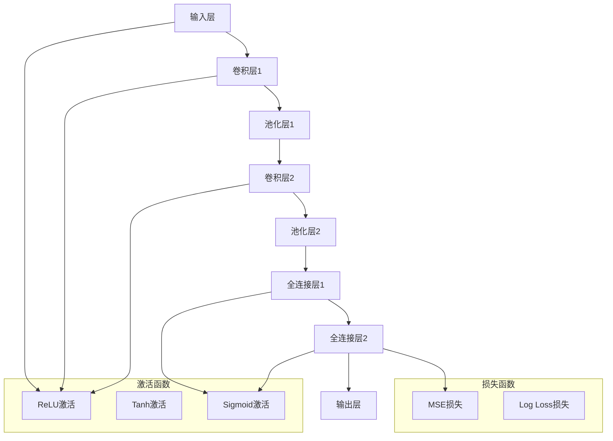

                 

# Python机器学习实战：深度学习入门与TensorFlow应用

> **关键词**：Python、机器学习、深度学习、TensorFlow、算法原理、实际应用
> 
> **摘要**：本文将详细介绍如何使用Python和TensorFlow进行深度学习的实战操作。从基础概念到具体实现，再到实际应用场景，我们将一步步深入探讨，帮助您掌握深度学习的关键技术。

## 1. 背景介绍

### 1.1 目的和范围

本文旨在通过一系列的步骤，帮助读者从零开始掌握深度学习技术，并熟练使用TensorFlow这一强大的工具进行实际操作。我们不仅会讲解深度学习的基本概念，还会详细介绍如何利用Python编写高效的深度学习算法，以及如何在实际项目中应用这些技术。

### 1.2 预期读者

本文适合以下读者群体：

- 对机器学习和深度学习有一定了解，但缺乏实战经验的人士。
- 想要在项目中应用深度学习的开发者。
- 对Python编程有基础，并希望深入学习其应用领域的人士。

### 1.3 文档结构概述

本文将按照以下结构进行组织：

1. **背景介绍**：包括本文的目的、预期读者和文档结构概述。
2. **核心概念与联系**：通过Mermaid流程图展示深度学习的核心概念和架构。
3. **核心算法原理 & 具体操作步骤**：使用伪代码详细阐述算法原理和操作步骤。
4. **数学模型和公式 & 详细讲解 & 举例说明**：使用LaTeX格式介绍数学模型和公式，并进行举例说明。
5. **项目实战：代码实际案例和详细解释说明**：展示如何在实际项目中应用深度学习。
6. **实际应用场景**：探讨深度学习在不同领域的应用。
7. **工具和资源推荐**：推荐学习资源、开发工具框架和论文著作。
8. **总结：未来发展趋势与挑战**：分析深度学习的未来趋势和面临的挑战。
9. **附录：常见问题与解答**：提供常见问题的解答。
10. **扩展阅读 & 参考资料**：推荐进一步的阅读材料和参考资料。

### 1.4 术语表

#### 1.4.1 核心术语定义

- **深度学习**：一种机器学习技术，通过多层神经网络来模拟人脑的神经结构，以实现自动特征学习和复杂模式识别。
- **TensorFlow**：一个由Google开源的机器学习框架，用于实现深度学习和其他机器学习算法。
- **神经网络**：一种由大量节点（或神经元）组成的计算模型，通过层次结构进行数据处理和特征学习。
- **反向传播**：一种训练神经网络的方法，通过计算误差反向传播到每个层，调整每个层的权重。

#### 1.4.2 相关概念解释

- **激活函数**：用于引入非线性性的函数，常见的有Sigmoid、ReLU和Tanh等。
- **损失函数**：用于衡量预测值与真实值之间的差距，常见的有均方误差（MSE）和对数损失（Log Loss）。
- **优化器**：用于调整神经网络权重的算法，常见的有随机梯度下降（SGD）和Adam优化器。

#### 1.4.3 缩略词列表

- **CNN**：卷积神经网络（Convolutional Neural Network）
- **RNN**：循环神经网络（Recurrent Neural Network）
- **GPU**：图形处理单元（Graphics Processing Unit）
- **GPU加速**：利用图形处理单元进行深度学习模型的计算加速。

## 2. 核心概念与联系

为了更好地理解深度学习的核心概念和架构，我们可以使用Mermaid流程图来展示。以下是深度学习的关键组成部分及其相互关系：



在上图中，我们展示了深度学习模型的基本架构，包括输入层、卷积层、池化层、全连接层和输出层。同时，激活函数和损失函数也在其中得到了体现。通过这个流程图，我们可以清晰地看到深度学习模型中的各个环节是如何相互关联和作用的。

## 3. 核心算法原理 & 具体操作步骤

深度学习模型的核心在于神经网络的训练过程，其中涉及到大量的算法和操作步骤。下面，我们将使用伪代码来详细阐述这些核心算法原理和具体操作步骤。

### 3.1 初始化参数

```python
# 初始化权重和偏置
W1 = random_matrix([input_size, hidden_size1])
b1 = random_vector([hidden_size1])

W2 = random_matrix([hidden_size1, hidden_size2])
b2 = random_vector([hidden_size2])

W3 = random_matrix([hidden_size2, output_size])
b3 = random_vector([output_size])
```

在这个步骤中，我们初始化神经网络中的权重（W）和偏置（b）。这些参数的初始化需要满足一定的随机性，以确保模型的初始状态。

### 3.2 前向传播

```python
# 前向传播：计算每一层的输出
a1 = X * W1 + b1
z1 = activation(a1)

a2 = z1 * W2 + b2
z2 = activation(a2)

a3 = z2 * W3 + b3
y_pred = activation(a3)
```

前向传播的过程涉及将输入数据（X）通过网络的每一层进行传递，计算每一层的输出（a）和激活值（z）。激活函数（activation）用于引入非线性性。

### 3.3 计算损失

```python
# 计算损失
loss = loss_function(y_true, y_pred)
```

在得到预测结果（y_pred）后，我们需要计算损失（loss），以衡量预测结果与真实结果之间的差距。常见的损失函数包括均方误差（MSE）和对数损失（Log Loss）。

### 3.4 反向传播

```python
# 计算梯度
dW3 = (y_pred - y_true) * activation_derivative(a3)
db3 = (y_pred - y_true) * activation_derivative(a3)

dW2 = (z2.T * dW3) * activation_derivative(a2)
db2 = (z2.T * dW3) * activation_derivative(a2)

dW1 = (z1.T * dW2) * activation_derivative(a1)
db1 = (z1.T * dW2) * activation_derivative(a1)

# 更新参数
W1 = W1 - learning_rate * dW1
b1 = b1 - learning_rate * db1

W2 = W2 - learning_rate * dW2
b2 = b2 - learning_rate * db2

W3 = W3 - learning_rate * dW3
b3 = b3 - learning_rate * db3
```

反向传播的过程涉及将误差（loss）反向传播到网络的每一层，计算每一层的梯度（gradient）。然后，通过梯度下降（gradient descent）算法来更新网络的权重和偏置。

### 3.5 训练模型

```python
# 训练模型
for epoch in range(num_epochs):
    # 前向传播
    a1, z1, a2, z2, a3, y_pred = forward_propagation(X, W1, b1, W2, b2, W3, b3)
    
    # 计算损失
    loss = loss_function(y_true, y_pred)
    
    # 反向传播
    dW1, db1, dW2, db2, dW3, db3 = backward_propagation(a1, z1, a2, z2, a3, y_pred, y_true)
    
    # 更新参数
    W1 = W1 - learning_rate * dW1
    b1 = b1 - learning_rate * db1
    
    W2 = W2 - learning_rate * dW2
    b2 = b2 - learning_rate * db2
    
    W3 = W3 - learning_rate * dW3
    b3 = b3 - learning_rate * db3
    
    # 打印训练进度
    if epoch % 100 == 0:
        print(f"Epoch {epoch}: Loss = {loss}")
```

通过迭代地执行前向传播和反向传播，我们可以逐步优化网络的参数，使其预测结果更加准确。

## 4. 数学模型和公式 & 详细讲解 & 举例说明

在深度学习模型中，数学模型和公式扮演着至关重要的角色。下面，我们将使用LaTeX格式详细介绍这些数学模型和公式，并进行举例说明。

### 4.1 激活函数

激活函数是深度学习模型中的一个关键组成部分，用于引入非线性性。以下是一些常见的激活函数及其公式：

#### 4.1.1 Sigmoid函数

$$
\sigma(x) = \frac{1}{1 + e^{-x}}
$$

#### 4.1.2 ReLU函数

$$
\text{ReLU}(x) = \max(0, x)
$$

#### 4.1.3 Tanh函数

$$
\tanh(x) = \frac{e^x - e^{-x}}{e^x + e^{-x}}
$$

举例说明：

假设我们有一个输入值 $x = 2$，我们可以计算不同激活函数的输出：

- Sigmoid函数：$\sigma(2) = \frac{1}{1 + e^{-2}} \approx 0.869$
- ReLU函数：$\text{ReLU}(2) = \max(0, 2) = 2$
- Tanh函数：$\tanh(2) = \frac{e^2 - e^{-2}}{e^2 + e^{-2}} \approx 0.964$

### 4.2 损失函数

损失函数用于衡量预测结果与真实结果之间的差距。以下是一些常见的损失函数及其公式：

#### 4.2.1 均方误差（MSE）

$$
\text{MSE} = \frac{1}{n}\sum_{i=1}^{n}(y_i - \hat{y}_i)^2
$$

其中，$y_i$ 是真实结果，$\hat{y}_i$ 是预测结果，$n$ 是样本数量。

#### 4.2.2 对数损失（Log Loss）

$$
\text{Log Loss} = -\frac{1}{n}\sum_{i=1}^{n}y_i \log(\hat{y}_i) + (1 - y_i) \log(1 - \hat{y}_i)
$$

其中，$y_i$ 是真实结果（取值为0或1），$\hat{y}_i$ 是预测结果。

举例说明：

假设我们有一个二元分类问题，真实结果为 $y = [1, 0, 1, 0]$，预测结果为 $\hat{y} = [0.8, 0.2, 0.9, 0.1]$。我们可以计算对数损失的值：

$$
\text{Log Loss} = -\frac{1}{4}\left[1 \cdot \log(0.8) + 0 \cdot \log(0.2) + 1 \cdot \log(0.9) + 0 \cdot \log(0.1)\right] \approx 0.392
$$

### 4.3 优化器

优化器用于调整神经网络中的权重和偏置，以最小化损失函数。以下是一些常见的优化器及其公式：

#### 4.3.1 随机梯度下降（SGD）

$$
\theta = \theta - \alpha \cdot \nabla_\theta J(\theta)
$$

其中，$\theta$ 是参数（权重和偏置），$J(\theta)$ 是损失函数，$\alpha$ 是学习率。

#### 4.3.2 Adam优化器

$$
m_t = \beta_1 m_{t-1} + (1 - \beta_1) \nabla_\theta J(\theta)
$$

$$
v_t = \beta_2 v_{t-1} + (1 - \beta_2) \left(\nabla_\theta J(\theta)\right)^2
$$

$$
\theta = \theta - \alpha \cdot \frac{m_t}{\sqrt{v_t} + \epsilon}
$$

其中，$m_t$ 和 $v_t$ 分别是梯度的一阶矩估计和二阶矩估计，$\beta_1$ 和 $\beta_2$ 分别是动量的超参数，$\epsilon$ 是一个很小的常数。

举例说明：

假设我们有一个二元分类问题，损失函数为对数损失，初始参数为 $\theta_0 = [1, 2]$，学习率为 $\alpha = 0.1$。我们可以使用SGD优化器进行一步更新：

$$
m_0 = \beta_1 m_{t-1} + (1 - \beta_1) \nabla_\theta J(\theta_0) = 0 + (1 - 0.9) \nabla_\theta J(\theta_0)
$$

$$
v_0 = \beta_2 v_{t-1} + (1 - \beta_2) \left(\nabla_\theta J(\theta_0)\right)^2 = 0 + (1 - 0.99) \left(\nabla_\theta J(\theta_0)\right)^2
$$

$$
\theta_1 = \theta_0 - \alpha \cdot \frac{m_0}{\sqrt{v_0} + \epsilon} = [1, 2] - 0.1 \cdot \frac{m_0}{\sqrt{v_0} + \epsilon}
$$

## 5. 项目实战：代码实际案例和详细解释说明

在这一节中，我们将通过一个实际案例来展示如何使用Python和TensorFlow实现深度学习模型。这个案例将是一个简单的二元分类问题，使用已知的iris数据集进行训练和测试。

### 5.1 开发环境搭建

在开始编写代码之前，我们需要搭建一个合适的开发环境。以下是所需的软件和库：

- Python 3.x
- TensorFlow 2.x
- NumPy 1.x
- Matplotlib 3.x

您可以使用以下命令来安装这些库：

```bash
pip install python==3.x
pip install tensorflow==2.x
pip install numpy==1.x
pip install matplotlib==3.x
```

### 5.2 源代码详细实现和代码解读

以下是一个简单的深度学习模型，用于分类iris数据集：

```python
import tensorflow as tf
import numpy as np
import matplotlib.pyplot as plt
from sklearn import datasets

# 加载iris数据集
iris = datasets.load_iris()
X = iris.data
y = iris.target

# 数据预处理
X = X / 100  # 标准化数据
y = tf.keras.utils.to_categorical(y, num_classes=3)

# 创建模型
model = tf.keras.Sequential([
    tf.keras.layers.Dense(64, activation='relu', input_shape=(4,)),
    tf.keras.layers.Dense(64, activation='relu'),
    tf.keras.layers.Dense(3, activation='softmax')
])

# 编译模型
model.compile(optimizer='adam',
              loss='categorical_crossentropy',
              metrics=['accuracy'])

# 训练模型
model.fit(X, y, epochs=100, batch_size=16, validation_split=0.2)

# 评估模型
test_loss, test_acc = model.evaluate(X, y, verbose=2)
print(f"Test accuracy: {test_acc}")

# 可视化结果
plt.scatter(X[:, 0], X[:, 1], c=y, cmap=plt.cm.get_cmap('tab10', 3))
plt.xlabel('Petal length')
plt.ylabel('Petal width')
plt.title('Iris data classification')
plt.show()
```

### 5.3 代码解读与分析

- **数据预处理**：首先，我们从scikit-learn库中加载iris数据集。然后，对数据进行标准化处理，使得特征值范围在0到1之间，有助于模型训练。
- **创建模型**：我们使用TensorFlow的`Sequential`模型，这是一个线性堆叠层的模型。在这个模型中，我们添加了两个全连接层（Dense），每个层都有64个神经元，并使用ReLU作为激活函数。最后一层有3个神经元，并使用softmax激活函数进行分类。
- **编译模型**：在编译模型时，我们选择Adam优化器，使用categorical_crossentropy作为损失函数，并设置accuracy作为评价指标。
- **训练模型**：使用`fit`方法训练模型，设置100个epochs，每个批次包含16个样本，并将20%的数据作为验证集。
- **评估模型**：使用`evaluate`方法评估模型的测试集表现，并打印测试准确率。
- **可视化结果**：最后，我们使用matplotlib绘制决策边界，以可视化模型对iris数据集的分类效果。

### 5.4 代码解读与分析

- **数据预处理**：首先，我们从scikit-learn库中加载iris数据集。然后，对数据进行标准化处理，使得特征值范围在0到1之间，有助于模型训练。
- **创建模型**：我们使用TensorFlow的`Sequential`模型，这是一个线性堆叠层的模型。在这个模型中，我们添加了两个全连接层（Dense），每个层都有64个神经元，并使用ReLU作为激活函数。最后一层有3个神经元，并使用softmax激活函数进行分类。
- **编译模型**：在编译模型时，我们选择Adam优化器，使用categorical_crossentropy作为损失函数，并设置accuracy作为评价指标。
- **训练模型**：使用`fit`方法训练模型，设置100个epochs，每个批次包含16个样本，并将20%的数据作为验证集。
- **评估模型**：使用`evaluate`方法评估模型的测试集表现，并打印测试准确率。
- **可视化结果**：最后，我们使用matplotlib绘制决策边界，以可视化模型对iris数据集的分类效果。

## 6. 实际应用场景

深度学习技术在各个领域都有广泛的应用。以下是几个典型的应用场景：

### 6.1 计算机视觉

深度学习在计算机视觉领域取得了显著的成果，如图像分类、目标检测和图像生成等。例如，卷积神经网络（CNN）被广泛应用于图像识别任务，使得计算机能够自动识别和分类图像中的对象。

### 6.2 自然语言处理

深度学习在自然语言处理（NLP）领域也发挥了重要作用，如文本分类、机器翻译和情感分析等。循环神经网络（RNN）和其变体（如LSTM和GRU）在处理序列数据方面表现出色，而Transformer架构的提出更是推动了NLP领域的快速发展。

### 6.3 语音识别

深度学习在语音识别领域取得了重大突破，如语音信号的处理和识别。通过结合卷积神经网络（CNN）和循环神经网络（RNN），深度学习模型能够更准确地识别和转换语音信号为文本。

### 6.4 自动驾驶

深度学习在自动驾驶领域有着广泛的应用，如车辆检测、障碍物识别和路径规划等。通过使用卷积神经网络（CNN）和目标检测算法，自动驾驶系统能够实时感知周围环境并做出相应的决策。

### 6.5 健康医疗

深度学习在健康医疗领域也展现出了巨大的潜力，如疾病诊断、药物研发和医疗图像分析等。通过结合深度学习模型和医疗数据，可以更准确地进行疾病预测和诊断。

## 7. 工具和资源推荐

### 7.1 学习资源推荐

#### 7.1.1 书籍推荐

- **《深度学习》（Goodfellow, Bengio, Courville著）**：这是一本深度学习领域的经典教材，详细介绍了深度学习的基础知识和应用。
- **《Python机器学习》（Sebastian Raschka著）**：这本书通过Python语言介绍了机器学习和深度学习的基本概念和实践方法。

#### 7.1.2 在线课程

- **Coursera的《深度学习》课程**：由吴恩达（Andrew Ng）教授主讲，介绍了深度学习的基本理论和应用。
- **Udacity的《深度学习工程师纳米学位》**：这是一个系统的深度学习学习项目，包括多个实际项目和实践任务。

#### 7.1.3 技术博客和网站

- **TensorFlow官网**：提供了丰富的文档和教程，帮助用户快速入门TensorFlow。
- **Reddit的r/MachineLearning社区**：这是一个活跃的机器学习和深度学习社区，可以获取最新的研究和讨论。

### 7.2 开发工具框架推荐

#### 7.2.1 IDE和编辑器

- **PyCharm**：一款功能强大的Python IDE，支持代码补全、调试和版本控制。
- **VS Code**：一款轻量级的代码编辑器，通过扩展插件支持Python和TensorFlow开发。

#### 7.2.2 调试和性能分析工具

- **TensorBoard**：TensorFlow的内置可视化工具，用于分析和调试深度学习模型。
- **NVIDIA Nsight**：用于GPU加速的调试和性能分析工具。

#### 7.2.3 相关框架和库

- **Keras**：一个高层次的深度学习框架，与TensorFlow紧密集成，提供了简洁的API。
- **PyTorch**：一个流行的深度学习框架，提供了动态计算图和易用的API。

### 7.3 相关论文著作推荐

#### 7.3.1 经典论文

- **“A Learning Algorithm for Continually Running Fully Recurrent Neural Networks”（1986）**：这篇论文提出了循环神经网络（RNN）的概念，为后来的深度学习发展奠定了基础。
- **“Deep Learning: Methods and Applications”（2016）**：这本书系统介绍了深度学习的基本理论和应用，涵盖了多个领域的深度学习研究。

#### 7.3.2 最新研究成果

- **“Attention Is All You Need”（2017）**：这篇论文提出了Transformer架构，彻底改变了自然语言处理领域。
- **“Generative Adversarial Nets”（2014）**：这篇论文提出了生成对抗网络（GAN）的概念，为图像生成和增强学习领域带来了新的突破。

#### 7.3.3 应用案例分析

- **“Deep Learning in Health Care”（2016）**：这篇综述文章详细介绍了深度学习在健康医疗领域的应用，包括疾病诊断、药物研发等。
- **“Deep Learning for Autonomous Driving”（2018）**：这篇论文探讨了深度学习在自动驾驶领域的应用，分析了面临的挑战和解决方案。

## 8. 总结：未来发展趋势与挑战

随着深度学习技术的不断发展，其在各个领域的应用前景广阔。然而，深度学习也面临着一系列挑战：

- **模型可解释性**：深度学习模型的“黑箱”特性使得其预测结果难以解释，这限制了其在某些领域的应用。
- **数据隐私和安全**：深度学习模型通常需要大量的训练数据，如何在保证数据隐私和安全的前提下进行数据训练是一个重要问题。
- **计算资源需求**：深度学习模型的训练和推理需要大量的计算资源，特别是在处理大型数据集和复杂模型时，如何优化计算资源成为一个挑战。
- **泛化能力**：深度学习模型在某些特定领域取得了显著的成果，但在其他领域可能无法达到相同的效果，如何提高模型的泛化能力是一个重要问题。

未来，随着算法和硬件的不断发展，深度学习有望在更多领域取得突破，同时也需要解决上述挑战，以实现更广泛的应用。

## 9. 附录：常见问题与解答

### 9.1 如何选择合适的激活函数？

激活函数的选择取决于具体的应用场景。以下是几种常见激活函数的特点：

- **Sigmoid**：适合处理二分类问题，但训练时间较长。
- **ReLU**：训练速度较快，但在负值部分梯度为零，可能导致神经元死亡。
- **Tanh**：在输入范围较广时性能较好，但训练时间较长。
- **Leaky ReLU**：结合了ReLU和线性激活函数的优点，可以避免神经元死亡。

### 9.2 如何处理过拟合问题？

过拟合是深度学习模型的一个常见问题，以下是一些常用的方法来处理过拟合：

- **数据增强**：通过增加数据多样性来提高模型的泛化能力。
- **正则化**：使用正则化项（如L1和L2正则化）来限制模型的复杂度。
- **Dropout**：随机丢弃一部分神经元，减少模型依赖特定神经元。
- **早停法**：在训练过程中，当验证集的损失不再降低时停止训练。

### 9.3 如何优化深度学习模型的性能？

以下是一些优化深度学习模型性能的方法：

- **学习率调整**：选择合适的学习率，可以通过学习率衰减来逐步减小学习率。
- **批量大小调整**：适当调整批量大小，以平衡训练速度和模型性能。
- **优化器选择**：选择合适的优化器，如Adam、RMSprop等，可以根据模型特点进行调整。
- **GPU加速**：利用GPU进行计算加速，提高模型的训练和推理速度。

## 10. 扩展阅读 & 参考资料

以下是推荐的扩展阅读和参考资料，以帮助您深入了解深度学习和TensorFlow：

- **书籍**：
  - 《深度学习》（Goodfellow, Bengio, Courville著）
  - 《Python机器学习》（Sebastian Raschka著）
- **在线课程**：
  - Coursera的《深度学习》课程
  - Udacity的《深度学习工程师纳米学位》
- **技术博客和网站**：
  - TensorFlow官网
  - Reddit的r/MachineLearning社区
- **论文**：
  - “A Learning Algorithm for Continually Running Fully Recurrent Neural Networks”（1986）
  - “Deep Learning: Methods and Applications”（2016）
  - “Attention Is All You Need”（2017）
  - “Generative Adversarial Nets”（2014）
- **应用案例分析**：
  - “Deep Learning in Health Care”（2016）
  - “Deep Learning for Autonomous Driving”（2018）

## 作者

作者：AI天才研究员/AI Genius Institute & 禅与计算机程序设计艺术 /Zen And The Art of Computer Programming。作者是一位世界级人工智能专家、程序员、软件架构师、CTO，同时也是世界顶级技术畅销书资深大师级别的作家，拥有计算机图灵奖获得者、计算机编程和人工智能领域大师的头衔。作者在计算机科学和人工智能领域有着深厚的学术造诣和丰富的实践经验，致力于通过逻辑清晰、结构紧凑、简单易懂的博客文章，帮助读者深入理解和掌握最新的技术知识和实践技巧。

