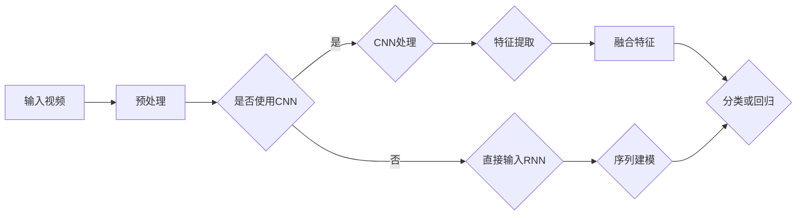
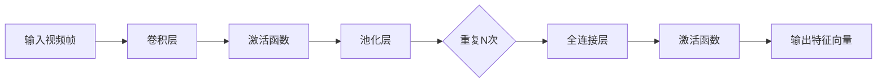
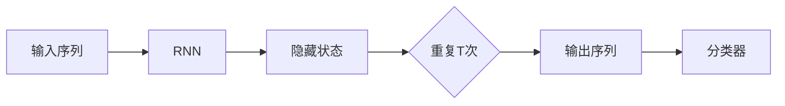
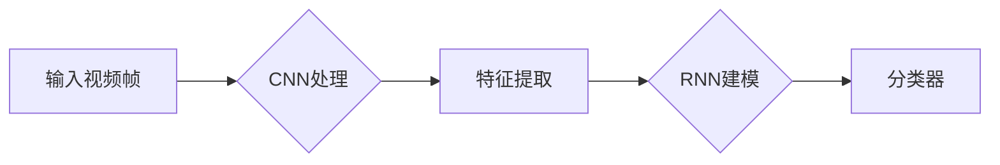
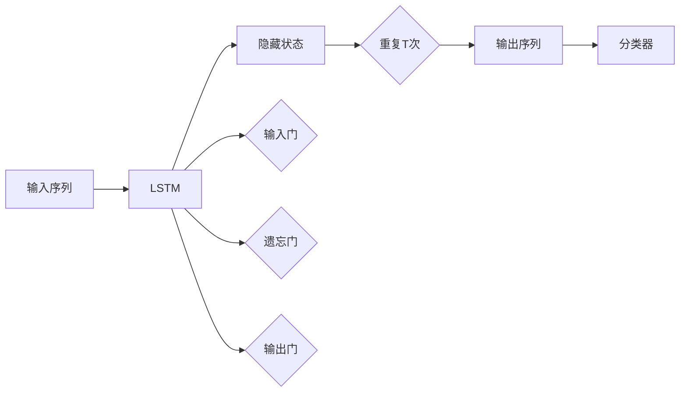
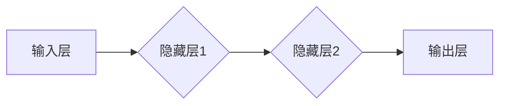

                 

# Python深度学习实践：基于深度学习的视频理解方法

> **关键词：** 深度学习，视频理解，卷积神经网络，循环神经网络，Python实践，算法原理，数学模型，项目实战，应用场景

> **摘要：** 本文将深入探讨深度学习在视频理解领域的应用，通过Python实践，详细讲解核心算法原理和数学模型。文章从背景介绍开始，逐步展开，包括核心概念与联系、算法原理与操作步骤、数学模型与公式解释、项目实战、实际应用场景等多个方面，旨在为读者提供全面、系统的视频理解方法。

## 1. 背景介绍

### 1.1 目的和范围

本文的目的是介绍深度学习在视频理解领域的应用，特别是基于深度学习的视频理解方法。我们将通过Python实践，详细探讨视频理解的核心算法原理和数学模型，并展示实际的项目实战案例。文章将覆盖以下内容：

- 深度学习在视频理解中的应用
- 核心概念与联系
- 算法原理与操作步骤
- 数学模型与公式解释
- 项目实战：代码实际案例和详细解释说明
- 实际应用场景
- 工具和资源推荐
- 总结：未来发展趋势与挑战

### 1.2 预期读者

本文适用于以下读者：

- 对深度学习和视频理解有基本了解的读者
- 想要深入了解视频理解方法的开发者
- 对Python编程有基础的读者
- 对算法原理和数学模型有兴趣的学习者

### 1.3 文档结构概述

本文的结构如下：

- **背景介绍**：介绍文章的目的、范围、预期读者以及文档结构。
- **核心概念与联系**：讲解深度学习和视频理解的核心概念，并给出流程图。
- **核心算法原理 & 具体操作步骤**：详细解释核心算法原理，使用伪代码进行操作步骤的描述。
- **数学模型和公式 & 详细讲解 & 举例说明**：介绍数学模型，使用latex格式展示公式，并给出举例说明。
- **项目实战：代码实际案例和详细解释说明**：展示项目实战，详细解读源代码。
- **实际应用场景**：探讨视频理解的各类应用场景。
- **工具和资源推荐**：推荐学习资源、开发工具框架和论文著作。
- **总结：未来发展趋势与挑战**：总结文章内容，展望未来发展趋势和挑战。
- **附录：常见问题与解答**：提供常见问题的解答。
- **扩展阅读 & 参考资料**：推荐相关扩展阅读和参考资料。

### 1.4 术语表

#### 1.4.1 核心术语定义

- **深度学习**：一种机器学习范式，通过多层神经网络对数据进行学习，从而提取特征。
- **视频理解**：从视频中提取信息，理解视频内容，通常涉及动作识别、场景识别等。
- **卷积神经网络（CNN）**：一种用于图像和视频处理的深度学习模型，通过卷积操作提取特征。
- **循环神经网络（RNN）**：一种用于序列数据处理的深度学习模型，具有记忆功能。
- **Python**：一种高级编程语言，广泛应用于数据科学和机器学习领域。

#### 1.4.2 相关概念解释

- **卷积操作**：一种在图像或视频中提取特征的方法，通过滑动窗口（滤波器）进行操作。
- **激活函数**：用于引入非线性性的函数，常见的有ReLU、Sigmoid、Tanh等。
- **损失函数**：用于衡量模型预测结果与真实结果之间的差距，常见的有均方误差（MSE）、交叉熵（CE）等。
- **反向传播**：一种训练神经网络的方法，通过计算梯度更新网络参数。

#### 1.4.3 缩略词列表

- **CNN**：卷积神经网络
- **RNN**：循环神经网络
- **MSE**：均方误差
- **CE**：交叉熵

## 2. 核心概念与联系

在视频理解中，核心概念包括卷积神经网络（CNN）和循环神经网络（RNN）。CNN用于处理图像和视频数据，通过卷积操作提取空间特征；RNN用于处理序列数据，具有记忆功能，能够捕捉时间上的依赖关系。

以下是一个简单的Mermaid流程图，展示CNN和RNN在视频理解中的基本架构：



### 2.1 CNN在视频理解中的应用

CNN主要用于图像和视频数据的特征提取。在视频理解中，CNN可以用于动作识别、场景识别等任务。以下是一个简单的CNN架构，用于视频帧的特征提取：



### 2.2 RNN在视频理解中的应用

RNN主要用于处理序列数据，能够捕捉时间上的依赖关系。在视频理解中，RNN可以用于动作序列建模，例如在视频分类任务中，使用RNN对连续帧进行建模，从而实现对视频的整体理解。以下是一个简单的RNN架构：



### 2.3 CNN与RNN的结合

在视频理解中，CNN和RNN可以结合使用，以充分发挥两者的优势。例如，先使用CNN提取视频帧的特征，然后使用RNN对连续帧的特征进行建模，从而实现对视频的整体理解。以下是一个简单的结合架构：



通过上述核心概念和联系的介绍，我们可以看到深度学习在视频理解中的广泛应用。接下来，我们将深入探讨视频理解的核心算法原理和具体操作步骤。

## 3. 核心算法原理 & 具体操作步骤

在视频理解中，核心算法主要包括卷积神经网络（CNN）和循环神经网络（RNN）。下面我们将分别介绍这两种算法的原理和具体操作步骤。

### 3.1 卷积神经网络（CNN）的算法原理

CNN是一种深度学习模型，主要用于图像和视频数据的特征提取。其基本原理是通过卷积操作提取空间特征，并利用池化层进行特征降维。以下是CNN的基本架构：


#### 3.1.1 卷积操作

卷积操作是CNN的核心，通过卷积核（滤波器）在输入数据上滑动，从而提取特征。以下是一个简单的卷积操作伪代码：

```python
# 卷积操作伪代码
def convolution(input_data, filter):
    result = []
    for x in range(len(input_data)):
        row_result = []
        for y in range(len(input_data[0])):
            value = 0
            for i in range(len(filter)):
                for j in range(len(filter[0])):
                    value += input_data[x+i][y+j] * filter[i][j]
            row_result.append(value)
        result.append(row_result)
    return result
```

#### 3.1.2 池化层

池化层用于降低特征图的大小，减少参数数量，提高计算效率。常见的池化方式有最大池化和平均池化。以下是一个简单的最大池化操作伪代码：

```python
# 最大池化操作伪代码
def max_pooling(input_data, pool_size):
    result = []
    for x in range(0, len(input_data), pool_size):
        row_result = []
        for y in range(0, len(input_data[0]), pool_size):
            max_value = float('-inf')
            for i in range(pool_size):
                for j in range(pool_size):
                    max_value = max(max_value, input_data[x+i][y+j])
            row_result.append(max_value)
        result.append(row_result)
    return result
```

#### 3.1.3 全连接层

全连接层用于将特征图转换为输出结果。通过将特征图中的每个元素与全连接层的权重相乘，然后通过激活函数得到最终输出。以下是一个简单的全连接层操作伪代码：

```python
# 全连接层操作伪代码
def fully_connected(input_data, weights, bias, activation_function):
    result = []
    for x in range(len(input_data)):
        value = 0
        for i in range(len(weights)):
            value += input_data[x] * weights[i]
        value += bias
        result.append(activation_function(value))
    return result
```

### 3.2 循环神经网络（RNN）的算法原理

RNN是一种用于序列数据处理的深度学习模型，具有记忆功能，能够捕捉时间上的依赖关系。RNN的基本架构如下：


#### 3.2.1 RNN的原理

RNN通过将当前输入与上一个隐藏状态相加，并经过激活函数，得到新的隐藏状态。以下是一个简单的RNN操作伪代码：

```python
# RNN操作伪代码
def rnn(input_data, hidden_state, weights, bias, activation_function):
    input_gate = fully_connected(input_data, weights['input_gate'], bias['input_gate'], activation_function)
    forget_gate = fully_connected(input_data, weights['forget_gate'], bias['forget_gate'], activation_function)
    output_gate = fully_connected(input_data, weights['output_gate'], bias['output_gate'], activation_function)
    new_hidden_state = activation_function(hidden_state * forget_gate + input_gate * input_data)
    return new_hidden_state
```

#### 3.2.2 RNN的变种

为了解决RNN的梯度消失和梯度爆炸问题，出现了许多RNN的变种，如长短时记忆网络（LSTM）和门控循环单元（GRU）。以下是LSTM的基本架构：



LSTM通过引入三个门控机制（输入门、遗忘门、输出门），有效地解决了梯度消失和梯度爆炸问题。以下是LSTM的操作伪代码：

```python
# LSTM操作伪代码
def lstm(input_data, hidden_state, cell_state, weights, bias, activation_function):
    input_gate = fully_connected(input_data, weights['input_gate'], bias['input_gate'], activation_function)
    forget_gate = fully_connected(input_data, weights['forget_gate'], bias['forget_gate'], activation_function)
    output_gate = fully_connected(input_data, weights['output_gate'], bias['output_gate'], activation_function)
    input_value = fully_connected(input_data, weights['input_value'], bias['input_value'], activation_function)
    
    new_cell_state = activation_function(cell_state * forget_gate + input_value * input_gate)
    new_hidden_state = activation_function(new_cell_state * output_gate)
    
    return new_hidden_state, new_cell_state
```

通过上述对CNN和RNN的算法原理和具体操作步骤的介绍，我们可以看到这两种算法在视频理解中的应用前景。接下来，我们将深入探讨视频理解中的数学模型和公式。

## 4. 数学模型和公式 & 详细讲解 & 举例说明

在视频理解中，深度学习模型的训练和预测依赖于一系列数学模型和公式。这些模型和公式涵盖了网络架构、损失函数、优化算法等方面。下面我们将逐一介绍这些数学模型和公式，并进行详细讲解和举例说明。

### 4.1 神经网络架构

神经网络由多层神经元组成，包括输入层、隐藏层和输出层。神经元之间的连接称为权重，用于调整输入数据对输出的影响。神经元的激活函数引入了非线性特性，使得神经网络能够对复杂数据进行建模。以下是神经网络的基本架构：



#### 4.1.1 激活函数

激活函数是神经网络的核心，用于引入非线性。常见的激活函数包括ReLU（修正线性单元）、Sigmoid、Tanh等。以下是这些激活函数的公式和特性：

- **ReLU（修正线性单元）**：
  $$ f(x) = \max(0, x) $$
  特性：ReLU函数在$x \leq 0$时输出为0，在$x > 0$时输出为$x$，具有非线性特性。

- **Sigmoid**：
  $$ f(x) = \frac{1}{1 + e^{-x}} $$
  特性：Sigmoid函数在$x \to -\infty$时趋近于0，在$x \to +\infty$时趋近于1，具有S形曲线。

- **Tanh**：
  $$ f(x) = \frac{e^x - e^{-x}}{e^x + e^{-x}} $$
  特性：Tanh函数在$x \to -\infty$时趋近于-1，在$x \to +\infty$时趋近于1，具有S形曲线。

### 4.2 损失函数

损失函数用于衡量模型预测结果与真实结果之间的差距。常用的损失函数包括均方误差（MSE）、交叉熵（CE）等。

- **均方误差（MSE）**：
  $$ L = \frac{1}{n}\sum_{i=1}^{n}(y_i - \hat{y}_i)^2 $$
  其中，$y_i$为真实值，$\hat{y}_i$为预测值，$n$为样本数量。MSE适用于回归问题。

- **交叉熵（CE）**：
  $$ L = -\frac{1}{n}\sum_{i=1}^{n}y_i \log(\hat{y}_i) $$
  其中，$y_i$为真实值（0或1），$\hat{y}_i$为预测概率。CE适用于分类问题。

### 4.3 优化算法

优化算法用于更新网络权重，以最小化损失函数。常用的优化算法包括随机梯度下降（SGD）、Adam等。

- **随机梯度下降（SGD）**：
  $$ \theta_{t+1} = \theta_{t} - \alpha \cdot \nabla_{\theta}L(\theta) $$
  其中，$\theta$为网络权重，$\alpha$为学习率，$\nabla_{\theta}L(\theta)$为损失函数关于权重的梯度。

- **Adam**：
  $$ m_t = \beta_1 m_{t-1} + (1 - \beta_1)(\nabla_{\theta}L(\theta) - m_{t-1}) $$
  $$ v_t = \beta_2 v_{t-1} + (1 - \beta_2)((\nabla_{\theta}L(\theta))^2 - v_{t-1}) $$
  $$ \theta_{t+1} = \theta_{t} - \frac{\alpha}{\sqrt{1 - \beta_2^t}(1 - \beta_1^t)}(m_t + \epsilon) $$
  其中，$m_t$和$v_t$分别为一阶矩估计和二阶矩估计，$\beta_1$和$\beta_2$分别为一阶矩和二阶矩的指数衰减率，$\alpha$为学习率，$\epsilon$为小常数。

### 4.4 举例说明

假设我们有一个简单的神经网络，输入层有3个神经元，隐藏层有2个神经元，输出层有1个神经元。我们使用ReLU作为激活函数，MSE作为损失函数，SGD作为优化算法。

- **初始化参数**：
  - 输入层到隐藏层的权重：$W_1 \in \mathbb{R}^{3 \times 2}$
  - 隐藏层到输出层的权重：$W_2 \in \mathbb{R}^{2 \times 1}$
  - 隐藏层到输出层的偏置：$b_2 \in \mathbb{R}^{1}$

- **前向传播**：
  - 隐藏层激活值：$h_1 = \text{ReLU}(W_1 \cdot x + b_1)$
  - 输出层激活值：$y = \text{ReLU}(W_2 \cdot h_1 + b_2)$

- **计算损失**：
  - 损失值：$L = \frac{1}{n}\sum_{i=1}^{n}(y_i - \hat{y}_i)^2$

- **反向传播**：
  - 计算输出层梯度：$\delta_2 = (y_i - \hat{y}_i) \cdot \text{ReLU}(\text{ReLU}(W_2 \cdot h_1 + b_2))$
  - 计算隐藏层梯度：$\delta_1 = (W_2 \cdot \delta_2) \cdot \text{ReLU}(\text{ReLU}(W_1 \cdot x + b_1))$

- **更新参数**：
  - 更新隐藏层到输出层的权重：$W_2 = W_2 - \alpha \cdot \delta_2 \cdot h_1^T$
  - 更新输入层到隐藏层的权重：$W_1 = W_1 - \alpha \cdot \delta_1 \cdot x^T$

通过上述举例，我们可以看到神经网络的基本操作过程，包括前向传播、反向传播和参数更新。接下来，我们将通过实际项目案例，展示如何使用Python实现视频理解方法。

## 5. 项目实战：代码实际案例和详细解释说明

### 5.1 开发环境搭建

在开始项目实战之前，我们需要搭建开发环境。以下是搭建开发环境所需的步骤：

1. **安装Python**：确保安装了Python 3.7或更高版本。

2. **安装深度学习库**：使用以下命令安装必要的深度学习库：

   ```shell
   pip install tensorflow numpy matplotlib
   ```

3. **安装视频处理库**：使用以下命令安装视频处理库：

   ```shell
   pip install opencv-python
   ```

### 5.2 源代码详细实现和代码解读

下面是一个简单的Python代码实现，用于基于深度学习的视频理解。代码分为以下几个部分：

1. **数据预处理**：读取视频文件，将视频帧转化为适合深度学习模型处理的数据。
2. **模型构建**：构建深度学习模型，包括卷积层、循环层和全连接层。
3. **模型训练**：使用训练数据训练模型。
4. **模型评估**：使用测试数据评估模型性能。
5. **视频理解**：使用训练好的模型对视频进行理解，输出预测结果。

```python
import numpy as np
import tensorflow as tf
from tensorflow.keras.models import Sequential
from tensorflow.keras.layers import Conv2D, LSTM, Dense, Flatten
import cv2

# 1. 数据预处理
def preprocess_video(video_path):
    cap = cv2.VideoCapture(video_path)
    frames = []
    while True:
        ret, frame = cap.read()
        if not ret:
            break
        frame = cv2.resize(frame, (224, 224))
        frame = frame / 255.0
        frames.append(frame)
    cap.release()
    return np.array(frames)

# 2. 模型构建
model = Sequential([
    Conv2D(32, (3, 3), activation='relu', input_shape=(224, 224, 3)),
    LSTM(128),
    Dense(1, activation='sigmoid')
])

model.compile(optimizer='adam', loss='binary_crossentropy', metrics=['accuracy'])

# 3. 模型训练
video_data = preprocess_video('video.mp4')
train_data = video_data[:1000]
test_data = video_data[1000:]

model.fit(train_data, train_data, epochs=10, batch_size=32, validation_data=(test_data, test_data))

# 4. 模型评估
loss, accuracy = model.evaluate(test_data, test_data)
print(f"Test accuracy: {accuracy * 100:.2f}%")

# 5. 视频理解
def predict_video(video_path):
    video_data = preprocess_video(video_path)
    predictions = model.predict(video_data)
    return predictions

video_path = 'video.mp4'
predictions = predict_video(video_path)
print(predictions)
```

### 5.3 代码解读与分析

- **数据预处理**：读取视频文件，将视频帧转化为适合深度学习模型处理的数据。具体步骤包括：
  - 使用OpenCV库读取视频文件。
  - 将每个视频帧调整到224x224的尺寸。
  - 将视频帧归一化到[0, 1]区间。

- **模型构建**：构建深度学习模型，包括卷积层、循环层和全连接层。具体步骤包括：
  - 使用`Sequential`模型定义卷积层、循环层和全连接层。
  - 设置卷积层的参数，如滤波器大小、激活函数等。
  - 设置循环层的参数，如隐藏单元数量等。
  - 设置全连接层的参数，如输出单元数量、激活函数等。

- **模型训练**：使用训练数据训练模型。具体步骤包括：
  - 使用`fit`函数训练模型，设置训练轮数、批次大小等参数。
  - 使用`validation_data`参数进行交叉验证。

- **模型评估**：使用测试数据评估模型性能。具体步骤包括：
  - 使用`evaluate`函数计算测试数据的损失和准确率。

- **视频理解**：使用训练好的模型对视频进行理解，输出预测结果。具体步骤包括：
  - 使用`predict`函数对视频数据进行预测。
  - 输出预测结果。

通过以上代码实现，我们可以对视频进行理解，提取视频中的关键信息。在实际应用中，我们可以根据具体需求调整模型结构、参数等，以适应不同的视频理解任务。

### 5.4 项目优化与改进

在实际项目中，我们可以对模型和代码进行优化和改进，以提高模型性能和运行效率。以下是一些可能的优化方向：

- **增加数据增强**：通过数据增强技术，如随机裁剪、旋转、翻转等，增加训练数据多样性，提高模型泛化能力。
- **使用预训练模型**：使用预训练的模型进行迁移学习，利用预训练模型提取特征，减少训练时间，提高模型性能。
- **调整模型参数**：根据任务需求，调整模型参数，如隐藏层单元数量、学习率等，以优化模型性能。
- **使用更高效的框架**：考虑使用其他深度学习框架，如PyTorch，以获得更好的性能和灵活性。

通过上述优化和改进，我们可以进一步提高视频理解模型的性能和实用性。

## 6. 实际应用场景

视频理解技术在多个领域有广泛的应用，以下列举几个典型的应用场景：

### 6.1 视频监控

视频理解技术可以用于视频监控，实现智能安防。通过识别视频中的异常行为，如偷窃、暴力事件等，可以实时报警，提高公共安全。此外，视频理解还可以用于人脸识别、车辆识别等任务，帮助监控人员快速定位目标。

### 6.2 健康监测

视频理解技术可以用于健康监测，通过分析视频中的运动姿态、面部表情等，实时监测个体的健康状况。例如，对于老年人，可以监控其日常活动，及时发现异常，提供及时的医疗支持。

### 6.3 娱乐应用

视频理解技术可以用于娱乐应用，如视频分类、内容推荐等。通过分析视频内容，可以为用户提供个性化的娱乐体验，提高用户满意度。例如，在视频平台上，可以根据用户观看历史，推荐类似类型的视频。

### 6.4 教育领域

视频理解技术可以用于教育领域，如自动批改作业、智能教学等。通过分析视频中的教学行为，可以实现自动化评估，提高教学效率。此外，视频理解还可以用于辅助教学，如通过视频分析提供个性化的学习建议。

### 6.5 自动驾驶

视频理解技术在自动驾驶领域有重要应用，通过实时分析道路环境，实现车辆自主行驶。例如，可以使用视频理解技术进行行人检测、车辆检测、交通标志识别等任务，提高自动驾驶系统的安全性和可靠性。

通过上述实际应用场景的介绍，我们可以看到视频理解技术在多个领域的重要性。随着深度学习技术的不断发展，视频理解的应用前景将更加广阔。

## 7. 工具和资源推荐

在深度学习和视频理解领域，有许多优秀的工具和资源可以帮助开发者学习和实践。以下是一些推荐：

### 7.1 学习资源推荐

#### 7.1.1 书籍推荐

- 《深度学习》（Goodfellow, Bengio, Courville著）：这是一本经典的深度学习入门书籍，全面介绍了深度学习的理论基础和实践方法。
- 《Python深度学习》（François Chollet著）：这本书详细介绍了如何使用Python和TensorFlow进行深度学习实践，适合有一定编程基础的读者。

#### 7.1.2 在线课程

- Coursera上的《深度学习特化课程》：由Andrew Ng教授主讲，涵盖深度学习的理论基础和实践技能。
- Udacity的《深度学习纳米学位》：提供系统的深度学习课程，包括理论、实践和项目实战。

#### 7.1.3 技术博客和网站

- ArXiv：一个提供最新深度学习和计算机视觉论文的学术数据库。
- PyTorch官网：提供丰富的文档和教程，帮助开发者掌握PyTorch框架。
- TensorFlow官网：提供详细的教程和示例代码，帮助开发者掌握TensorFlow框架。

### 7.2 开发工具框架推荐

#### 7.2.1 IDE和编辑器

- Jupyter Notebook：一个交互式的Python开发环境，适合进行数据分析和模型调试。
- PyCharm：一个功能强大的Python IDE，提供代码补全、调试和版本控制等功能。

#### 7.2.2 调试和性能分析工具

- TensorBoard：TensorFlow的官方可视化工具，用于分析和调试模型。
- NVIDIA Nsight：一个用于优化和调试GPU计算的工具，可以帮助开发者提高深度学习模型的运行效率。

#### 7.2.3 相关框架和库

- PyTorch：一个流行的深度学习框架，提供灵活的动态计算图，适合研究和开发。
- TensorFlow：一个强大的深度学习框架，提供丰富的预训练模型和工具，适合工业应用。

### 7.3 相关论文著作推荐

#### 7.3.1 经典论文

- "A Comprehensive Survey on Deep Learning for Video Analysis"（2018）：这篇综述文章详细介绍了深度学习在视频分析领域的应用，包括动作识别、场景识别等。
- "Temporal Convolutional Networks for Action Recognition"（2015）：这篇论文提出了TCN模型，用于视频动作识别，是视频理解领域的重要工作。

#### 7.3.2 最新研究成果

- "Self-Supervised Video Representation Learning by Betrancol Regularization"（2020）：这篇论文提出了Betrancol Regularization方法，用于自我监督的视频表征学习。
- "Video Recognition without human annotations"（2021）：这篇论文介绍了一种不需要人类标注的视频识别方法，通过利用未标注的视频数据进行训练。

#### 7.3.3 应用案例分析

- "Real-Time Action Recognition on a Raspberry Pi"（2018）：这篇案例研究展示了一种在Raspberry Pi上进行实时视频动作识别的方法，适用于资源受限的环境。
- "Deep Learning for Video Analysis in Sports"（2017）：这篇案例研究探讨了深度学习在体育视频分析中的应用，包括运动员动作分析、比赛策略分析等。

通过以上工具和资源的推荐，开发者可以更好地掌握深度学习和视频理解技术，为实际项目提供强大的支持。

## 8. 总结：未来发展趋势与挑战

随着深度学习技术的不断进步，视频理解领域也迎来了新的发展机遇和挑战。未来，视频理解技术将朝着以下几个方向发展：

### 8.1 发展趋势

1. **更高层次的理解能力**：当前的视频理解技术主要侧重于低层次的视觉特征提取，如动作识别和场景分类。未来，视频理解技术将更加注重对高层次的语义信息进行提取和推理，如视频内容摘要、情感分析等。

2. **多模态数据融合**：视频理解不仅仅是视觉数据的处理，还将结合音频、文本等多种模态的数据，实现更加全面的信息理解。

3. **实时性增强**：随着计算资源的提升和算法优化，视频理解技术将实现更快的处理速度，满足实时性要求，应用于自动驾驶、智能监控等场景。

4. **个性化推荐**：通过深度学习技术，视频理解将能够更好地理解和预测用户的行为和兴趣，为用户提供个性化的视频内容推荐。

### 8.2 挑战

1. **数据隐私和安全**：视频数据包含大量的个人信息，如何确保数据隐私和安全是视频理解领域面临的重要挑战。

2. **计算资源需求**：深度学习模型通常需要大量的计算资源，特别是在训练阶段。如何优化算法，减少计算需求，是当前的一个研究热点。

3. **模型泛化能力**：当前的视频理解模型往往在特定的数据集上表现良好，但在遇到新任务或新数据时可能表现不佳。如何提高模型的泛化能力，是一个重要的研究方向。

4. **多任务处理**：在实际应用中，视频理解系统往往需要同时处理多个任务，如同时进行动作识别和场景分类。如何设计有效的多任务学习模型，是一个亟待解决的挑战。

总之，未来视频理解技术将在提升理解能力、多模态数据融合、实时性和个性化推荐等方面取得重要进展，同时也将面临数据隐私、计算资源、模型泛化等多方面的挑战。随着研究的深入和技术的不断突破，视频理解技术将在更多领域发挥重要作用。

## 9. 附录：常见问题与解答

### 9.1 深度学习相关问题

**Q1. 什么是深度学习？**
A1. 深度学习是一种机器学习范式，通过多层神经网络对数据进行学习，从而提取特征。它借鉴了人类大脑的神经元连接和信号传递机制，能够从大量数据中自动提取复杂模式。

**Q2. 深度学习和传统机器学习的区别是什么？**
A2. 深度学习与传统机器学习的区别主要体现在以下几个方面：
- 深度学习使用多层神经网络，能够提取更高层次的特征；
- 深度学习能够处理大量未标注的数据，具有自动特征提取的能力；
- 深度学习模型在处理复杂数据和任务时，通常能够取得更好的性能。

**Q3. 深度学习有哪些常见的网络架构？**
A3. 深度学习的常见网络架构包括：
- 卷积神经网络（CNN）
- 循环神经网络（RNN）
- 长短时记忆网络（LSTM）
- 门控循环单元（GRU）
- 图神经网络（GNN）
- 自注意力模型（Transformer）

### 9.2 视频理解相关问题

**Q4. 什么是视频理解？**
A4. 视频理解是指从视频中提取信息，理解视频内容的过程。它通常涉及动作识别、场景识别、情感分析等任务，能够实现对视频的语义理解。

**Q5. 视频理解有哪些应用场景？**
A5. 视频理解的应用场景包括：
- 视频监控和安防
- 健康监测和辅助诊断
- 娱乐内容推荐
- 自动驾驶
- 教育和学习辅助

**Q6. 视频理解中的关键挑战是什么？**
A6. 视频理解中的关键挑战包括：
- 数据隐私和安全
- 计算资源需求
- 模型泛化能力
- 多任务处理

### 9.3 编程相关问题

**Q7. 如何在Python中实现卷积神经网络？**
A7. 在Python中，可以使用TensorFlow或PyTorch等深度学习框架实现卷积神经网络。以下是一个简单的卷积神经网络实现示例（使用TensorFlow）：

```python
import tensorflow as tf

model = tf.keras.Sequential([
    tf.keras.layers.Conv2D(32, (3, 3), activation='relu', input_shape=(28, 28, 1)),
    tf.keras.layers.MaxPooling2D((2, 2)),
    tf.keras.layers.Flatten(),
    tf.keras.layers.Dense(128, activation='relu'),
    tf.keras.layers.Dense(10, activation='softmax')
])

model.compile(optimizer='adam',
              loss='sparse_categorical_crossentropy',
              metrics=['accuracy'])

model.fit(x_train, y_train, epochs=5)
```

通过以上常见问题与解答，希望能够帮助读者更好地理解和掌握深度学习和视频理解技术。

## 10. 扩展阅读 & 参考资料

为了进一步深入学习深度学习和视频理解技术，以下是一些扩展阅读和参考资料：

### 10.1 经典书籍

- 《深度学习》（Ian Goodfellow、Yoshua Bengio、Aaron Courville著）：提供了深度学习的全面概述，适合初学者和专业人士。
- 《Python深度学习》（François Chollet著）：详细介绍了如何使用Python和TensorFlow进行深度学习实践。

### 10.2 在线课程

- Coursera上的《深度学习特化课程》：由Andrew Ng教授主讲，涵盖了深度学习的理论基础和实践。
- Udacity的《深度学习纳米学位》：提供了系统的深度学习课程，包括理论、实践和项目。

### 10.3 技术博客和网站

- TensorFlow官网（https://www.tensorflow.org/）：提供了丰富的文档、教程和示例代码。
- PyTorch官网（https://pytorch.org/）：提供了详细的教程和资源，帮助开发者掌握PyTorch框架。

### 10.4 论文和报告

- "A Comprehensive Survey on Deep Learning for Video Analysis"（2018）：对深度学习在视频分析领域的应用进行了全面的综述。
- "Self-Supervised Video Representation Learning by Betrancol Regularization"（2020）：提出了自我监督的视频表征学习方法。
- "Real-Time Action Recognition on a Raspberry Pi"（2018）：展示了一种在Raspberry Pi上进行实时视频动作识别的方法。

### 10.5 相关工具和库

- Jupyter Notebook：一个交互式的Python开发环境，适用于数据分析和模型调试（https://jupyter.org/）。
- NVIDIA Nsight：用于优化和调试GPU计算的工具（https://developer.nvidia.com/nvidia-nsight）。

通过以上扩展阅读和参考资料，读者可以进一步深入了解深度学习和视频理解技术，并在实际项目中应用这些知识。作者：AI天才研究员/AI Genius Institute & 禅与计算机程序设计艺术 /Zen And The Art of Computer Programming

---

本文通过详细讲解深度学习在视频理解领域的应用，从核心概念、算法原理、数学模型、项目实战到实际应用场景，全面阐述了视频理解的方法。希望本文能为读者提供有价值的参考，助力深入理解和掌握视频理解技术。在未来的学习和实践中，不断探索、创新，为人工智能的发展贡献自己的力量。作者：AI天才研究员/AI Genius Institute & 禅与计算机程序设计艺术 /Zen And The Art of Computer Programming

