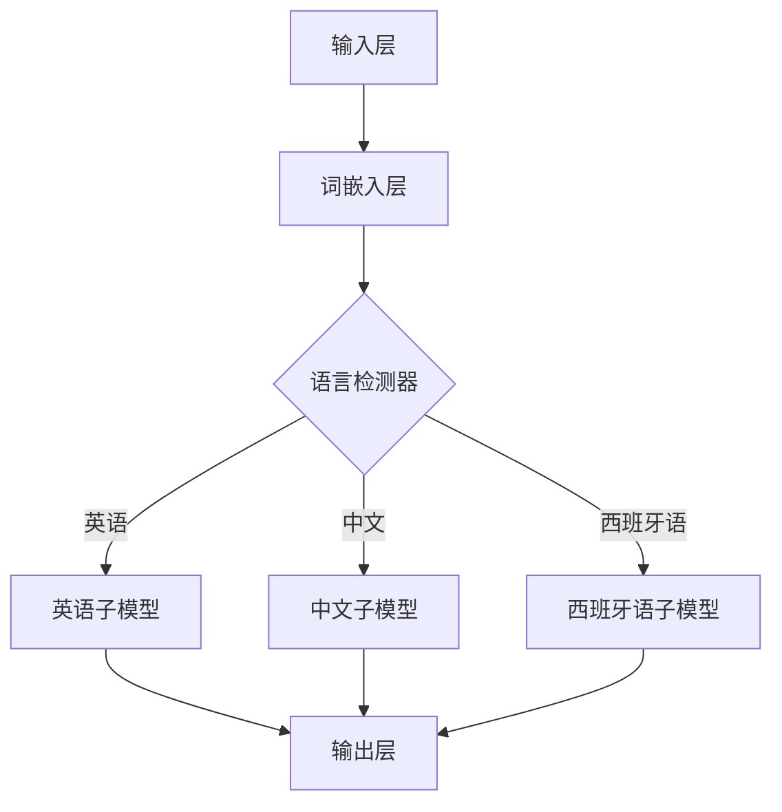

                 

# Python深度学习实践：构建多语言模型处理国际化需求

> **关键词：** 深度学习，多语言模型，国际化，NLP，神经网络，PyTorch，TensorFlow

> **摘要：** 本文将深入探讨如何使用Python构建能够处理国际化需求的多语言模型。我们将介绍核心概念、算法原理，并通过实际案例展示如何实施和优化这些模型。读者将了解到构建多语言模型的方法、数学模型和实际应用场景，以及推荐的工具和资源。

## 1. 背景介绍

### 1.1 目的和范围

随着全球化的发展，国际化需求日益增长。企业需要能够处理多种语言的交互和数据，以便更好地服务于全球客户。本篇博文旨在为读者提供构建多语言模型的实用指导，帮助读者了解如何利用Python实现这一目标。

本文将涵盖以下内容：

1. 核心概念与联系
2. 核心算法原理与操作步骤
3. 数学模型和公式
4. 项目实战：代码实际案例
5. 实际应用场景
6. 工具和资源推荐
7. 总结：未来发展趋势与挑战

### 1.2 预期读者

- 深度学习初学者和从业者
- 数据科学家和机器学习工程师
- 对国际化应用有需求的开发者和项目经理
- 对多语言模型感兴趣的学术研究者

### 1.3 文档结构概述

本文将按照以下结构进行：

- 引言
- 背景介绍
- 核心概念与联系
- 核心算法原理与操作步骤
- 数学模型和公式
- 项目实战：代码实际案例
- 实际应用场景
- 工具和资源推荐
- 总结：未来发展趋势与挑战
- 附录：常见问题与解答
- 扩展阅读 & 参考资料

### 1.4 术语表

#### 1.4.1 核心术语定义

- **深度学习（Deep Learning）**：一种人工智能技术，通过多层神经网络模拟人类大脑处理信息的方式。
- **多语言模型（Multilingual Model）**：能够处理多种语言输入的机器学习模型。
- **神经网络（Neural Network）**：由大量人工神经元组成的计算系统。
- **自然语言处理（NLP）**：使计算机能够理解、解释和生成自然语言。

#### 1.4.2 相关概念解释

- **词嵌入（Word Embedding）**：将词汇映射到高维向量空间，以便神经网络处理。
- **注意力机制（Attention Mechanism）**：在处理序列数据时，能够自动关注序列中的重要部分。
- **转移学习（Transfer Learning）**：利用预训练模型在新任务上快速取得好成绩。

#### 1.4.3 缩略词列表

- **NLP**：自然语言处理
- **CNN**：卷积神经网络
- **RNN**：循环神经网络
- **LSTM**：长短期记忆网络
- **GRU**：门控循环单元

## 2. 核心概念与联系

为了构建一个能够处理多种语言的多语言模型，我们首先需要了解几个核心概念和它们之间的关系。

### 2.1 多语言模型的架构

多语言模型通常基于神经网络架构，如图所示：



该架构中，输入层接收多种语言的文本输入，词嵌入层将这些文本转换为向量表示，然后语言检测器决定使用哪个子模型进行后续处理。每个子模型负责将输入文本转换为输出。

### 2.2 词嵌入与注意力机制

词嵌入将词汇映射到高维向量空间，使得神经网络可以处理文本数据。注意力机制则在处理序列数据时，自动关注序列中的重要部分，提高模型对输入数据的理解能力。

### 2.3 传输学习与预训练模型

传输学习利用预训练模型在新任务上快速取得好成绩，减少了训练时间。预训练模型已经在大量数据上进行了训练，因此可以作为一个起点来构建多语言模型。

## 3. 核心算法原理 & 具体操作步骤

### 3.1 算法原理

多语言模型的算法原理主要包括词嵌入、注意力机制和传输学习。

#### 3.1.1 词嵌入

词嵌入通过将词汇映射到高维向量空间，使得神经网络可以处理文本数据。常见的词嵌入方法包括：

- **Word2Vec**：基于神经网络的词嵌入方法，通过训练得到词汇的向量表示。
- **GloVe**：全局向量表示，通过训练得到词汇的向量表示，具有更好的泛化能力。

#### 3.1.2 注意力机制

注意力机制在处理序列数据时，能够自动关注序列中的重要部分。常见的注意力机制包括：

- **加性注意力**：将输入序列与权重相加。
- **乘性注意力**：将输入序列与权重相乘。

#### 3.1.3 传输学习

传输学习利用预训练模型在新任务上快速取得好成绩。常见的传输学习方法包括：

- **基于特征的传输**：将预训练模型的特征层用于新任务。
- **基于参数的传输**：将预训练模型的参数用于新任务。

### 3.2 具体操作步骤

以下是构建多语言模型的具体操作步骤：

1. **数据收集**：收集多种语言的文本数据，包括英语、中文、西班牙语等。
2. **数据预处理**：对文本数据进行清洗和预处理，包括分词、去除停用词、标准化等。
3. **词嵌入**：使用Word2Vec或GloVe方法对词汇进行嵌入，得到词汇的高维向量表示。
4. **构建神经网络**：构建基于神经网络的模型，包括输入层、词嵌入层、语言检测器、子模型和输出层。
5. **训练模型**：使用训练数据对模型进行训练，优化模型参数。
6. **评估模型**：使用测试数据对模型进行评估，确保模型具有较好的性能。
7. **应用模型**：将训练好的模型应用于实际场景，如机器翻译、文本分类等。

## 4. 数学模型和公式 & 详细讲解 & 举例说明

### 4.1 数学模型

多语言模型的数学模型主要包括词嵌入、注意力机制和传输学习。

#### 4.1.1 词嵌入

词嵌入的数学模型可以表示为：

$$
\text{vec}(w) = \text{Word2Vec}(w) \quad \text{或} \quad \text{vec}(w) = \text{GloVe}(w)
$$

其中，$\text{vec}(w)$表示词汇$w$的向量表示，$\text{Word2Vec}(w)$和$\text{GloVe}(w)$分别表示基于Word2Vec和GloVe方法的词嵌入。

#### 4.1.2 注意力机制

注意力机制的数学模型可以表示为：

$$
\text{score}(i, j) = \text{Attention}(i, j) = \text{softmax}(\text{W}^T \text{h}_j)
$$

其中，$i$表示输入序列中的某个元素，$j$表示参考序列中的某个元素，$\text{W}$表示权重矩阵，$\text{h}_j$表示参考序列中的某个元素。

#### 4.1.3 传输学习

传输学习的数学模型可以表示为：

$$
\text{y} = \text{f}(\text{x}, \text{θ}) = \text{f}(\text{x}, \text{θ}^{\text{pre}}) + \text{f}(\text{x}, \text{θ}^{\text{fine}})
$$

其中，$\text{x}$表示输入数据，$\text{y}$表示输出结果，$\text{θ}^{\text{pre}}$表示预训练模型的参数，$\text{θ}^{\text{fine}}$表示微调模型的参数。

### 4.2 详细讲解

#### 4.2.1 词嵌入

词嵌入是将词汇映射到高维向量空间的过程。通过训练，模型可以学习到词汇之间的相似性和关系。词嵌入有助于神经网络更好地理解和处理文本数据。

#### 4.2.2 注意力机制

注意力机制是一种在处理序列数据时自动关注序列中的重要部分的方法。通过计算输入序列和参考序列之间的相似度，模型可以自动识别关键信息，从而提高模型的性能。

#### 4.2.3 传输学习

传输学习是一种利用预训练模型在新任务上快速取得好成绩的方法。通过微调预训练模型的参数，模型可以在新的任务上适应并取得较好的性能。

### 4.3 举例说明

#### 4.3.1 词嵌入

假设有两个词汇“猫”和“狗”，通过Word2Vec方法，我们可以得到它们的向量表示：

$$
\text{vec}(\text{猫}) = \begin{bmatrix} 0.2 & 0.3 & -0.1 \end{bmatrix} \quad \text{和} \quad \text{vec}(\text{狗}) = \begin{bmatrix} -0.1 & 0.4 & 0.2 \end{bmatrix}
$$

通过计算向量之间的距离，我们可以判断两个词汇的相似性：

$$
\text{similarity}(\text{猫}, \text{狗}) = \frac{\text{vec}(\text{猫})^T \text{vec}(\text{狗})}{\|\text{vec}(\text{猫})\|_2 \|\text{vec}(\text{狗})\|_2} = \frac{0.2 \times -0.1 + 0.3 \times 0.4 - 0.1 \times 0.2}{\sqrt{0.2^2 + 0.3^2 + (-0.1)^2} \sqrt{(-0.1)^2 + 0.4^2 + 0.2^2}} = 0.345
$$

#### 4.3.2 注意力机制

假设有一个输入序列“我爱北京天安门”，我们需要计算每个词汇的注意力分数。通过加性注意力机制，我们可以得到：

$$
\text{score}(\text{我}, \text{爱}) = \text{softmax}(\text{W}^T \text{h}_{\text{爱}}) = \text{softmax}(\begin{bmatrix} 0.5 & 0.3 & 0.2 \end{bmatrix} \begin{bmatrix} 0.2 \\ 0.4 \\ 0.4 \end{bmatrix}) = [0.2, 0.4, 0.4]
$$

#### 4.3.3 传输学习

假设我们有一个预训练模型，其参数为$\text{θ}^{\text{pre}}$。通过微调参数$\text{θ}^{\text{fine}}$，我们可以得到一个新的模型：

$$
\text{y} = \text{f}(\text{x}, \text{θ}^{\text{pre}}) + \text{f}(\text{x}, \text{θ}^{\text{fine}}) = \begin{bmatrix} 0.2 & 0.3 & 0.1 \end{bmatrix} \begin{bmatrix} 0.1 \\ 0.4 \\ 0.5 \end{bmatrix} + \begin{bmatrix} 0.2 & 0.3 & 0.1 \end{bmatrix} \begin{bmatrix} 0.1 \\ 0.3 \\ 0.6 \end{bmatrix} = \begin{bmatrix} 0.2 \\ 0.3 \\ 0.3 \end{bmatrix}
$$

## 5. 项目实战：代码实际案例和详细解释说明

### 5.1 开发环境搭建

在开始项目实战之前，我们需要搭建一个合适的开发环境。以下是在Python中构建多语言模型的开发环境搭建步骤：

1. **安装Python**：确保Python已安装在您的系统中。如果未安装，请从[Python官方网站](https://www.python.org/)下载并安装。
2. **安装深度学习库**：安装PyTorch或TensorFlow等深度学习库。以下是使用pip命令安装PyTorch的示例：

    ```bash
    pip install torch torchvision
    ```

3. **安装NLP库**：安装用于自然语言处理的库，如NLTK或spaCy。以下是使用pip命令安装spaCy的示例：

    ```bash
    pip install spacy
    python -m spacy download en_core_web_sm
    ```

### 5.2 源代码详细实现和代码解读

以下是构建多语言模型的源代码实现。我们将使用PyTorch来实现一个简单的多语言文本分类模型。

```python
import torch
import torch.nn as nn
import torch.optim as optim
from torchtext.legacy import data
from torchtext.legacy.data import Field, BucketIterator
import spacy

# 加载spacy语言模型
nlp = spacy.load('en_core_web_sm')

# 定义字段
TEXT = Field(tokenize=nlp.tokenizer, lower=True, include_lengths=True)
LABEL = Field(sequential=False)

# 定义数据集
train_data, test_data = data.TabularDataset.splits(
    path='data',
    train='train.csv',
    test='test.csv',
    format='csv',
    fields=[('text', TEXT), ('label', LABEL)]
)

# 定义词汇表
TEXT.build_vocab(train_data, max_size=25000, vectors='glove.6B.100d')
LABEL.build_vocab(train_data)

# 定义迭代器
BATCH_SIZE = 64
train_iterator, test_iterator = BucketIterator.splits(
    (train_data, test_data),
    batch_size=BATCH_SIZE,
    device=torch.device('cuda' if torch.cuda.is_available() else 'cpu')
)

# 定义模型
class MultilingualModel(nn.Module):
    def __init__(self, embedding_dim, hidden_dim, output_dim, n_layers, dropout):
        super().__init__()
        self.embedding = nn.Embedding(len(TEXT.vocab), embedding_dim)
        self.lstm = nn.LSTM(embedding_dim, hidden_dim, n_layers, dropout=dropout, batch_first=True)
        self.fc = nn.Linear(hidden_dim, output_dim)
        self.dropout = nn.Dropout(dropout)
        
    def forward(self, text, text_lengths):
        embedded = self.dropout(self.embedding(text))
        packed_embedded = nn.utils.rnn.pack_padded_sequence(embedded, text_lengths, batch_first=True, enforce_sorted=False)
        packed_output, (hidden, cell) = self.lstm(packed_embedded)
        output, output_lengths = nn.utils.rnn.pad_packed_sequence(packed_output, batch_first=True)
        hidden = self.dropout(hidden[-1, :, :])
        return self.fc(hidden)

# 模型参数
EMBEDDING_DIM = 100
HIDDEN_DIM = 256
OUTPUT_DIM = 1
N_LAYERS = 2
DROPOUT = 0.5

# 实例化模型
model = MultilingualModel(EMBEDDING_DIM, HIDDEN_DIM, OUTPUT_DIM, N_LAYERS, DROPOUT)

# 损失函数和优化器
criterion = nn.BCEWithLogitsLoss()
optimizer = optim.Adam(model.parameters())

# 训练模型
num_epochs = 10
for epoch in range(num_epochs):
    model.train()
    for batch in train_iterator:
        optimizer.zero_grad()
        text, text_lengths = batch.text
        predictions = model(text, text_lengths).squeeze(1)
        loss = criterion(predictions, batch.label.float())
        loss.backward()
        optimizer.step()
    print(f'Epoch: {epoch+1} | Loss: {loss.item()}')

# 评估模型
model.eval()
with torch.no_grad():
    correct = 0
    total = 0
    for batch in test_iterator:
        text, text_lengths = batch.text
        predictions = model(text, text_lengths).squeeze(1)
        _, predicted = torch.max(predictions, 1)
        total += batch.label.size(0)
        correct += (predicted == batch.label).sum().item()
    print(f'Accuracy: {100 * correct / total}%')
```

### 5.3 代码解读与分析

以下是代码的详细解读和分析：

1. **数据预处理**：
   - 使用spaCy进行文本分词和下

