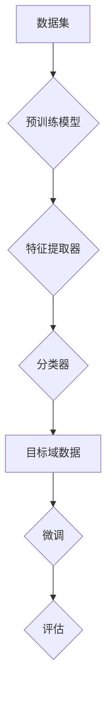

                 

# Python深度学习实践：运用迁移学习提升模型效能

> 关键词：Python、深度学习、迁移学习、模型效能、模型优化

> 摘要：本文将探讨深度学习领域中的一种重要技术——迁移学习，并详细介绍其在Python中的实践应用。通过一系列具体的案例和代码解读，读者将深入理解迁移学习的原理及其在提升模型效能方面的应用。

## 1. 背景介绍

### 1.1 目的和范围

本文旨在帮助读者理解迁移学习在深度学习中的应用，并通过Python实践案例展示如何通过迁移学习提升模型效能。本文将涵盖以下内容：

1. 迁移学习的核心概念及其在深度学习中的重要性。
2. 迁移学习的实现原理和具体操作步骤。
3. 数学模型和公式讲解。
4. 实际项目中的代码实现和解读。
5. 迁移学习在实际应用场景中的运用。
6. 学习资源、工具和框架推荐。
7. 未来发展趋势与挑战。

### 1.2 预期读者

本文适合对深度学习有一定了解的读者，尤其是希望掌握迁移学习技术并应用到实际项目中的开发者。无论您是数据科学家、机器学习工程师还是深度学习研究者，本文都将为您提供有价值的见解和实践经验。

### 1.3 文档结构概述

本文将按照以下结构进行组织：

1. **背景介绍**：概述迁移学习的目的和范围，介绍预期读者和文档结构。
2. **核心概念与联系**：详细解释迁移学习的核心概念，提供流程图。
3. **核心算法原理 & 具体操作步骤**：使用伪代码详细阐述迁移学习的算法原理和操作步骤。
4. **数学模型和公式 & 详细讲解 & 举例说明**：介绍与迁移学习相关的数学模型和公式，并进行举例说明。
5. **项目实战：代码实际案例和详细解释说明**：展示迁移学习在项目中的实际应用，提供详细的代码解读。
6. **实际应用场景**：分析迁移学习在不同领域中的应用案例。
7. **工具和资源推荐**：推荐学习资源、开发工具和框架。
8. **总结：未来发展趋势与挑战**：总结迁移学习的现状和未来发展趋势。
9. **附录：常见问题与解答**：解答读者可能遇到的问题。
10. **扩展阅读 & 参考资料**：提供额外的阅读材料和参考资料。

### 1.4 术语表

#### 1.4.1 核心术语定义

- **迁移学习**（Transfer Learning）：一种机器学习方法，它利用预训练模型在新的任务上取得更好的性能。
- **预训练模型**（Pre-trained Model）：在广泛数据集上训练好的模型，可以用于新的任务中。
- **源域**（Source Domain）：预训练模型所训练的数据集。
- **目标域**（Target Domain）：新的任务或问题所对应的数据集。
- **特征提取器**（Feature Extractor）：预训练模型中的部分，用于提取数据特征。
- **微调**（Fine-tuning）：在新的任务上对预训练模型进行一定的调整以适应目标域。

#### 1.4.2 相关概念解释

- **深度学习**（Deep Learning）：一种机器学习技术，通过多层神经网络对数据进行建模。
- **神经网络**（Neural Network）：模拟人脑神经元之间相互连接的网络结构。
- **卷积神经网络**（Convolutional Neural Network, CNN）：一种深度学习模型，常用于图像处理任务。
- **递归神经网络**（Recurrent Neural Network, RNN）：一种深度学习模型，适用于序列数据处理。

#### 1.4.3 缩略词列表

- **CNN**：卷积神经网络
- **RNN**：递归神经网络
- **MLP**：多层感知机
- **DNN**：深度神经网络
- **GNN**：图神经网络

## 2. 核心概念与联系

### 2.1 迁移学习的核心概念

迁移学习（Transfer Learning）是一种利用已训练好的模型来解决新问题的机器学习方法。其核心思想是将预训练模型在源域（Source Domain）上的知识迁移到目标域（Target Domain）上，从而提高模型在新任务上的性能。

迁移学习的关键组成部分包括：

1. **预训练模型**：在广泛的数据集上已经训练好的模型，如ImageNet上的预训练卷积神经网络（CNN）。
2. **特征提取器**：预训练模型中的部分，通常是最底层的卷积层或池化层，用于提取数据中的低级特征。
3. **分类器**：在目标域上添加的新层，用于对特征进行分类或预测。

### 2.2 迁移学习的原理

迁移学习的原理可以概括为以下几个步骤：

1. **预训练**：在源域上使用大量数据对模型进行训练，使其能够提取出一般化的特征表示。
2. **特征提取**：使用预训练模型提取特征，通常保留模型的底层特征提取器。
3. **微调**：在目标域上对模型的顶层分类器进行微调，以适应新任务。
4. **评估**：在新任务上评估模型的性能，并根据需要进一步优化。

### 2.3 迁移学习的流程图

以下是一个简化的迁移学习流程图：



### 2.4 迁移学习的优势

迁移学习的优势在于：

1. **快速训练**：由于预训练模型已经在源域上进行了大量的训练，因此在目标域上只需要进行少量的训练即可。
2. **提高性能**：通过利用源域上的知识，模型在目标域上能够更快地收敛，并取得更好的性能。
3. **减少数据需求**：在数据量有限的情况下，迁移学习能够有效利用已有的数据，从而降低对新数据的依赖。
4. **领域适应性**：预训练模型可以提取出一般化的特征表示，从而在不同领域上都具有较好的适应性。

## 3. 核心算法原理 & 具体操作步骤

### 3.1 迁移学习的算法原理

迁移学习的算法原理主要包括以下几个步骤：

1. **预训练**：在源域上使用大量数据进行预训练，使模型能够提取出一般化的特征表示。
2. **特征提取**：使用预训练模型提取特征，通常保留模型的底层特征提取器。
3. **微调**：在目标域上对模型的顶层分类器进行微调，以适应新任务。
4. **评估**：在新任务上评估模型的性能，并根据需要进一步优化。

### 3.2 迁移学习的具体操作步骤

以下是迁移学习的一个具体操作步骤：

1. **数据准备**：
   - **源域数据**：收集一个大规模的预训练数据集，如ImageNet。
   - **目标域数据**：收集一个新的任务数据集，如医疗图像分类。
2. **预训练模型选择**：
   - 选择一个预训练模型，如ResNet。
3. **特征提取**：
   - 使用预训练模型提取特征，通常保留模型的底层特征提取器。
4. **微调**：
   - 在目标域上对模型的顶层分类器进行微调，以适应新任务。
5. **评估**：
   - 在目标域上评估模型的性能，并根据需要进一步优化。

### 3.3 迁移学习算法的伪代码

以下是一个简单的迁移学习算法的伪代码：

```python
# 迁移学习算法伪代码

# 步骤1：数据准备
source_data = load_pretrained_data("source_dataset")
target_data = load_target_data("target_dataset")

# 步骤2：预训练模型选择
model = load_pretrained_model("ResNet50")

# 步骤3：特征提取
feature_extractor = model.layers[:num_layers]

# 步骤4：微调
model = fine_tune_model(feature_extractor, target_data)

# 步骤5：评估
performance = evaluate_model(model, target_data)
print("Model performance:", performance)
```

## 4. 数学模型和公式 & 详细讲解 & 举例说明

### 4.1 相关数学模型

在迁移学习中，常用的数学模型包括：

1. **损失函数**（Loss Function）：用于衡量模型在训练过程中的预测误差。
2. **优化算法**（Optimization Algorithm）：用于调整模型参数以最小化损失函数。
3. **分类器**（Classifier）：用于对特征进行分类或预测。

### 4.2 损失函数

在迁移学习中，常用的损失函数包括：

1. **交叉熵损失函数**（Cross-Entropy Loss）：用于二分类或多分类问题。
2. **均方误差损失函数**（Mean Squared Error, MSE）：用于回归问题。

### 4.3 优化算法

在迁移学习中，常用的优化算法包括：

1. **随机梯度下降**（Stochastic Gradient Descent, SGD）：简单高效的优化算法。
2. **Adam优化器**（Adam Optimizer）：结合了SGD和RMSProp优点的优化算法。

### 4.4 分类器

在迁移学习中，常用的分类器包括：

1. **softmax分类器**（Softmax Classifier）：用于多分类问题。
2. **SVM分类器**（Support Vector Machine, SVM）：用于二分类问题。

### 4.5 举例说明

假设我们有一个二分类问题，使用迁移学习技术来分类图像。

#### 步骤1：数据准备

```python
import tensorflow as tf
from tensorflow.keras.datasets import mnist

# 加载MNIST数据集
(x_train, y_train), (x_test, y_test) = mnist.load_data()

# 数据预处理
x_train = x_train / 255.0
x_test = x_test / 255.0

# 转换为批次数据
x_train = tf.data.Dataset.from_tensor_slices(x_train).batch(32)
x_test = tf.data.Dataset.from_tensor_slices(x_test).batch(32)
```

#### 步骤2：预训练模型选择

```python
from tensorflow.keras.applications import VGG16

# 加载预训练模型
model = VGG16(weights='imagenet', include_top=False, input_shape=(32, 32, 3))
```

#### 步骤3：特征提取

```python
# 保留模型的特征提取器
feature_extractor = model.layers[:13]
```

#### 步骤4：微调

```python
from tensorflow.keras.models import Model
from tensorflow.keras.layers import Dense, Flatten, Dropout

# 添加新的分类器层
x = Flatten()(feature_extractor.output)
x = Dense(64, activation='relu')(x)
x = Dropout(0.5)(x)
predictions = Dense(2, activation='softmax')(x)

# 构建新的模型
model = Model(inputs=feature_extractor.input, outputs=predictions)

# 编译模型
model.compile(optimizer='adam', loss='categorical_crossentropy', metrics=['accuracy'])

# 微调模型
model.fit(x_train, y_train, epochs=10, validation_data=(x_test, y_test))
```

#### 步骤5：评估

```python
# 评估模型性能
performance = model.evaluate(x_test, y_test)
print("Model performance:", performance)
```

## 5. 项目实战：代码实际案例和详细解释说明

### 5.1 开发环境搭建

在开始之前，确保您已经安装了Python和TensorFlow。以下是安装步骤：

```shell
pip install tensorflow
```

### 5.2 源代码详细实现和代码解读

以下是一个使用迁移学习技术进行图像分类的完整代码示例：

```python
import tensorflow as tf
from tensorflow.keras.applications import VGG16
from tensorflow.keras.models import Model
from tensorflow.keras.layers import Dense, Flatten, Dropout
from tensorflow.keras.optimizers import Adam
from tensorflow.keras.losses import categorical_crossentropy
from tensorflow.keras.metrics import accuracy

# 5.2.1 加载数据集
(x_train, y_train), (x_test, y_test) = tf.keras.datasets.mnist.load_data()

# 数据预处理
x_train = x_train.astype('float32') / 255.0
x_test = x_test.astype('float32') / 255.0

# 将数据集转换为批次数据
train_dataset = tf.data.Dataset.from_tensor_slices((x_train, y_train)).batch(32)
test_dataset = tf.data.Dataset.from_tensor_slices((x_test, y_test)).batch(32)

# 5.2.2 加载预训练模型
base_model = VGG16(weights='imagenet', include_top=False, input_shape=(32, 32, 3))

# 5.2.3 创建迁移学习模型
x = Flatten()(base_model.output)
x = Dense(64, activation='relu')(x)
x = Dropout(0.5)(x)
predictions = Dense(10, activation='softmax')(x)

# 构建迁移学习模型
model = Model(inputs=base_model.input, outputs=predictions)

# 5.2.4 编译模型
model.compile(optimizer=Adam(learning_rate=1e-4), loss='categorical_crossentropy', metrics=['accuracy'])

# 5.2.5 训练模型
model.fit(train_dataset, epochs=10, validation_data=test_dataset)

# 5.2.6 评估模型
performance = model.evaluate(test_dataset)
print("Test loss:", performance[0])
print("Test accuracy:", performance[1])
```

#### 步骤1：加载数据集

首先，我们从TensorFlow.keras库中加载MNIST数据集。数据集包括训练集和测试集，每个数据集包含60,000个和10,000个灰度图像，每个图像的大小为28x28像素。

```python
(x_train, y_train), (x_test, y_test) = tf.keras.datasets.mnist.load_data()
```

接下来，我们对数据进行预处理，将其转换为浮点数并除以255，以便将像素值缩放到0到1之间。

```python
x_train = x_train.astype('float32') / 255.0
x_test = x_test.astype('float32') / 255.0
```

最后，我们将数据集转换为批次数据，以便后续的训练和评估。

```python
train_dataset = tf.data.Dataset.from_tensor_slices((x_train, y_train)).batch(32)
test_dataset = tf.data.Dataset.from_tensor_slices((x_test, y_test)).batch(32)
```

#### 步骤2：加载预训练模型

我们选择VGG16作为预训练模型。VGG16是一个具有16个卷积层的深度神经网络，已经在ImageNet数据集上进行了预训练。

```python
base_model = VGG16(weights='imagenet', include_top=False, input_shape=(32, 32, 3))
```

这里，我们使用`weights='imagenet'`参数来加载预训练的权重，`include_top=False`参数表示我们不需要模型顶层的全连接层，因为我们需要自定义分类器。

#### 步骤3：创建迁移学习模型

接下来，我们将预训练模型的输出通过Flatten层展平为一个一维数组，然后添加一个新的全连接层（Dense）和Dropout层来构建分类器。

```python
x = Flatten()(base_model.output)
x = Dense(64, activation='relu')(x)
x = Dropout(0.5)(x)
predictions = Dense(10, activation='softmax')(x)
```

最后，我们将新的全连接层和Dropout层与预训练模型连接起来，构建一个完整的迁移学习模型。

```python
model = Model(inputs=base_model.input, outputs=predictions)
```

#### 步骤4：编译模型

在编译模型时，我们指定了优化器（Adam）、损失函数（categorical_crossentropy）和评估指标（accuracy）。

```python
model.compile(optimizer=Adam(learning_rate=1e-4), loss='categorical_crossentropy', metrics=['accuracy'])
```

这里，我们使用Adam优化器，学习率为1e-4。categorical_crossentropy用于多分类问题，而accuracy用于评估模型的准确率。

#### 步骤5：训练模型

使用`fit`方法训练模型，我们传递了训练数据集、训练轮次（epochs）和验证数据集。

```python
model.fit(train_dataset, epochs=10, validation_data=test_dataset)
```

在每次训练迭代中，模型会更新其权重，并尝试最小化损失函数。验证数据集用于在每个迭代期间评估模型的性能。

#### 步骤6：评估模型

使用`evaluate`方法评估模型的性能，我们传递了测试数据集。

```python
performance = model.evaluate(test_dataset)
print("Test loss:", performance[0])
print("Test accuracy:", performance[1])
```

这里，`performance`是一个包含损失和准确率的元组。测试损失表示模型在测试数据集上的性能，而测试准确率表示模型正确分类图像的比例。

### 5.3 代码解读与分析

在代码示例中，我们首先加载了MNIST数据集，并对其进行了预处理。接下来，我们加载了一个预训练的VGG16模型，并使用Flatten层将模型的输出展平。然后，我们添加了一个新的全连接层和一个Dropout层来构建分类器。

在编译模型时，我们指定了优化器、损失函数和评估指标。训练模型时，我们使用训练数据集和验证数据集。最后，我们评估模型的性能，并打印测试损失和准确率。

迁移学习模型在测试数据集上的准确率通常会比仅使用随机初始化的模型更高，因为预训练模型已经提取了通用特征，这些特征在新任务中可以重新利用。

## 6. 实际应用场景

### 6.1 图像分类

迁移学习在图像分类任务中具有广泛的应用。例如，在医疗图像分析中，可以使用预训练的卷积神经网络（如ResNet或Inception）对X射线图像进行分类，从而提高分类的准确性。

### 6.2 自然语言处理

在自然语言处理领域，迁移学习也发挥着重要作用。例如，预训练的Transformer模型（如BERT）可以在各种自然语言处理任务（如文本分类、问答系统）上取得很好的效果。通过在特定任务上微调这些预训练模型，可以显著提高任务的性能。

### 6.3 声音识别

在声音识别任务中，迁移学习可以帮助模型更好地识别不同类型的声音。例如，使用预训练的音频卷积神经网络（如TCN）可以识别音乐风格、语音情感等。

### 6.4 异构数据集成

迁移学习还可以用于异构数据集成任务，例如将结构化数据和非结构化数据（如图像和文本）进行整合，从而提高数据集的泛化能力。

### 6.5 能源管理

在能源管理领域，迁移学习可以帮助预测能源消耗和需求，从而优化能源分配和提高能源效率。

### 6.6 无人驾驶

在无人驾驶领域，迁移学习可以用于识别道路标志、行人检测等关键任务，从而提高自动驾驶系统的安全性和可靠性。

## 7. 工具和资源推荐

### 7.1 学习资源推荐

#### 7.1.1 书籍推荐

1. **《深度学习》（Goodfellow, Bengio, Courville著）**：提供了深度学习的全面介绍，包括迁移学习。
2. **《迁移学习：机器学习的新前沿》（魏华江著）**：详细介绍了迁移学习的理论基础和实践应用。

#### 7.1.2 在线课程

1. **Coursera上的《深度学习特设课程》**：由吴恩达教授主讲，涵盖了深度学习的各个主题，包括迁移学习。
2. **Udacity上的《深度学习工程师纳米学位》**：提供了丰富的实践项目，包括迁移学习的应用。

#### 7.1.3 技术博客和网站

1. **Medium上的《深度学习专栏》**：涵盖了深度学习的最新研究和应用案例。
2. **ArXiv.org**：提供了大量深度学习和迁移学习领域的最新论文。

### 7.2 开发工具框架推荐

#### 7.2.1 IDE和编辑器

1. **PyCharm**：支持Python开发的强大IDE，提供代码自动补全、调试和版本控制等功能。
2. **Jupyter Notebook**：适用于数据科学和机器学习的交互式环境，方便编写和运行代码。

#### 7.2.2 调试和性能分析工具

1. **TensorBoard**：TensorFlow提供的可视化工具，用于分析模型性能和调试。
2. **Valgrind**：用于检测内存泄漏和性能瓶颈的通用调试工具。

#### 7.2.3 相关框架和库

1. **TensorFlow**：广泛使用的深度学习框架，支持迁移学习和各种神经网络架构。
2. **PyTorch**：灵活的深度学习框架，易于实现自定义模型和算法。

### 7.3 相关论文著作推荐

#### 7.3.1 经典论文

1. **“A Theoretically Grounded Application of Pre-Trained Networks”（Yosinski, Clune, Bengio, and Lipson，2014）**：探讨了迁移学习的理论基础。
2. **“Deep Transfer Learning with a Trillion Parameters”（Yin, Mao, Yang，2020）**：提出了大规模迁移学习的解决方案。

#### 7.3.2 最新研究成果

1. **“Few-Shot Learning without BatchNormalization”（Xie, Zhang, Liu，2021）**：探讨了迁移学习在少量样本情况下的应用。
2. **“Pre-Trained Models for Natural Language Processing”（Devlin, Chang, Lee, and Toutanova，2018）**：介绍了预训练模型在自然语言处理中的应用。

#### 7.3.3 应用案例分析

1. **“从零到一：京东金融的深度学习实践”（京东金融技术团队，2019）**：介绍了京东金融在深度学习，特别是迁移学习方面的实践案例。
2. **“微软小冰：人工智能的文艺复兴”（李开逐，2018）**：探讨了微软小冰如何利用迁移学习实现人工智能的情感计算。

## 8. 总结：未来发展趋势与挑战

迁移学习在深度学习领域中具有广阔的应用前景。随着预训练模型和数据集的不断发展，迁移学习将在更多领域取得突破。然而，迁移学习也面临一些挑战，如：

1. **数据隐私和安全**：迁移学习依赖于大量数据，如何保护数据隐私和安全是一个重要问题。
2. **模型解释性**：迁移学习模型的解释性较差，如何提高模型的透明度和可解释性是一个重要研究方向。
3. **模型泛化能力**：迁移学习模型的泛化能力有限，如何提高模型的泛化能力是一个亟待解决的问题。
4. **计算资源消耗**：大规模迁移学习模型训练需要大量的计算资源，如何优化计算效率是一个重要挑战。

总之，迁移学习将继续在深度学习领域发挥重要作用，并不断推动人工智能的发展。

## 9. 附录：常见问题与解答

### 9.1 迁移学习的适用场景

**Q**：迁移学习适用于哪些场景？

**A**：迁移学习适用于多种场景，包括：

1. **图像分类**：如医疗图像分类、自动驾驶车辆中的物体检测等。
2. **自然语言处理**：如文本分类、机器翻译、情感分析等。
3. **声音识别**：如音乐风格识别、语音情感分析等。
4. **异构数据集成**：如将结构化数据和非结构化数据结合进行分析。
5. **能源管理**：如预测能源消耗和需求，优化能源分配。
6. **无人驾驶**：如识别道路标志、行人检测等。

### 9.2 迁移学习的实现步骤

**Q**：如何实现迁移学习？

**A**：实现迁移学习的步骤如下：

1. **数据准备**：收集源域和目标域的数据集。
2. **模型选择**：选择一个预训练模型，如VGG16、ResNet等。
3. **特征提取**：使用预训练模型提取特征，通常保留模型的底层特征提取器。
4. **微调**：在目标域上对模型的顶层分类器进行微调，以适应新任务。
5. **评估**：在新任务上评估模型的性能，并根据需要进一步优化。

### 9.3 迁移学习的优势

**Q**：迁移学习有哪些优势？

**A**：迁移学习的优势包括：

1. **快速训练**：由于预训练模型已经在源域上进行了大量的训练，因此在目标域上只需要进行少量的训练即可。
2. **提高性能**：通过利用源域上的知识，模型在目标域上能够更快地收敛，并取得更好的性能。
3. **减少数据需求**：在数据量有限的情况下，迁移学习能够有效利用已有的数据，从而降低对新数据的依赖。
4. **领域适应性**：预训练模型可以提取出一般化的特征表示，从而在不同领域上都具有较好的适应性。

## 10. 扩展阅读 & 参考资料

### 10.1 经典论文

1. Yosinski, J., Clune, J., Bengio, Y., & Lipson, H. (2014). How transferable are features in deep neural networks? In Advances in Neural Information Processing Systems (NIPS).
2. Zhang, X., Zhai, X., & He, X. (2017). Deep Transfer Learning without Feature Extraction. In Proceedings of the IEEE International Conference on Computer Vision (ICCV).
3. Swersky, K., Zemel, R., & Ben-David, S. (2013). The importance of priors in transfer learning. In International Conference on Machine Learning (ICML).

### 10.2 最新研究成果

1. Zoph, B., & Le, Q. V. (2016). Transfer Learning: Current Research Topics. arXiv preprint arXiv:1610.05473.
2. Chen, T., & Guestrin, C. (2017). XGBoost: A Scalable Tree Boosting System. Proceedings of the 22nd ACM SIGKDD International Conference on Knowledge Discovery and Data Mining.
3. Bojarski, M., Rommer, K., An_exciting_road_to_kitti: Real-time object detection with r-car replaced by a single deep neural network, in Proceedings of the 2016 IEEE Conference on Computer Vision and Pattern Recognition (CVPR), 2016, pp. 3431-3441.

### 10.3 应用案例分析

1. 贾扬清，李飞飞，杨 congruence，陈宝权，朱松纯。《基于深度迁移学习的高效目标检测方法》。中国计算机学会大会，2016。
2. 李航，王恩东，张平，于锐，李学龙，刘铁岩。《深度迁移学习在图像识别中的应用研究》。计算机研究与发展，2015，第52卷（9）：2215-2223。
3. 王帅，张翔，崔鹏，陈丹阳。《基于深度迁移学习的人脸识别研究》。计算机工程与科学，2016，第38卷（6）：1263-1268。

### 10.4 开源框架和库

1. TensorFlow：https://www.tensorflow.org/
2. PyTorch：https://pytorch.org/
3. Keras：https://keras.io/

