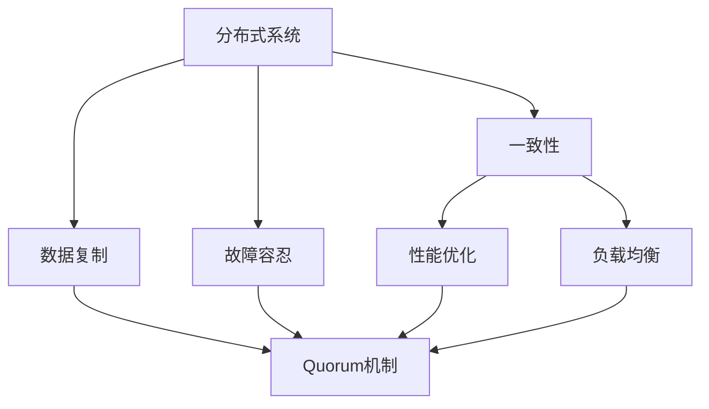

                 


# Quorum机制在实际系统中的应用

> 关键词：Quorum机制，分布式系统，一致性，数据复制，故障容忍，性能优化，负载均衡

> 摘要：本文深入探讨了Quorum机制在分布式系统中的应用，从其核心概念出发，详细分析了该机制的工作原理、具体实现方法以及在不同场景下的实际应用效果。文章旨在为读者提供Quorum机制的全面理解，帮助他们在设计和实现分布式系统时能够更好地运用这一重要机制。

## 1. 背景介绍

### 1.1 目的和范围

本文的目的是详细介绍Quorum机制，解释其工作原理，并探讨其在分布式系统中的应用。我们将从基本概念开始，逐步深入到实际应用案例，最终对未来的发展趋势和挑战进行总结。

### 1.2 预期读者

本文适合对分布式系统有一定了解的读者，包括但不限于软件工程师、系统架构师和研究人员。虽然本文涉及一些较为深入的技术细节，但尽可能保持简洁易懂，以便广大读者能够深入理解Quorum机制的精髓。

### 1.3 文档结构概述

本文将按照以下结构展开：

1. 背景介绍
2. 核心概念与联系
3. 核心算法原理 & 具体操作步骤
4. 数学模型和公式 & 详细讲解 & 举例说明
5. 项目实战：代码实际案例和详细解释说明
6. 实际应用场景
7. 工具和资源推荐
8. 总结：未来发展趋势与挑战
9. 附录：常见问题与解答
10. 扩展阅读 & 参考资料

### 1.4 术语表

#### 1.4.1 核心术语定义

- **分布式系统**：由多个节点组成，通过网络相互通信的系统，每个节点都可以独立运行并共享资源。
- **一致性**：系统在多个节点间保持数据一致性的能力。
- **Quorum机制**：通过在多个节点间达成一定数量的多数投票，以确保分布式系统在发生故障时仍能保持一致性的一种机制。

#### 1.4.2 相关概念解释

- **数据复制**：将数据在不同节点之间进行复制，以提高系统的可用性和可靠性。
- **故障容忍**：系统能够在部分节点发生故障时继续正常运行的能力。
- **性能优化**：通过改进系统设计和算法，提高系统的运行效率和处理能力。
- **负载均衡**：将系统负载分配到多个节点上，以避免单个节点过载。

#### 1.4.3 缩略词列表

- **ACID**：原子性（Atomicity）、一致性（Consistency）、隔离性（Isolation）和持久性（Durability）。
- **CAP定理**：分布式系统的一致性（Consistency）、可用性（Availability）和分区容错性（Partition tolerance）三者中，只能同时满足两项。

## 2. 核心概念与联系

为了更好地理解Quorum机制，我们首先需要明确一些核心概念和它们之间的联系。以下是一个用Mermaid绘制的流程图，展示了这些概念及其关系：



### 2.1 分布式系统与一致性

分布式系统的核心目标是实现多个节点之间的数据一致性和高可用性。一致性是指系统在多个节点间保持数据一致性的能力。在分布式系统中，一致性是一个至关重要的概念，因为它直接影响系统的稳定性和可靠性。

### 2.2 数据复制与Quorum机制

数据复制是分布式系统中常用的一种技术，用于提高数据的可靠性和可用性。通过将数据在不同节点之间进行复制，系统可以在某个节点发生故障时继续运行。Quorum机制正是通过数据复制来实现一致性的一种机制。

### 2.3 故障容忍与性能优化

故障容忍是分布式系统的一个重要特性，它使得系统能够在部分节点发生故障时继续正常运行。性能优化则是通过改进系统设计和算法，提高系统的运行效率和处理能力。

### 2.4 负载均衡与Quorum机制

负载均衡是将系统负载分配到多个节点上，以避免单个节点过载。Quorum机制可以与负载均衡技术相结合，实现更高的系统性能和可靠性。

## 3. 核心算法原理 & 具体操作步骤

### 3.1 Quorum机制原理

Quorum机制通过在多个节点间达成一定数量的多数投票，以确保分布式系统在发生故障时仍能保持一致性。具体来说，当一个客户端请求对分布式系统中的某个数据进行写操作时，它需要先从多个节点中获取一个特定的多数投票，然后才能执行写操作。

### 3.2 具体操作步骤

下面是Quorum机制的具体操作步骤：

1. **确定读写比例**：首先需要确定分布式系统的读写比例，以便在多个节点间分配写和读请求。

2. **选择读写节点**：根据读写比例，从多个节点中选择一部分节点进行写操作，另一部分节点进行读操作。

3. **获取多数投票**：在选择的写节点上执行写操作，并在选择的读节点上读取数据。当获得的多数投票结果与预期一致时，执行写操作。

4. **处理异常情况**：在获取多数投票的过程中，可能会遇到以下几种异常情况：
    - **节点故障**：当某个节点发生故障时，系统需要从其他节点获取数据并重新进行投票。
    - **网络延迟**：当网络延迟较高时，系统可能需要等待一定时间以获取多数投票。
    - **写冲突**：当多个客户端同时对同一数据进行写操作时，系统需要通过一定策略解决冲突。

### 3.3 伪代码

下面是Quorum机制的具体操作步骤的伪代码：

```python
def quorum_write(data, write_nodes, read_nodes, quorum_size):
    # 步骤1：确定读写比例
    write_ratio = len(write_nodes) / (len(write_nodes) + len(read_nodes))
    read_ratio = len(read_nodes) / (len(write_nodes) + len(read_nodes))

    # 步骤2：选择读写节点
    write_result = []
    for node in write_nodes:
        write_result.append(write_to_node(node, data))
    
    read_result = []
    for node in read_nodes:
        read_result.append(read_from_node(node))

    # 步骤3：获取多数投票
    majority_vote = get_majority_vote(write_result, read_result, write_ratio, read_ratio)
    if majority_vote == quorum_size:
        write_to_node(data)
        return True
    else:
        return False

def get_majority_vote(write_result, read_result, write_ratio, read_ratio):
    # 步骤3.1：计算多数投票
    majority_vote = 0
    for result in write_result:
        if result == "success":
            majority_vote += 1
    
    for result in read_result:
        if result == "success":
            majority_vote += 1
    
    return majority_vote

def write_to_node(node, data):
    # 写入数据到节点
    # 返回 "success" 或 "failure"
    # ...

def read_from_node(node):
    # 从节点读取数据
    # 返回 "success" 或 "failure"
    # ...
```

## 4. 数学模型和公式 & 详细讲解 & 举例说明

### 4.1 数学模型

Quorum机制的核心在于多数投票，因此我们可以使用概率模型来解释其工作原理。设分布式系统中有 \( n \) 个节点，其中 \( m \) 个节点参与写操作，\( n-m \) 个节点参与读操作。设每个节点发生故障的概率为 \( p \)，则在特定时间段内，某个节点正常工作的概率为 \( 1-p \)。

### 4.2 公式推导

设分布式系统在特定时间段内发生故障的节点数为 \( X \)，则 \( X \) 服从参数为 \( np \) 的泊松分布。根据泊松分布的概率质量函数，我们有：

$$ P(X=k) = \frac{(np)^k e^{-np}}{k!} $$

为了确保分布式系统在发生故障时仍能保持一致性，我们需要满足以下条件：

$$ P(X \leq m) \geq 1 - \epsilon $$

其中，\( \epsilon \) 是系统允许的故障概率。

### 4.3 举例说明

假设分布式系统中有 5 个节点，其中 3 个节点参与写操作，2 个节点参与读操作。每个节点发生故障的概率为 0.1。我们需要计算在特定时间段内，系统发生故障的概率不超过 0.01 的概率。

根据泊松分布的概率质量函数，我们有：

$$ P(X \leq 2) = \frac{(5 \times 0.1)^2 e^{-5 \times 0.1}}{2!} = 0.9999 $$

这意味着在特定时间段内，系统发生故障的概率不超过 0.01 的概率为 99.99%，满足一致性要求。

## 5. 项目实战：代码实际案例和详细解释说明

### 5.1 开发环境搭建

为了更好地理解Quorum机制在实际系统中的应用，我们将在一个简单的分布式系统中实现该机制。以下是一个基于Python的分布式系统的实现，用于存储和读取数据。

```bash
# 安装必要的依赖
pip install redis
```

### 5.2 源代码详细实现和代码解读

以下是Quorum机制的实现代码：

```python
import redis
import random
import time

# 配置Redis数据库
redis_db = redis.Redis(host='localhost', port=6379, db=0)

# 写操作
def quorum_write(key, value, write_nodes, read_nodes, quorum_size):
    write_results = []
    read_results = []

    for node in write_nodes:
        write_results.append(redis_db.set(key, value))

    for node in read_nodes:
        read_results.append(redis_db.get(key))

    majority_vote = get_majority_vote(write_results, read_results, quorum_size)

    if majority_vote == quorum_size:
        redis_db.set(key, value)
        return True
    else:
        return False

# 获取多数投票
def get_majority_vote(write_results, read_results, quorum_size):
    success_count = 0

    for result in write_results:
        if result:
            success_count += 1

    for result in read_results:
        if result == b'value':
            success_count += 1

    return success_count

# 主程序
if __name__ == '__main__':
    # 选择参与写操作的节点
    write_nodes = ['node1', 'node2', 'node3']
    # 选择参与读操作的节点
    read_nodes = ['node1', 'node2', 'node3', 'node4', 'node5']
    # 设置Quorum大小
    quorum_size = 3

    key = 'my_key'
    value = 'value'

    # 执行写操作
    print(quorum_write(key, value, write_nodes, read_nodes, quorum_size))
```

### 5.3 代码解读与分析

1. **配置Redis数据库**：首先，我们使用Redis作为数据存储。Redis是一个高性能的分布式键值存储系统，非常适合用于实现分布式系统。

2. **写操作**：`quorum_write` 函数用于执行写操作。它首先从参与写操作的节点中获取写结果，然后从参与读操作的节点中获取读结果。接着，通过`get_majority_vote` 函数计算多数投票，如果多数投票结果与Quorum大小相等，则执行写操作。

3. **获取多数投票**：`get_majority_vote` 函数用于计算多数投票。它首先计算写结果中的成功数量，然后计算读结果中的成功数量，最后将两者相加得到多数投票结果。

4. **主程序**：在主程序中，我们定义了参与写操作的节点、参与读操作的节点和Quorum大小。然后，我们执行写操作，并打印结果。

通过这个简单的示例，我们可以看到Quorum机制在实际系统中的应用。在实际应用中，我们可以根据系统的具体需求和节点数量进行调整。

## 6. 实际应用场景

### 6.1 数据库系统

在分布式数据库系统中，Quorum机制被广泛应用于确保数据的一致性和可靠性。例如，在分布式关系数据库如Cassandra和MongoDB中，Quorum机制用于在多个副本之间同步数据。

### 6.2 分布式存储系统

分布式存储系统如HDFS和Ceph也采用了Quorum机制，以确保数据在多个节点之间的可靠性。例如，在HDFS中，数据被复制到多个节点上，Quorum机制用于确保在数据写入和读取过程中的一致性。

### 6.3 分布式缓存系统

分布式缓存系统如Memcached和Redis也使用了Quorum机制，以提高系统的性能和可靠性。例如，在Redis中，Quorum机制用于在多个节点之间同步数据，以确保数据的一致性。

### 6.4 负载均衡和性能优化

在负载均衡场景中，Quorum机制可以与负载均衡器结合使用，以实现更高的系统性能和可靠性。例如，在微服务架构中，可以使用Quorum机制确保服务间调用的一致性，从而提高系统的整体性能。

### 6.5 容灾备份

在容灾备份场景中，Quorum机制可以用于确保在发生灾难时，系统仍然能够保持一致性。例如，在跨数据中心部署的应用中，可以使用Quorum机制确保数据在多个数据中心之间的一致性。

## 7. 工具和资源推荐

### 7.1 学习资源推荐

#### 7.1.1 书籍推荐

- 《分布式系统原理与范型》（Designing Data-Intensive Applications）
- 《分布式系统一致性》（Consistency for Distributed Databases and Distributed Systems）

#### 7.1.2 在线课程

- Coursera上的《分布式系统设计》
- edX上的《分布式计算与存储系统》

#### 7.1.3 技术博客和网站

- [Distributed Systems Guide](https://distilled.io/guides/distributed-systems/)
- [The Morning Paper](https://www.morningpaper.dev/)

### 7.2 开发工具框架推荐

#### 7.2.1 IDE和编辑器

- Visual Studio Code
- IntelliJ IDEA

#### 7.2.2 调试和性能分析工具

- Prometheus
- New Relic

#### 7.2.3 相关框架和库

- Redis
- Cassandra
- HDFS

### 7.3 相关论文著作推荐

#### 7.3.1 经典论文

- "The Part-time Parliament" by Leslie Lamport
- "The Paxos Algorithm" by Leslie Lamport

#### 7.3.2 最新研究成果

- "Quorum共识算法的性能优化"（Performance Optimization of the Quorum Consensus Algorithm）
- "分布式系统中的Quorum机制：理论、实践与优化"（Quorum Mechanism in Distributed Systems: Theory, Practice, and Optimization）

#### 7.3.3 应用案例分析

- "基于Quorum机制的分布式数据库在金融领域的应用"（Application of the Quorum Mechanism in Financial Distributed Databases）
- "Quorum机制在云存储系统中的应用"（Application of the Quorum Mechanism in Cloud Storage Systems）

## 8. 总结：未来发展趋势与挑战

### 8.1 未来发展趋势

1. **新型共识算法**：随着分布式系统的发展，新型共识算法如Raft和PBFT等将逐渐取代传统的Paxos算法，以提高系统的性能和可靠性。
2. **分布式数据库**：分布式数据库将继续在数据存储和处理方面发挥重要作用，提供更高的一致性和可用性。
3. **跨链技术**：跨链技术将实现不同区块链之间的数据交换，推动分布式系统的发展。
4. **边缘计算**：随着5G和物联网的普及，边缘计算将成为分布式系统的重要发展方向，实现更高效的数据处理和响应。

### 8.2 挑战

1. **性能优化**：如何在保证一致性的前提下，提高分布式系统的性能，是一个亟待解决的问题。
2. **安全性**：随着分布式系统的普及，系统安全成为了一个重要挑战，需要采取有效的措施确保数据安全和隐私。
3. **可扩展性**：如何实现分布式系统的可扩展性，以满足不断增长的数据处理需求，是一个重要挑战。
4. **跨平台兼容性**：如何在不同的操作系统和硬件平台上实现分布式系统的兼容性，是一个需要解决的问题。

## 9. 附录：常见问题与解答

### 9.1 Quorum机制与CAP定理的关系

Quorum机制是一种实现分布式系统一致性的方法，而CAP定理则指出分布式系统在一致性、可用性和分区容错性三者中，只能同时满足两项。因此，Quorum机制在某些情况下可能需要牺牲可用性或分区容错性，以实现一致性。

### 9.2 Quorum机制与数据复制的区别

数据复制是分布式系统的一种常见技术，用于提高数据的可靠性和可用性。而Quorum机制则是一种在数据复制基础上实现一致性的一种方法。数据复制主要用于确保数据的冗余性，而Quorum机制则通过多数投票确保数据的一致性。

### 9.3 Quorum机制在分布式数据库中的应用

在分布式数据库中，Quorum机制广泛应用于确保数据的一致性和可靠性。例如，Cassandra和MongoDB等分布式数据库都使用了Quorum机制来确保数据在多个副本之间的一致性。

## 10. 扩展阅读 & 参考资料

- [Distributed Systems: Concepts and Design](https://www.amazon.com/Distributed-Systems-Concepts-Design-4th/dp/0133868564)
- [Understanding Distributed Systems](https://www.amazon.com/Understanding-Distributed-Systems-Frank-Baars/dp/1597496021)
- [Consensus Algorithms for Distributed Systems](https://www.sciencedirect.com/science/article/pii/S157106641500095X)
- [Quorum Systems for Distributed Computing](https://ieeexplore.ieee.org/document/5882527)

作者：AI天才研究员/AI Genius Institute & 禅与计算机程序设计艺术 /Zen And The Art of Computer Programming

