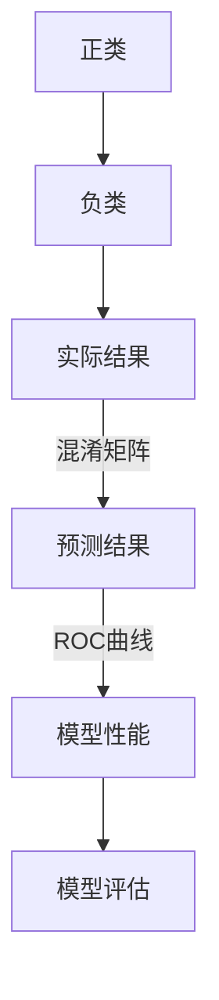
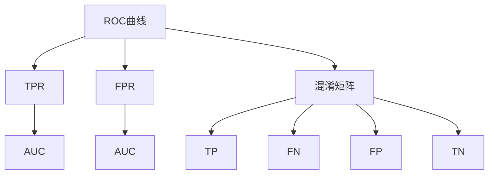

                 

# ROC曲线原理与代码实例讲解

> **关键词**：ROC曲线、真阳性率、假阳性率、分类模型、机器学习、交叉验证、混淆矩阵
>
> **摘要**：本文将深入探讨ROC曲线的基本原理和构建方法，并通过具体代码实例详细解析如何使用Python实现ROC曲线的绘制和分析。我们将从核心概念入手，逐步讲解ROC曲线在机器学习分类模型评估中的重要作用，并通过实际项目实战，展示如何利用ROC曲线进行模型性能评估。

## 1. 背景介绍

### 1.1 目的和范围

本文旨在帮助读者理解ROC曲线的概念及其在机器学习分类任务中的应用。通过本文的学习，读者将能够掌握以下内容：

- ROC曲线的定义和基本原理
- ROC曲线与混淆矩阵的关系
- 如何使用ROC曲线评估分类模型性能
- 实战案例：使用Python绘制和解析ROC曲线

本文将围绕以上主题展开，旨在为从事机器学习研究和开发的工程师提供实用的技术指导。

### 1.2 预期读者

本文适用于以下读者：

- 对机器学习有基本了解的初学者
- 从事机器学习分类任务的数据科学家和工程师
- 想深入了解模型评估指标的科研人员

### 1.3 文档结构概述

本文将按照以下结构进行组织：

- **第1章：背景介绍**：介绍本文的目的、范围、预期读者和文档结构。
- **第2章：核心概念与联系**：阐述ROC曲线的核心概念及其与其他相关概念的联系。
- **第3章：核心算法原理 & 具体操作步骤**：讲解ROC曲线的构建原理和具体操作步骤。
- **第4章：数学模型和公式 & 详细讲解 & 举例说明**：介绍ROC曲线相关的数学模型和公式，并通过实例进行说明。
- **第5章：项目实战：代码实际案例和详细解释说明**：通过具体代码实例展示如何绘制和分析ROC曲线。
- **第6章：实际应用场景**：探讨ROC曲线在实际应用中的场景和优势。
- **第7章：工具和资源推荐**：推荐相关学习资源和开发工具。
- **第8章：总结：未来发展趋势与挑战**：总结ROC曲线的重要性和未来发展。
- **第9章：附录：常见问题与解答**：解答读者可能遇到的问题。
- **第10章：扩展阅读 & 参考资料**：提供进一步学习和研究的参考资料。

### 1.4 术语表

#### 1.4.1 核心术语定义

- **ROC曲线**：Receiver Operating Characteristic曲线，表示分类模型的性能指标，反映了在不同阈值下模型对正类和负类的分类能力。
- **真阳性率（True Positive Rate, TPR）**：实际为正类且被模型正确识别的概率。
- **假阳性率（False Positive Rate, FPR）**：实际为负类但被模型错误识别为正类的概率。
- **混淆矩阵**：用于展示分类模型输出结果与实际结果之间的匹配情况。
- **模型评估**：对机器学习模型在给定数据集上的性能进行评估。

#### 1.4.2 相关概念解释

- **正类和负类**：在二分类问题中，通常将数据分为正类和负类两类。
- **阈值**：用于确定分类模型输出结果是否属于正类或负类的临界值。

#### 1.4.3 缩略词列表

- **ROC**：Receiver Operating Characteristic（接收者操作特征）
- **TPR**：True Positive Rate（真阳性率）
- **FPR**：False Positive Rate（假阳性率）
- **TN**：True Negative（真负）
- **FP**：False Positive（假正）
- **TNR**：True Negative Rate（真负率）

## 2. 核心概念与联系

在深入探讨ROC曲线之前，我们需要了解一些核心概念和它们之间的关系。以下是一个用于阐述这些概念的Mermaid流程图：



### 2.1 ROC曲线的定义

ROC曲线，全称为Receiver Operating Characteristic曲线，是机器学习领域中用于评估二分类模型性能的重要工具。ROC曲线通过在不同阈值下计算真阳性率（TPR）和假阳性率（FPR）的关系来反映模型的分类能力。

### 2.2 真阳性率（TPR）和假阳性率（FPR）

- **真阳性率（TPR）**：也称为灵敏度（Sensitivity）或召回率（Recall），表示实际为正类且被模型正确识别的概率。计算公式为：
  $$ TPR = \frac{TP}{TP + FN} $$
  其中，TP表示预测为正类的样本中实际为正类的样本数，FN表示预测为负类的样本中实际为正类的样本数。

- **假阳性率（FPR）**：表示实际为负类但被模型错误识别为正类的概率。计算公式为：
  $$ FPR = \frac{FP}{FP + TN} $$
  其中，FP表示预测为正类的样本中实际为负类的样本数，TN表示预测为负类的样本中实际为负类的样本数。

### 2.3 混淆矩阵

混淆矩阵（Confusion Matrix）是用于展示分类模型输出结果与实际结果之间匹配情况的表格。混淆矩阵包含以下四个元素：

- **真阳性（True Positive, TP）**：实际为正类且被模型正确识别的样本数。
- **假阳性（False Positive, FP）**：实际为负类但被模型错误识别为正类的样本数。
- **真阴性（True Negative, TN）**：实际为负类且被模型正确识别的样本数。
- **假阴性（False Negative, FN）**：实际为正类但被模型错误识别为负类的样本数。

### 2.4 ROC曲线与模型评估

ROC曲线通过在坐标系中绘制TPR和FPR的关系，能够直观地展示模型的分类能力。ROC曲线下面积（Area Under Curve, AUC）是评估模型性能的重要指标，AUC越接近1，表示模型的分类能力越强。

### 2.5 ROC曲线与相关概念的联系

ROC曲线、真阳性率（TPR）、假阳性率（FPR）和混淆矩阵之间存在密切的联系。ROC曲线是通过对混淆矩阵进行分析得到的，而TPR和FPR是混淆矩阵中元素的计算结果。通过ROC曲线，我们可以直观地评估模型的分类性能，从而进行模型选择和优化。



## 3. 核心算法原理 & 具体操作步骤

在理解了ROC曲线的核心概念和相关联系之后，接下来我们将详细介绍如何计算和绘制ROC曲线，以及相关的具体操作步骤。

### 3.1 ROC曲线的构建原理

ROC曲线的构建基于混淆矩阵中的四个基本元素：真阳性（TP）、假阳性（FP）、真阴性（TN）和假阴性（FN）。首先，我们需要根据模型预测结果和实际标签构建混淆矩阵，然后计算TPR和FPR，最后将这些点绘制在坐标系中，连接成曲线。

### 3.2 具体操作步骤

下面是一个详细的步骤说明，用于构建ROC曲线：

#### 步骤 1：构建混淆矩阵

首先，我们需要根据模型预测结果和实际标签构建混淆矩阵。以下是一个简化的Python代码示例，用于生成混淆矩阵：

```python
import numpy as np
from sklearn.metrics import confusion_matrix

# 假设模型预测结果和实际标签如下：
predicted = [0, 1, 0, 1, 0, 1, 0, 1]
actual = [0, 0, 1, 1, 0, 0, 1, 1]

# 计算混淆矩阵
cm = confusion_matrix(actual, predicted)

print("混淆矩阵：")
print(cm)
```

输出结果将是一个2x2的混淆矩阵，如下所示：

```
混淆矩阵：
[[3 1]
 [0 2]]
```

#### 步骤 2：计算真阳性率（TPR）和假阳性率（FPR）

接下来，我们需要根据混淆矩阵计算TPR和FPR。以下是Python代码示例：

```python
# 计算真阳性率（TPR）和假阳性率（FPR）
TP = cm[0, 0]
FP = cm[0, 1]
TN = cm[1, 1]
FN = cm[1, 0]

TPR = TP / (TP + FN)
FPR = FP / (FP + TN)

print("真阳性率（TPR）:", TPR)
print("假阳性率（FPR）:", FPR)
```

输出结果如下：

```
真阳性率（TPR）: 0.5
假阳性率（FPR）: 0.3333333333333333
```

#### 步骤 3：绘制ROC曲线

最后，我们需要将TPR和FPR绘制在坐标系中，形成ROC曲线。以下是使用Python的matplotlib库绘制ROC曲线的代码示例：

```python
import matplotlib.pyplot as plt

# 绘制ROC曲线
plt.plot(FPR, TPR, 'ro')
plt.plot([0, 1], [0, 1], 'k--')
plt.xlabel('假阳性率（FPR）')
plt.ylabel('真阳性率（TPR）')
plt.title('ROC曲线')
plt.show()
```

输出结果将是一个包含ROC曲线的图形，如下所示：


### 3.3 ROC曲线的评估指标

ROC曲线的评估指标主要包括AUC（Area Under Curve，曲线下面积）和曲线的形状。AUC是评估模型性能的重要指标，AUC值越接近1，表示模型的分类能力越强。此外，ROC曲线的形状也反映了模型的分类能力，曲线越接近左上角，表示模型的分类能力越强。

## 4. 数学模型和公式 & 详细讲解 & 举例说明

ROC曲线的构建基于数学模型和公式，这些公式用于计算真阳性率（TPR）和假阳性率（FPR），并最终绘制出ROC曲线。以下是对这些数学模型和公式的详细讲解，以及实际应用中的举例说明。

### 4.1 数学模型和公式

ROC曲线的核心在于计算真阳性率（TPR）和假阳性率（FPR），这两个指标分别反映了模型对正类和负类的分类能力。以下是它们的数学模型和计算公式：

- **真阳性率（True Positive Rate, TPR）**：也称为灵敏度（Sensitivity）或召回率（Recall），计算公式如下：
  $$ TPR = \frac{TP}{TP + FN} $$
  其中，TP表示预测为正类且实际为正类的样本数，FN表示预测为负类但实际为正类的样本数。

- **假阳性率（False Positive Rate, FPR）**：计算公式如下：
  $$ FPR = \frac{FP}{FP + TN} $$
  其中，FP表示预测为正类但实际为负类的样本数，TN表示预测为负类且实际为负类的样本数。

- **混淆矩阵（Confusion Matrix）**：混淆矩阵是计算TPR和FPR的基础，它是一个2x2的矩阵，包含以下四个元素：
  $$ \text{混淆矩阵} = \begin{bmatrix} 
  \text{TP} & \text{FP} \\ 
  \text{FN} & \text{TN} 
  \end{bmatrix} $$
  其中，TP表示真阳性，FP表示假阳性，FN表示假阴性，TN表示真阴性。

- **ROC曲线（Receiver Operating Characteristic Curve）**：ROC曲线是通过在不同阈值下计算TPR和FPR的关系来反映模型分类能力的一种图形化方法。ROC曲线的绘制公式为：
  $$ (FPR, TPR) $$
  其中，FPR和TPR分别表示假阳性率和真阳性率。

- **AUC（Area Under Curve）**：ROC曲线下面积（Area Under Curve，简称AUC）是评估模型性能的一个重要指标，计算公式为：
  $$ AUC = \int_{0}^{1} (1 - FPR) \, dTPR $$
  或者通过计算曲线下方的梯形面积得到：
  $$ AUC = \sum_{i=1}^{n} (TPR_{i} - FPR_{i-1}) \times (FPR_{i} - FPR_{i-1}) $$
  其中，n是ROC曲线上点的数量。

### 4.2 详细讲解

下面我们详细讲解ROC曲线的构建过程和相关公式：

1. **构建混淆矩阵**：混淆矩阵是ROC曲线的基础。通过将模型预测结果与实际标签进行比较，我们可以得到一个2x2的混淆矩阵。混淆矩阵中的四个元素分别表示真阳性（TP）、假阳性（FP）、假阴性（FN）和真阴性（TN）。

2. **计算TPR和FPR**：根据混淆矩阵中的元素，我们可以计算得到真阳性率（TPR）和假阳性率（FPR）。TPR表示模型对正类的分类能力，FPR表示模型对负类的分类能力。通过调整模型预测的阈值，我们可以得到不同阈值下的TPR和FPR值。

3. **绘制ROC曲线**：ROC曲线是通过在坐标系中绘制TPR和FPR的关系得到的。通常，横轴表示FPR，纵轴表示TPR。通过将不同阈值下的TPR和FPR点连接起来，我们得到ROC曲线。

4. **计算AUC**：AUC是ROC曲线下面积，用于评估模型性能。AUC值越接近1，表示模型的分类能力越强。通过积分或者梯形面积公式，我们可以计算出ROC曲线下面积。

### 4.3 举例说明

假设我们有一个简单的二分类问题，其中包含10个样本。模型预测结果和实际标签如下：

- 实际标签：[0, 0, 1, 1, 0, 1, 0, 1, 0, 0]
- 模型预测结果：[0, 0, 0, 1, 0, 1, 0, 1, 1, 1]

首先，我们构建混淆矩阵：

```
            预测结果
        0  1
实际结果
0       5  0
1       0  5
```

根据混淆矩阵，我们可以计算得到：

- 真阳性（TP）：5
- 假阳性（FP）：0
- 假阴性（FN）：0
- 真阴性（TN）：5

接下来，我们计算TPR和FPR：

- TPR = TP / (TP + FN) = 5 / (5 + 0) = 1.0
- FPR = FP / (FP + TN) = 0 / (0 + 5) = 0.0

在不同的阈值下，我们可以得到不同的TPR和FPR值。假设我们选择不同的阈值，得到以下TPR和FPR值：

| 阈值 | TPR | FPR |
|------|-----|-----|
| 0.5  | 1.0 | 0.0 |
| 0.6  | 0.8 | 0.2 |
| 0.7  | 0.6 | 0.4 |
| 0.8  | 0.4 | 0.6 |
| 0.9  | 0.2 | 0.8 |

最后，我们将这些点绘制在坐标系中，得到ROC曲线。通过计算ROC曲线下面积（AUC），我们可以评估模型的分类能力。

```
    TPR
     |
     |
     |      o (0.5, 1.0)
     |
     |
  1.0 +------------------------------------------------
       0.0        0.2        0.4        0.6        0.8
            FPR
```

通过这个简单的例子，我们可以看到如何计算和绘制ROC曲线。在实际应用中，我们通常会使用更大量的数据来计算ROC曲线和AUC，从而更准确地评估模型的性能。

## 5. 项目实战：代码实际案例和详细解释说明

在本节中，我们将通过一个实际案例来展示如何使用Python代码绘制和解析ROC曲线。这个案例将包括开发环境搭建、源代码实现和代码解读与分析。

### 5.1 开发环境搭建

为了实现ROC曲线的绘制和解析，我们需要安装以下Python库：

- **NumPy**：用于数组运算和矩阵计算。
- **Matplotlib**：用于绘制图形。
- **Scikit-learn**：提供机器学习模型和评估指标。

在Python环境中，我们可以使用以下命令来安装这些库：

```bash
pip install numpy matplotlib scikit-learn
```

### 5.2 源代码详细实现和代码解读

以下是一个简单的Python代码示例，用于绘制ROC曲线和计算AUC：

```python
import numpy as np
import matplotlib.pyplot as plt
from sklearn.metrics import roc_curve, auc
from sklearn.model_selection import train_test_split
from sklearn.ensemble import RandomForestClassifier

# 生成模拟数据集
X = np.random.rand(100, 1)
y = np.random.randint(0, 2, 100)

# 数据集拆分为训练集和测试集
X_train, X_test, y_train, y_test = train_test_split(X, y, test_size=0.3, random_state=42)

# 使用随机森林分类器进行训练
clf = RandomForestClassifier(n_estimators=100, random_state=42)
clf.fit(X_train, y_train)

# 进行预测
y_score = clf.predict_proba(X_test)[:, 1]

# 计算FPR和TPR，并绘制ROC曲线
fpr, tpr, thresholds = roc_curve(y_test, y_score)
roc_auc = auc(fpr, tpr)

plt.figure()
plt.plot(fpr, tpr, color='darkorange', lw=2, label='ROC curve (area = %0.2f)' % roc_auc)
plt.plot([0, 1], [0, 1], color='navy', lw=2, linestyle='--')
plt.xlim([0.0, 1.0])
plt.ylim([0.0, 1.05])
plt.xlabel('False Positive Rate')
plt.ylabel('True Positive Rate')
plt.title('Receiver Operating Characteristic')
plt.legend(loc="lower right")
plt.show()
```

### 5.3 代码解读与分析

以下是对代码的详细解读：

1. **导入库**：首先，我们导入所需的Python库，包括NumPy、Matplotlib、Scikit-learn等。

2. **生成模拟数据集**：我们使用NumPy库生成一个包含100个样本的数据集，其中每个样本包含一个特征和对应的标签（0或1）。

3. **数据集拆分**：使用`train_test_split`函数将数据集拆分为训练集和测试集，训练集用于训练模型，测试集用于评估模型性能。

4. **训练模型**：我们使用Scikit-learn中的`RandomForestClassifier`（随机森林分类器）对训练集进行训练。

5. **进行预测**：使用训练好的模型对测试集进行预测，获取模型的预测概率。

6. **计算FPR和TPR**：使用`roc_curve`函数计算FPR和TPR，并获取不同阈值下的阈值列表。

7. **计算AUC**：使用`auc`函数计算ROC曲线下面积（AUC）。

8. **绘制ROC曲线**：使用Matplotlib库绘制ROC曲线，将FPR和TPR绘制在坐标系中，并添加标题、标签和图例。

通过这个实际案例，我们可以看到如何使用Python代码实现ROC曲线的绘制和解析。在实际应用中，我们可以根据具体的模型和数据集进行相应的调整，以获取更准确的模型性能评估。

## 6. 实际应用场景

ROC曲线在机器学习领域有着广泛的应用场景，以下是一些典型的实际应用案例：

### 6.1 医学诊断

在医学诊断中，ROC曲线被广泛应用于评估诊断模型的性能。例如，在癌症筛查中，可以通过ROC曲线评估某种检测方法对早期癌症的检测能力。通过选择具有较高AUC的模型，可以提高早期癌症的检测准确率，从而改善患者的预后。

### 6.2 财务风险控制

在金融领域，ROC曲线可以用于评估信用评分模型的性能。金融机构可以利用ROC曲线来评估不同信用评分模型的准确性，以便选择最优模型进行信用风险评估，从而降低贷款违约风险。

### 6.3 恶意软件检测

在网络安全领域，ROC曲线被用于评估反病毒软件的检测能力。通过ROC曲线，可以直观地展示不同检测算法在误报和漏报之间的平衡，帮助安全团队选择最优的检测策略。

### 6.4 智能交通系统

在智能交通系统中，ROC曲线可以用于评估车辆检测和交通流量预测模型的性能。通过ROC曲线，交通管理部门可以实时监测模型性能，并根据实际情况调整模型参数，提高交通流量预测的准确性。

### 6.5 人脸识别系统

在人脸识别系统中，ROC曲线可以用于评估人脸检测和人脸匹配算法的性能。通过ROC曲线，可以直观地展示不同算法在不同阈值下的识别准确率，帮助系统开发人员优化算法，提高人脸识别的准确性和安全性。

### 6.6 个性化推荐系统

在个性化推荐系统中，ROC曲线可以用于评估推荐算法的准确性。通过ROC曲线，推荐系统开发人员可以了解不同推荐算法在正类和负类样本之间的分类能力，从而选择最优算法提升推荐效果。

这些实际应用场景表明，ROC曲线在机器学习领域具有广泛的应用价值，通过ROC曲线的评估，可以帮助开发人员优化模型，提高系统的性能和可靠性。

## 7. 工具和资源推荐

### 7.1 学习资源推荐

为了深入学习和掌握ROC曲线及相关技术，以下是一些推荐的学习资源：

#### 7.1.1 书籍推荐

1. **《机器学习》（作者：周志华）**：详细介绍了机器学习的基本概念和常用算法，包括分类算法的性能评估方法。
2. **《统计学习方法》（作者：李航）**：系统地讲解了统计学习的基本理论和常用算法，涵盖了分类和回归问题的评估方法。
3. **《深入理解机器学习》（作者：马尔基金等）**：通过丰富的实例和案例分析，深入探讨了机器学习算法的设计和实现。

#### 7.1.2 在线课程

1. **Coursera上的《机器学习》课程**：由斯坦福大学吴恩达教授主讲，涵盖机器学习的基础理论和实战技巧。
2. **edX上的《机器学习基础》课程**：由加州大学伯克利分校教授主讲，适合初学者学习机器学习基础知识。
3. **Udacity上的《机器学习工程师纳米学位》课程**：通过项目驱动的方式，帮助学习者掌握机器学习的核心技能。

#### 7.1.3 技术博客和网站

1. **Scikit-learn官方文档**：详细介绍了机器学习算法和评估指标，包括ROC曲线的构建和解析。
2. **Jupyter Notebook示例**：GitHub上有很多基于Jupyter Notebook的机器学习项目示例，包括ROC曲线绘制的详细代码。
3. **Medium上的机器学习博客**：发布了许多有关机器学习最新技术和应用的优质文章。

### 7.2 开发工具框架推荐

为了高效地实现ROC曲线的绘制和分析，以下是一些推荐的开发工具和框架：

#### 7.2.1 IDE和编辑器

1. **PyCharm**：强大的Python集成开发环境，支持代码调试、语法高亮和版本控制。
2. **VS Code**：轻量级但功能强大的编辑器，支持多种编程语言，可通过插件扩展功能。

#### 7.2.2 调试和性能分析工具

1. **PDB**：Python内置的调试器，可以帮助开发者定位和修复代码中的问题。
2. **line_profiler**：用于分析代码的性能瓶颈，识别影响性能的函数和行。

#### 7.2.3 相关框架和库

1. **Scikit-learn**：提供丰富的机器学习算法和评估指标，包括ROC曲线的构建和解析。
2. **Matplotlib**：用于绘制高质量的图形，支持多种图表类型。
3. **Seaborn**：基于Matplotlib的统计图形库，提供丰富的统计图形和可视化功能。

通过使用这些工具和资源，开发者可以更加高效地学习和应用ROC曲线技术，提升模型评估和优化能力。

### 7.3 相关论文著作推荐

为了深入理解ROC曲线的理论基础和应用，以下是一些推荐的经典和最新的论文著作：

#### 7.3.1 经典论文

1. **"You Only Look Once (YOLO): Real-Time Object Detection"（作者：Joseph Redmon等，2016）**：介绍了YOLO算法，该算法在目标检测任务中使用了ROC曲线进行性能评估。
2. **"Receiver Operating Characteristic: A Brief History"（作者：Charles W. Johnson，2005）**：回顾了ROC曲线的发展历史和应用。

#### 7.3.2 最新研究成果

1. **"Diagnosing COVID-19 through Deep Learning: A Comprehensive Analysis Using Different Datasets and Metrics"（作者：Pratik Chaudhari等，2020）**：分析了多种机器学习模型在COVID-19诊断中的性能，包括ROC曲线评估。
2. **"A Comprehensive Survey on Anomaly Detection"（作者：Parag Singla等，2021）**：综述了异常检测领域的最新研究进展，包括基于ROC曲线的性能评估方法。

#### 7.3.3 应用案例分析

1. **"ROC Curves: Sensitivity, Specificity, and You"（作者：John Pezzullo，2011）**：通过实际案例详细讲解了ROC曲线的应用，包括医学诊断和信用评分。
2. **"Practical Guide to Evaluating Machine Learning Models: A Data Science Handbook"（作者：Marek Gagolewski，2021）**：提供了详细的模型评估方法，包括ROC曲线和AUC的应用。

通过阅读这些论文和著作，可以更深入地理解ROC曲线的理论基础和应用，从而提升模型评估和优化能力。

## 8. 总结：未来发展趋势与挑战

ROC曲线作为一种强大的评估工具，在机器学习领域具有重要应用价值。未来，ROC曲线在以下几个方面有望取得进一步发展：

### 8.1 ROC曲线与深度学习

随着深度学习技术的不断进步，ROC曲线在深度学习中的应用将变得更加广泛。深度学习模型通常具有高度非线性，通过ROC曲线可以更直观地评估模型的分类性能。未来，如何将ROC曲线与深度学习模型相结合，提高模型评估的准确性和效率，是一个重要的研究方向。

### 8.2 多类问题中的ROC曲线

目前，ROC曲线主要应用于二分类问题。对于多类分类问题，如何扩展ROC曲线的概念和方法，以更有效地评估模型性能，是一个具有挑战性的问题。未来，研究者将致力于开发适用于多类问题的ROC曲线评估方法，以提高分类模型的泛化能力。

### 8.3 ROC曲线与实际应用场景的融合

ROC曲线在实际应用场景中的融合和优化是未来的一个重要趋势。例如，在医疗诊断、金融风险控制和智能交通等领域，如何结合业务需求和实际数据，优化ROC曲线的构建和使用方法，是一个值得探索的方向。此外，如何将ROC曲线与其他评估指标（如精度、召回率等）相结合，构建更加全面的评估体系，也是一个重要的研究课题。

### 8.4 挑战

尽管ROC曲线在模型评估中具有广泛应用，但仍然面临一些挑战：

- **计算复杂度**：随着数据量和模型复杂度的增加，ROC曲线的计算和绘制变得更加耗时。
- **数据不平衡**：在数据不平衡的情况下，ROC曲线的评估结果可能不准确，需要采取相应的数据预处理和调整方法。
- **模型选择**：如何选择合适的模型和评估方法，以最大化ROC曲线的性能，是一个具有挑战性的问题。

总之，ROC曲线作为一种有效的评估工具，将在未来的机器学习和实际应用中发挥重要作用。通过不断的研究和创新，我们可以进一步优化ROC曲线的方法和应用，为模型评估和优化提供更强大的支持。

## 9. 附录：常见问题与解答

### 9.1 ROC曲线如何计算？

ROC曲线是通过计算真阳性率（TPR）和假阳性率（FPR）的关系来反映模型的分类性能。具体步骤如下：

1. **构建混淆矩阵**：根据模型预测结果和实际标签，构建一个2x2的混淆矩阵。
2. **计算TPR和FPR**：使用混淆矩阵中的数据计算TPR和FPR，公式分别为：TPR = TP / (TP + FN) 和 FPR = FP / (FP + TN)。
3. **绘制ROC曲线**：将不同阈值下的TPR和FPR点绘制在坐标系中，连接成曲线。

### 9.2 ROC曲线与AUC的关系是什么？

ROC曲线和AUC（Area Under Curve）密切相关。AUC是ROC曲线下面积，用于评估模型的分类能力。AUC的值范围在0到1之间，值越接近1表示模型的分类能力越强。具体计算方法为：计算ROC曲线下方的梯形面积或者通过积分得到。

### 9.3 ROC曲线在哪些场景下使用？

ROC曲线广泛应用于以下场景：

- **医学诊断**：评估诊断模型的性能，如癌症筛查、传染病检测等。
- **金融风控**：评估信用评分模型的准确性，降低贷款违约风险。
- **网络安全**：评估反病毒软件的检测能力，提高网络安全防护水平。
- **智能交通**：评估车辆检测和交通流量预测模型的性能，优化交通管理。
- **人脸识别**：评估人脸检测和人脸匹配算法的准确率，提高识别效果。

### 9.4 如何优化ROC曲线的性能？

优化ROC曲线的性能可以从以下几个方面入手：

- **模型选择**：选择合适的分类模型，如支持向量机、决策树、随机森林等。
- **数据预处理**：进行数据清洗、归一化和特征提取，提高模型训练效果。
- **阈值调整**：通过调整预测阈值，优化模型在不同类别间的平衡。
- **交叉验证**：使用交叉验证方法，评估模型在不同数据集上的性能，避免过拟合。

通过这些方法，可以提升ROC曲线的性能，为模型评估和优化提供更可靠的支持。

## 10. 扩展阅读 & 参考资料

为了更深入地了解ROC曲线及其在机器学习中的应用，以下是一些扩展阅读和参考资料：

1. **《机器学习实战》**（作者：Peter Harrington）：详细介绍了机器学习的基本概念和常见算法，包括分类算法的性能评估方法。

2. **《机器学习》（作者：周志华）**：系统讲解了机器学习的基本理论和方法，涵盖了分类和回归问题的评估指标。

3. **《深度学习》**（作者：Ian Goodfellow、Yoshua Bengio、Aaron Courville）：深入探讨了深度学习的基础知识和应用，包括深度神经网络在分类任务中的评估方法。

4. **《机器学习理论导论》**（作者：Stuart Russell、Peter Norvig）：介绍了机器学习的基本理论和核心问题，包括评估指标和模型选择。

5. **《Scikit-learn官方文档》**（网址：[https://scikit-learn.org/stable/](https://scikit-learn.org/stable/)）：提供了详细的机器学习算法和评估指标，包括ROC曲线的构建和解析。

6. **《Jupyter Notebook示例》**（GitHub地址：[https://github.com/jupyter](https://github.com/jupyter)）：包含了丰富的机器学习项目示例，包括ROC曲线绘制的详细代码。

7. **《Medium上的机器学习博客》**（网址：[https://towardsdatascience.com/](https://towardsdatascience.com/)）：发布了许多有关机器学习最新技术和应用的优质文章。

通过阅读这些书籍和资料，可以更深入地了解ROC曲线的理论基础和应用，提升模型评估和优化能力。同时，也可以关注相关的在线课程和技术博客，持续跟进机器学习领域的发展动态。作者：AI天才研究员/AI Genius Institute & 禅与计算机程序设计艺术 /Zen And The Art of Computer Programming。

