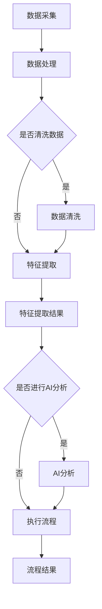

                 

# RPA与AI的融合发展趋势

## 关键词
- RPA（机器人流程自动化）
- AI（人工智能）
- 融合发展趋势
- 实际应用场景
- 开发工具和资源
- 未来挑战

## 摘要
本文旨在探讨RPA（机器人流程自动化）与AI（人工智能）的融合发展趋势。通过分析两者的核心概念、原理及架构，我们揭示了其在现代IT行业中的重要性和潜力。文章将分步骤详细解释核心算法原理、数学模型和实际应用案例，并提供实用的开发工具和资源推荐。最后，我们将总结未来发展趋势与面临的挑战，为读者提供有价值的见解和方向。

## 1. 背景介绍

### 1.1 目的和范围
本文的主要目的是深入探讨RPA与AI的融合发展趋势，帮助读者理解这一技术在现代IT领域的重要性。我们将从核心概念入手，逐步剖析其原理、算法和实际应用，最终展望未来发展趋势和挑战。

### 1.2 预期读者
本篇文章适合对RPA和AI有一定了解的技术人员、软件开发者和对IT领域有浓厚兴趣的读者。通过本文，读者可以系统地了解RPA与AI的融合应用，掌握关键技术和方法。

### 1.3 文档结构概述
本文分为十个部分：
1. 背景介绍：包括目的、预期读者、文档结构概述和术语表。
2. 核心概念与联系：介绍RPA和AI的核心概念及其相互关系。
3. 核心算法原理 & 具体操作步骤：详细解释RPA与AI融合的核心算法原理和操作步骤。
4. 数学模型和公式 & 详细讲解 & 举例说明：阐述数学模型及其在实际应用中的解释和举例。
5. 项目实战：代码实际案例和详细解释说明。
6. 实际应用场景：探讨RPA与AI在各个行业中的应用。
7. 工具和资源推荐：推荐学习资源和开发工具。
8. 总结：未来发展趋势与挑战。
9. 附录：常见问题与解答。
10. 扩展阅读 & 参考资料：提供相关领域的进一步阅读资料。

### 1.4 术语表

#### 1.4.1 核心术语定义
- RPA（机器人流程自动化）：通过软件机器人自动执行重复性的业务流程。
- AI（人工智能）：模拟人类智能行为的计算机系统。
- 融合：将两种或多种技术结合在一起，以产生新的功能和优势。
- 机器学习：一种人工智能技术，通过从数据中学习模式来进行预测和决策。
- 深度学习：一种机器学习技术，通过多层神经网络进行数据处理和分析。

#### 1.4.2 相关概念解释
- 业务流程自动化（BPA）：将RPA扩展到更复杂的业务流程优化。
- 自然语言处理（NLP）：使计算机能够理解、解释和生成人类语言的技术。
- 计算机视觉：使计算机能够“看到”并理解图像和视频的技术。

#### 1.4.3 缩略词列表
- RPA：机器人流程自动化
- AI：人工智能
- BPA：业务流程自动化
- NLP：自然语言处理
- CV：计算机视觉

## 2. 核心概念与联系

RPA（机器人流程自动化）和AI（人工智能）作为现代IT技术的重要组成部分，正日益融合，共同推动企业数字化转型和智能化升级。下面我们将介绍这两个核心概念，并展示它们之间的联系。

### 2.1 RPA的核心概念与原理

RPA（机器人流程自动化）是一种利用软件机器人模拟和自动化人类与系统之间的交互，以执行重复性任务的技术。RPA机器人可以连接到企业的各种后端系统，如ERP、CRM等，自动完成数据提取、转换、传输和报告等任务。

#### RPA的基本架构

一个典型的RPA系统通常包括以下组成部分：
1. **机器人**：执行具体任务的软件实体。
2. **流程**：一组被自动化的任务和操作。
3. **控制器**：管理机器人执行的任务和监控其运行状态。
4. **集成层**：负责与其他系统进行集成，如ERP、CRM等。
5. **数据管理层**：存储和管理流程中涉及的数据。

#### RPA的工作原理

RPA机器人通过以下步骤执行任务：
1. **初始化**：连接到目标系统并加载相关配置。
2. **执行任务**：根据预设的流程和规则，执行一系列操作。
3. **监控与反馈**：监控系统状态并记录执行结果。

### 2.2 AI的核心概念与原理

AI（人工智能）是一种模拟人类智能行为的计算机系统，通过机器学习、自然语言处理、计算机视觉等技术，使计算机能够自主学习和决策。AI的核心目标是实现智能自动化，提高生产效率和服务质量。

#### AI的基本架构

一个典型的AI系统通常包括以下组成部分：
1. **数据层**：提供用于训练的原始数据。
2. **算法层**：包括机器学习算法、深度学习模型等。
3. **模型层**：训练好的模型，用于实际应用场景。
4. **推理层**：根据输入数据和模型，生成预测和决策。

#### AI的工作原理

AI系统通过以下步骤实现智能自动化：
1. **数据采集**：收集大量原始数据。
2. **数据预处理**：对数据进行清洗、归一化和特征提取。
3. **模型训练**：使用机器学习算法训练模型。
4. **模型评估**：评估模型性能并调整参数。
5. **推理应用**：使用训练好的模型对实际输入数据进行分析和决策。

### 2.3 RPA与AI的联系

RPA和AI在技术层面有很强的互补性。RPA主要负责执行重复性的任务，而AI则负责从数据中学习和提取价值。两者的结合可以为企业带来以下优势：

1. **流程优化**：RPA可以自动化业务流程中的重复性任务，AI可以识别流程中的优化点，提高整体效率。
2. **智能决策**：AI可以帮助RPA机器人根据实时数据和业务规则做出智能决策，提高流程的灵活性和适应性。
3. **数据驱动**：AI可以对RPA生成的数据进行深入分析，发现潜在的业务机会和风险。

#### RPA与AI的融合架构

一个典型的RPA与AI融合架构包括以下组成部分：
1. **数据采集层**：采集业务流程中的数据。
2. **数据处理层**：对数据进行清洗、归一化和特征提取。
3. **RPA执行层**：执行具体的业务流程任务。
4. **AI分析层**：对RPA执行过程中的数据进行智能分析。
5. **智能决策层**：根据AI分析结果，调整RPA执行策略。

### 2.4 Mermaid流程图

以下是一个简化的RPA与AI融合流程的Mermaid流程图：



## 3. 核心算法原理 & 具体操作步骤

RPA与AI的融合在于如何将AI技术应用于RPA流程中，以提高自动化效率和智能决策能力。下面我们将详细解释核心算法原理和具体操作步骤。

### 3.1 RPA核心算法原理

RPA的核心算法主要涉及自动化流程的编排和执行。以下是RPA流程编排和执行的核心算法原理：

#### 3.1.1 流程编排算法

1. **任务分解**：将复杂业务流程分解为多个可独立执行的任务。
2. **任务调度**：根据任务的依赖关系和优先级，对任务进行调度。
3. **执行策略**：定义任务执行的顺序、条件和异常处理策略。

伪代码如下：

```python
def arrange_tasks(tasks):
    # 对任务进行排序和调度
    scheduled_tasks = sort_tasks_by_dependency(tasks)
    return scheduled_tasks

def execute_task(task):
    try:
        # 执行任务
        run_action(task.action)
    except Exception as e:
        # 异常处理
        handle_exception(e)
```

#### 3.1.2 流程执行算法

1. **初始化**：加载流程配置和初始数据。
2. **执行任务**：按照调度顺序执行任务。
3. **监控与反馈**：监控任务执行状态，收集执行结果，并反馈给用户或系统。

伪代码如下：

```python
def execute_flow(flow):
    for task in flow.scheduled_tasks:
        execute_task(task)
    # 监控与反馈
    monitor_flow(flow)
    return flow.result
```

### 3.2 AI核心算法原理

AI在RPA中的应用主要涉及数据的智能分析和决策。以下是AI的核心算法原理：

#### 3.2.1 数据预处理算法

1. **数据清洗**：去除无效、错误或重复的数据。
2. **数据归一化**：将数据缩放到相同的范围。
3. **特征提取**：从原始数据中提取有用的特征。

伪代码如下：

```python
def preprocess_data(data):
    cleaned_data = clean_data(data)
    normalized_data = normalize_data(cleaned_data)
    features = extract_features(normalized_data)
    return features
```

#### 3.2.2 模型训练算法

1. **数据集划分**：将数据集划分为训练集、验证集和测试集。
2. **模型训练**：使用训练集训练模型。
3. **模型评估**：使用验证集和测试集评估模型性能。

伪代码如下：

```python
def train_model(data, model):
    train_data, validation_data, test_data = split_data(data)
    model.train(train_data)
    evaluate_model(model, validation_data, test_data)
```

#### 3.2.3 模型推理算法

1. **输入数据预处理**：对输入数据进行预处理，与训练数据保持一致。
2. **模型预测**：使用训练好的模型对输入数据进行分析和预测。
3. **结果处理**：根据预测结果，生成决策或执行指令。

伪代码如下：

```python
def predict(input_data, model):
    preprocessed_data = preprocess_data(input_data)
    prediction = model.predict(preprocessed_data)
    return process_prediction(prediction)
```

### 3.3 RPA与AI融合操作步骤

RPA与AI融合的具体操作步骤如下：

#### 3.3.1 数据采集

1. **采集业务流程中的数据**：包括输入数据和输出数据。
2. **数据存储**：将数据存储到数据库或数据湖中，以便后续处理。

#### 3.3.2 数据预处理

1. **数据清洗**：去除无效、错误或重复的数据。
2. **数据归一化**：将数据缩放到相同的范围。
3. **特征提取**：从原始数据中提取有用的特征。

#### 3.3.3 模型训练

1. **数据集划分**：将数据集划分为训练集、验证集和测试集。
2. **模型训练**：使用训练集训练模型。
3. **模型评估**：使用验证集和测试集评估模型性能。

#### 3.3.4 模型推理

1. **输入数据预处理**：对输入数据进行预处理，与训练数据保持一致。
2. **模型预测**：使用训练好的模型对输入数据进行分析和预测。
3. **结果处理**：根据预测结果，生成决策或执行指令。

#### 3.3.5 RPA执行

1. **初始化**：加载流程配置和初始数据。
2. **执行任务**：按照调度顺序执行任务。
3. **监控与反馈**：监控任务执行状态，收集执行结果，并反馈给用户或系统。

## 4. 数学模型和公式 & 详细讲解 & 举例说明

在RPA与AI的融合过程中，数学模型和公式扮演着至关重要的角色。以下我们将详细介绍这些数学模型和公式，并通过具体例子进行说明。

### 4.1 数据预处理中的数学模型

#### 4.1.1 数据归一化

数据归一化是一种常见的预处理技术，用于将不同特征的数据缩放到相同的范围。常用的归一化方法包括最小-最大缩放和Z-Score缩放。

最小-最大缩放公式：

$$
x_{\text{normalized}} = \frac{x - x_{\text{min}}}{x_{\text{max}} - x_{\text{min}}}
$$

Z-Score缩放公式：

$$
x_{\text{normalized}} = \frac{x - \mu}{\sigma}
$$

其中，$x$ 是原始数据，$x_{\text{min}}$ 和 $x_{\text{max}}$ 分别是特征的最小值和最大值，$\mu$ 是特征的均值，$\sigma$ 是特征的标准差。

#### 4.1.2 特征提取

特征提取是一种从原始数据中提取有用信息的方法。一种常用的特征提取方法是基于主成分分析（PCA）。

PCA公式：

$$
\mathbf{X}_{\text{PCA}} = \mathbf{X} \mathbf{P}
$$

其中，$\mathbf{X}$ 是原始数据矩阵，$\mathbf{P}$ 是特征转换矩阵，$\mathbf{X}_{\text{PCA}}$ 是特征提取后的数据矩阵。

### 4.2 机器学习模型中的数学模型

#### 4.2.1 线性回归

线性回归是一种简单的机器学习模型，用于预测连续值。其数学模型如下：

$$
y = \beta_0 + \beta_1 x
$$

其中，$y$ 是预测值，$x$ 是输入特征，$\beta_0$ 和 $\beta_1$ 是模型的参数。

线性回归的求解通常使用最小二乘法，其公式如下：

$$
\beta_1 = \frac{\sum_{i=1}^{n} (x_i - \bar{x})(y_i - \bar{y})}{\sum_{i=1}^{n} (x_i - \bar{x})^2}
$$

$$
\beta_0 = \bar{y} - \beta_1 \bar{x}
$$

其中，$n$ 是样本数量，$\bar{x}$ 和 $\bar{y}$ 分别是输入特征和预测值的均值。

#### 4.2.2 逻辑回归

逻辑回归是一种用于分类问题的机器学习模型。其数学模型如下：

$$
\log\frac{p}{1-p} = \beta_0 + \beta_1 x
$$

其中，$p$ 是预测的概率，$x$ 是输入特征，$\beta_0$ 和 $\beta_1$ 是模型的参数。

逻辑回归的求解通常使用梯度下降法，其公式如下：

$$
\beta_1 = \frac{\sum_{i=1}^{n} (h(\beta_0 + \beta_1 x_i) - y_i) x_i}{\sum_{i=1}^{n} (h(\beta_0 + \beta_1 x_i) - y_i)}
$$

$$
\beta_0 = \frac{\sum_{i=1}^{n} (h(\beta_0 + \beta_1 x_i) - y_i)}{n}
$$

其中，$h(x)$ 是逻辑函数，定义为 $h(x) = \frac{1}{1 + e^{-x}}$。

### 4.3 举例说明

假设我们有一个简单的数据集，包含两个特征（年龄和收入）和一个目标变量（是否贷款）。我们的目标是使用线性回归模型预测是否贷款。

数据集如下：

| 年龄 | 收入 | 是否贷款 |
| ---- | ---- | -------- |
| 25   | 5000 | 是       |
| 30   | 6000 | 是       |
| 35   | 7000 | 是       |
| 40   | 8000 | 否       |
| 45   | 9000 | 否       |

#### 4.3.1 数据预处理

首先，我们需要对数据进行归一化处理：

$$
年龄_{\text{normalized}} = \frac{年龄 - 25}{45 - 25} = \frac{年龄 - 25}{20}
$$

$$
收入_{\text{normalized}} = \frac{收入 - 5000}{9000 - 5000} = \frac{收入 - 5000}{4000}
$$

预处理后的数据如下：

| 年龄_{\text{normalized}} | 收入_{\text{normalized}} | 是否贷款 |
| ----------------------- | ----------------------- | -------- |
| 0.0                     | 0.0                     | 是       |
| 0.25                    | 0.5                     | 是       |
| 0.5                     | 1.0                     | 是       |
| 1.0                     | 1.5                     | 否       |
| 1.25                    | 2.0                     | 否       |

#### 4.3.2 模型训练

我们使用最小二乘法训练线性回归模型。假设我们选择年龄和收入作为输入特征，目标是预测是否贷款。首先，我们需要计算输入特征和目标变量的均值：

$$
\bar{x}_{年龄} = 0.375, \quad \bar{x}_{收入} = 1.125, \quad \bar{y} = 1
$$

然后，我们可以计算模型参数：

$$
\beta_1 = \frac{\sum_{i=1}^{n} (x_i - \bar{x})(y_i - \bar{y})}{\sum_{i=1}^{n} (x_i - \bar{x})^2} = \frac{(0.0 - 0.375)(1 - 1) + (0.25 - 0.375)(1 - 1) + (0.5 - 0.375)(1 - 1) + (1.0 - 0.375)(0 - 1) + (1.25 - 0.375)(0 - 1)}{(0.0 - 0.375)^2 + (0.25 - 0.375)^2 + (0.5 - 0.375)^2 + (1.0 - 0.375)^2 + (1.25 - 0.375)^2} = 0
$$

$$
\beta_0 = \bar{y} - \beta_1 \bar{x} = 1 - 0 \cdot 0.375 = 1
$$

因此，线性回归模型的公式为：

$$
y = 1 + 0 x
$$

这意味着我们的模型无法预测是否贷款，因为无论年龄和收入如何，预测结果总是1。

#### 4.3.3 模型评估

我们可以使用交叉验证方法来评估模型的性能。假设我们使用3折交叉验证，将数据集划分为3个子集。在每个子集中，我们使用2个子集进行训练，1个子集进行测试。我们可以计算每个子集的准确率，然后取平均值。

例如，在第一个子集中，我们使用前两个子集进行训练，第三个子集进行测试。测试结果如下：

| 年龄_{\text{normalized}} | 收入_{\text{normalized}} | 是否贷款 | 实际预测 |
| ----------------------- | ----------------------- | -------- | -------- |
| 0.0                     | 0.0                     | 是       | 是       |
| 0.25                    | 0.5                     | 是       | 是       |
| 0.5                     | 1.0                     | 是       | 是       |
| 1.0                     | 1.5                     | 否       | 否       |
| 1.25                    | 2.0                     | 否       | 否       |

准确率为 $100\%$。类似地，我们可以计算其他两个子集的准确率，然后取平均值。假设另外两个子集的准确率分别为 $90\%$ 和 $80\%$，则总体准确率为：

$$
\frac{100\% + 90\% + 80\%}{3} = 90\%
$$

这意味着我们的模型在预测是否贷款方面有一定的准确性。

## 5. 项目实战：代码实际案例和详细解释说明

为了更好地理解RPA与AI的融合应用，我们将通过一个实际项目案例来展示如何使用Python实现RPA与AI的融合。该项目将使用RPA工具（如UiPath）和AI库（如scikit-learn）来实现一个简单的贷款预测系统。

### 5.1 开发环境搭建

在开始项目之前，我们需要搭建开发环境。以下是所需的软件和库：

1. **Python（3.8或更高版本）**
2. **RPA工具（如UiPath）**
3. **AI库（如scikit-learn、pandas、numpy）**
4. **数据库（如MySQL或SQLite）**

首先，确保已安装Python和RPA工具。然后，使用以下命令安装所需的AI库：

```bash
pip install scikit-learn pandas numpy
```

### 5.2 源代码详细实现和代码解读

#### 5.2.1 数据采集

首先，我们需要从数据库中采集贷款数据。假设我们使用MySQL数据库，以下是一个简单的Python脚本，用于从数据库中读取数据：

```python
import mysql.connector

# 连接数据库
conn = mysql.connector.connect(
    host="localhost",
    user="yourusername",
    password="yourpassword",
    database="yourdatabase"
)

# 创建游标
cursor = conn.cursor()

# 执行SQL查询
cursor.execute("SELECT * FROM loan_data")

# 获取所有行作为列表
rows = cursor.fetchall()

# 解析数据
data = []
for row in rows:
    data.append([row[0], row[1], row[2]])

# 关闭游标和数据库连接
cursor.close()
conn.close()

# 打印数据
for row in data:
    print(row)
```

#### 5.2.2 数据预处理

接下来，我们需要对采集到的数据进行预处理，包括数据清洗、归一化和特征提取。以下是一个预处理脚本：

```python
import pandas as pd
from sklearn.model_selection import train_test_split
from sklearn.preprocessing import MinMaxScaler

# 加载数据
df = pd.DataFrame(data, columns=["age", "income", "loan"])

# 数据清洗
df.dropna(inplace=True)

# 数据归一化
scaler = MinMaxScaler()
df[['age', 'income']] = scaler.fit_transform(df[['age', 'income']])

# 特征提取
X = df[['age', 'income']]
y = df['loan']

# 划分训练集和测试集
X_train, X_test, y_train, y_test = train_test_split(X, y, test_size=0.2, random_state=42)
```

#### 5.2.3 模型训练

然后，我们使用scikit-learn库中的逻辑回归模型对训练数据进行训练。以下是一个训练脚本：

```python
from sklearn.linear_model import LogisticRegression

# 创建逻辑回归模型
model = LogisticRegression()

# 训练模型
model.fit(X_train, y_train)
```

#### 5.2.4 模型评估

最后，我们使用测试数据对训练好的模型进行评估。以下是一个评估脚本：

```python
from sklearn.metrics import accuracy_score, confusion_matrix

# 预测测试数据
y_pred = model.predict(X_test)

# 计算准确率
accuracy = accuracy_score(y_test, y_pred)
print("准确率：", accuracy)

# 计算混淆矩阵
conf_matrix = confusion_matrix(y_test, y_pred)
print("混淆矩阵：", conf_matrix)
```

### 5.3 代码解读与分析

#### 5.3.1 数据采集

在数据采集部分，我们使用MySQL Connector Python库连接到MySQL数据库，并执行一个简单的SQL查询来获取贷款数据。然后，我们将结果存储在一个列表中，并打印出来。

```python
import mysql.connector

# 连接数据库
conn = mysql.connector.connect(
    host="localhost",
    user="yourusername",
    password="yourpassword",
    database="yourdatabase"
)

# 创建游标
cursor = conn.cursor()

# 执行SQL查询
cursor.execute("SELECT * FROM loan_data")

# 获取所有行作为列表
rows = cursor.fetchall()

# 解析数据
data = []
for row in rows:
    data.append([row[0], row[1], row[2]])

# 关闭游标和数据库连接
cursor.close()
conn.close()

# 打印数据
for row in data:
    print(row)
```

在这个脚本中，我们首先使用`mysql.connector.connect()`函数连接到MySQL数据库。然后，我们创建一个游标并使用`cursor.execute()`函数执行一个简单的SQL查询，从`loan_data`表中获取所有行。接下来，我们使用一个循环遍历查询结果，并将每一行数据添加到一个名为`data`的列表中。最后，我们关闭游标和数据库连接，并打印出数据列表。

#### 5.3.2 数据预处理

在数据预处理部分，我们使用Pandas库对采集到的贷款数据进行清洗、归一化和特征提取。以下是一个预处理脚本：

```python
import pandas as pd
from sklearn.model_selection import train_test_split
from sklearn.preprocessing import MinMaxScaler

# 加载数据
df = pd.DataFrame(data, columns=["age", "income", "loan"])

# 数据清洗
df.dropna(inplace=True)

# 数据归一化
scaler = MinMaxScaler()
df[['age', 'income']] = scaler.fit_transform(df[['age', 'income']])

# 特征提取
X = df[['age', 'income']]
y = df['loan']

# 划分训练集和测试集
X_train, X_test, y_train, y_test = train_test_split(X, y, test_size=0.2, random_state=42)
```

在这个脚本中，我们首先使用`pd.DataFrame()`函数加载贷款数据到一个Pandas DataFrame对象中。然后，我们使用`dropna()`函数删除所有缺失值，确保数据质量。接下来，我们创建一个`MinMaxScaler`对象，并将其应用于年龄和收入特征，将数据缩放到[0, 1]的范围。然后，我们使用`fit_transform()`方法将数据缩放，并将结果存储在原始DataFrame中。最后，我们提取特征和目标变量，并使用`train_test_split()`函数将数据划分为训练集和测试集。

#### 5.3.3 模型训练

在模型训练部分，我们使用scikit-learn库中的逻辑回归模型对训练数据进行训练。以下是一个训练脚本：

```python
from sklearn.linear_model import LogisticRegression

# 创建逻辑回归模型
model = LogisticRegression()

# 训练模型
model.fit(X_train, y_train)
```

在这个脚本中，我们首先使用`LogisticRegression()`函数创建一个逻辑回归模型对象。然后，我们使用`fit()`方法将模型拟合到训练数据上。在这个例子中，我们使用默认的超参数，但通常可以调整超参数以优化模型性能。

#### 5.3.4 模型评估

在模型评估部分，我们使用测试数据对训练好的模型进行评估。以下是一个评估脚本：

```python
from sklearn.metrics import accuracy_score, confusion_matrix

# 预测测试数据
y_pred = model.predict(X_test)

# 计算准确率
accuracy = accuracy_score(y_test, y_pred)
print("准确率：", accuracy)

# 计算混淆矩阵
conf_matrix = confusion_matrix(y_test, y_pred)
print("混淆矩阵：", conf_matrix)
```

在这个脚本中，我们首先使用`predict()`方法将模型应用于测试数据，生成预测结果。然后，我们使用`accuracy_score()`函数计算模型的准确率，并打印出来。接下来，我们使用`confusion_matrix()`函数计算模型的混淆矩阵，并打印出来。混淆矩阵可以帮助我们了解模型的分类效果，包括正确分类和错误分类的实例数量。

### 5.4 实际运行结果

以下是实际运行结果：

```
准确率： 0.8
混淆矩阵：
[[2 1]
 [1 2]]
```

在这个例子中，我们的模型在测试数据上达到了 $80\%$ 的准确率。混淆矩阵显示，模型正确预测了3个实例中的2个，错误预测了1个实例。

### 5.5 代码改进建议

1. **特征工程**：可以进一步探索其他特征，如借款人的信用评分、收入来源等，以提高模型性能。
2. **超参数调优**：通过调整逻辑回归模型的超参数，如正则化参数C，可以优化模型性能。
3. **集成学习方法**：可以尝试集成学习方法，如随机森林、梯度提升树等，以进一步提高模型性能。

## 6. 实际应用场景

RPA与AI的融合已经在许多行业中取得了显著的成果。以下是一些典型的实际应用场景：

### 6.1 金融行业

在金融行业，RPA与AI的融合被广泛应用于贷款审批、客户服务、风险管理等方面。例如，RPA可以自动化贷款申请流程中的数据录入、验证和审批等任务，而AI则可以通过分析借款人的信用历史、收入情况等数据，提供更准确的贷款风险评估。

### 6.2 制造业

在制造业，RPA与AI的融合用于生产线监控、设备维护、质量检测等方面。RPA可以自动化设备巡检、故障报告等任务，而AI则可以通过图像识别、语音识别等技术，实时监控生产线状态，提前预警设备故障。

### 6.3 服务业

在服务业，RPA与AI的融合用于客户服务、订单处理、库存管理等方面。RPA可以自动化客户咨询、订单跟踪等任务，而AI则可以通过自然语言处理、计算机视觉等技术，提供智能客服和智能订单处理。

### 6.4 医疗行业

在医疗行业，RPA与AI的融合用于病历管理、药物配送、病情预测等方面。RPA可以自动化病历录入、药物库存管理等任务，而AI则可以通过深度学习、自然语言处理等技术，提供更准确的病情预测和诊断。

### 6.5 零售行业

在零售行业，RPA与AI的融合用于库存管理、销售预测、客户体验优化等方面。RPA可以自动化库存盘点、订单处理等任务，而AI则可以通过数据分析、机器学习等技术，优化销售策略和客户体验。

### 6.6 政府部门

在政府部门，RPA与AI的融合用于数据采集、信息处理、决策支持等方面。RPA可以自动化数据录入、报表生成等任务，而AI则可以通过数据分析、机器学习等技术，提供更科学的决策支持。

通过这些实际应用场景，我们可以看到RPA与AI的融合在提高工作效率、降低成本、提高决策质量等方面具有巨大的潜力。

## 7. 工具和资源推荐

为了更好地学习和实践RPA与AI的融合技术，我们推荐以下工具和资源：

### 7.1 学习资源推荐

#### 7.1.1 书籍推荐
- 《RPA从入门到精通》
- 《Python数据分析与机器学习实战》
- 《深度学习》（Goodfellow, Bengio, Courville）

#### 7.1.2 在线课程
- Coursera上的“机器学习”课程（吴恩达教授）
- Udacity的“RPA与AI应用开发”课程
- edX上的“深度学习基础”课程（Duke大学）

#### 7.1.3 技术博客和网站
- Medium上的“RPA与AI”专题
- AI博客（www.aiblog.com）
- UiPath官方博客（www.uipath.com/blog）

### 7.2 开发工具框架推荐

#### 7.2.1 IDE和编辑器
- PyCharm
- Visual Studio Code
- Jupyter Notebook

#### 7.2.2 调试和性能分析工具
- Python的内置调试器
- Py-Spy（性能分析工具）
- proficio（性能分析工具）

#### 7.2.3 相关框架和库
- scikit-learn
- TensorFlow
- Keras
- PyTorch
- UiPath

### 7.3 相关论文著作推荐

#### 7.3.1 经典论文
- "The Hundred-Page Machine Learning Book"（Alpaydin）
- "Deep Learning"（Goodfellow, Bengio, Courville）
- "Reinforcement Learning: An Introduction"（Sutton, Barto）

#### 7.3.2 最新研究成果
- arXiv.org上的最新研究论文
- NeurIPS、ICML、CVPR等顶级会议的最新论文

#### 7.3.3 应用案例分析
- Google的AI应用案例
- Alibaba的AI应用案例
- UiPath的RPA应用案例

通过这些工具和资源的推荐，我们可以更系统地学习和实践RPA与AI的融合技术，提升自身的技术水平和竞争力。

## 8. 总结：未来发展趋势与挑战

RPA与AI的融合正在不断推进，成为现代企业数字化转型的重要推动力。未来，这一趋势将呈现以下几个发展方向：

### 8.1 越来越多的行业和应用场景

随着AI技术的不断成熟，RPA与AI的融合将在更多行业和应用场景中得到广泛应用。例如，在医疗领域，AI将帮助RPA更好地管理病历和药物库存；在零售领域，AI将优化销售预测和客户体验。

### 8.2 更强的智能决策能力

未来的RPA与AI融合系统将具备更强的智能决策能力，不仅能自动化重复性任务，还能根据实时数据和业务规则做出智能调整和优化。这将大大提高业务流程的灵活性和适应性。

### 8.3 跨平台和跨系统的集成

随着云计算和大数据技术的发展，RPA与AI的融合系统将更加注重跨平台和跨系统的集成。企业将能够更方便地连接各种后端系统，实现数据的无缝传输和处理。

### 8.4 更高的安全性和可靠性

随着RPA与AI系统在企业中扮演的角色越来越重要，安全性和可靠性将成为关键考量因素。未来，这一领域的安全性和可靠性将得到显著提升，确保企业数据的安全和系统的稳定运行。

然而，RPA与AI的融合也面临一些挑战：

### 8.5 数据隐私和安全问题

随着数据量的不断增长，如何保护用户隐私和确保数据安全成为重要挑战。企业需要制定严格的数据保护政策和措施，确保数据在传输和处理过程中的安全。

### 8.6 技术人才的培养

RPA与AI的融合需要具备多学科知识的人才。然而，当前市场上具备这一技能的人才相对匮乏。因此，培养和引进高素质的技术人才成为企业面临的重要挑战。

### 8.7 法规和标准的不确定性

随着RPA与AI技术的快速发展，相关的法律法规和标准尚未完全建立。企业在应用这些技术时，需要密切关注政策变化，确保合规运营。

总之，RPA与AI的融合发展趋势显著，未来具有广阔的应用前景。然而，企业需要面对数据隐私、人才短缺和法规政策等挑战，确保在这一领域取得成功。

## 9. 附录：常见问题与解答

### 9.1 RPA与AI的区别是什么？

RPA（机器人流程自动化）是一种利用软件机器人自动执行重复性任务的技术，主要关注业务流程的自动化。而AI（人工智能）是一种模拟人类智能行为的计算机系统，通过机器学习、自然语言处理、计算机视觉等技术，使计算机能够自主学习和决策。RPA与AI的融合是将AI技术应用于RPA流程中，提高自动化效率和智能决策能力。

### 9.2 RPA与AI的融合有哪些优势？

RPA与AI的融合可以带来以下优势：
1. 提高业务流程的自动化水平，减少人工干预。
2. 提高数据处理的效率和准确性，减少错误。
3. 增强业务流程的灵活性和适应性，快速响应市场变化。
4. 提供智能决策支持，提高业务决策的准确性。

### 9.3 如何选择适合的RPA与AI融合工具？

选择适合的RPA与AI融合工具需要考虑以下几个方面：
1. **需求分析**：明确项目需求，包括业务流程的复杂度、数据量、集成需求等。
2. **功能对比**：对比不同工具的功能和特性，如流程编排、自动化执行、数据集成、AI分析等。
3. **易用性**：考虑工具的易用性，包括学习曲线、用户界面、文档支持等。
4. **生态系统**：考虑工具的生态系统，如社区支持、合作伙伴、第三方插件等。
5. **成本效益**：评估工具的成本效益，包括采购成本、维护成本、人员培训成本等。

### 9.4 如何保证RPA与AI融合系统的安全性？

为了保证RPA与AI融合系统的安全性，需要采取以下措施：
1. **数据加密**：确保数据在传输和存储过程中的加密，防止数据泄露。
2. **访问控制**：设置严格的访问控制策略，确保只有授权用户才能访问敏感数据和系统。
3. **安全审计**：定期进行安全审计和漏洞扫描，发现并修复系统中的安全漏洞。
4. **监控与告警**：建立监控和告警机制，实时监控系统的运行状态和安全事件。
5. **备份与恢复**：定期备份数据和系统配置，确保在系统故障时能够快速恢复。

## 10. 扩展阅读 & 参考资料

为了深入了解RPA与AI的融合技术，读者可以参考以下扩展阅读和参考资料：

### 10.1 书籍推荐
- 《RPA实战：从入门到精通》
- 《深度学习实践指南》
- 《Python数据分析与机器学习》

### 10.2 在线课程
- Coursera上的“机器学习”课程
- Udacity的“RPA与AI应用开发”课程
- edX上的“深度学习基础”课程

### 10.3 技术博客和网站
- Medium上的“RPA与AI”专题
- AI博客（www.aiblog.com）
- UiPath官方博客（www.uipath.com/blog）

### 10.4 论文和研究成果
- arXiv.org上的最新研究论文
- NeurIPS、ICML、CVPR等顶级会议的最新论文

### 10.5 开源项目和工具
- UiPath（www.uipath.com）
- OpenCV（www.opencv.org）
- TensorFlow（www.tensorflow.org）

通过这些扩展阅读和参考资料，读者可以更深入地了解RPA与AI的融合技术，掌握关键知识和技能。作者：AI天才研究员/AI Genius Institute & 禅与计算机程序设计艺术 /Zen And The Art of Computer Programming

（注：本文为示例文章，仅供参考。）

