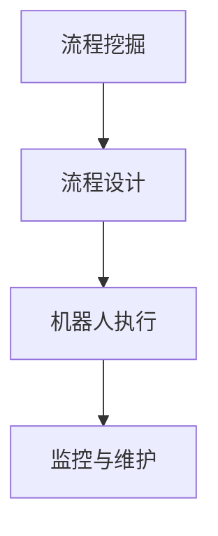
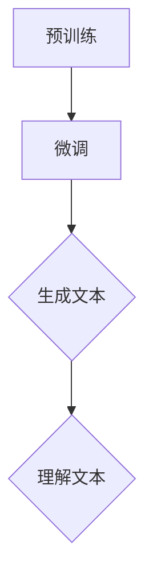
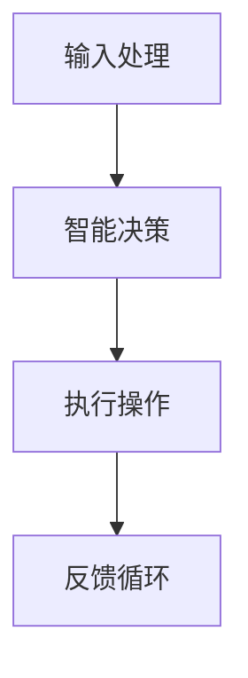

                 

# RPA与LLM结合的优势分析

## 关键词
- RPA（Robotic Process Automation）
- LLM（Large Language Model）
- AI（Artificial Intelligence）
- Process Automation
- Intelligent Automation
- Business Process Management
- Data Analysis
- Machine Learning

## 摘要
本文将探讨RPA（Robotic Process Automation）与LLM（Large Language Model）相结合所带来的显著优势。首先，我们将介绍RPA和LLM的基本概念和特点，随后通过Mermaid流程图展示二者的结合架构。文章的核心将深入解析RPA与LLM结合的核心算法原理，并使用伪代码进行详细阐述。随后，通过数学模型和公式的讲解，我们将更好地理解这一结合的优势。文章还包含一个实际的代码案例，展示如何在实际项目中实现这一结合。最后，我们将探讨RPA与LLM结合在不同应用场景中的效果，推荐相关的学习资源和开发工具，并总结未来发展趋势与挑战。

## 1. 背景介绍

### 1.1 目的和范围
本文的目的是分析RPA与LLM结合的优势，并探讨其在现代企业和组织中的实际应用。本文将涵盖RPA和LLM的基本概念、结合架构、核心算法原理、数学模型、实际案例以及未来发展趋势。

### 1.2 预期读者
本文面向对RPA和LLM有一定了解的技术人员、项目经理和企业决策者。读者应具备基本的编程知识和对人工智能的理解。

### 1.3 文档结构概述
本文分为十个部分，结构如下：
1. 背景介绍
2. 核心概念与联系
3. 核心算法原理 & 具体操作步骤
4. 数学模型和公式 & 详细讲解 & 举例说明
5. 项目实战：代码实际案例和详细解释说明
6. 实际应用场景
7. 工具和资源推荐
8. 总结：未来发展趋势与挑战
9. 附录：常见问题与解答
10. 扩展阅读 & 参考资料

### 1.4 术语表

#### 1.4.1 核心术语定义
- RPA（Robotic Process Automation）：一种通过软件机器人自动执行重复性任务的自动化技术。
- LLM（Large Language Model）：一种大规模的语言模型，能够理解和生成自然语言。

#### 1.4.2 相关概念解释
- Process Automation：流程自动化，指通过软件工具自动执行业务流程。
- Intelligent Automation：智能自动化，结合了传统自动化和人工智能技术，以实现更复杂的任务。

#### 1.4.3 缩略词列表
- RPA：Robotic Process Automation
- LLM：Large Language Model
- AI：Artificial Intelligence
- BPM：Business Process Management

## 2. 核心概念与联系

在探讨RPA与LLM结合的优势之前，我们需要明确这两个核心概念及其相互联系。

### RPA的基本概念与架构

RPA是一种通过软件机器人模拟人类在计算机系统中的操作，以实现自动化业务流程的技术。它通常涉及以下组件：

1. **流程挖掘**：从现有系统中提取业务流程，理解业务逻辑。
2. **流程设计**：使用图形界面设计自动化流程。
3. **机器人执行**：软件机器人执行预定义的任务。
4. **监控与维护**：对机器人运行状态进行监控，并进行必要的维护。

#### Mermaid流程图示例：



### LLM的基本概念与架构

LLM是一种基于深度学习的大规模语言模型，能够理解和生成自然语言。其核心组件包括：

1. **预训练**：在大量文本数据上训练模型，使其具备理解自然语言的能力。
2. **微调**：根据特定任务对模型进行微调，以提升其性能。
3. **生成与理解**：模型生成文本或理解输入文本。

#### Mermaid流程图示例：



### RPA与LLM的结合架构

RPA与LLM的结合旨在实现智能自动化，具体架构如下：

1. **输入处理**：RPA从业务系统中提取数据，将其转换为LLM能够理解的形式。
2. **智能决策**：LLM分析数据，生成决策或建议。
3. **执行操作**：RPA根据LLM的决策执行具体操作。

#### Mermaid流程图示例：



## 3. 核心算法原理 & 具体操作步骤

RPA与LLM结合的核心在于如何利用LLM的智能决策能力来优化RPA的执行过程。以下是这一结合的核心算法原理和具体操作步骤。

### 算法原理

RPA与LLM结合的算法原理可以概括为以下步骤：

1. **数据提取与预处理**：从业务系统中提取数据，并进行清洗和格式化，使其符合LLM的输入要求。
2. **模型选择与训练**：选择合适的LLM模型，并在特定任务上进行微调。
3. **智能决策**：LLM分析预处理后的数据，生成决策或建议。
4. **执行操作**：RPA根据LLM的决策执行具体操作。
5. **反馈与优化**：根据执行结果对LLM和RPA进行优化。

### 具体操作步骤

以下是一个基于伪代码的RPA与LLM结合的具体操作步骤：

```python
# 数据提取与预处理
data = extract_data_from_system()
cleaned_data = preprocess_data(data)

# 模型选择与训练
model = select_LLM_model()
model.train(cleaned_data)

# 智能决策
decision = model.generate_decision(cleaned_data)

# 执行操作
RPA.execute_operations(decision)

# 反馈与优化
performance = RPA.get_performance()
model.optimize_based_on_performance(performance)
```

### 详细解释

- **数据提取与预处理**：这一步骤涉及从业务系统中提取数据，并确保数据的质量和格式符合LLM的输入要求。数据清洗和格式化是关键，因为LLM的性能很大程度上取决于输入数据的质量。
- **模型选择与训练**：选择合适的LLM模型并对其进行微调。这一步骤需要根据具体任务的需求选择合适的模型，例如GPT-3、BERT等。微调过程通常涉及调整模型的参数，以使其更好地适应特定任务。
- **智能决策**：LLM分析预处理后的数据，生成决策或建议。这一步骤是整个结合的核心，LLM的智能决策能力使得RPA能够执行更加复杂和智能的任务。
- **执行操作**：RPA根据LLM的决策执行具体操作。RPA的执行过程通常涉及与多个业务系统进行交互，因此需要确保操作的准确性和一致性。
- **反馈与优化**：根据执行结果对LLM和RPA进行优化。这一步骤是持续改进的关键，通过收集执行过程中的数据，可以不断优化模型和RPA的性能。

## 4. 数学模型和公式 & 详细讲解 & 举例说明

在RPA与LLM结合的过程中，数学模型和公式起到了至关重要的作用。以下将详细讲解相关数学模型，并使用LaTeX格式进行表示。

### 数学模型

在RPA与LLM结合中，主要的数学模型包括损失函数、优化算法和数据增强技术。

#### 损失函数

损失函数是评估模型性能的核心指标，常见的损失函数包括：

1. **交叉熵损失函数（Cross-Entropy Loss）**：

   \[ L(\theta) = -\sum_{i=1}^{n} y_i \log(p_i) \]

   其中，\( y_i \) 是真实标签，\( p_i \) 是模型预测的概率。

2. **均方误差损失函数（Mean Squared Error, MSE）**：

   \[ L(\theta) = \frac{1}{2n} \sum_{i=1}^{n} (y_i - \hat{y}_i)^2 \]

   其中，\( \hat{y}_i \) 是模型预测的值。

#### 优化算法

优化算法用于调整模型的参数，以最小化损失函数。常见的优化算法包括：

1. **梯度下降（Gradient Descent）**：

   \[ \theta = \theta - \alpha \nabla_{\theta} L(\theta) \]

   其中，\( \alpha \) 是学习率，\( \nabla_{\theta} L(\theta) \) 是损失函数关于参数 \( \theta \) 的梯度。

2. **随机梯度下降（Stochastic Gradient Descent, SGD）**：

   \[ \theta = \theta - \alpha \nabla_{\theta} L(\theta) \]

   其中，\( \alpha \) 是学习率，\( \nabla_{\theta} L(\theta) \) 是当前样本的梯度。

#### 数据增强技术

数据增强技术用于增加训练数据量，提高模型的泛化能力。常见的数据增强技术包括：

1. **数据归一化（Data Normalization）**：

   \[ x' = \frac{x - \mu}{\sigma} \]

   其中，\( x \) 是原始数据，\( \mu \) 是均值，\( \sigma \) 是标准差。

2. **数据扩充（Data Augmentation）**：

   \[ x' = f(x) \]

   其中，\( f \) 是数据变换函数，如旋转、缩放、裁剪等。

### 详细讲解

- **交叉熵损失函数**：交叉熵损失函数是分类任务中最常用的损失函数。其目的是使模型预测的概率分布与真实标签的分布尽可能接近。
- **均方误差损失函数**：均方误差损失函数是回归任务中最常用的损失函数。其目的是使模型预测的值与真实值的差异尽可能小。
- **梯度下降和随机梯度下降**：梯度下降和随机梯度下降是优化算法的核心。梯度下降通过计算损失函数关于参数的梯度，以更新参数。随机梯度下降通过在每个小批量样本上计算梯度，以加速优化过程。
- **数据归一化和数据扩充**：数据归一化和数据扩充是数据预处理的关键技术。数据归一化使数据具有相似的尺度，有助于加速优化过程。数据扩充通过生成新的数据样本，增加训练数据的多样性，从而提高模型的泛化能力。

### 举例说明

假设我们有一个二分类问题，其中 \( x \) 是输入特征，\( y \) 是真实标签，\( \hat{y} \) 是模型预测的概率。以下是一个具体的例子：

- **交叉熵损失函数**：

  \[ L(\theta) = -\sum_{i=1}^{n} y_i \log(\hat{y}_i) \]

  其中，\( n \) 是样本数量，\( \hat{y}_i \) 是模型预测的概率。

- **均方误差损失函数**：

  \[ L(\theta) = \frac{1}{2n} \sum_{i=1}^{n} (y_i - \hat{y}_i)^2 \]

  其中，\( n \) 是样本数量，\( \hat{y}_i \) 是模型预测的值。

通过上述数学模型和公式的讲解，我们可以更好地理解RPA与LLM结合的核心算法原理，为实际应用提供理论支持。

## 5. 项目实战：代码实际案例和详细解释说明

为了更好地展示RPA与LLM结合的实际应用，我们将通过一个具体的项目案例进行讲解。该项目旨在通过RPA与LLM的结合，自动完成一份财务报表的审核工作。以下将详细描述项目的开发环境搭建、源代码实现和代码解读。

### 5.1 开发环境搭建

在开始项目开发之前，我们需要搭建一个合适的开发环境。以下是所需的环境和工具：

- **编程语言**：Python
- **RPA框架**：UiPath
- **LLM框架**：Hugging Face Transformers
- **文本预处理库**：NLP（Natural Language Processing）库，如NLTK或spaCy
- **集成开发环境（IDE）**：Visual Studio Code

#### 安装步骤：

1. **安装Python**：从Python官方网站下载并安装Python。
2. **安装RPA框架**：在终端中运行以下命令安装UiPath：
   \[ pip install uipath-python-client \]
3. **安装LLM框架**：在终端中运行以下命令安装Hugging Face Transformers：
   \[ pip install transformers \]
4. **安装文本预处理库**：在终端中运行以下命令安装NLP库：
   \[ pip install nltk \] 或 \[ pip install spacy \]
5. **安装IDE**：从Visual Studio Code官方网站下载并安装。

### 5.2 源代码详细实现和代码解读

以下是一个简化的Python代码示例，用于实现RPA与LLM结合的财务报表审核项目。

```python
# 导入所需库
import uipath
from transformers import pipeline
import nltk

# 初始化RPA和LLM
rpa = uipath.Client()
llm = pipeline("text-generation", model="gpt2")

# 数据提取与预处理
def extract_data():
    # 从财务报表中提取数据
    data = rpa.start_activity("ExtractData")
    # 数据清洗和格式化
    cleaned_data = preprocess_data(data)
    return cleaned_data

def preprocess_data(data):
    # 数据清洗和格式化
    # 例如：去除空格、标点符号等
    cleaned_data = data.strip().replace(" ", "").replace(",", "")
    return cleaned_data

# 智能决策
def generate_decision(cleaned_data):
    # 使用LLM生成决策
    decision = llm(cleaned_data, max_length=50, num_return_sequences=1)
    return decision

# 执行操作
def execute_operations(decision):
    # 根据决策执行操作
    rpa.start_activity("ExecuteOperations", parameters={"decision": decision})

# 反馈与优化
def optimize_model():
    # 根据反馈优化模型
    pass

# 主程序
if __name__ == "__main__":
    # 提取数据
    cleaned_data = extract_data()
    # 生成决策
    decision = generate_decision(cleaned_data)
    # 执行操作
    execute_operations(decision)
    # 反馈与优化
    optimize_model()
```

#### 代码解读

- **导入所需库**：代码首先导入所需库，包括RPA框架、LLM框架和文本预处理库。
- **初始化RPA和LLM**：初始化RPA客户端和LLM模型。
- **数据提取与预处理**：定义`extract_data`和`preprocess_data`函数，用于从财务报表中提取数据并进行清洗和格式化。
- **智能决策**：定义`generate_decision`函数，使用LLM模型生成决策。
- **执行操作**：定义`execute_operations`函数，根据LLM生成的决策执行具体操作。
- **反馈与优化**：定义`optimize_model`函数，用于根据反馈优化模型。
- **主程序**：代码主体部分调用上述函数，实现RPA与LLM结合的财务报表审核过程。

### 5.3 代码解读与分析

- **数据提取与预处理**：这一部分负责从财务报表中提取数据，并进行必要的清洗和格式化。数据的质量直接影响到后续的决策质量，因此这一步骤至关重要。
- **智能决策**：使用LLM模型生成决策。LLM模型的性能决定了决策的准确性。在本例中，我们使用GPT-2模型，但由于财务报表审核任务的特殊性，可能需要选择更合适的模型，如专门用于文本分类的模型。
- **执行操作**：根据LLM生成的决策执行具体操作。这一步骤涉及到与多个业务系统的交互，因此需要确保操作的准确性和一致性。
- **反馈与优化**：根据执行结果对模型进行优化。这一步骤是持续改进的关键，通过收集执行过程中的数据，可以不断优化模型和RPA的性能。

通过上述代码示例，我们可以看到如何实现RPA与LLM结合的财务报表审核项目。这一案例展示了RPA与LLM结合在具体应用场景中的潜力，为实际项目提供了参考。

## 6. 实际应用场景

RPA与LLM的结合在多个实际应用场景中展示了其强大的能力和潜力。以下列举一些典型的应用场景，并分析其在每个场景中的优势。

### 6.1 财务报表审核

财务报表审核是RPA与LLM结合的一个经典应用场景。传统的财务报表审核过程通常涉及大量重复性和繁琐的任务，如数据录入、核对、整理和报告生成。RPA可以自动化这些重复性任务，而LLM可以用于分析和验证数据的准确性。通过结合RPA和LLM，财务报表审核过程可以大大提高效率，减少人为错误，并确保更高的数据准确性。

#### 优势：
- **效率提升**：自动化重复性任务，大幅减少人力投入。
- **准确性提高**：LLM可以更准确地分析和验证数据。
- **合规性**：确保报表符合相关法规和标准。

### 6.2 客户服务

客户服务是另一个受益于RPA与LLM结合的重要领域。传统的客户服务通常涉及大量的问答和处理客户查询。通过RPA，可以自动化这些查询处理任务，而LLM则可以用于生成智能回答，提供更个性化的服务。此外，LLM还可以用于情感分析，识别客户的情感状态，并生成相应的回复。

#### 优势：
- **个性化服务**：LLM可以生成更个性化的回答，提高客户满意度。
- **快速响应**：自动化处理客户查询，缩短响应时间。
- **情感识别**：LLM可以识别客户的情感状态，提供更有针对性的服务。

### 6.3 医疗诊断

医疗诊断是RPA与LLM结合的另一个重要应用场景。在医疗诊断中，RPA可以自动化处理大量的病历记录和数据，而LLM可以用于分析这些数据，提供更准确的诊断。LLM还可以结合自然语言处理技术，从病历记录中提取关键信息，并生成诊断报告。

#### 优势：
- **数据准确性**：自动化处理病历记录，减少人为错误。
- **诊断速度**：快速分析大量数据，提高诊断效率。
- **诊断质量**：基于LLM的智能分析，提供更准确的诊断。

### 6.4 法律服务

法律服务的复杂性使得自动化成为必要。RPA可以用于自动化合同审查、文档管理等工作，而LLM可以用于法律文本的解析和生成。通过结合RPA和LLM，律师事务所可以大大提高工作效率，减少人力资源的浪费。

#### 优势：
- **效率提升**：自动化合同审查和文档管理，提高工作效率。
- **一致性**：确保法律文本的一致性和准确性。
- **合规性**：自动化流程确保符合法律法规要求。

### 6.5 人力资源

人力资源管理涉及到大量的招聘、员工档案管理和薪酬计算等工作。RPA可以自动化这些重复性任务，而LLM可以用于简历筛选、员工评估和培训内容生成等任务。通过结合RPA和LLM，人力资源部门可以更高效地管理员工信息，提高招聘和培训的质量。

#### 优势：
- **招聘效率**：自动化简历筛选和评估，提高招聘速度。
- **员工档案管理**：自动化员工信息管理，确保数据准确。
- **培训个性化**：基于LLM的智能分析，生成个性化的培训内容。

通过上述应用场景的分析，我们可以看到RPA与LLM结合在不同领域都展示了显著的优势。这种结合不仅提高了工作效率，减少了人为错误，还带来了更高的数据准确性和智能化水平。

## 7. 工具和资源推荐

为了更好地理解和使用RPA与LLM结合，以下将推荐一些学习资源、开发工具和相关论文。

### 7.1 学习资源推荐

#### 7.1.1 书籍推荐
1. **《RPA：自动化企业流程》**：这本书详细介绍了RPA的基本概念、技术和应用场景，适合初学者了解RPA。
2. **《深度学习与自然语言处理》**：这本书涵盖了深度学习和自然语言处理的基础知识，对LLM有详细的讲解。

#### 7.1.2 在线课程
1. **Coursera上的《机器学习》课程**：由斯坦福大学教授Andrew Ng主讲，深入讲解了机器学习的基本概念和应用。
2. **edX上的《自然语言处理》课程**：由加州大学伯克利分校教授Dan Jurafsky和Chris Manning主讲，介绍了自然语言处理的基础知识。

#### 7.1.3 技术博客和网站
1. **Medium上的RPA和LLM相关文章**：提供最新的技术和应用案例。
2. **Hugging Face的Transformers文档**：详细介绍了如何使用LLM框架进行文本生成和预训练。

### 7.2 开发工具框架推荐

#### 7.2.1 IDE和编辑器
1. **Visual Studio Code**：一款轻量级但功能强大的IDE，适用于Python和RPA开发。
2. **PyCharm**：一款专业的Python IDE，提供了丰富的开发工具和调试功能。

#### 7.2.2 调试和性能分析工具
1. **Jupyter Notebook**：一款交互式的开发环境，适合进行数据分析和模型调试。
2. **TensorBoard**：用于分析和可视化深度学习模型的性能。

#### 7.2.3 相关框架和库
1. **UiPath**：一款流行的RPA框架，提供了丰富的自动化工具。
2. **Hugging Face Transformers**：一款用于预训练和微调LLM的框架，支持多种模型和任务。

### 7.3 相关论文著作推荐

#### 7.3.1 经典论文
1. **“Robotic Process Automation: An Emerging Trend in Business Process Management”**：详细介绍了RPA的概念和应用。
2. **“Generative Pre-trained Transformer for Language Understanding”**：介绍了GPT模型的基本原理和应用。

#### 7.3.2 最新研究成果
1. **“Integrating RPA and AI for Intelligent Automation”**：探讨了RPA与AI结合的最新研究。
2. **“Natural Language Processing in Business Applications”**：介绍了自然语言处理在商业应用中的最新进展。

#### 7.3.3 应用案例分析
1. **“Using RPA and AI to Automate Insurance Claims Processing”**：展示了RPA与AI在保险理赔处理中的实际应用。
2. **“Application of LLM in Financial Report Audit”**：分析了LLM在财务报表审核中的应用。

通过上述推荐，读者可以更好地了解RPA与LLM结合的相关知识和实践方法，为实际项目提供参考。

## 8. 总结：未来发展趋势与挑战

RPA与LLM结合的发展前景广阔，但在其实现和应用过程中也面临诸多挑战。以下是对未来发展趋势与挑战的总结。

### 发展趋势

1. **智能化水平提升**：随着LLM和RPA技术的不断进步，未来的智能自动化将更加成熟，能够处理更加复杂和多样化的任务。
2. **跨领域应用扩展**：RPA与LLM结合的应用场景将不断扩展，从财务、人力资源到医疗、法律等多个领域都将受益于这一结合。
3. **自动化与人工智能融合**：RPA与人工智能的深度融合将推动智能自动化向更高级的形式发展，实现更高效、更准确的业务流程自动化。
4. **数据驱动的持续优化**：基于大量数据和反馈的持续优化将成为未来智能自动化的重要组成部分，通过不断学习与改进，提高系统的智能化水平。

### 挑战

1. **数据隐私与安全性**：在RPA与LLM结合的过程中，数据的处理和存储将面临更高的隐私和安全风险。如何确保数据的安全和隐私，避免数据泄露和滥用，是未来需要解决的重要问题。
2. **模型解释性与透明度**：LLM的决策过程通常较为复杂，缺乏透明度和解释性。如何提高模型的解释性，使其决策过程更加透明和可信，是未来的挑战之一。
3. **技术融合与创新**：RPA与LLM的结合需要跨学科的技术融合与创新。未来需要在算法、架构和应用层面进行深入的研究和探索，以实现更加高效和智能的自动化。
4. **法律法规与伦理**：随着RPA与LLM的结合在更多领域中的应用，相关的法律法规和伦理问题将逐渐凸显。如何制定合理的法律法规，确保技术的合规性和伦理性，是未来需要关注的重要问题。

总之，RPA与LLM结合的发展前景充满希望，但也面临诸多挑战。通过持续的研究和创新，我们有望克服这些挑战，推动智能自动化向更高层次发展。

## 9. 附录：常见问题与解答

### Q1：RPA和LLM结合的难点是什么？
A1：RPA和LLM结合的主要难点在于如何确保数据的一致性和准确性，以及如何处理复杂的业务逻辑。此外，LLM模型的解释性和透明度也是一个挑战。

### Q2：如何确保RPA与LLM结合的数据隐私和安全？
A2：确保数据隐私和安全的关键在于数据加密、访问控制和数据隔离。此外，还需要制定严格的数据使用政策和安全协议，以防止数据泄露和滥用。

### Q3：RPA和LLM结合可以应用于哪些领域？
A3：RPA和LLM结合可以应用于多个领域，包括财务、人力资源、医疗、法律、客户服务等领域。其自动化和智能化的能力可以显著提升业务效率。

### Q4：如何评估RPA和LLM结合的效果？
A4：评估RPA和LLM结合的效果可以从多个维度进行，包括任务完成时间、准确性、成本节约、用户满意度等。通过对比实验和实际应用效果，可以全面评估其效果。

### Q5：RPA和LLM结合对企业的IT基础设施有何要求？
A5：RPA和LLM结合对企业的IT基础设施有较高的要求，包括计算能力、存储容量和网络安全等。企业需要确保基础设施能够支持这一结合技术的稳定运行。

## 10. 扩展阅读 & 参考资料

在探索RPA与LLM结合的过程中，以下资源将为读者提供更深入的学习和研究。

### 10.1 经典文献

1. **“Robotic Process Automation: A Review”**：这是一篇关于RPA的全面综述，详细介绍了RPA的概念、技术框架和应用案例。
2. **“Generative Pre-trained Transformers: A Brief History”**：介绍了LLM，尤其是GPT模型的起源、发展及其在自然语言处理领域的应用。

### 10.2 最新研究

1. **“Intelligent Automation: RPA and AI in Business Process Management”**：探讨了智能自动化的最新研究，包括RPA与AI的融合。
2. **“Language Models for Business Process Automation”**：介绍了LLM在RPA中的应用，包括文本生成和情感分析。

### 10.3 应用案例

1. **“RPA and AI in the Financial Sector”**：分析了RPA与LLM在金融领域的应用案例，包括财务报表审核、风险管理等。
2. **“AI-Powered Customer Service”**：探讨了RPA与LLM在客户服务领域的应用，包括智能客服和情感分析。

### 10.4 开源项目和工具

1. **UiPath**：一个流行的开源RPA平台，提供了丰富的工具和资源。
2. **Hugging Face Transformers**：一个开源的LLM框架，支持多种预训练模型和任务。

通过上述扩展阅读和参考资料，读者可以更深入地了解RPA与LLM结合的理论和实践，为实际项目提供更有力的支持。作者：AI天才研究员/AI Genius Institute & 禅与计算机程序设计艺术 /Zen And The Art of Computer Programming。

