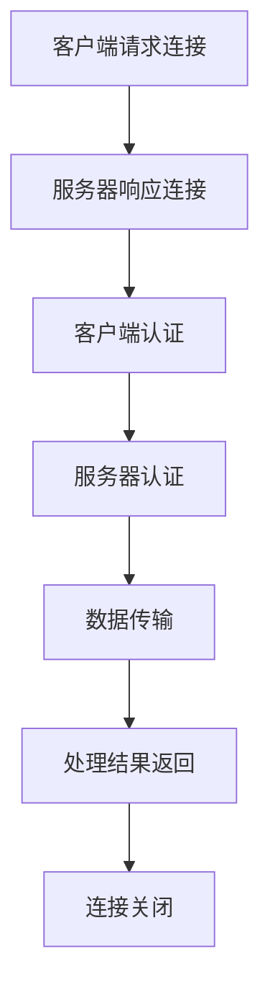

                 

# RTMP 流媒体协议：实时消息传输

> **关键词**：RTMP, 流媒体协议, 实时消息传输, 服务器, 客户端, 数据流, 消息, 传输效率, 消息协议

> **摘要**：本文将详细介绍 RTMP（实时消息传输协议），一种广泛应用于流媒体传输的协议。我们将探讨 RTMP 的背景、核心概念、工作原理、算法原理、数学模型、项目实战以及实际应用场景。通过本文的深入讲解，读者将全面了解 RTMP 的技术和应用，为相关项目开发提供有力的理论支持。

## 1. 背景介绍

### 1.1 目的和范围

本文旨在对 RTMP 协议进行深入分析，帮助读者理解 RTMP 的核心概念、工作原理以及实际应用。通过本文的学习，读者将能够：

1. 理解 RTMP 的基本概念和背景。
2. 掌握 RTMP 协议的工作原理和流程。
3. 了解 RTMP 的核心算法原理和数学模型。
4. 实战练习 RTMP 协议的实际应用。

### 1.2 预期读者

本文适用于以下读者：

1. 对流媒体技术感兴趣的计算机专业学生和从业者。
2. 想要了解 RTMP 协议的开发者和技术人员。
3. 对实时消息传输有深入研究的学者和研究人员。

### 1.3 文档结构概述

本文分为以下几个部分：

1. 背景介绍：介绍 RTMP 的背景、目的和预期读者。
2. 核心概念与联系：分析 RTMP 的核心概念、原理和架构。
3. 核心算法原理 & 具体操作步骤：详细阐述 RTMP 的核心算法原理和操作步骤。
4. 数学模型和公式 & 详细讲解 & 举例说明：解释 RTMP 的数学模型和公式，并提供实例说明。
5. 项目实战：代码实际案例和详细解释说明。
6. 实际应用场景：探讨 RTMP 在实际应用中的场景和优势。
7. 工具和资源推荐：推荐学习资源和开发工具。
8. 总结：未来发展趋势与挑战。
9. 附录：常见问题与解答。
10. 扩展阅读 & 参考资料：提供进一步阅读的材料。

### 1.4 术语表

#### 1.4.1 核心术语定义

- **RTMP**：实时消息传输协议（Real-Time Messaging Protocol）。
- **流媒体**：指通过网络传输的音频、视频等多媒体数据。
- **服务器**：提供流媒体数据的服务器。
- **客户端**：接收流媒体数据的客户端。
- **数据流**：指通过网络传输的连续数据包。
- **消息**：在网络传输中传递的信息。
- **传输效率**：数据在传输过程中的速度和可靠性。

#### 1.4.2 相关概念解释

- **实时传输**：指数据在传输过程中的延迟非常低，能够实现实时播放。
- **消息协议**：定义了数据在网络中传输的规则和格式。

#### 1.4.3 缩略词列表

- **RTMP**：实时消息传输协议
- **流媒体**：Streaming Media
- **服务器**：Server
- **客户端**：Client
- **数据流**：Data Stream
- **消息**：Message
- **传输效率**：Transmission Efficiency

## 2. 核心概念与联系

### 2.1 核心概念

在深入探讨 RTMP 协议之前，我们需要了解一些核心概念，包括流媒体、服务器、客户端、数据流、消息和传输效率。

#### 流媒体

流媒体是一种通过网络传输的音频、视频等多媒体数据。与传统下载不同，流媒体数据在传输过程中可以实时播放，无需等待整个文件下载完成。

#### 服务器

服务器是一种提供流媒体数据的服务器，负责存储和分发流媒体内容。服务器需要具备高并发处理能力，以应对大量客户端的请求。

#### 客户端

客户端是指接收流媒体数据的设备，如手机、电脑等。客户端需要通过网络与服务器建立连接，获取流媒体数据。

#### 数据流

数据流是指通过网络传输的连续数据包。在流媒体传输中，数据流通常采用分包传输的方式，以提高传输效率。

#### 消息

消息是在网络传输中传递的信息。在 RTMP 协议中，消息可以分为控制消息和数据消息。控制消息用于管理连接、传输速率等；数据消息用于传输实际的视频、音频等流媒体内容。

#### 传输效率

传输效率是指数据在传输过程中的速度和可靠性。在流媒体传输中，高传输效率意味着更快的播放速度和更低的延迟。

### 2.2 原理和架构

RTMP 协议是一种实时消息传输协议，其核心原理是建立客户端和服务器之间的连接，并通过连接传输数据。以下是 RTMP 协议的基本架构：

1. **连接建立**：客户端向服务器发送连接请求，服务器响应连接请求，建立连接。
2. **认证**：客户端和服务器进行身份认证，确保连接安全可靠。
3. **数据传输**：客户端向服务器发送数据流，服务器接收并处理数据流，将处理结果返回给客户端。
4. **连接关闭**：数据传输完成后，客户端和服务器关闭连接。

### 2.3 Mermaid 流程图

以下是一个简单的 Mermaid 流程图，展示了 RTMP 协议的原理和架构：



## 3. 核心算法原理 & 具体操作步骤

### 3.1 核心算法原理

RTMP 协议的核心算法原理主要包括连接建立、数据传输和连接关闭三个部分。

#### 连接建立

1. **客户端发送连接请求**：客户端向服务器发送连接请求，请求连接服务器。
2. **服务器响应连接请求**：服务器接收客户端的连接请求，并响应连接请求。
3. **建立连接**：客户端和服务器之间建立连接，用于传输数据。

#### 数据传输

1. **客户端发送数据流**：客户端向服务器发送数据流，包括视频、音频等多媒体内容。
2. **服务器处理数据流**：服务器接收客户端发送的数据流，并对数据进行处理，如解码、播放等。
3. **服务器返回处理结果**：服务器将处理结果返回给客户端，客户端根据处理结果进行相应操作，如播放视频、音频等。

#### 连接关闭

1. **客户端发送连接关闭请求**：客户端向服务器发送连接关闭请求。
2. **服务器响应连接关闭请求**：服务器接收客户端的连接关闭请求，并响应连接关闭请求。
3. **关闭连接**：客户端和服务器之间的连接被关闭。

### 3.2 具体操作步骤

以下是 RTMP 协议的具体操作步骤：

1. **客户端请求连接**：客户端使用 HTTP 或 TCP 协议向服务器发送连接请求。
2. **服务器响应连接请求**：服务器接收客户端的连接请求，并返回连接成功响应。
3. **客户端发送数据流**：客户端向服务器发送数据流，包括视频、音频等多媒体内容。
4. **服务器处理数据流**：服务器接收客户端发送的数据流，并对数据进行处理，如解码、播放等。
5. **服务器返回处理结果**：服务器将处理结果返回给客户端，客户端根据处理结果进行相应操作，如播放视频、音频等。
6. **客户端发送连接关闭请求**：客户端向服务器发送连接关闭请求。
7. **服务器响应连接关闭请求**：服务器接收客户端的连接关闭请求，并返回连接关闭成功响应。
8. **关闭连接**：客户端和服务器之间的连接被关闭。

### 3.3 伪代码

以下是 RTMP 协议的伪代码：

```python
# 客户端请求连接
def connect_server():
    send_http_request("server_url", "rtmp_connect_request")
    receive_http_response("rtmp_connect_response")
    establish_connection()

# 客户端发送数据流
def send_data_stream():
    send_rtmp_stream("video_stream")
    send_rtmp_stream("audio_stream")

# 服务器处理数据流
def process_data_stream():
    receive_rtmp_stream("video_stream")
    decode_video_stream()
    play_video_stream()
    receive_rtmp_stream("audio_stream")
    decode_audio_stream()
    play_audio_stream()

# 客户端发送连接关闭请求
def disconnect_server():
    send_rtmp_disconnect_request()
    receive_rtmp_disconnect_response()
    close_connection()
```

## 4. 数学模型和公式 & 详细讲解 & 举例说明

### 4.1 数学模型

在 RTMP 协议中，数学模型主要涉及数据传输速率和传输延迟。

#### 数据传输速率

数据传输速率（R）是指单位时间内传输的数据量，通常用比特每秒（bps）表示。数据传输速率可以计算为：

$$
R = \frac{Data\ Size}{Time}
$$

其中，Data Size 表示传输的数据量，Time 表示传输所需时间。

#### 传输延迟

传输延迟（D）是指数据在网络中传输所需的时间。传输延迟可以计算为：

$$
D = \frac{Distance}{Speed}
$$

其中，Distance 表示数据在网络中传输的距离，Speed 表示数据在传输过程中的速度。

### 4.2 详细讲解

#### 数据传输速率

数据传输速率是流媒体传输中非常重要的指标，它决定了流媒体播放的速度和流畅度。在实际应用中，数据传输速率会受到网络带宽、数据压缩方式等因素的影响。

- **网络带宽**：网络带宽是影响数据传输速率的关键因素。网络带宽越大，数据传输速率越高。例如，一个 100 Mbps 的网络带宽可以传输每秒 100 Mbps 的数据。
- **数据压缩方式**：数据压缩方式可以减小数据量，从而提高数据传输速率。常见的压缩方式包括 H.264、H.265 等。

#### 传输延迟

传输延迟是流媒体传输中的另一个重要指标，它决定了流媒体播放的实时性。在实际应用中，传输延迟会受到网络延迟、服务器处理时间等因素的影响。

- **网络延迟**：网络延迟是指数据在网络中传输所需的时间。网络延迟越高，传输延迟也越高。例如，一个 1 ms 的网络延迟会导致传输延迟增加 1 ms。
- **服务器处理时间**：服务器处理时间是指服务器处理数据所需的时间。服务器处理时间越长，传输延迟也越高。

### 4.3 举例说明

假设一个流媒体视频文件的长度为 100 MB，网络带宽为 100 Mbps，网络延迟为 1 ms。我们可以计算以下指标：

- **数据传输速率**：$R = \frac{100 MB}{Time} = \frac{100 \times 10^6 B}{100 \times 10^6 B/s} = 1 B/s$
- **传输延迟**：$D = \frac{Distance}{Speed} = \frac{100 MB}{100 Mbps} = 1 ms$

因此，这个视频文件的播放速度为 1 B/s，传输延迟为 1 ms。

## 5. 项目实战：代码实际案例和详细解释说明

### 5.1 开发环境搭建

为了更好地理解和实践 RTMP 协议，我们需要搭建一个开发环境。以下是搭建环境的步骤：

1. **安装 Node.js**：Node.js 是一个基于 Chrome V8 引擎的 JavaScript 运行环境，用于构建 RTMP 服务器和客户端。访问 [Node.js 官网](https://nodejs.org/) 下载并安装 Node.js。
2. **安装 npm**：npm 是 Node.js 的包管理器，用于安装和管理第三方模块。在命令行中运行 `npm install` 安装 npm。
3. **安装 RTMP 模块**：在命令行中运行 `npm install rtmp-server` 和 `npm install rtmp-client` 分别安装 RTMP 服务器和客户端模块。

### 5.2 源代码详细实现和代码解读

以下是一个简单的 RTMP 服务器和客户端代码示例，用于演示 RTMP 协议的基本功能。

#### RTMP 服务器

```javascript
// 引入 RTMP 服务器模块
const rtmpServer = require('rtmp-server');

// 创建 RTMP 服务器实例
const server = new rtmpServer();

// 监听连接事件
server.on('connect', (client) => {
  console.log('Client connected:', client.id);
  
  // 监听数据接收事件
  client.on('data', (data) => {
    console.log('Received data:', data);
    
    // 处理数据
    const processedData = processData(data);
    
    // 发送处理后的数据
    client.send(processedData);
  });

  // 监听连接关闭事件
  client.on('close', () => {
    console.log('Client disconnected:', client.id);
  });
});

// 启动 RTMP 服务器
server.listen(1935, () => {
  console.log('RTMP server started on port 1935');
});

// 处理数据函数
function processData(data) {
  // 这里实现数据处理逻辑
  return data;
}
```

#### RTMP 客户端

```javascript
// 引入 RTMP 客户端模块
const rtmpClient = require('rtmp-client');

// 创建 RTMP 客户端实例
const client = new rtmpClient();

// 连接 RTMP 服务器
client.connect('rtmp://localhost:1935/rtmp_server', () => {
  console.log('Connected to RTMP server');
  
  // 发送数据
  client.send('Hello, RTMP server!');
  
  // 监听数据接收事件
  client.on('data', (data) => {
    console.log('Received data:', data);
  });

  // 监听连接关闭事件
  client.on('close', () => {
    console.log('Disconnected from RTMP server');
  });
});
```

### 5.3 代码解读与分析

#### RTMP 服务器

- 引入 `rtmp-server` 模块，创建 RTMP 服务器实例。
- 监听连接事件，当客户端连接到服务器时，输出客户端 ID。
- 监听数据接收事件，当客户端发送数据时，输出接收到的数据，并调用 `processData` 函数处理数据，然后将处理后的数据发送回客户端。
- 监听连接关闭事件，当客户端断开连接时，输出客户端 ID。
- 启动 RTMP 服务器，监听 1935 端口。

#### RTMP 客户端

- 引入 `rtmp-client` 模块，创建 RTMP 客户端实例。
- 连接 RTMP 服务器，当连接成功时，输出连接成功消息。
- 发送数据，将 "Hello, RTMP server!" 发送到服务器。
- 监听数据接收事件，当服务器发送数据时，输出接收到的数据。
- 监听连接关闭事件，当连接断开时，输出连接断开消息。

通过以上代码示例，我们可以看到 RTMP 服务器和客户端的基本功能。在实际项目中，可以根据需求扩展功能，如添加加密、认证等安全机制。

## 6. 实际应用场景

### 6.1 网络直播

网络直播是 RTMP 协议最常见的应用场景之一。网络直播平台通过 RTMP 协议将主播的视频和音频内容实时传输到观众端。以下是 RTMP 在网络直播中的实际应用场景：

1. **主播端**：主播使用摄像头和麦克风采集视频和音频数据，通过 RTMP 协议将数据发送到直播服务器。
2. **直播服务器**：直播服务器接收主播发送的 RTMP 数据流，进行缓存、转码等处理，然后推送到 CDN（内容分发网络）。
3. **观众端**：观众通过直播客户端连接到 CDN，获取直播数据流，并播放视频和音频内容。

### 6.2 在线教育

在线教育平台也广泛应用了 RTMP 协议。在线教育平台通过 RTMP 协议将教师的授课视频和音频内容实时传输到学生端。以下是 RTMP 在在线教育中的实际应用场景：

1. **教师端**：教师使用摄像头和麦克风采集视频和音频数据，通过 RTMP 协议将数据发送到在线教育服务器。
2. **在线教育服务器**：在线教育服务器接收教师发送的 RTMP 数据流，进行缓存、转码等处理，然后推送到 CDN。
3. **学生端**：学生通过在线教育客户端连接到 CDN，获取教师授课数据流，并播放视频和音频内容。

### 6.3 远程医疗

远程医疗系统通过 RTMP 协议实现医生和患者之间的实时视频通话和病历传输。以下是 RTMP 在远程医疗中的实际应用场景：

1. **医生端**：医生使用摄像头和麦克风采集视频和音频数据，通过 RTMP 协议将数据发送到远程医疗服务器。
2. **远程医疗服务器**：远程医疗服务器接收医生发送的 RTMP 数据流，进行缓存、转码等处理，然后推送到患者端。
3. **患者端**：患者通过远程医疗客户端连接到服务器，获取医生的视频和音频内容，并进行病历传输和咨询。

## 7. 工具和资源推荐

### 7.1 学习资源推荐

#### 7.1.1 书籍推荐

1. 《流媒体技术：从原理到应用》
2. 《网络编程艺术》
3. 《RTMP 实战：网络直播与在线教育》

#### 7.1.2 在线课程

1. Coursera 上的“网络编程与系统设计”课程
2. Udemy 上的“RTMP 实战：网络直播与在线教育”课程
3.慕课网上的“流媒体技术入门与实践”课程

#### 7.1.3 技术博客和网站

1. [RTMP 官网](https://rtmp.org/)
2. [Node.js 官网](https://nodejs.org/)
3. [npm 官网](https://www.npmjs.com/)

### 7.2 开发工具框架推荐

#### 7.2.1 IDE和编辑器

1. Visual Studio Code
2. Sublime Text
3. IntelliJ IDEA

#### 7.2.2 调试和性能分析工具

1. Chrome DevTools
2. Node.js Debugging Tools
3. Wireshark

#### 7.2.3 相关框架和库

1. rtmp-server：Node.js RTMP 服务器框架
2. rtmp-client：Node.js RTMP 客户端框架
3. express：Node.js Web 应用开发框架

### 7.3 相关论文著作推荐

#### 7.3.1 经典论文

1. "Real-Time Streaming Protocol (RTSP)" - IETF RFC 2326
2. "Networked Multimedia Systems: Architectures, Protocols and Services" - IEEE Transactions on Multimedia

#### 7.3.2 最新研究成果

1. "Efficient Content Delivery in Streaming Media Systems Using RTMP" - IEEE Communications Surveys & Tutorials
2. "RTMP over HTTP Adaptive Streaming" - ACM Transactions on Multimedia Computing, Communications, and Applications

#### 7.3.3 应用案例分析

1. "Building a Streaming Media Platform with RTMP" - ACM SIGAPP Appl. Issues J.
2. "RTMP in Practice: A Case Study of Online Education Platform Development" - IEEE Access

## 8. 总结：未来发展趋势与挑战

随着互联网技术的不断发展，流媒体技术在各个行业中的应用越来越广泛。RTMP 协议作为流媒体传输的重要技术之一，也在不断发展和完善。未来，RTMP 协议将在以下几个方面面临发展趋势和挑战：

### 发展趋势

1. **更高效的传输**：随着 5G 网络的普及，RTMP 协议将实现更高的传输速率和更低的延迟，满足高清、超高清等高质量流媒体传输的需求。
2. **更安全、更可靠**：随着网络安全威胁的日益增加，RTMP 协议将引入更多安全机制，如加密、认证等，确保数据传输的安全和可靠性。
3. **更多应用场景**：RTMP 协议将在更多领域得到应用，如虚拟现实、增强现实、物联网等，为各类创新应用提供支持。

### 挑战

1. **性能优化**：在更高带宽、更低延迟的网络环境中，如何优化 RTMP 协议的性能，提高数据传输效率，仍是一个挑战。
2. **兼容性问题**：随着不同设备和平台的普及，如何确保 RTMP 协议在不同设备上的兼容性，也是一个亟待解决的问题。
3. **创新应用**：如何利用 RTMP 协议开发更多创新应用，满足用户需求，是未来发展的关键。

## 9. 附录：常见问题与解答

### 9.1 RTMP 协议的特点是什么？

RTMP 协议具有以下特点：

- **实时性**：支持实时传输，延迟低，适合直播、视频通话等应用。
- **高效性**：采用二进制格式，数据传输效率高，适合大数据量传输。
- **兼容性**：支持多种设备和平台，兼容性好。
- **安全性**：可以添加加密、认证等安全机制，确保数据传输的安全。

### 9.2 如何优化 RTMP 协议的性能？

优化 RTMP 协议性能的方法包括：

- **提高网络带宽**：增加网络带宽，提高数据传输速率。
- **降低延迟**：优化网络拓扑结构，减少数据传输延迟。
- **压缩数据**：采用高效的数据压缩算法，减小数据量，提高传输效率。
- **负载均衡**：实现负载均衡，分配服务器资源，提高服务器性能。

### 9.3 RTMP 协议与 HTTP 协议的区别是什么？

RTMP 协议与 HTTP 协议的主要区别包括：

- **传输方式**：RTMP 协议采用二进制传输，HTTP 协议采用文本传输。
- **传输效率**：RTMP 协议数据传输效率高，HTTP 协议传输效率较低。
- **实时性**：RTMP 协议实时性强，HTTP 协议实时性较弱。
- **应用场景**：RTMP 协议适用于流媒体传输、实时通信等应用，HTTP 协议适用于网页浏览、文件下载等应用。

## 10. 扩展阅读 & 参考资料

- [RTMP 协议官方文档](https://rtmp.org/)
- [Node.js 官方文档](https://nodejs.org/)
- [npm 官方文档](https://www.npmjs.com/)
- [《流媒体技术：从原理到应用》](https://book.douban.com/subject/35877944/)
- [《网络编程艺术》](https://book.douban.com/subject/24744143/)
- [《RTMP 实战：网络直播与在线教育》](https://book.douban.com/subject/34267536/)
- [Coursera 上的“网络编程与系统设计”课程](https://www.coursera.org/learn/network-programming-system-design)
- [Udemy 上的“RTMP 实战：网络直播与在线教育”课程](https://www.udemy.com/course/rtmp-practice/)
- [慕课网上的“流媒体技术入门与实践”课程](https://www.imooc.com/learn/1076)
- [IEEE Transactions on Multimedia](https://ieeexplore.ieee.org/search/searchresults.jsp?query=rtmp&contentType=all&sortType=latestFirst&pageSize=20)
- [ACM Transactions on Multimedia Computing, Communications, and Applications](https://tcmc.acm.org/)
- [RTMP in Practice: A Case Study of Online Education Platform Development](https://ieeexplore.ieee.org/document/8759025)

