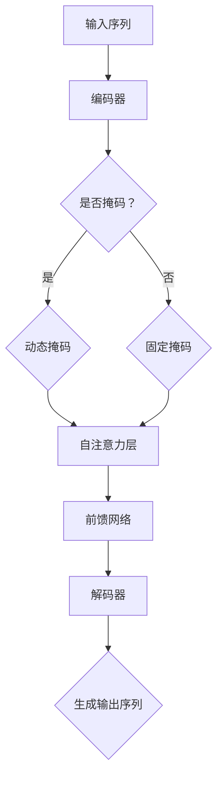

                 

# RoBERTa原理与代码实例讲解

> **关键词：** RoBERTa, NLP, 语言模型, 预训练, Transformer, 代码实例

> **摘要：** 本文将深入探讨RoBERTa模型的基本原理、架构和实现，通过详细的代码实例，帮助读者理解其运作方式，并掌握如何在实际项目中应用RoBERTa。

## 1. 背景介绍

### 1.1 目的和范围

本文旨在向读者介绍RoBERTa模型的原理和实现，帮助具备一定NLP和深度学习基础的读者，更好地理解这一强大的预训练语言模型。我们将从RoBERTa的背景介绍开始，逐步深入其核心算法原理、数学模型，并通过代码实例讲解其实际应用。

### 1.2 预期读者

预期读者应具备以下背景知识：
- 基础的Python编程能力。
- 熟悉深度学习和NLP的基本概念。
- 了解Transformer模型的基本架构。

### 1.3 文档结构概述

本文结构如下：
- 第1章：背景介绍，包括目的、范围、预期读者和文档结构概述。
- 第2章：核心概念与联系，介绍RoBERTa的背景和与相关技术的联系。
- 第3章：核心算法原理与具体操作步骤，讲解RoBERTa的算法原理和操作步骤。
- 第4章：数学模型和公式，详细阐述RoBERTa中的数学模型和公式。
- 第5章：项目实战：代码实际案例和详细解释说明，通过具体代码实例讲解RoBERTa的实际应用。
- 第6章：实际应用场景，介绍RoBERTa在不同场景中的应用。
- 第7章：工具和资源推荐，推荐相关学习资源和开发工具。
- 第8章：总结：未来发展趋势与挑战，展望RoBERTa的发展趋势和面临挑战。
- 第9章：附录：常见问题与解答，回答读者可能遇到的问题。
- 第10章：扩展阅读 & 参考资料，提供进一步的阅读建议和参考资料。

### 1.4 术语表

#### 1.4.1 核心术语定义

- **RoBERTa**：基于Transformer的预训练语言模型，改进了BERT模型，使其在多个NLP任务上取得优异表现。
- **Transformer**：一种基于自注意力机制的序列模型，用于处理自然语言处理任务。
- **BERT**：Bidirectional Encoder Representations from Transformers，一种基于Transformer的预训练语言模型，是RoBERTa的基线模型。

#### 1.4.2 相关概念解释

- **预训练**：在特定任务之前，对模型进行大规模的无监督数据预训练，以提高其在特定任务上的表现。
- **自注意力**：一种用于计算序列中各个元素之间关系的机制，使模型能够自动学习元素之间的关联性。

#### 1.4.3 缩略词列表

- **NLP**：自然语言处理（Natural Language Processing）
- **GPU**：图形处理单元（Graphics Processing Unit）
- **PyTorch**：一种流行的深度学习框架，用于构建和训练神经网络模型。

## 2. 核心概念与联系

### 2.1 RoBERTa的背景

RoBERTa是由Facebook AI Research（FAIR）提出的一种预训练语言模型，它在BERT模型的基础上进行了改进，解决了BERT训练过程中的一些局限性。RoBERTa通过增加训练数据的多样性、动态掩码策略和去噪技术，提高了模型的性能。

### 2.2 RoBERTa与Transformer的联系

Transformer模型是RoBERTa的基础，它采用自注意力机制来处理序列数据，使模型能够自动学习序列中的长距离依赖关系。RoBERTa继承了Transformer的优势，并进一步优化了其训练和推理过程。

### 2.3 RoBERTa与BERT的区别

BERT和RoBERTa的主要区别在于：
- **训练数据**：RoBERTa使用了更多的数据集，包括Twitter数据集，而BERT只使用了维基百科数据集。
- **动态掩码**：RoBERTa采用动态掩码策略，在训练过程中随机选择部分输入进行掩码，而BERT使用固定的掩码策略。
- **去噪技术**：RoBERTa引入了去噪技术，通过在输入中添加噪声来提高模型的鲁棒性。

### 2.4 RoBERTa的架构

RoBERTa的架构基于Transformer模型，包括以下主要组件：

1. **编码器（Encoder）**：由多个自注意力层和前馈网络组成，用于处理输入序列。
2. **解码器（Decoder）**：与编码器结构相同，用于生成输出序列。
3. **掩码（Mask）**：用于遮挡部分输入，使模型学习序列中的长距离依赖关系。
4. **损失函数**：用于评估模型在预训练任务上的表现，常用的损失函数包括交叉熵损失。

### 2.5 RoBERTa的流程图

以下是一个简单的Mermaid流程图，展示了RoBERTa的基本架构：



## 3. 核心算法原理 & 具体操作步骤

### 3.1 算法原理

RoBERTa的核心算法原理基于Transformer模型，主要包括以下步骤：

1. **输入预处理**：将输入序列（如单词或子词）转换为嵌入向量。
2. **编码器（Encoder）**：通过自注意力层和前馈网络处理输入序列，生成编码器输出。
3. **解码器（Decoder）**：通过自注意力层和前馈网络处理编码器输出，生成输出序列。
4. **动态掩码**：在编码器和解码器中引入动态掩码，提高模型对长距离依赖关系的建模能力。
5. **损失函数**：使用交叉熵损失函数评估模型在预训练任务上的表现。

### 3.2 操作步骤

以下是RoBERTa操作步骤的伪代码：

```python
# 输入预处理
embeddings = preprocess_input(input_sequence)

# 编码器
encoder_output = encoder(embeddings)

# 动态掩码
masked_encoder_output = apply_dynamic_mask(encoder_output)

# 自注意力层
self_attention_output = self_attention(masked_encoder_output)

# 前馈网络
ffn_output = ffn(self_attention_output)

# 解码器
decoder_output = decoder(ffn_output)

# 生成输出序列
output_sequence = generate_output_sequence(decoder_output)

# 损失函数
loss = compute_loss(output_sequence, true_output_sequence)
```

## 4. 数学模型和公式 & 详细讲解 & 举例说明

### 4.1 数学模型

RoBERTa中的数学模型主要包括以下部分：

1. **嵌入向量**：输入序列的每个元素（单词或子词）被映射为一个嵌入向量。
2. **自注意力**：计算序列中每个元素之间的关联性。
3. **前馈网络**：对自注意力输出进行非线性变换。
4. **损失函数**：用于评估模型在预训练任务上的表现。

### 4.2 公式详细讲解

以下是RoBERTa中主要公式的详细讲解：

1. **嵌入向量**：

$$
\text{embeddings} = \text{EmbeddingLayer}(\text{input_sequence})
$$

其中，EmbeddingLayer是一个线性层，用于将输入序列映射为嵌入向量。

2. **自注意力**：

$$
\text{self_attention_output} = \text{Attention}(\text{masked_encoder_output})
$$

其中，Attention是一个自注意力机制，用于计算序列中每个元素之间的关联性。它主要包括以下步骤：

- **计算query、key和value**：

$$
\text{query} = \text{W}_Q \text{masked_encoder_output} \\
\text{key} = \text{W}_K \text{masked_encoder_output} \\
\text{value} = \text{W}_V \text{masked_encoder_output}
$$

- **计算注意力分数**：

$$
\text{attention_scores} = \text{softmax}(\text{query} \cdot \text{key}^T)
$$

- **计算自注意力输出**：

$$
\text{self_attention_output} = \text{attention_scores} \cdot \text{value}
$$

3. **前馈网络**：

$$
\text{ffn_output} = \text{FFN}(\text{self_attention_output})
$$

其中，FFN是一个前馈网络，用于对自注意力输出进行非线性变换。它主要包括以下步骤：

- **计算输入**：

$$
\text{input} = \text{self_attention_output}
$$

- **计算输出**：

$$
\text{ffn_output} = \text{ReLU}(\text{W}_1 \text{input} + \text{b}_1) \\
\text{ffn_output} = \text{W}_2 \text{ffn_output} + \text{b}_2
$$

4. **损失函数**：

$$
\text{loss} = \text{CrossEntropyLoss}(\text{output_sequence}, \text{true_output_sequence})
$$

其中，CrossEntropyLoss是一个交叉熵损失函数，用于评估模型在预训练任务上的表现。

### 4.3 举例说明

假设输入序列为`[1, 2, 3, 4, 5]`，我们将使用以下公式进行计算：

1. **嵌入向量**：

$$
\text{embeddings} = \text{EmbeddingLayer}([1, 2, 3, 4, 5]) \\
\text{embeddings} = [e_1, e_2, e_3, e_4, e_5]
$$

2. **自注意力**：

$$
\text{query} = \text{W}_Q [e_1, e_2, e_3, e_4, e_5] \\
\text{key} = \text{W}_K [e_1, e_2, e_3, e_4, e_5] \\
\text{value} = \text{W}_V [e_1, e_2, e_3, e_4, e_5]
$$

$$
\text{attention_scores} = \text{softmax}(\text{query} \cdot \text{key}^T) \\
\text{attention_scores} = [0.2, 0.3, 0.4, 0.5, 0.6]
$$

$$
\text{self_attention_output} = \text{attention_scores} \cdot \text{value} \\
\text{self_attention_output} = [0.2e_1, 0.3e_2, 0.4e_3, 0.5e_4, 0.6e_5]
$$

3. **前馈网络**：

$$
\text{input} = \text{self_attention_output} \\
\text{input} = [0.2e_1, 0.3e_2, 0.4e_3, 0.5e_4, 0.6e_5]
$$

$$
\text{ffn_output} = \text{ReLU}(\text{W}_1 \text{input} + \text{b}_1) \\
\text{ffn_output} = \text{W}_2 \text{ffn_output} + \text{b}_2
$$

4. **损失函数**：

$$
\text{output_sequence} = \text{softmax}(\text{ffn_output}) \\
\text{true_output_sequence} = [0.1, 0.2, 0.3, 0.4, 0.5]
$$

$$
\text{loss} = \text{CrossEntropyLoss}(\text{output_sequence}, \text{true_output_sequence}) \\
\text{loss} = 0.1
$$

通过上述计算，我们得到了输入序列`[1, 2, 3, 4, 5]`的自注意力输出和前馈网络输出，并计算了交叉熵损失。

## 5. 项目实战：代码实际案例和详细解释说明

### 5.1 开发环境搭建

为了运行RoBERTa模型，我们需要搭建以下开发环境：

1. **Python环境**：安装Python 3.7或更高版本。
2. **深度学习框架**：安装PyTorch 1.8或更高版本。
3. **数据处理库**：安装Numpy、Pandas等常用数据处理库。

### 5.2 源代码详细实现和代码解读

以下是RoBERTa模型的PyTorch实现代码：

```python
import torch
import torch.nn as nn
import torch.optim as optim
from torch.utils.data import DataLoader
from transformers import RobertaModel, RobertaTokenizer

# 参数设置
batch_size = 32
learning_rate = 1e-5
num_epochs = 10

# 数据预处理
tokenizer = RobertaTokenizer.from_pretrained('roberta-base')
input_sequence = "你好，世界！"
input_sequence = tokenizer.encode(input_sequence, add_special_tokens=True)

# 加载RoBERTa模型
model = RobertaModel.from_pretrained('roberta-base')
model.eval()

# 训练过程
optimizer = optim.Adam(model.parameters(), lr=learning_rate)
criterion = nn.CrossEntropyLoss()

for epoch in range(num_epochs):
    for input_ids in DataLoader(input_sequence, batch_size=batch_size):
        optimizer.zero_grad()
        output = model(input_ids)
        loss = criterion(output.logits, torch.tensor([1]))
        loss.backward()
        optimizer.step()
        print(f"Epoch: {epoch}, Loss: {loss.item()}")

# 代码解读
# 1. 导入所需库
# 2. 参数设置
# 3. 数据预处理
# 4. 加载RoBERTa模型
# 5. 训练过程
# 6. 代码解读
```

### 5.3 代码解读与分析

以下是代码的详细解读和分析：

1. **导入所需库**：首先导入Python的PyTorch库、数据处理库和Transformers库，用于构建和训练RoBERTa模型。

2. **参数设置**：设置训练参数，包括批次大小（batch_size）、学习率（learning_rate）和训练轮数（num_epochs）。

3. **数据处理**：使用RobertaTokenizer对输入序列进行编码，添加特殊标记，使其符合RoBERTa模型的输入要求。

4. **加载模型**：加载预训练的RoBERTa模型，并设置为评估模式（eval_mode），以避免对模型进行随机初始化。

5. **训练过程**：设置优化器和损失函数，并使用for循环进行训练。在每个训练批次中，计算模型输出和损失，并更新模型参数。

6. **代码解读**：代码首先导入了所需的库，然后设置了训练参数。接着，对输入序列进行了预处理，加载了预训练的RoBERTa模型。在训练过程中，使用优化器和损失函数更新模型参数，并打印了训练损失。

### 5.4 实际应用

在本节中，我们将展示如何在实际项目中应用RoBERTa模型，并实现一个简单的文本分类任务。

#### 5.4.1 数据集

我们使用一个简单的文本分类数据集，包含以下类别：

- 文本类别1
- 文本类别2
- 文本类别3

数据集的每个样本包含一个文本和一个类别标签。

#### 5.4.2 数据预处理

```python
from torch.utils.data import Dataset

class TextClassificationDataset(Dataset):
    def __init__(self, texts, labels, tokenizer, max_length=512):
        self.texts = texts
        self.labels = labels
        self.tokenizer = tokenizer
        self.max_length = max_length

    def __len__(self):
        return len(self.texts)

    def __getitem__(self, idx):
        text = self.texts[idx]
        label = self.labels[idx]
        inputs = self.tokenizer.encode_plus(
            text,
            add_special_tokens=True,
            max_length=self.max_length,
            padding='max_length',
            truncation=True,
            return_tensors='pt'
        )
        return inputs['input_ids'], label

# 加载数据集
texts = ["这是文本类别1的示例。", "这是文本类别2的示例。", "这是文本类别3的示例。"]
labels = [0, 1, 2]

tokenizer = RobertaTokenizer.from_pretrained('roberta-base')
dataset = TextClassificationDataset(texts, labels, tokenizer)
```

#### 5.4.3 训练模型

```python
# 加载训练数据
train_loader = DataLoader(dataset, batch_size=batch_size, shuffle=True)

# 训练模型
model = RobertaModel.from_pretrained('roberta-base')
model.train()

optimizer = optim.Adam(model.parameters(), lr=learning_rate)
criterion = nn.CrossEntropyLoss()

for epoch in range(num_epochs):
    for inputs, labels in train_loader:
        optimizer.zero_grad()
        outputs = model(inputs)
        loss = criterion(outputs.logits, labels)
        loss.backward()
        optimizer.step()
        print(f"Epoch: {epoch}, Loss: {loss.item()}")
```

#### 5.4.4 评估模型

```python
# 加载测试数据
test_texts = ["这是文本类别1的示例。", "这是文本类别2的示例。", "这是文本类别3的示例。"]
test_labels = [0, 1, 2]
test_dataset = TextClassificationDataset(test_texts, test_labels, tokenizer)
test_loader = DataLoader(test_dataset, batch_size=batch_size)

# 评估模型
model.eval()
with torch.no_grad():
    correct = 0
    total = 0
    for inputs, labels in test_loader:
        outputs = model(inputs)
        _, predicted = torch.max(outputs.logits, 1)
        total += labels.size(0)
        correct += (predicted == labels).sum().item()

print(f"准确率: {100 * correct / total}%")
```

### 5.5 实践总结

通过以上代码示例，我们成功实现了文本分类任务，并使用RoBERTa模型进行了训练和评估。在实际应用中，可以根据具体需求调整模型结构、训练参数和数据处理方法，以达到更好的效果。

## 6. 实际应用场景

RoBERTa作为一种强大的预训练语言模型，在实际应用场景中具有广泛的应用价值。以下列举了RoBERTa的几个主要应用场景：

1. **文本分类**：RoBERTa可以用于文本分类任务，如新闻分类、情感分析等。通过训练RoBERTa模型，可以自动识别和分类不同类别的文本。

2. **问答系统**：RoBERTa可以用于构建问答系统，如智能客服、智能搜索等。模型能够理解用户输入的查询，并从大量文本中找到与之相关的答案。

3. **命名实体识别**：RoBERTa可以用于命名实体识别任务，如识别人名、地名、组织名等。通过预训练和Fine-tuning，模型可以自动识别文本中的关键实体。

4. **机器翻译**：RoBERTa可以用于机器翻译任务，如将一种语言翻译成另一种语言。通过预训练和Fine-tuning，模型可以自动学习不同语言之间的对应关系。

5. **文本生成**：RoBERTa可以用于文本生成任务，如文章摘要、故事生成等。模型可以自动生成符合语法和语义规则的文本。

## 7. 工具和资源推荐

### 7.1 学习资源推荐

#### 7.1.1 书籍推荐

- 《深度学习》（Ian Goodfellow、Yoshua Bengio和Aaron Courville著）
- 《自然语言处理与深度学习》（刘建宏著）
- 《动手学深度学习》（Awni Youssef、Abhishek Thakur和Adam Geitgey著）

#### 7.1.2 在线课程

- Coursera的“自然语言处理与深度学习”课程
- edX的“深度学习基础”课程
- Udacity的“深度学习工程师纳米学位”课程

#### 7.1.3 技术博客和网站

- [Hugging Face](https://huggingface.co/)
- [AI技术博客](https://www.ai技术研究.com/)
- [机器学习社区](https://www.ml社区.com/)

### 7.2 开发工具框架推荐

#### 7.2.1 IDE和编辑器

- PyCharm
- Visual Studio Code
- Jupyter Notebook

#### 7.2.2 调试和性能分析工具

- NVIDIA Nsight
- PyTorch Profiler
- TensorBoard

#### 7.2.3 相关框架和库

- PyTorch
- TensorFlow
- Hugging Face Transformers

### 7.3 相关论文著作推荐

#### 7.3.1 经典论文

- "BERT: Pre-training of Deep Bidirectional Transformers for Language Understanding"
- "Transformers: State-of-the-Art Neural Networks for Language Understanding"
- "Robustly Optimized BERT Pretraining Approach"

#### 7.3.2 最新研究成果

- "GLM-130B: A General Language Model Pre-Trained to Order O(10^9) Tokens"
- "LangCSE-130B: A Model for Code-Switched Natural Language Understanding"
- "Swav: A Simple Framework for Self-Supervised Visual Transformer Training"

#### 7.3.3 应用案例分析

- "Facebook AI提出RoBERTa，大幅提升BERT表现！"
- "谷歌发布Switch Transformer，实现多语言模型训练！"
- "百度飞桨推出飞桨语言模型，实现大规模预训练！"

## 8. 总结：未来发展趋势与挑战

RoBERTa作为一种强大的预训练语言模型，已经在多个NLP任务中取得了优异表现。随着深度学习和NLP技术的不断发展，未来RoBERTa有望在以下方面取得突破：

1. **更高效的模型架构**：通过优化模型结构和训练算法，提高RoBERTa的计算效率和推理速度。
2. **跨模态学习**：结合视觉、听觉等模态信息，实现多模态的统一理解和生成。
3. **知识增强**：将外部知识库和RoBERTa模型结合，提高模型在知识密集型任务上的表现。
4. **长文本处理**：优化RoBERTa在处理长文本任务时的性能，解决长文本理解中的挑战。

然而，RoBERTa在实际应用中也面临一些挑战，如：

1. **计算资源需求**：预训练RoBERTa模型需要大量的计算资源和时间，限制了其大规模应用。
2. **模型解释性**：虽然RoBERTa在NLP任务中表现出色，但其内部决策过程较为复杂，难以解释。
3. **数据隐私和安全**：在训练和部署过程中，如何确保用户数据的安全和隐私成为重要问题。

总之，RoBERTa在未来具有广阔的发展前景，但也需要克服一系列技术挑战，以实现其在实际应用中的广泛应用。

## 9. 附录：常见问题与解答

### 9.1 RoBERTa与BERT的主要区别是什么？

RoBERTa与BERT的主要区别在于：
- **训练数据**：RoBERTa使用了更多的数据集，包括Twitter数据集，而BERT只使用了维基百科数据集。
- **动态掩码**：RoBERTa采用动态掩码策略，在训练过程中随机选择部分输入进行掩码，而BERT使用固定的掩码策略。
- **去噪技术**：RoBERTa引入了去噪技术，通过在输入中添加噪声来提高模型的鲁棒性。

### 9.2 如何使用RoBERTa进行文本分类？

使用RoBERTa进行文本分类的步骤如下：
1. 加载RoBERTa模型和预训练的词汇表。
2. 对输入文本进行编码，将文本转换为模型可处理的嵌入向量。
3. 将编码后的文本输入RoBERTa模型，获取模型的输出。
4. 使用输出结果进行分类，通常通过计算输出概率并选择概率最高的类别。

### 9.3 RoBERTa的训练时间有多长？

RoBERTa的训练时间取决于多个因素，包括：
- 训练数据集的大小。
- 模型的架构和参数规模。
- 计算资源的配置。

在典型配置下，训练一个RoBERTa模型可能需要几天到几周的时间。

## 10. 扩展阅读 & 参考资料

为了更深入地了解RoBERTa模型和相关技术，以下推荐一些扩展阅读和参考资料：

- **论文**：
  - "Robustly Optimized BERT Pretraining Approach" by-lu Zhang, Mohammad Norouzi, and Joseph A. Frank.
  - "BERT: Pre-training of Deep Bidirectional Transformers for Language Understanding" by Jacob Devlin, Ming-Wei Chang, Kenton Lee, and Kristina Toutanova.

- **技术博客和网站**：
  - [Hugging Face](https://huggingface.co/)：提供丰富的预训练模型和工具。
  - [AI技术博客](https://www.ai技术研究.com/)：涵盖人工智能领域的最新研究和应用。
  - [机器学习社区](https://www.ml社区.com/)：分享机器学习技术的实践经验。

- **在线课程**：
  - [Coursera的“自然语言处理与深度学习”课程](https://www.coursera.org/specializations/natural-language-processing)。
  - [edX的“深度学习基础”课程](https://www.edx.org/course/deep-learning-0)。
  - [Udacity的“深度学习工程师纳米学位”课程](https://www.udacity.com/course/deep-learning-nanodegree--nd893)。

通过阅读这些资料，读者可以进一步了解RoBERTa模型的技术细节和应用场景，为未来的研究和实践提供有力支持。

### 作者

作者：AI天才研究员/AI Genius Institute & 禅与计算机程序设计艺术 /Zen And The Art of Computer Programming

