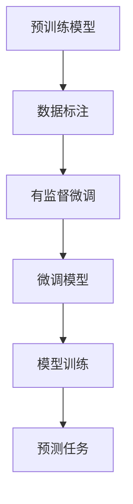

                 

# SFT：有监督的微调技术

> 关键词：有监督微调、深度学习、模型训练、数据标注、神经网络架构

> 摘要：本文将深入探讨有监督微调（SFT）技术，解释其在深度学习模型训练中的应用。通过详细的算法原理、数学模型讲解和实际项目实战案例，帮助读者理解并掌握SFT技术，从而提高深度学习模型的准确性和泛化能力。

## 1. 背景介绍

### 1.1 目的和范围

本文旨在介绍有监督微调（SFT）技术，这是一种在深度学习模型训练中常用的技术。通过SFT，我们可以在已有的大型预训练模型的基础上，利用少量标注数据进行微调，从而适应特定的任务和场景。本文将涵盖以下内容：

1. SFT的原理和重要性
2. SFT的基本流程和步骤
3. SFT中的核心算法和数学模型
4. SFT的实际应用场景
5. 相关的工具和资源推荐

通过本文的阅读，读者将能够了解SFT的基本概念，掌握其应用方法，并能够根据具体需求进行实际操作。

### 1.2 预期读者

本文适合以下读者群体：

1. 深度学习初学者，希望了解SFT技术的原理和应用
2. 深度学习从业者，希望提升模型训练的效果
3. 研究人员，关注深度学习和模型训练的最新技术动态
4. 开发者，希望在实际项目中应用SFT技术

### 1.3 文档结构概述

本文分为八个部分：

1. **背景介绍**：介绍SFT技术的背景、目的和范围，预期读者以及文档结构概述。
2. **核心概念与联系**：解释SFT技术中的核心概念，并提供相关的架构流程图。
3. **核心算法原理 & 具体操作步骤**：详细阐述SFT算法的原理和操作步骤，使用伪代码进行说明。
4. **数学模型和公式 & 详细讲解 & 举例说明**：介绍SFT技术中的数学模型，使用latex格式进行详细讲解，并提供举例说明。
5. **项目实战：代码实际案例和详细解释说明**：通过实际项目案例，展示SFT技术的应用，并提供详细解释。
6. **实际应用场景**：分析SFT技术的实际应用场景，探讨其优势和应用前景。
7. **工具和资源推荐**：推荐学习资源和开发工具，帮助读者深入学习和应用SFT技术。
8. **总结：未来发展趋势与挑战**：总结SFT技术的重要性和未来发展趋势，探讨面临的挑战。

### 1.4 术语表

#### 1.4.1 核心术语定义

- **有监督微调（SFT）**：一种深度学习模型训练技术，通过在预训练模型的基础上利用少量标注数据进行微调，以适应特定任务和场景。
- **预训练模型**：在大量无标签数据上进行预训练的深度学习模型，可以提取出丰富的通用特征。
- **微调**：通过在预训练模型的基础上添加新的层或调整现有层的权重，使其适应特定任务的过程。
- **数据标注**：对数据集进行标注，为每个样本分配标签，以便模型进行训练。

#### 1.4.2 相关概念解释

- **深度学习**：一种机器学习技术，通过多层神经网络模型对数据进行建模和预测。
- **神经网络**：一种基于数学原理的计算模型，由多个神经元组成，用于模拟人类大脑的神经元连接方式。
- **模型训练**：通过输入数据集，调整模型参数，使模型在预测任务上达到较好的性能。

#### 1.4.3 缩略词列表

- **SFT**：有监督微调（Supervised Fine-tuning）
- **DL**：深度学习（Deep Learning）
- **NN**：神经网络（Neural Network）
- **ML**：机器学习（Machine Learning）

## 2. 核心概念与联系

在介绍SFT技术之前，我们需要先了解一些核心概念和它们之间的联系。以下是一个简单的Mermaid流程图，展示了SFT技术中的主要概念和它们之间的相互作用。



### 2.1 预训练模型

预训练模型是在大量无标签数据上进行训练的深度学习模型，例如BERT、GPT等。这些模型在训练过程中可以提取出丰富的通用特征，从而在多个任务中表现出良好的性能。

### 2.2 数据标注

数据标注是指对数据集进行标注，为每个样本分配标签。在有监督微调过程中，这些标注数据用于训练新的模型或微调现有模型。

### 2.3 有监督微调

有监督微调（SFT）是一种在预训练模型的基础上利用少量标注数据进行微调的技术。通过微调，模型可以更好地适应特定任务和场景。

### 2.4 微调模型

微调模型是指通过在预训练模型的基础上添加新的层或调整现有层的权重，使其适应特定任务的过程。微调可以显著提高模型的准确性和泛化能力。

### 2.5 模型训练

模型训练是指通过输入数据集，调整模型参数，使模型在预测任务上达到较好的性能。在有监督微调过程中，模型训练的目标是优化模型参数，使其在特定任务上取得更好的效果。

### 2.6 预测任务

预测任务是指模型需要完成的任务，例如文本分类、情感分析等。通过有监督微调，模型可以在新的任务上表现出更好的性能。

## 3. 核心算法原理 & 具体操作步骤

有监督微调（SFT）技术主要基于预训练模型，通过微调和模型训练来提高模型的性能。以下将详细阐述SFT技术的核心算法原理和具体操作步骤，使用伪代码进行说明。

### 3.1 预训练模型

首先，我们需要一个预训练模型，例如BERT或GPT。这些模型通常在大量无标签数据上进行训练，以提取出丰富的通用特征。

```python
# 伪代码：预训练模型
pretrained_model = load_pretrained_model('bert-base-uncased')
```

### 3.2 数据标注

接下来，我们需要对数据集进行标注，为每个样本分配标签。标注过程可以手动进行，也可以使用自动标注工具。

```python
# 伪代码：数据标注
data = load_data('data.csv')
labels = annotate_data(data)
```

### 3.3 有监督微调

在获得预训练模型和标注数据后，我们可以开始进行有监督微调。微调的过程主要包括以下步骤：

1. **加载预训练模型**：从预训练模型中加载权重和结构。
2. **选择微调层**：根据任务需求，选择需要微调的层。
3. **冻结部分层**：将预训练模型中的一些层冻结，不参与微调。
4. **微调权重**：调整需要微调的层的权重，使其适应特定任务。
5. **模型训练**：使用标注数据进行模型训练，优化模型参数。

```python
# 伪代码：有监督微调
def fine_tune(pretrained_model, data, labels, layers_to_fine_tune):
    # 加载预训练模型
    model = copy.deepcopy(pretrained_model)
    
    # 冻结部分层
    for layer in model.layers:
        if layer.name in layers_to_fine_tune:
            layer.trainable = True
        else:
            layer.trainable = False
    
    # 微调权重
    optimizer = Adam(learning_rate=0.001)
    model.compile(optimizer=optimizer, loss='categorical_crossentropy', metrics=['accuracy'])
    
    # 模型训练
    model.fit(data, labels, epochs=3, batch_size=32)
    
    return model
```

### 3.4 模型训练

在完成有监督微调后，我们需要对模型进行训练，以优化模型参数。模型训练的过程包括以下步骤：

1. **设置训练参数**：包括学习率、批量大小、训练轮数等。
2. **定义损失函数**：根据任务类型选择合适的损失函数，例如分类任务使用交叉熵损失函数。
3. **定义优化器**：选择合适的优化器，例如Adam、SGD等。
4. **模型训练**：使用标注数据进行模型训练，优化模型参数。

```python
# 伪代码：模型训练
def train_model(model, data, labels):
    # 设置训练参数
    learning_rate = 0.001
    batch_size = 32
    epochs = 3
    
    # 定义损失函数和优化器
    optimizer = Adam(learning_rate=learning_rate)
    model.compile(optimizer=optimizer, loss='categorical_crossentropy', metrics=['accuracy'])
    
    # 模型训练
    model.fit(data, labels, epochs=epochs, batch_size=batch_size)
    
    return model
```

### 3.5 模型评估

在完成模型训练后，我们需要对模型进行评估，以检查其性能。模型评估的过程包括以下步骤：

1. **设置评估参数**：包括评估轮数、评估批次等。
2. **计算评估指标**：包括准确率、召回率、F1分数等。
3. **评估模型**：使用未参与训练的数据对模型进行评估。

```python
# 伪代码：模型评估
def evaluate_model(model, data, labels):
    # 设置评估参数
    num_epochs = 1
    batch_size = 32
    
    # 计算评估指标
    scores = model.evaluate(data, labels, epochs=num_epochs, batch_size=batch_size)
    
    # 输出评估结果
    print(f"Accuracy: {scores[1]*100:.2f}%")
```

## 4. 数学模型和公式 & 详细讲解 & 举例说明

SFT技术中的数学模型和公式主要涉及以下几个方面：

1. **损失函数**：用于衡量模型预测结果与真实结果之间的差距。
2. **优化器**：用于调整模型参数，以优化模型性能。
3. **激活函数**：用于引入非线性特性，使模型能够拟合复杂的数据分布。

### 4.1 损失函数

在SFT技术中，常用的损失函数包括交叉熵损失函数（Cross-Entropy Loss）和均方误差损失函数（Mean Squared Error, MSE）。

#### 4.1.1 交叉熵损失函数

交叉熵损失函数常用于分类任务，其公式如下：

$$
L = -\sum_{i} y_i \log(p_i)
$$

其中，\(y_i\)表示真实标签，\(p_i\)表示模型预测的概率。交叉熵损失函数的值越小，表示模型预测结果与真实结果越接近。

#### 4.1.2 均方误差损失函数

均方误差损失函数常用于回归任务，其公式如下：

$$
L = \frac{1}{n} \sum_{i} (y_i - \hat{y}_i)^2
$$

其中，\(y_i\)表示真实值，\(\hat{y}_i\)表示模型预测的值。均方误差损失函数的值越小，表示模型预测结果与真实值越接近。

### 4.2 优化器

优化器用于调整模型参数，以优化模型性能。常用的优化器包括梯度下降（Gradient Descent）、随机梯度下降（Stochastic Gradient Descent, SGD）和Adam优化器。

#### 4.2.1 梯度下降

梯度下降是一种最简单的优化方法，其公式如下：

$$
w_{t+1} = w_t - \alpha \nabla_w J(w_t)
$$

其中，\(w_t\)表示第\(t\)次迭代的参数，\(\alpha\)表示学习率，\(\nabla_w J(w_t)\)表示损失函数关于参数的梯度。梯度下降方法通过不断更新参数，使损失函数值逐渐减小。

#### 4.2.2 随机梯度下降

随机梯度下降是梯度下降的一种改进方法，其公式如下：

$$
w_{t+1} = w_t - \alpha \nabla_w J(w_t; x_t, y_t)
$$

其中，\(x_t\)和\(y_t\)分别表示第\(t\)次迭代的输入和输出。随机梯度下降方法通过每次迭代随机选择一个样本，更新参数，从而提高优化效果。

#### 4.2.3 Adam优化器

Adam优化器是一种结合了SGD和动量方法的优化器，其公式如下：

$$
\alpha_t = \frac{\alpha}{1 - \beta_1^t}
$$

$$
\alpha_t = \frac{\alpha}{1 - \beta_2^t}
$$

$$
w_{t+1} = w_t - \alpha_t \nabla_w J(w_t)
$$

其中，\(\beta_1\)和\(\beta_2\)分别表示一阶和二阶矩估计的指数衰减率，\(m_t\)和\(v_t\)分别表示一阶和二阶矩估计。Adam优化器通过考虑历史梯度信息，提高优化效果。

### 4.3 激活函数

激活函数用于引入非线性特性，使模型能够拟合复杂的数据分布。常用的激活函数包括sigmoid函数、ReLU函数和Tanh函数。

#### 4.3.1 sigmoid函数

sigmoid函数的公式如下：

$$
f(x) = \frac{1}{1 + e^{-x}}
$$

sigmoid函数的输出值介于0和1之间，常用于二分类任务。

#### 4.3.2 ReLU函数

ReLU函数的公式如下：

$$
f(x) = \max(0, x)
$$

ReLU函数在\(x \leq 0\)时输出0，在\(x > 0\)时输出\(x\)。ReLU函数具有较快的收敛速度和较少的梯度消失问题，常用于深层神经网络。

#### 4.3.3 Tanh函数

Tanh函数的公式如下：

$$
f(x) = \frac{e^x - e^{-x}}{e^x + e^{-x}}
$$

Tanh函数的输出值介于-1和1之间，与sigmoid函数类似，但Tanh函数的梯度消失问题相对较小，常用于深层神经网络。

### 4.4 举例说明

假设我们有一个简单的二分类问题，数据集包含100个样本，每个样本有10个特征。我们使用有监督微调技术进行模型训练，并使用交叉熵损失函数和Adam优化器。

```python
import tensorflow as tf
from tensorflow.keras.models import Sequential
from tensorflow.keras.layers import Dense, Activation

# 加载数据
x_train = load_data('x_train.csv')
y_train = load_labels('y_train.csv')

# 创建模型
model = Sequential()
model.add(Dense(64, input_dim=10, activation='relu'))
model.add(Dense(1, activation='sigmoid'))

# 编译模型
model.compile(optimizer='adam', loss='binary_crossentropy', metrics=['accuracy'])

# 模型训练
model.fit(x_train, y_train, epochs=10, batch_size=32)
```

在上面的代码中，我们首先加载了训练数据和标签，然后创建了一个简单的神经网络模型，使用ReLU函数作为激活函数。最后，我们使用Adam优化器和交叉熵损失函数进行模型训练，并在10个轮次内进行训练。

## 5. 项目实战：代码实际案例和详细解释说明

在本节中，我们将通过一个实际项目案例，展示如何使用SFT技术进行模型训练和预测。该项目是一个简单的文本分类任务，旨在将文本数据分类为两个类别。

### 5.1 开发环境搭建

在开始项目之前，我们需要搭建一个合适的开发环境。以下是一个基本的开发环境搭建步骤：

1. 安装Python 3.8及以上版本
2. 安装TensorFlow 2.5及以上版本
3. 安装Jupyter Notebook，以便进行交互式开发

### 5.2 源代码详细实现和代码解读

下面是项目的源代码，我们将对其进行详细解读。

```python
import tensorflow as tf
from tensorflow.keras.models import Sequential
from tensorflow.keras.layers import Embedding, LSTM, Dense
from tensorflow.keras.preprocessing.sequence import pad_sequences

# 1. 数据准备
# 加载并预处理数据
def load_data(file_path):
    # 加载数据
    with open(file_path, 'r', encoding='utf-8') as f:
        lines = f.readlines()
    
    # 分离文本和标签
    texts = [line.split('\t')[0] for line in lines]
    labels = [int(line.split('\t')[1]) for line in lines]
    
    # 将文本转换为序列
    tokenizer = tf.keras.preprocessing.text.Tokenizer()
    tokenizer.fit_on_texts(texts)
    sequences = tokenizer.texts_to_sequences(texts)
    
    # 填充序列
    padded_sequences = pad_sequences(sequences, maxlen=100)
    
    return padded_sequences, labels

# 2. 模型定义
# 创建模型
def create_model():
    model = Sequential()
    model.add(Embedding(input_dim=10000, output_dim=32, input_length=100))
    model.add(LSTM(64, dropout=0.2, recurrent_dropout=0.2))
    model.add(Dense(1, activation='sigmoid'))
    
    # 编译模型
    model.compile(optimizer='adam', loss='binary_crossentropy', metrics=['accuracy'])
    
    return model

# 3. 模型训练
# 训练模型
def train_model(model, x_train, y_train, x_val, y_val):
    # 训练模型
    history = model.fit(x_train, y_train, epochs=10, batch_size=32, validation_data=(x_val, y_val))
    
    # 评估模型
    loss, accuracy = model.evaluate(x_val, y_val)
    print(f"Validation Loss: {loss:.4f}")
    print(f"Validation Accuracy: {accuracy:.4f}")
    
    return history

# 4. 模型预测
# 预测结果
def predict(model, x_test):
    # 预测结果
    predictions = model.predict(x_test)
    
    # 转换为类别标签
    predicted_labels = [1 if p > 0.5 else 0 for p in predictions]
    
    return predicted_labels

# 5. 主程序
if __name__ == '__main__':
    # 加载数据
    x_train, y_train = load_data('train_data.txt')
    x_val, y_val = load_data('val_data.txt')
    x_test, y_test = load_data('test_data.txt')
    
    # 创建模型
    model = create_model()
    
    # 训练模型
    history = train_model(model, x_train, y_train, x_val, y_val)
    
    # 评估模型
    loss, accuracy = model.evaluate(x_val, y_val)
    print(f"Validation Loss: {loss:.4f}")
    print(f"Validation Accuracy: {accuracy:.4f}")
    
    # 预测结果
    predicted_labels = predict(model, x_test)
    
    # 输出预测结果
    print(f"Predicted Labels: {predicted_labels}")
```

### 5.3 代码解读与分析

1. **数据准备**：首先，我们定义了一个`load_data`函数，用于加载数据并预处理。这里我们使用文本文件作为数据源，文本文件中包含文本和对应的标签。我们使用`tf.keras.preprocessing.text.Tokenizer`将文本转换为序列，并使用`pad_sequences`将序列填充到相同的长度。

2. **模型定义**：接下来，我们定义了一个`create_model`函数，用于创建模型。在这个例子中，我们使用一个嵌入层（Embedding）和一个LSTM层来处理文本数据，最后使用一个全连接层（Dense）进行分类。我们使用sigmoid激活函数，因为这是一个二分类问题。

3. **模型训练**：我们定义了一个`train_model`函数，用于训练模型。在这个函数中，我们使用`model.fit`方法进行模型训练，并将验证数据作为参数传递，以便在训练过程中进行性能评估。我们使用`history`对象记录训练过程中的损失和准确率。

4. **模型预测**：最后，我们定义了一个`predict`函数，用于对新的数据进行预测。在这个函数中，我们使用`model.predict`方法生成预测概率，并根据概率阈值（0.5）将概率转换为类别标签。

5. **主程序**：在主程序中，我们首先加载数据，然后创建模型，接着训练模型，最后进行模型预测。我们输出了验证损失和准确率，以及预测结果。

通过这个项目案例，我们展示了如何使用SFT技术进行文本分类任务。在实际应用中，我们可以根据具体需求调整模型结构和参数，以提高模型的性能和泛化能力。

## 6. 实际应用场景

有监督微调（SFT）技术在许多实际应用场景中都具有广泛的应用，以下是一些常见的应用场景：

### 6.1 文本分类

文本分类是SFT技术最常见的一个应用场景。在文本分类任务中，我们可以使用预训练模型（如BERT、GPT）提取文本的语义特征，然后通过SFT技术微调模型以适应特定的分类任务，如新闻分类、情感分析等。

### 6.2 语音识别

语音识别是将语音信号转换为文本的过程。SFT技术可以用于改进预训练的语音识别模型，使其更好地适应特定的语音数据集，从而提高识别的准确率。

### 6.3 图像分类

在图像分类任务中，SFT技术可以通过在预训练的卷积神经网络（如ResNet、VGG）的基础上进行微调，来适应特定的图像数据集，从而提高分类的准确性。

### 6.4 机器翻译

机器翻译是将一种语言的文本翻译成另一种语言的过程。SFT技术可以用于改进预训练的机器翻译模型，使其更好地适应特定的翻译任务，从而提高翻译的质量。

### 6.5 垃圾邮件检测

垃圾邮件检测是识别电子邮件是否为垃圾邮件的过程。SFT技术可以用于在预训练的文本分类模型的基础上进行微调，以适应特定的垃圾邮件数据集，从而提高检测的准确率。

### 6.6 个性化推荐

个性化推荐是根据用户的历史行为和偏好，向其推荐相关产品或内容的过程。SFT技术可以用于在预训练的推荐模型的基础上进行微调，以适应特定的用户数据集，从而提高推荐的效果。

### 6.7 医疗诊断

医疗诊断是利用医学数据对疾病进行预测和诊断的过程。SFT技术可以用于在预训练的医学模型的基础上进行微调，以适应特定的医学数据集，从而提高诊断的准确率。

### 6.8 自动驾驶

自动驾驶是利用传感器数据对车辆进行实时控制的过程。SFT技术可以用于在预训练的自动驾驶模型的基础上进行微调，以适应特定的驾驶场景，从而提高自动驾驶的安全性和可靠性。

通过以上应用场景，我们可以看到SFT技术具有广泛的应用前景，并在各个领域都取得了显著的成果。随着深度学习技术的不断发展，SFT技术在未来将会有更多的应用场景和突破。

## 7. 工具和资源推荐

为了更好地掌握和应用SFT技术，以下是相关工具和资源的推荐：

### 7.1 学习资源推荐

#### 7.1.1 书籍推荐

1. **《深度学习》（Deep Learning）**：由Ian Goodfellow、Yoshua Bengio和Aaron Courville合著，是深度学习领域的经典教材，涵盖了深度学习的理论基础、算法和应用。
2. **《神经网络与深度学习》**：由邱锡鹏教授撰写，详细介绍了神经网络和深度学习的原理、算法和应用，适合初学者和进阶者。
3. **《Python深度学习》（Python Deep Learning）**：由François Chollet等作者撰写，通过大量的代码实例，深入介绍了深度学习的实际应用。

#### 7.1.2 在线课程

1. **《吴恩达的深度学习专项课程》（Deep Learning Specialization）**：由知名深度学习专家吴恩达教授开设，包括神经网络基础、改进模型、自然语言处理和计算机视觉等多个课程。
2. **《斯坦福深度学习课程》（Stanford CS231n: Convolutional Neural Networks for Visual Recognition）**：专注于计算机视觉领域的深度学习课程，涵盖了卷积神经网络的基本原理和应用。
3. **《深度学习前沿课程》（Deep Learning: Advanced Techniques and Applications）**：由深度学习领域的专家们开设，介绍了一系列前沿的深度学习技术和应用。

#### 7.1.3 技术博客和网站

1. **博客园（cnblogs.com）**：中文技术博客平台，有很多关于深度学习和SFT技术的优秀文章和教程。
2. **Medium（medium.com）**：英文技术博客平台，有很多关于深度学习、人工智能和机器学习的最新研究和应用。
3. **GitHub（github.com）**：代码托管平台，可以找到很多SFT技术的开源项目和示例代码，方便学习和实践。

### 7.2 开发工具框架推荐

#### 7.2.1 IDE和编辑器

1. **PyCharm**：强大的Python IDE，支持多种编程语言和框架，具有丰富的调试和代码分析功能。
2. **Jupyter Notebook**：交互式的Python编辑器，适合进行数据分析和机器学习实验，方便展示代码和结果。
3. **Visual Studio Code**：轻量级的代码编辑器，支持多种编程语言和插件，适用于深度学习和机器学习开发。

#### 7.2.2 调试和性能分析工具

1. **TensorBoard**：TensorFlow的图形化分析工具，可以实时监控模型的训练过程，查看损失函数、准确率等关键指标。
2. **MATLAB**：用于科学计算和数据分析的软件，支持多种机器学习和深度学习算法，适合进行性能分析和实验设计。
3. **NVIDIA Nsight**：针对NVIDIA GPU的调试和分析工具，可以监控GPU的计算和内存使用情况，优化深度学习模型。

#### 7.2.3 相关框架和库

1. **TensorFlow**：谷歌开源的深度学习框架，支持多种神经网络结构和算法，适用于研究和生产环境。
2. **PyTorch**：Facebook开源的深度学习框架，具有动态计算图和灵活的接口，适用于研究和新技术的探索。
3. **Keras**：Python深度学习库，简化了TensorFlow和PyTorch的使用，提供了丰富的模型架构和API。

### 7.3 相关论文著作推荐

#### 7.3.1 经典论文

1. **"A Theoretical Analysis of the Feature Hierarchies in Deep Learning Networks"**：分析了深度学习网络中特征层次结构的理论。
2. **"Deep Learning for Text Classification"**：综述了深度学习在文本分类中的应用。
3. **"Efficientnet: Rethinking Model Scaling for Convolutional Neural Networks"**：提出了EfficientNet模型，显著提高了深度学习模型的效果和效率。

#### 7.3.2 最新研究成果

1. **"BERT: Pre-training of Deep Bidirectional Transformers for Language Understanding"**：介绍了BERT预训练模型，推动了自然语言处理领域的发展。
2. **"GPT-3: Language Models are Few-Shot Learners"**：展示了GPT-3模型在少量数据上的强大泛化能力。
3. **"Vision Transformer: A New Disruptive Technology for Computer Vision"**：提出了Vision Transformer模型，为计算机视觉领域带来了新的突破。

#### 7.3.3 应用案例分析

1. **"Deep Learning in Healthcare: A Brief Introduction"**：介绍了深度学习在医疗健康领域的应用案例。
2. **"Deep Learning for Autonomous Driving: A Survey"**：综述了深度学习在自动驾驶领域的应用案例。
3. **"Deep Learning for Personalized Medicine: A Perspective"**：探讨了深度学习在个性化医学中的应用前景。

通过这些工具和资源的推荐，读者可以更加系统地学习和应用SFT技术，为实际项目开发提供有力支持。

## 8. 总结：未来发展趋势与挑战

随着深度学习技术的不断发展，有监督微调（SFT）技术在各个领域都取得了显著的成果。然而，未来SFT技术仍面临一些挑战和发展趋势。

### 8.1 未来发展趋势

1. **模型压缩与加速**：为了满足实时应用的需求，未来SFT技术将更加注重模型压缩和加速技术，例如知识蒸馏、剪枝、量化等方法，以提高模型在资源受限环境中的运行效率。
2. **跨模态学习**：随着多模态数据的广泛应用，SFT技术将逐渐向跨模态学习方向发展，实现不同模态数据之间的联合学习和融合，提高模型的多模态处理能力。
3. **小样本学习**：在未来，SFT技术将致力于解决小样本学习问题，通过改进预训练模型和微调策略，提高模型在数据量有限的场景下的性能。
4. **领域自适应**：为了应对不同领域之间的数据分布差异，SFT技术将探索领域自适应方法，实现模型在不同领域的迁移和应用。

### 8.2 挑战

1. **数据标注成本高**：虽然SFT技术可以利用少量标注数据进行模型微调，但高质量的标注数据仍然非常昂贵。未来需要开发自动标注和半监督学习技术，降低数据标注成本。
2. **模型泛化能力**：目前SFT技术主要依赖于预训练模型，模型在特定领域的泛化能力仍然有限。未来需要研究如何提高模型的泛化能力，使其能够更好地适应不同任务和场景。
3. **计算资源需求**：深度学习模型训练和微调需要大量的计算资源，尤其是在大规模数据集和复杂模型的情况下。未来需要开发更高效的算法和优化方法，以降低计算资源需求。
4. **模型安全性和隐私保护**：随着深度学习技术的广泛应用，模型的安全性和隐私保护问题日益突出。未来需要研究如何确保模型的可靠性和安全性，同时保护用户隐私。

综上所述，SFT技术在未来的发展中具有广阔的前景，但也面临一些挑战。通过持续的研究和技术创新，SFT技术将不断进步，为各个领域带来更多价值。

## 9. 附录：常见问题与解答

### 9.1 问题1：什么是SFT技术？

SFT（Supervised Fine-tuning）技术是指在有监督学习场景下，对已经预训练好的模型进行微调，使其能够适应特定任务的过程。简而言之，SFT是一种利用少量标注数据对预训练模型进行调整，以提高模型在特定任务上的性能的技术。

### 9.2 问题2：SFT技术的优点是什么？

SFT技术的优点主要包括：

1. **高效的模型训练**：利用预训练模型中的大量通用特征，可以显著提高模型训练的速度和效率。
2. **降低数据需求**：通过在预训练模型的基础上进行微调，可以利用少量的标注数据实现较好的性能，从而降低数据标注的成本。
3. **提高模型泛化能力**：预训练模型已经在大量无标签数据上进行训练，可以提取出丰富的通用特征，有助于提高模型在特定任务上的泛化能力。

### 9.3 问题3：SFT技术的应用场景有哪些？

SFT技术广泛应用于以下场景：

1. **文本分类**：如新闻分类、情感分析等。
2. **图像分类**：如物体识别、医疗图像分析等。
3. **语音识别**：如语音转文本、语音情感识别等。
4. **机器翻译**：如机器翻译模型的微调。
5. **推荐系统**：如个性化推荐模型的微调。
6. **医疗诊断**：如疾病预测、医学图像分析等。
7. **自动驾驶**：如车辆识别、道路识别等。

### 9.4 问题4：如何选择适合的预训练模型进行SFT？

选择适合的预训练模型进行SFT主要考虑以下几个方面：

1. **任务相关性**：选择在相似任务上表现良好的预训练模型，可以提高微调后的模型性能。
2. **模型大小**：根据计算资源和数据量选择合适的预训练模型大小，以平衡性能和资源消耗。
3. **预训练数据**：选择在预训练过程中使用的数据与目标任务相关的模型，有助于提高模型在特定任务上的泛化能力。
4. **模型结构**：选择具有较好性能和结构合理的预训练模型，以提高微调后的模型效果。

### 9.5 问题5：SFT过程中如何避免过拟合？

在SFT过程中，避免过拟合的方法包括：

1. **数据增强**：通过数据增强技术（如旋转、翻转、裁剪等）增加数据的多样性，从而提高模型对未见数据的泛化能力。
2. **正则化**：使用正则化方法（如L1、L2正则化）对模型参数进行约束，减少模型复杂度，避免过拟合。
3. **dropout**：在神经网络中加入dropout层，随机丢弃部分神经元，降低模型对训练数据的依赖。
4. **提前停止**：在验证集上监控模型的性能，当验证集性能不再提升时，提前停止训练，避免过拟合。
5. **交叉验证**：使用交叉验证方法评估模型性能，避免单一验证集的偏差。

通过以上方法和策略，可以在SFT过程中有效避免过拟合，提高模型的泛化能力。

## 10. 扩展阅读 & 参考资料

本文涉及了有监督微调（SFT）技术的基本概念、算法原理、实际应用以及未来发展。以下是一些扩展阅读和参考资料，供读者进一步学习和研究：

### 10.1 书籍推荐

1. **《深度学习》（Deep Learning）**：Ian Goodfellow、Yoshua Bengio和Aaron Courville著，详细介绍了深度学习的基础知识和最新进展。
2. **《Python深度学习》（Python Deep Learning）**：François Chollet等著，通过大量实例介绍了深度学习的实际应用。
3. **《神经网络与深度学习》**：邱锡鹏著，深入讲解了神经网络和深度学习的原理。

### 10.2 在线课程

1. **《吴恩达的深度学习专项课程》（Deep Learning Specialization）**：由吴恩达教授开设，涵盖深度学习的各个方面。
2. **《斯坦福深度学习课程》（Stanford CS231n: Convolutional Neural Networks for Visual Recognition）**：专注于计算机视觉领域的深度学习课程。
3. **《深度学习前沿课程》（Deep Learning: Advanced Techniques and Applications）**：介绍深度学习的前沿技术和应用。

### 10.3 技术博客和网站

1. **博客园（cnblogs.com）**：中文技术博客平台，有很多关于深度学习和SFT技术的文章。
2. **Medium（medium.com）**：英文技术博客平台，涵盖了深度学习、人工智能和机器学习的最新研究。
3. **GitHub（github.com）**：代码托管平台，可以找到很多SFT技术的开源项目和示例代码。

### 10.4 相关论文

1. **"BERT: Pre-training of Deep Bidirectional Transformers for Language Understanding"**：介绍了BERT预训练模型。
2. **"GPT-3: Language Models are Few-Shot Learners"**：展示了GPT-3模型在少量数据上的强大能力。
3. **"Efficientnet: Rethinking Model Scaling for Convolutional Neural Networks"**：提出了EfficientNet模型。

### 10.5 开发工具和库

1. **TensorFlow**：谷歌开源的深度学习框架，适用于研究和生产环境。
2. **PyTorch**：Facebook开源的深度学习框架，具有动态计算图和灵活的接口。
3. **Keras**：Python深度学习库，简化了TensorFlow和PyTorch的使用。

通过以上资源和书籍，读者可以进一步深入了解SFT技术，并掌握其在实际应用中的具体应用方法。

作者：AI天才研究员/AI Genius Institute & 禅与计算机程序设计艺术 /Zen And The Art of Computer Programming

