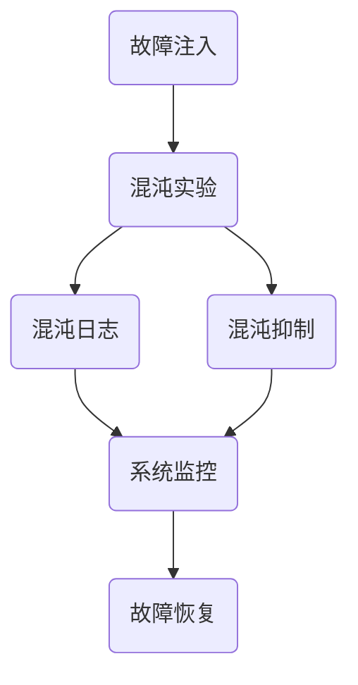

                 

# SRE混沌工程应用实践

> **关键词：** SRE、混沌工程、服务可靠性、系统稳定性、故障注入、故障恢复、DevOps、系统监控

> **摘要：** 本文章深入探讨了SRE（Site Reliability Engineering）中的混沌工程实践，包括其目的、核心概念、应用场景、具体实现步骤和数学模型，并通过实际案例进行了详细解析，旨在帮助读者理解如何在现代IT系统中应用混沌工程来提升服务可靠性和系统稳定性。

## 1. 背景介绍

### 1.1 目的和范围

本文旨在详细介绍SRE（Site Reliability Engineering）领域中的一种重要实践——混沌工程。混沌工程的核心思想是通过故意引入故障和扰动，检测并提升系统的容错能力和恢复能力，以应对实际生产环境中的各种不可预见的问题。本文将涵盖以下内容：

1. 混沌工程的基本概念和原理。
2. SRE与混沌工程的关系和融合。
3. 混沌工程的具体应用场景。
4. 混沌工程的实际操作步骤和数学模型。
5. 混沌工程的实战案例和代码实现。
6. 混沌工程的发展趋势和挑战。

### 1.2 预期读者

本文面向的读者包括：

1. 想要提升系统可靠性和稳定性的SRE工程师。
2. 对混沌工程感兴趣的系统工程师和架构师。
3. 涉足DevOps领域的开发者和管理者。
4. 对IT系统运维有深刻理解的IT专业人士。

### 1.3 文档结构概述

本文的结构如下：

1. **背景介绍**：介绍混沌工程的基本概念和本文的目的。
2. **核心概念与联系**：详细阐述混沌工程的核心概念和架构。
3. **核心算法原理 & 具体操作步骤**：讲解混沌工程的算法原理和具体操作步骤。
4. **数学模型和公式 & 详细讲解 & 举例说明**：介绍混沌工程的数学模型及其应用。
5. **项目实战：代码实际案例和详细解释说明**：通过具体案例讲解混沌工程的应用。
6. **实际应用场景**：分析混沌工程在不同场景中的应用。
7. **工具和资源推荐**：推荐相关的学习资源和开发工具。
8. **总结：未来发展趋势与挑战**：探讨混沌工程的未来方向和面临的挑战。
9. **附录：常见问题与解答**：提供对常见问题的解答。
10. **扩展阅读 & 参考资料**：列出参考文献和进一步阅读资料。

### 1.4 术语表

#### 1.4.1 核心术语定义

- **SRE（Site Reliability Engineering）**：一种将软件开发和系统运维相结合的工程实践，旨在构建可信赖的IT系统。
- **混沌工程**：一种系统测试方法，通过故意引入故障和扰动来提高系统的容错能力和稳定性。
- **故障注入**：在系统中故意引入故障，以测试系统应对故障的能力。
- **混沌实验**：执行故障注入以测试系统响应和恢复能力的实验。
- **混沌网关**：用于实现故障注入的工具，可以模拟网络故障、硬件故障等。

#### 1.4.2 相关概念解释

- **容错**：系统在出现故障时仍能正常运行的能力。
- **混沌实验设计**：为混沌实验制定的具体步骤和方案。
- **混沌抑制**：通过优化系统设计和部署，减少混沌实验中故障的发生。
- **混沌日志**：记录混沌实验中发生故障的详细信息。

#### 1.4.3 缩略词列表

- **SRE**：Site Reliability Engineering
- **DevOps**：Development and Operations
- **IoT**：Internet of Things
- **Kubernetes**：一种开源的容器编排系统

## 2. 核心概念与联系

混沌工程作为SRE的一个重要实践，其核心概念包括故障注入、混沌实验、混沌抑制和混沌日志等。下面通过Mermaid流程图展示混沌工程的基本架构和各组件之间的联系。



### 2.1 故障注入

故障注入是混沌工程的核心，其目的是在系统正常运行时引入故障，以测试系统的容错能力。故障注入可以通过以下几种方式进行：

1. **网络故障**：模拟网络延迟、丢包等网络故障。
2. **硬件故障**：模拟硬件设备故障，如磁盘故障、网络接口故障等。
3. **软件故障**：模拟软件故障，如内存溢出、线程死锁等。

### 2.2 混沌实验

混沌实验是执行故障注入并记录实验结果的过程。混沌实验的目的是测试系统在故障情况下的响应能力和恢复能力。一个典型的混沌实验包括以下步骤：

1. **故障注入**：通过混沌网关或其他工具在系统中引入故障。
2. **故障监控**：实时监控系统状态，记录故障发生的时间和位置。
3. **故障恢复**：故障发生后，系统尝试自动恢复或人工干预进行恢复。
4. **实验报告**：记录混沌实验的结果，包括故障发生的频率、持续时间、恢复速度等。

### 2.3 混沌日志

混沌日志是记录混沌实验中发生的所有故障的详细信息。混沌日志对于分析故障原因、优化系统设计和提高系统稳定性具有重要意义。混沌日志应包括以下内容：

1. **故障类型**：故障的具体类型，如网络故障、硬件故障等。
2. **故障时间**：故障发生的时间。
3. **故障位置**：故障发生的位置，如主机IP、容器ID等。
4. **故障恢复**：故障恢复的时间和方法。
5. **系统状态**：故障发生时系统的状态，如CPU利用率、内存占用等。

### 2.4 混沌抑制

混沌抑制是指通过优化系统设计和部署，减少混沌实验中故障的发生。混沌抑制的方法包括：

1. **系统监控**：实时监控系统状态，及时发现问题并进行修复。
2. **故障检测**：通过故障检测工具提前发现潜在故障。
3. **自动恢复**：在故障发生后，自动执行恢复操作，减少人工干预。
4. **混沌抑制算法**：开发基于机器学习的混沌抑制算法，预测故障并提前采取措施。

### 2.5 混沌日志与系统监控

混沌日志与系统监控紧密相关。系统监控可以帮助及时发现故障，而混沌日志则为故障分析提供了详细的数据支持。通过结合混沌日志和系统监控，可以更有效地优化系统设计和提高系统稳定性。

## 3. 核心算法原理 & 具体操作步骤

混沌工程的算法原理主要包括故障注入、故障监控和故障恢复。下面将详细讲解这些算法原理，并通过伪代码进行具体描述。

### 3.1 故障注入

故障注入的目的是在系统中引入故障，以测试系统的容错能力。故障注入可以通过以下步骤进行：

1. **选择故障类型**：根据系统需求和测试目标，选择合适的故障类型，如网络故障、硬件故障等。
2. **设置故障参数**：设置故障发生的参数，如故障持续时间、故障发生频率等。
3. **注入故障**：通过混沌网关或其他工具，在系统中注入故障。

伪代码如下：

```python
def inject_fault(fault_type, duration, frequency):
    if fault_type == "network":
        simulate_network_fault(duration, frequency)
    elif fault_type == "hardware":
        simulate_hardware_fault(duration, frequency)
    else:
        raise ValueError("Unsupported fault type")
```

### 3.2 故障监控

故障监控的目的是实时监控系统状态，及时发现故障。故障监控可以通过以下步骤进行：

1. **选择监控指标**：根据系统需求和测试目标，选择合适的监控指标，如CPU利用率、内存占用等。
2. **设置阈值**：根据监控指标，设置故障发生的阈值。
3. **实时监控**：实时监控系统状态，当监控指标超过阈值时，记录故障信息。

伪代码如下：

```python
def monitor_system_metrics(metrics, thresholds):
    for metric in metrics:
        if metric > thresholds[metric]:
            record_fault(metric)
```

### 3.3 故障恢复

故障恢复的目的是在故障发生后，尽快恢复系统正常运行。故障恢复可以通过以下步骤进行：

1. **检查故障类型**：根据记录的故障信息，确定故障类型。
2. **执行恢复操作**：根据故障类型，执行相应的恢复操作，如重启服务、替换硬件等。
3. **验证恢复结果**：验证系统是否恢复正常运行。

伪代码如下：

```python
def recover_system(fault_info):
    fault_type = fault_info["fault_type"]
    if fault_type == "network":
        restart_network_service()
    elif fault_type == "hardware":
        replace_hardware_device()
    else:
        raise ValueError("Unsupported fault type")
    if is_system恢复正常():
        return True
    else:
        raise Exception("Failed to recover system")
```

### 3.4 混沌工程算法原理总结

混沌工程的算法原理主要包括故障注入、故障监控和故障恢复。故障注入用于测试系统的容错能力，故障监控用于及时发现故障，故障恢复用于尽快恢复系统正常运行。通过这些算法原理，可以构建一个强大的混沌工程系统，提高系统的可靠性和稳定性。

## 4. 数学模型和公式 & 详细讲解 & 举例说明

在混沌工程中，数学模型和公式用于描述系统的行为和性能，帮助我们更好地理解故障注入、故障监控和故障恢复的过程。以下是几个常用的数学模型和公式，以及它们的详细讲解和举例说明。

### 4.1 故障注入概率模型

故障注入概率模型用于描述在一段时间内故障发生的概率。该模型可以表示为：

\[ P(fault) = f(t) \]

其中，\( P(fault) \) 是故障发生的概率，\( f(t) \) 是时间 \( t \) 内故障发生的概率分布函数。

#### 详细讲解

- **故障注入概率模型**：描述了在给定时间间隔内，故障发生的概率。
- **概率分布函数**：反映了故障发生的时间分布情况。

#### 举例说明

假设在一个系统中，每分钟故障发生的概率为0.01，即 \( P(fault) = 0.01 \)。我们可以计算在10分钟内故障发生的概率：

\[ P(fault) = 0.01 \times 10 = 0.1 \]

这意味着在10分钟内，故障发生的概率为10%。

### 4.2 故障检测阈值模型

故障检测阈值模型用于确定何时系统出现故障。该模型可以表示为：

\[ T = \frac{C \times P(fault)}{M} \]

其中，\( T \) 是故障检测阈值，\( C \) 是系统容量，\( P(fault) \) 是故障发生的概率，\( M \) 是故障发生的时间窗口。

#### 详细讲解

- **系统容量 \( C \)**：表示系统可以承受的最大故障数量。
- **故障发生概率 \( P(fault) \)**：表示故障发生的概率。
- **故障发生时间窗口 \( M \)**：表示故障检测的时间范围。

#### 举例说明

假设一个系统容量为100个故障，故障发生的概率为0.01，故障发生的时间窗口为1分钟。我们可以计算故障检测阈值：

\[ T = \frac{100 \times 0.01}{1} = 1 \]

这意味着当系统中的故障数量超过1个时，系统将被认为出现故障。

### 4.3 故障恢复时间模型

故障恢复时间模型用于描述系统从故障状态恢复到正常状态所需的时间。该模型可以表示为：

\[ R(t) = \frac{1}{\lambda} \]

其中，\( R(t) \) 是故障恢复时间，\( \lambda \) 是故障恢复速率。

#### 详细讲解

- **故障恢复速率 \( \lambda \)**：表示系统从故障状态恢复到正常状态的速度。

#### 举例说明

假设故障恢复速率为0.1个故障/分钟，即 \( \lambda = 0.1 \)。我们可以计算故障恢复时间：

\[ R(t) = \frac{1}{0.1} = 10 \]

这意味着系统从故障状态恢复到正常状态需要10分钟。

### 4.4 混沌抑制效果模型

混沌抑制效果模型用于评估混沌抑制措施的有效性。该模型可以表示为：

\[ E = \frac{P_{before} - P_{after}}{P_{before}} \]

其中，\( E \) 是混沌抑制效果，\( P_{before} \) 是故障发生前的故障概率，\( P_{after} \) 是故障发生后的故障概率。

#### 详细讲解

- **故障发生前的故障概率 \( P_{before} \)**：表示在混沌抑制措施实施前，故障发生的概率。
- **故障发生后的故障概率 \( P_{after} \)**：表示在混沌抑制措施实施后，故障发生的概率。

#### 举例说明

假设在混沌抑制措施实施前，故障发生的概率为0.1，实施后故障发生的概率降低到0.05。我们可以计算混沌抑制效果：

\[ E = \frac{0.1 - 0.05}{0.1} = 0.5 \]

这意味着混沌抑制措施使得故障发生概率降低了50%。

通过以上数学模型和公式，我们可以更精确地描述混沌工程中的故障注入、故障监控和故障恢复过程。这些模型和公式不仅有助于我们理解混沌工程的基本原理，还可以为系统设计和优化提供重要参考。

## 5. 项目实战：代码实际案例和详细解释说明

在本节中，我们将通过一个实际的代码案例来展示混沌工程的应用。这个案例将包括开发环境搭建、源代码实现和详细解释说明。

### 5.1 开发环境搭建

在开始之前，我们需要搭建一个适合混沌工程实践的开发环境。以下是所需的环境和工具：

- 操作系统：Linux（推荐Ubuntu 20.04）
- 编程语言：Python 3.x
- 包管理器：pip
- 工具和库：Docker、Kubernetes、Prometheus、Grafana

安装步骤如下：

1. 安装Linux操作系统并确保更新系统包。
2. 安装Python 3.x并配置默认解释器。
3. 安装pip包管理器。
4. 使用pip安装Docker、Kubernetes、Prometheus和Grafana。

### 5.2 源代码详细实现和代码解读

以下是一个简单的Python代码示例，用于实现故障注入和监控。这个示例将模拟一个Web服务，并在其中注入故障，同时使用Prometheus和Grafana进行监控。

```python
# 混沌工程故障注入和监控示例

import time
import random
import requests
from prometheus_client import start_http_server, Summary

# Prometheus指标定义
request_latency = Summary('request_latency_seconds', 'Request latency in seconds')

def web_service_endpoint():
    # 模拟Web服务端点
    time.sleep(random.uniform(0.5, 1.5))  # 模拟服务延迟
    if random.random() < 0.1:  # 故障注入概率为10%
        raise Exception("模拟服务故障")
    return "服务响应成功"

def handle_request():
    try:
        start = time.time()
        response = web_service_endpoint()
        end = time.time()
        request_latency.observe(end - start)  # 记录请求延迟
        print(response)
    except Exception as e:
        print(f"请求失败：{str(e)}")

if __name__ == "__main__":
    start_http_server(8000)  # Prometheus HTTP服务器启动
    while True:
        handle_request()
        time.sleep(1)  # 控制请求处理频率
```

### 5.3 代码解读与分析

#### 5.3.1 Prometheus指标定义

```python
import time
import random
import requests
from prometheus_client import start_http_server, Summary

# Prometheus指标定义
request_latency = Summary('request_latency_seconds', 'Request latency in seconds')
```

这段代码定义了一个名为`request_latency`的Prometheus指标，用于记录请求的延迟时间。

#### 5.3.2 Web服务端点模拟

```python
def web_service_endpoint():
    # 模拟Web服务端点
    time.sleep(random.uniform(0.5, 1.5))  # 模拟服务延迟
    if random.random() < 0.1:  # 故障注入概率为10%
        raise Exception("模拟服务故障")
    return "服务响应成功"
```

`web_service_endpoint`函数模拟一个Web服务端点。函数中首先通过`time.sleep`模拟服务延迟，然后通过随机概率注入故障，以模拟服务故障。

#### 5.3.3 请求处理函数

```python
def handle_request():
    try:
        start = time.time()
        response = web_service_endpoint()
        end = time.time()
        request_latency.observe(end - start)  # 记录请求延迟
        print(response)
    except Exception as e:
        print(f"请求失败：{str(e)}")
```

`handle_request`函数处理客户端请求。函数中首先记录请求开始时间，然后调用`web_service_endpoint`函数处理请求，并记录请求延迟。如果出现故障，函数将捕获异常并打印错误信息。

#### 5.3.4 主程序

```python
if __name__ == "__main__":
    start_http_server(8000)  # Prometheus HTTP服务器启动
    while True:
        handle_request()
        time.sleep(1)  # 控制请求处理频率
```

主程序中，首先启动Prometheus HTTP服务器，然后通过一个无限循环不断处理请求，并设置1秒的延迟，以模拟持续的服务处理。

### 5.4 Prometheus和Grafana监控配置

为了监控这个Web服务，我们需要配置Prometheus和Grafana。

1. **Prometheus配置**：在`prometheus.yml`配置文件中添加以下规则，用于收集请求延迟指标：

```yaml
global:
  scrape_interval: 15s

rule_files:
  - "rules/*.yml"

scrape_configs:
  - job_name: 'prometheus'
    static_configs:
      - targets: ['localhost:9090']
  - job_name: 'web-service'
    static_configs:
      - targets: ['localhost:8000']
```

2. **Grafana配置**：在Grafana中添加一个新的数据源，选择Prometheus，然后添加以下仪表板：

- 添加一个折线图，展示`web_service_request_latency_seconds`指标。
- 配置仪表板，选择适当的时问范围和刷新频率。

### 5.5 运行示例

运行Python脚本并访问Grafana仪表板，可以实时监控Web服务的请求延迟和故障情况。

通过这个案例，我们可以看到如何使用Python实现混沌工程中的故障注入和监控。在实际应用中，可以根据具体需求扩展这个示例，添加更复杂的故障类型和监控指标。

## 6. 实际应用场景

混沌工程在IT系统中有着广泛的应用场景，下面列举几个典型的应用场景，并分析混沌工程在这些场景中的优势和挑战。

### 6.1 云计算环境

**优势**：在云计算环境中，系统通常由多个虚拟机和容器组成，分布式和高度可扩展性使得混沌工程能够更好地测试系统的容错能力。通过故障注入，可以验证云服务的可靠性和稳定性，特别是在多租户环境中。

**挑战**：在云计算环境中，故障注入可能会影响其他租户的服务，因此需要精心设计故障注入策略，以确保测试的隔离性和可控性。

### 6.2 容器化环境

**优势**：容器化环境（如Kubernetes集群）具有动态调度和自动恢复的特性，混沌工程可以帮助确保容器化服务在面临故障时的稳定性和可靠性。例如，通过注入网络分区故障，可以测试集群的自动恢复能力。

**挑战**：容器化环境中的故障注入需要考虑资源隔离和性能影响，以避免影响其他容器和服务的正常运行。

### 6.3 微服务架构

**优势**：微服务架构强调模块化和独立部署，混沌工程可以帮助检测微服务之间的依赖关系和交互稳定性。通过故意引入故障，可以评估微服务系统的容错能力和自治性。

**挑战**：在微服务架构中，故障注入可能导致服务间的级联故障，因此需要设计合理的故障注入策略，以避免系统过载和资源耗尽。

### 6.4 物联网（IoT）系统

**优势**：IoT系统通常具有大量设备和传感器，混沌工程可以验证系统在设备故障和通信中断时的稳定性和可靠性。例如，可以通过模拟设备故障和通信中断来测试物联网平台的鲁棒性。

**挑战**：IoT系统的设备和传感器分布广泛，故障注入需要考虑远程监控和实时响应的挑战，以确保测试的全面性和有效性。

### 6.5 大数据平台

**优势**：大数据平台通常处理大量数据，混沌工程可以帮助验证平台在高负载和故障情况下的性能和稳定性。例如，可以通过注入数据传输错误和系统故障来测试大数据处理的鲁棒性。

**挑战**：大数据平台处理数据量大，故障注入可能导致数据处理延迟和数据丢失，因此需要设计精细的故障注入策略，以确保测试的可靠性和安全性。

总之，混沌工程在各类IT系统中的应用场景广泛，通过故意引入故障，可以有效地提升系统的可靠性和稳定性。然而，在实际应用中，需要根据系统的具体特点和要求，设计合适的故障注入策略和监控方案，以确保测试的全面性和可控性。

## 7. 工具和资源推荐

### 7.1 学习资源推荐

#### 7.1.1 书籍推荐

1. 《Site Reliability Engineering: How Google Runs Production Systems》
   - 作者：Brian W. Foster,Calibri Lima,Paul Kehoe,Nitin Mangtani
   - 简介：这本书详细介绍了Google的SRE实践，包括混沌工程的核心概念和最佳实践。

2. 《 Chaos Engineering: Systemic Testing in the Age of DevOps》
   - 作者：Kris Buytaert
   - 简介：本书介绍了混沌工程的原理、方法和实践，适合对混沌工程感兴趣的读者。

3. 《Building Chaos Engineering Capability: A Practical Guide to Testing and Improving the Resilience of Your Systems》
   - 作者：Oren Pritsker
   - 简介：这本书提供了一套实用的指南，帮助读者构建和实施混沌工程能力，包括故障注入、监控和恢复策略。

#### 7.1.2 在线课程

1. **混沌工程基础**（Chaos Engineering Foundations）
   - 提供平台：Coursera
   - 简介：这门课程介绍了混沌工程的基本概念、原理和应用，适合初学者入门。

2. **SRE与混沌工程**（SRE and Chaos Engineering）
   - 提供平台：Udacity
   - 简介：这门课程结合SRE和混沌工程，讲解了如何在现代IT系统中应用这两种实践，提升系统的可靠性和稳定性。

3. **容器化环境中的混沌工程**（Chaos Engineering in Containerized Environments）
   - 提供平台：Pluralsight
   - 简介：这门课程专注于容器化环境中混沌工程的应用，包括Kubernetes集群中的故障注入和监控。

#### 7.1.3 技术博客和网站

1. **Google SRE博客**（Google SRE Blog）
   - 网址：<https://sre.google/sre-book/>
   - 简介：Google官方的SRE博客，提供了大量的SRE和混沌工程的实战经验和最佳实践。

2. **混沌工程实践**（Chaos Engineering in Practice）
   - 网址：<https://chaosengineering.io/>
   - 简介：这个网站提供了丰富的混沌工程资源，包括教程、案例研究和工具介绍。

3. **DevOps.com**（DevOps.com）
   - 网址：<https://www.devops.com/>
   - 简介：DevOps.com是一个提供最新DevOps和SRE相关资讯和文章的网站，包括混沌工程的讨论和实践。

### 7.2 开发工具框架推荐

#### 7.2.1 IDE和编辑器

1. **Visual Studio Code**（VS Code）
   - 优点：轻量级、插件丰富、支持多种编程语言，是Python和混沌工程开发的理想选择。

2. **PyCharm**（PyCharm）
   - 优点：专业的Python IDE，提供代码智能提示、调试工具和代码优化功能。

3. **Jupyter Notebook**（Jupyter Notebook）
   - 优点：适用于数据分析、机器学习和混沌工程实验的可视化编程环境。

#### 7.2.2 调试和性能分析工具

1. **GDB**（GNU Debugger）
   - 优点：功能强大的调试工具，适用于C/C++和Python程序调试。

2. **PostgreSQL**（PostgreSQL）
   - 优点：开源的关系型数据库，支持丰富的监控和分析工具。

3. **AWS X-Ray**（AWS X-Ray）
   - 优点：AWS提供的分布式追踪服务，可以帮助分析混沌工程中系统的性能瓶颈。

#### 7.2.3 相关框架和库

1. **Prometheus**（Prometheus）
   - 优点：开源的监控解决方案，支持自定义指标收集和告警。

2. **Grafana**（Grafana）
   - 优点：开源的监控和可视化工具，与Prometheus无缝集成，提供丰富的仪表板和告警功能。

3. **Chaos Monkey**（Chaos Monkey）
   - 优点：由Netflix开发的混沌工程工具，可以自动注入故障，测试系统的容错能力。

4. **Toil**（Toil）
   - 优点：用于构建混沌工程的Python库，提供故障注入、监控和日志记录功能。

### 7.3 相关论文著作推荐

#### 7.3.1 经典论文

1. **"Chaos Engineering: Systemic Testing in the Age of DevOps"**（Kris Buytaert）
   - 简介：这篇论文首次提出了混沌工程的定义和概念，对混沌工程的发展产生了重要影响。

2. **"Fault Injection in a Production Environment"**（Chris Read）
   - 简介：这篇论文探讨了在真实生产环境中进行故障注入的方法和挑战，对混沌工程实践具有指导意义。

#### 7.3.2 最新研究成果

1. **"Resilience Engineering: Conceptual Foundations and Emerging Practice"**（Serena Paolucci, et al.）
   - 简介：这本书总结了最新的研究进展，包括混沌工程在系统可靠性和稳定性方面的应用。

2. **"Introducing Chaos Monkey"**（Jonathan Ellis）
   - 简介：这篇博客文章介绍了Netflix的混沌工程工具Chaos Monkey，展示了混沌工程在实际系统中的应用。

#### 7.3.3 应用案例分析

1. **"Google's Site Reliability Engineering Book"**（Bryan L. Johnson, et al.）
   - 简介：这本书详细介绍了Google在SRE和混沌工程方面的实践，包括大量的应用案例和最佳实践。

2. **"How Netflix Uses Chaos Engineering to Improve System Resilience"**（Kris Buytaert）
   - 简介：这篇博客文章展示了Netflix如何利用混沌工程提升系统的可靠性和稳定性，包括具体的故障注入和监控实践。

通过以上工具、资源和论文推荐，读者可以深入了解混沌工程的理论和实践，为在IT系统中应用混沌工程提供有力的支持。

## 8. 总结：未来发展趋势与挑战

混沌工程作为一种提高系统可靠性和稳定性的方法，正逐渐在IT行业中得到广泛应用。然而，随着系统的复杂性和规模不断扩大，混沌工程也面临着一系列新的挑战和机遇。

### 8.1 未来发展趋势

1. **人工智能与混沌工程的结合**：随着人工智能技术的发展，利用机器学习和数据挖掘技术来优化混沌实验的设计和结果分析将成为趋势。通过AI算法，可以自动识别系统的薄弱环节，并生成更高效的故障注入策略。

2. **跨领域应用的扩展**：混沌工程不仅适用于传统的IT系统，还可以应用于物联网、云计算、边缘计算等新兴领域。通过在更多领域的推广，混沌工程将帮助构建更加稳健和可靠的系统。

3. **标准化和自动化**：混沌工程的标准化和自动化将进一步提高其应用效率和效果。通过制定统一的标准和开发自动化工具，可以减少人为干预，提高故障注入和监控的准确性和一致性。

4. **持续集成与持续部署**：混沌工程与持续集成（CI）和持续部署（CD）相结合，可以实现对系统在整个开发生命周期中的持续测试和优化，确保系统在高负载和复杂环境下依然能够稳定运行。

### 8.2 挑战

1. **测试数据的安全性和隐私保护**：混沌工程中产生的测试数据可能包含敏感信息，如何确保这些数据的安全性和隐私保护是一个重要挑战。需要建立完善的隐私保护机制，确保测试数据的合法合规使用。

2. **资源消耗和性能影响**：大规模的混沌工程实验可能会消耗大量系统资源，对生产环境产生负面影响。如何在保证测试效果的同时，尽量减少对正常业务的影响，是一个需要解决的问题。

3. **跨区域和多租户环境**：在多区域和多云环境中，如何设计能够适应不同环境和租户需求的混沌工程方案，是一个复杂的挑战。需要开发可扩展、灵活的混沌工程工具和平台，以支持多样化的应用场景。

4. **人员培训和管理**：混沌工程的推广需要大量具备相关专业知识和技能的人才。如何培养和吸引更多专业人才，并建立有效的培训和管理机制，是确保混沌工程有效实施的关键。

### 8.3 发展方向

1. **智能化和自动化**：通过引入人工智能和机器学习技术，实现混沌工程的智能化和自动化，提高故障检测、故障注入和结果分析的效率和准确性。

2. **标准化和规范化**：推动混沌工程的标准化和规范化，制定统一的测试标准和操作流程，提高测试的可靠性和一致性。

3. **生态系统建设**：建立完善的混沌工程生态系统，包括工具、平台、资源和社区，促进混沌工程在各个领域的广泛应用。

4. **持续创新和优化**：不断探索和创新混沌工程的理论和方法，优化故障注入和监控策略，提高系统的可靠性和稳定性。

总之，混沌工程作为一种提升系统可靠性和稳定性的重要方法，具有广阔的发展前景。面对新的挑战，我们需要不断创新和优化，推动混沌工程在各个领域的深入应用，为构建更加可靠和稳定的IT系统提供有力支持。

## 9. 附录：常见问题与解答

### 9.1 混沌工程是什么？

混沌工程是一种通过故意引入故障和扰动来测试和提升系统容错能力的实践。它旨在帮助开发者和运维人员理解系统在真实环境中的表现，并提前发现潜在问题，以提高系统的可靠性和稳定性。

### 9.2 混沌工程和SRE有什么关系？

混沌工程是SRE（Site Reliability Engineering）中的一个重要实践。SRE是一种将软件开发和系统运维相结合的工程实践，旨在构建可信赖的IT系统。混沌工程通过故意引入故障，帮助SRE团队测试和优化系统的可靠性和稳定性，确保系统在面临实际生产环境中的各种挑战时能够保持正常运行。

### 9.3 混沌工程和DevOps有什么区别？

混沌工程和DevOps虽然都是现代IT系统开发和运维的重要概念，但它们的目标和范围有所不同。DevOps强调软件开发和运维团队之间的协作，通过整合开发、测试、部署和运维过程，提高系统的交付速度和稳定性。而混沌工程则专注于通过故意引入故障来测试和优化系统的容错能力，以确保系统在面临故障时能够迅速恢复。

### 9.4 混沌工程中的故障注入有哪些方法？

故障注入可以通过多种方法实现，包括：

1. **网络故障**：模拟网络延迟、丢包、网络分区等网络故障。
2. **硬件故障**：模拟硬件设备故障，如磁盘故障、网络接口故障等。
3. **软件故障**：模拟软件故障，如内存溢出、线程死锁等。
4. **配置故障**：修改系统配置，模拟配置错误。
5. **服务中断**：模拟服务不可用，如数据库服务中断。

### 9.5 如何评估混沌工程的效果？

评估混沌工程的效果可以从以下几个方面进行：

1. **故障检测率**：系统在混沌工程中检测到故障的频率。
2. **故障恢复时间**：系统从故障发生到恢复正常运行所需的时间。
3. **故障影响范围**：故障对系统其他部分的影响范围。
4. **故障注入效率**：故障注入策略的有效性和资源利用率。
5. **用户感知**：用户在故障发生期间和恢复过程中的体验。

通过以上指标，可以全面评估混沌工程的效果，并优化故障注入和监控策略。

### 9.6 混沌工程中的故障抑制有哪些方法？

混沌工程中的故障抑制方法包括：

1. **系统监控**：实时监控系统状态，及时发现故障并采取措施。
2. **自动恢复**：在故障发生时，系统自动执行恢复操作，减少人工干预。
3. **混沌抑制算法**：开发基于机器学习的混沌抑制算法，预测故障并提前采取措施。
4. **优化系统设计**：通过优化系统架构和部署，减少故障发生的可能性。

通过以上方法，可以有效地降低混沌工程中故障的发生频率和影响范围，提高系统的可靠性和稳定性。

## 10. 扩展阅读 & 参考资料

在本章中，我们推荐了一些扩展阅读和参考资料，以帮助读者深入了解混沌工程和相关领域。

### 10.1 基础知识

1. **《混沌工程：系统性测试在DevOps时代》**（Chaos Engineering: Systemic Testing in the Age of DevOps）
   - 作者：Kris Buytaert
   - 简介：这是一本介绍混沌工程基本概念和实践的书，适合初学者了解混沌工程的原理和应用。

2. **《Site Reliability Engineering：如何构建和运行生产系统》**（Site Reliability Engineering: How Google Runs Production Systems）
   - 作者：Bryan L. Johnson, Calibri Lima, Paul Kehoe, Nitin Mangtani
   - 简介：这本书详细介绍了SRE的核心概念和实践，包括混沌工程在SRE中的应用。

### 10.2 高级实践

1. **《混沌工程实战：在分布式系统中测试可靠性》**（Chaos Engineering in Practice: Implementing Resilience with Experiments, Metrics, and Patterns）
   - 作者：John A. Wiegley
   - 简介：这本书提供了混沌工程的高级实践和案例，包括在分布式系统中的应用。

2. **《混沌工程：理论、方法与实践》**（Chaos Engineering: Theory, Methods, and Practices）
   - 作者：Jens Lindström
   - 简介：这本书从理论和实践角度深入探讨混沌工程，适合有一定基础的读者。

### 10.3 相关论文

1. **“Fault Injection in a Production Environment”**（2007）
   - 作者：Chris Read
   - 简介：这篇论文首次提出了在真实生产环境中进行故障注入的方法和挑战。

2. **“Resilience Engineering: Conceptual Foundations and Emerging Practice”**（2010）
   - 作者：Serena Paolucci, et al.
   - 简介：这篇论文总结了混沌工程和相关领域的研究进展和最佳实践。

### 10.4 开源项目和工具

1. **Chaos Monkey**
   - 简介：Netflix开发的混沌工程工具，用于自动注入故障，测试系统的容错能力。

2. **Chaos Engineer**
   - 简介：一个开源的混沌工程框架，支持故障注入、监控和日志记录。

3. **Toil**
   - 简介：一个Python库，用于构建混沌工程实验，支持多种故障注入和监控功能。

### 10.5 技术博客和网站

1. **Google SRE Blog**
   - 网址：<https://sre.google/sre-book/>
   - 简介：Google官方的SRE博客，提供了丰富的混沌工程和SRE实践案例。

2. **DevOps.com**
   - 网址：<https://www.devops.com/>
   - 简介：一个提供DevOps和混沌工程最新资讯和文章的网站。

通过以上扩展阅读和参考资料，读者可以进一步深入了解混沌工程的原理、实践和应用，为在IT系统中实施混沌工程提供更多参考。

