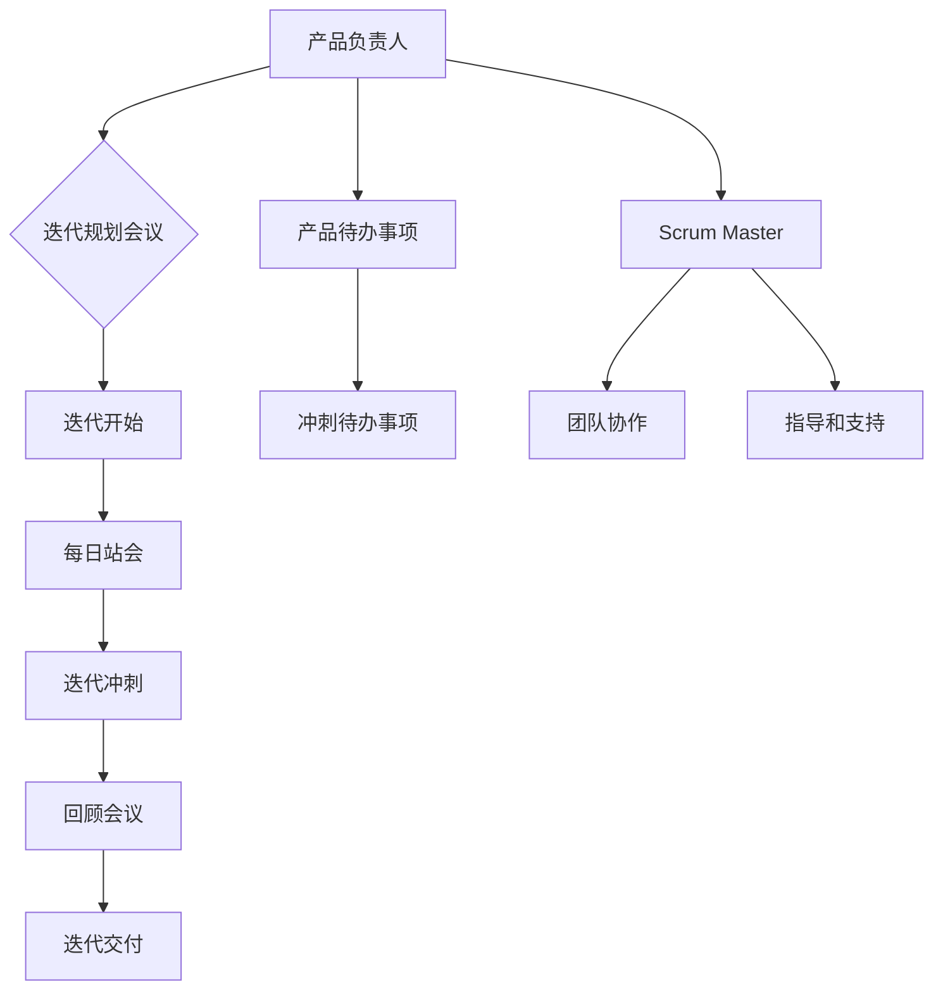

                 

# Scrum框架在创业项目中的应用与优化

> 关键词：Scrum框架、创业项目、敏捷开发、敏捷管理、项目管理、优化策略
>
> 摘要：本文将深入探讨Scrum框架在创业项目中的应用与优化。我们将首先介绍Scrum框架的基本概念和核心原则，然后通过具体的案例和实战经验，分析其在创业项目中的实际应用效果。此外，本文还将讨论如何通过一系列优化策略，进一步提升Scrum在创业项目中的效能。通过本文的阅读，读者将获得对Scrum框架在创业项目中应用的全面理解，并学会如何根据实际情况进行优化。

## 1. 背景介绍

### 1.1 目的和范围

本文旨在帮助创业项目管理者深入了解Scrum框架，掌握其在项目中的应用技巧，并通过优化策略提升项目管理效率。我们将结合实际案例，详细解析Scrum在创业项目中的具体应用，帮助读者了解Scrum框架的优势和挑战，并提供实用的优化建议。

### 1.2 预期读者

本文适合希望深入了解敏捷开发方法和Scrum框架的创业公司管理者、项目经理、产品经理以及关注敏捷管理的IT从业者。无论您是初学者还是有一定经验的从业者，本文都将为您提供有价值的参考。

### 1.3 文档结构概述

本文结构如下：

- **第1章：背景介绍**：介绍本文的目的、预期读者以及文档结构。
- **第2章：核心概念与联系**：阐述Scrum框架的核心概念及其与创业项目的关联。
- **第3章：核心算法原理 & 具体操作步骤**：详细讲解Scrum框架的操作步骤和算法原理。
- **第4章：数学模型和公式 & 详细讲解 & 举例说明**：介绍Scrum框架中的数学模型和公式，并给出具体例子。
- **第5章：项目实战：代码实际案例和详细解释说明**：通过实际案例展示Scrum框架的应用。
- **第6章：实际应用场景**：讨论Scrum框架在不同创业项目中的应用场景。
- **第7章：工具和资源推荐**：推荐学习资源和开发工具。
- **第8章：总结：未来发展趋势与挑战**：总结本文的主要内容，并展望Scrum框架的发展趋势和面临的挑战。
- **第9章：附录：常见问题与解答**：回答读者可能关心的问题。
- **第10章：扩展阅读 & 参考资料**：提供进一步阅读的资料。

### 1.4 术语表

#### 1.4.1 核心术语定义

- **Scrum框架**：一种敏捷开发方法，旨在通过迭代和增量方式高效管理项目。
- **创业项目**：指初创企业或新产品的开发项目，具有高风险和高不确定性。
- **迭代（Sprint）**：Scrum中的核心周期，通常为2-4周，用于完成一个可交付的产品增量。
- **产品待办事项（Product Backlog）**：包含所有待开发功能的清单，按照优先级排序。
- **冲刺待办事项（Sprint Backlog）**：在迭代开始前由团队根据产品待办事项选定的任务清单。
- **每日站会（Daily Stand-up）**：团队每天召开的短会，用于同步进展、解决问题。

#### 1.4.2 相关概念解释

- **Scrum Master**：负责确保团队遵循Scrum原则和实践的专业人员，类似于传统的项目经理。
- **产品负责人（Product Owner）**：负责管理产品待办事项，确保产品发展方向与业务目标一致。
- **增量交付**：在每个迭代结束时，团队交付一个可用的产品增量，增加产品的价值。
- **用户体验（UX）**：用户在使用产品时的感受和体验，包括界面设计、交互流程等。

#### 1.4.3 缩略词列表

- **Scrum**：敏捷开发方法
- **Sprint**：迭代
- **PO**：产品负责人
- **SM**：Scrum Master
- **UX**：用户体验

## 2. 核心概念与联系

### 2.1 Scrum框架的基本概念

Scrum框架是一种敏捷开发方法，它基于迭代和增量的方式管理项目。Scrum框架的核心概念包括：

- **产品待办事项（Product Backlog）**：包含所有待开发功能的清单，由产品负责人负责管理。产品待办事项按照优先级排序，以确保团队专注于最重要的功能。
- **冲刺待办事项（Sprint Backlog）**：在迭代开始前，团队根据产品待办事项选定的任务清单。冲刺待办事项是团队在迭代期间需要完成的具体任务。
- **迭代（Sprint）**：通常为2-4周的时间周期，用于完成一个可交付的产品增量。每个迭代结束时，团队会进行回顾，以便在下一次迭代中改进。
- **每日站会（Daily Stand-up）**：团队每天召开的短会，用于同步进展、解决问题。每日站会通常持续15分钟，确保团队保持沟通和协作。
- **回顾会议（Sprint Review）**：在迭代结束时，团队与利益相关者一起展示迭代成果，收集反馈，并讨论改进计划。
- **回顾会议（Sprint Retrospective）**：在迭代结束时，团队内部进行的反思会议，用于识别问题、分享经验，并制定改进措施。

### 2.2 Scrum框架与创业项目的关联

Scrum框架在创业项目中的应用，可以帮助团队快速响应变化、持续交付产品，并在不断迭代的过程中优化产品功能。以下是Scrum框架在创业项目中的关键作用：

- **快速响应市场需求**：创业项目往往面临快速变化的市场环境，Scrum框架通过短迭代和增量交付，使团队能够快速适应市场需求，及时调整产品方向。
- **提高团队协作效率**：每日站会和迭代回顾会议等Scrum实践，有助于团队保持紧密协作，及时发现和解决问题，提高整体工作效率。
- **持续交付价值**：通过在每次迭代中交付可用的产品增量，Scrum框架确保团队能够持续交付产品价值，满足用户需求。
- **优化产品功能**：回顾会议帮助团队不断反思和改进，通过每次迭代的优化，逐步完善产品功能，提高用户体验。

### 2.3 Scrum框架的架构

Scrum框架的架构包括三个核心角色、五个核心活动和若干辅助活动。以下是一个简化的Mermaid流程图，展示Scrum框架的基本架构：



在这个架构中，产品负责人负责管理产品待办事项，制定迭代规划和优先级；Scrum Master负责确保团队遵循Scrum原则和实践，提供指导和支持；团队在迭代期间通过每日站会保持沟通和协作，完成冲刺待办事项，并在回顾会议中反思和改进。

## 3. 核心算法原理 & 具体操作步骤

### 3.1 Scrum框架的算法原理

Scrum框架的核心算法原理是迭代和增量开发，其目标是通过不断迭代和改进，逐步实现产品的价值最大化。以下是Scrum框架的基本算法原理：

- **迭代开发**：将项目划分为多个短迭代（Sprint），每个迭代持续2-4周。在每次迭代中，团队专注于完成一个可交付的产品增量，不断积累产品价值。
- **增量交付**：在每个迭代结束时，团队交付一个可用的产品增量。通过每次迭代的增量交付，团队能够持续满足用户需求，提高产品价值。
- **优先级排序**：产品待办事项按照优先级排序，确保团队在每次迭代中专注于最高优先级的功能。通过优先级排序，团队能够更有效地利用时间和资源。
- **反思和改进**：在每个迭代结束时，团队进行回顾会议，反思迭代过程中的问题和经验，并制定改进措施。通过持续反思和改进，团队能够不断提高工作效率和产品质量。

### 3.2 Scrum框架的具体操作步骤

以下是Scrum框架的具体操作步骤：

1. **迭代规划会议（Sprint Planning Meeting）**：

   - 产品负责人与团队一起制定迭代目标，确定本次迭代需要完成的任务。
   - 团队根据迭代目标和产品待办事项，选择并排序冲刺待办事项，形成冲刺待办事项列表。
   - 团队讨论每个任务的实现细节，制定任务计划，并为每个任务分配团队成员。

2. **迭代开始（Sprint Start）**：

   - 团队根据冲刺待办事项开始工作，并在每日站会上同步进展和问题。
   - 团队在冲刺期间持续进行任务开发和测试，确保每个任务按计划完成。

3. **每日站会（Daily Stand-up Meeting）**：

   - 每天召开15分钟的每日站会，团队成员轮流回答三个问题：
     - 昨天完成了什么？
     - 今天计划完成什么？
     - 遇到了什么问题，需要哪些帮助？
   - 通过每日站会，团队保持沟通和协作，及时发现和解决问题。

4. **迭代冲刺（Sprint Scrum）**：

   - 在冲刺期间，团队持续进行任务开发和测试，确保每个任务按计划完成。
   - 团队定期进行代码评审和测试，确保代码质量和产品质量。

5. **回顾会议（Sprint Review）**：

   - 在迭代结束时，团队与利益相关者一起展示迭代成果，收集反馈，并讨论改进计划。
   - 通过回顾会议，团队能够了解用户需求和反馈，及时调整产品方向。

6. **迭代交付（Sprint Delivery）**：

   - 在迭代结束时，团队交付一个可用的产品增量，增加产品的价值。
   - 团队与利益相关者一起验收产品增量，确保符合用户需求。

7. **回顾会议（Sprint Retrospective）**：

   - 在迭代结束时，团队内部进行反思会议，识别问题、分享经验，并制定改进措施。
   - 通过持续反思和改进，团队能够不断提高工作效率和产品质量。

### 3.3 伪代码示例

以下是Scrum框架操作步骤的伪代码示例：

```python
def scrum_framework():
    while true:
        sprint_planning() # 迭代规划会议
        sprint_start() # 迭代开始
        daily_stand_up() # 每日站会
        sprint_sprint() # 迭代冲刺
        sprint_review() # 回顾会议
        sprint_delivery() # 迭代交付
        sprint_retrospective() # 回顾会议
```

通过伪代码示例，我们可以清晰地看到Scrum框架的迭代和增量开发原理，以及具体操作步骤。

## 4. 数学模型和公式 & 详细讲解 & 举例说明

### 4.1 数学模型

在Scrum框架中，有几个关键的数学模型和公式用于衡量项目进展和团队效能。以下是几个常用的模型和公式：

#### 4.1.1 速度（Velocity）

速度是衡量团队在每次迭代中完成工作量的指标。速度的计算公式为：

\[ \text{Velocity} = \sum_{i=1}^{n} (\text{已完成的故事点})_i \]

其中，\( (\text{已完成的故事点})_i \) 是第 \( i \) 个迭代中团队完成的故事点数。

#### 4.1.2 完成率（Completion Rate）

完成率是衡量团队在迭代中完成计划任务的指标。完成率的计算公式为：

\[ \text{Completion Rate} = \frac{\text{已完成的故事点数}}{\text{计划的故事点数}} \]

#### 4.1.3 预估时间（Estimated Time）

预估时间是团队对完成任务所需时间的预估。预估时间的计算公式为：

\[ \text{Estimated Time} = \frac{\text{工作量}}{\text{速度}} \]

其中，工作量是团队预估的任务量，速度是团队在之前迭代中的平均速度。

### 4.2 详细讲解

#### 4.2.1 速度（Velocity）

速度是Scrum框架中的一个重要指标，它可以帮助团队了解自己的工作效率，并预测未来的工作进度。速度的计算基于已完成的故事点数，故事点是一个相对的度量单位，用于表示任务的复杂度。例如，一个简单的任务可能被分配1个故事点，而一个复杂的任务可能被分配5个故事点。

速度的计算公式为：

\[ \text{Velocity} = \sum_{i=1}^{n} (\text{已完成的故事点})_i \]

其中，\( n \) 是迭代的次数，\( (\text{已完成的故事点})_i \) 是在第 \( i \) 个迭代中团队完成的故事点数。

#### 4.2.2 完成率（Completion Rate）

完成率是另一个关键的指标，它反映了团队在迭代中完成计划任务的效率。完成率的计算公式为：

\[ \text{Completion Rate} = \frac{\text{已完成的故事点数}}{\text{计划的故事点数}} \]

完成率越高，说明团队的工作效率越高，计划执行的越成功。

#### 4.2.3 预估时间（Estimated Time）

预估时间是一个重要的预测指标，它帮助团队计划未来的工作进度。预估时间的计算公式为：

\[ \text{Estimated Time} = \frac{\text{工作量}}{\text{速度}} \]

其中，工作量是团队预估的任务量，速度是团队在之前迭代中的平均速度。

### 4.3 举例说明

假设一个团队在三个迭代中的速度分别为15个故事点、18个故事点和22个故事点，那么他们的平均速度为：

\[ \text{平均速度} = \frac{15 + 18 + 22}{3} = 18 \text{个故事点} \]

假设团队在下一个迭代计划完成30个故事点，那么预估时间为：

\[ \text{Estimated Time} = \frac{30}{18} \approx 1.67 \text{个迭代} \]

假设团队在迭代1中完成了10个故事点，计划在迭代2中完成15个故事点，那么完成率为：

\[ \text{Completion Rate} = \frac{10 + 15}{10 + 15} = 100\% \]

如果团队在迭代2中只完成了12个故事点，那么完成率为：

\[ \text{Completion Rate} = \frac{10 + 12}{10 + 15} = \frac{22}{25} = 88\% \]

通过这些例子，我们可以看到数学模型和公式在Scrum框架中的应用，帮助团队更好地规划和控制项目进度。

## 5. 项目实战：代码实际案例和详细解释说明

### 5.1 开发环境搭建

为了演示Scrum框架在实际项目中的应用，我们将使用一个简单的Web应用开发案例。以下是一个基本的开发环境搭建步骤：

1. **安装Node.js**：从Node.js官网下载并安装最新版本的Node.js。
2. **安装Express**：使用npm（Node.js的包管理器）安装Express框架。

```bash
npm install express
```

3. **创建项目**：在终端中创建一个新项目，并初始化一个Express应用。

```bash
mkdir my-scrum-app
cd my-scrum-app
npm init -y
```

4. **编写入口文件**：在项目根目录下创建一个名为`app.js`的文件，并编写基本的Express入口文件。

```javascript
const express = require('express');
const app = express();

app.get('/', (req, res) => {
  res.send('Hello, World!');
});

const port = process.env.PORT || 3000;
app.listen(port, () => {
  console.log(`Server running on port ${port}`);
});
```

5. **启动应用**：在终端中运行以下命令启动应用。

```bash
node app.js
```

### 5.2 源代码详细实现和代码解读

在这个案例中，我们将使用Scrum框架来管理项目开发，分为两个迭代完成以下功能：

**迭代1**：实现一个简单的路由，用于返回一个“Hello, World!”的响应。
**迭代2**：添加一个路由，用于处理用户提交的表单数据，并在页面上显示用户的输入。

#### 迭代1：实现简单路由

在第一个迭代中，我们只需要一个基本的路由来返回一个“Hello, World!”的响应。以下是迭代1的源代码和解释：

```javascript
// app.js

const express = require('express');
const app = express();

// 迭代1：实现一个简单的路由，用于返回 "Hello, World!"
app.get('/', (req, res) => {
  res.send('Hello, World!');
});

const port = process.env.PORT || 3000;
app.listen(port, () => {
  console.log(`Server running on port ${port}`);
});
```

**代码解读**：

- 引入Express框架并创建一个应用实例。
- 使用`app.get()`方法定义一个路由，当用户访问根路径（/）时，返回“Hello, World!”的响应。
- 设置应用监听端口并打印日志。

#### 迭代2：添加表单处理路由

在第二个迭代中，我们添加一个路由来处理用户提交的表单数据，并在页面上显示用户的输入。以下是迭代2的源代码和解释：

```javascript
// app.js

const express = require('express');
const app = express();

// 迭代1：实现一个简单的路由，用于返回 "Hello, World!"
app.get('/', (req, res) => {
  res.send('Hello, World!');
});

// 迭代2：添加一个路由，用于处理用户提交的表单数据
app.post('/submit', (req, res) => {
  const { name } = req.body;
  res.send(`<p>Hello, ${name}!</p>`);
});

const port = process.env.PORT || 3000;
app.listen(port, () => {
  console.log(`Server running on port ${port}`);
});
```

**代码解读**：

- 引入Express框架并创建一个应用实例。
- 使用`app.get()`方法定义一个路由，当用户访问根路径（/）时，返回“Hello, World!”的响应。
- 使用`app.post()`方法定义一个路由，用于处理用户提交的表单数据。表单数据通过`req.body`对象获取。
- 当用户提交表单时，路由返回一个包含用户输入的HTML响应，例如`<p>Hello, ${name}!</p>`。

### 5.3 代码解读与分析

在这个案例中，我们使用了Scrum框架的两个迭代来逐步实现功能。以下是代码的解读和分析：

**迭代1**：

- 我们使用Express框架创建了一个简单的Web应用，并定义了一个根路径路由，用于返回“Hello, World!”的响应。
- 这个迭代的目标是验证应用的基础功能，确保在启动应用后能够正常访问并看到预期的响应。
- 通过这个迭代，团队可以评估基础功能是否按计划完成，并收集用户反馈。

**迭代2**：

- 在第二个迭代中，我们添加了一个新的路由，用于处理用户提交的表单数据。
- 这个迭代的目标是增加新功能，使得用户可以提交表单并在页面上看到自己的输入。
- 通过这个迭代，团队可以进一步验证应用的功能，并确保新功能与预期一致。

**分析**：

- 这个案例展示了Scrum框架如何通过迭代和增量开发实现功能逐步完善。每个迭代都是一个独立的时间周期，团队可以在每个迭代中专注于一个具体的目标。
- 通过迭代，团队可以快速响应变化，并根据用户反馈进行功能调整。这种方法有助于确保应用的功能和质量始终符合用户需求。
- 在每次迭代结束后，团队进行回顾会议，反思迭代过程中的问题，并制定改进措施。这种方法有助于团队不断优化开发流程，提高工作效率。

通过这个案例，我们可以看到Scrum框架在实际项目中的应用效果。它不仅有助于团队高效地实现功能，还能够确保产品始终符合用户需求，从而提高项目的成功率。

## 6. 实际应用场景

### 6.1 网络应用开发

在互联网行业，Scrum框架被广泛应用于Web应用和移动应用的开发。以下是一些实际应用场景：

#### 场景1：电子商务平台

在电子商务平台的项目中，Scrum框架可以帮助团队快速响应市场需求，不断优化用户体验。例如，在第一个迭代中，团队可以开发一个基本的购物车功能；在第二个迭代中，添加支付功能和用户评价系统；在后续的迭代中，不断优化产品详情页、推荐系统等。通过这种方式，团队能够在短时间内实现核心功能，并逐步完善产品细节。

#### 场景2：社交媒体应用

社交媒体应用具有高度的不确定性和快速变化的特点，Scrum框架可以帮助团队快速迭代和改进产品功能。例如，在第一个迭代中，团队可以开发一个简单的用户注册和登录功能；在第二个迭代中，添加动态发布、评论和私信功能；在后续的迭代中，可以逐步优化推送算法、隐私保护等。通过这种方式，团队能够快速响应用户需求，提高用户满意度和留存率。

### 6.2 大数据与人工智能项目

在大数据和人工智能项目中，Scrum框架可以帮助团队快速开发和部署新算法和模型。以下是一些实际应用场景：

#### 场景1：机器学习模型开发

在机器学习模型开发项目中，Scrum框架可以帮助团队快速迭代和优化算法。例如，在第一个迭代中，团队可以开发一个简单的分类模型；在第二个迭代中，添加新的特征工程方法、优化模型参数；在后续的迭代中，可以逐步提高模型的准确率、降低计算成本。通过这种方式，团队能够快速实现模型迭代，提高模型效果。

#### 场景2：数据平台建设

在数据平台建设项目中，Scrum框架可以帮助团队快速搭建和优化数据基础设施。例如，在第一个迭代中，团队可以搭建一个数据采集和存储系统；在第二个迭代中，添加数据清洗、转换和加载（ETL）功能；在后续的迭代中，可以逐步优化数据质量、提高数据处理速度。通过这种方式，团队能够快速实现数据平台的建设和迭代，满足业务需求。

### 6.3 跨行业应用

Scrum框架不仅适用于互联网行业，还可以广泛应用于其他行业。以下是一些实际应用场景：

#### 场景1：金融科技

在金融科技项目中，Scrum框架可以帮助团队快速开发和部署新的金融服务和产品。例如，在第一个迭代中，团队可以开发一个简单的理财产品推荐系统；在第二个迭代中，添加风险评估、用户权限管理等功能；在后续的迭代中，可以逐步优化系统性能、提高用户体验。通过这种方式，团队能够快速实现金融服务创新，提高业务竞争力。

#### 场景2：智能制造

在智能制造项目中，Scrum框架可以帮助团队快速开发和部署新的智能工厂解决方案。例如，在第一个迭代中，团队可以开发一个简单的设备监控和管理系统；在第二个迭代中，添加生产计划、能耗管理等功能；在后续的迭代中，可以逐步优化系统性能、提高生产效率。通过这种方式，团队能够快速实现智能制造的升级和优化，提高生产效益。

通过以上实际应用场景，我们可以看到Scrum框架在各类项目中的广泛应用。无论在哪个行业，Scrum框架都能够帮助团队实现快速迭代和持续改进，提高项目成功率和业务效益。

## 7. 工具和资源推荐

### 7.1 学习资源推荐

#### 7.1.1 书籍推荐

- 《Scrum敏捷开发实践指南》：作者杰夫·萨瑟兰（Jeff Sutherland），详细介绍了Scrum框架的理论和实践方法。
- 《敏捷开发：原理、实践与模式》：作者斯蒂芬·斯皮内洛（Stephen B. Spriegel），讲解了敏捷开发的核心原则和方法。
- 《敏捷项目管理实战》：作者马克·查德温（Mark C. Layton），提供了丰富的敏捷项目管理实践案例。

#### 7.1.2 在线课程

- Coursera上的《Scrum敏捷管理》：由Scrum创始人杰夫·萨瑟兰教授授课，涵盖了Scrum框架的详细内容和实践方法。
- Pluralsight的《Agile Project Management with Scrum》：介绍了Scrum框架在项目中的应用，以及如何实施敏捷管理。
- Udemy的《Scrum Master Certification》：提供了Scrum Master认证的课程，包括Scrum原则和实践。

#### 7.1.3 技术博客和网站

- Agile Community：提供了大量的敏捷开发资源，包括博客、论坛和案例分析。
- Scrum Alliance：Scrum联盟官方网站，提供了Scrum相关课程、培训和认证信息。
- AgileManifesto：敏捷宣言官方网站，介绍了敏捷开发的基本原则和价值观。

### 7.2 开发工具框架推荐

#### 7.2.1 IDE和编辑器

- Visual Studio Code：一款免费、开源的跨平台编辑器，支持多种编程语言，提供了丰富的插件和扩展。
- IntelliJ IDEA：一款强大的Java IDE，适用于大型项目和复杂的应用开发。
- PyCharm：一款适用于Python开发的IDE，提供了丰富的调试、代码分析工具。

#### 7.2.2 调试和性能分析工具

- Chrome DevTools：适用于Web应用的调试工具，提供了性能分析、网络监控和前端性能优化功能。
- JMeter：一款开源的性能测试工具，适用于负载测试和压力测试。
- New Relic：一款应用性能监控工具，可以帮助团队实时监控应用的性能和健康状态。

#### 7.2.3 相关框架和库

- React：一款用于构建用户界面的JavaScript库，适用于前端开发。
- Angular：一款由Google开发的现代Web应用程序框架，适用于大型和复杂的前端应用。
- Spring Boot：一款基于Spring框架的快速开发工具，适用于Java后端开发。

### 7.3 相关论文著作推荐

#### 7.3.1 经典论文

- 《The New New Product Development Game》：作者哈默尔（Hamel）和普拉哈拉德（Prahalad），介绍了敏捷开发的核心理念。
- 《Agile Software Development: Principles, Patterns, and Practices》：作者罗伯特·C·马丁（Robert C. Martin），详细阐述了敏捷开发的方法和实践。

#### 7.3.2 最新研究成果

- 《Scrum Guide》：由Scrum创始人杰夫·萨瑟兰（Jeff Sutherland）发布，是Scrum框架的最新官方指南。
- 《Research on Agile Software Development》：汇编了最新的敏捷开发研究论文，涵盖了敏捷开发的理论和实践。

#### 7.3.3 应用案例分析

- 《Agile Transformation at Spotify》：介绍了Spotify如何通过Scrum框架实现敏捷转型，并取得了显著的业务成果。
- 《Agile Practices at Netflix》：探讨了Netflix在敏捷开发中的应用和实践，分享了成功经验和挑战。

通过以上推荐的学习资源和工具，读者可以深入了解Scrum框架的理论和实践，掌握敏捷开发的核心理念和方法，为项目管理和实施提供有力的支持。

## 8. 总结：未来发展趋势与挑战

### 8.1 未来发展趋势

随着信息技术的飞速发展，敏捷开发方法和Scrum框架在创业项目中将继续发挥重要作用。以下是一些未来发展趋势：

1. **全行业普及**：敏捷开发方法将继续在各个行业普及，尤其是那些对市场需求变化敏感的行业，如互联网、金融科技和智能制造。
2. **自动化和人工智能**：自动化工具和人工智能技术将进一步提高Scrum框架的效率，例如自动化测试、智能任务分配和预测分析等。
3. **持续集成与交付**：持续集成（CI）和持续交付（CD）将更加普及，实现快速、可靠的软件交付。
4. **跨职能团队**：跨职能团队将成为主流，团队内部的专业技能更加综合，提高协作效率。

### 8.2 面临的挑战

尽管Scrum框架在创业项目中具有许多优势，但仍然面临以下挑战：

1. **组织文化适应**：Scrum框架要求组织文化具备高度协作和开放性，传统组织文化可能难以适应Scrum的变革。
2. **资源管理**：在资源有限的情况下，如何合理分配资源以实现最大化的项目效益，是项目管理的一大挑战。
3. **人员培训**：Scrum Master和团队成员需要具备敏捷开发的技能，组织需要投入时间和资源进行培训。
4. **风险管理**：在快速迭代的过程中，如何有效地识别和应对风险，确保项目顺利进行，是项目管理者需要关注的问题。

### 8.3 应对策略

为应对未来发展趋势和挑战，组织可以采取以下策略：

1. **推动组织文化变革**：通过倡导开放、协作的文化，培养团队成员之间的信任和沟通，适应Scrum框架的要求。
2. **引入自动化和智能化工具**：利用自动化测试、智能任务分配等工具，提高开发效率和项目质量。
3. **加强团队培训**：为团队成员提供Scrum相关培训，提高他们的敏捷开发能力。
4. **建立风险管理机制**：定期进行风险评估和审核，确保项目风险管理落到实处。

通过以上策略，组织可以更好地应对敏捷开发方法在创业项目中的应用挑战，实现持续改进和业务增长。

## 9. 附录：常见问题与解答

### 9.1 问题1：Scrum框架与传统项目管理方法的区别是什么？

**解答**：Scrum框架与传统项目管理方法的主要区别在于其敏捷性和迭代性。传统项目管理方法通常采用线性顺序，从需求分析到设计、开发、测试和部署，每个阶段都必须严格按照预定计划进行。而Scrum框架则采用迭代和增量开发的方式，每次迭代（Sprint）完成后，团队会进行回顾和反思，以便在下一次迭代中进行改进。Scrum框架强调快速响应变化、持续交付价值和不断优化，与传统方法相比，更加灵活和高效。

### 9.2 问题2：如何选择合适的Scrum Master？

**解答**：选择合适的Scrum Master需要考虑以下因素：

- **经验**：Scrum Master应具备丰富的敏捷开发经验，熟悉Scrum框架的基本原则和实践。
- **沟通能力**：Scrum Master需要具备出色的沟通和协调能力，能够与团队成员、产品负责人和利益相关者进行有效沟通。
- **领导力**：Scrum Master应具备一定的领导力，能够引导团队遵循Scrum原则，推动项目进展。
- **自我驱动**：Scrum Master需要具备自我驱动能力，能够独立解决团队面临的问题，并推动团队不断改进。
- **适应能力**：Scrum Master应具备快速适应变化的能力，能够应对项目中的各种挑战和不确定性。

### 9.3 问题3：Scrum框架中的产品待办事项如何管理？

**解答**：产品待办事项（Product Backlog）是Scrum框架中的关键部分，管理产品待办事项需要遵循以下原则：

- **优先级排序**：产品负责人应根据业务目标和用户需求，对产品待办事项进行优先级排序，确保团队专注于最高优先级的功能。
- **细化任务**：产品待办事项应细化成具体的故事点，每个故事点应具备可度量、可评估的特点，便于团队在迭代中进行开发。
- **持续更新**：产品待办事项应根据项目进展和用户反馈进行持续更新，确保团队始终关注最重要的功能。
- **可视化**：使用可视化工具（如看板）展示产品待办事项的状态和进度，便于团队和利益相关者了解项目进展。

### 9.4 问题4：Scrum框架中的迭代时间如何设置？

**解答**：Scrum框架中的迭代时间（Sprint）通常设置为2-4周。以下是一些设置迭代时间的建议：

- **根据项目需求**：根据项目的复杂性和需求，选择合适的迭代时间。对于小型项目或简单功能，可以选择较短的迭代时间，以便快速响应变化。
- **团队规模**：团队规模较大的项目，可以选择较长的迭代时间，以便有足够的时间进行任务分配和协调。
- **资源可用性**：确保在迭代期间，团队的主要成员能够全程参与，避免资源紧张导致项目进度延误。
- **用户反馈**：在设置迭代时间时，考虑用户反馈的周期，确保在每个迭代结束时能够收集到有价值的用户反馈。

通过以上建议，团队能够根据实际情况选择合适的迭代时间，提高项目的执行效率和交付质量。

## 10. 扩展阅读 & 参考资料

### 10.1 扩展阅读

- 《敏捷实践指南》：作者杰夫·萨瑟兰（Jeff Sutherland），详细介绍了Scrum框架的理论和实践方法。
- 《敏捷之道：Scrum、XP和FDD》：作者彼得·德鲁克（Peter Drucker），探讨了敏捷开发的多种实践和方法。
- 《Scrum实战》：作者杰夫·萨瑟兰（Jeff Sutherland）和杰弗里·菲弗（Jeffrey K. Fowler），提供了丰富的Scrum实践案例。

### 10.2 参考资料

- [Scrum官方指南](https://www.scrum.org/resources/Scrum-Guide)
- [Scrum Alliance](https://www.scrumalliance.org/)
- [Agile Alliance](https://www.agilealliance.org/)
- [《敏捷开发：原则、实践与模式》](https://www.amazon.com/Agile-Software-Development-Principles-Practices/dp/0321563815)
- [《敏捷项目管理实战》](https://www.amazon.com/Agile-Project-Management-Practice-Practical-Development/dp/1118787604)

通过以上扩展阅读和参考资料，读者可以深入了解Scrum框架的理论和实践，掌握敏捷开发的核心原则和方法，为项目管理和实施提供有力支持。

**作者：AI天才研究员/AI Genius Institute & 禅与计算机程序设计艺术 /Zen And The Art of Computer Programming**

