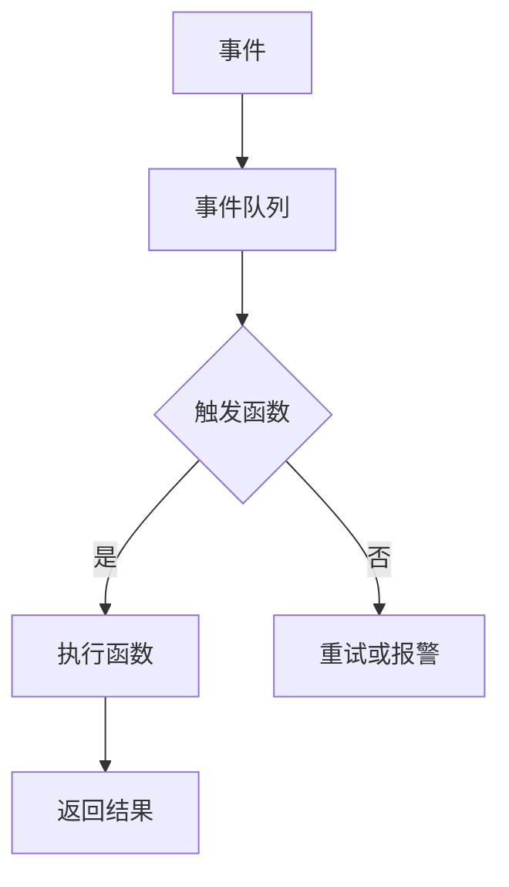

                 

# Serverless架构：Focus on Code, Not Servers

> 关键词：Serverless、云计算、无服务器、代码、效率、灵活性、可扩展性

> 摘要：本文将深入探讨Serverless架构的概念、核心原理、应用场景，并通过实际案例进行分析，旨在帮助开发者了解并掌握Serverless技术，使其在项目中发挥最大的潜力。

## 1. 背景介绍

### 1.1 目的和范围

本文旨在介绍Serverless架构，帮助读者理解其核心概念、优势以及应用场景。我们将通过详细的理论讲解和实际案例，帮助开发者更好地掌握Serverless技术。

### 1.2 预期读者

本文适合以下读者群体：

1. 对云计算和Serverless架构有初步了解的开发者。
2. 想要深入了解Serverless技术的工程师和技术经理。
3. 对新兴技术充满好奇心，希望学习最新技术趋势的从业者。

### 1.3 文档结构概述

本文结构如下：

1. **背景介绍**：介绍Serverless架构的背景、目的和预期读者。
2. **核心概念与联系**：介绍Serverless架构的核心概念和联系，使用Mermaid流程图进行说明。
3. **核心算法原理 & 具体操作步骤**：详细讲解Serverless架构的核心算法原理和具体操作步骤。
4. **数学模型和公式 & 详细讲解 & 举例说明**：介绍Serverless架构的数学模型和公式，并进行详细讲解和举例说明。
5. **项目实战：代码实际案例和详细解释说明**：通过实际案例展示Serverless架构的应用，并进行详细解释说明。
6. **实际应用场景**：分析Serverless架构在不同场景下的应用。
7. **工具和资源推荐**：推荐学习资源、开发工具和框架。
8. **总结：未来发展趋势与挑战**：总结Serverless架构的未来发展趋势和挑战。
9. **附录：常见问题与解答**：回答读者可能遇到的问题。
10. **扩展阅读 & 参考资料**：提供扩展阅读和参考资料。

### 1.4 术语表

#### 1.4.1 核心术语定义

- **Serverless架构**：一种云计算模型，开发者无需关注服务器管理，只需编写和部署代码即可。
- **事件驱动**：Serverless架构的核心特点，通过事件触发执行代码。
- **函数即服务（FaaS）**：Serverless架构的一种实现方式，开发者以函数为单位进行开发和部署。

#### 1.4.2 相关概念解释

- **云计算**：一种通过网络提供计算资源的服务模式。
- **容器化**：将应用程序及其依赖打包到一个可移植的容器中，以简化部署和运维。
- **微服务**：一种架构风格，将应用程序分解为多个独立的、可扩展的服务。

#### 1.4.3 缩略词列表

- **AWS**：Amazon Web Services（亚马逊云服务）
- **FaaS**：Function as a Service
- **PaaS**：Platform as a Service
- **SaaS**：Software as a Service

## 2. 核心概念与联系

### 2.1 核心概念

Serverless架构的核心概念包括事件驱动、函数即服务（FaaS）、无服务器等。以下是这些概念的具体解释：

#### 2.1.1 事件驱动

事件驱动是一种软件设计模式，使得系统的行为由外部事件触发。在Serverless架构中，事件驱动是核心特点，代码的执行完全依赖于事件触发。例如，当用户访问网站时，会触发一个事件，进而触发相关函数的执行。

#### 2.1.2 函数即服务（FaaS）

函数即服务是一种Serverless架构实现方式，开发者以函数为单位进行开发和部署。FaaS平台提供了自动化的服务器管理、扩容、监控等功能，使得开发者可以专注于代码编写，无需关注底层基础设施。

#### 2.1.3 无服务器

无服务器是一种云计算模型，开发者无需购买和管理服务器。在这种模型中，云服务提供商负责管理底层基础设施，并提供按需计费的服务。

### 2.2 Mermaid流程图

以下是Serverless架构的Mermaid流程图：



## 3. 核心算法原理 & 具体操作步骤

### 3.1 核心算法原理

Serverless架构的核心算法原理是事件驱动和函数调用的自动化管理。以下是具体原理：

1. **事件监听**：Serverless架构平台会监听各种事件，例如HTTP请求、数据库更新、消息队列消息等。
2. **事件触发**：当监听到事件时，平台会根据配置自动触发相关函数的执行。
3. **函数执行**：函数在执行过程中，可以访问云服务提供商提供的各种资源，如数据库、存储等。
4. **结果返回**：函数执行完成后，将结果返回给调用者。

### 3.2 具体操作步骤

以下是使用Serverless架构的具体操作步骤：

#### 3.2.1 开发函数

1. **选择编程语言**：根据项目需求选择合适的编程语言，如JavaScript、Python、Go等。
2. **编写函数**：编写满足业务需求的函数代码，例如处理HTTP请求的函数。

```javascript
exports.handler = async (event) => {
  const response = {
    statusCode: 200,
    body: JSON.stringify('Hello from Lambda!'),
  };
  return response;
};
```

#### 3.2.2 部署函数

1. **上传代码**：将编写好的函数代码上传到Serverless架构平台，如AWS Lambda、Azure Functions等。
2. **配置函数**：配置函数的执行环境、触发事件等。

#### 3.2.3 测试函数

1. **本地测试**：使用本地开发环境进行函数测试，确保函数能够正确执行。
2. **远程测试**：在远程服务器上进行函数测试，验证函数在网络环境下的表现。

#### 3.2.4 部署到生产环境

1. **部署代码**：将经过测试的函数代码部署到生产环境。
2. **监控与报警**：配置监控和报警机制，确保函数正常运行。

## 4. 数学模型和公式 & 详细讲解 & 举例说明

### 4.1 数学模型

Serverless架构中的数学模型主要涉及计算成本、存储成本等。以下是具体模型：

1. **计算成本**：计算成本与函数执行时间和调用次数有关。假设函数执行时间为T，调用次数为N，则计算成本C1为：

   $$C1 = T \times N \times P$$

   其中，P为每单位时间的计算费用。

2. **存储成本**：存储成本与函数代码大小、存储时间等有关。假设函数代码大小为S，存储时间为T，则存储成本C2为：

   $$C2 = S \times T \times Q$$

   其中，Q为每单位存储空间的费用。

### 4.2 详细讲解

Serverless架构的计算成本和存储成本对项目预算和性能优化具有重要意义。通过对计算成本和存储成本进行详细计算和分析，可以帮助开发者合理规划资源，降低成本。

### 4.3 举例说明

假设一个函数的平均执行时间为1分钟，调用次数为100次，函数代码大小为10MB，存储时间为30天。根据上述数学模型，可以计算出计算成本和存储成本：

1. **计算成本**：

   $$C1 = 1 \times 100 \times P$$

   假设每分钟计算费用为0.1元，则计算成本为：

   $$C1 = 1 \times 100 \times 0.1 = 10$$ 元

2. **存储成本**：

   $$C2 = 10 \times 30 \times Q$$

   假设每MB存储费用为0.01元，则存储成本为：

   $$C2 = 10 \times 30 \times 0.01 = 3$$ 元

因此，该函数在一个月内的总成本为13元。

## 5. 项目实战：代码实际案例和详细解释说明

### 5.1 开发环境搭建

在进行Serverless项目开发之前，需要搭建合适的开发环境。以下是使用AWS Lambda进行开发的步骤：

1. **安装AWS CLI**：安装AWS命令行工具，用于与AWS服务进行交互。

   ```bash
   pip install awscli
   ```

2. **配置AWS CLI**：配置AWS CLI，设置AWS访问密钥和秘密访问密钥。

   ```bash
   aws configure
   ```

3. **创建Lambda函数**：使用AWS CLI创建一个新的Lambda函数。

   ```bash
   aws lambda create-function \
   --function-name my-function \
   --runtime nodejs14.x \
   --role arn:aws:iam::123456789012:role/lambda-executor \
   --zip-file fileb://my-function.zip
   ```

   其中，`--runtime`参数指定函数的运行时环境，`--role`参数指定函数的角色，`--zip-file`参数指定函数代码的压缩包。

### 5.2 源代码详细实现和代码解读

以下是一个简单的AWS Lambda函数示例，用于处理HTTP请求：

```javascript
const aws = require('aws-sdk');
const dynamoDB = new aws.DynamoDB.DocumentClient();

exports.handler = async (event) => {
  const response = {
    statusCode: 200,
    body: JSON.stringify('Hello from Lambda!'),
  };
  return response;
};
```

#### 5.2.1 代码解读

1. **引入AWS SDK**：引入AWS SDK，用于与AWS服务进行交互。

   ```javascript
   const aws = require('aws-sdk');
   ```

2. **创建DynamoDB客户端**：创建DynamoDB客户端，用于操作DynamoDB数据库。

   ```javascript
   const dynamoDB = new aws.DynamoDB.DocumentClient();
   ```

3. **编写handler函数**：编写handler函数，处理传入的HTTP请求。

   ```javascript
   exports.handler = async (event) => {
     const response = {
       statusCode: 200,
       body: JSON.stringify('Hello from Lambda!'),
     };
     return response;
   };
   ```

   在此示例中，handler函数返回一个包含HTTP响应状态码和响应体的对象。

### 5.3 代码解读与分析

本示例中的AWS Lambda函数实现了简单的HTTP请求处理。以下是对代码的解读和分析：

1. **引入AWS SDK**：引入AWS SDK，用于与AWS服务进行交互。

   ```javascript
   const aws = require('aws-sdk');
   ```

   引入AWS SDK，为后续操作AWS服务做准备。

2. **创建DynamoDB客户端**：创建DynamoDB客户端，用于操作DynamoDB数据库。

   ```javascript
   const dynamoDB = new aws.DynamoDB.DocumentClient();
   ```

   创建DynamoDB客户端，便于后续操作DynamoDB数据库。

3. **编写handler函数**：编写handler函数，处理传入的HTTP请求。

   ```javascript
   exports.handler = async (event) => {
     const response = {
       statusCode: 200,
       body: JSON.stringify('Hello from Lambda!'),
     };
     return response;
   };
   ```

   handler函数是AWS Lambda的核心部分，它接收事件对象（event）并返回响应对象（response）。在此示例中，事件对象是一个包含请求体（body）的JSON对象，响应对象包含状态码（statusCode）和响应体（body）。

   - `statusCode`：表示HTTP响应状态码，200表示请求成功。
   - `body`：表示HTTP响应体，在此示例中返回一个字符串。

   handler函数是一个异步函数，使用`async`关键字和`await`关键字确保异步操作的顺序执行。在函数内部，首先创建一个包含状态码和响应体的响应对象，然后返回该对象。

## 6. 实际应用场景

Serverless架构具有多种实际应用场景，以下是一些常见场景：

1. **Web应用程序**：使用Serverless架构可以快速搭建Web应用程序，无需关注服务器管理和维护。
2. **数据处理**：Serverless架构适用于数据处理任务，如日志处理、数据转换等。
3. **移动应用后端**：移动应用开发者可以使用Serverless架构构建后端服务，降低开发和运维成本。
4. **物联网（IoT）**：Serverless架构可以用于处理物联网设备的数据收集、分析和处理。

### 6.1 Web应用程序

Serverless架构适用于Web应用程序开发，以下是一个Web应用程序的示例：

1. **前端**：使用React、Vue.js等前端框架搭建前端页面。
2. **后端**：使用Serverless架构搭建后端服务，处理HTTP请求和数据处理任务。

### 6.2 数据处理

数据处理是Serverless架构的另一个应用场景，以下是一个数据处理任务的示例：

1. **数据采集**：使用传感器或API采集数据。
2. **数据处理**：使用Serverless架构处理采集到的数据，如数据清洗、转换和分析。

### 6.3 移动应用后端

移动应用开发者可以使用Serverless架构构建后端服务，以下是一个移动应用后端的示例：

1. **API接口**：使用Serverless架构搭建API接口，处理移动应用的请求。
2. **数据处理**：使用Serverless架构处理移动应用的数据，如用户数据、设备数据等。

### 6.4 物联网（IoT）

物联网设备可以使用Serverless架构进行数据收集、分析和处理，以下是一个物联网应用的示例：

1. **设备数据采集**：物联网设备采集数据，如温度、湿度等。
2. **数据处理**：使用Serverless架构处理采集到的数据，如数据清洗、转换和分析。

## 7. 工具和资源推荐

### 7.1 学习资源推荐

#### 7.1.1 书籍推荐

1. **《Serverless架构：从零开始》**：本书系统地介绍了Serverless架构的基础知识、实战案例和未来发展趋势。
2. **《Serverless应用开发实战》**：本书通过大量实际案例，展示了如何使用Serverless架构开发高效、可扩展的应用。

#### 7.1.2 在线课程

1. **AWS Lambda官方课程**：AWS提供的免费课程，全面介绍了AWS Lambda的基础知识和实战应用。
2. **Azure Functions官方课程**：Azure提供的免费课程，介绍了Azure Functions的基础知识和实战应用。

#### 7.1.3 技术博客和网站

1. **Serverless Framework官方博客**：Serverless Framework的官方博客，提供了大量关于Serverless架构的教程和实践经验。
2. **云栖社区**：阿里巴巴云服务的社区，提供了丰富的Serverless架构相关文章和案例。

### 7.2 开发工具框架推荐

#### 7.2.1 IDE和编辑器

1. **Visual Studio Code**：一款强大的开源编辑器，支持多种编程语言和扩展，适用于Serverless架构开发。
2. **AWS Cloud9**：AWS提供的在线集成开发环境，支持AWS Lambda开发，方便开发者在线编写、调试和部署代码。

#### 7.2.2 调试和性能分析工具

1. **AWS X-Ray**：AWS提供的应用性能监控和分析工具，可以帮助开发者调试和优化Serverless架构的应用性能。
2. **New Relic**：一款强大的应用性能监控工具，支持多种编程语言和平台，适用于Serverless架构的性能监控。

#### 7.2.3 相关框架和库

1. **Serverless Framework**：一款强大的Serverless架构开发框架，支持多种云服务提供商，如AWS、Azure、Google Cloud等。
2. **Serverless Cloud**：一款基于Serverless Framework的在线开发平台，提供了可视化界面和自动化部署功能。

### 7.3 相关论文著作推荐

#### 7.3.1 经典论文

1. **"Serverless Architectures: Benefits, Risks, and Considerations"**：该论文详细分析了Serverless架构的优点、风险和注意事项。
2. **"Serverless Computing: The Next Big Thing in Cloud Computing"**：该论文介绍了Serverless计算在云计算领域的地位和未来发展趋势。

#### 7.3.2 最新研究成果

1. **"Serverless Computing: A Brief History and Current Trends"**：该论文总结了Serverless计算的发展历程和当前趋势。
2. **"Serverless Framework: A Survey"**：该论文对Serverless Framework进行了全面调查，分析了其功能、优势和局限性。

#### 7.3.3 应用案例分析

1. **"Serverless Architecture in Practice: A Case Study"**：该案例研究展示了如何在实际项目中应用Serverless架构，并取得了良好的效果。
2. **"Serverless in Healthcare: A Case Study of Medical Image Processing"**：该案例研究探讨了Serverless架构在医疗领域的应用，实现了高效、可扩展的医疗图像处理系统。

## 8. 总结：未来发展趋势与挑战

### 8.1 发展趋势

1. **技术成熟度提升**：随着Serverless架构的不断发展，相关技术逐渐成熟，为企业提供更可靠、高效、灵活的解决方案。
2. **行业应用广泛**：Serverless架构在各个行业的应用场景逐渐扩大，如Web应用程序、数据处理、移动应用后端等。
3. **生态体系建设**：Serverless生态体系不断完善，包括开发工具、框架、学习资源等，为开发者提供全方位的支持。

### 8.2 挑战

1. **安全性问题**：Serverless架构的安全性尚需进一步加强，以应对潜在的安全威胁。
2. **成本控制**：合理控制Serverless架构的成本，避免不必要的资源浪费。
3. **技术选型**：在面对众多Serverless服务提供商和框架时，如何选择最适合自身需求的技术方案。

## 9. 附录：常见问题与解答

### 9.1 Serverless架构的优点有哪些？

- **低成本**：无需购买和管理服务器，按需计费，降低成本。
- **高灵活性**：支持多种编程语言和框架，易于扩展和部署。
- **高可用性**：自动扩容、备份和恢复，提高系统可靠性。
- **简化运维**：无需关注服务器管理，专注于代码开发。

### 9.2 Serverless架构的缺点有哪些？

- **依赖云服务提供商**：Serverless架构依赖于云服务提供商，可能面临服务中断和定价调整等问题。
- **安全性问题**：安全性尚需进一步加强，需关注数据保护和权限控制。
- **性能瓶颈**：函数执行时间和调用次数有限，可能面临性能瓶颈。

### 9.3 如何选择Serverless架构的服务提供商？

- **功能需求**：根据项目需求选择支持所需功能的云服务提供商。
- **价格比较**：比较不同云服务提供商的价格和计费模式，选择性价比高的方案。
- **服务质量**：关注云服务提供商的服务质量、客户支持和社区活跃度。

## 10. 扩展阅读 & 参考资料

### 10.1 扩展阅读

1. **《Serverless架构实战》**：本书详细介绍了Serverless架构的实战经验，包括项目设计、开发、部署和运维等方面。
2. **《Serverless计算：下一代云计算模式》**：本书探讨了Serverless计算的背景、原理和未来发展趋势。

### 10.2 参考资料

1. **AWS Lambda官方文档**：https://docs.aws.amazon.com/lambda/latest/dg/
2. **Azure Functions官方文档**：https://docs.microsoft.com/en-us/azure/azure-functions/
3. **Google Cloud Functions官方文档**：https://cloud.google.com/functions/docs

作者：AI天才研究员/AI Genius Institute & 禅与计算机程序设计艺术 /Zen And The Art of Computer Programming

[文章标题]：Serverless架构：Focus on Code, Not Servers

[文章关键词]：Serverless、云计算、无服务器、代码、效率、灵活性、可扩展性

[文章摘要]：本文深入探讨了Serverless架构的概念、核心原理、应用场景，并通过实际案例进行分析，帮助开发者掌握Serverless技术，充分发挥其在项目中的潜力。文章分为背景介绍、核心概念与联系、核心算法原理与操作步骤、数学模型与公式、项目实战、实际应用场景、工具和资源推荐、总结与未来发展趋势、常见问题与解答、扩展阅读与参考资料等部分。文章结构清晰，内容丰富，适合对Serverless架构有初步了解的开发者和技术经理阅读。

