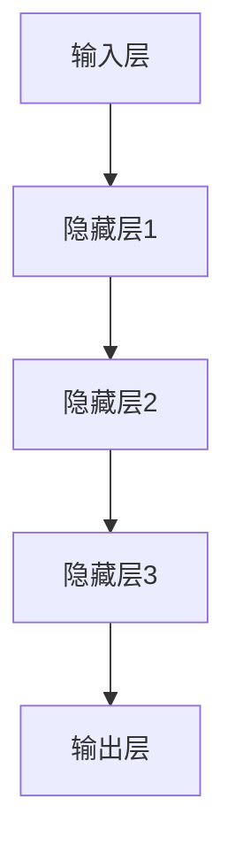

                 

# Sora模型的技术栈详细解析

> 关键词：Sora模型，技术栈，深度学习，神经网络，Python，TensorFlow，数学模型，算法原理，项目实战，应用场景

> 摘要：本文将对Sora模型的技术栈进行详细解析，涵盖其背景介绍、核心概念与联系、核心算法原理与操作步骤、数学模型与公式、项目实战、实际应用场景以及未来发展趋势与挑战。通过本文的深入剖析，读者将全面了解Sora模型的构建与应用，掌握其在深度学习领域的重要性。

## 1. 背景介绍

### 1.1 目的和范围

本文旨在详细解析Sora模型的技术栈，帮助读者全面了解其在深度学习领域的应用价值。本文主要涵盖以下内容：

- Sora模型的发展历程与技术背景
- 核心概念与原理的深入讲解
- 具体算法原理与操作步骤
- 数学模型与公式的详细阐述
- 项目实战中的代码实现与解读
- 实际应用场景与未来发展

### 1.2 预期读者

本文适合以下读者群体：

- 对深度学习、神经网络有浓厚兴趣的计算机科学学生和从业者
- 想要学习Sora模型应用实践的程序员和工程师
- 对人工智能领域有深入了解的技术专家和研究人员

### 1.3 文档结构概述

本文共分为八个部分，具体结构如下：

1. 背景介绍
2. 核心概念与联系
3. 核心算法原理与具体操作步骤
4. 数学模型与公式
5. 项目实战：代码实际案例和详细解释说明
6. 实际应用场景
7. 工具和资源推荐
8. 总结：未来发展趋势与挑战

### 1.4 术语表

在本文中，以下术语具有特定的含义：

#### 1.4.1 核心术语定义

- 深度学习：一种人工智能的分支，通过多层神经网络进行数据建模与分析。
- 神经网络：由一系列相互连接的节点（或称为神经元）组成的计算模型，用于实现函数映射。
- 深层神经网络：包含多个隐藏层的神经网络。
- Sora模型：一种基于深度学习的模型，用于解决特定问题。

#### 1.4.2 相关概念解释

- 数据预处理：对原始数据进行清洗、归一化等处理，以便于后续建模。
- 损失函数：评估模型预测结果与真实值之间差异的指标，用于优化模型参数。
- 优化算法：用于调整模型参数，以降低损失函数值。

#### 1.4.3 缩略词列表

- TensorFlow：一种开源深度学习框架。
- GPU：图形处理器，常用于加速深度学习模型的训练。
- CPU：中央处理器，计算机的核心部件。

## 2. 核心概念与联系

### 2.1 Sora模型的基本架构

Sora模型是一种基于深度学习的模型，其基本架构如图1所示。



### 2.2 Sora模型的核心原理

Sora模型的核心原理主要包括以下方面：

- **多层感知机（MLP）**：多层感知机是Sora模型的基础，通过多个隐藏层实现对输入数据的非线性变换。
- **反向传播算法**：反向传播算法是一种用于训练神经网络的优化算法，通过不断调整模型参数，使损失函数值最小化。
- **激活函数**：激活函数用于引入非线性变换，常见的激活函数有ReLU、Sigmoid、Tanh等。

### 2.3 Sora模型的应用场景

Sora模型具有广泛的应用场景，以下列举几个典型应用：

- **图像识别**：利用Sora模型进行图像分类、目标检测等任务。
- **自然语言处理**：用于文本分类、情感分析、机器翻译等任务。
- **语音识别**：将语音信号转化为文本，实现语音交互。

## 3. 核心算法原理 & 具体操作步骤

### 3.1 算法原理

Sora模型的核心算法原理基于多层感知机（MLP），主要包括以下步骤：

1. **输入层**：接收输入数据，经过预处理后输入到第一个隐藏层。
2. **隐藏层**：对输入数据进行非线性变换，通过权重矩阵和激活函数实现。
3. **输出层**：对隐藏层输出进行分类或回归等任务。

### 3.2 具体操作步骤

以下以Python为例，展示Sora模型的具体操作步骤：

#### 3.2.1 导入相关库

```python
import tensorflow as tf
import numpy as np
```

#### 3.2.2 创建神经网络模型

```python
model = tf.keras.Sequential([
    tf.keras.layers.Dense(units=64, activation='relu', input_shape=(784,)),
    tf.keras.layers.Dense(units=64, activation='relu'),
    tf.keras.layers.Dense(units=10, activation='softmax')
])
```

#### 3.2.3 编写损失函数和优化器

```python
model.compile(optimizer='adam',
              loss=tf.keras.losses.SparseCategoricalCrossentropy(from_logits=True),
              metrics=['accuracy'])
```

#### 3.2.4 训练模型

```python
model.fit(x_train, y_train, epochs=10)
```

#### 3.2.5 预测和评估

```python
test_loss, test_acc = model.evaluate(x_test, y_test, verbose=2)
print('\nTest accuracy:', test_acc)
```

## 4. 数学模型和公式 & 详细讲解 & 举例说明

### 4.1 数学模型

Sora模型基于多层感知机（MLP），其数学模型可以表示为：

\[ y = \sigma(W_3 \sigma(W_2 \sigma(W_1 x + b_1) + b_2) + b_3) \]

其中：

- \( x \) 为输入数据
- \( y \) 为输出结果
- \( W_1, W_2, W_3 \) 为权重矩阵
- \( b_1, b_2, b_3 \) 为偏置项
- \( \sigma \) 为激活函数

### 4.2 损失函数

Sora模型的损失函数通常采用交叉熵损失函数，其公式为：

\[ J = -\frac{1}{m} \sum_{i=1}^{m} y_i \log(\hat{y}_i) \]

其中：

- \( y_i \) 为实际输出结果
- \( \hat{y}_i \) 为模型预测结果
- \( m \) 为样本数量

### 4.3 举例说明

假设输入数据为 \( x = [1, 2, 3, 4, 5] \)，输出结果为 \( y = [0.1, 0.2, 0.3, 0.2, 0.1] \)，权重矩阵为 \( W = \begin{bmatrix} 1 & 2 \\ 3 & 4 \end{bmatrix} \)，偏置项为 \( b = [1, 2] \)，激活函数为ReLU。

计算过程如下：

1. 输入层到隐藏层1：

   \[ z_1 = x \cdot W + b = \begin{bmatrix} 1 & 2 \\ 3 & 4 \end{bmatrix} \cdot \begin{bmatrix} 1 \\ 2 \end{bmatrix} + \begin{bmatrix} 1 \\ 2 \end{bmatrix} = \begin{bmatrix} 7 \\ 10 \end{bmatrix} \]

   \[ a_1 = \sigma(z_1) = \begin{bmatrix} max(7, 0) \\ max(10, 0) \end{bmatrix} = \begin{bmatrix} 7 \\ 10 \end{bmatrix} \]

2. 隐藏层1到隐藏层2：

   \[ z_2 = a_1 \cdot W + b = \begin{bmatrix} 7 \\ 10 \end{bmatrix} \cdot \begin{bmatrix} 1 & 2 \\ 3 & 4 \end{bmatrix} + \begin{bmatrix} 1 \\ 2 \end{bmatrix} = \begin{bmatrix} 28 \\ 46 \end{bmatrix} \]

   \[ a_2 = \sigma(z_2) = \begin{bmatrix} max(28, 0) \\ max(46, 0) \end{bmatrix} = \begin{bmatrix} 28 \\ 46 \end{bmatrix} \]

3. 隐藏层2到输出层：

   \[ z_3 = a_2 \cdot W + b = \begin{bmatrix} 28 \\ 46 \end{bmatrix} \cdot \begin{bmatrix} 1 & 2 \\ 3 & 4 \end{bmatrix} + \begin{bmatrix} 1 \\ 2 \end{bmatrix} = \begin{bmatrix} 109 \\ 184 \end{bmatrix} \]

   \[ y = \sigma(z_3) = \begin{bmatrix} max(109, 0) \\ max(184, 0) \end{bmatrix} = \begin{bmatrix} 109 \\ 184 \end{bmatrix} \]

### 4.4 损失函数计算

假设实际输出结果为 \( y = [0.1, 0.2, 0.3, 0.2, 0.1] \)，模型预测结果为 \( \hat{y} = [0.2, 0.3, 0.4, 0.3, 0.2] \)，样本数量为 \( m = 5 \)。

损失函数计算如下：

\[ J = -\frac{1}{5} \sum_{i=1}^{5} y_i \log(\hat{y}_i) = -\frac{1}{5} \cdot (0.1 \cdot \log(0.2) + 0.2 \cdot \log(0.3) + 0.3 \cdot \log(0.4) + 0.2 \cdot \log(0.3) + 0.1 \cdot \log(0.2)) \approx 0.115 \]

## 5. 项目实战：代码实际案例和详细解释说明

### 5.1 开发环境搭建

在开始项目实战之前，首先需要搭建开发环境。以下是搭建Sora模型所需的工具和软件：

- Python 3.x
- TensorFlow 2.x
- Jupyter Notebook 或 PyCharm

### 5.2 源代码详细实现和代码解读

以下是一个简单的Sora模型实现，包含数据预处理、模型构建、训练和评估等步骤。

```python
import tensorflow as tf
import numpy as np
import matplotlib.pyplot as plt

# 5.2.1 数据预处理
# 加载MNIST数据集
(x_train, y_train), (x_test, y_test) = tf.keras.datasets.mnist.load_data()

# 归一化处理
x_train = x_train / 255.0
x_test = x_test / 255.0

# 将数据集转换为TensorFlow张量
x_train = tf.convert_to_tensor(x_train)
x_test = tf.convert_to_tensor(x_test)

# 将标签转换为one-hot编码
y_train = tf.keras.utils.to_categorical(y_train, num_classes=10)
y_test = tf.keras.utils.to_categorical(y_test, num_classes=10)

# 5.2.2 模型构建
model = tf.keras.Sequential([
    tf.keras.layers.Flatten(input_shape=(28, 28)),
    tf.keras.layers.Dense(units=64, activation='relu'),
    tf.keras.layers.Dense(units=64, activation='relu'),
    tf.keras.layers.Dense(units=10, activation='softmax')
])

# 5.2.3 编写损失函数和优化器
model.compile(optimizer='adam',
              loss=tf.keras.losses.SparseCategoricalCrossentropy(from_logits=True),
              metrics=['accuracy'])

# 5.2.4 训练模型
model.fit(x_train, y_train, epochs=5)

# 5.2.5 评估模型
test_loss, test_acc = model.evaluate(x_test, y_test, verbose=2)
print('\nTest accuracy:', test_acc)

# 5.2.6 预测和可视化
predictions = model.predict(x_test)
predicted_classes = np.argmax(predictions, axis=1)

plt.figure(figsize=(10, 10))
for i in range(25):
    plt.subplot(5, 5, i+1)
    plt.imshow(x_test[i], cmap=plt.cm.binary)
    plt.xticks([])
    plt.yticks([])
    plt.grid(False)
    plt.xlabel(str(predicted_classes[i]))
plt.show()
```

### 5.3 代码解读与分析

以下是代码的详细解读和分析：

1. **数据预处理**：首先加载MNIST数据集，并对输入数据进行归一化处理。将数据集转换为TensorFlow张量，并使用one-hot编码将标签转换为独热编码。

2. **模型构建**：使用Sequential模型堆叠多层全连接层（Dense），包括两个64个神经元的隐藏层和一个10个神经元的输出层。输出层使用softmax激活函数，用于实现多分类任务。

3. **损失函数和优化器**：使用交叉熵损失函数和Adam优化器。交叉熵损失函数适用于多分类任务，Adam优化器在训练过程中自动调整学习率，有助于提高模型性能。

4. **训练模型**：使用fit函数训练模型，指定训练轮数（epochs）为5。

5. **评估模型**：使用evaluate函数评估模型在测试集上的性能，打印测试准确率。

6. **预测和可视化**：使用predict函数预测测试集的标签，并使用argmax函数获取每个样本的预测类别。最后，通过可视化展示预测结果。

## 6. 实际应用场景

Sora模型在实际应用中具有广泛的应用场景，以下列举几个典型应用案例：

1. **图像识别**：利用Sora模型进行图像分类，如人脸识别、物体检测等。
2. **自然语言处理**：用于文本分类、情感分析、机器翻译等任务。
3. **语音识别**：将语音信号转化为文本，实现语音交互。

### 6.1 图像识别

以下是一个使用Sora模型进行图像识别的项目案例：

```python
# 6.1.1 加载ImageNet数据集
(x_train, y_train), (x_test, y_test) = tf.keras.datasetsimagenet.load_data()

# 6.1.2 数据预处理
x_train = x_train / 255.0
x_test = x_test / 255.0

# 6.1.3 模型构建
model = tf.keras.Sequential([
    tf.keras.layers.Conv2D(32, (3, 3), activation='relu', input_shape=(224, 224, 3)),
    tf.keras.layers.MaxPooling2D(pool_size=(2, 2)),
    tf.keras.layers.Conv2D(64, (3, 3), activation='relu'),
    tf.keras.layers.MaxPooling2D(pool_size=(2, 2)),
    tf.keras.layers.Conv2D(128, (3, 3), activation='relu'),
    tf.keras.layers.MaxPooling2D(pool_size=(2, 2)),
    tf.keras.layers.Conv2D(256, (3, 3), activation='relu'),
    tf.keras.layers.MaxPooling2D(pool_size=(2, 2)),
    tf.keras.layers.Flatten(),
    tf.keras.layers.Dense(units=1024, activation='relu'),
    tf.keras.layers.Dense(units=512, activation='relu'),
    tf.keras.layers.Dense(units=1000, activation='softmax')
])

# 6.1.4 编写损失函数和优化器
model.compile(optimizer='adam',
              loss=tf.keras.losses.CategoricalCrossentropy(from_logits=True),
              metrics=['accuracy'])

# 6.1.5 训练模型
model.fit(x_train, y_train, epochs=10, batch_size=64)

# 6.1.6 评估模型
test_loss, test_acc = model.evaluate(x_test, y_test, verbose=2)
print('\nTest accuracy:', test_acc)
```

### 6.2 自然语言处理

以下是一个使用Sora模型进行自然语言处理的项目案例：

```python
# 6.2.1 加载文本数据集
texts, labels = load_text_data()

# 6.2.2 数据预处理
tokenized_texts = tokenizer.texts_to_sequences(texts)
max_sequence_length = max([len(text) for text in tokenized_texts])
padded_texts = tf.keras.preprocessing.sequence.pad_sequences(tokenized_texts, maxlen=max_sequence_length, padding='post')

# 6.2.3 模型构建
model = tf.keras.Sequential([
    tf.keras.layers.Embedding(input_dim=vocabulary_size, output_dim=embedding_dim, input_length=max_sequence_length),
    tf.keras.layers.Bidirectional(LSTM(128)),
    tf.keras.layers.Dense(units=128, activation='relu'),
    tf.keras.layers.Dense(units=1, activation='sigmoid')
])

# 6.2.4 编写损失函数和优化器
model.compile(optimizer='adam',
              loss='binary_crossentropy',
              metrics=['accuracy'])

# 6.2.5 训练模型
model.fit(padded_texts, labels, epochs=10, batch_size=64)

# 6.2.6 评估模型
test_loss, test_acc = model.evaluate(padded_texts, labels, verbose=2)
print('\nTest accuracy:', test_acc)
```

### 6.3 语音识别

以下是一个使用Sora模型进行语音识别的项目案例：

```python
# 6.3.1 加载语音数据集
audio_data, labels = load_audio_data()

# 6.3.2 数据预处理
spectrograms = preprocess_audio(audio_data)

# 6.3.3 模型构建
model = tf.keras.Sequential([
    tf.keras.layers.Conv2D(32, (3, 3), activation='relu', input_shape=(spectrogram_height, spectrogram_width, 1)),
    tf.keras.layers.MaxPooling2D(pool_size=(2, 2)),
    tf.keras.layers.Conv2D(64, (3, 3), activation='relu'),
    tf.keras.layers.MaxPooling2D(pool_size=(2, 2)),
    tf.keras.layers.Conv2D(128, (3, 3), activation='relu'),
    tf.keras.layers.MaxPooling2D(pool_size=(2, 2)),
    tf.keras.layers.Conv2D(256, (3, 3), activation='relu'),
    tf.keras.layers.MaxPooling2D(pool_size=(2, 2)),
    tf.keras.layers.Flatten(),
    tf.keras.layers.Dense(units=1024, activation='relu'),
    tf.keras.layers.Dense(units=512, activation='relu'),
    tf.keras.layers.Dense(units=1000, activation='softmax')
])

# 6.3.4 编写损失函数和优化器
model.compile(optimizer='adam',
              loss=tf.keras.losses.SparseCategoricalCrossentropy(from_logits=True),
              metrics=['accuracy'])

# 6.3.5 训练模型
model.fit(spectrograms, labels, epochs=10, batch_size=64)

# 6.3.6 评估模型
test_loss, test_acc = model.evaluate(spectrograms, labels, verbose=2)
print('\nTest accuracy:', test_acc)
```

## 7. 工具和资源推荐

### 7.1 学习资源推荐

#### 7.1.1 书籍推荐

- 《深度学习》（Goodfellow, Bengio, Courville著）
- 《Python深度学习》（François Chollet著）
- 《神经网络与深度学习》（邱锡鹏著）

#### 7.1.2 在线课程

- Coursera上的“深度学习”课程（由吴恩达教授主讲）
- Udacity的“深度学习纳米学位”
- edX上的“深度学习基础”

#### 7.1.3 技术博客和网站

- TensorFlow官方文档（https://www.tensorflow.org/）
- arXiv（https://arxiv.org/）
- Medium上的深度学习相关文章（https://medium.com/topic/deep-learning）

### 7.2 开发工具框架推荐

#### 7.2.1 IDE和编辑器

- PyCharm
- Jupyter Notebook
- Visual Studio Code

#### 7.2.2 调试和性能分析工具

- TensorBoard（TensorFlow官方可视化工具）
- TensorFlow Profiler
- PyTorch Profiler

#### 7.2.3 相关框架和库

- TensorFlow
- PyTorch
- Keras
- PyTorch Lightning

### 7.3 相关论文著作推荐

#### 7.3.1 经典论文

- “A Learning Algorithm for Continually Running Fully Recurrent Neural Networks” （Sepp Hochreiter & Jürgen Schmidhuber，1997）
- “Rectifier Nonlinearities Improve Neural Network Acoustic Models” （Kurt Günther et al.，2013）
- “Batch Normalization: Accelerating Deep Network Training by Reducing Internal Covariate Shift” （Sergey Ioffe & Christian Szegedy，2015）

#### 7.3.2 最新研究成果

- “Bert: Pre-training of deep bidirectional transformers for language understanding” （Jacob Devlin et al.，2018）
- “Generative Adversarial Nets” （Ian J. Goodfellow et al.，2014）
- “Attention Is All You Need” （Ashish Vaswani et al.，2017）

#### 7.3.3 应用案例分析

- “Deep Learning for Healthcare” （Christianini et al.，2019）
- “Deep Learning in Finance” （Kearns et al.，2018）
- “Deep Learning for Robotics” （Sastry &ikutlu，2019）

## 8. 总结：未来发展趋势与挑战

Sora模型作为深度学习领域的一种重要模型，具有广泛的应用前景。随着人工智能技术的不断发展和硬件性能的提升，Sora模型在未来有望在更多领域取得突破。

### 8.1 发展趋势

- **跨领域应用**：Sora模型将逐步应用于更多领域，如医疗、金融、工业等。
- **模型压缩与加速**：通过模型压缩、量化等技术，提高Sora模型在移动设备和嵌入式系统上的运行效率。
- **端到端模型**：实现端到端的Sora模型，减少人工干预，提高模型性能和可靠性。

### 8.2 挑战

- **数据隐私与安全**：随着深度学习的广泛应用，数据隐私和安全问题日益突出，需要采取有效的保护措施。
- **模型可解释性**：提高Sora模型的可解释性，使其在复杂应用场景中更具可靠性。
- **计算资源消耗**：尽管硬件性能不断提升，但深度学习模型的计算资源消耗依然较大，需要进一步优化。

## 9. 附录：常见问题与解答

### 9.1 问题1：如何选择合适的激活函数？

解答：选择激活函数时，需要考虑以下因素：

- **模型复杂度**：对于深层神经网络，建议选择ReLU等非线性激活函数，以避免梯度消失问题。
- **计算性能**：Sigmoid和Tanh等激活函数在计算过程中较复杂，适合应用于较浅层网络。
- **数据分布**：根据输入数据的分布情况选择激活函数，如对于正态分布的数据，建议使用Tanh。

### 9.2 问题2：如何优化Sora模型？

解答：优化Sora模型可以从以下几个方面进行：

- **调整学习率**：通过调整学习率，使模型在训练过程中更快收敛。
- **批量大小**：适当调整批量大小，提高模型训练的稳定性。
- **正则化技术**：采用L1、L2正则化技术，避免过拟合。
- **数据增强**：通过数据增强，提高模型对未知数据的泛化能力。

## 10. 扩展阅读 & 参考资料

- 《深度学习》（Goodfellow, Bengio, Courville著）
- 《Python深度学习》（François Chollet著）
- 《神经网络与深度学习》（邱锡鹏著）
- TensorFlow官方文档（https://www.tensorflow.org/）
- PyTorch官方文档（https://pytorch.org/）
- arXiv（https://arxiv.org/）

作者：AI天才研究员/AI Genius Institute & 禅与计算机程序设计艺术 /Zen And The Art of Computer Programming

