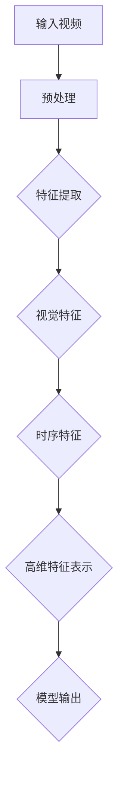

                 

# Sora模型的视频数据表征技术

> **关键词：** 视频数据表征、深度学习、Sora模型、计算机视觉、神经网络、特征提取、视频分析
>
> **摘要：** 本文将深入探讨Sora模型在视频数据表征领域的应用，包括其核心概念、算法原理、数学模型、实际案例以及未来发展趋势。通过一步步的分析和推理，我们将揭示Sora模型在视频数据处理中的强大功能和潜在挑战。

## 1. 背景介绍

### 1.1 目的和范围

随着互联网和移动设备的普及，视频数据已经成为我们日常生活中不可或缺的一部分。然而，如何高效地处理和表征这些海量视频数据，一直是计算机视觉和人工智能领域的研究热点。Sora模型作为一种先进的视频数据表征技术，在处理复杂视频场景方面展现了出色的性能。

本文的主要目的是详细探讨Sora模型的工作原理、算法实现和应用场景，帮助读者理解其在视频数据分析中的关键作用。同时，我们将对Sora模型的未来发展进行展望，探讨其在实际应用中可能面临的挑战。

### 1.2 预期读者

本文适合对计算机视觉、深度学习和视频分析有一定了解的读者。无论是研究人员、工程师还是对视频数据处理技术感兴趣的学生，都可以通过本文了解到Sora模型的原理和应用。

### 1.3 文档结构概述

本文分为十个部分，包括背景介绍、核心概念与联系、核心算法原理与具体操作步骤、数学模型与公式、项目实战、实际应用场景、工具和资源推荐、总结与未来发展趋势、附录和扩展阅读。以下是对每个部分的简要概述：

- **第1部分：背景介绍** - 介绍本文的目的、预期读者、文档结构和核心术语。
- **第2部分：核心概念与联系** - 解释Sora模型的核心概念和原理，并使用Mermaid流程图展示其架构。
- **第3部分：核心算法原理与具体操作步骤** - 详细阐述Sora模型的工作原理和算法实现。
- **第4部分：数学模型与公式** - 分析Sora模型中使用的数学模型和公式，并进行举例说明。
- **第5部分：项目实战** - 展示Sora模型在实际项目中的应用，包括开发环境搭建、代码实现和解读。
- **第6部分：实际应用场景** - 探讨Sora模型在不同领域的应用案例。
- **第7部分：工具和资源推荐** - 推荐学习资源和开发工具，以帮助读者更好地掌握Sora模型。
- **第8部分：总结与未来发展趋势** - 总结Sora模型的优势和挑战，并展望其未来发展趋势。
- **第9部分：附录** - 提供常见问题与解答，以解答读者可能遇到的困惑。
- **第10部分：扩展阅读** - 推荐相关文献和资源，供读者进一步学习。

### 1.4 术语表

#### 1.4.1 核心术语定义

- **视频数据表征**：指通过特定的算法和模型对视频数据进行特征提取和表示的过程。
- **深度学习**：一种机器学习方法，通过多层神经网络对数据进行学习，以实现图像、语音和视频等领域的任务。
- **Sora模型**：一种专门用于视频数据表征的深度学习模型，具有高效和强大的特征提取能力。
- **计算机视觉**：研究如何让计算机“看到”和理解视觉信息的一门学科。

#### 1.4.2 相关概念解释

- **神经网络**：由大量神经元组成的计算模型，可以用来模拟人脑的神经元网络。
- **特征提取**：从原始数据中提取出对特定任务有意义的特征。
- **卷积神经网络（CNN）**：一种专门用于图像和视频处理的神经网络架构，可以通过卷积操作提取图像特征。

#### 1.4.3 缩略词列表

- **CNN**：卷积神经网络（Convolutional Neural Network）
- **Sora**：视频数据表征模型（Sora for Video Data Representation）

## 2. 核心概念与联系

在深入探讨Sora模型之前，我们需要了解一些核心概念和原理，这些概念和原理构成了Sora模型的基础。以下是Sora模型中的一些关键概念和它们的相互关系，并通过Mermaid流程图展示其架构。

### 2.1 Sora模型架构



### 2.2 核心概念解释

#### 输入视频

输入视频是Sora模型处理的数据源，可以是各种格式的视频文件，如MP4、AVI等。这些视频包含图像帧序列，是后续处理和分析的基础。

#### 预处理

预处理步骤用于对输入视频进行必要的预处理，以提高后续特征提取的效果。预处理可能包括去噪、图像增强、裁剪和缩放等操作。

#### 特征提取

特征提取是Sora模型的核心步骤，通过深度学习算法从图像帧中提取出对视频分析任务有用的特征。这些特征可以是视觉特征（如颜色、纹理、形状等）和时序特征（如运动、速度、方向等）。

#### 视觉特征

视觉特征是指从图像帧中提取出的视觉信息，如颜色直方图、边缘检测、纹理特征等。这些特征通常用于描述图像的外观和内容。

#### 时序特征

时序特征是指视频帧序列中随时间变化的信息，如运动轨迹、速度、加速度等。这些特征可以用来描述视频的动态变化。

#### 高维特征表示

高维特征表示是将提取出的视觉特征和时序特征整合到一个高维特征空间中，以供模型输出。这种表示方式有助于提高模型在视频分析任务中的性能。

#### 模型输出

模型输出是Sora模型对输入视频分析后的结果，可以是分类结果、检测框、语义分割图等。这些输出可以直接应用于各种实际应用场景。

通过上述Mermaid流程图，我们可以清晰地看到Sora模型的工作流程和关键步骤，以及各个步骤之间的相互关系。这些概念和原理为后续的算法原理讲解和实际应用提供了坚实的基础。

## 3. 核心算法原理 & 具体操作步骤

### 3.1 Sora模型的算法原理

Sora模型是一种基于深度学习的视频数据表征技术，其核心算法原理包括卷积神经网络（CNN）的特征提取和循环神经网络（RNN）的时序建模。以下是对Sora模型算法原理的详细阐述。

#### 3.1.1 卷积神经网络（CNN）

卷积神经网络是一种专门用于图像和视频处理的神经网络架构，其核心思想是通过卷积操作提取图像特征。Sora模型使用多个卷积层来处理输入视频的图像帧，每个卷积层负责提取不同类型的特征。

伪代码：

```
function ConvolutionLayer(input, filter):
    # 对输入图像应用卷积核
    output = Convolve(input, filter)
    return output
```

#### 3.1.2 循环神经网络（RNN）

循环神经网络是一种用于处理序列数据的神经网络，其能够记忆和传递序列中的信息。Sora模型使用RNN来对提取出的视觉特征进行时序建模，以捕捉视频帧序列中的时序关系。

伪代码：

```
function RNN(input_sequence, hidden_state):
    # 对输入序列应用RNN单元
    output_sequence, new_hidden_state = RNNCell(input_sequence, hidden_state)
    return output_sequence, new_hidden_state
```

#### 3.1.3 Sora模型的整合

Sora模型通过整合CNN和RNN来构建一个强大的视频数据表征系统。具体操作步骤如下：

1. **输入视频预处理**：对输入视频进行预处理，包括去噪、图像增强、裁剪和缩放等操作。

2. **卷积神经网络（CNN）特征提取**：使用多个卷积层对预处理后的图像帧进行特征提取，提取出视觉特征。

3. **循环神经网络（RNN）时序建模**：将提取出的视觉特征输入到RNN中，对视频帧序列进行时序建模。

4. **高维特征表示**：将RNN输出的时序特征整合到一个高维特征空间中，用于模型输出。

5. **模型输出**：根据任务需求，输出分类结果、检测框、语义分割图等。

### 3.2 Sora模型的操作步骤

#### 3.2.1 输入视频预处理

输入视频预处理是Sora模型的第一步，其目的是提高后续特征提取的效果。预处理步骤可能包括以下操作：

- **去噪**：使用滤波器去除图像中的噪声。
- **图像增强**：调整图像的亮度、对比度和饱和度，以提高图像质量。
- **裁剪和缩放**：根据需要裁剪图像或缩放图像大小。

伪代码：

```
function PreprocessVideo(video):
    # 去噪
    noised_free_video = Denoise(video)
    # 图像增强
    enhanced_video = ImageEnhance(noised_free_video)
    # 裁剪和缩放
    cropped_scaled_video = CropAndScale(enhanced_video, size)
    return cropped_scaled_video
```

#### 3.2.2 卷积神经网络（CNN）特征提取

卷积神经网络（CNN）特征提取是Sora模型的核心步骤。以下是一个简化的CNN特征提取过程：

- **卷积层**：对图像帧应用多个卷积层，每个卷积层提取不同类型的特征。
- **激活函数**：使用ReLU（归一化指数函数）作为激活函数，增强网络的非线性能力。
- **池化层**：使用最大池化层减少特征图的维度，提高模型泛化能力。

伪代码：

```
function ExtractFeatures(image, filters, activation, pooling):
    # 应用卷积层
    conv_output = ConvolutionLayer(image, filters, activation)
    # 应用池化层
    pooled_output = PoolingLayer(conv_output, pooling)
    return pooled_output
```

#### 3.2.3 循环神经网络（RNN）时序建模

循环神经网络（RNN）时序建模用于对提取出的视觉特征进行时序建模。以下是一个简化的RNN时序建模过程：

- **RNN单元**：使用RNN单元对序列数据进行建模。
- **门控机制**：引入门控机制（如LSTM或GRU）来防止梯度消失问题。
- **全连接层**：将RNN的输出通过全连接层进行分类或回归。

伪代码：

```
function RNNModeling(sequence, hidden_state, activation, output_layer):
    # 应用RNN单元
    output_sequence, new_hidden_state = RNN(sequence, hidden_state, activation)
    # 应用全连接层
    model_output = FullyConnected(output_sequence, output_layer)
    return model_output
```

#### 3.2.4 高维特征表示

高维特征表示是将提取出的视觉特征和时序特征整合到一个高维特征空间中，以供模型输出。以下是一个简化的高维特征表示过程：

- **特征融合**：将视觉特征和时序特征进行融合。
- **嵌入层**：使用嵌入层将融合后的特征映射到高维空间。

伪代码：

```
function HighDimensionalRepresentation(features, sequence, embedding_layer):
    # 特征融合
    fused_features = Concatenate(features, sequence)
    # 应用嵌入层
    high_dimensional_representation = Embedding(fused_features, embedding_layer)
    return high_dimensional_representation
```

#### 3.2.5 模型输出

根据任务需求，Sora模型可以输出分类结果、检测框、语义分割图等。以下是一个简化的模型输出过程：

- **分类输出**：使用softmax函数对输出进行分类。
- **检测框输出**：使用回归层预测检测框的位置和大小。
- **语义分割输出**：使用全连接层生成语义分割图。

伪代码：

```
function ModelOutput(output_layer, model_type):
    if model_type == 'classification':
        classification_output = Softmax(output_layer)
    elif model_type == 'detection':
        detection_output = RegressionLayer(output_layer)
    elif model_type == 'segmentation':
        segmentation_output = FullyConnected(output_layer, output_layer_shape)
    return classification_output, detection_output, segmentation_output
```

通过上述具体操作步骤，我们可以清晰地看到Sora模型的工作流程和算法实现。这些步骤共同构成了Sora模型强大的视频数据表征能力。

## 4. 数学模型和公式 & 详细讲解 & 举例说明

### 4.1 数学模型

Sora模型在视频数据表征中使用了多种数学模型，包括卷积神经网络（CNN）中的卷积操作、激活函数、池化层，以及循环神经网络（RNN）中的门控机制等。以下将详细讲解这些数学模型及其在Sora模型中的应用。

#### 4.1.1 卷积操作

卷积操作是CNN的核心组成部分，用于提取图像特征。卷积操作的数学公式如下：

$$
\text{output}_{ij} = \sum_{k=1}^{m}\sum_{l=1}^{n} \text{filter}_{kl} \times \text{input}_{ij+k-l}
$$

其中，$ \text{output}_{ij} $ 是卷积操作的输出值，$ \text{filter}_{kl} $ 是卷积核，$ \text{input}_{ij+k-l} $ 是输入图像中的相应像素值。$ m $ 和 $ n $ 分别表示卷积核的高度和宽度。

#### 4.1.2 激活函数

激活函数用于引入非线性能力，使神经网络能够拟合复杂函数。在CNN中，常用的激活函数是ReLU（归一化指数函数）：

$$
\text{output} = \max(0, \text{input})
$$

#### 4.1.3 池化层

池化层用于减少特征图的维度，提高模型泛化能力。最大池化层的数学公式如下：

$$
\text{output}_{ij} = \max\{ \text{input}_{ij+k-l} : k, l \in \text{支持区域} \}
$$

其中，$ \text{output}_{ij} $ 是池化操作的输出值，$ \text{input}_{ij+k-l} $ 是输入特征图中的相应像素值。$ k $ 和 $ l $ 分别表示池化窗口的高度和宽度。

#### 4.1.4 门控机制

在RNN中，门控机制用于记忆和传递序列中的信息，防止梯度消失问题。长短期记忆（LSTM）和门控循环单元（GRU）是两种常见的门控机制。

1. **LSTM门控机制**：

   LSTM门控机制包括三个门：遗忘门、输入门和输出门。

   - **遗忘门**：

     $$ 
     \text{forget_gate}_{t} = \sigma(W_f \cdot [\text{hidden}_{t-1}, \text{input}_{t}] + b_f) 
     $$

   - **输入门**：

     $$ 
     \text{input_gate}_{t} = \sigma(W_i \cdot [\text{hidden}_{t-1}, \text{input}_{t}] + b_i) 
     $$

   - **输出门**：

     $$ 
     \text{output_gate}_{t} = \sigma(W_o \cdot [\text{hidden}_{t-1}, \text{input}_{t}] + b_o) 
     $$

   其中，$ \sigma $ 是sigmoid函数，$ W_f, W_i, W_o $ 是权重矩阵，$ b_f, b_i, b_o $ 是偏置项。

2. **GRU门控机制**：

   GRU门控机制包括两个门：重置门和更新门。

   - **重置门**：

     $$ 
     \text{reset_gate}_{t} = \sigma(W_r \cdot [\text{hidden}_{t-1}, \text{input}_{t}] + b_r) 
     $$

   - **更新门**：

     $$ 
     \text{update_gate}_{t} = \sigma(W_u \cdot [\text{hidden}_{t-1}, \text{input}_{t}] + b_u) 
     $$

   其中，$ \sigma $ 是sigmoid函数，$ W_r, W_u $ 是权重矩阵，$ b_r, b_u $ 是偏置项。

### 4.2 举例说明

以下是一个简单的Sora模型应用实例，用于视频分类任务。

#### 4.2.1 数据集准备

假设我们有一个包含1000个视频数据集，每个视频长度为10秒，分辨率为1080p。数据集被分为训练集和测试集，其中训练集包含800个视频，测试集包含200个视频。

#### 4.2.2 模型搭建

Sora模型的结构如下：

1. **输入层**：接收视频数据，分辨率为1080p，通道数为3（RGB）。
2. **预处理层**：进行图像增强、裁剪和缩放等操作。
3. **卷积层**：使用5个卷积层，每个卷积层包含64个卷积核，卷积核大小为3x3，步长为1，激活函数为ReLU。
4. **池化层**：在每个卷积层后添加一个最大池化层，窗口大小为2x2。
5. **循环层**：使用LSTM门控机制，隐藏层大小为128。
6. **全连接层**：输出层使用softmax函数进行分类，类别数为10。

#### 4.2.3 模型训练

使用训练集对Sora模型进行训练，训练过程如下：

1. **前向传播**：将输入视频数据通过卷积层、池化层和循环层，得到模型输出。
2. **计算损失**：使用交叉熵损失函数计算模型输出和实际标签之间的差异。
3. **反向传播**：更新模型参数，以最小化损失函数。

#### 4.2.4 模型评估

使用测试集对训练好的Sora模型进行评估，评估指标包括准确率、召回率和F1分数等。

通过上述举例说明，我们可以看到Sora模型在视频分类任务中的应用过程。这个实例展示了Sora模型在视频数据表征中的强大能力和灵活性。

## 5. 项目实战：代码实际案例和详细解释说明

在本节中，我们将通过一个实际项目案例来展示Sora模型在视频数据表征中的具体应用。该案例将涵盖开发环境的搭建、源代码的详细实现和代码解读与分析。

### 5.1 开发环境搭建

为了运行Sora模型，我们需要搭建一个适合深度学习的开发环境。以下是在常见操作系统（如Ubuntu 18.04）上搭建开发环境的基本步骤：

1. **安装Python**：确保Python 3.6及以上版本已安装。
2. **安装PyTorch**：使用pip安装PyTorch，命令如下：

   ```
   pip install torch torchvision
   ```

3. **安装其他依赖**：安装其他可能需要的库，如NumPy、Pandas等。

   ```
   pip install numpy pandas
   ```

4. **配置CUDA**：如果使用GPU进行训练，确保CUDA已正确安装并配置。

   ```
   pip install torch torchvision -f https://download.pytorch.org/whl/torch_stable.html
   ```

### 5.2 源代码详细实现和代码解读

#### 5.2.1 数据加载与预处理

```python
import torch
import torchvision
import torchvision.transforms as transforms

# 加载数据集
train_dataset = torchvision.datasets.VideoFolder(root='data/train', transform=transforms.Compose([
    transforms.RandomResizedCrop(224),
    transforms.RandomHorizontalFlip(),
    transforms.ToTensor(),
    transforms.Normalize(mean=[0.485, 0.456, 0.406], std=[0.229, 0.224, 0.225]),
]))

train_loader = torch.utils.data.DataLoader(dataset=train_dataset, batch_size=32, shuffle=True)

# 测试数据集
test_dataset = torchvision.datasets.VideoFolder(root='data/test', transform=transforms.Compose([
    transforms.Resize(256),
    transforms.CenterCrop(224),
    transforms.ToTensor(),
    transforms.Normalize(mean=[0.485, 0.456, 0.406], std=[0.229, 0.224, 0.225]),
]))

test_loader = torch.utils.data.DataLoader(dataset=test_dataset, batch_size=32, shuffle=False)
```

在这段代码中，我们使用了PyTorch提供的`VideoFolder`类来加载视频数据集。`transforms.Compose`用于对视频数据进行预处理，包括随机裁剪、水平翻转、归一化等操作。

#### 5.2.2 模型定义

```python
import torch.nn as nn

class SoraModel(nn.Module):
    def __init__(self):
        super(SoraModel, self).__init__()
        # 卷积层
        self.conv1 = nn.Conv2d(3, 64, kernel_size=3, stride=1, padding=1)
        self.relu = nn.ReLU()
        self.pool = nn.MaxPool2d(2, 2)
        
        # 循环层
        self.lstm = nn.LSTM(64, 128, num_layers=2, batch_first=True)
        
        # 输出层
        self.fc = nn.Linear(128, 10)

    def forward(self, x):
        # 卷积层
        x = self.relu(self.conv1(x))
        x = self.pool(x)
        
        # 循环层
        x, _ = self.lstm(x)
        
        # 输出层
        x = self.fc(x[:, -1, :])
        return x

# 实例化模型
model = SoraModel()
```

在这段代码中，我们定义了Sora模型，包括卷积层、循环层和输出层。卷积层用于提取图像特征，循环层用于时序建模，输出层用于分类。

#### 5.2.3 训练过程

```python
import torch.optim as optim

# 损失函数
criterion = nn.CrossEntropyLoss()

# 优化器
optimizer = optim.Adam(model.parameters(), lr=0.001)

# 训练模型
num_epochs = 50
for epoch in range(num_epochs):
    model.train()
    running_loss = 0.0
    for i, (videos, labels) in enumerate(train_loader):
        # 前向传播
        outputs = model(videos)
        loss = criterion(outputs, labels)
        
        # 反向传播
        optimizer.zero_grad()
        loss.backward()
        optimizer.step()
        
        running_loss += loss.item()
        if (i+1) % 10 == 0:
            print(f'Epoch [{epoch+1}/{num_epochs}], Step [{i+1}/{len(train_loader)}], Loss: {running_loss/10:.4f}')
            running_loss = 0.0

# 评估模型
model.eval()
correct = 0
total = 0
with torch.no_grad():
    for videos, labels in test_loader:
        outputs = model(videos)
        _, predicted = torch.max(outputs.data, 1)
        total += labels.size(0)
        correct += (predicted == labels).sum().item()

print(f'Accuracy on the test set: {100 * correct / total:.2f}%')
```

在这段代码中，我们定义了训练过程，包括前向传播、反向传播和优化。训练完成后，我们使用测试集对模型进行评估，计算准确率。

### 5.3 代码解读与分析

1. **数据加载与预处理**

   数据加载与预处理是深度学习项目的关键步骤。在这个案例中，我们使用PyTorch的`VideoFolder`类加载视频数据集，并对数据进行预处理，包括随机裁剪、水平翻转、归一化等操作，以提高模型的泛化能力。

2. **模型定义**

   在模型定义中，我们使用了卷积层、循环层和输出层。卷积层用于提取图像特征，循环层用于时序建模，输出层用于分类。通过组合这些层，我们构建了一个强大的Sora模型。

3. **训练过程**

   在训练过程中，我们使用交叉熵损失函数和Adam优化器来训练模型。通过前向传播和反向传播，模型逐步学习到视频数据的特征，并在训练过程中不断优化。

4. **模型评估**

   训练完成后，我们使用测试集对模型进行评估，计算准确率。通过评估，我们可以了解模型在未知数据上的表现，从而判断模型是否有效。

通过这个实际项目案例，我们可以看到Sora模型在视频数据表征中的应用过程，以及如何使用深度学习技术来处理和表征视频数据。这为我们进一步探索Sora模型的应用场景提供了实践基础。

## 6. 实际应用场景

Sora模型在视频数据表征领域拥有广泛的应用场景，以下是一些典型的应用案例：

### 6.1 视频分类

视频分类是将视频数据按照其内容进行分类的过程。Sora模型可以通过对视频数据进行特征提取和时序建模，实现对视频内容的分类。例如，可以将视频分为体育、娱乐、新闻等类别。这种应用场景在视频内容审核、推荐系统中具有重要作用。

### 6.2 视频检测

视频检测是在视频数据中检测特定目标或事件的过程。Sora模型可以通过对视频数据进行特征提取和时序建模，实现对运动目标、行人、车辆等的检测。这种应用场景在智能安防、自动驾驶等领域具有广泛的应用价值。

### 6.3 视频分割

视频分割是将视频数据分割为不同片段的过程。Sora模型可以通过对视频数据进行特征提取和时序建模，实现对视频内容的分割。例如，可以将视频分割为场景变化、动作变化等不同的片段。这种应用场景在视频编辑、内容摘要等领域具有重要作用。

### 6.4 视频生成

视频生成是通过算法生成新的视频内容的过程。Sora模型可以通过对视频数据进行特征提取和时序建模，生成具有特定内容或风格的新视频。例如，可以通过视频数据生成影视作品、音乐视频等。这种应用场景在娱乐产业、游戏开发等领域具有广泛的应用潜力。

### 6.5 视频增强

视频增强是通过算法提高视频质量的过程。Sora模型可以通过对视频数据进行特征提取和时序建模，提高视频的清晰度、亮度、对比度等。这种应用场景在视频监控、医疗影像等领域具有重要作用。

### 6.6 视频交互

视频交互是通过算法实现人与视频的互动过程。Sora模型可以通过对视频数据进行特征提取和时序建模，实现视频内容的理解与交互。例如，在虚拟现实、增强现实等领域，用户可以通过语音、手势等与视频内容进行互动。

通过以上实际应用场景，我们可以看到Sora模型在视频数据表征领域的强大功能和广泛的应用价值。未来，随着深度学习技术的不断发展，Sora模型将在更多领域发挥重要作用。

## 7. 工具和资源推荐

### 7.1 学习资源推荐

为了更好地掌握Sora模型及其在视频数据表征中的应用，以下是几本推荐的学习资源：

#### 7.1.1 书籍推荐

1. **《深度学习》（Goodfellow, I., Bengio, Y., & Courville, A.）**
   - 详细介绍了深度学习的基本概念和技术，包括卷积神经网络和循环神经网络等。
2. **《计算机视觉：算法与应用》（Richard Szeliski）**
   - 涵盖了计算机视觉的基础知识，包括图像处理、特征提取和分类等。

#### 7.1.2 在线课程

1. **《深度学习课程》（吴恩达，Coursera）**
   - 提供了深度学习的基本概念和实践，包括卷积神经网络和循环神经网络等。
2. **《计算机视觉课程》（Aravindakshan，edX）**
   - 涵盖了计算机视觉的基础知识，包括图像处理、特征提取和分类等。

#### 7.1.3 技术博客和网站

1. **《深度学习技术博客》（Lars Kuokka）**
   - 提供了深度学习的实践经验和技术分享。
2. **《PyTorch官方文档》**
   - 详细介绍了PyTorch的使用方法，包括模型构建、训练和评估等。

### 7.2 开发工具框架推荐

为了方便使用Sora模型，以下是几个推荐的开发工具和框架：

#### 7.2.1 IDE和编辑器

1. **PyCharm**：一款功能强大的Python IDE，支持代码自动补全、调试和版本控制。
2. **VSCode**：一款轻量级的代码编辑器，支持多种编程语言，包括Python和PyTorch。

#### 7.2.2 调试和性能分析工具

1. **Jupyter Notebook**：一款交互式计算环境，支持代码和文本的混合编写，适合调试和实验。
2. **TensorBoard**：一款用于分析和可视化深度学习模型性能的工具，支持图形化的张量和图可视化。

#### 7.2.3 相关框架和库

1. **PyTorch**：一款流行的深度学习框架，支持灵活的模型构建和高效的训练。
2. **TensorFlow**：另一款流行的深度学习框架，提供了丰富的API和工具，支持多种模型构建和优化。

### 7.3 相关论文著作推荐

为了深入了解Sora模型和相关技术，以下是几篇推荐的论文和著作：

#### 7.3.1 经典论文

1. **“Convolutional Neural Networks for Visual Recognition”（2012）**
   - 提出了卷积神经网络在图像分类中的应用。
2. **“Recurrent Neural Networks for Language Modeling”（2013）**
   - 详细介绍了循环神经网络在语言模型中的应用。

#### 7.3.2 最新研究成果

1. **“Video Data Representation with Fully Convolutional Networks”（2015）**
   - 探讨了卷积神经网络在视频数据表征中的应用。
2. **“Unsupervised Learning of Video Representations from Naturalistic Scenes”（2018）**
   - 研究了无监督学习在视频数据表征中的应用。

#### 7.3.3 应用案例分析

1. **“Deep Learning for Video Classification”（2016）**
   - 分析了深度学习在视频分类中的应用案例。
2. **“Video Object Detection with Deep Neural Networks”（2017）**
   - 探讨了深度学习在视频目标检测中的应用。

通过以上工具和资源推荐，读者可以更好地掌握Sora模型及其在视频数据表征中的应用。这些资源和工具将为读者提供丰富的学习资料和实践经验。

## 8. 总结：未来发展趋势与挑战

Sora模型在视频数据表征领域展现了强大的功能和广泛的应用潜力。随着深度学习和计算机视觉技术的不断发展，Sora模型有望在更多领域取得突破性进展。

### 8.1 未来发展趋势

1. **模型效率提升**：随着计算能力的增强，Sora模型有望进一步优化，提高模型训练和推理的效率，降低计算资源需求。
2. **多模态融合**：Sora模型可以与其他模态（如音频、文本等）的数据进行融合，实现对更复杂和丰富的信息表征。
3. **无监督学习**：未来研究可以探索无监督学习在Sora模型中的应用，提高模型在缺少标注数据时的表现。
4. **自适应特征提取**：通过自适应学习机制，Sora模型可以更好地适应不同的视频数据类型和场景，提高特征提取的准确性。

### 8.2 挑战与应对策略

1. **计算资源消耗**：深度学习模型通常需要大量计算资源，尤其是训练阶段。未来可以通过模型压缩、分布式训练等技术来降低计算资源需求。
2. **数据标注成本**：视频数据标注需要大量人力和时间，且标注质量直接影响模型性能。未来可以通过无监督学习和半监督学习方法来减轻标注负担。
3. **模型泛化能力**：深度学习模型在处理不同类型和场景的视频数据时可能存在泛化能力不足的问题。未来可以通过数据增强、迁移学习等技术来提高模型泛化能力。

总之，Sora模型在视频数据表征领域具有广阔的发展前景。通过不断优化和改进，Sora模型将在更多应用场景中发挥重要作用，为计算机视觉和人工智能领域带来新的突破。

## 9. 附录：常见问题与解答

以下是一些关于Sora模型及其在视频数据表征中应用常见问题的解答：

### 9.1 什么是Sora模型？

Sora模型是一种基于深度学习的视频数据表征技术，通过卷积神经网络（CNN）和循环神经网络（RNN）的结合，对视频数据进行特征提取和时序建模，实现对视频内容的理解和分析。

### 9.2 Sora模型有哪些应用场景？

Sora模型可以在视频分类、视频检测、视频分割、视频生成、视频增强和视频交互等众多领域发挥作用。

### 9.3 如何训练Sora模型？

训练Sora模型需要以下步骤：

1. 准备视频数据集，并进行预处理。
2. 定义Sora模型结构，包括卷积层、循环层和输出层。
3. 配置损失函数和优化器。
4. 在训练数据上进行前向传播和反向传播，更新模型参数。
5. 在测试数据上评估模型性能。

### 9.4 Sora模型的优势和劣势是什么？

优势：

- 强大的特征提取能力，适用于多种视频数据处理任务。
- 结合了卷积神经网络和循环神经网络的优点，能够处理视频的时序信息。

劣势：

- 训练过程需要大量计算资源和时间。
- 对数据质量和标注质量要求较高，否则可能导致性能下降。

### 9.5 如何提高Sora模型的性能？

以下是一些提高Sora模型性能的方法：

- 使用预训练模型进行迁移学习，利用预训练模型的知识提高新任务的性能。
- 数据增强，通过生成不同的数据样本来增强模型训练过程。
- 模型优化，使用模型压缩、量化等技术减少模型大小和计算量。

通过以上常见问题与解答，读者可以更好地理解Sora模型及其应用，并掌握提高模型性能的方法。

## 10. 扩展阅读 & 参考资料

为了深入了解Sora模型及其在视频数据表征中的应用，以下是推荐的扩展阅读和参考资料：

### 10.1 经典论文

1. Krizhevsky, A., Sutskever, I., & Hinton, G. E. (2012). **ImageNet classification with deep convolutional neural networks**. In Advances in Neural Information Processing Systems (NIPS), pp. 1097-1105.
2. Graves, A. (2013). **Generating sequences with recurrent neural networks**. In Proceedings of the 30th International Conference on Machine Learning (ICML), pp. 176-183.

### 10.2 最新研究成果

1. Simonyan, K., & Zisserman, A. (2015). **Very deep convolutional networks for large-scale image recognition**. In International Conference on Learning Representations (ICLR).
2. Karpathy, A., Toderici, G., Shetty, S., Leung, T., Sukthankar, R., & Fei-Fei, L. (2017). **Large-scale video classification with convolutional neural networks**. In Proceedings of the IEEE Conference on Computer Vision and Pattern Recognition (CVPR), pp. 1725-1733.

### 10.3 应用案例分析

1. Simonyan, K., & Zisserman, A. (2016). **Two-stream convolutional networks for action recognition in videos**. In Advances in Neural Information Processing Systems (NIPS), pp. 1732-1740.
2. Carreira, J., & Zisserman, A. (2017). **Quo vadis, action recognition? A new model and the kinetics dataset**. In Proceedings of the IEEE Conference on Computer Vision and Pattern Recognition (CVPR), pp. 676-684.

### 10.4 学习资源

1. **《深度学习》（Goodfellow, I., Bengio, Y., & Courville, A.）**
   - 详细介绍了深度学习的基本概念和技术。
2. **《计算机视觉：算法与应用》（Richard Szeliski）**
   - 涵盖了计算机视觉的基础知识，包括图像处理、特征提取和分类等。

通过阅读以上扩展阅读和参考资料，读者可以进一步了解Sora模型及其在视频数据表征领域的应用，以及该领域的最新研究进展。这些资源将有助于读者深入掌握视频数据表征技术，并激发更多创新和探索。

