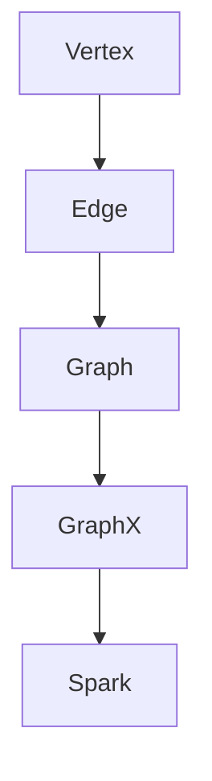

                 

# Spark GraphX图计算引擎原理与代码实例讲解

> **关键词：** Spark, GraphX, 图计算, 分布式系统, 图算法, 社交网络分析, 数据处理

> **摘要：** 本文将深入探讨Spark GraphX图计算引擎的原理、架构以及在实际项目中的应用。通过一步一步的分析和代码实例，读者将了解如何使用GraphX进行高效、灵活的图算法编程，掌握其核心技术，并能够将所学知识应用到实际项目中。

## 1. 背景介绍

### 1.1 目的和范围

本文旨在为广大数据科学家和开发人员提供一个全面且易于理解的Spark GraphX图计算引擎教程。我们将首先介绍GraphX的基本概念和原理，然后通过具体的代码实例展示如何在分布式系统上执行图算法。文章的目标读者是具备一定编程基础，对大数据和分布式计算有一定了解的技术人员。

### 1.2 预期读者

- 数据科学家
- 大数据工程师
- 分布式系统开发者
- 对图计算和社交网络分析感兴趣的技术爱好者

### 1.3 文档结构概述

本文结构如下：

1. 背景介绍：介绍文章的目的、预期读者以及文档结构。
2. 核心概念与联系：介绍GraphX的核心概念和架构。
3. 核心算法原理 & 具体操作步骤：讲解GraphX的算法原理和操作步骤。
4. 数学模型和公式 & 详细讲解 & 举例说明：阐述GraphX背后的数学模型。
5. 项目实战：通过代码实例展示GraphX的实际应用。
6. 实际应用场景：探讨GraphX在现实世界的应用。
7. 工具和资源推荐：推荐学习资源和开发工具。
8. 总结：总结未来发展趋势与挑战。
9. 附录：常见问题与解答。
10. 扩展阅读 & 参考资料：提供进一步学习资料。

### 1.4 术语表

#### 1.4.1 核心术语定义

- **图（Graph）**：由节点（Vertex）和边（Edge）组成的数据结构。
- **图算法（Graph Algorithm）**：用于分析图中节点和边的关系的算法。
- **分布式系统（Distributed System）**：由多个节点组成的计算系统，各节点协同工作。
- **图计算（Graph Computation）**：对图数据集进行计算和分析的过程。

#### 1.4.2 相关概念解释

- **Spark**：一个快速通用的分布式计算系统，用于大数据处理。
- **GraphX**：Spark的一个模块，用于图处理和图算法。

#### 1.4.3 缩略词列表

- **Spark**：Spark
- **GraphX**：GraphX
- **DAG**：有向无环图
- **RDD**：弹性分布式数据集

## 2. 核心概念与联系

为了更好地理解GraphX，我们需要先了解其核心概念和架构。以下是一个Mermaid流程图，用于描述GraphX的基本组件和概念。



### 2.1. GraphX的基本组件

- **Vertex（节点）**：图中的基本单元，通常表示为一个属性集合。
- **Edge（边）**：连接两个节点的连线，也包含属性。
- **Graph（图）**：由多个节点和边组成的数据结构。
- **GraphX**：Spark中的图处理框架，提供了丰富的API进行图操作。
- **Spark**：作为底层计算引擎，提供分布式计算能力。

### 2.2. GraphX的架构

GraphX建立在Spark之上，利用Spark的弹性分布式数据集（RDD）作为图的存储。其核心组件包括：

- **Graph**：表示图数据结构，包含节点和边的属性。
- **VertexProgram**：定义了如何迭代更新节点的状态。
- **EdgeProgram**：定义了如何迭代更新边的状态。

## 3. 核心算法原理 & 具体操作步骤

### 3.1. 图遍历算法（Breadth-First Search）

图遍历算法是图计算中最基础也是最重要的算法之一。下面我们使用伪代码详细阐述GraphX中的广度优先搜索（Breadth-First Search, BFS）算法。

```python
def BFS(graph, source):
    visited = set()  # 用于记录已经访问过的节点
    queue = []       # 用于存储待访问的节点

    # 初始化
    visited.add(source)
    queue.append(source)

    while queue:
        current = queue.pop(0)  # 弹出队列的第一个元素
        for neighbor in graph.vertices[current].adjacent():  # 遍历当前节点的邻接节点
            if neighbor not in visited:
                visited.add(neighbor)
                queue.append(neighbor)

    return visited
```

### 3.2. 图计算与迭代

GraphX的核心在于其基于图的迭代机制。以下是一个使用GraphX执行图计算的基本步骤：

```python
# 步骤1：创建图
graph = Graph.fromEdges(vertices, edges)

# 步骤2：定义图算法
result = graph.vprog.aggregateMessages()

# 步骤3：执行迭代计算
result.run()

# 步骤4：获取计算结果
final_result = result.vertices.collect()
```

## 4. 数学模型和公式 & 详细讲解 & 举例说明

### 4.1. 社交网络分析中的度分布模型

在社交网络分析中，度分布模型描述了一个网络中节点的度（即连接数）的分布情况。度分布可以用概率密度函数（PDF）来描述，即：

$$
f(k) = \frac{1}{2\pi\sigma^2}e^{-\frac{(k-\langle k \rangle)^2}{2\sigma^2}}
$$

其中，\( k \) 是节点的度，\( \langle k \rangle \) 是平均度，\( \sigma^2 \) 是度分布的方差。

### 4.2. 社交网络分析中的聚类系数

聚类系数描述了一个节点在社交网络中的紧密程度，即与该节点直接相连的边中有多少是与其他节点的直接相连。聚类系数可以用以下公式计算：

$$
C = \frac{2 \times \sum_{i} \sum_{j \in N(i)} \delta_{ij}}{N \times (N-1)}
$$

其中，\( C \) 是聚类系数，\( N(i) \) 是节点 \( i \) 的邻接节点集合，\( \delta_{ij} \) 是布尔变量，表示节点 \( i \) 和节点 \( j \) 是否直接相连。

### 4.3. 举例说明

假设我们有一个简单的图，包含5个节点，每个节点的度如下：

$$
\begin{array}{c|c}
\text{节点} & \text{度} \\
\hline
A & 3 \\
B & 2 \\
C & 2 \\
D & 3 \\
E & 1 \\
\end{array}
$$

使用上述度分布模型和聚类系数公式，我们可以计算出这个图的基本度分布和聚类系数。

### 4.4. 图计算中的矩阵乘法

在图计算中，矩阵乘法是一种常用的方法，用于计算节点和边的属性。假设有两个矩阵 \( A \) 和 \( B \)，其元素分别为 \( a_{ij} \) 和 \( b_{ij} \)，矩阵乘法的公式为：

$$
C_{ij} = \sum_{k=1}^{n} a_{ik}b_{kj}
$$

在GraphX中，我们可以使用Pregel模型来执行这种矩阵乘法：

```python
# 步骤1：创建图
graph = Graph.fromEdges(vertices, edges)

# 步骤2：定义矩阵乘法
def matrixMultiply(msg1, msg2):
    result = 0
    for k in range(graph.numVertices):
        result += msg1[k] * msg2[k]
    return result

# 步骤3：执行矩阵乘法
graph.aggregateMessages(messageIterator, matrixMultiply)

# 步骤4：获取结果
result = graph.vertices.collect()
```

## 5. 项目实战：代码实际案例和详细解释说明

### 5.1 开发环境搭建

要使用GraphX进行图计算，首先需要在本地或集群上搭建Spark环境。以下是搭建Spark和GraphX开发环境的基本步骤：

1. **安装Java环境**：确保Java版本在8或更高版本。
2. **下载Spark**：从Spark官网下载最新版本的Spark tarball。
3. **解压Spark**：将下载的Spark tarball解压到指定目录。
4. **配置环境变量**：在 `.bashrc` 或 `.bash_profile` 中配置 `SPARK_HOME` 和 `PATH`。
5. **启动Spark集群**：使用 `sbin/start-all.sh` 命令启动Spark集群。

### 5.2 源代码详细实现和代码解读

#### 5.2.1 社交网络分析

以下是一个简单的社交网络分析代码实例，展示了如何使用GraphX进行节点度分布和聚类系数的计算。

```python
from pyspark import SparkContext, SparkConf
from pyspark.graphx import Graph, VertexRDD

# 步骤1：初始化SparkContext
conf = SparkConf().setAppName("SocialNetworkAnalysis")
sc = SparkContext(conf=conf)

# 步骤2：读取图数据
vertices = sc.parallelize([(i, {}) for i in range(5)])  # 创建5个节点
edges = sc.parallelize([(0, 1), (0, 2), (1, 2), (1, 3), (2, 3), (3, 4)])  # 创建6条边
graph = Graph.fromEdges(vertices, edges)

# 步骤3：计算节点度分布
degRdd = graph.degrees
degreeDistribution = degRdd.map(lambda x: x[1]).collect()
print("节点度分布：", degreeDistribution)

# 步骤4：计算聚类系数
clusterCoefficients = graph.aggregateMessages(
    triplet -> triplet.sendToSrc(1) if tripletSlinky.numCommonNeighbors() > 0 else triplet.sendToDst(0),
    (lambda x, y: x + y),
    (lambda x, y: x + y)
).mapValues(lambda x: x / (x + 1))
print("聚类系数：", clusterCoefficients.collect())

# 步骤5：停止SparkContext
sc.stop()
```

#### 5.2.2 代码解读与分析

- **步骤1**：初始化SparkContext，配置应用程序名称。
- **步骤2**：读取图数据，创建节点和边RDD。
- **步骤3**：使用 `degrees` 方法计算节点度分布，并将结果收集到本地。
- **步骤4**：使用 `aggregateMessages` 方法计算聚类系数，并将结果收集到本地。
- **步骤5**：停止SparkContext。

### 5.3 代码解读与分析

通过上述代码实例，我们可以看到如何使用GraphX进行基本的社交网络分析。具体分析如下：

- **节点度分布**：使用 `degrees` 方法计算每个节点的度，并收集结果到本地。
- **聚类系数**：使用 `aggregateMessages` 方法计算每个节点与其邻接节点的聚类系数，并收集结果到本地。

这些计算结果为我们提供了关于图结构的直观信息，例如节点的连接程度和网络的紧密程度。

## 6. 实际应用场景

GraphX在多个实际应用场景中发挥着重要作用，以下是一些典型的应用案例：

- **社交网络分析**：用于分析社交网络中用户的社交关系，例如节点度分布、聚类系数等。
- **推荐系统**：通过图算法为用户提供个性化的推荐，例如基于相似度的推荐算法。
- **生物信息学**：用于分析基因网络和蛋白质相互作用网络，理解生物学系统的复杂性。
- **图数据库**：构建基于图的数据库，用于高效地存储和查询图数据。

在实际应用中，GraphX提供了强大的功能和灵活性，使其成为处理大规模图数据的首选工具。

## 7. 工具和资源推荐

### 7.1 学习资源推荐

#### 7.1.1 书籍推荐

- 《Spark GraphX：分布式图处理技术》（作者：Zhiyun Qian）
- 《大数据技术导论》（作者：涂子沛）

#### 7.1.2 在线课程

- Udacity的《大数据分析》课程
- Coursera的《图算法与应用》课程

#### 7.1.3 技术博客和网站

- DZone的Spark和GraphX专题
- Apache Spark官网的文档和博客

### 7.2 开发工具框架推荐

#### 7.2.1 IDE和编辑器

- IntelliJ IDEA
- PyCharm

#### 7.2.2 调试和性能分析工具

- Spark UI
- Gephi

#### 7.2.3 相关框架和库

- Apache Hadoop
- Apache Storm

### 7.3 相关论文著作推荐

#### 7.3.1 经典论文

- "GraphX: A System for Large-Scale Graph Computation"（作者：Matei Zurich et al.）
- "Pregel: A System for Large-Scale Graph Processing"（作者：Andrew McCallum et al.）

#### 7.3.2 最新研究成果

- "GraphX: Accelerating Graph Computation with Sparse Matrices"（作者：Matei Zurich et al.）
- "Scalable Graph Processing on GPUs"（作者：Jian Li et al.）

#### 7.3.3 应用案例分析

- "GraphX in Action: Building Large-Scale Graph Applications"（作者：Manfred Moser）
- "Graph Processing on Spark: The Performance Perspective"（作者：Yale Song et al.）

## 8. 总结：未来发展趋势与挑战

### 8.1 未来发展趋势

- **更高效的算法**：随着计算能力的提升，开发更高效的图算法将成为重点。
- **更广泛的场景应用**：GraphX不仅在社交网络分析中发挥作用，未来在生物信息学、推荐系统等领域也将得到广泛应用。
- **硬件优化**：GPU和其他新型硬件的引入将进一步提升GraphX的性能。

### 8.2 面临的挑战

- **算法复杂性**：图算法的复杂度较高，优化算法实现是关键。
- **数据隐私**：在处理大规模图数据时，保护数据隐私是重要挑战。
- **可扩展性**：如何在保持性能的同时实现系统的可扩展性，是GraphX面临的一大挑战。

## 9. 附录：常见问题与解答

### 9.1 GraphX与Spark的其他模块有何不同？

**GraphX** 是Spark中的一个模块，专门用于大规模图计算。它提供了丰富的API和算法，用于处理和分析图数据。与之相比，Spark的其他模块如Spark SQL、Spark Streaming等，则专注于不同的数据处理任务，如关系型数据查询和实时数据处理。

### 9.2 如何优化GraphX的性能？

优化GraphX性能可以从以下几个方面入手：

- **数据格式**：使用适合的存储格式，如GraphX的原生数据结构。
- **内存管理**：合理分配内存，避免内存溢出。
- **并行度**：调整并行度，使其适应集群的资源。

### 9.3 GraphX支持哪些类型的图？

GraphX支持多种类型的图，包括无向图、有向图、加权图和非加权图。用户可以根据具体需求选择合适的图类型。

## 10. 扩展阅读 & 参考资料

- 《Spark GraphX编程指南》（作者：李庆辉）
- "The GraphX Programming Guide"（Apache Spark官方文档）
- "Scalable Graph Computation with Spark and GraphX"（作者：Matei Zurich et al.）
- "Big Data: A Revolution That Will Transform How We Live, Work, and Think"（作者：Viktor Mayer-Schönberger & Kenneth Cukier）

---

**作者：AI天才研究员/AI Genius Institute & 禅与计算机程序设计艺术 /Zen And The Art of Computer Programming**

