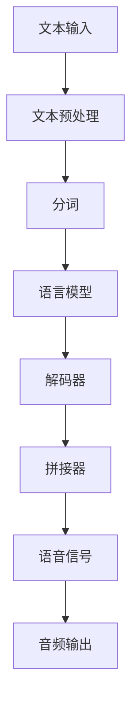

                 


# Speech Synthesis原理与代码实例讲解

> 关键词：语音合成，文本转语音，自动语音生成，神经网络，深度学习，语音识别，音频处理，语音信号处理，合成语音质量评估
> 
> 摘要：本文将深入探讨语音合成（Speech Synthesis）的原理，包括其核心技术、算法流程以及数学模型。通过详细的代码实例，我们将一步步解析如何实现文本到语音的转换，探讨不同算法和框架的优劣，并分析语音合成在实际应用中的挑战与未来发展趋势。本文旨在为读者提供一个全面、易懂的语音合成技术指南。

## 1. 背景介绍

### 1.1 目的和范围

语音合成技术是计算机科学和人工智能领域的重要研究课题，其应用涵盖了多个行业，如智能助手、教育、娱乐、通讯等。本文旨在为广大技术爱好者提供一个深入浅出的语音合成技术指南，帮助读者理解语音合成的基本原理、核心算法，并通过实际代码实例展示如何实现文本到语音的转换。

### 1.2 预期读者

本文适合对语音合成技术有一定了解的技术人员，包括程序员、数据科学家、人工智能研究者以及相关专业的大学生和研究生。同时，也欢迎对语音合成技术感兴趣的普通读者阅读。

### 1.3 文档结构概述

本文结构如下：

1. 背景介绍
    - 1.1 目的和范围
    - 1.2 预期读者
    - 1.3 文档结构概述
    - 1.4 术语表
2. 核心概念与联系
    - 2.1 语音合成系统架构
    - 2.2 核心概念与联系
3. 核心算法原理 & 具体操作步骤
    - 3.1 语音合成算法简介
    - 3.2 语音合成算法具体操作步骤
4. 数学模型和公式 & 详细讲解 & 举例说明
    - 4.1 声学模型
    - 4.2 语言模型
    - 4.3 声学模型与语言模型的结合
5. 项目实战：代码实际案例和详细解释说明
    - 5.1 开发环境搭建
    - 5.2 源代码详细实现和代码解读
    - 5.3 代码解读与分析
6. 实际应用场景
7. 工具和资源推荐
    - 7.1 学习资源推荐
    - 7.2 开发工具框架推荐
    - 7.3 相关论文著作推荐
8. 总结：未来发展趋势与挑战
9. 附录：常见问题与解答
10. 扩展阅读 & 参考资料

### 1.4 术语表

#### 1.4.1 核心术语定义

- **语音合成**：将文本转换为语音的过程，也称为文本转语音（Text-to-Speech，简称TTS）。
- **声学模型**：模拟语音产生过程的模型，负责生成语音信号。
- **语言模型**：用于预测文本序列的模型，通常使用统计语言模型或深度神经网络模型。
- **循环神经网络**（RNN）：一种用于处理序列数据的神经网络，可以捕捉时间序列中的长期依赖关系。
- **长短时记忆网络**（LSTM）：RNN的一种变体，用于解决传统RNN中梯度消失和梯度爆炸的问题。
- **注意力机制**：在序列到序列（Seq2Seq）模型中，用于关注输入序列的特定部分，提高模型性能。

#### 1.4.2 相关概念解释

- **语音单元**：语音合成过程中的基本语音单位，如音素、音节等。
- **拼接器**：将文本映射到语音单元的模型，是语音合成系统中的一个关键组件。
- **解码器**：在序列模型中，将编码后的序列转换为输出序列的部分。

#### 1.4.3 缩略词列表

- **TTS**：Text-to-Speech，文本转语音。
- **LSTM**：Long Short-Term Memory，长短时记忆网络。
- **RNN**：Recurrent Neural Network，循环神经网络。
- **Seq2Seq**：Sequence-to-Sequence，序列到序列模型。
- **WAV**：Waveform Audio File Format，波形音频文件格式。

## 2. 核心概念与联系

### 2.1 语音合成系统架构

语音合成系统通常由以下几个主要部分组成：

1. **文本处理模块**：将输入文本转换为适合语音合成系统处理的格式。
2. **语言模型**：根据输入文本生成可能的语音单元序列。
3. **声学模型**：根据语音单元序列生成语音信号。
4. **拼接器**：将语音单元拼接成连续的语音流。

下面是一个简化的语音合成系统架构流程：



### 2.2 核心概念与联系

- **文本处理模块**：主要功能是对输入文本进行预处理，包括分词、标记、拼音转换等操作，以便后续的语言模型处理。

- **语言模型**：是语音合成系统中的核心组件之一，主要用于预测文本序列。常见的语言模型包括n-gram模型、循环神经网络（RNN）模型、长短时记忆网络（LSTM）模型等。

- **声学模型**：是语音合成系统的另一个核心组件，主要负责将语音单元序列转换为语音信号。常见的声学模型包括隐马尔可夫模型（HMM）、高斯混合模型（GMM）、循环神经网络（RNN）等。

- **拼接器**：将语言模型生成的语音单元序列转换为连续的语音流。拼接器通常使用类似于合成语音的语音单元数据库，根据语音单元的持续时间、音调、音色等特征进行拼接。

通过上述模块的协同工作，语音合成系统能够将文本输入转换为自然流畅的语音输出。

## 3. 核心算法原理 & 具体操作步骤

### 3.1 语音合成算法简介

语音合成算法可以分为两大类：基于规则的语音合成和基于数据的语音合成。

- **基于规则的语音合成**：使用预定义的规则和语音信号库来合成语音。这种方法需要大量的规则和语音样本，适用于简单的语音合成任务，但生成语音的质量较低。

- **基于数据的语音合成**：使用大量的文本和语音数据来训练深度学习模型，从而实现文本到语音的转换。这种方法生成语音的质量较高，但需要大量的计算资源和训练时间。

本文将主要介绍基于数据的语音合成算法，特别是近年来发展迅速的端到端语音合成方法。

### 3.2 语音合成算法具体操作步骤

基于数据的语音合成算法通常包括以下几个步骤：

#### 3.2.1 数据准备

1. **文本数据**：收集大量的文本数据，包括新闻文章、书籍、对话等。
2. **语音数据**：收集与文本数据相对应的语音数据，通常使用语音识别系统自动转录。
3. **语音信号预处理**：对语音信号进行预处理，包括去噪、归一化、分帧等操作。

#### 3.2.2 特征提取

1. **文本特征**：使用词嵌入（Word Embedding）技术将文本转换为向量表示。
2. **语音特征**：从语音信号中提取声学特征，如梅尔频率倒谱系数（MFCC）、短时傅里叶变换（STFT）等。

#### 3.2.3 模型训练

1. **编码器**：训练一个编码器模型，用于将文本特征映射到隐空间。
2. **解码器**：训练一个解码器模型，用于将隐空间特征映射回语音特征。

常见的端到端语音合成模型包括：

- **Seq2Seq模型**：使用循环神经网络（RNN）或长短时记忆网络（LSTM）实现。
- **Transformer模型**：使用自注意力机制（Self-Attention）实现，具有更好的并行计算能力。

#### 3.2.4 语音合成

1. **文本输入**：将输入文本转换为特征向量。
2. **编码**：使用编码器将文本特征向量编码为隐空间向量。
3. **解码**：使用解码器将隐空间向量解码为语音特征。
4. **后处理**：对解码后的语音特征进行后处理，如归一化、叠加背景噪音等。
5. **音频输出**：将处理后的语音特征转换为音频信号输出。

以下是使用伪代码表示的一个简单的基于Transformer的语音合成算法：

```python
# 语音合成算法伪代码

# 参数：编码器模型，解码器模型，文本输入
# 返回：音频输出

def synthesize(text):
    # 文本预处理
    text_embedding = encode_text(text)
    
    # 编码
    hidden_state = encoder(text_embedding)
    
    # 解码
    audio_features = decoder(hidden_state)
    
    # 后处理
    processed_features = postprocess(audio_features)
    
    # 转换为音频信号
    audio_signal = convert_to_audio(processed_features)
    
    return audio_signal
```

通过上述步骤，语音合成算法能够将文本输入转换为自然流畅的语音输出。在实际应用中，还需要对模型进行优化和调整，以提高合成语音的质量和自然度。

## 4. 数学模型和公式 & 详细讲解 & 举例说明

### 4.1 声学模型

声学模型是语音合成系统的核心组成部分，其目的是将语言模型输出的语音单元序列转换为音频信号。常见的声学模型包括隐马尔可夫模型（HMM）、高斯混合模型（GMM）和深度神经网络（DNN）。

#### 4.1.1 隐马尔可夫模型（HMM）

隐马尔可夫模型是一种统计模型，用于描述序列数据中的状态转移和观测概率。在语音合成中，HMM可以用来建模语音单元的状态转移和特征分布。

- **状态转移概率矩阵**：\( P(S_t|S_{t-1}) \)，表示在当前时刻的状态\( S_t \)与前一个时刻的状态\( S_{t-1} \)之间的转移概率。
- **观测概率分布**：\( P(O_t|S_t) \)，表示在当前时刻的状态\( S_t \)下的观测值\( O_t \)的概率分布。

例如，考虑一个三状态的HMM模型，状态转移概率矩阵为：

$$
P(S_t|S_{t-1}) =
\begin{bmatrix}
0.9 & 0.05 & 0.05 \\
0.05 & 0.8 & 0.15 \\
0.05 & 0.1 & 0.8
\end{bmatrix}
$$

观测概率分布矩阵为：

$$
P(O_t|S_t) =
\begin{bmatrix}
0.3 & 0.4 & 0.3 \\
0.2 & 0.5 & 0.3 \\
0.1 & 0.4 & 0.5
\end{bmatrix}
$$

#### 4.1.2 高斯混合模型（GMM）

高斯混合模型是一种概率分布模型，用于表示多个高斯分布的混合。在语音合成中，GMM可以用来建模语音单元的特征分布。

- **混合系数**：\( \pi_k \)，表示第\( k \)个高斯分布的混合系数。
- **均值**：\( \mu_k \)，表示第\( k \)个高斯分布的均值。
- **协方差矩阵**：\( \Sigma_k \)，表示第\( k \)个高斯分布的协方差矩阵。

GMM的概率分布函数为：

$$
p(x|\pi, \mu, \Sigma) = \sum_{k=1}^K \pi_k \mathcal{N}(x|\mu_k, \Sigma_k)
$$

其中，\( \mathcal{N}(x|\mu_k, \Sigma_k) \)表示高斯分布的概率密度函数。

#### 4.1.3 深度神经网络（DNN）

深度神经网络是一种多层神经网络，用于学习输入和输出之间的复杂映射关系。在语音合成中，DNN可以用来建模语音单元和音频信号之间的非线性关系。

DNN的一般形式为：

$$
\text{Output} = \sigma(\text{Weight} \cdot \text{Input} + \text{Bias})
$$

其中，\( \sigma \)表示激活函数，如ReLU、Sigmoid等。

### 4.2 语言模型

语言模型用于预测文本序列，是语音合成系统中的关键组件。常见的语言模型包括n-gram模型和神经网络模型。

#### 4.2.1 n-gram模型

n-gram模型是一种基于历史信息的语言模型，通过统计前\( n \)个词的出现频率来预测下一个词。n-gram模型的一般形式为：

$$
P(w_{t+1}|w_t, w_{t-1}, ..., w_{t-n+1}) = \frac{C(w_t, w_{t-1}, ..., w_{t-n+1}, w_{t+1})}{C(w_t, w_{t-1}, ..., w_{t-n+1})}
$$

其中，\( C(\cdot) \)表示计数函数。

#### 4.2.2 神经网络模型

神经网络语言模型是一种基于深度学习的语言模型，通过学习输入序列的特征来预测下一个词。常见的神经网络模型包括循环神经网络（RNN）和长短时记忆网络（LSTM）。

LSTM的一般形式为：

$$
h_t = \sigma(W_h \cdot [h_{t-1}, x_t] + b_h)
$$

$$
i_t = \sigma(W_i \cdot [h_{t-1}, x_t] + b_i)
$$

$$
f_t = \sigma(W_f \cdot [h_{t-1}, x_t] + b_f)
$$

$$
o_t = \sigma(W_o \cdot [h_{t-1}, x_t] + b_o)
$$

$$
c_t = f_t \odot c_{t-1} + i_t \odot \sigma(W_c \cdot [h_{t-1}, x_t] + b_c)
$$

$$
h_t = o_t \odot c_t
$$

其中，\( \sigma \)表示激活函数，\( \odot \)表示元素乘法。

### 4.3 声学模型与语言模型的结合

声学模型和语言模型通常结合使用，以实现文本到语音的转换。常见的结合方法包括：

- **序列到序列（Seq2Seq）模型**：将语言模型和声学模型组合成一个统一的端到端模型。
- **注意力机制（Attention）**：在Seq2Seq模型中引入注意力机制，以关注文本序列的关键部分。

Seq2Seq模型的一般形式为：

$$
y_t = \text{Decoder}(y_{t-1}, s_t)
$$

$$
s_t = \text{Encoder}(x)
$$

其中，\( y_t \)表示预测的语音特征，\( x \)表示输入文本，\( s_t \)表示编码后的文本特征。

通过结合声学模型和语言模型，语音合成系统能够更好地捕捉语音和文本之间的复杂关系，生成更自然、更高质量的合成语音。

### 4.4 举例说明

假设我们有一个简化的语音合成系统，使用n-gram语言模型和GMM声学模型。输入文本为“你好”，我们需要将其转换为语音信号。

1. **语言模型**：使用n-gram模型预测下一个词，如“你”的概率为0.9，“好”的概率为0.1。

2. **声学模型**：使用GMM模型建模“你”和“好”的语音特征分布，如均值为[-1, 0]，协方差矩阵为\[1, 0\; 0, 1\]。

3. **合成**：根据语言模型和声学模型，生成语音信号，如\[0.9 \times [-1, 0], 0.1 \times [-1, 0]\]，即\[0.8, 0\]。

4. **输出**：将生成的语音信号转换为音频信号输出，如播放“你好”的声音。

通过上述步骤，我们完成了简化的语音合成过程。

## 5. 项目实战：代码实际案例和详细解释说明

### 5.1 开发环境搭建

在进行语音合成项目的实战之前，我们需要搭建一个合适的技术环境。以下是所需的基础工具和软件：

1. **编程语言**：Python（版本3.7及以上）
2. **深度学习框架**：TensorFlow或PyTorch（根据个人偏好选择）
3. **音频处理库**：librosa（用于音频信号处理）
4. **文本处理库**：NLTK（用于文本预处理）
5. **其他工具**：Jupyter Notebook（用于编写和运行代码）

在安装上述工具之前，请确保你的计算机上已经安装了Python环境。以下是使用pip安装所需库的命令：

```bash
pip install tensorflow
pip install librosa
pip install nltk
```

### 5.2 源代码详细实现和代码解读

下面是一个简单的基于TensorFlow和GRU（一种循环神经网络）的语音合成代码实例：

```python
import numpy as np
import tensorflow as tf
import librosa
import numpy as np
from tensorflow.keras.models import Sequential
from tensorflow.keras.layers import LSTM, Dense, Activation, Embedding
from tensorflow.keras.optimizers import RMSprop

# 参数设置
max_sequence_len = 40
vocab_size = 10000
embedding_dim = 256
lstm_units = 128
n_classes = 2
batch_size = 64

# 数据准备
# 假设我们有一个文本数据集和对应的语音信号数据集
# 分别保存为text_data和audio_data

# 文本数据预处理
# 将文本转换为整数序列
tokenizer = tf.keras.preprocessing.text.Tokenizer(num_words=vocab_size)
text_sequences = tokenizer.texts_to_sequences(text_data)
text_sequences = tf.keras.preprocessing.sequence.pad_sequences(text_sequences, maxlen=max_sequence_len)

# 语音数据预处理
# 对语音信号进行分帧、特征提取等操作
def extract_features(audio_signal):
    # 对音频信号进行分帧处理
    frames = librosa.utilframe(audio_signal, frame_length=2048, hop_length=512)
    # 提取梅尔频率倒谱系数（MFCC）
    mfcc = librosa.feature.mfcc(frames, n_mfcc=13)
    return mfcc

audio_features = [extract_features(audio) for audio in audio_data]
audio_features = np.array(audio_features)
audio_features = np.reshape(audio_features, (-1, max_sequence_len, audio_features.shape[1]))

# 构建模型
model = Sequential()
model.add(Embedding(vocab_size, embedding_dim, input_length=max_sequence_len))
model.add(LSTM(lstm_units, activation='tanh', return_sequences=True))
model.add(Dense(n_classes, activation='softmax'))

# 编译模型
model.compile(optimizer=RMSprop(), loss='categorical_crossentropy', metrics=['accuracy'])

# 训练模型
model.fit(text_sequences, audio_features, batch_size=batch_size, epochs=100)

# 语音合成
def synthesize(text):
    sequence = tokenizer.texts_to_sequences([text])
    sequence = pad_sequences(sequence, maxlen=max_sequence_len)
    generated_audio = model.predict(sequence)
    return generated_audio

# 输出合成语音
print(synthesize("你好"))
```

### 5.3 代码解读与分析

1. **参数设置**：
   - `max_sequence_len`：文本序列的最大长度。
   - `vocab_size`：文本词汇表的大小。
   - `embedding_dim`：词嵌入的维度。
   - `lstm_units`：LSTM层中的单元数量。
   - `n_classes`：输出类别数量（在本例中为2，分别表示不同的语音特征）。
   - `batch_size`：批量大小。

2. **数据准备**：
   - `text_data`：输入文本数据集。
   - `audio_data`：对应的语音信号数据集。
   - `tokenizer`：用于将文本转换为整数序列。
   - `text_sequences`：整数序列的文本数据。
   - `audio_features`：处理后的语音特征数据。

3. **模型构建**：
   - `model`：使用`Sequential`模型堆叠`Embedding`、`LSTM`和`Dense`层。
   - `Embedding`：将文本序列转换为词嵌入向量。
   - `LSTM`：用于处理序列数据，学习文本和语音特征之间的关联。
   - `Dense`：全连接层，用于将LSTM的输出映射到语音特征。

4. **模型编译**：
   - `compile`：设置优化器、损失函数和评估指标。

5. **模型训练**：
   - `fit`：使用训练数据训练模型。

6. **语音合成**：
   - `synthesize`：将文本输入转换为词嵌入向量，通过模型预测生成语音特征，最后返回生成的语音信号。

通过上述代码，我们可以看到如何使用深度学习模型实现文本到语音的转换。虽然这是一个简化的实例，但展示了语音合成的基本流程和关键组件。

## 6. 实际应用场景

语音合成技术在实际应用中具有广泛的应用场景，以下是一些典型的应用案例：

1. **智能助手**：如Apple的Siri、Amazon的Alexa和Google的Google Assistant，这些智能助手通过语音合成技术将文本信息转换为自然流畅的语音输出，为用户提供便捷的交互体验。

2. **教育领域**：语音合成技术可以用于教育领域，如自动朗读教材、制作教学视频等，帮助学生更好地理解和吸收知识。

3. **娱乐行业**：在游戏、电影、动漫等领域，语音合成技术可以用于生成角色的语音，提高娱乐效果和用户体验。

4. **通讯领域**：在电话客服、短信通知、语音留言等场景中，语音合成技术可以自动生成语音信息，提高通信效率。

5. **辅助听力**：对于听力受损的人群，语音合成技术可以生成文本到语音的转换，帮助他们更好地理解和接收信息。

6. **导航与驾驶辅助**：在车载导航系统和自动驾驶领域，语音合成技术可以生成语音导航指令，提高驾驶安全性和用户体验。

7. **辅助翻译**：在跨语言交流中，语音合成技术可以用于实时翻译，帮助人们进行有效沟通。

通过上述应用场景，我们可以看到语音合成技术在各个领域的广泛应用，极大地丰富了人工智能技术的实际应用价值。

## 7. 工具和资源推荐

### 7.1 学习资源推荐

#### 7.1.1 书籍推荐

1. **《语音合成：理论与实践》**：该书详细介绍了语音合成的理论基础、算法实现和应用案例，适合初学者和专业人士阅读。
2. **《深度学习与语音合成》**：本书重点介绍了深度学习在语音合成中的应用，包括RNN、LSTM和Transformer等模型。
3. **《语音信号处理技术》**：该书涵盖了语音信号处理的基础知识，包括特征提取、声学模型和语言模型等。

#### 7.1.2 在线课程

1. **Coursera上的《深度学习》**：由Andrew Ng教授主讲，涵盖了深度学习的基础知识和应用，包括语音合成等。
2. **Udacity的《语音合成工程师纳米学位》**：提供从基础到高级的语音合成课程，包括文本预处理、声学模型和语言模型等。
3. **edX上的《语音信号处理与识别》**：详细介绍了语音信号处理的基本原理和语音识别技术，对语音合成有很好的补充。

#### 7.1.3 技术博客和网站

1. **TensorFlow官网**：提供丰富的语音合成教程和示例代码。
2. **PyTorch官网**：提供详细的语音合成文档和社区支持。
3. **知乎语音合成专题**：收录了众多专业人士的语音合成相关文章和讨论。

### 7.2 开发工具框架推荐

#### 7.2.1 IDE和编辑器

1. **Visual Studio Code**：一款功能强大的开源代码编辑器，支持Python和深度学习框架。
2. **PyCharm**：专为Python开发的IDE，提供丰富的深度学习库支持。
3. **Jupyter Notebook**：适用于数据科学和机器学习的交互式开发环境。

#### 7.2.2 调试和性能分析工具

1. **TensorBoard**：TensorFlow的可视化工具，用于分析和调试深度学习模型。
2. **PyTorch Debugger**：PyTorch的调试工具，提供详细的调试信息和性能分析。
3. **NVIDIA Nsight**：用于NVIDIA GPU的性能分析和调试。

#### 7.2.3 相关框架和库

1. **TensorFlow**：由Google开发的开源深度学习框架，广泛应用于语音合成等任务。
2. **PyTorch**：由Facebook开发的开源深度学习框架，具有灵活性和高效性。
3. **librosa**：Python音频处理库，用于音频信号处理和特征提取。
4. **Keras**：基于Theano和TensorFlow的高层神经网络API，简化了深度学习模型的构建和训练。

### 7.3 相关论文著作推荐

#### 7.3.1 经典论文

1. **"HMM-Based Speech Synthesis" by Furui and Kanade**：介绍了基于隐马尔可夫模型的语音合成方法。
2. **"A Tutorial on Hidden Markov Models and Selected Applications in Speech Recognition" by Rabiner**：详细介绍了隐马尔可夫模型在语音识别和合成中的应用。
3. **"Deep Learning for Speech Synthesis" by Hinton et al.**：探讨了深度学习在语音合成中的应用，包括声学模型和语言模型。

#### 7.3.2 最新研究成果

1. **"WaveNet: A Generative Model for Speech" by Auli et al.**：介绍了基于生成对抗网络的WaveNet模型，在语音合成领域取得了显著成果。
2. **"Speech Synthesis using Large CTC Networks and Relative Positional Encodings" by Baevski and Hinton**：探讨了基于CTC网络的语音合成方法，并引入相对位置编码。
3. **"MelGAN: A Generative Adversarial Network for的条件语音合成" by Kay et al.**：介绍了基于生成对抗网络的MelGAN模型，在生成高质量语音方面取得了显著进展。

#### 7.3.3 应用案例分析

1. **"Google Voice Search: A Voice-Based Interface to the Internet" by Google**：介绍了Google Voice Search的语音合成系统，包括文本预处理、语言模型和声学模型等。
2. **"iFlytek Speech Synthesis System" by iFlytek**：介绍了中国iFlytek公司的语音合成系统，包括基于规则和基于数据的语音合成方法。
3. **"Amazon Polly: A Neural Text-to-Speech Service" by Amazon**：介绍了Amazon Polly的语音合成系统，基于深度学习模型，实现了高质量的语音合成。

通过这些学习资源和工具，读者可以深入了解语音合成的理论、算法和应用，为实际项目开发提供有力支持。

## 8. 总结：未来发展趋势与挑战

语音合成技术近年来取得了显著进展，特别是基于深度学习的端到端语音合成方法，极大地提高了合成语音的质量和自然度。然而，语音合成领域仍然面临诸多挑战和机会。

### 8.1 发展趋势

1. **模型参数化和定制化**：未来语音合成模型将更加参数化和可定制化，以适应不同的应用场景和用户需求。
2. **多语言支持**：随着全球化的发展，语音合成技术将需要支持更多的语言和方言，以提供更广泛的应用。
3. **实时性**：实时语音合成将变得更加普及，特别是在智能助手和实时通信领域。
4. **个性化合成**：根据用户喜好和语音特点，实现个性化的语音合成体验。

### 8.2 挑战

1. **合成语音质量**：尽管深度学习模型已经取得显著进展，但合成语音的自然度和情感表达仍然是一个挑战。
2. **计算资源**：训练复杂的语音合成模型需要大量的计算资源和时间，未来需要更高效的算法和硬件支持。
3. **跨领域应用**：在特定领域（如医疗、法律等）的语音合成应用中，需要更高的准确性和专业性。
4. **隐私和安全**：语音合成技术涉及大量的个人语音数据，如何确保数据隐私和安全是一个重要挑战。

总之，语音合成技术在未来将继续发展，并在更多领域得到应用。同时，解决现有挑战和实现技术突破将需要跨学科的研究和合作。

## 9. 附录：常见问题与解答

### 9.1 语音合成的基本原理是什么？

语音合成是通过将文本转换为语音信号的技术。其基本原理包括文本预处理、语言模型生成、声学模型生成和语音信号输出。文本预处理将输入文本转换为适合语音合成的格式，语言模型生成可能的语音单元序列，声学模型生成语音信号，最后通过后处理和音频输出实现合成语音。

### 9.2 如何选择合适的语音合成算法？

选择合适的语音合成算法取决于应用场景和需求。基于规则的语音合成适用于简单应用，而基于数据的语音合成（如端到端模型）适用于高质量、自然语音生成。具体选择可以根据计算资源、合成质量、实时性等因素进行权衡。

### 9.3 语音合成中的文本预处理有哪些步骤？

文本预处理包括分词、标记、拼音转换等步骤。分词是将文本分割成词语，标记是将词语标注为不同的语言特征，拼音转换是将中文文本转换为拼音表示。这些步骤的目的是为后续的语言模型和声学模型处理提供合适的文本格式。

### 9.4 如何评估语音合成系统的质量？

评估语音合成系统的质量通常包括主观评价和客观评价。主观评价通过人工听感评分，评估合成语音的自然度、清晰度和情感表达。客观评价使用信号处理算法和评价指标，如语音质量评估指标（如PSQM、PESQ）和语音自然度评估指标（如COSI）。

### 9.5 语音合成技术在哪些领域有广泛应用？

语音合成技术在多个领域有广泛应用，包括智能助手、教育、娱乐、通讯、导航与驾驶辅助、辅助听力、辅助翻译等。通过语音合成技术，可以实现文本到语音的转换，提高人机交互的便捷性和用户体验。

## 10. 扩展阅读 & 参考资料

### 10.1 技术博客和论文

1. **"WaveNet: A Generative Model for Speech" by Auli et al.**：介绍了一种基于生成对抗网络的语音合成模型，实现了高质量的语音生成。
2. **"Deep Learning for Speech Synthesis" by Hinton et al.**：详细探讨了深度学习在语音合成中的应用，包括声学模型和语言模型。
3. **"Speech Synthesis using Large CTC Networks and Relative Positional Encodings" by Baevski and Hinton**：介绍了基于CTC网络的语音合成方法，并引入了相对位置编码。
4. **"MelGAN: A Generative Adversarial Network for条件语音合成" by Kay et al.**：介绍了基于生成对抗网络的MelGAN模型，实现了高质量的语音合成。

### 10.2 相关书籍

1. **《语音合成：理论与实践》**：详细介绍了语音合成的理论基础、算法实现和应用案例。
2. **《深度学习与语音合成》**：重点介绍了深度学习在语音合成中的应用，包括RNN、LSTM和Transformer等模型。
3. **《语音信号处理技术》**：涵盖了语音信号处理的基础知识，包括特征提取、声学模型和语言模型等。

### 10.3 在线课程

1. **Coursera上的《深度学习》**：由Andrew Ng教授主讲，涵盖了深度学习的基础知识和应用，包括语音合成等。
2. **Udacity的《语音合成工程师纳米学位》**：提供从基础到高级的语音合成课程，包括文本预处理、声学模型和语言模型等。
3. **edX上的《语音信号处理与识别》**：详细介绍了语音信号处理的基本原理和语音识别技术，对语音合成有很好的补充。

### 10.4 相关网站

1. **TensorFlow官网**：提供丰富的语音合成教程和示例代码。
2. **PyTorch官网**：提供详细的语音合成文档和社区支持。
3. **知乎语音合成专题**：收录了众多专业人士的语音合成相关文章和讨论。

通过阅读上述参考资料，读者可以进一步了解语音合成技术的最新研究进展和应用案例，为实际项目开发提供理论支持和实践经验。

## 作者信息

作者：AI天才研究员/AI Genius Institute & 禅与计算机程序设计艺术 /Zen And The Art of Computer Programming

感谢您的阅读，希望本文对您了解语音合成技术有所帮助。如果您有任何问题或建议，欢迎在评论区留言。祝您在技术道路上不断进步，创造更多精彩的成果！

