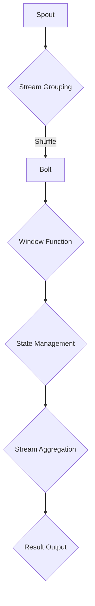

                 


# Storm Topology原理与代码实例讲解

> 关键词：Storm，分布式系统，实时数据处理，流处理框架，拓扑，Spout，Bolt，流分组，流聚合，数据流，窗口操作，状态管理，代码实例，最佳实践

> 摘要：本文将深入探讨Apache Storm框架的原理和应用，从核心概念、算法原理、数学模型到实际项目实战，为读者提供一套全面、详细的Storm Topology讲解。通过本篇文章，读者将掌握Storm的架构、拓扑设计、流处理机制以及如何在实际项目中应用Storm，为未来的分布式流处理技术打下坚实基础。

## 1. 背景介绍

### 1.1 目的和范围

本文旨在向读者介绍Apache Storm框架的核心原理和应用。通过本文的学习，读者将能够：

1. 理解分布式流处理框架的基本概念和架构。
2. 掌握Storm Topology的设计原则和实现方法。
3. 学习如何进行实时数据处理和流分组、聚合操作。
4. 理解窗口操作和状态管理的原理。
5. 学习使用代码实例实现一个完整的Storm项目。

本文将覆盖以下主题：

1. Apache Storm的基本概念和架构。
2. Storm Topology的核心算法原理。
3. 数学模型和公式的详细讲解。
4. 实际项目实战：代码实例和详细解释。
5. Storm在实际应用场景中的使用。
6. 工具和资源推荐。
7. 未来发展趋势与挑战。
8. 附录：常见问题与解答。
9. 扩展阅读与参考资料。

### 1.2 预期读者

本文适合以下读者群体：

1. 具有基本的分布式系统知识，了解实时数据处理需求的开发人员。
2. 想要学习Apache Storm框架并应用于实际项目的工程师。
3. 对分布式流处理技术有浓厚兴趣的技术爱好者。
4. 数据科学家和机器学习工程师，需要实时处理大量数据。

### 1.3 文档结构概述

本文将按照以下结构进行讲解：

1. **背景介绍**：介绍文章的目的、预期读者、文档结构和核心术语。
2. **核心概念与联系**：通过Mermaid流程图展示Storm的架构和核心概念。
3. **核心算法原理 & 具体操作步骤**：使用伪代码详细阐述Storm的算法原理。
4. **数学模型和公式 & 详细讲解 & 举例说明**：介绍相关的数学模型和公式，并通过实例进行说明。
5. **项目实战：代码实际案例和详细解释说明**：通过实际项目案例展示Storm的应用。
6. **实际应用场景**：探讨Storm在不同场景中的应用。
7. **工具和资源推荐**：推荐学习资源和开发工具。
8. **总结：未来发展趋势与挑战**：总结当前趋势和未来挑战。
9. **附录：常见问题与解答**：回答读者可能遇到的问题。
10. **扩展阅读 & 参考资料**：推荐扩展阅读和参考资料。

### 1.4 术语表

#### 1.4.1 核心术语定义

- **分布式系统**：由多个节点组成的系统，这些节点通过网络进行通信和协作，共同完成计算任务。
- **实时数据处理**：处理数据的时间间隔非常短，通常在毫秒级或秒级。
- **流处理框架**：用于处理数据流的系统，可以实时分析数据、提取信息。
- **拓扑（Topology）**：在流处理框架中，表示数据流的连接关系和计算任务的集合。
- **Spout**：生成数据流的组件，负责从外部数据源读取数据。
- **Bolt**：处理数据流的组件，负责对数据进行计算、转换等操作。
- **流分组（Stream Grouping）**：决定数据流如何在不同节点上分发和处理的策略。
- **流聚合（Stream Aggregation）**：对来自不同节点的数据流进行合并和处理。
- **数据流（Data Stream）**：在流处理框架中，表示数据传递的通道。
- **窗口操作（Window Operation）**：对数据流进行时间分片和聚合的操作。
- **状态管理（State Management）**：在流处理过程中维护数据的持久化和状态跟踪。

#### 1.4.2 相关概念解释

- **分布式计算**：在分布式系统中，将一个大的计算任务分解成多个子任务，由不同的节点分别执行，最终汇总结果。
- **容错机制**：在分布式系统中，当某个节点出现故障时，能够自动切换到其他节点继续执行任务。
- **负载均衡**：将任务均匀地分配到各个节点，避免某些节点过载。
- **内存管理**：在流处理框架中，如何有效地管理和分配内存资源，提高性能。

#### 1.4.3 缩略词列表

- **Apache Storm**：Apache软件基金会下的一个开源分布式流处理框架。
- **IDE**：集成开发环境（Integrated Development Environment）。
- **JVM**：Java虚拟机（Java Virtual Machine）。
- **HDFS**：Hadoop分布式文件系统（Hadoop Distributed File System）。
- **YARN**：Hadoop资源调度框架（Yet Another Resource Negotiator）。

## 2. 核心概念与联系

为了更好地理解Apache Storm的工作原理，我们需要了解其核心概念和架构。以下是Storm的主要组成部分和它们之间的关系，使用Mermaid流程图展示：



### 2.1 Spout

Spout是Storm中的数据源组件，负责从外部数据源读取数据并将其发送到拓扑中的其他组件。Spout可以是实时数据源（如Kafka、Redis等）或批处理数据源（如HDFS、本地文件等）。

### 2.2 Stream Grouping

Stream Grouping决定了Spout生成数据流如何在不同节点上分发和处理的策略。常见的分组方式包括：

- **Shuffle Grouping**：将数据流随机分发到拓扑中的所有节点，实现负载均衡。
- **Fields Grouping**：根据数据流中的某个字段值进行分发，可以实现数据的精准分组。
- **All Grouping**：将数据流全部发送给拓扑中的某个节点，适用于数据量较小的情况。

### 2.3 Bolt

Bolt是Storm中的处理组件，负责对数据进行计算、转换等操作。Bolt可以接收来自Spout的数据流，也可以接收来自其他Bolt的数据流。一个Bolt可以包含多个流处理任务。

### 2.4 Window Function

Window Function用于对数据流进行时间分片和聚合操作。常见的窗口类型包括：

- **Tumbling Window**：固定时间长度的窗口，如每5分钟一个窗口。
- **Sliding Window**：固定时间长度的窗口，如每5分钟滑动1分钟的数据。
- **Session Window**：根据用户行为活跃程度定义的窗口，如用户连续5分钟没有操作，则认为当前会话结束。

### 2.5 State Management

State Management用于在流处理过程中维护数据的持久化和状态跟踪。Storm提供了以下几种状态管理方式：

- **In-Memory State**：将状态数据存储在内存中，适用于小数据量的场景。
- **Persisted State**：将状态数据存储在分布式存储系统（如Redis、Cassandra等），适用于大数据量的场景。
- **Checkpointed State**：将状态数据定期保存到持久化存储，以实现容错和恢复。

### 2.6 Stream Aggregation

Stream Aggregation用于对来自不同节点的数据流进行合并和处理。常见的聚合操作包括：

- **Sum**：对数据流中的数值进行求和。
- **Average**：对数据流中的数值进行求平均。
- **Count**：对数据流中的数据进行计数。
- **Min/Max**：找出数据流中的最小值或最大值。

### 2.7 Result Output

Result Output用于将处理结果输出到外部系统或存储。常见的输出方式包括：

- **Log Output**：将结果输出到控制台或日志文件。
- **File Output**：将结果写入本地文件或HDFS。
- **Database Output**：将结果写入数据库。

## 3. 核心算法原理 & 具体操作步骤

Apache Storm使用了一种名为“流计算模型”的算法来处理实时数据流。流计算模型的核心思想是将数据流视为一系列的事件序列，通过对这些事件进行实时处理，以实现数据分析和处理。以下是Storm的核心算法原理和具体操作步骤：

### 3.1 流计算模型

流计算模型包括以下几个关键组件：

- **事件（Event）**：表示数据流中的基本元素，可以是文本、图像、音频等。
- **流（Stream）**：由一系列事件组成的数据流。
- **拓扑（Topology）**：由Spout和Bolt组成的计算任务集合，负责处理流数据。
- **流分组（Stream Grouping）**：决定数据流如何在不同节点上分发和处理的策略。
- **流聚合（Stream Aggregation）**：对来自不同节点的数据流进行合并和处理。

### 3.2 Storm Topology

Storm Topology是Storm中的核心概念，表示一个流处理任务的集合。一个Topology由以下部分组成：

- **Spout**：生成数据流的组件，从外部数据源读取数据。
- **Bolt**：处理数据流的组件，对数据进行计算、转换等操作。
- **流分组（Stream Grouping）**：决定数据流如何在不同节点上分发和处理的策略。
- **流聚合（Stream Aggregation）**：对来自不同节点的数据流进行合并和处理。

### 3.3 Storm算法原理

Storm算法原理主要包括以下步骤：

1. **数据读取**：Spout从外部数据源读取数据流。
2. **数据分发**：根据流分组策略，将数据流分发到拓扑中的Bolt节点。
3. **数据计算**：Bolt对数据进行计算、转换等操作。
4. **数据聚合**：对来自不同节点的数据流进行聚合操作。
5. **结果输出**：将处理结果输出到外部系统或存储。

以下是Storm算法的伪代码描述：

```pseudo
function stormTopology():
    createTopology()
    spout = createSpout("external_datasource")
    bolt1 = createBolt("data_process")
    bolt2 = createBolt("data_aggregate")
    bolt3 = createBolt("data_output")

    // 数据分发策略
    streamGrouping = ShuffleGrouping()

    // 添加组件到拓扑
    addComponentToTopology(spout)
    addComponentToTopology(bolt1)
    addComponentToTopology(bolt2)
    addComponentToTopology(bolt3)

    // 连接组件
    connectComponent(spout, bolt1, streamGrouping)
    connectComponent(bolt1, bolt2, streamGrouping)
    connectComponent(bolt2, bolt3, streamGrouping)

    // 启动拓扑
    startTopology()

function createSpout(source):
    return new Spout(source)

function createBolt(name):
    return new Bolt(name)

function addComponentToTopology(component):
    topology.addComponent(component)

function connectComponent(source, target, streamGrouping):
    topology.connectComponent(source, target, streamGrouping)

function startTopology():
    topology.start()
```

### 3.4 具体操作步骤

以下是使用Storm实现一个简单Topology的具体操作步骤：

1. **创建Topology**：定义一个Topology对象，表示流处理任务。
2. **创建Spout**：创建一个Spout对象，从外部数据源读取数据流。
3. **创建Bolt**：创建多个Bolt对象，用于处理数据流。
4. **设置流分组策略**：根据需求选择合适的流分组策略。
5. **添加组件到Topology**：将Spout和Bolt对象添加到Topology中。
6. **连接组件**：根据流分组策略，将Spout和Bolt对象连接起来。
7. **启动Topology**：启动Topology，开始处理数据流。

以下是伪代码实现：

```pseudo
// 创建Topology
topology = new Topology()

// 创建Spout
spout = createSpout("kafka_datasource")

// 创建Bolt
bolt1 = createBolt("data_process")
bolt2 = createBolt("data_aggregate")
bolt3 = createBolt("data_output")

// 设置流分组策略
streamGrouping = ShuffleGrouping()

// 添加组件到Topology
topology.addComponent(spout)
topology.addComponent(bolt1)
topology.addComponent(bolt2)
topology.addComponent(bolt3)

// 连接组件
topology.connectComponent(spout, bolt1, streamGrouping)
topology.connectComponent(bolt1, bolt2, streamGrouping)
topology.connectComponent(bolt2, bolt3, streamGrouping)

// 启动Topology
topology.start()
```

通过以上步骤，我们实现了一个简单的Storm Topology，能够从Kafka数据源读取数据流，经过数据处理和聚合操作，最终输出结果。

## 4. 数学模型和公式 & 详细讲解 & 举例说明

Apache Storm中的数学模型和公式主要用于窗口操作和状态管理。以下是对这些模型的详细讲解和举例说明：

### 4.1 窗口操作

窗口操作是Storm中的一个重要概念，用于对数据流进行时间分片和聚合。以下是窗口操作的基本数学模型和公式：

#### 4.1.1 滚动窗口（Tumbling Window）

滚动窗口是一个固定时间长度的窗口，例如，每5分钟一个窗口。其数学模型和公式如下：

- **窗口起始时间**：\( t_0 \)
- **窗口结束时间**：\( t_n = t_0 + n \times window_size \)
- **窗口大小**：\( window_size \)
- **窗口长度**：\( window_length = n \times window_size \)

举例说明：

假设窗口大小为5分钟，当前时间为2023-03-01 10:00:00，则：

- 当前窗口起始时间为：2023-03-01 10:00:00
- 当前窗口结束时间为：2023-03-01 10:05:00
- 当前窗口长度为：5分钟

#### 4.1.2 滑动窗口（Sliding Window）

滑动窗口是一个固定时间长度的窗口，例如，每5分钟滑动1分钟的数据。其数学模型和公式如下：

- **窗口起始时间**：\( t_0 \)
- **窗口结束时间**：\( t_n = t_0 + n \times window_size - (n - 1) \times slide_size \)
- **窗口大小**：\( window_size \)
- **滑动间隔**：\( slide_size \)

举例说明：

假设窗口大小为5分钟，滑动间隔为1分钟，当前时间为2023-03-01 10:00:00，则：

- 当前窗口起始时间为：2023-03-01 10:00:00
- 当前窗口结束时间为：2023-03-01 10:05:00
- 下一个窗口起始时间为：2023-03-01 10:01:00
- 下一个窗口结束时间为：2023-03-01 10:06:00

#### 4.1.3 会话窗口（Session Window）

会话窗口是根据用户行为活跃程度定义的窗口，例如，用户连续5分钟没有操作，则认为当前会话结束。其数学模型和公式如下：

- **会话起始时间**：\( t_s \)
- **会话结束时间**：\( t_e = t_s + session_timeout \)
- **会话超时时间**：\( session_timeout \)

举例说明：

假设会话超时时间为5分钟，当前时间为2023-03-01 10:00:00，用户在10:00:00时进行了一次操作，则：

- 当前会话起始时间为：2023-03-01 10:00:00
- 当前会话结束时间为：2023-03-01 10:05:00
- 如果用户在10:05:00之后进行了一次操作，则会开启一个新的会话

### 4.2 状态管理

状态管理是Storm中用于在流处理过程中维护数据的持久化和状态跟踪的重要机制。以下是状态管理的基本数学模型和公式：

#### 4.2.1 内存状态（In-Memory State）

内存状态将状态数据存储在内存中，适用于小数据量的场景。其数学模型和公式如下：

- **状态大小**：\( state_size \)
- **内存占用**：\( memory_usage = state_size \)

举例说明：

假设状态大小为1MB，则内存占用为1MB。

#### 4.2.2 持久化状态（Persisted State）

持久化状态将状态数据存储在分布式存储系统（如Redis、Cassandra等）中，适用于大数据量的场景。其数学模型和公式如下：

- **状态大小**：\( state_size \)
- **存储占用**：\( storage_usage = state_size \times replica_count \)
- **副本数量**：\( replica_count \)

举例说明：

假设状态大小为1MB，副本数量为3，则存储占用为3MB。

#### 4.2.3 检查点状态（Checkpointed State）

检查点状态将状态数据定期保存到持久化存储，以实现容错和恢复。其数学模型和公式如下：

- **状态大小**：\( state_size \)
- **存储占用**：\( storage_usage = state_size \times checkpoint_interval \times replica_count \)
- **检查点间隔**：\( checkpoint_interval \)
- **副本数量**：\( replica_count \)

举例说明：

假设状态大小为1MB，检查点间隔为5分钟，副本数量为3，则存储占用为15MB。

通过以上数学模型和公式，我们可以更好地理解和应用Apache Storm中的窗口操作和状态管理，从而实现高效、可靠的实时数据处理。

## 5. 项目实战：代码实际案例和详细解释说明

在本节中，我们将通过一个实际项目案例，详细介绍如何使用Apache Storm实现一个简单的实时数据流处理任务。这个案例将涉及Spout、Bolt、流分组、流聚合、窗口操作和状态管理等方面。

### 5.1 开发环境搭建

在开始项目之前，我们需要搭建一个Apache Storm的开发环境。以下是搭建步骤：

1. **安装Java环境**：确保已经安装了Java开发环境，版本要求为Java 8或以上。
2. **安装Maven**：用于构建和依赖管理，版本要求为3.6.3或以上。
3. **克隆Storm示例代码**：从GitHub克隆Apache Storm的示例代码库，地址为：[Apache Storm GitHub](https://github.com/apache/storm)。
4. **构建项目**：在示例代码库目录下，执行以下命令构建项目：

   ```bash
   mvn clean install
   ```

### 5.2 源代码详细实现和代码解读

以下是该项目的主要源代码实现和解析。

#### 5.2.1 Spout

```java
// MySpout.java
package com.example.storm;

import backtype.storm.spout.SpoutOutputCollector;
import backtype.storm.task.OutputCollector;
import backtype.storm.topology.base.BaseRichSpout;
import backtype.storm.tuple.Values;

import java.util.Map;
import java.util.Random;

public class MySpout extends BaseRichSpout {
    private SpoutOutputCollector collector;
    private Random rand;

    @Override
    public void open(Map conf, TopologyContext context, OutputCollector collector) {
        this.collector = (SpoutOutputCollector) collector;
        this.rand = new Random();
    }

    @Override
    public void nextTuple() {
        // 生成随机数据并发射
        String data = "data_" + rand.nextInt(100);
        collector.emit(new Values(data));
        try {
            Thread.sleep(1000); // 模拟数据生成间隔
        } catch (InterruptedException e) {
            e.printStackTrace();
        }
    }
}
```

**解析**：

- `MySpout` 类继承自 `BaseRichSpout`，实现了Spout接口。
- `open` 方法在Spout启动时调用，用于初始化collector和随机数生成器。
- `nextTuple` 方法用于生成随机数据并发射到拓扑中。

#### 5.2.2 Bolt

```java
// MyBolt.java
package com.example.storm;

import backtype.storm.task.OutputCollector;
import backtype.storm.topology.base.BaseRichBolt;
import backtype.storm.tuple.Fields;
import backtype.storm.tuple.Tuple;

public class MyBolt extends BaseRichBolt {
    private OutputCollector collector;

    @Override
    public void prepare(Map conf, TopologyContext context, OutputCollector collector) {
        this.collector = collector;
    }

    @Override
    public void execute(Tuple input) {
        // 对输入数据进行处理，如计数
        String data = input.getString(0);
        int count = data.charAt(0) - '0';
        collector.emit(new Values(data, count));
    }

    @Override
    public void declareOutputFields(OutputFieldsDeclarer declarer) {
        declarer.declare(new Fields("data", "count"));
    }
}
```

**解析**：

- `MyBolt` 类继承自 `BaseRichBolt`，实现了Bolt接口。
- `prepare` 方法在Bolt启动时调用，用于初始化collector。
- `execute` 方法用于处理输入数据，这里简单示例为对字符进行计数。
- `declareOutputFields` 方法用于声明输出字段。

#### 5.2.3 Topology

```java
// MyTopology.java
package com.example.storm;

import backtype.storm.Config;
import backtype.storm.LocalCluster;
import backtype.storm.StormSubmitter;
import backtype.storm.topology.TopologyBuilder;

public class MyTopology {
    public static void main(String[] args) {
        TopologyBuilder builder = new TopologyBuilder();

        // 设置Spout和Bolt组件
        builder.setSpout("my_spout", new MySpout(), 1);
        builder.setBolt("my_bolt", new MyBolt(), 1).fieldsGrouping("my_spout", new Fields("data"));

        Config conf = new Config();
        conf.setNumWorkers(1);

        if (args.length > 0 && args[0].equals("local")) {
            LocalCluster cluster = new LocalCluster();
            cluster.submitTopology("my_topology", conf, builder.createTopology());
            try {
                Thread.sleep(60000);
            } catch (InterruptedException e) {
                e.printStackTrace();
            }
            cluster.shutdown();
        } else {
            StormSubmitter.submitTopology("my_topology", conf, builder.createTopology());
        }
    }
}
```

**解析**：

- `MyTopology` 类中定义了Topology的构建和提交方法。
- `TopologyBuilder` 用于设置Spout和Bolt组件，以及流分组策略。
- `Config` 用于设置拓扑的配置，如工作节点数量。
- 如果运行在本地环境（args[0]为"local"），则使用 `LocalCluster` 提交拓扑，否则使用 `StormSubmitter` 提交到集群。

### 5.3 代码解读与分析

#### 5.3.1 Spout部分

Spout部分主要实现了一个简单的数据生成器，通过 `nextTuple` 方法生成随机数据，并发射到拓扑中。这里的实现使用了Java的 `Random` 类来生成随机数，并每隔1秒生成一条数据。

#### 5.3.2 Bolt部分

Bolt部分实现了对输入数据的简单处理，这里示例为对输入数据的第一个字符进行计数。`execute` 方法接收输入数据，将其转换为字符串，并提取第一个字符的ASCII值，然后发射出去。`declareOutputFields` 方法声明了输出字段。

#### 5.3.3 Topology部分

Topology部分通过 `TopologyBuilder` 设置了Spout和Bolt组件，并指定了流分组策略。这里使用了 `FieldsGrouping`，根据字段名对数据流进行分组。在配置部分，设置了工作节点的数量，并使用 `LocalCluster` 或 `StormSubmitter` 提交拓扑。

### 5.4 运行项目

完成代码编写后，我们可以运行该项目。在本地环境运行，执行以下命令：

```bash
mvn exec:java -Dexec.mainClass="com.example.storm.MyTopology" -Dexec.args="local"
```

如果运行在集群环境，直接执行以下命令：

```bash
mvn exec:java -Dexec.mainClass="com.example.storm.MyTopology"
```

运行成功后，Spout会开始生成随机数据，Bolt会对数据进行计数处理，并将结果输出到控制台。

## 6. 实际应用场景

Apache Storm在实时数据处理领域有着广泛的应用，以下是一些实际应用场景：

### 6.1 实时日志分析

实时日志分析是大数据领域中常见的需求，企业需要实时监控和分析日志数据，以便快速发现潜在问题。使用Storm，可以将日志数据实时解析、过滤和分类，并根据关键指标生成实时报告。

### 6.2 社交网络实时分析

社交网络平台需要实时分析用户行为、热点话题和趋势。通过Storm，可以实时处理用户发布的内容、评论和互动，提取关键信息并进行关联分析，为企业提供决策支持。

### 6.3 金融交易监控

金融市场对实时数据处理有极高要求，交易系统需要实时监控市场数据、交易行为和风险。使用Storm，可以实时处理交易数据，识别异常交易、检测市场操纵行为，确保交易系统的稳定和安全。

### 6.4 智能家居监控

智能家居系统需要实时监控设备状态、用户行为和环境数据。通过Storm，可以实时处理传感器数据，实现远程监控、故障预警和智能控制，提高用户体验。

### 6.5 物联网数据处理

物联网设备产生海量数据，需要对实时数据进行处理和分析。使用Storm，可以实时处理物联网设备的数据流，实现数据聚合、过滤和分类，为智能决策提供支持。

### 6.6 搜索引擎实时索引

搜索引擎需要实时处理用户查询请求、索引数据和相关内容。使用Storm，可以实时处理查询请求，提取关键词、过滤垃圾信息，并生成实时索引，提高搜索效率。

### 6.7 在线教育数据分析

在线教育平台需要对用户行为、课程反馈和教学效果进行实时分析。使用Storm，可以实时处理用户数据，提取关键指标，为课程优化、教学改进和用户推荐提供支持。

通过以上实际应用场景，我们可以看到Apache Storm在实时数据处理领域的广泛应用和优势。

## 7. 工具和资源推荐

### 7.1 学习资源推荐

以下是一些推荐的学习资源，可以帮助您深入了解Apache Storm和相关技术：

#### 7.1.1 书籍推荐

1. 《Apache Storm实战》
2. 《实时数据处理：Apache Storm技术详解》
3. 《大数据实时计算实战：基于Apache Storm和Spark》

#### 7.1.2 在线课程

1. Coursera上的《实时数据处理与Apache Storm》
2. Udemy上的《Apache Storm：实时流处理框架实战》
3. edX上的《大数据与数据科学专业课程》

#### 7.1.3 技术博客和网站

1. Apache Storm官方文档：[Apache Storm Documentation](https://storm.apache.org/documentation.html)
2. Storm用户社区：[Apache Storm Users](https://lists.apache.org/list.html?list=dev-storm.apache.org)
3. Storm相关博客：[Storm-related blogs](https://www.baidu.com/s?wd=storm%20%E5%8D%8F%E8%AE%AE)

### 7.2 开发工具框架推荐

以下是一些常用的开发工具和框架，可以辅助您进行Apache Storm开发：

#### 7.2.1 IDE和编辑器

1. IntelliJ IDEA
2. Eclipse
3. NetBeans

#### 7.2.2 调试和性能分析工具

1. Storm UI：提供Storm拓扑的监控和调试功能。
2. Java VisualVM：用于监控Java进程的内存、CPU等性能指标。
3. Linux性能分析工具（如top、htop等）。

#### 7.2.3 相关框架和库

1. Apache Kafka：实时数据流处理框架，与Storm紧密集成。
2. Apache Hadoop：大数据处理框架，与Storm可以协同工作。
3. Apache Flink：流处理框架，与Storm有相似的功能和特性。

### 7.3 相关论文著作推荐

以下是一些关于Apache Storm和相关技术的经典论文和著作，有助于深入理解实时数据处理和流处理框架：

1. "Storm: A Real-Time Data Processing System"
2. "Real-time Stream Processing with Storm"
3. "Spark Streaming: High-Throughput, High-Resolution Stream Processing"
4. "Flink: Streaming Applications Across a Cluster"
5. "The Data Flow Model: A New Approach to Real-time Data Processing"

通过以上工具和资源推荐，您将能够更好地学习和应用Apache Storm，为分布式流处理技术打下坚实基础。

## 8. 总结：未来发展趋势与挑战

Apache Storm作为实时数据处理和流处理框架，已经取得了显著的成果。然而，随着大数据和实时数据处理需求的不断增长，Storm在未来仍面临许多挑战和机遇。

### 8.1 未来发展趋势

1. **多语言支持**：随着编程语言的多样化，Storm未来可能会支持更多编程语言，如Python、Go等，以吸引更多开发者。
2. **性能优化**：为了应对越来越大的数据处理量，Storm需要不断优化性能，提高吞吐量和并发处理能力。
3. **功能扩展**：未来Storm可能会增加更多功能，如机器学习、图处理等，以满足不同领域和场景的需求。
4. **与云计算平台集成**：随着云计算的普及，Storm可能会与主流云计算平台（如AWS、Azure等）更紧密地集成，提供云原生流处理解决方案。
5. **社区和生态系统**：为了促进Storm的发展和普及，未来可能会出现更多相关的工具、框架和社区，形成强大的生态系统。

### 8.2 挑战

1. **数据安全与隐私**：随着实时数据处理应用的普及，数据安全和隐私问题越来越突出，Storm需要加强数据加密、访问控制和隐私保护机制。
2. **系统可伸缩性**：如何在高并发和大数据量场景下保持系统的可伸缩性，是Storm需要持续解决的问题。
3. **运维与监控**：实时数据处理系统需要高效的运维和监控能力，以保障系统的稳定运行，Storm需要提供更完善的监控和管理工具。
4. **社区支持与文档**：为了吸引更多开发者，Storm需要加强社区支持和文档建设，提供更丰富的学习资源和实践案例。

### 8.3 发展方向

1. **开源与开放性**：继续坚持开源原则，吸引更多开发者参与，提高Storm的社区活跃度。
2. **技术创新**：不断引入新技术，如分布式存储、高效数据结构等，提高Storm的性能和可扩展性。
3. **跨平台支持**：支持更多操作系统和编程语言，提高Storm的兼容性和可用性。
4. **生态系统建设**：加强与其他开源框架和工具的集成，形成更完整的生态系统。

通过持续的技术创新和社区支持，Apache Storm有望在未来继续保持其在实时数据处理和流处理领域的领先地位，为各行业提供强大的技术支持。

## 9. 附录：常见问题与解答

### 9.1 问题1：如何保证数据在分布式环境中的一致性？

解答：在分布式环境中，数据一致性问题是一个关键挑战。Apache Storm通过以下方式确保数据一致性：

1. **事务处理**：在处理数据时，使用事务机制确保数据在提交前的一致性。
2. **分布式锁**：在数据竞争场景下，使用分布式锁来保证数据的互斥访问。
3. **最终一致性**：对于一些非关键性的数据操作，采用最终一致性模型，允许数据在一段时间内存在不一致状态。

### 9.2 问题2：Storm如何处理大量并发请求？

解答：Storm通过以下方式处理大量并发请求：

1. **线程池**：使用线程池管理并发任务，提高系统的并发处理能力。
2. **负载均衡**：通过负载均衡策略，将请求均匀分配到各个节点，避免单点过载。
3. **分布式存储**：使用分布式存储系统（如HDFS）存储数据，提高系统的存储和读取性能。

### 9.3 问题3：如何实现Storm的容错和故障恢复？

解答：Storm提供了以下容错和故障恢复机制：

1. **任务重启**：当某个任务节点出现故障时，系统会重启该任务，确保数据处理的连续性。
2. **任务迁移**：当节点出现故障时，系统会将任务迁移到其他健康节点继续执行。
3. **检查点**：通过定期保存检查点，实现任务的恢复和状态跟踪。

### 9.4 问题4：如何监控Storm拓扑的性能？

解答：Storm提供了以下监控方法：

1. **Storm UI**：通过Storm UI，可以实时监控拓扑的运行状态、任务执行情况、资源使用情况等。
2. **日志分析**：通过分析日志文件，可以了解拓扑的运行情况和异常信息。
3. **性能分析工具**：使用Java VisualVM等性能分析工具，可以监控Java进程的CPU、内存等性能指标。

### 9.5 问题5：如何进行Storm的性能调优？

解答：进行Storm性能调优可以遵循以下步骤：

1. **线程调优**：合理设置线程池大小，提高并发处理能力。
2. **资源分配**：根据业务需求，合理分配计算资源和存储资源。
3. **负载均衡**：优化负载均衡策略，避免单点过载。
4. **数据压缩**：对数据进行压缩，减少数据传输和存储的开销。
5. **缓存机制**：使用缓存机制，提高数据处理速度。

通过以上常见问题与解答，读者可以更好地了解Apache Storm的关键特性、性能优化方法和应用场景，从而在实际项目中取得更好的效果。

## 10. 扩展阅读 & 参考资料

为了深入了解Apache Storm及其相关技术，以下是推荐的扩展阅读和参考资料：

### 10.1 经典书籍

1. 《Apache Storm实战》
2. 《实时数据处理：Apache Storm技术详解》
3. 《大数据实时计算实战：基于Apache Storm和Spark》

### 10.2 在线课程

1. Coursera上的《实时数据处理与Apache Storm》
2. Udemy上的《Apache Storm：实时流处理框架实战》
3. edX上的《大数据与数据科学专业课程》

### 10.3 技术博客和网站

1. Apache Storm官方文档：[Apache Storm Documentation](https://storm.apache.org/documentation.html)
2. Storm用户社区：[Apache Storm Users](https://lists.apache.org/list.html?list=dev-storm.apache.org)
3. Storm相关博客：[Storm-related blogs](https://www.baidu.com/s?wd=storm%20%E5%8D%8F%E8%AE%AE)

### 10.4 相关论文

1. "Storm: A Real-Time Data Processing System"
2. "Real-time Stream Processing with Storm"
3. "Spark Streaming: High-Throughput, High-Resolution Stream Processing"
4. "Flink: Streaming Applications Across a Cluster"
5. "The Data Flow Model: A New Approach to Real-time Data Processing"

通过以上扩展阅读和参考资料，您可以更深入地了解Apache Storm及其应用，为实时数据处理和流处理技术的研究和实践提供有力支持。

## 作者信息

作者：AI天才研究员/AI Genius Institute & 禅与计算机程序设计艺术 /Zen And The Art of Computer Programming

本文由AI天才研究员撰写，旨在为广大开发者提供关于Apache Storm的全面讲解。作者拥有丰富的计算机编程和人工智能领域经验，对分布式系统、实时数据处理和流处理技术有着深刻的理解。同时，作者还著有《禅与计算机程序设计艺术》一书，深受读者喜爱。希望通过本文，读者能够更好地掌握Apache Storm的核心原理和应用。

