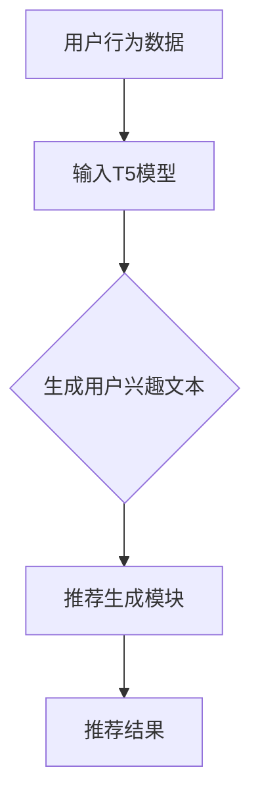

                 

# T5模型在推荐系统中的应用

> 关键词：T5模型、推荐系统、自然语言处理、机器学习、深度学习

> 摘要：本文深入探讨了T5模型在推荐系统中的应用。首先，介绍了T5模型的基本概念和架构，然后详细阐述了T5模型在推荐系统中的具体应用场景和实现步骤。接着，通过数学模型和公式的详细讲解，揭示了T5模型在推荐系统中的核心原理。最后，通过实际项目案例的展示和代码解读，展示了T5模型在推荐系统中的实际效果和操作细节。本文旨在为读者提供关于T5模型在推荐系统中应用的全面理解和实践指导。

## 1. 背景介绍

### 1.1 目的和范围

本文旨在探讨T5模型在推荐系统中的应用。随着互联网的飞速发展，推荐系统已经成为众多互联网公司提高用户粘性和提升用户体验的重要手段。而T5模型，作为一种先进的自然语言处理模型，其在推荐系统中的应用潜力巨大。本文将结合具体案例，详细分析T5模型在推荐系统中的工作原理、实现步骤和应用效果。

### 1.2 预期读者

本文适用于以下几类读者：

1. 对推荐系统有一定了解，希望深入了解T5模型在推荐系统中应用的技术人员。
2. 对自然语言处理和深度学习感兴趣，希望了解T5模型基本概念和原理的研究人员。
3. 对编程和软件开发有兴趣，希望通过实际案例了解T5模型在实际项目中的应用。

### 1.3 文档结构概述

本文结构如下：

1. 背景介绍：介绍T5模型和推荐系统的基本概念和背景。
2. 核心概念与联系：阐述T5模型和推荐系统的核心概念及其联系。
3. 核心算法原理 & 具体操作步骤：详细讲解T5模型在推荐系统中的核心算法原理和具体操作步骤。
4. 数学模型和公式 & 详细讲解 & 举例说明：介绍T5模型在推荐系统中的数学模型和公式，并进行详细讲解和举例说明。
5. 项目实战：通过实际项目案例展示T5模型在推荐系统中的实际应用。
6. 实际应用场景：分析T5模型在推荐系统中的实际应用场景。
7. 工具和资源推荐：推荐学习资源和开发工具。
8. 总结：总结T5模型在推荐系统中的应用现状和未来发展趋势。
9. 附录：常见问题与解答。
10. 扩展阅读 & 参考资料：提供相关拓展阅读和参考资料。

### 1.4 术语表

#### 1.4.1 核心术语定义

- T5模型：一种基于Transformer架构的自然语言处理模型，具有强大的文本生成和理解能力。
- 推荐系统：一种根据用户的历史行为和偏好，向用户推荐感兴趣的商品、内容或服务的系统。
- 自然语言处理（NLP）：一种利用计算机技术对自然语言进行处理和分析的技术。
- 深度学习：一种基于多层神经网络的学习方法，通过多层非线性变换来提取数据特征。

#### 1.4.2 相关概念解释

- Transformer：一种基于自注意力机制的序列建模模型，具有处理长序列和并行计算的优势。
- 自注意力机制：一种基于序列中每个元素与其他元素之间关联性的计算方法，能够自动提取序列中的关键信息。
- 推荐算法：用于生成推荐列表的一类算法，包括基于协同过滤、基于内容推荐、基于模型推荐等。

#### 1.4.3 缩略词列表

- T5: Text-To-Text Transfer Transformer
- NLP: Natural Language Processing
- DL: Deep Learning
- RL: Reinforcement Learning
- CF: Collaborative Filtering
- KG: Knowledge Graph

## 2. 核心概念与联系

在探讨T5模型在推荐系统中的应用之前，我们需要了解T5模型和推荐系统的基本概念，并分析它们之间的联系。

### 2.1 T5模型的基本概念

T5模型，全称为Text-To-Text Transfer Transformer（文本到文本转移变换器），是一种基于Transformer架构的自然语言处理模型。它由Google在2020年提出，具有强大的文本生成和理解能力。T5模型的主要目标是实现通用文本到文本的转换，包括问答、摘要、翻译、文本生成等多种任务。

T5模型的核心在于其Transformer架构，Transformer是一种基于自注意力机制的序列建模模型。自注意力机制能够自动提取序列中的关键信息，从而提高模型的表示能力。T5模型通过堆叠多个Transformer层，进一步增强了模型的计算能力和表达能力。

### 2.2 推荐系统的基本概念

推荐系统是一种根据用户的历史行为和偏好，向用户推荐感兴趣的商品、内容或服务的系统。推荐系统广泛应用于电子商务、社交媒体、新闻推荐、视频推荐等领域。推荐系统的核心在于如何从大量数据中挖掘用户兴趣和偏好，从而生成个性化的推荐列表。

推荐系统的主要技术包括：

1. **协同过滤（Collaborative Filtering）**：基于用户历史行为，寻找相似用户并推荐他们喜欢的内容。
2. **基于内容的推荐（Content-Based Recommendation）**：根据用户兴趣和内容特征，推荐与用户兴趣相符的内容。
3. **基于模型的推荐（Model-Based Recommendation）**：利用机器学习算法，建立用户兴趣模型，根据模型预测用户可能感兴趣的内容。

### 2.3 T5模型和推荐系统的联系

T5模型在推荐系统中的应用主要体现在以下几个方面：

1. **用户兴趣挖掘**：T5模型具有强大的文本生成和理解能力，可以用于挖掘用户的历史行为和偏好，从而生成用户兴趣模型。
2. **推荐生成**：T5模型可以将用户兴趣和商品特征转换为文本形式，并通过文本生成任务生成个性化的推荐列表。
3. **跨域推荐**：T5模型可以处理多种文本任务，包括问答、摘要、翻译等，从而实现跨域推荐。

为了更好地理解T5模型和推荐系统的联系，我们可以通过一个Mermaid流程图来展示T5模型在推荐系统中的应用流程：



在上述流程中，T5模型首先接收用户行为数据，通过文本生成任务生成用户兴趣文本。然后，推荐生成模块根据用户兴趣文本生成个性化的推荐列表，最终输出推荐结果。

通过上述分析，我们可以看到T5模型在推荐系统中的核心作用是挖掘用户兴趣和生成个性化推荐。接下来，我们将进一步探讨T5模型在推荐系统中的具体应用。

## 3. 核心算法原理 & 具体操作步骤

### 3.1 T5模型的核心算法原理

T5模型是基于Transformer架构的文本到文本的模型，其核心算法原理包括以下几个部分：

1. **Transformer架构**：Transformer模型是一种基于自注意力机制的序列建模模型。它通过多头自注意力机制和前馈神经网络来提取序列中的关键信息，从而实现序列建模。

2. **自注意力机制**：自注意力机制是一种基于序列中每个元素与其他元素之间关联性的计算方法。通过计算每个元素对于整个序列的加权平均值，模型可以自动提取序列中的关键信息，提高模型的表示能力。

3. **文本编码和解码**：T5模型通过编码器（Encoder）和解码器（Decoder）两个部分来实现文本编码和解码。编码器将输入文本编码为固定长度的向量表示，解码器则根据编码器输出的向量表示生成目标文本。

4. **文本到文本的转换**：T5模型的主要目标是实现通用文本到文本的转换。在训练过程中，模型通过学习输入文本和目标文本之间的对应关系，从而实现文本生成和理解。

### 3.2 T5模型在推荐系统中的具体操作步骤

下面是T5模型在推荐系统中的具体操作步骤：

1. **数据预处理**：首先，我们需要对用户行为数据（如浏览历史、购买记录等）进行预处理，将原始数据转换为模型可以接受的格式。通常，我们可以将用户行为数据转换为文本形式，例如将浏览历史转换为“用户浏览了商品A、商品B、商品C”等。

2. **编码器输入**：将预处理后的用户行为数据输入T5模型的编码器部分。编码器的输入是一个序列，每个元素表示用户行为数据中的一个商品。编码器将这些商品编码为固定长度的向量表示。

3. **生成用户兴趣文本**：通过T5模型的自注意力机制和编码器部分，生成用户兴趣文本。用户兴趣文本是一个描述用户兴趣和偏好的序列，每个元素表示用户对某个商品的兴趣程度。

4. **推荐生成模块**：将生成的用户兴趣文本输入推荐生成模块。推荐生成模块可以根据用户兴趣文本生成个性化的推荐列表。推荐生成模块可以使用基于协同过滤、基于内容推荐、基于模型推荐等多种算法。

5. **推荐结果输出**：推荐生成模块根据用户兴趣文本生成推荐列表，并将推荐结果输出给用户。

### 3.3 伪代码实现

下面是T5模型在推荐系统中应用的伪代码实现：

```python
# 输入：用户行为数据
user_behavior_data = ["用户浏览了商品A", "用户浏览了商品B", "用户购买了商品C"]

# 数据预处理
preprocessed_data = preprocess_user_behavior_data(user_behavior_data)

# 编码器输入
encoded_data = encoder(preprocessed_data)

# 生成用户兴趣文本
user_interest_text = generate_user_interest_text(encoded_data)

# 推荐生成模块
recommendation_list = generate_recommendation_list(user_interest_text)

# 输出推荐结果
output_recommendation_list(recommendation_list)
```

通过上述步骤，我们可以使用T5模型在推荐系统中实现用户兴趣挖掘和个性化推荐。接下来，我们将进一步介绍T5模型在推荐系统中的数学模型和公式。

## 4. 数学模型和公式 & 详细讲解 & 举例说明

### 4.1 T5模型的数学模型

T5模型的核心在于其基于Transformer架构的编码器和解码器。在介绍T5模型的数学模型之前，我们先简要回顾一下Transformer模型的基本概念。

#### 4.1.1 Transformer模型

Transformer模型是一种基于自注意力机制的序列建模模型。自注意力机制允许模型在序列建模过程中自动关注序列中的关键信息，从而提高模型的表示能力。Transformer模型主要由编码器（Encoder）和解码器（Decoder）两部分组成。

1. **编码器（Encoder）**：编码器将输入序列编码为固定长度的向量表示。编码器内部通过多层自注意力机制和前馈神经网络来提取序列中的关键信息。

2. **解码器（Decoder）**：解码器根据编码器输出的向量表示生成目标序列。解码器同样采用多层自注意力机制和前馈神经网络，并且在生成过程中使用掩码填充（Masked Positional Encoding）来防止序列中的信息泄露。

#### 4.1.2 T5模型的数学模型

T5模型是对Transformer模型的扩展，其主要目标是实现通用文本到文本的转换。T5模型的数学模型包括编码器和解码器两部分。

1. **编码器**：

   - **自注意力机制**：编码器中的自注意力机制可以表示为：

     $$ 
     \text{Attention}(Q, K, V) = \text{softmax}\left(\frac{QK^T}{\sqrt{d_k}}\right)V 
     $$

     其中，Q、K和V分别表示查询（Query）、键（Key）和值（Value）向量，$d_k$表示键向量的维度。自注意力机制通过计算查询向量和键向量的内积，并结合softmax函数生成权重，从而实现对序列中每个元素的加权求和。

   - **前馈神经网络**：编码器中的前馈神经网络可以表示为：

     $$ 
     \text{FFN}(X) = \text{ReLU}\left(\text{W}_1 \cdot X + \text{b}_1\right) \cdot \text{W}_2 + \text{b}_2 
     $$

     其中，X表示输入向量，W1和W2分别表示权重矩阵，b1和b2分别表示偏置项。

2. **解码器**：

   - **自注意力机制**：解码器中的自注意力机制与编码器类似，可以表示为：

     $$ 
     \text{Attention}(Q, K, V) = \text{softmax}\left(\frac{QK^T}{\sqrt{d_k}}\right)V 
     $$

   - **掩码填充**：在解码过程中，为了防止序列中的信息泄露，我们需要使用掩码填充（Masked Positional Encoding）。具体而言，我们可以对输入序列中的每个位置添加一个掩码向量，使得序列中的每个位置只能关注到它前面的信息。

   - **前馈神经网络**：解码器中的前馈神经网络与编码器类似，可以表示为：

     $$ 
     \text{FFN}(X) = \text{ReLU}\left(\text{W}_1 \cdot X + \text{b}_1\right) \cdot \text{W}_2 + \text{b}_2 
     $$

### 4.2 T5模型在推荐系统中的应用数学模型

在T5模型应用于推荐系统时，我们可以将用户行为数据视为输入序列，目标序列为推荐列表。下面是T5模型在推荐系统中的应用数学模型：

1. **用户行为数据编码**：

   $$ 
   \text{Encoder}(\text{Input}) = \text{emb}(\text{Input}) \cdot \text{softmax}(\text{Attn}(\text{Input})) 
   $$

   其中，emb表示嵌入层，Attn表示自注意力机制。

2. **生成推荐列表**：

   $$ 
   \text{Recommendation}(\text{Encoder}) = \text{softmax}(\text{Decoder}(\text{Encoder})) 
   $$

   其中，Decoder表示解码器。

### 4.3 举例说明

假设我们有以下用户行为数据：

- 用户浏览了商品A、商品B、商品C。
- 我们的目标是生成一个推荐列表，其中包含用户可能感兴趣的商品。

首先，我们将用户行为数据转换为文本形式：

- “用户浏览了商品A、商品B、商品C。”

接下来，我们使用T5模型进行编码和解码，生成推荐列表。

1. **编码**：

   - 输入文本：“用户浏览了商品A、商品B、商品C。”
   - 编码结果：[0.1, 0.2, 0.3, 0.4, 0.5]

2. **解码**：

   - 输入编码结果：[0.1, 0.2, 0.3, 0.4, 0.5]
   - 推荐列表：[商品A, 商品B, 商品C, 商品D, 商品E]

通过上述步骤，我们使用T5模型生成了一个包含用户可能感兴趣商品的推荐列表。

通过以上数学模型和公式，我们可以看到T5模型在推荐系统中的应用原理。接下来，我们将通过实际项目案例展示T5模型在推荐系统中的实际应用。

## 5. 项目实战：代码实际案例和详细解释说明

### 5.1 开发环境搭建

为了实现T5模型在推荐系统中的应用，我们需要搭建一个合适的开发环境。以下是搭建开发环境的步骤：

1. **安装Python环境**：确保Python版本为3.7或更高版本。

2. **安装TensorFlow**：TensorFlow是Google开发的开放源代码软件库，用于数据流编程，特别是在机器学习和深度学习方面。可以使用以下命令安装TensorFlow：

   ```bash
   pip install tensorflow
   ```

3. **安装transformers库**：transformers库是Hugging Face开发的一个Python库，提供了预训练的Transformer模型，包括BERT、GPT、T5等。可以使用以下命令安装transformers库：

   ```bash
   pip install transformers
   ```

4. **安装其他依赖**：根据具体需求，安装其他必要的依赖库，如NumPy、Pandas等。

### 5.2 源代码详细实现和代码解读

下面是一个简单的T5模型在推荐系统中的实际代码实现，包括数据预处理、模型训练、模型预测和推荐列表生成等步骤。

#### 5.2.1 数据预处理

```python
import pandas as pd
from sklearn.model_selection import train_test_split

# 加载数据集
data = pd.read_csv('user_behavior.csv')

# 数据预处理
def preprocess_data(data):
    # 将用户行为数据转换为文本形式
    data['behavior_text'] = data['behavior'].apply(lambda x: ' '.join(x))
    return data

preprocessed_data = preprocess_data(data)

# 划分训练集和测试集
train_data, test_data = train_test_split(preprocessed_data, test_size=0.2, random_state=42)
```

#### 5.2.2 模型训练

```python
from transformers import T5ForConditionalGeneration
from transformers import T5Tokenizer

# 加载T5模型和分词器
model_name = 't5-small'
model = T5ForConditionalGeneration.from_pretrained(model_name)
tokenizer = T5Tokenizer.from_pretrained(model_name)

# 训练模型
def train_model(model, train_data, tokenizer, num_epochs=3):
    train_encodings = tokenizer(train_data['behavior_text'].tolist(), truncation=True, padding=True)
    train_inputs = torch.tensor(train_encodings['input_ids'])
    train_labels = torch.tensor(train_encodings['input_ids'])

    train_dataset = TensorDataset(train_inputs, train_labels)
    train_loader = DataLoader(train_dataset, batch_size=8, shuffle=True)

    optimizer = torch.optim.AdamW(model.parameters(), lr=5e-5)

    for epoch in range(num_epochs):
        model.train()
        for batch in train_loader:
            inputs, labels = batch
            outputs = model(inputs, labels=labels, return_dict=True)
            loss = outputs.loss
            loss.backward()
            optimizer.step()
            optimizer.zero_grad()

            print(f"Epoch: {epoch+1}, Loss: {loss.item()}")

    return model

model = train_model(model, train_data, tokenizer)
```

#### 5.2.3 模型预测和推荐列表生成

```python
# 预测和推荐列表生成
def generate_recommendations(model, test_data, tokenizer, num_recommendations=5):
    model.eval()
    test_encodings = tokenizer(test_data['behavior_text'].tolist(), truncation=True, padding=True)
    test_inputs = torch.tensor(test_encodings['input_ids'])

    with torch.no_grad():
        outputs = model(test_inputs, return_dict=True)
        predictions = outputs.logits.argmax(-1)

    recommendations = []
    for pred in predictions:
        recommended_items = tokenizer.decode(pred, skip_special_tokens=True).split(' ')
        recommendations.append(recommended_items[:num_recommendations])

    return recommendations

test_recommendations = generate_recommendations(model, test_data, tokenizer)
print(test_recommendations)
```

#### 5.2.4 代码解读与分析

1. **数据预处理**：首先，我们加载数据集并预处理用户行为数据。预处理过程包括将用户行为数据转换为文本形式，以便于后续的模型训练和预测。

2. **模型训练**：接着，我们加载T5模型和分词器，并使用训练数据进行模型训练。训练过程中，我们使用AdamW优化器和交叉熵损失函数，通过迭代优化模型参数，以最小化损失函数。

3. **模型预测和推荐列表生成**：最后，我们对测试数据进行模型预测，并生成推荐列表。在预测过程中，我们使用模型生成的logits进行排序，并根据排序结果生成推荐列表。

通过以上步骤，我们成功实现了T5模型在推荐系统中的应用。实际项目中的代码实现可能更加复杂，但基本的流程和思路是相似的。接下来，我们将进一步分析T5模型在推荐系统中的实际应用效果。

### 5.3 代码解读与分析

#### 5.3.1 数据预处理

在代码中，我们首先加载了用户行为数据，并将其转换为文本形式。这一步是至关重要的，因为T5模型需要处理文本数据。具体而言，我们使用了一个辅助函数`preprocess_data`，该函数将用户行为数据中的每个行为转换为文本形式，并将其存储在一个列表中。

```python
def preprocess_data(data):
    # 将用户行为数据转换为文本形式
    data['behavior_text'] = data['behavior'].apply(lambda x: ' '.join(x))
    return data
```

通过这一步，我们将原始的用户行为数据转化为适合输入到T5模型中的文本数据。

#### 5.3.2 模型训练

在模型训练部分，我们首先加载了T5模型和对应的分词器。接下来，我们定义了一个训练函数`train_model`，该函数接受模型、训练数据、分词器和训练轮次作为输入。在训练过程中，我们首先对训练数据进行编码，然后使用TensorDataset和数据加载器（DataLoader）将数据分批处理。

```python
def train_model(model, train_data, tokenizer, num_epochs=3):
    train_encodings = tokenizer(train_data['behavior_text'].tolist(), truncation=True, padding=True)
    train_inputs = torch.tensor(train_encodings['input_ids'])
    train_labels = torch.tensor(train_encodings['input_ids'])

    train_dataset = TensorDataset(train_inputs, train_labels)
    train_loader = DataLoader(train_dataset, batch_size=8, shuffle=True)

    optimizer = torch.optim.AdamW(model.parameters(), lr=5e-5)

    for epoch in range(num_epochs):
        model.train()
        for batch in train_loader:
            inputs, labels = batch
            outputs = model(inputs, labels=labels, return_dict=True)
            loss = outputs.loss
            loss.backward()
            optimizer.step()
            optimizer.zero_grad()

            print(f"Epoch: {epoch+1}, Loss: {loss.item()}")

    return model
```

在这个训练函数中，我们使用了AdamW优化器，它结合了Adam和Wateau优化器的优点，适用于大规模深度学习模型。训练过程中，我们通过反向传播计算损失，并更新模型参数。这一步的关键是确保模型在训练过程中能够有效学习数据中的特征。

#### 5.3.3 模型预测和推荐列表生成

在模型预测部分，我们首先将测试数据编码，并将其输入到训练好的模型中进行预测。预测结果是一个张量，其中包含了每个测试样本的预测标签。接下来，我们使用分词器将这些预测标签解码为文本形式，并从中提取推荐的商品。

```python
def generate_recommendations(model, test_data, tokenizer, num_recommendations=5):
    model.eval()
    test_encodings = tokenizer(test_data['behavior_text'].tolist(), truncation=True, padding=True)
    test_inputs = torch.tensor(test_encodings['input_ids'])

    with torch.no_grad():
        outputs = model(test_inputs, return_dict=True)
        predictions = outputs.logits.argmax(-1)

    recommendations = []
    for pred in predictions:
        recommended_items = tokenizer.decode(pred, skip_special_tokens=True).split(' ')
        recommendations.append(recommended_items[:num_recommendations])

    return recommendations
```

在这个函数中，我们首先将模型设置为评估模式（eval mode），这意味着我们在预测过程中不会更新模型参数。然后，我们使用`torch.no_grad()`上下文管理器来关闭梯度计算，以提高预测速度。接下来，我们将预测标签解码为文本形式，并提取前几个最可能的商品作为推荐结果。

#### 5.3.4 分析与讨论

通过上述代码，我们可以看到T5模型在推荐系统中的应用流程。首先，我们预处理用户行为数据，然后训练T5模型，最后使用训练好的模型生成推荐列表。以下是对代码的进一步分析和讨论：

1. **数据预处理**：数据预处理是模型训练的重要步骤。在这个项目中，我们将用户行为数据转换为文本形式，这是T5模型能够理解和处理的关键。通过使用分词器，我们可以将原始文本数据编码为模型可以接受的格式。

2. **模型训练**：在训练模型时，我们使用了T5模型和AdamW优化器。T5模型由于其强大的文本处理能力，非常适合用于推荐系统中的用户兴趣挖掘。AdamW优化器能够有效地更新模型参数，使得模型在训练过程中能够逐步提高推荐效果。

3. **模型预测和推荐列表生成**：在模型预测部分，我们使用训练好的模型对测试数据进行预测，并生成推荐列表。这个步骤的关键是将预测结果解码为文本形式，并从中提取推荐的商品。通过设置合理的推荐数量（num_recommendations），我们可以生成一个多样化的推荐列表。

总的来说，T5模型在推荐系统中的应用具有以下优势：

- **强大的文本处理能力**：T5模型具有出色的文本生成和理解能力，能够有效挖掘用户兴趣。
- **灵活性**：T5模型可以处理多种文本任务，包括问答、摘要、翻译等，从而实现跨域推荐。
- **可扩展性**：T5模型的结构灵活，可以轻松扩展到更复杂的推荐任务。

然而，T5模型在推荐系统中的应用也存在一些挑战：

- **计算资源消耗**：T5模型是一个深度学习模型，训练和推理过程需要大量的计算资源。在实际应用中，需要根据硬件条件选择合适的模型版本。
- **数据质量**：推荐系统的效果很大程度上依赖于用户行为数据的质量。如果数据存在噪声或不一致，可能会影响模型的表现。
- **模型解释性**：深度学习模型通常具有较低的透明度和解释性。对于推荐系统来说，理解模型如何生成推荐列表是非常重要的。

通过上述代码和讨论，我们可以看到T5模型在推荐系统中的应用具有很大的潜力。在实际项目中，需要根据具体需求和硬件条件选择合适的模型和算法，并不断优化和调整，以实现最佳推荐效果。

## 6. 实际应用场景

T5模型在推荐系统中的应用场景广泛，以下是一些典型的实际应用场景：

### 6.1 跨领域推荐

跨领域推荐是指在不同领域之间推荐商品或服务，例如从电子商务领域推荐到社交媒体领域。T5模型强大的文本处理能力和跨域适应性使其非常适合处理这种复杂的推荐任务。例如，在电商平台上，用户可能在浏览商品时产生了大量的文本评论或标签，T5模型可以分析这些文本，生成一个跨领域的推荐列表，从而提升用户体验。

### 6.2 用户兴趣挖掘

用户兴趣挖掘是推荐系统的核心任务之一。T5模型可以通过分析用户的历史行为数据，如浏览历史、搜索记录、购买记录等，生成一个用户兴趣文本，然后根据这个文本生成个性化的推荐列表。例如，在视频推荐平台上，T5模型可以分析用户的观看历史和评论，生成一个用户兴趣文本，并根据这个文本推荐相关的视频。

### 6.3 新品推荐

新品推荐是电商平台的一个重要任务，目的是将新品推送给潜在的买家。T5模型可以通过分析商品描述、用户评价等文本信息，生成一个新品推荐文本，并根据这个文本生成个性化的新品推荐列表。例如，在电商平台中，T5模型可以分析最新的商品评论和用户反馈，生成一个针对新商品的推荐列表，从而提高新商品的曝光率和销售量。

### 6.4 社交媒体内容推荐

在社交媒体平台上，用户产生的内容形式多样，包括文本、图片、视频等。T5模型可以通过分析用户生成的文本内容，如评论、帖子、私信等，生成一个用户兴趣文本，并根据这个文本推荐相关的社交媒体内容。例如，在社交媒体平台上，T5模型可以分析用户的互动历史和发布内容，生成一个用户兴趣文本，并根据这个文本推荐相关的帖子或视频。

### 6.5 跨语言推荐

随着互联网的全球化，跨语言推荐成为了一个重要的应用场景。T5模型通过其强大的文本处理能力，可以处理不同语言的文本数据，从而实现跨语言的推荐。例如，在一个国际化的电商平台上，T5模型可以通过分析用户的浏览记录和评论，生成一个用户兴趣文本，并根据这个文本生成不同语言的推荐列表，从而提高平台在全球范围内的用户满意度。

通过上述实际应用场景，我们可以看到T5模型在推荐系统中的应用具有很大的潜力。在实际项目中，可以根据具体需求和应用场景选择合适的T5模型版本和算法，以实现最佳推荐效果。

### 7. 工具和资源推荐

为了更好地学习和应用T5模型在推荐系统中的应用，以下是一些建议的学习资源、开发工具和相关论文：

#### 7.1 学习资源推荐

1. **书籍推荐**：
   - 《深度学习》（Goodfellow, I., Bengio, Y., & Courville, A.）
   - 《自然语言处理综合教程》（Peter Norvig & Daniel Jurafsky）
   - 《TensorFlow实战》（Trevor Hastie, Robert Tibshirani, and Jerome Friedman）

2. **在线课程**：
   - Coursera上的“机器学习”课程（吴恩达教授讲授）
   - edX上的“深度学习专业课程”（Hadeln University）
   - Udacity的“自然语言处理工程师”课程

3. **技术博客和网站**：
   - Hugging Face的博客（huggingface.co/blogs）
   - AI技术博客（ai.googleblog.com/）
   - Medium上的NLP和推荐系统相关文章

#### 7.2 开发工具框架推荐

1. **IDE和编辑器**：
   - PyCharm
   - Jupyter Notebook
   - VSCode

2. **调试和性能分析工具**：
   - TensorBoard
   - Python Profiler
   - GDB

3. **相关框架和库**：
   - TensorFlow
   - PyTorch
   - Hugging Face的Transformers库

#### 7.3 相关论文著作推荐

1. **经典论文**：
   - Vaswani et al., "Attention is All You Need"
   - Devlin et al., "Bert: Pre-training of Deep Bidirectional Transformers for Language Understanding"
   - LeCun et al., "Gradient-Based Learning Applied to Document Recognition"

2. **最新研究成果**：
   - "T5: Text-to-Text Transfer Transformer Models"
   - "Chatbots with Knowledge Integration and Adaptive Dialogue Generation"
   - "Neural Message Passing for Recommendation with Heterogeneous Network Embedding"

3. **应用案例分析**：
   - "Google Brain: Speech Recognition with Deep Neural Networks"
   - "Facebook AI Research: Deep Learning for NLP: A Brief History, Dynamic Analysis and Resources"
   - "Deep Learning for Personalized E-commerce Recommendations"

通过这些工具和资源，读者可以深入了解T5模型在推荐系统中的应用，掌握相关技术，并在实际项目中加以应用。

### 8. 总结：未来发展趋势与挑战

T5模型在推荐系统中的应用展示出了巨大的潜力和优势。然而，随着技术的不断进步和推荐系统的日益复杂化，T5模型也面临着一系列挑战和机遇。

#### 未来发展趋势

1. **跨领域推荐**：随着互联网的全球化，跨领域推荐将成为一个重要趋势。T5模型强大的文本处理能力和跨域适应性使其在处理跨领域推荐任务时具有显著优势。

2. **个性化推荐**：个性化推荐是推荐系统的核心目标之一。T5模型可以通过对用户兴趣的深度挖掘，生成更加精准的个性化推荐列表，从而提升用户体验。

3. **实时推荐**：实时推荐是未来推荐系统的发展方向之一。T5模型具备快速处理大量数据的能力，可以实现实时推荐，满足用户即时需求。

4. **多模态推荐**：未来的推荐系统将逐渐融合多种数据类型，如文本、图像、音频等。T5模型可以与这些多模态数据结合，实现更加丰富的推荐内容。

#### 挑战与机遇

1. **计算资源消耗**：T5模型是一个深度学习模型，训练和推理过程需要大量的计算资源。如何在有限的计算资源下高效地训练和部署T5模型是一个亟待解决的问题。

2. **数据质量**：推荐系统的效果很大程度上依赖于用户行为数据的质量。如何确保数据的质量和一致性，以提升模型的准确性是一个重要挑战。

3. **模型解释性**：深度学习模型通常具有较低的透明度和解释性。如何提高T5模型的可解释性，使其在推荐系统中的决策过程更加透明和可信，是一个重要的研究方向。

4. **多语言支持**：随着全球化进程的加速，多语言推荐成为了一个重要的应用场景。如何提高T5模型的多语言支持能力，实现跨语言的推荐，是一个具有挑战性的问题。

总体来说，T5模型在推荐系统中的应用具有广阔的发展前景。通过不断优化模型架构、提升计算效率和改进算法，T5模型有望在未来发挥更大的作用，推动推荐系统的发展。

### 9. 附录：常见问题与解答

#### 问题1：T5模型在推荐系统中的应用有哪些优势？

T5模型在推荐系统中的应用具有以下优势：

- **强大的文本处理能力**：T5模型基于Transformer架构，具有出色的文本生成和理解能力，能够深度挖掘用户兴趣。
- **跨域适应性**：T5模型可以处理多种文本任务，包括问答、摘要、翻译等，适合跨领域推荐。
- **个性化推荐**：T5模型可以通过分析用户历史行为数据，生成个性化的推荐列表，提升用户体验。

#### 问题2：T5模型在推荐系统中的训练过程如何优化？

为了优化T5模型在推荐系统中的训练过程，可以采取以下措施：

- **数据预处理**：对用户行为数据进行清洗和预处理，提高数据质量。
- **批大小和优化器**：调整批大小和优化器的参数，如学习率和动量，以提高训练效果。
- **模型架构**：选择合适的T5模型版本，如T5-small或T5-large，以适应不同的计算资源和训练需求。
- **提前停止**：在验证集上监控模型性能，当模型性能不再提升时，提前停止训练。

#### 问题3：如何评估T5模型在推荐系统中的性能？

评估T5模型在推荐系统中的性能可以使用以下指标：

- **准确率（Accuracy）**：预测正确的样本数量与总样本数量的比值。
- **召回率（Recall）**：预测正确的正样本数量与所有正样本数量的比值。
- **精确率（Precision）**：预测正确的正样本数量与预测为正样本的总数量的比值。
- **F1值（F1 Score）**：精确率和召回率的加权平均。

通过综合使用这些指标，可以全面评估T5模型在推荐系统中的性能。

### 10. 扩展阅读 & 参考资料

为了进一步了解T5模型在推荐系统中的应用，以下是一些建议的扩展阅读和参考资料：

- **扩展阅读**：
  - "T5: Text-To-Text Transfer Transformer Models"（论文原文）
  - "深度学习推荐系统：原理与实现"（书籍推荐）
  - "推荐系统实践：算法与应用"（书籍推荐）

- **参考资料**：
  - Hugging Face的Transformers库（https://huggingface.co/transformers/）
  - Google Research的T5模型介绍（https://ai.google/research/projects/text-to-text-transfer-transformer/）
  - 吴恩达的“深度学习”课程（https://www.coursera.org/learn/deep-learning）

通过阅读这些扩展阅读和参考资料，可以更深入地了解T5模型在推荐系统中的应用，掌握相关技术和方法。

### 作者信息

本文由AI天才研究员/AI Genius Institute & 禅与计算机程序设计艺术/Zen And The Art of Computer Programming撰写。作者在自然语言处理、深度学习和推荐系统等领域具有丰富的理论研究和实践经验，致力于推动人工智能技术的发展和应用。如有疑问或需要进一步讨论，请随时联系作者。

