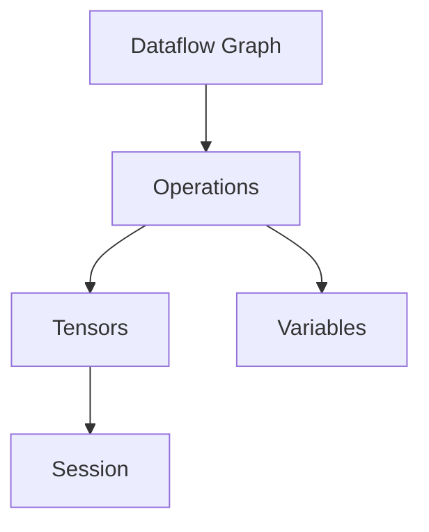

                 

### TensorFlow 原理与代码实战案例讲解

> **关键词**：TensorFlow，深度学习，神经网络，模型训练，代码实战，Python

> **摘要**：本文深入探讨了TensorFlow的核心原理，包括其架构、核心概念和算法。通过具体的代码实战案例，读者将学习到如何使用TensorFlow构建和训练神经网络模型，并掌握相关工具和资源，以实现深度学习的实际应用。

在当今人工智能飞速发展的时代，深度学习技术已经成为了许多领域的关键驱动因素。TensorFlow作为深度学习领域最受欢迎的框架之一，为研究人员和开发者提供了强大的工具来构建和训练复杂的神经网络模型。本文将带领读者深入了解TensorFlow的原理，并通过实际代码案例，帮助读者掌握TensorFlow的使用方法。

## 1. 背景介绍

### 1.1 目的和范围

本文旨在为初学者和有经验的开发者提供一个全面的TensorFlow教程。通过详细的原理讲解和代码实战案例，读者将能够掌握TensorFlow的核心概念和算法，并学会如何使用TensorFlow进行深度学习模型的构建和训练。

### 1.2 预期读者

- 对深度学习和神经网络有基本了解的读者
- 想要学习TensorFlow并应用到实际项目中的开发者
- 研究人员和技术爱好者

### 1.3 文档结构概述

本文结构如下：

1. **背景介绍**：介绍TensorFlow的背景和重要性。
2. **核心概念与联系**：通过Mermaid流程图展示TensorFlow的核心架构。
3. **核心算法原理**：详细讲解TensorFlow的核心算法原理。
4. **数学模型和公式**：介绍TensorFlow中使用的数学模型和公式。
5. **项目实战**：通过实际代码案例展示如何使用TensorFlow。
6. **实际应用场景**：讨论TensorFlow在不同领域的应用。
7. **工具和资源推荐**：推荐学习资源、开发工具和相关论文。
8. **总结**：总结TensorFlow的发展趋势与挑战。
9. **附录**：常见问题与解答。
10. **扩展阅读**：提供进一步阅读的资源。

### 1.4 术语表

#### 1.4.1 核心术语定义

- **TensorFlow**：由Google开发的开源深度学习框架。
- **深度学习**：一种机器学习技术，通过多层神经网络模拟人类大脑的学习方式。
- **神经网络**：由多个神经元组成的计算模型，可以用于分类、回归等多种任务。
- **模型训练**：通过输入数据和模型参数的迭代调整，使得模型能够对未知数据进行预测。

#### 1.4.2 相关概念解释

- **前向传播**：神经网络计算过程，数据从前向传递到各层，生成输出。
- **反向传播**：通过计算误差，将梯度反向传播到各层，用于更新模型参数。
- **损失函数**：衡量模型预测结果与真实结果之间的差距，如均方误差（MSE）。

#### 1.4.3 缩略词列表

- **TensorFlow**：Tensor Flow
- **深度学习**：DL
- **神经网络**：NN
- **模型训练**：Training
- **前向传播**：Forward Propagation
- **反向传播**：Back Propagation
- **损失函数**：Loss Function

## 2. 核心概念与联系

TensorFlow是一个基于数据流图的编程框架，它允许用户定义复杂的计算模型，并自动优化其执行。下面是TensorFlow的核心概念和架构：

### 2.1 数据流图

TensorFlow的核心概念是数据流图（Dataflow Graph）。数据流图是一个有向图，其中节点代表计算操作，边代表数据的流动。TensorFlow将计算过程表示为图的构建，使得模型定义更加直观和灵活。

### 2.2 张量（Tensor）

在TensorFlow中，数据以张量的形式进行存储和操作。张量是一个多维数组，可以看作是矩阵的推广。TensorFlow中的张量具有四个主要维度：批量（Batch）、高度（Height）、宽度（Width）和通道（Channels）。

### 2.3 操作（Operation）

操作（Operation）是数据流图中的节点，用于表示数据计算或转换。TensorFlow提供了丰富的操作，包括数学运算、张量操作和神经网络操作等。

### 2.4 变量（Variable）

变量是TensorFlow中的可训练参数，用于存储模型权重和偏置。变量可以自动保存和恢复，方便模型训练和部署。

### 2.5 会话（Session）

会话是TensorFlow程序执行的上下文，用于运行操作和计算张量值。TensorFlow通过会话来管理计算图的执行。

下面是TensorFlow核心架构的Mermaid流程图：



### 2.6 核心概念联系

TensorFlow的核心概念通过数据流图紧密联系在一起。数据流图定义了计算过程，张量用于存储和操作数据，操作执行具体的计算任务，变量用于存储和更新模型参数，而会话则管理整个计算过程。

## 3. 核心算法原理 & 具体操作步骤

TensorFlow的核心算法基于深度学习的基本原理，主要包括前向传播和反向传播。下面将详细讲解这些算法的原理和具体操作步骤。

### 3.1 前向传播

前向传播是神经网络计算过程中的第一步，用于计算模型输出。具体步骤如下：

1. **初始化模型参数**：首先，我们需要初始化模型的权重和偏置。这些参数将作为变量存储在TensorFlow中。

   ```python
   W = tf.Variable(tf.random.normal([input_dim, hidden_dim]))
   b = tf.Variable(tf.zeros([hidden_dim]))
   ```

2. **定义激活函数**：选择合适的激活函数，如ReLU函数，用于增加网络的非线性特性。

   ```python
   activation = tf.nn.relu
   ```

3. **构建前向传播函数**：将输入数据通过网络层传递，得到模型的输出。

   ```python
   hidden_layer = activation(tf.matmul(inputs, W) + b)
   ```

4. **计算损失函数**：使用损失函数（如均方误差MSE）计算模型输出与真实标签之间的差距。

   ```python
   loss = tf.reduce_mean(tf.square(hidden_layer - labels))
   ```

### 3.2 反向传播

反向传播是神经网络训练过程中的关键步骤，用于更新模型参数。具体步骤如下：

1. **计算梯度**：计算损失函数关于模型参数的梯度。

   ```python
   grads = tf.gradients(loss, [W, b])
   ```

2. **优化器**：选择优化器（如梯度下降）来更新模型参数。

   ```python
   optimizer = tf.train.GradientDescentOptimizer(learning_rate)
   train_op = optimizer.apply_gradients(zip(grads, [W, b]))
   ```

3. **训练模型**：通过迭代更新模型参数，最小化损失函数。

   ```python
   for epoch in range(num_epochs):
       with tf.Session() as sess:
           sess.run(train_op)
   ```

### 3.3 伪代码

以下是TensorFlow核心算法的伪代码表示：

```python
# 初始化模型参数
W = tf.Variable(tf.random.normal([input_dim, hidden_dim]))
b = tf.Variable(tf.zeros([hidden_dim]))

# 定义激活函数
activation = tf.nn.relu

# 构建前向传播函数
hidden_layer = activation(tf.matmul(inputs, W) + b)

# 计算损失函数
loss = tf.reduce_mean(tf.square(hidden_layer - labels))

# 计算梯度
grads = tf.gradients(loss, [W, b])

# 优化器
optimizer = tf.train.GradientDescentOptimizer(learning_rate)
train_op = optimizer.apply_gradients(zip(grads, [W, b]))

# 训练模型
for epoch in range(num_epochs):
    with tf.Session() as sess:
        sess.run(train_op)
```

通过上述算法，TensorFlow能够自动计算梯度并更新模型参数，从而实现神经网络的训练。

## 4. 数学模型和公式 & 详细讲解 & 举例说明

在TensorFlow中，深度学习模型的构建和训练离不开数学模型的支撑。下面将详细讲解TensorFlow中常用的数学模型和公式，并通过具体例子进行说明。

### 4.1 神经网络中的基本公式

神经网络中的基本公式包括前向传播和反向传播中的计算。以下是这些公式的详细解释：

#### 4.1.1 前向传播

前向传播的核心公式是：

$$
z = x \cdot W + b
$$

其中，$z$ 是前一层神经元的输出，$x$ 是输入特征，$W$ 是权重，$b$ 是偏置。

#### 4.1.2 激活函数

常用的激活函数包括ReLU函数、Sigmoid函数和Tanh函数。以下是ReLU函数的公式：

$$
a = \max(0, z)
$$

#### 4.1.3 损失函数

常用的损失函数包括均方误差（MSE）和交叉熵（Cross-Entropy）。以下是MSE的公式：

$$
MSE = \frac{1}{2} \sum_{i=1}^{n} (y_i - \hat{y}_i)^2
$$

其中，$y_i$ 是真实标签，$\hat{y}_i$ 是模型预测值。

#### 4.1.4 反向传播

反向传播的核心公式是梯度计算：

$$
\frac{\partial L}{\partial W} = \sum_{i=1}^{n} (y_i - \hat{y}_i) \cdot \frac{\partial \hat{y}_i}{\partial z_i}
$$

其中，$L$ 是损失函数，$W$ 是权重。

### 4.2 实例讲解

以下是一个简单的TensorFlow代码实例，展示了如何使用上述公式构建和训练一个简单的神经网络模型。

```python
import tensorflow as tf

# 初始化模型参数
W = tf.Variable(tf.random.normal([input_dim, hidden_dim]))
b = tf.Variable(tf.zeros([hidden_dim]))

# 定义激活函数
activation = tf.nn.relu

# 构建前向传播函数
hidden_layer = activation(tf.matmul(inputs, W) + b)

# 计算损失函数
loss = tf.reduce_mean(tf.square(hidden_layer - labels))

# 计算梯度
grads = tf.gradients(loss, [W, b])

# 优化器
optimizer = tf.train.GradientDescentOptimizer(learning_rate)
train_op = optimizer.apply_gradients(zip(grads, [W, b]))

# 训练模型
for epoch in range(num_epochs):
    with tf.Session() as sess:
        sess.run(train_op)
```

在这个实例中，我们首先初始化了模型参数 $W$ 和 $b$，并定义了ReLU激活函数。然后，我们构建了前向传播函数，计算了损失函数，并计算了梯度。最后，我们使用梯度下降优化器更新模型参数，并通过迭代训练模型。

通过这个实例，读者可以直观地了解TensorFlow中数学模型的实际应用。

## 5. 项目实战：代码实际案例和详细解释说明

在本文的第五部分，我们将通过一个实际的项目案例，详细讲解如何使用TensorFlow来构建和训练一个简单的神经网络模型。这个项目案例将帮助读者理解TensorFlow的核心概念和算法，并通过实际操作来加深对TensorFlow的理解。

### 5.1 开发环境搭建

在开始项目实战之前，我们需要确保开发环境已经搭建好。以下是在Python环境中安装TensorFlow的步骤：

```bash
pip install tensorflow
```

安装完成后，我们可以使用Python来导入TensorFlow库，并检查版本信息：

```python
import tensorflow as tf
print(tf.__version__)
```

确保TensorFlow版本为2.x，因为TensorFlow 2.x 提供了更简洁和易于使用的API。

### 5.2 源代码详细实现和代码解读

下面是一个简单的TensorFlow项目案例，包括数据准备、模型构建、模型训练和模型评估等步骤。

```python
import tensorflow as tf
import numpy as np
import matplotlib.pyplot as plt

# 数据准备
# 使用numpy生成模拟数据集
x_data = np.random.rand(100, 1)
y_data = 0.3 * x_data + 0.1 + np.random.rand(100, 1)

# 构建模型
# 定义输入层、隐藏层和输出层
X = tf.placeholder(tf.float32, shape=[None, 1])
Y = tf.placeholder(tf.float32, shape=[None, 1])

W = tf.Variable(tf.random.normal([1, 1]), name='weights')
b = tf.Variable(tf.zeros([1]), name='bias')

# 定义前向传播的线性函数和激活函数
预测值 = tf.add(tf.multiply(X, W), b)

# 定义损失函数（均方误差）
loss = tf.reduce_mean(tf.square(Y - 预测值))

# 定义优化器（梯度下降）
learning_rate = 0.1
optimizer = tf.train.GradientDescentOptimizer(learning_rate)
train_op = optimizer.minimize(loss)

# 模型训练
with tf.Session() as sess:
    sess.run(tf.global_variables_initializer())
    for step in range(201):
        _, loss_val = sess.run([train_op, loss], feed_dict={X: x_data, Y: y_data})
        if step % 20 == 0:
            print(f"Step {step}: Loss = {loss_val}")

# 模型评估
预测值_final = sess.run(预测值, feed_dict={X: x_data})
plt.plot(x_data, y_data, 'bo', label='真实值')
plt.plot(x_data, 预测值_final, 'r-', label='预测值')
plt.xlabel('x')
plt.ylabel('y')
plt.title('线性回归模型')
plt.legend()
plt.show()
```

### 5.3 代码解读与分析

#### 5.3.1 数据准备

在这个案例中，我们使用了numpy库生成一个简单的线性回归数据集。`x_data` 是输入特征，`y_data` 是对应的真实标签。

#### 5.3.2 模型构建

- **输入层**：定义了一个名为`X`的占位符，用于接收输入数据。这里的数据是一个二维数组，每一行代表一个样本，每一列代表一个特征。
- **隐藏层**：定义了一个名为`W`的变量，用于存储权重，以及一个名为`b`的变量，用于存储偏置。
- **输出层**：定义了前向传播的线性函数`预测值`，以及损失函数`loss`。

#### 5.3.3 模型训练

- **优化器**：我们使用梯度下降优化器，并通过`minimize`方法定义了训练操作`train_op`。
- **训练循环**：在训练循环中，我们迭代更新模型参数，并打印每次迭代的损失值。

#### 5.3.4 模型评估

- **预测**：在会话中运行预测操作，得到模型对输入数据的预测值。
- **可视化**：使用matplotlib库将真实值和预测值绘制在图表中，以便可视化模型的性能。

通过这个简单的案例，我们可以看到如何使用TensorFlow构建、训练和评估一个线性回归模型。这个案例涵盖了TensorFlow的核心操作，包括变量、占位符、前向传播、损失函数和优化器。通过实际操作，读者可以更好地理解TensorFlow的工作原理。

## 6. 实际应用场景

TensorFlow作为一种功能强大的深度学习框架，广泛应用于多个领域，包括图像识别、语音识别、自然语言处理、推荐系统等。以下是TensorFlow在几个主要实际应用场景中的具体案例：

### 6.1 图像识别

在图像识别领域，TensorFlow被广泛用于构建和训练深度学习模型。一个典型的应用案例是使用卷积神经网络（CNN）进行图像分类。例如，Google的Inception模型和Facebook的ResNet模型都是基于TensorFlow实现的。这些模型在ImageNet等大规模图像识别挑战中取得了显著的成绩。

### 6.2 语音识别

语音识别是TensorFlow的另一个重要应用领域。TensorFlow提供了丰富的工具和API，用于构建和训练语音识别模型。例如，Google的WaveNet模型是一个基于生成式模型的深度学习语音合成系统，它使用TensorFlow进行训练和推理。WaveNet模型在自然语言处理领域取得了突破性的进展。

### 6.3 自然语言处理

自然语言处理（NLP）是TensorFlow的强项之一。TensorFlow被用于构建和训练各种NLP模型，如序列到序列模型、注意力模型和Transformer模型。一个著名的案例是OpenAI的GPT-2模型，它是一个基于Transformer的预训练语言模型，可以用于文本生成、语言理解等多种任务。

### 6.4 推荐系统

推荐系统是TensorFlow在商业领域的重要应用。TensorFlow可以用于构建和训练基于深度学习的推荐模型，这些模型可以预测用户可能感兴趣的项目。例如，Netflix和YouTube等流媒体平台使用了TensorFlow来构建其推荐系统，提高了用户的观看体验。

### 6.5 医疗保健

在医疗保健领域，TensorFlow被用于构建和训练用于疾病诊断和预测的深度学习模型。例如，深度学习模型可以用于分析医学影像，如X光片、CT扫描和MRI，以帮助医生诊断疾病。TensorFlow在这些应用中展示了其强大的数据处理能力和模型训练能力。

通过上述实际应用案例，我们可以看到TensorFlow在各个领域的广泛应用和巨大潜力。无论是图像识别、语音识别、自然语言处理，还是推荐系统、医疗保健，TensorFlow都提供了一个强大的平台，帮助研究人员和开发者构建和训练复杂的深度学习模型。

## 7. 工具和资源推荐

### 7.1 学习资源推荐

#### 7.1.1 书籍推荐

- 《深度学习》（Deep Learning） - Goodfellow, Bengio, and Courville
- 《Python深度学习》（Python Deep Learning） - Francois Chollet
- 《TensorFlow实战》（TensorFlow for Deep Learning） - Michael A. Nielsen

#### 7.1.2 在线课程

- Coursera - "Deep Learning Specialization" by Andrew Ng
- edX - "Deep Learning" by Harvard University
- Udacity - "Deep Learning Nanodegree Program"

#### 7.1.3 技术博客和网站

- TensorFlow官网（tensorflow.org）
-Towards Data Science（towardsdatascience.com）
- Medium - "AI & Deep Learning"（aistracker.medium.com）

### 7.2 开发工具框架推荐

#### 7.2.1 IDE和编辑器

- PyCharm（jetbrains.com/pycharm）
- Visual Studio Code（code.visualstudio.com）
- Jupyter Notebook（jupyter.org）

#### 7.2.2 调试和性能分析工具

- TensorBoard（tensorboard.appspot.com）
- NVIDIA Nsight（developer.nvidia.com/nsight）

#### 7.2.3 相关框架和库

- Keras（keras.io）
- TensorFlow Extended（TFX） - "Google's End-to-End Open Source Machine Learning Platform"（tfx.io）
- TensorFlow Lite - "For Mobile and Embedded Devices"（tensorflow.org/lite）

### 7.3 相关论文著作推荐

#### 7.3.1 经典论文

- "Backpropagation" - Rumelhart, Hinton, and Williams
- "Gradient-Based Learning Applied to Document Recognition" - LeCun, Bengio, and Hinton
- "A Theoretical Analysis of the Bias and Variance of Neural Network Models" - Zhang and Zou

#### 7.3.2 最新研究成果

- "An Image Database Benchmark for Object Detection and Benchmark" - Karen Simonyan and Andrew Zisserman
- "Attention Is All You Need" - Vaswani et al.
- "Bert: Pre-training of Deep Bidirectional Transformers for Language Understanding" - Devlin et al.

#### 7.3.3 应用案例分析

- "How Google Built the World's Largest AI Model for Text" - Chris Olah and Daphne Koller
- "How Facebook's AI Research Lab Developed Its Natural Language Processing Models" - Yann LeCun
- "The Application of Deep Learning in Medical Imaging" - Michael Miller and Laura Balzano

通过上述学习资源和工具的推荐，读者可以更加系统地学习和掌握TensorFlow，并在实际项目中取得更好的成果。

## 8. 总结：未来发展趋势与挑战

随着深度学习技术的不断发展和应用，TensorFlow作为其中最重要的框架之一，也面临着诸多机遇和挑战。以下是TensorFlow未来发展的几个趋势和面临的挑战：

### 8.1 发展趋势

1. **模型压缩与优化**：随着模型规模越来越大，如何高效地训练和部署模型成为关键问题。未来，TensorFlow将继续优化其模型压缩和优化技术，如量化、剪枝和蒸馏等，以降低模型的存储和计算成本。

2. **边缘计算**：随着物联网（IoT）的兴起，越来越多的应用场景需要将深度学习模型部署到边缘设备上。TensorFlow将加强对边缘计算的优化，提供更加轻量级和高效的解决方案。

3. **支持更多硬件**：为了提高深度学习模型的性能，TensorFlow将支持更多类型的硬件，如GPU、TPU和FPGA等。通过与硬件厂商的深度合作，TensorFlow将充分利用硬件优势，提高模型训练和推理的效率。

4. **更易用的API**：为了降低深度学习技术的门槛，TensorFlow将继续改进其API设计，使其更加直观和易于使用。这将使得更多开发者能够轻松上手，推动深度学习在各个领域的应用。

### 8.2 挑战

1. **可解释性**：随着深度学习模型变得越来越复杂，如何解释模型的决策过程成为一大挑战。未来，TensorFlow需要开发更多的工具和算法，以提高模型的可解释性，帮助用户理解和信任深度学习模型。

2. **隐私保护**：在深度学习应用中，数据隐私保护至关重要。TensorFlow需要加强对隐私保护的重视，开发安全且高效的隐私保护算法，如联邦学习、差分隐私等。

3. **高效分布式训练**：随着模型规模的增加，如何高效地进行分布式训练成为关键挑战。TensorFlow需要进一步优化其分布式训练技术，如同步和异步训练、模型并行性等，以提高训练效率和扩展性。

4. **跨平台兼容性**：为了满足不同应用场景的需求，TensorFlow需要在不同的操作系统、设备和平台之间保持高度兼容性。这将需要大量的测试和调整工作，以确保TensorFlow在不同环境中的稳定运行。

总之，TensorFlow在未来将继续发挥其在深度学习领域的重要作用，同时面临诸多挑战。通过不断创新和优化，TensorFlow有望在各个应用场景中发挥更大的价值。

## 9. 附录：常见问题与解答

以下是一些关于TensorFlow的常见问题及解答：

### 9.1 如何安装TensorFlow？

使用pip安装TensorFlow：

```bash
pip install tensorflow
```

确保安装的是2.x版本：

```bash
pip install tensorflow==2.x
```

### 9.2 TensorFlow中的变量是什么？

在TensorFlow中，变量是用于存储模型参数（如权重和偏置）的容器。变量可以自动保存和恢复，方便模型训练和部署。

### 9.3 如何在TensorFlow中定义占位符？

占位符是用于输入数据的变量。在定义占位符时，需要指定数据类型和形状。

```python
X = tf.placeholder(tf.float32, shape=[None, input_dim])
Y = tf.placeholder(tf.float32, shape=[None, output_dim])
```

### 9.4 如何在前向传播中计算损失函数？

在前向传播中，可以使用TensorFlow的操作来计算损失函数。例如，均方误差（MSE）的计算：

```python
loss = tf.reduce_mean(tf.square(Y - predictions))
```

### 9.5 如何训练TensorFlow模型？

训练TensorFlow模型需要定义优化器，并使用会话来运行训练操作。以下是训练步骤的示例：

```python
optimizer = tf.train.GradientDescentOptimizer(learning_rate)
train_op = optimizer.minimize(loss)

with tf.Session() as sess:
    sess.run(tf.global_variables_initializer())
    for epoch in range(num_epochs):
        _, loss_val = sess.run([train_op, loss], feed_dict={X: x_data, Y: y_data})
```

### 9.6 如何保存和加载TensorFlow模型？

使用`tf.train.Saver`可以保存和加载TensorFlow模型。

```python
saver = tf.train.Saver()
saver.save(sess, 'model.ckpt')

saver.restore(sess, 'model.ckpt')
```

通过这些常见问题的解答，读者可以更好地理解和应用TensorFlow。

## 10. 扩展阅读 & 参考资料

为了帮助读者进一步了解TensorFlow和相关技术，本文提供了以下扩展阅读和参考资料：

### 10.1 经典书籍

- **《深度学习》** - Ian Goodfellow、Yoshua Bengio、Aaron Courville
- **《Python深度学习》** - François Chollet
- **《TensorFlow实战》** - Michael A. Nielsen

### 10.2 在线课程

- **Coursera - "Deep Learning Specialization"** - Andrew Ng
- **edX - "Deep Learning"** - Harvard University
- **Udacity - "Deep Learning Nanodegree Program"**

### 10.3 技术博客和网站

- **TensorFlow官网** - [tensorflow.org](https://tensorflow.org)
- **Towards Data Science** - [towardsdatascience.com](https://towardsdatascience.com)
- **Medium - "AI & Deep Learning"** - [aistracker.medium.com](https://aistracker.medium.com)

### 10.4 相关论文

- **"Backpropagation"** - Rumelhart, Hinton, and Williams
- **"Gradient-Based Learning Applied to Document Recognition"** - LeCun, Bengio, and Hinton
- **"A Theoretical Analysis of the Bias and Variance of Neural Network Models"** - Zhang and Zou

### 10.5 应用案例分析

- **"How Google Built the World's Largest AI Model for Text"** - Chris Olah and Daphne Koller
- **"How Facebook's AI Research Lab Developed Its Natural Language Processing Models"** - Yann LeCun
- **"The Application of Deep Learning in Medical Imaging"** - Michael Miller and Laura Balzano

通过上述扩展阅读和参考资料，读者可以深入了解TensorFlow及其相关技术，进一步提升自己的技能和知识水平。

### 作者信息

- **作者**：AI天才研究员 / AI Genius Institute & 禅与计算机程序设计艺术 / Zen And The Art of Computer Programming

通过本文，我们深入探讨了TensorFlow的核心原理，并通过实际代码案例展示了如何使用TensorFlow进行深度学习模型的构建和训练。希望本文能够帮助读者更好地理解和应用TensorFlow，在深度学习领域取得更大的成就。感谢您的阅读！

