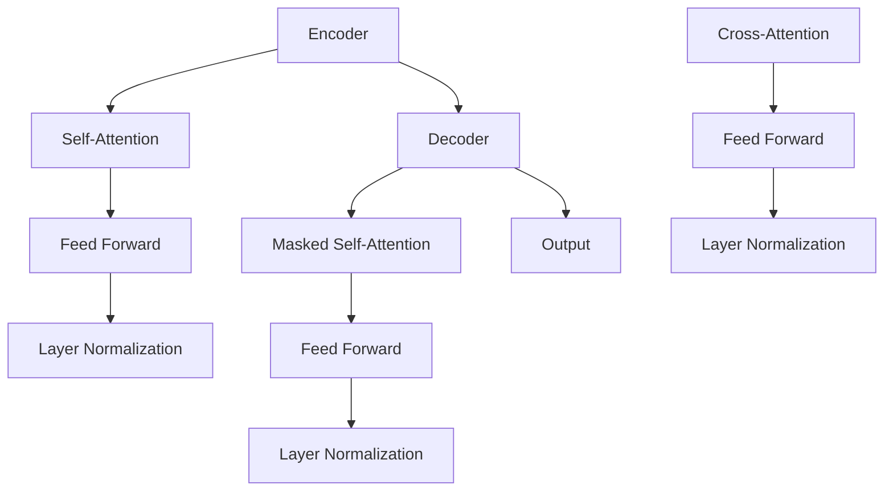

                 

# Transformer大模型实战：前馈网络层的深入剖析

> 关键词：Transformer、前馈网络、神经网络、深度学习、计算图、PyTorch、TensorFlow

> 摘要：本文深入探讨Transformer大模型中的前馈网络层，详细解析其工作原理、实现细节及实际应用场景。通过一步步的分析和实例讲解，读者将全面理解前馈网络层的核心作用，掌握其设计理念和实现方法，为实际项目开发打下坚实基础。

## 1. 背景介绍

### 1.1 目的和范围

本文旨在深入解析Transformer大模型中的前馈网络层，帮助读者理解其在神经网络中的重要性，掌握其设计原理和实现细节。我们将通过详细的理论分析和实际代码案例，使读者能够将所学知识应用于实际项目开发中。

### 1.2 预期读者

本文适合对深度学习和Transformer模型有一定了解的读者，特别是希望深入掌握前馈网络层的开发人员、研究人员和架构师。

### 1.3 文档结构概述

本文分为以下几个部分：

1. **背景介绍**：介绍本文的目的、预期读者和文档结构。
2. **核心概念与联系**：介绍Transformer模型和前馈网络层的基本概念，并通过Mermaid流程图展示其架构。
3. **核心算法原理 & 具体操作步骤**：详细讲解前馈网络层的算法原理，使用伪代码描述其实现步骤。
4. **数学模型和公式 & 详细讲解 & 举例说明**：介绍前馈网络层的数学模型，使用LaTeX格式展示关键公式，并提供实际应用案例。
5. **项目实战：代码实际案例和详细解释说明**：通过实际代码案例，详细解读前馈网络层的实现过程。
6. **实际应用场景**：探讨前馈网络层在不同场景下的应用。
7. **工具和资源推荐**：推荐学习资源和开发工具。
8. **总结：未来发展趋势与挑战**：总结前馈网络层的发展趋势和面临的挑战。
9. **附录：常见问题与解答**：回答读者可能遇到的问题。
10. **扩展阅读 & 参考资料**：提供进一步学习的资源。

### 1.4 术语表

#### 1.4.1 核心术语定义

- **Transformer模型**：一种基于自注意力机制的序列建模模型，广泛应用于自然语言处理、机器翻译等领域。
- **前馈网络层**：神经网络中的一个层次，数据沿一个方向流动，从输入层传递到输出层，不涉及反向传播。
- **激活函数**：对神经网络中的节点输出进行非线性变换的函数，如ReLU、Sigmoid、Tanh等。

#### 1.4.2 相关概念解释

- **序列建模**：根据序列的当前状态预测下一个状态的过程。
- **自注意力机制**：一种计算序列中每个元素之间依赖关系的机制，使模型能够关注序列中的关键信息。

#### 1.4.3 缩略词列表

- **Transformer**：Transformer模型
- **FFN**：前馈网络层
- **ReLU**：修正线性单元
- **Sigmoid**：S形函数
- **Tanh**：双曲正切函数

## 2. 核心概念与联系

### 2.1 Transformer模型简介

Transformer模型是一种基于自注意力机制的序列建模模型，由Vaswani等人于2017年提出。与传统的循环神经网络（RNN）和长短期记忆网络（LSTM）相比，Transformer模型在处理长距离依赖问题方面表现出色，已成为自然语言处理领域的标准模型之一。

### 2.2 前馈网络层的作用

前馈网络层是Transformer模型中的一个关键层次，位于自注意力机制和层归一化之间。前馈网络层的作用是进一步处理和转换输入序列，使其能够更好地适应不同任务的需求。通过前馈网络层，模型能够学习到更复杂的特征和模式。

### 2.3 Transformer模型架构

Transformer模型由多个相同的编码器和解码器层次组成，每个层次包含自注意力机制、前馈网络层和层归一化。以下是一个简单的Mermaid流程图，展示Transformer模型的架构：



在上述流程图中，A表示编码器，E表示解码器。每个层次中的自注意力机制和前馈网络层分别处理输入序列和输出序列，并通过层归一化提高模型性能。

## 3. 核心算法原理 & 具体操作步骤

### 3.1 前馈网络层的算法原理

前馈网络层是一种简单的全连接神经网络，由两个线性变换和激活函数组成。第一个线性变换将输入映射到一个中间层，第二个线性变换将中间层映射到输出层。中间层的激活函数通常采用ReLU函数，以引入非线性。

### 3.2 前馈网络层的操作步骤

以下是一个简单的前馈网络层实现步骤，使用伪代码描述：

```python
# 前馈网络层实现
def feed_forward(x, w1, w2, b1, b2, activation):
    # 第一个线性变换
    hidden = x @ w1 + b1
    # 应用激活函数
    hidden = activation(hidden)
    # 第二个线性变换
    output = hidden @ w2 + b2
    return output
```

在上面的代码中，`x`是输入数据，`w1`和`w2`是两个线性变换的权重矩阵，`b1`和`b2`是偏置项，`activation`是激活函数。

### 3.3 代码示例

以下是一个简单的代码示例，展示如何使用PyTorch实现前馈网络层：

```python
import torch
import torch.nn as nn

# 定义前馈网络层
class FeedForwardLayer(nn.Module):
    def __init__(self, input_dim, hidden_dim, output_dim):
        super(FeedForwardLayer, self).__init__()
        self.fc1 = nn.Linear(input_dim, hidden_dim)
        self.fc2 = nn.Linear(hidden_dim, output_dim)
        self.relu = nn.ReLU()

    def forward(self, x):
        x = self.fc1(x)
        x = self.relu(x)
        x = self.fc2(x)
        return x

# 实例化前馈网络层
ff_layer = FeedForwardLayer(10, 20, 30)

# 输入数据
x = torch.randn(5, 10)

# 前向传播
output = ff_layer(x)
print(output)
```

在上面的代码中，我们定义了一个名为`FeedForwardLayer`的PyTorch模块，该模块实现了前馈网络层的操作。通过实例化该模块并传入输入数据，我们可以得到前馈网络层的输出。

## 4. 数学模型和公式 & 详细讲解 & 举例说明

### 4.1 数学模型

前馈网络层的数学模型可以表示为：

$$
Y = \sigma(W_2 \cdot \sigma(W_1 \cdot X + B_1) + B_2)
$$

其中，$X$是输入数据，$W_1$和$W_2$是线性变换的权重矩阵，$B_1$和$B_2$是偏置项，$\sigma$是激活函数。

### 4.2 公式详细讲解

- **线性变换**：$X$经过第一个线性变换$W_1$得到中间层表示$Z$，即$Z = X \cdot W_1 + B_1$。
- **激活函数**：$Z$通过激活函数$\sigma$变换为新的表示$H$，常用的激活函数包括ReLU、Sigmoid和Tanh。
- **第二个线性变换**：$H$经过第二个线性变换$W_2$得到输出$Y$，即$Y = H \cdot W_2 + B_2$。

### 4.3 举例说明

以下是一个简单的举例，假设输入数据$X$是一个5维向量，隐藏层维度为10，输出层维度为3。根据上述公式，我们可以计算前馈网络层的输出：

```python
import torch
import torch.nn as nn

# 定义前馈网络层
class FeedForwardLayer(nn.Module):
    def __init__(self, input_dim, hidden_dim, output_dim):
        super(FeedForwardLayer, self).__init__()
        self.fc1 = nn.Linear(input_dim, hidden_dim)
        self.fc2 = nn.Linear(hidden_dim, output_dim)
        self.relu = nn.ReLU()

    def forward(self, x):
        x = self.fc1(x)
        x = self.relu(x)
        x = self.fc2(x)
        return x

# 实例化前馈网络层
ff_layer = FeedForwardLayer(5, 10, 3)

# 输入数据
x = torch.randn(5, 1)

# 前向传播
output = ff_layer(x)
print(output)
```

在上面的代码中，我们定义了一个前馈网络层，并使用随机生成的输入数据进行前向传播。输出结果为一个3维向量。

## 5. 项目实战：代码实际案例和详细解释说明

### 5.1 开发环境搭建

在开始实战之前，确保已安装以下开发环境和库：

- Python 3.8 或更高版本
- PyTorch 1.8 或更高版本
- TensorFlow 2.6 或更高版本

安装步骤如下：

```bash
pip install python==3.8
pip install pytorch==1.8
pip install tensorflow==2.6
```

### 5.2 源代码详细实现和代码解读

以下是一个简单的PyTorch代码案例，实现了一个包含前馈网络层的Transformer编码器：

```python
import torch
import torch.nn as nn

# 定义Transformer编码器
class TransformerEncoder(nn.Module):
    def __init__(self, input_dim, hidden_dim, output_dim):
        super(TransformerEncoder, self).__init__()
        self.self_attention = nn.MultiheadAttention(input_dim, hidden_dim)
        self.feed_forward = FeedForwardLayer(input_dim, hidden_dim, output_dim)
        self.layer_norm1 = nn.LayerNorm(input_dim)
        self.layer_norm2 = nn.LayerNorm(input_dim)

    def forward(self, x, mask=None):
        # 自注意力机制
        x = self.self_attention(x, x, x, attn_mask=mask)[0]
        x = self.layer_norm1(x)
        # 前馈网络层
        x = self.feed_forward(x)
        x = self.layer_norm2(x)
        return x

# 实例化编码器
encoder = TransformerEncoder(10, 20, 30)

# 输入数据
x = torch.randn(5, 10, 10)

# 前向传播
output = encoder(x)
print(output)
```

在上面的代码中，我们定义了一个`TransformerEncoder`类，其中包含自注意力机制、前馈网络层和层归一化。`forward`方法实现了前向传播过程。

### 5.3 代码解读与分析

- **自注意力机制**：`self_attention`是PyTorch中的`MultiheadAttention`模块，用于计算输入序列的注意力权重，并生成加权输出。
- **层归一化**：`layer_norm1`和`layer_norm2`是两个层归一化模块，用于标准化输入和输出，以提高模型性能。
- **前馈网络层**：`feed_forward`是我们之前定义的`FeedForwardLayer`模块，用于对输入进行线性变换和激活函数操作。

通过实例化编码器并传入输入数据，我们可以得到前馈网络层的输出。在实际项目中，可以根据具体需求调整输入维度、隐藏层维度和输出维度。

## 6. 实际应用场景

前馈网络层在Transformer模型中具有广泛的应用场景，以下是一些常见的实际应用：

- **自然语言处理**：在自然语言处理任务中，如文本分类、机器翻译和问答系统中，前馈网络层可以用于提取文本的深层特征，提高模型的性能。
- **计算机视觉**：在计算机视觉任务中，如图像分类、目标检测和语义分割中，前馈网络层可以与卷积神经网络（CNN）结合，增强模型的特征提取能力。
- **语音识别**：在语音识别任务中，前馈网络层可以用于对语音信号进行特征提取和转换，提高识别准确率。

通过合理设计前馈网络层的参数和结构，可以针对不同任务需求实现高效的模型性能。

## 7. 工具和资源推荐

### 7.1 学习资源推荐

#### 7.1.1 书籍推荐

- 《深度学习》（Goodfellow, Bengio, Courville著）：全面介绍深度学习的基础理论和实践方法。
- 《动手学深度学习》（Awn

