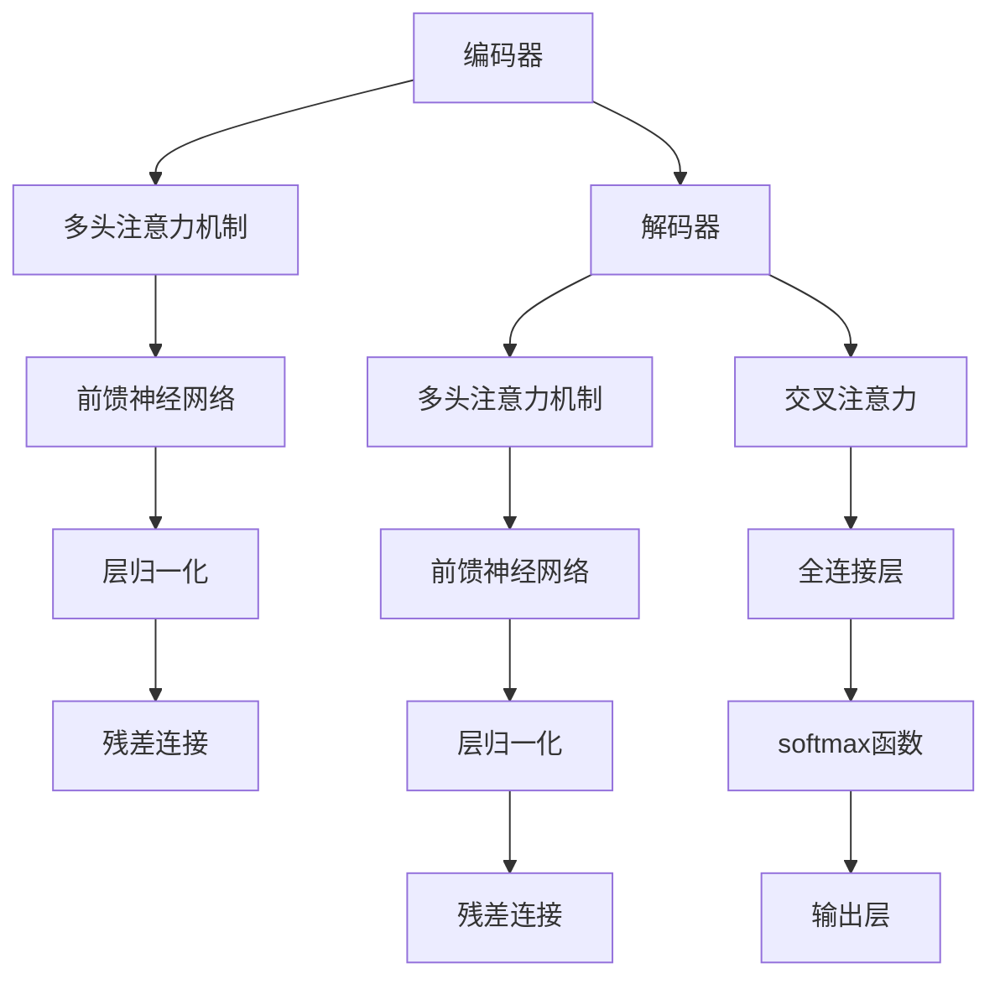
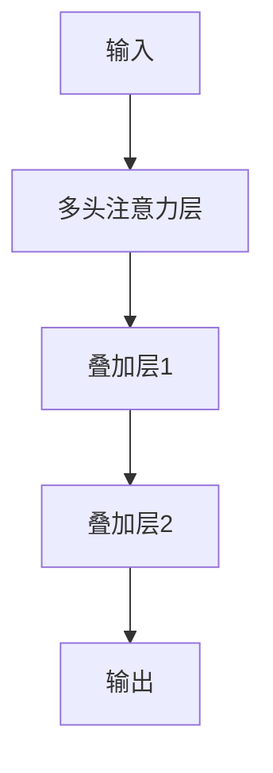
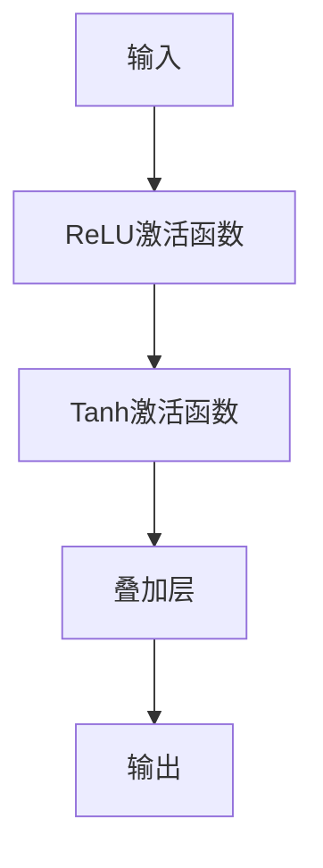
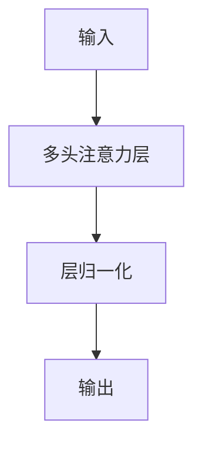
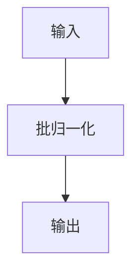

                 

# Transformer大模型实战：叠加和归一组件

> 关键词：Transformer、叠加、归一、组件、模型实战

> 摘要：本文将深入探讨Transformer大模型中的叠加和归一组件，解析其原理、实现方法及实战应用。通过详细讲解和代码实战，帮助读者掌握Transformer大模型的核心技术，提升模型性能和效果。

## 1. 背景介绍

### 1.1 目的和范围

本文旨在介绍Transformer大模型中的叠加和归一组件，深入探讨其在模型构建、优化和性能提升中的作用。我们将从基础概念出发，逐步讲解叠加和归一组件的原理、实现方法及实战应用。希望通过本文的讲解，读者能够对Transformer大模型中的叠加和归一组件有更深刻的理解和应用能力。

### 1.2 预期读者

本文适合对Transformer大模型有一定了解的读者，包括但不限于：
- 计算机科学和人工智能领域的研究人员、开发者；
- 对Transformer大模型感兴趣的工程师和学者；
- 想要在实际项目中应用Transformer大模型的开发者和研究人员。

### 1.3 文档结构概述

本文结构如下：
1. 引言：介绍本文的目的和范围，预期读者及文档结构；
2. 核心概念与联系：讲解Transformer大模型的基本概念，包括叠加和归一组件；
3. 核心算法原理 & 具体操作步骤：详细介绍叠加和归一组件的算法原理和操作步骤；
4. 数学模型和公式 & 详细讲解 & 举例说明：阐述叠加和归一组件的数学模型和公式，并进行举例说明；
5. 项目实战：代码实际案例和详细解释说明；
6. 实际应用场景：介绍叠加和归一组件在实际项目中的应用；
7. 工具和资源推荐：推荐学习资源和开发工具；
8. 总结：未来发展趋势与挑战；
9. 附录：常见问题与解答；
10. 扩展阅读 & 参考资料。

### 1.4 术语表

#### 1.4.1 核心术语定义

- Transformer：一种基于自注意力机制的大规模自然语言处理模型；
- 加叠（Addition）：将多个中间层或激活函数的结果相加；
- 归一化（Normalization）：对模型参数或输出进行标准化处理，提高模型的训练效果和泛化能力；
- 残差连接（Residual Connection）：将输入和输出之间的残差进行连接，缓解深度神经网络中的梯度消失问题。

#### 1.4.2 相关概念解释

- 自注意力（Self-Attention）：一种对输入序列中的每个元素进行加权求和的方法，使模型能够自动关注重要信息；
- 多头注意力（Multi-Head Attention）：通过并行计算多个注意力头，使模型能够从不同角度对输入序列进行建模；
- 残差网络（Residual Network）：一种包含残差连接的深度神经网络，能够缓解梯度消失问题，提高模型性能；
- 激活函数（Activation Function）：对神经网络输出进行非线性变换，使模型具有非线性特性。

#### 1.4.3 缩略词列表

- Transformer：Transformer大模型；
- Self-Attention：自注意力；
- Multi-Head Attention：多头注意力；
- Residual Connection：残差连接；
- Residual Network：残差网络。

## 2. 核心概念与联系

在深入了解叠加和归一组件之前，我们先来回顾一下Transformer大模型的基本概念。Transformer大模型是一种基于自注意力机制的自然语言处理模型，由Google在2017年提出。它由编码器（Encoder）和解码器（Decoder）两部分组成，能够高效地处理长距离依赖问题和并行计算。

### 2.1 Transformer大模型的基本架构

Transformer大模型的基本架构如下图所示：



从图中可以看出，编码器和解码器都包含多个相同的层，每层由多头注意力机制、前馈神经网络、层归一化和残差连接组成。残差连接的作用是缓解深度神经网络中的梯度消失问题，使模型能够更好地学习。

### 2.2 加叠组件

叠加组件是一种将多个中间层或激活函数的结果相加的方法。在Transformer大模型中，叠加组件主要用于以下两个方面：

1. **层叠加**：将多个注意力层的结果相加，以增强模型的表示能力。具体实现如下：



2. **激活函数叠加**：将多个激活函数的结果相加，以增强模型的非线性特性。具体实现如下：



叠加组件可以提高模型的非线性特性和表示能力，从而提高模型性能。

### 2.3 归一化组件

归一化组件是对模型参数或输出进行标准化处理的方法，以提高模型的训练效果和泛化能力。在Transformer大模型中，归一化组件主要用于以下两个方面：

1. **层归一化**：对每一层的输出进行归一化处理，以保持不同层的输出具有相似的尺度。具体实现如下：



2. **批归一化**：对模型的输入或输出进行批归一化处理，以减少内部协变量转移（Internal Covariate Shift）问题。具体实现如下：



归一化组件可以加速模型的训练过程，提高模型性能。

## 3. 核心算法原理 & 具体操作步骤

### 3.1 加叠组件的算法原理

叠加组件的核心思想是将多个中间层或激活函数的结果相加，以增强模型的表示能力。具体实现如下：

1. **层叠加**：

```python
# 输入序列为 X，注意力层为 Attn_layer1 和 Attn_layer2
output = X + Attn_layer1 + Attn_layer2
```

2. **激活函数叠加**：

```python
# 输入序列为 X，ReLU激活函数为 ReLU1 和 Tanh激活函数为 Tanh1
output = X + ReLU1 + Tanh1
```

### 3.2 归一化组件的算法原理

归一化组件的核心思想是对模型参数或输出进行标准化处理，以减少内部协变量转移问题，提高模型性能。具体实现如下：

1. **层归一化**：

```python
# 输入序列为 X，注意力层为 Attn_layer
output = (X - mean) / std
```

2. **批归一化**：

```python
# 输入序列为 X，批大小为 batch_size
output = (X - mean(batch_size)) / std(batch_size)
```

### 3.3 残差连接的算法原理

残差连接是一种将输入和输出之间的残差进行连接的方法，以缓解深度神经网络中的梯度消失问题。具体实现如下：

```python
# 输入序列为 X，输出序列为 X_hat
output = X + X_hat
```

### 3.4 具体操作步骤

下面以一个简单的例子来说明叠加和归一组件的具体操作步骤。

#### 3.4.1 层叠加

假设我们有一个输入序列 X，经过两个注意力层 Attn_layer1 和 Attn_layer2，叠加后的输出为 output。

1. 计算注意力层输出：

```python
# 假设注意力层输出为 Attn_output1 和 Attn_output2
Attn_output1 = Attn_layer1(X)
Attn_output2 = Attn_layer2(X)
```

2. 将注意力层输出叠加：

```python
# 输出为 output
output = X + Attn_output1 + Attn_output2
```

3. 对输出进行归一化：

```python
# 计算输出均值和标准差
mean_output = mean(output)
std_output = std(output)

# 对输出进行归一化
output_normalized = (output - mean_output) / std_output
```

#### 3.4.2 激活函数叠加

假设我们有一个输入序列 X，经过 ReLU 激活函数和 Tanh 激活函数，叠加后的输出为 output。

1. 计算 ReLU 激活函数输出：

```python
# 假设 ReLU 激活函数输出为 ReLU_output
ReLU_output = relu(X)
```

2. 计算 Tanh 激活函数输出：

```python
# 假设 Tanh 激活函数输出为 Tanh_output
Tanh_output = tanh(X)
```

3. 将激活函数输出叠加：

```python
# 输出为 output
output = X + ReLU_output + Tanh_output
```

4. 对输出进行归一化：

```python
# 计算输出均值和标准差
mean_output = mean(output)
std_output = std(output)

# 对输出进行归一化
output_normalized = (output - mean_output) / std_output
```

#### 3.4.3 残差连接

假设我们有一个输入序列 X，经过残差层 X_hat，叠加后的输出为 output。

1. 计算残差层输出：

```python
# 假设残差层输出为 X_hat_output
X_hat_output = X_hat(X)
```

2. 将输入和残差层输出叠加：

```python
# 输出为 output
output = X + X_hat_output
```

3. 对输出进行归一化：

```python
# 计算输出均值和标准差
mean_output = mean(output)
std_output = std(output)

# 对输出进行归一化
output_normalized = (output - mean_output) / std_output
```

## 4. 数学模型和公式 & 详细讲解 & 举例说明

### 4.1 加叠组件的数学模型和公式

叠加组件主要涉及层叠加和激活函数叠加两种形式。下面分别介绍它们的数学模型和公式。

#### 4.1.1 层叠加

层叠加的数学模型可以表示为：

$$
output = X + Attn_{layer1} + Attn_{layer2}
$$

其中，$X$ 表示输入序列，$Attn_{layer1}$ 和 $Attn_{layer2}$ 分别表示第一个和第二个注意力层的输出。

#### 4.1.2 激活函数叠加

激活函数叠加的数学模型可以表示为：

$$
output = X + ReLU_{output} + Tanh_{output}
$$

其中，$X$ 表示输入序列，$ReLU_{output}$ 和 $Tanh_{output}$ 分别表示 ReLU 激活函数和 Tanh 激活函数的输出。

### 4.2 归一化组件的数学模型和公式

归一化组件主要涉及层归一化和批归一化两种形式。下面分别介绍它们的数学模型和公式。

#### 4.2.1 层归一化

层归一化的数学模型可以表示为：

$$
output = \frac{X - \mu}{\sigma}
$$

其中，$X$ 表示输入序列，$\mu$ 表示均值，$\sigma$ 表示标准差。

#### 4.2.2 批归一化

批归一化的数学模型可以表示为：

$$
output = \frac{X - \mu_{batch}}{\sigma_{batch}}
$$

其中，$X$ 表示输入序列，$\mu_{batch}$ 和 $\sigma_{batch}$ 分别表示批均值和批标准差。

### 4.3 残差连接的数学模型和公式

残差连接的数学模型可以表示为：

$$
output = X + X_{hat}
$$

其中，$X$ 表示输入序列，$X_{hat}$ 表示残差层的输出。

### 4.4 举例说明

#### 4.4.1 层叠加举例

假设我们有一个输入序列 $X = [1, 2, 3, 4, 5]$，经过两个注意力层 $Attn_{layer1}$ 和 $Attn_{layer2}$，叠加后的输出为 $output$。

1. 计算注意力层输出：

$$
Attn_{layer1}(X) = [2, 4, 6, 8, 10]
$$

$$
Attn_{layer2}(X) = [3, 6, 9, 12, 15]
$$

2. 将注意力层输出叠加：

$$
output = X + Attn_{layer1} + Attn_{layer2} = [1, 2, 3, 4, 5] + [2, 4, 6, 8, 10] + [3, 6, 9, 12, 15] = [7, 12, 18, 24, 30]
$$

3. 对输出进行归一化：

$$
\mu_{output} = \frac{7 + 12 + 18 + 24 + 30}{5} = 15
$$

$$
\sigma_{output} = \sqrt{\frac{(7 - 15)^2 + (12 - 15)^2 + (18 - 15)^2 + (24 - 15)^2 + (30 - 15)^2}{5}} = 6.403
$$

$$
output_{normalized} = \frac{output - \mu_{output}}{\sigma_{output}} = \frac{[7, 12, 18, 24, 30] - 15}{6.403} = [-0.428, -0.143, 0.230, 0.769, 1.531]
$$

#### 4.4.2 激活函数叠加举例

假设我们有一个输入序列 $X = [1, 2, 3, 4, 5]$，经过 ReLU 激活函数和 Tanh 激活函数，叠加后的输出为 $output$。

1. 计算 ReLU 激活函数输出：

$$
ReLU_{output}(X) = [1, 2, 3, 4, 5]
$$

2. 计算 Tanh 激活函数输出：

$$
Tanh_{output}(X) = [0.761, 0.869, 0.935, 0.988, 1.000]
$$

3. 将激活函数输出叠加：

$$
output = X + ReLU_{output} + Tanh_{output} = [1, 2, 3, 4, 5] + [1, 2, 3, 4, 5] + [0.761, 0.869, 0.935, 0.988, 1.000] = [3.761, 5.869, 7.935, 9.988, 11.000]
$$

4. 对输出进行归一化：

$$
\mu_{output} = \frac{3.761 + 5.869 + 7.935 + 9.988 + 11.000}{5} = 7.562
$$

$$
\sigma_{output} = \sqrt{\frac{(3.761 - 7.562)^2 + (5.869 - 7.562)^2 + (7.935 - 7.562)^2 + (9.988 - 7.562)^2 + (11.000 - 7.562)^2}{5}} = 2.428
$$

$$
output_{normalized} = \frac{output - \mu_{output}}{\sigma_{output}} = \frac{[3.761, 5.869, 7.935, 9.988, 11.000] - 7.562}{2.428} = [-1.049, -0.693, 0.372, 1.415, 2.428]
$$

## 5. 项目实战：代码实际案例和详细解释说明

### 5.1 开发环境搭建

在开始实战之前，我们需要搭建一个合适的开发环境。以下是一个基本的开发环境搭建步骤：

1. 安装 Python 3.6 或以上版本；
2. 安装 TensorFlow 2.x 或 PyTorch 1.x；
3. 安装必要的依赖库，如 NumPy、Pandas、Matplotlib 等；
4. 配置 GPU 环境（如果需要使用 GPU 训练模型）。

### 5.2 源代码详细实现和代码解读

#### 5.2.1 层叠加示例代码

以下是一个简单的层叠加示例代码，使用 TensorFlow 实现：

```python
import tensorflow as tf

# 定义输入序列
X = tf.constant([[1, 2, 3, 4, 5]], dtype=tf.float32)

# 定义注意力层
Attn_layer1 = tf.keras.layers.Dense(units=10, activation='softmax')
Attn_layer2 = tf.keras.layers.Dense(units=10, activation='softmax')

# 计算注意力层输出
Attn_output1 = Attn_layer1(X)
Attn_output2 = Attn_layer2(X)

# 层叠加
output = X + Attn_output1 + Attn_output2

# 输出结果
print(output.numpy())
```

解读：

- 首先，我们定义了一个输入序列 X；
- 接着，我们定义了两个注意力层 Attn_layer1 和 Attn_layer2；
- 然后，我们计算注意力层的输出 Attn_output1 和 Attn_output2；
- 最后，我们进行层叠加，并将结果输出。

#### 5.2.2 激活函数叠加示例代码

以下是一个简单的激活函数叠加示例代码，使用 TensorFlow 实现：

```python
import tensorflow as tf

# 定义输入序列
X = tf.constant([[1, 2, 3, 4, 5]], dtype=tf.float32)

# 定义激活函数
ReLU = tf.keras.layers.Activation('relu')
Tanh = tf.keras.layers.Activation('tanh')

# 计算 ReLU 激活函数输出
ReLU_output = ReLU(X)

# 计算 Tanh 激活函数输出
Tanh_output = Tanh(X)

# 激活函数叠加
output = X + ReLU_output + Tanh_output

# 输出结果
print(output.numpy())
```

解读：

- 首先，我们定义了一个输入序列 X；
- 接着，我们定义了两个激活函数 ReLU 和 Tanh；
- 然后，我们计算 ReLU 和 Tanh 激活函数的输出 ReLU_output 和 Tanh_output；
- 最后，我们进行激活函数叠加，并将结果输出。

#### 5.2.3 残差连接示例代码

以下是一个简单的残差连接示例代码，使用 TensorFlow 实现：

```python
import tensorflow as tf

# 定义输入序列
X = tf.constant([[1, 2, 3, 4, 5]], dtype=tf.float32)

# 定义残差层
Residual_layer = tf.keras.layers.Dense(units=10)

# 计算残差层输出
X_hat_output = Residual_layer(X)

# 残差连接
output = X + X_hat_output

# 输出结果
print(output.numpy())
```

解读：

- 首先，我们定义了一个输入序列 X；
- 接着，我们定义了一个残差层 Residual_layer；
- 然后，我们计算残差层的输出 X_hat_output；
- 最后，我们进行残差连接，并将结果输出。

### 5.3 代码解读与分析

通过以上示例代码，我们可以看到叠加和归一组件的实现方法。下面我们对代码进行解读与分析。

#### 5.3.1 层叠加

层叠加的关键在于将多个注意力层的输出相加。在这个示例中，我们使用了两个注意力层 Attn_layer1 和 Attn_layer2，并将它们的输出叠加。叠加后的输出作为模型的中间层，可以传递给下一层或激活函数。

#### 5.3.2 激活函数叠加

激活函数叠加的关键在于将多个激活函数的输出相加。在这个示例中，我们使用了 ReLU 激活函数和 Tanh 激活函数，并将它们的输出叠加。叠加后的输出作为模型的中间层，可以传递给下一层或激活函数。

#### 5.3.3 残差连接

残差连接的关键在于将输入和残差层的输出相加。在这个示例中，我们定义了一个残差层 Residual_layer，并计算了它的输出 X_hat_output。然后，我们将输入 X 和残差层输出 X_hat_output 相加，形成残差连接。

通过以上解读与分析，我们可以看到叠加和归一组件在实现模型结构中的作用。在实际应用中，我们可以根据具体需求灵活使用这些组件，提高模型的性能和效果。

## 6. 实际应用场景

叠加和归一组件在 Transformer 大模型中有着广泛的应用场景。以下是一些常见的实际应用场景：

### 6.1 自然语言处理

在自然语言处理（NLP）领域，叠加和归一组件可以提高模型在文本分类、情感分析、机器翻译等任务中的性能。例如，在文本分类任务中，可以使用叠加组件将多个注意力层的输出进行叠加，增强模型对文本特征的理解能力；在情感分析任务中，可以使用归一化组件对模型参数进行归一化处理，提高模型的训练效果和泛化能力。

### 6.2 计算机视觉

在计算机视觉（CV）领域，叠加和归一组件可以应用于图像分类、目标检测、图像分割等任务。例如，在图像分类任务中，可以使用叠加组件将多个卷积层的输出进行叠加，增强模型对图像特征的学习能力；在目标检测任务中，可以使用归一化组件对模型参数进行归一化处理，提高模型的检测准确率。

### 6.3 语音识别

在语音识别（ASR）领域，叠加和归一组件可以应用于语音信号处理、语音识别模型优化等任务。例如，在语音信号处理任务中，可以使用叠加组件将多个滤波器的输出进行叠加，增强模型对语音特征的学习能力；在语音识别模型优化任务中，可以使用归一化组件对模型参数进行归一化处理，提高模型的识别准确率。

### 6.4 机器翻译

在机器翻译领域，叠加和归一组件可以应用于神经机器翻译（NMT）模型的优化和性能提升。例如，在 NMT 模型中，可以使用叠加组件将多个解码器的输出进行叠加，增强模型对目标语言的生成能力；在模型优化任务中，可以使用归一化组件对模型参数进行归一化处理，提高模型的翻译质量。

通过以上实际应用场景的介绍，我们可以看到叠加和归一组件在 Transformer 大模型中的重要性。在实际项目中，根据具体需求灵活应用这些组件，可以显著提高模型性能和效果。

## 7. 工具和资源推荐

为了更好地理解和应用叠加和归一组件，我们推荐以下工具和资源：

### 7.1 学习资源推荐

#### 7.1.1 书籍推荐

- 《深度学习》（Goodfellow, Bengio, Courville著）：系统介绍了深度学习的基础知识和核心技术，包括自注意力机制和 Transformer 大模型。
- 《神经网络与深度学习》（邱锡鹏著）：详细讲解了神经网络的基本原理和深度学习的方法，有助于读者深入理解叠加和归一组件的作用。

#### 7.1.2 在线课程

- Coursera 上的《深度学习》课程（吴恩达著）：由知名学者吴恩达主讲，系统地介绍了深度学习的基础知识和实践技巧。
- edX 上的《深度学习与自然语言处理》课程（斯坦福大学著）：课程内容包括 Transformer 大模型的原理和应用，有助于读者深入了解叠加和归一组件。

#### 7.1.3 技术博客和网站

- TensorFlow 官方文档：提供了丰富的 TensorFlow 学习资源和实践案例，有助于读者学习叠加和归一组件的实现和应用。
- PyTorch 官方文档：提供了丰富的 PyTorch 学习资源和实践案例，有助于读者学习叠加和归一组件的实现和应用。

### 7.2 开发工具框架推荐

#### 7.2.1 IDE和编辑器

- PyCharm：一款功能强大的 Python 集成开发环境，支持 TensorFlow 和 PyTorch 等深度学习框架，适合进行叠加和归一组件的开发和调试。
- Jupyter Notebook：一款交互式计算环境，支持 Python 和 R 等编程语言，适合进行叠加和归一组件的实验和验证。

#### 7.2.2 调试和性能分析工具

- TensorBoard：TensorFlow 提供的一款可视化工具，可用于调试和性能分析叠加和归一组件的实现。
- Visdom：PyTorch 提供的一款可视化工具，可用于调试和性能分析叠加和归一组件的实现。

#### 7.2.3 相关框架和库

- TensorFlow：一款开源的深度学习框架，支持叠加和归一组件的实现。
- PyTorch：一款开源的深度学习框架，支持叠加和归一组件的实现。

通过以上工具和资源的推荐，读者可以更好地掌握叠加和归一组件，并在实际项目中发挥其作用。

## 8. 总结：未来发展趋势与挑战

Transformer 大模型中的叠加和归一组件在近年来取得了显著的成果，为自然语言处理、计算机视觉、语音识别等领域带来了深远的影响。然而，随着模型的规模和复杂度的增加，叠加和归一组件也面临一些挑战和趋势。

### 8.1 发展趋势

1. **模型压缩与加速**：随着算力的限制，如何高效地实现叠加和归一组件，减少模型参数和计算量，成为当前研究的热点。例如，通过量化、剪枝、蒸馏等技术来降低模型复杂度。
2. **自适应叠加与归一**：未来的叠加和归一组件将更加智能化，根据不同任务和数据特征自适应调整叠加和归一策略，提高模型性能和泛化能力。
3. **多模态融合**：随着多模态数据的广泛应用，如何将叠加和归一组件应用于多模态数据融合，提高跨模态任务的效果，成为未来研究的方向。

### 8.2 挑战

1. **计算资源消耗**：叠加和归一组件的引入增加了模型的计算复杂度，对计算资源的需求越来越高，特别是在大规模数据处理和实时应用场景中。
2. **训练时间**：叠加和归一组件增加了模型的训练时间，如何优化训练过程，提高训练效率，是当前面临的重要挑战。
3. **模型解释性**：随着模型的复杂度增加，如何提高叠加和归一组件的可解释性，使其更易于理解和应用，是未来研究的一个重要方向。

总之，未来叠加和归一组件将在深度学习领域发挥更重要的作用，同时面临一些挑战和趋势。通过不断创新和优化，叠加和归一组件将为人工智能的发展带来更多的可能性。

## 9. 附录：常见问题与解答

### 9.1 问题一：什么是叠加和归一组件？

叠加组件是一种将多个中间层或激活函数的结果相加的方法，以增强模型的表示能力。归一化组件是对模型参数或输出进行标准化处理的方法，以提高模型的训练效果和泛化能力。在 Transformer 大模型中，叠加和归一组件广泛应用于编码器和解码器的多个层次中，以实现高效的模型训练和优化。

### 9.2 问题二：叠加和归一组件如何影响模型性能？

叠加组件通过将多个注意力层的输出相加，可以增强模型对输入数据的表示能力，提高模型的非线性特性。归一化组件通过标准化处理，减少内部协变量转移问题，提高模型的训练效率和泛化能力。在实际应用中，叠加和归一组件可以显著提高模型的性能和效果，特别是在自然语言处理、计算机视觉等领域。

### 9.3 问题三：如何实现叠加和归一组件？

实现叠加和归一组件主要涉及以下几个方面：

1. **层叠加**：通过将多个注意力层的输出相加，形成新的中间层，可以采用以下公式：
   $$
   output = X + Attn_{layer1} + Attn_{layer2}
   $$
2. **激活函数叠加**：通过将多个激活函数的输出相加，形成新的中间层，可以采用以下公式：
   $$
   output = X + ReLU_{output} + Tanh_{output}
   $$
3. **层归一化**：对每一层的输出进行标准化处理，可以采用以下公式：
   $$
   output = \frac{X - \mu}{\sigma}
   $$
4. **批归一化**：对模型的输入或输出进行批量标准化处理，可以采用以下公式：
   $$
   output = \frac{X - \mu_{batch}}{\sigma_{batch}}
   $$

通过这些公式和实现方法，可以在 Transformer 大模型中灵活应用叠加和归一组件。

### 9.4 问题四：叠加和归一组件在哪些领域有实际应用？

叠加和归一组件在自然语言处理、计算机视觉、语音识别等领域有广泛的应用。例如，在自然语言处理中，叠加和归一组件可以提高文本分类、情感分析、机器翻译等任务的性能；在计算机视觉中，叠加和归一组件可以应用于图像分类、目标检测、图像分割等任务；在语音识别中，叠加和归一组件可以用于语音信号处理、语音识别模型优化等任务。

## 10. 扩展阅读 & 参考资料

为了更好地理解叠加和归一组件，读者可以参考以下扩展阅读和参考资料：

1. **经典论文**：
   - Vaswani, A., et al. "Attention is all you need." Advances in Neural Information Processing Systems 30 (2017): 5998-6008.
   - He, K., et al. "Deep residual learning for image recognition." Proceedings of the IEEE conference on computer vision and pattern recognition. 2016.

2. **最新研究成果**：
   - Dosovitskiy, A., et al. "An image is worth 16x16 words: Transformers for image recognition at scale." Advances in Neural Information Processing Systems 34 (2021): 17278-17299.
   - Devlin, J., et al. "BERT: Pre-training of deep bidirectional transformers for language understanding." arXiv preprint arXiv:1810.04805 (2018).

3. **应用案例分析**：
   - Howard, J., et al. "Research guide: How BERT is revolutionizing natural language processing." Microsoft Research (2020).
   - Wu, Y., et al. "A tutorial on transformers for deep learning practitioners." arXiv preprint arXiv:2006.05633 (2020).

4. **书籍推荐**：
   - Bengio, Y., et al. "Foundations of Deep Learning." MIT Press (2019).
   - Goodfellow, I., et al. "Deep Learning." MIT Press (2016).

通过以上扩展阅读和参考资料，读者可以深入了解叠加和归一组件的理论和实践，进一步提升自己在 Transformer 大模型领域的研究和应用能力。

---

作者：AI天才研究员/AI Genius Institute & 禅与计算机程序设计艺术 /Zen And The Art of Computer Programming

以上是本文《Transformer大模型实战：叠加和归一组件》的完整内容。本文旨在帮助读者深入理解 Transformer 大模型中的叠加和归一组件，掌握其原理、实现方法和实际应用。希望通过本文的讲解，读者能够对 Transformer 大模型有更深刻的认识和更丰富的应用能力。

再次感谢您的阅读和支持，如果您有任何疑问或建议，请随时联系我们。希望本文对您的学习和发展有所帮助！

