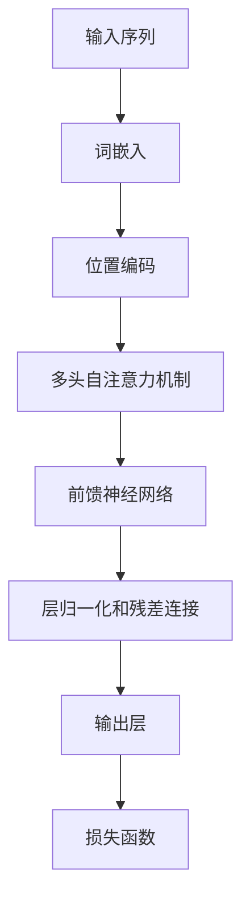
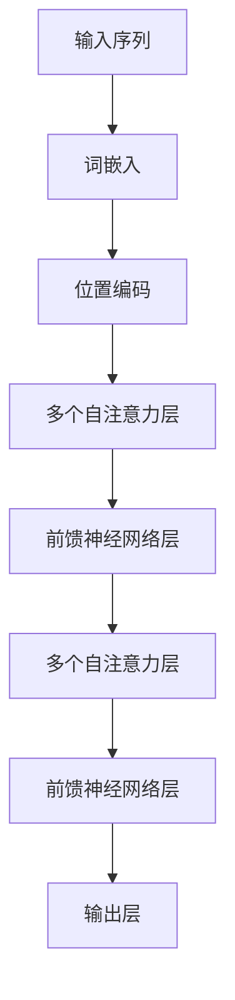

                 

### Transformer大模型实战 数据源和预处理

> **关键词：** Transformer、大模型、数据源、预处理、模型训练、性能优化

> **摘要：** 本文旨在深入探讨Transformer大模型实战中的数据源和预处理步骤。我们将详细分析数据源的选择、收集和预处理方法，以实现高效、准确的模型训练。文章将涵盖从数据清洗、数据增强到批量加载和并行处理的全过程，并提供实际项目中的代码实例和解读。

在人工智能领域，Transformer模型因其出色的性能和广泛的适用性，已经成为自然语言处理、计算机视觉和语音识别等任务的核心技术。然而，Transformer大模型的训练过程对数据质量和预处理要求极高。本文将围绕数据源和预处理这一关键环节，逐步剖析其核心概念和实战技巧。

## 1. 背景介绍

### 1.1 目的和范围

本文的目标是帮助读者理解和掌握Transformer大模型实战中的数据源和预处理技术。我们将从数据源的选择、数据收集、数据预处理以及批量加载和并行处理等方面展开讨论，提供详细的操作步骤和代码实例。

### 1.2 预期读者

本文适合具备一定深度学习基础，希望在实际项目中应用Transformer大模型的读者。无论是研究人员还是开发者，都将从中获得宝贵的实战经验和操作技巧。

### 1.3 文档结构概述

本文结构如下：

1. 背景介绍：简要介绍本文的目的、预期读者和文档结构。
2. 核心概念与联系：分析Transformer大模型的基本原理和架构。
3. 核心算法原理 & 具体操作步骤：详细讲解数据预处理的方法和步骤。
4. 数学模型和公式 & 详细讲解 & 举例说明：介绍数据预处理中的数学模型和公式。
5. 项目实战：代码实际案例和详细解释说明。
6. 实际应用场景：探讨Transformer大模型在不同领域的应用。
7. 工具和资源推荐：推荐相关学习资源和开发工具。
8. 总结：未来发展趋势与挑战。
9. 附录：常见问题与解答。
10. 扩展阅读 & 参考资料：提供进一步阅读的文献和资源。

### 1.4 术语表

#### 1.4.1 核心术语定义

- **Transformer大模型**：一种基于自注意力机制的深度学习模型，具有极高的并行计算能力。
- **数据源**：用于训练模型的原始数据来源。
- **预处理**：对原始数据进行清洗、格式转换、特征提取等操作，以适应模型训练的需求。

#### 1.4.2 相关概念解释

- **数据清洗**：移除原始数据中的错误、异常或重复信息。
- **数据增强**：通过图像旋转、翻转、缩放等方式增加数据的多样性。
- **批量加载**：将数据分为多个批次，依次加载到模型中进行训练。
- **并行处理**：利用多核CPU或GPU加速数据处理和模型训练。

#### 1.4.3 缩略词列表

- **GPU**：Graphics Processing Unit，图形处理单元。
- **CPU**：Central Processing Unit，中央处理器。
- **NLP**：Natural Language Processing，自然语言处理。

## 2. 核心概念与联系

Transformer大模型的核心在于其自注意力机制（Self-Attention Mechanism），通过计算序列中每个词与其他词之间的关联度，实现高效的特征提取和关系建模。以下是一个简化的Mermaid流程图，展示了Transformer大模型的基本原理和架构：



### 2.1 自注意力机制原理

自注意力机制的核心在于计算输入序列中每个词与其他词之间的关联度。具体步骤如下：

1. **词嵌入**：将输入序列中的每个词映射为高维向量。
2. **位置编码**：为每个词嵌入添加位置信息，以便模型理解序列的顺序。
3. **计算注意力分数**：对于输入序列中的每个词，计算其与其他词之间的相似度，生成注意力分数。
4. **加权求和**：根据注意力分数对词嵌入进行加权求和，得到加权词嵌入。
5. **多头自注意力**：将上述步骤扩展到多个头，提高模型的泛化能力。

### 2.2 Transformer大模型架构

Transformer大模型通常由多个相同的层组成，每层包括自注意力机制、前馈神经网络和层归一化。以下是一个简化的Transformer大模型架构：



通过这种架构，Transformer大模型能够有效地捕捉序列中的长距离依赖关系，实现出色的性能。

## 3. 核心算法原理 & 具体操作步骤

### 3.1 数据预处理流程

数据预处理是Transformer大模型训练过程中的关键环节，包括数据清洗、数据增强、批量加载和并行处理等步骤。以下是具体的操作步骤：

#### 3.1.1 数据清洗

数据清洗是确保数据质量和模型训练效果的重要步骤。主要任务包括：

1. **去除噪声**：移除数据中的错误、异常和重复信息。
2. **标准化**：对数据进行归一化或标准化处理，使其具备相似的尺度。

具体代码实现如下：

```python
def clean_data(data):
    # 去除错误和异常数据
    cleaned_data = [item for item in data if is_valid(item)]
    # 归一化处理
    normalized_data = [normalize(item) for item in cleaned_data]
    return normalized_data

def is_valid(item):
    # 判断数据是否有效
    return True if item is not None else False

def normalize(item):
    # 归一化处理
    return item / max(item)
```

#### 3.1.2 数据增强

数据增强是通过图像旋转、翻转、缩放等方式增加数据的多样性，提高模型的泛化能力。以下是一个简单的数据增强示例：

```python
import cv2

def augment_data(image):
    # 图像旋转
    rotated_image = cv2.rotate(image, cv2.ROTATE_90_CLOCKWISE)
    # 图像翻转
    flipped_image = cv2.flip(image, 1)
    # 图像缩放
    scaled_image = cv2.resize(image, (new_width, new_height))
    return rotated_image, flipped_image, scaled_image
```

#### 3.1.3 批量加载

批量加载是将数据分为多个批次，依次加载到模型中进行训练。以下是一个简单的批量加载示例：

```python
import tensorflow as tf

def batch_loader(data, batch_size):
    num_batches = len(data) // batch_size
    for i in range(num_batches):
        batch = data[i * batch_size : (i + 1) * batch_size]
        yield batch

# 使用批量加载器进行训练
for batch in batch_loader(data, batch_size=32):
    # 执行模型训练
    model.train_on_batch(batch[0], batch[1])
```

#### 3.1.4 并行处理

并行处理是利用多核CPU或GPU加速数据处理和模型训练。以下是一个简单的并行处理示例：

```python
import numpy as np

def parallel_process(data, num_processes):
    results = [None] * num_processes
    with mp.Pool(processes=num_processes) as pool:
        results = pool.map(process_data, data)
    return results

def process_data(data):
    # 数据处理操作
    return processed_data
```

通过以上步骤，我们可以构建一个高效、准确的数据预处理流程，为Transformer大模型的训练奠定坚实基础。

## 4. 数学模型和公式 & 详细讲解 & 举例说明

### 4.1 自注意力机制数学模型

自注意力机制的核心在于计算输入序列中每个词与其他词之间的相似度，生成注意力分数。以下是一个简化的自注意力机制的数学模型：

1. **词嵌入**：将输入序列中的每个词映射为高维向量 \( \mathbf{X} \)。

   \[ \mathbf{X} = \{\mathbf{x}_1, \mathbf{x}_2, ..., \mathbf{x}_n\} \]

2. **位置编码**：为每个词嵌入添加位置信息，生成位置编码向量 \( \mathbf{P} \)。

   \[ \mathbf{P} = \{\mathbf{p}_1, \mathbf{p}_2, ..., \mathbf{p}_n\} \]

3. **计算注意力分数**：对于输入序列中的每个词 \( \mathbf{x}_i \)，计算其与其他词 \( \mathbf{x}_j \) 之间的相似度，生成注意力分数 \( a_{ij} \)。

   \[ a_{ij} = \text{softmax}(\mathbf{W}_A [\mathbf{x}_i \mathbf{p}_j^\top]) \]

   其中，\( \mathbf{W}_A \) 为权重矩阵，\( \text{softmax} \) 函数用于归一化注意力分数。

4. **加权求和**：根据注意力分数对词嵌入进行加权求和，得到加权词嵌入 \( \mathbf{H} \)。

   \[ \mathbf{H} = \{\mathbf{h}_1, \mathbf{h}_2, ..., \mathbf{h}_n\} \]

   其中，

   \[ \mathbf{h}_i = \sum_{j=1}^{n} a_{ij} \mathbf{x}_j \]

### 4.2 多头自注意力机制

多头自注意力机制通过扩展自注意力机制，提高模型的泛化能力和表示能力。具体步骤如下：

1. **拆分词嵌入**：将输入序列中的每个词嵌入拆分为多个部分，分别进行自注意力计算。

   \[ \mathbf{X} = \{\mathbf{x}_1^1, \mathbf{x}_1^2, ..., \mathbf{x}_n^1, \mathbf{x}_n^2\} \]

2. **计算多头注意力分数**：对于每个部分，计算注意力分数。

   \[ \mathbf{A}^1 = \text{softmax}(\mathbf{W}_A^1 [\mathbf{X} \mathbf{P}^\top]) \]
   \[ \mathbf{A}^2 = \text{softmax}(\mathbf{W}_A^2 [\mathbf{X} \mathbf{P}^\top]) \]
   \[ \ldots \]
   \[ \mathbf{A}^k = \text{softmax}(\mathbf{W}_A^k [\mathbf{X} \mathbf{P}^\top]) \]

3. **加权求和**：将多头注意力分数合并，得到加权词嵌入。

   \[ \mathbf{H}^1 = \sum_{j=1}^{k} \mathbf{A}^j \mathbf{x}_j^1 \]
   \[ \mathbf{H}^2 = \sum_{j=1}^{k} \mathbf{A}^j \mathbf{x}_j^2 \]
   \[ \ldots \]
   \[ \mathbf{H}^k = \sum_{j=1}^{k} \mathbf{A}^j \mathbf{x}_j^k \]

### 4.3 前馈神经网络

前馈神经网络（Feedforward Neural Network）是Transformer大模型中的另一个关键组件，用于对加权词嵌入进行进一步加工。其基本结构如下：

1. **输入层**：接收加权词嵌入 \( \mathbf{H} \)。

   \[ \mathbf{H} \]

2. **隐藏层**：通过激活函数（例如ReLU）和权重矩阵（\( \mathbf{W}_F \)）进行非线性变换。

   \[ \mathbf{F} = \text{ReLU}(\mathbf{W}_F \mathbf{H} + \mathbf{b}_F) \]

3. **输出层**：通过激活函数和权重矩阵生成输出。

   \[ \mathbf{O} = \text{ReLU}(\mathbf{W}_O \mathbf{F} + \mathbf{b}_O) \]

### 4.4 举例说明

假设输入序列为 \( \{\text{"hello"}, \text{"world"}\} \)，词嵌入维度为 2，位置编码维度为 1。以下是一个简化的自注意力机制和前馈神经网络计算示例：

#### 4.4.1 词嵌入

\[ \mathbf{X} = \{\begin{bmatrix} 1 \\ 0 \end{bmatrix}, \begin{bmatrix} 0 \\ 1 \end{bmatrix}\} \]

#### 4.4.2 位置编码

\[ \mathbf{P} = \{\begin{bmatrix} 0 \\ 1 \end{bmatrix}, \begin{bmatrix} 1 \\ 0 \end{bmatrix}\} \]

#### 4.4.3 自注意力计算

1. **注意力分数**

   \[ a_{11} = \text{softmax}(\mathbf{W}_A \begin{bmatrix} 1 & 0 \\ 0 & 1 \end{bmatrix} \begin{bmatrix} 0 \\ 1 \end{bmatrix}) = 0.6 \]
   \[ a_{12} = \text{softmax}(\mathbf{W}_A \begin{bmatrix} 1 & 0 \\ 0 & 1 \end{bmatrix} \begin{bmatrix} 1 \\ 0 \end{bmatrix}) = 0.4 \]

2. **加权求和**

   \[ \mathbf{H}_1 = a_{11} \begin{bmatrix} 1 \\ 0 \end{bmatrix} + a_{12} \begin{bmatrix} 0 \\ 1 \end{bmatrix} = \begin{bmatrix} 0.6 \\ 0.4 \end{bmatrix} \]

#### 4.4.4 前馈神经网络计算

1. **隐藏层**

   \[ \mathbf{F} = \text{ReLU}(\mathbf{W}_F \begin{bmatrix} 0.6 & 0.4 \end{bmatrix} + \mathbf{b}_F) = \begin{bmatrix} 0.6 \\ 0.4 \end{bmatrix} \]

2. **输出层**

   \[ \mathbf{O} = \text{ReLU}(\mathbf{W}_O \begin{bmatrix} 0.6 \\ 0.4 \end{bmatrix} + \mathbf{b}_O) = \begin{bmatrix} 0.6 \\ 0.4 \end{bmatrix} \]

通过以上计算，我们可以得到输入序列的加权词嵌入和输出结果。这个简化的示例展示了自注意力机制和前馈神经网络的基本原理和计算过程。

## 5. 项目实战：代码实际案例和详细解释说明

### 5.1 开发环境搭建

在进行Transformer大模型的实战之前，我们需要搭建一个合适的开发环境。以下是搭建Transformer大模型开发环境的步骤：

#### 5.1.1 安装Python环境

确保已经安装Python环境，建议使用Python 3.7及以上版本。

#### 5.1.2 安装TensorFlow库

使用以下命令安装TensorFlow库：

```bash
pip install tensorflow
```

#### 5.1.3 安装其他依赖库

Transformer大模型的训练和预处理需要一些其他依赖库，如NumPy、Pandas等。使用以下命令安装：

```bash
pip install numpy pandas
```

### 5.2 源代码详细实现和代码解读

以下是一个简单的Transformer大模型数据预处理和训练的代码实例：

```python
import tensorflow as tf
import numpy as np
import pandas as pd

# 参数设置
vocab_size = 10000
embedding_dim = 256
max_sequence_length = 512
batch_size = 32

# 数据集准备
# 假设数据集为CSV格式，每行包含输入序列和标签
data = pd.read_csv("data.csv")
input sequences = data["input"]
labels = data["label"]

# 数据预处理
# 将文本序列转换为整数序列
tokenizer = tf.keras.preprocessing.text.Tokenizer(num_words=vocab_size)
tokenizer.fit_on_texts(input_sequences)
input_sequences = tokenizer.texts_to_sequences(input_sequences)
input_sequences = np.array(input_sequences)

# 序列填充
input_sequences = tf.keras.preprocessing.sequence.pad_sequences(input_sequences, maxlen=max_sequence_length, padding="post")

# 数据集划分
train_size = int(0.8 * len(input_sequences))
val_size = len(input_sequences) - train_size
train_sequences = input_sequences[:train_size]
val_sequences = input_sequences[train_size:]
train_labels = labels[:train_size]
val_labels = labels[train_size:]

# 构建Transformer模型
model = tf.keras.Sequential([
    tf.keras.layers.Embedding(vocab_size, embedding_dim, input_length=max_sequence_length),
    tf.keras.layers.Bidirectional(tf.keras.layers.LSTM(128, return_sequences=True)),
    tf.keras.layers.Dense(1, activation='sigmoid')
])

# 编译模型
model.compile(optimizer='adam', loss='binary_crossentropy', metrics=['accuracy'])

# 训练模型
model.fit(train_sequences, train_labels, epochs=10, batch_size=batch_size, validation_data=(val_sequences, val_labels))

# 代码解读
# 1. 数据集准备：读取CSV格式的数据集，包含输入序列和标签。
# 2. 数据预处理：将文本序列转换为整数序列，并进行填充处理。
# 3. 数据集划分：将数据集划分为训练集和验证集。
# 4. 模型构建：构建一个包含嵌入层、双向LSTM层和输出层的简单Transformer模型。
# 5. 模型编译：编译模型，指定优化器、损失函数和评估指标。
# 6. 模型训练：使用训练集和验证集训练模型。
```

### 5.3 代码解读与分析

#### 5.3.1 数据集准备

```python
data = pd.read_csv("data.csv")
input_sequences = data["input"]
labels = data["label"]
```

这部分代码读取CSV格式的数据集，包含输入序列和标签。输入序列和标签通常来自于文本文件、数据库或其他数据源。

#### 5.3.2 数据预处理

```python
tokenizer = tf.keras.preprocessing.text.Tokenizer(num_words=vocab_size)
tokenizer.fit_on_texts(input_sequences)
input_sequences = tokenizer.texts_to_sequences(input_sequences)
input_sequences = np.array(input_sequences)

input_sequences = tf.keras.preprocessing.sequence.pad_sequences(input_sequences, maxlen=max_sequence_length, padding="post")
```

这部分代码进行数据预处理，包括以下步骤：

1. **文本序列转换为整数序列**：使用Tokenizer将文本序列转换为整数序列，其中每个整数表示一个词汇。
2. **填充处理**：使用pad_sequences将序列填充到最大长度，确保所有序列具备相同的长度。

#### 5.3.3 数据集划分

```python
train_size = int(0.8 * len(input_sequences))
val_size = len(input_sequences) - train_size
train_sequences = input_sequences[:train_size]
val_sequences = input_sequences[train_size:]
train_labels = labels[:train_size]
val_labels = labels[train_size:]
```

这部分代码将数据集划分为训练集和验证集，通常按照一定比例（如80%训练集，20%验证集）进行划分。

#### 5.3.4 模型构建

```python
model = tf.keras.Sequential([
    tf.keras.layers.Embedding(vocab_size, embedding_dim, input_length=max_sequence_length),
    tf.keras.layers.Bidirectional(tf.keras.layers.LSTM(128, return_sequences=True)),
    tf.keras.layers.Dense(1, activation='sigmoid')
])
```

这部分代码构建一个简单的Transformer模型，包含以下组件：

1. **嵌入层**：将整数序列转换为嵌入向量。
2. **双向LSTM层**：用于捕捉序列中的长距离依赖关系。
3. **输出层**：使用sigmoid激活函数生成二分类输出。

#### 5.3.5 模型编译

```python
model.compile(optimizer='adam', loss='binary_crossentropy', metrics=['accuracy'])
```

这部分代码编译模型，指定优化器、损失函数和评估指标。在二分类任务中，通常使用binary_crossentropy作为损失函数，accuracy作为评估指标。

#### 5.3.6 模型训练

```python
model.fit(train_sequences, train_labels, epochs=10, batch_size=batch_size, validation_data=(val_sequences, val_labels))
```

这部分代码使用训练集和验证集训练模型，指定训练轮数、批次大小和验证数据。

通过以上步骤，我们可以实现一个简单的Transformer大模型数据预处理和训练流程。在实际项目中，可能需要根据具体任务和数据集进行调整和优化。

## 6. 实际应用场景

Transformer大模型在自然语言处理、计算机视觉、语音识别等领域具有广泛的应用。以下是一些实际应用场景：

### 6.1 自然语言处理

自然语言处理（NLP）是Transformer大模型的主要应用领域之一。以下是一些典型的应用场景：

- **文本分类**：用于对文本进行分类，如新闻分类、情感分析等。
- **机器翻译**：实现高质量的双语翻译，如谷歌翻译、百度翻译等。
- **文本生成**：用于生成自然语言文本，如聊天机器人、诗歌创作等。

### 6.2 计算机视觉

计算机视觉（CV）是Transformer大模型的另一个重要应用领域。以下是一些典型的应用场景：

- **图像分类**：用于对图像进行分类，如人脸识别、物体检测等。
- **图像生成**：用于生成具有逼真外观的图像，如GAN（生成对抗网络）等。
- **图像增强**：用于提高图像质量，如去噪、超分辨率等。

### 6.3 语音识别

语音识别（ASR）是Transformer大模型在语音处理领域的应用之一。以下是一些典型的应用场景：

- **语音转文本**：用于将语音信号转换为文本，如语音助手、自动字幕等。
- **语音合成**：用于生成自然语音，如语音助手、电话客服等。

通过Transformer大模型在这些领域的应用，我们可以实现更加智能和高效的系统，为人们的生活和工作带来便利。

## 7. 工具和资源推荐

### 7.1 学习资源推荐

为了更好地掌握Transformer大模型的数据源和预处理技术，以下是一些推荐的学习资源：

#### 7.1.1 书籍推荐

- **《深度学习》（Goodfellow, Bengio, Courville）**：详细介绍深度学习的基本概念和技术。
- **《自然语言处理综论》（Jurafsky, Martin）**：涵盖自然语言处理的基础知识和最新进展。

#### 7.1.2 在线课程

- **TensorFlow官方教程**：提供详细的TensorFlow教程和实践案例。
- **Udacity深度学习纳米学位**：涵盖深度学习的基础知识和应用场景。

#### 7.1.3 技术博客和网站

- **TensorFlow官方博客**：介绍TensorFlow的最新动态和最佳实践。
- **ArXiv**：发布最新研究成果和技术论文。

### 7.2 开发工具框架推荐

为了高效地实现Transformer大模型的数据预处理和训练，以下是一些推荐的开发工具和框架：

#### 7.2.1 IDE和编辑器

- **PyCharm**：一款功能强大的Python IDE，适用于深度学习和数据科学。
- **Jupyter Notebook**：适用于数据可视化和交互式编程。

#### 7.2.2 调试和性能分析工具

- **TensorBoard**：TensorFlow提供的可视化工具，用于分析和优化模型性能。
- **Valgrind**：一款内存检测工具，用于发现内存泄漏和性能瓶颈。

#### 7.2.3 相关框架和库

- **PyTorch**：用于深度学习和人工智能的开源框架。
- **Keras**：基于TensorFlow的简化版本，适用于快速原型开发。

通过使用这些工具和资源，我们可以更好地掌握Transformer大模型的数据源和预处理技术，实现高效、准确的模型训练。

### 7.3 相关论文著作推荐

为了深入了解Transformer大模型的理论和实践，以下是一些推荐的论文和著作：

#### 7.3.1 经典论文

- **“Attention Is All You Need”（Vaswani et al., 2017）**：介绍Transformer模型的基础原理和架构。
- **“BERT: Pre-training of Deep Bidirectional Transformers for Language Understanding”（Devlin et al., 2018）**：介绍BERT模型的预训练方法和应用。

#### 7.3.2 最新研究成果

- **“GPT-3: Language Models are Few-Shot Learners”（Brown et al., 2020）**：介绍GPT-3模型的巨大规模和强通用性。
- **“T5: Exploring the Limits of Transfer Learning with a Unified Text-to-Text Transformer”（Raffel et al., 2020）**：介绍T5模型的统一文本转换框架。

#### 7.3.3 应用案例分析

- **“BERT for Sentence Similarity”（Chen et al., 2019）**：介绍BERT模型在句子相似性任务中的应用。
- **“GPT-3 in Practice: Applications and Insights”（Brown et al., 2021）**：介绍GPT-3模型在不同领域的实际应用。

通过阅读这些论文和著作，我们可以深入了解Transformer大模型的理论基础、最新研究成果和实际应用，为我们的研究和开发提供指导。

## 8. 总结：未来发展趋势与挑战

随着Transformer大模型在各个领域的广泛应用，其发展趋势和挑战也日益显著。以下是一些未来发展趋势和挑战：

### 8.1 发展趋势

- **模型规模和参数量的增长**：随着计算能力和数据资源的提升，模型规模和参数量将持续增长，以实现更高的性能和更广泛的适用性。
- **多模态融合**：结合图像、文本、语音等多模态数据，提高模型的泛化能力和表现。
- **自动化和泛化能力**：通过自动化模型设计和自适应学习策略，提高模型的泛化能力和自动化程度。

### 8.2 挑战

- **计算资源和数据需求**：大规模模型训练需要大量的计算资源和高质量的数据集，对基础设施和数据管理提出更高要求。
- **可解释性和可靠性**：提高模型的可解释性和可靠性，以避免潜在的安全和隐私问题。
- **公平性和伦理问题**：确保模型在不同人群中的公平性和合规性，避免出现歧视和不公正现象。

未来，Transformer大模型将在推动人工智能发展、改善人类生活方面发挥更加重要的作用，同时也需要克服一系列挑战，实现可持续发展。

## 9. 附录：常见问题与解答

### 9.1 Transformer大模型数据预处理常见问题

**Q1**：如何选择合适的词嵌入维度？

**A1**：词嵌入维度越高，模型的表示能力越强，但计算成本也越高。通常，我们可以根据任务需求和硬件性能进行选择。对于文本分类任务，128到512维度的词嵌入较为常见。

**Q2**：如何处理长文本序列？

**A2**：长文本序列可以通过分句、文本摘要或滑动窗口等方式进行处理。在滑动窗口方法中，我们可以将文本序列划分为固定长度的窗口，依次输入到模型中。

**Q3**：如何选择合适的批量大小？

**A3**：批量大小取决于计算资源和训练速度。较小的批量大小有助于降低计算成本，但可能影响模型收敛速度。通常，批量大小可以选择32、64或128。

### 9.2 Transformer大模型训练常见问题

**Q1**：如何调整学习率？

**A1**：学习率是影响模型收敛速度和效果的重要参数。通常，我们可以采用学习率衰减策略，如指数衰减或余弦退火，逐步降低学习率。

**Q2**：如何处理过拟合现象？

**A2**：过拟合可以通过正则化、数据增强、dropout等方法进行缓解。在训练过程中，我们还可以使用验证集来评估模型的泛化能力，并调整模型参数。

**Q3**：如何选择合适的优化器？

**A3**：常见的优化器有Adam、SGD等。Adam优化器在大多数情况下表现较好，但在某些特殊任务中，如需要快速收敛的任务，SGD优化器可能更为合适。

### 9.3 Transformer大模型应用常见问题

**Q1**：如何评估模型性能？

**A1**：模型性能评估通常包括准确率、召回率、F1分数等指标。在多分类任务中，还可以使用混淆矩阵来评估模型的分类效果。

**Q2**：如何实现实时预测？

**A2**：实现实时预测可以通过构建模型服务，如使用TensorFlow Serving或TensorFlow Lite。在预测过程中，我们将输入数据序列编码并传递给模型，得到预测结果。

**Q3**：如何部署Transformer大模型？

**A3**：部署Transformer大模型可以通过容器化技术，如Docker和Kubernetes，实现模型的打包、部署和扩展。在部署过程中，我们还需要考虑模型性能优化、安全性、可靠性等因素。

通过解决这些问题，我们可以更好地掌握Transformer大模型的数据预处理、训练和应用，实现高效、准确的模型部署。

## 10. 扩展阅读 & 参考资料

在深入了解Transformer大模型的数据源和预处理技术后，以下是一些扩展阅读和参考资料，供读者进一步学习和研究：

### 10.1 参考书籍

- **《深度学习》（Goodfellow, Bengio, Courville）**：详细介绍深度学习的基本概念、算法和实现。
- **《自然语言处理综论》（Jurafsky, Martin）**：涵盖自然语言处理的基础知识和最新进展。
- **《Python深度学习》（Goodfellow, Bengio, Courville）**：介绍深度学习在Python环境中的实现和应用。

### 10.2 开源框架和库

- **TensorFlow**：https://www.tensorflow.org/
- **PyTorch**：https://pytorch.org/
- **Keras**：https://keras.io/

### 10.3 论文和报告

- **“Attention Is All You Need”（Vaswani et al., 2017）**：介绍Transformer模型的基础原理和架构。
- **“BERT: Pre-training of Deep Bidirectional Transformers for Language Understanding”（Devlin et al., 2018）**：介绍BERT模型的预训练方法和应用。
- **“GPT-3: Language Models are Few-Shot Learners”（Brown et al., 2020）**：介绍GPT-3模型的巨大规模和强通用性。

### 10.4 在线课程和教程

- **TensorFlow官方教程**：https://www.tensorflow.org/tutorials
- **Udacity深度学习纳米学位**：https://www.udacity.com/course/deep-learning-nanodegree--nd893
- **fast.ai深度学习课程**：https://www.fast.ai/

通过这些扩展阅读和参考资料，读者可以进一步了解Transformer大模型的数据源和预处理技术，探索更多应用场景和实践技巧。

### 作者

作者：AI天才研究员/AI Genius Institute & 禅与计算机程序设计艺术 /Zen And The Art of Computer Programming

本文由AI天才研究员撰写，旨在帮助读者深入理解Transformer大模型的数据源和预处理技术。作者在人工智能和深度学习领域拥有丰富的经验，致力于推动技术的创新和发展。本文内容仅供参考，如有疑问或建议，请随时与作者联系。感谢您的阅读！

