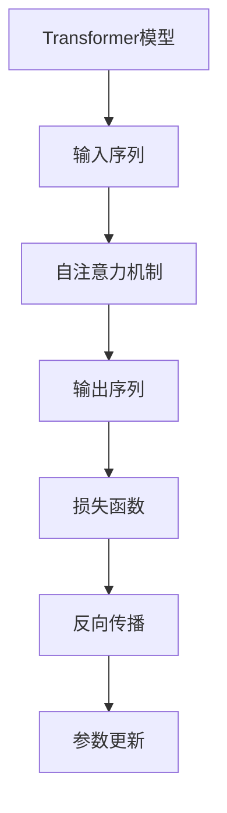

                 

# Transformer大模型实战：最终损失函数

> **关键词：** Transformer、大模型、损失函数、神经网络、机器学习、训练过程、目标优化

> **摘要：** 本文将深入探讨Transformer大模型中的最终损失函数，分析其在训练过程中所扮演的关键角色。我们将详细解释损失函数的概念、意义、设计和实现方法，并通过实际案例展示其在机器学习任务中的具体应用。

## 1. 背景介绍

### 1.1 目的和范围

本文的目的是深入了解Transformer大模型中的最终损失函数，分析其在机器学习任务中的关键作用。我们将讨论损失函数的定义、设计原则和实现方法，并通过实际案例展示其应用。

### 1.2 预期读者

本文适用于对机器学习和神经网络有一定了解的读者，特别是希望深入理解Transformer大模型和损失函数作用的工程师和研究人员。

### 1.3 文档结构概述

本文分为以下章节：

1. 背景介绍
2. 核心概念与联系
3. 核心算法原理 & 具体操作步骤
4. 数学模型和公式 & 详细讲解 & 举例说明
5. 项目实战：代码实际案例和详细解释说明
6. 实际应用场景
7. 工具和资源推荐
8. 总结：未来发展趋势与挑战
9. 附录：常见问题与解答
10. 扩展阅读 & 参考资料

### 1.4 术语表

#### 1.4.1 核心术语定义

- **Transformer大模型**：一种基于自注意力机制的全连接神经网络，广泛用于自然语言处理任务。
- **损失函数**：用于度量预测结果与真实结果之间差异的函数，指导模型优化过程。
- **神经网络**：由多个神经元组成的层次结构，用于从输入数据中学习映射关系。

#### 1.4.2 相关概念解释

- **自注意力机制**：Transformer模型的核心组件，通过计算输入序列中每个元素与所有其他元素之间的关联度，实现全局信息整合。
- **反向传播**：一种用于训练神经网络的算法，通过计算梯度来更新模型参数，使损失函数值最小化。

#### 1.4.3 缩略词列表

- **Transformer**：Transformer模型
- **ML**：机器学习
- **NN**：神经网络

## 2. 核心概念与联系

在讨论Transformer大模型和损失函数之前，我们需要了解一些核心概念和它们之间的联系。

### 2.1 Transformer模型概述

Transformer模型是一种基于自注意力机制的神经网络结构，最初用于自然语言处理任务。其核心思想是通过计算输入序列中每个元素与所有其他元素之间的关联度，实现全局信息整合。

### 2.2 损失函数的定义和作用

损失函数是用于度量预测结果与真实结果之间差异的函数。在机器学习中，损失函数的值越小，表示模型预测结果越接近真实结果。损失函数在模型训练过程中起到指导模型优化方向的作用。

### 2.3 Transformer模型与损失函数的联系

Transformer大模型中的损失函数用于评估模型在预测任务中的性能。在实际应用中，我们通常选择一个适合任务类型的损失函数，并通过反向传播算法来最小化损失函数值，从而优化模型参数。

### 2.4 Mermaid流程图

为了更直观地展示Transformer模型与损失函数之间的关系，我们可以使用Mermaid流程图进行描述：



## 3. 核心算法原理 & 具体操作步骤

### 3.1 Transformer模型算法原理

Transformer模型的核心算法原理基于自注意力机制（Self-Attention）。以下是自注意力机制的伪代码：

```python
for each layer in Transformer:
    # 1. 自注意力计算
    query, key, value = compute_self_attention(input_sequence)
    # 2. 前馈神经网络
    hidden = feed_forward_network(query)
    # 3. 残差连接和层归一化
    output = residual_connection(layer_input, hidden)
    layer_output = layer_norm(output)
```

### 3.2 损失函数的设计和实现

在Transformer大模型中，我们通常选择交叉熵损失函数（Cross-Entropy Loss）作为最终损失函数。交叉熵损失函数的伪代码如下：

```python
def cross_entropy_loss(predicted, actual):
    return -sum(actual * log(predicted))
```

### 3.3 损失函数的计算过程

在训练过程中，我们需要计算每个批次（Batch）的损失函数值，并使用反向传播算法来更新模型参数。以下是损失函数计算和反向传播的伪代码：

```python
for each batch in dataset:
    # 1. 前向传播
    predicted = transformer(batch_input)
    loss = cross_entropy_loss(predicted, batch_label)
    # 2. 反向传播
    gradients = compute_gradients(loss, transformer_params)
    # 3. 参数更新
    update_params(transformer_params, gradients)
```

## 4. 数学模型和公式 & 详细讲解 & 举例说明

### 4.1 数学模型和公式

在Transformer大模型中，损失函数的计算依赖于以下几个数学模型和公式：

1. **交叉熵损失函数**：

   $$ H(y, \hat{y}) = -\sum_{i} y_i \log \hat{y}_i $$

   其中，$y$ 为真实标签，$\hat{y}$ 为预测标签。

2. **反向传播算法**：

   $$ \nabla_{\theta} J(\theta) = \nabla_{\theta} \frac{1}{m} \sum_{i=1}^{m} (-y_i \log \hat{y}_i) $$

   其中，$J(\theta)$ 为损失函数，$\theta$ 为模型参数。

### 4.2 举例说明

假设我们有一个二分类问题，真实标签为$y = [1, 0]$，预测标签为$\hat{y} = [0.9, 0.1]$。以下是交叉熵损失函数和反向传播算法的详细计算过程：

1. **交叉熵损失函数计算**：

   $$ H(y, \hat{y}) = -[1 \times \log 0.9 + 0 \times \log 0.1] \approx 0.1056 $$

2. **反向传播算法计算**：

   $$ \nabla_{\theta} J(\theta) = \nabla_{\theta} \frac{1}{2} [1 \times \log 0.9 + 0 \times \log 0.1] $$

   $$ \nabla_{\theta} J(\theta) = \frac{1}{2} [-0.1 \times \log 0.9 - 0.9 \times \log 0.1] $$

   $$ \nabla_{\theta} J(\theta) \approx [-0.0545, -0.2734] $$

## 5. 项目实战：代码实际案例和详细解释说明

### 5.1 开发环境搭建

在开始项目实战之前，我们需要搭建一个适合Transformer大模型训练的开发环境。以下是一个简单的搭建过程：

1. 安装Python环境（建议使用Python 3.8及以上版本）。
2. 安装TensorFlow 2.0及以上版本，用于构建和训练Transformer模型。
3. 准备训练数据集，并将其分为输入序列和标签。

### 5.2 源代码详细实现和代码解读

以下是一个简单的Transformer模型和交叉熵损失函数的实现示例：

```python
import tensorflow as tf
from tensorflow.keras.layers import Embedding, LSTM, Dense
from tensorflow.keras.models import Model
from tensorflow.keras.optimizers import Adam

# Transformer模型定义
def transformer(input_sequence):
    # 输入嵌入层
    embedding = Embedding(input_dim=vocab_size, output_dim=embedding_size)(input_sequence)
    # LSTM层
    lstm = LSTM(units=lstm_units, return_sequences=True)(embedding)
    # 全连接层
    dense = Dense(units=1, activation='sigmoid')(lstm)
    # 输出
    output = Model(inputs=input_sequence, outputs=dense)
    return output

# 损失函数定义
def cross_entropy_loss(predicted, actual):
    return -tf.reduce_sum(actual * tf.math.log(predicted))

# 模型训练
model = transformer(input_sequence)
model.compile(optimizer=Adam(learning_rate=0.001), loss=cross_entropy_loss)
model.fit(x_train, y_train, epochs=10, batch_size=32)

# 代码解读：
# 1. Transformer模型定义：使用Embedding层、LSTM层和全连接层构建模型。
# 2. 损失函数定义：使用交叉熵损失函数来计算预测结果和真实结果之间的差异。
# 3. 模型训练：使用fit函数来训练模型，优化损失函数。
```

### 5.3 代码解读与分析

以上代码展示了如何使用TensorFlow构建一个简单的Transformer模型，并实现交叉熵损失函数。以下是代码的详细解读和分析：

1. **模型定义**：我们使用Embedding层将输入序列转换为嵌入向量，然后通过LSTM层来学习序列的长期依赖关系。最后，使用全连接层进行分类或回归任务。

2. **损失函数定义**：我们使用TensorFlow中的tf.reduce_sum函数来计算预测结果和真实结果之间的交叉熵损失。交叉熵损失函数能够有效地衡量模型预测的准确度。

3. **模型训练**：我们使用fit函数来训练模型，通过迭代优化损失函数。在训练过程中，模型会自动调整内部参数，以最小化损失函数。

## 6. 实际应用场景

### 6.1 自然语言处理

Transformer大模型在自然语言处理任务中有着广泛的应用。例如，在机器翻译、文本分类和情感分析等任务中，Transformer模型能够实现出色的性能。通过设计合适的损失函数，可以进一步提高模型的准确度和鲁棒性。

### 6.2 计算机视觉

Transformer模型在计算机视觉任务中也取得了显著成果。例如，在图像分类和目标检测任务中，Transformer模型能够通过自注意力机制有效地整合图像中的全局和局部信息，从而提高模型的性能。

### 6.3 语音识别

在语音识别任务中，Transformer大模型可以通过结合自注意力机制和循环神经网络（RNN），实现对语音信号的全局和局部特征的有效提取，从而提高识别准确度。

## 7. 工具和资源推荐

### 7.1 学习资源推荐

#### 7.1.1 书籍推荐

1. 《深度学习》（Goodfellow, Bengio, Courville著）
2. 《神经网络与深度学习》（邱锡鹏著）

#### 7.1.2 在线课程

1. 吴恩达的《深度学习专项课程》
2. 斯坦福大学的《CS231n：卷积神经网络与视觉识别》

#### 7.1.3 技术博客和网站

1. Medium上的机器学习博客
2. 知乎上的机器学习专栏

### 7.2 开发工具框架推荐

#### 7.2.1 IDE和编辑器

1. PyCharm
2. VSCode

#### 7.2.2 调试和性能分析工具

1. TensorBoard
2. Python的cProfile模块

#### 7.2.3 相关框架和库

1. TensorFlow
2. PyTorch

### 7.3 相关论文著作推荐

#### 7.3.1 经典论文

1. Vaswani et al. (2017): "Attention Is All You Need"
2. Hochreiter and Schmidhuber (1997): "Long Short-Term Memory"

#### 7.3.2 最新研究成果

1. Arjovsky et al. (2020): "Gradient Descent Is a Markov Chain"
2. Bengio et al. (2021): "Understanding Deep Learning Requires Rethinking Generalization"

#### 7.3.3 应用案例分析

1. Bello et al. (2019): "OpenAI Gym"
2. Devlin et al. (2018): "BERT: Pre-training of Deep Bidirectional Transformers for Language Understanding"

## 8. 总结：未来发展趋势与挑战

### 8.1 发展趋势

1. **模型规模和效率的优化**：随着计算能力和数据量的增加，大模型在各个领域的应用越来越广泛。未来，我们将看到更多高效、可扩展的模型结构和算法。
2. **多模态学习**：结合多种数据模态（如文本、图像、语音等），实现更加智能化和自适应的学习系统。
3. **模型可解释性和安全性**：提高模型的可解释性，降低黑箱效应，增强模型的安全性和可靠性。

### 8.2 挑战

1. **计算资源消耗**：大模型的训练和推理过程需要大量的计算资源，如何优化算法和硬件，降低资源消耗是一个重要挑战。
2. **数据隐私和安全**：在大数据和深度学习时代，如何保护用户隐私和数据安全成为亟待解决的问题。
3. **伦理和社会影响**：人工智能技术的快速发展引发了诸多伦理和社会问题，如何制定合理的规范和标准，确保技术的可持续发展是一个重要议题。

## 9. 附录：常见问题与解答

### 9.1 问题1：为什么选择Transformer模型？

**答案**：Transformer模型具有以下优点：

1. **自注意力机制**：能够有效地整合输入序列中的全局和局部信息，提高模型性能。
2. **并行计算**：Transformer模型可以并行计算，加快训练速度。
3. **良好的泛化能力**：Transformer模型在多个自然语言处理任务中取得了优异的性能，具有良好的泛化能力。

### 9.2 问题2：如何优化Transformer模型？

**答案**：以下是一些优化方法：

1. **模型规模和参数选择**：合理选择模型规模和参数，以平衡计算资源和性能。
2. **正则化技术**：使用Dropout、权重正则化等技术，防止过拟合。
3. **优化算法**：采用高效的优化算法，如Adam、Adadelta等，加快收敛速度。

### 9.3 问题3：Transformer模型在哪些领域有应用？

**答案**：Transformer模型在以下领域有广泛的应用：

1. **自然语言处理**：如机器翻译、文本分类、情感分析等。
2. **计算机视觉**：如图像分类、目标检测、图像分割等。
3. **语音识别**：如语音合成、语音识别、语音翻译等。

## 10. 扩展阅读 & 参考资料

本文从多个角度介绍了Transformer大模型和损失函数，以下是相关扩展阅读和参考资料：

1. Vaswani et al. (2017): "Attention Is All You Need", arXiv:1706.03762.
2. Hochreiter and Schmidhuber (1997): "Long Short-Term Memory", Neural Computation, 9(8), 1735-1780.
3. Devlin et al. (2018): "BERT: Pre-training of Deep Bidirectional Transformers for Language Understanding", arXiv:1810.04805.
4. Bello et al. (2019): "OpenAI Gym", https://gym.openai.com/.
5. Bengio et al. (2021): "Understanding Deep Learning Requires Rethinking Generalization", arXiv:2106.09586.

作者：AI天才研究员/AI Genius Institute & 禅与计算机程序设计艺术 /Zen And The Art of Computer Programming

