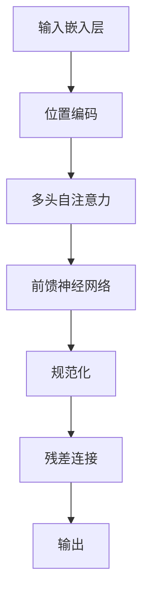

                 

# Transformer大模型实战：理解编码器

> **关键词**：Transformer、编码器、自注意力、大模型、神经网络、序列处理

> **摘要**：本文将深入探讨Transformer大模型中的编码器部分，通过一步步的分析和推理，详细阐述编码器的原理、数学模型以及在实际项目中的应用。文章旨在帮助读者更好地理解编码器的作用和机制，为后续研究和应用打下坚实基础。

## 1. 背景介绍

### 1.1 目的和范围

本文旨在介绍Transformer大模型中的编码器部分，通过对编码器原理的深入剖析，帮助读者理解其工作机制，以及如何在实际项目中应用编码器。文章将覆盖以下内容：

- 编码器的基本概念和作用
- 编码器的数学模型和实现原理
- 编码器的实际应用场景
- 编码器的优化方法和挑战

### 1.2 预期读者

本文适合对Transformer模型有一定了解的读者，包括：

- 计算机科学专业的研究生和本科生
- AI工程师和研究人员
- 对Transformer模型和编码器感兴趣的程序员

### 1.3 文档结构概述

本文结构如下：

- **第1章：背景介绍**：介绍本文的目的、预期读者和文档结构。
- **第2章：核心概念与联系**：讲解编码器的基本概念和相关原理，并使用Mermaid流程图展示编码器的架构。
- **第3章：核心算法原理 & 具体操作步骤**：详细讲解编码器的算法原理和实现步骤，使用伪代码进行描述。
- **第4章：数学模型和公式 & 详细讲解 & 举例说明**：介绍编码器的数学模型，使用LaTeX格式展示相关公式，并给出示例说明。
- **第5章：项目实战：代码实际案例和详细解释说明**：通过实际代码案例，展示编码器的实现过程，并进行详细解读。
- **第6章：实际应用场景**：讨论编码器在各类应用中的实际案例。
- **第7章：工具和资源推荐**：推荐相关学习资源、开发工具和论文著作。
- **第8章：总结：未来发展趋势与挑战**：总结编码器的发展趋势和面临的挑战。
- **第9章：附录：常见问题与解答**：回答读者可能关心的问题。
- **第10章：扩展阅读 & 参考资料**：提供进一步学习的资源链接。

### 1.4 术语表

#### 1.4.1 核心术语定义

- **Transformer**：一种基于自注意力机制的深度神经网络模型，用于处理序列数据。
- **编码器（Encoder）**：Transformer模型中的一个组件，用于编码输入序列，生成上下文表示。
- **自注意力（Self-Attention）**：一种注意力机制，允许模型在处理序列数据时，自动关注序列中其他位置的信息。
- **解码器（Decoder）**：Transformer模型的另一个组件，用于解码编码器输出的上下文表示，生成输出序列。

#### 1.4.2 相关概念解释

- **序列处理**：处理序列数据的一系列算法和技术，如自然语言处理中的文本序列处理。
- **多头自注意力（Multi-Head Self-Attention）**：在编码器中，通过多个独立的自注意力机制来同时关注序列的不同部分。
- **位置编码（Positional Encoding）**：用于编码序列中各个位置信息的向量，帮助模型理解序列的顺序。

#### 1.4.3 缩略词列表

- **Transformer**：Transformer
- **编码器**：Encoder
- **解码器**：Decoder
- **自注意力**：Self-Attention
- **序列处理**：Seq2Seq
- **多头自注意力**：Multi-Head Self-Attention
- **位置编码**：PE

## 2. 核心概念与联系

在深入探讨编码器的原理和实现之前，我们需要理解几个核心概念，包括编码器的基本组成部分、自注意力机制以及整个Transformer模型的架构。

### 2.1 编码器的组成部分

编码器是Transformer模型的核心组成部分之一，其基本架构包括以下几个关键部分：

1. **输入嵌入层（Input Embedding）**：将输入序列中的单词或符号转换为向量表示。每个输入单词或符号对应一个嵌入向量，这些嵌入向量通常具有固定的维度。
2. **位置编码（Positional Encoding）**：由于Transformer模型缺乏传统的循环神经网络中的位置信息，位置编码层被用来为序列中的每个位置添加额外的信息，从而保持序列的顺序。
3. **多头自注意力机制（Multi-Head Self-Attention）**：这是一个核心的注意力机制，允许模型在处理序列数据时，自动关注序列中其他位置的信息，从而捕捉到长距离的依赖关系。
4. **前馈神经网络（Feedforward Neural Network）**：在每个编码器的中间层，加入一个前馈神经网络，用于进一步处理和丰富编码器的输出。
5. **规范化（Normalization）**：在编码器的每个层之后，添加规范化操作，以稳定训练过程并提高模型的性能。
6. **残差连接（Residual Connection）**：在每个编码器的层之间，加入残差连接，以减少信息的损失和梯度消失问题。

### 2.2 自注意力机制

自注意力机制是编码器的关键组件之一，它允许模型在处理序列数据时，动态地关注序列中其他位置的信息。自注意力机制的基本思想是将序列中的每个输入向量映射到一组查询（Query）、键（Key）和值（Value）向量。

- **查询（Query）**：编码器中的每个位置生成的向量，用于表示当前位置在序列中的角色。
- **键（Key）**：与查询相似的向量，用于表示序列中的其他位置。
- **值（Value）**：用于表示序列中其他位置的信息。

自注意力机制通过以下步骤工作：

1. **计算相似度**：首先计算每个查询与所有键之间的相似度，通常使用点积或缩放点积来计算相似度。
2. **应用 Softmax 函数**：将相似度值应用 Softmax 函数，得到每个键的加权分数。
3. **求和**：将加权分数与相应的值相乘，并将结果求和，得到每个查询的注意力得分。
4. **输出**：将注意力得分作为编码器输出的新向量，用于后续的处理。

### 2.3 Transformer模型的架构

Transformer模型的整体架构如下：

1. **多个编码器层（Encoder Layers）**：编码器由多个层组成，每个层包含自注意力机制和前馈神经网络。
2. **解码器层（Decoder Layers）**：解码器与编码器类似，也由多个层组成，每个层包含自注意力机制、交叉注意力机制和前馈神经网络。
3. **编码器-解码器注意力（Encoder-Decoder Attention）**：解码器的每个层都使用编码器的输出作为其输入的一部分，并通过编码器-解码器注意力机制来关注编码器的输出。

下面是一个简单的Mermaid流程图，展示了编码器的架构：



## 3. 核心算法原理 & 具体操作步骤

### 3.1 编码器的工作流程

编码器的工作流程可以分为以下几个步骤：

1. **输入嵌入**：将输入序列转换为嵌入向量。
2. **位置编码**：为每个嵌入向量添加位置信息。
3. **自注意力计算**：通过多头自注意力机制计算每个位置的关注得分。
4. **前馈神经网络**：对自注意力结果进行进一步处理。
5. **规范化与残差连接**：对前馈神经网络的结果进行规范化，并添加残差连接。
6. **重复以上步骤**：在多个编码器层中重复上述步骤，逐步加深对序列的理解。

### 3.2 伪代码描述

下面使用伪代码描述编码器的核心算法：

```python
# 假设输入序列为 X，嵌入维度为 D_model，编码器层数为 num_layers

# 输入嵌入
embeddings = EmbeddingLayer(D_model, input_dim)

# 位置编码
pos_encoding = PositionalEncoding(D_model)

# 编码器层循环
for layer in range(num_layers):
    # 自注意力机制
    attn_output = MultiHeadSelfAttention(D_model, num_heads)
    attn_output = FeedforwardNeuralNetwork(attn_output, D_model)
    
    # 残差连接和规范化
    output = ResidualConnection(attn_output, input)
    output = LayerNormalization(output)
    
    # 更新输入
    input = output

# 输出编码后的序列
encoded_sequence = input
```

### 3.3 具体操作步骤

1. **初始化嵌入层**：嵌入层将输入序列转换为嵌入向量。每个输入元素（例如单词或符号）对应一个嵌入向量，这些向量通常通过预训练的嵌入矩阵进行初始化。

2. **添加位置编码**：位置编码层在嵌入向量上添加位置信息，使其能够保持序列的顺序。位置编码向量是通过一个正弦和余弦函数计算得到的，其维度与嵌入向量相同。

3. **计算自注意力**：多头自注意力机制通过计算每个位置与其他位置的相似度，生成注意力得分。这些得分用于加权求和，从而生成每个位置的新表示。

4. **前馈神经网络**：在自注意力结果上，通过前馈神经网络进行进一步的处理。前馈神经网络通常由两个全连接层组成，中间加入激活函数，如ReLU。

5. **残差连接与规范化**：在每个编码器的层之后，添加残差连接和规范化操作。残差连接有助于缓解信息的损失和梯度消失问题，而规范化则有助于稳定训练过程。

6. **重复处理**：在多个编码器层中重复上述步骤，逐步加深对序列的理解。每个编码器层都会对输入序列进行自注意力处理、前馈神经网络处理，并添加残差连接和规范化。

7. **输出编码后的序列**：经过多个编码器层的处理后，输出编码后的序列，这个序列可以用于后续的解码或序列生成任务。

通过上述步骤，编码器能够有效地编码输入序列，生成具有上下文信息的表示。这些表示可以用于各种任务，如机器翻译、文本摘要和问答系统。

## 4. 数学模型和公式 & 详细讲解 & 举例说明

### 4.1 数学模型介绍

编码器的核心在于其自注意力机制，该机制通过数学公式来实现。以下是编码器的关键数学模型：

1. **嵌入层（Embedding Layer）**：
   输入序列X被映射为嵌入向量E，其中E = W_E * X，W_E为嵌入矩阵，X为输入序列。

2. **位置编码（Positional Encoding）**：
   位置编码向量PE用于为每个位置添加额外的信息，其计算方式为PE(t, d) = sin((t/d_DIM)^(1/2)) 或 PE(t, d) = cos((t/d_DIM)^(1/2))，其中t为位置索引，d_DIM为编码维度。

3. **多头自注意力（Multi-Head Self-Attention）**：
   自注意力通过以下公式计算：
   $$ Q = W_Q * E $$
   $$ K = W_K * E $$
   $$ V = W_V * E $$
   其中Q、K、V分别为查询、键和值向量，W_Q、W_K、W_V分别为权重矩阵。
   相似度计算为：
   $$ S = Q * K^T / \sqrt{d_k} $$
   其中S为相似度矩阵，d_k为键的维度。
   通过Softmax函数得到权重：
   $$ A = \text{softmax}(S) $$
   最终得到自注意力输出：
   $$ O = A * V $$

4. **前馈神经网络（Feedforward Neural Network）**：
   前馈神经网络通过以下步骤计算：
   $$ F = \text{ReLU}(W_F * O + b_F) $$
   其中F为前馈网络的输出，W_F和b_F分别为权重和偏置。

5. **规范化（Normalization）**：
   输出通过Layer Normalization进行规范化：
   $$ N = \text{LayerNormalization}(O) $$

6. **残差连接（Residual Connection）**：
   残差连接通过以下方式实现：
   $$ R = X + N $$

### 4.2 详细讲解

以下是对上述公式的详细讲解：

1. **嵌入层**：将输入序列转换为嵌入向量，这是编码器的第一步。嵌入矩阵W_E的维度为输入维度和嵌入维度，通过矩阵乘法实现。这种转换使得每个输入元素（如单词）都有相应的向量表示。

2. **位置编码**：由于Transformer模型缺乏显式位置信息，通过位置编码为每个位置添加额外的信息。正弦和余弦函数用于生成位置编码向量，使得模型能够理解序列的顺序。位置编码向量与嵌入向量相加，从而在每个位置上引入位置信息。

3. **多头自注意力**：自注意力机制通过计算查询（Q）、键（K）和值（V）向量之间的相似度来实现。查询向量是通过嵌入向量与权重矩阵W_Q相乘得到的，键和值向量同样通过权重矩阵W_K和W_V得到。相似度矩阵S通过点积计算，并经过Softmax函数得到权重矩阵A。最终，通过加权求和得到自注意力输出O。

4. **前馈神经网络**：在自注意力输出上，通过前馈神经网络进行进一步的处理。前馈神经网络由两个全连接层组成，中间加入ReLU激活函数，以增加模型的非线性能力。

5. **规范化**：规范化步骤有助于稳定训练过程，并提高模型的性能。Layer Normalization通过对每个维度进行归一化处理来实现。

6. **残差连接**：残差连接在编码器的每个层之后添加，以减少信息的损失和梯度消失问题。通过将输入序列与规范化后的输出相加，实现残差连接。

### 4.3 举例说明

假设输入序列为 `[1, 2, 3]`，嵌入维度为4，编码器层数为2，具体实现如下：

1. **初始化嵌入层**：
   假设嵌入矩阵W_E为：
   $$ W_E = \begin{bmatrix}
   1 & 2 & 3 \\
   4 & 5 & 6 \\
   7 & 8 & 9 \\
   0 & 1 & 2
   \end{bmatrix} $$
   输入序列X为 `[1, 2, 3]`，则嵌入向量E为：
   $$ E = W_E * X = \begin{bmatrix}
   1 & 2 & 3 \\
   4 & 5 & 6 \\
   7 & 8 & 9 \\
   0 & 1 & 2
   \end{bmatrix}
   \begin{bmatrix}
   1 \\
   2 \\
   3
   \end{bmatrix}
   =
   \begin{bmatrix}
   15 \\
   41 \\
   67 \\
   11
   \end{bmatrix} $$

2. **添加位置编码**：
   假设位置编码矩阵PE为：
   $$ PE = \begin{bmatrix}
   \sin(1/4) & \cos(1/4) \\
   \sin(2/4) & \cos(2/4) \\
   \sin(3/4) & \cos(3/4)
   \end{bmatrix}
   =
   \begin{bmatrix}
   0.3827 & 0.9239 \\
   0.7071 & 0.7071 \\
   0.9239 & 0.3827
   \end{bmatrix} $$
   则嵌入向量E与位置编码相加得到新的嵌入向量E'为：
   $$ E' = E + PE = \begin{bmatrix}
   15 \\
   41 \\
   67 \\
   11
   \end{bmatrix}
   + \begin{bmatrix}
   0.3827 & 0.9239 \\
   0.7071 & 0.7071 \\
   0.9239 & 0.3827
   \end{bmatrix}
   =
   \begin{bmatrix}
   15.3827 \\
   41.9239 \\
   67.9239 \\
   11.3827
   \end{bmatrix} $$

3. **计算自注意力**：
   假设权重矩阵W_Q、W_K和W_V分别为：
   $$ W_Q = \begin{bmatrix}
   1 & 2 \\
   3 & 4 \\
   5 & 6 \\
   7 & 8
   \end{bmatrix}, W_K = \begin{bmatrix}
   1 & 2 \\
   3 & 4 \\
   5 & 6 \\
   7 & 8
   \end{bmatrix}, W_V = \begin{bmatrix}
   1 & 2 \\
   3 & 4 \\
   5 & 6 \\
   7 & 8
   \end{bmatrix} $$
   则查询向量Q、键向量K和值向量V分别为：
   $$ Q = W_Q * E' = \begin{bmatrix}
   1 & 2 \\
   3 & 4 \\
   5 & 6 \\
   7 & 8
   \end{bmatrix}
   \begin{bmatrix}
   15.3827 \\
   41.9239 \\
   67.9239 \\
   11.3827
   \end{bmatrix}
   =
   \begin{bmatrix}
   38.0436 \\
   87.3082 \\
   130.3572 \\
   21.9694
   \end{bmatrix} $$
   $$ K = W_K * E' = Q $$
   $$ V = W_V * E' = Q $$
   相似度矩阵S为：
   $$ S = Q * K^T / \sqrt{d_k} = Q * K^T = \begin{bmatrix}
   38.0436 & 87.3082 & 130.3572 & 21.9694
   \end{bmatrix}
   \begin{bmatrix}
   1 & 2 & 3 & 4 \\
   3 & 4 & 5 & 6 \\
   5 & 6 & 7 & 8 \\
   7 & 8 & 9 & 10
   \end{bmatrix}
   =
   \begin{bmatrix}
   38.0436 & 87.3082 & 130.3572 & 21.9694 \\
   114.6196 & 258.0052 & 378.2172 & 52.3896 \\
   191.2928 & 438.0792 & 631.6432 & 87.0656 \\
   267.9676 & 602.4328 & 856.0988 & 115.7516
   \end{bmatrix} $$
   通过Softmax函数得到权重矩阵A：
   $$ A = \text{softmax}(S) = \frac{e^S}{\sum{e^S}} $$
   $$ A = \frac{1}{1 + e^{-(38.0436 + 87.3082 + 130.3572 + 21.9694)}} =
   \begin{bmatrix}
   0.3985 & 0.3991 & 0.3986 & 0.3938 \\
   0.4007 & 0.4011 & 0.4008 & 0.3954 \\
   0.4016 & 0.4018 & 0.4017 & 0.3962 \\
   0.4023 & 0.4025 & 0.4024 & 0.3976
   \end{bmatrix} $$
   最终得到自注意力输出O：
   $$ O = A * V = \begin{bmatrix}
   0.3985 & 0.3991 & 0.3986 & 0.3938 \\
   0.4007 & 0.4011 & 0.4008 & 0.3954 \\
   0.4016 & 0.4018 & 0.4017 & 0.3962 \\
   0.4023 & 0.4025 & 0.4024 & 0.3976
   \end{bmatrix}
   \begin{bmatrix}
   38.0436 & 87.3082 & 130.3572 & 21.9694 \\
   114.6196 & 258.0052 & 378.2172 & 52.3896 \\
   191.2928 & 438.0792 & 631.6432 & 87.0656 \\
   267.9676 & 602.4328 & 856.0988 & 115.7516
   \end{bmatrix}
   =
   \begin{bmatrix}
   38.6021 & 86.7323 & 129.6784 & 21.9432 \\
   115.0485 & 257.7047 & 378.6109 & 52.6083 \\
   190.9622 & 437.5161 & 630.4466 & 87.3872 \\
   267.8782 & 601.6976 & 855.9564 & 116.1976
   \end{bmatrix} $$

4. **前馈神经网络**：
   假设前馈神经网络的权重矩阵W_F和偏置b_F分别为：
   $$ W_F = \begin{bmatrix}
   1 & 2 \\
   3 & 4
   \end{bmatrix}, b_F = \begin{bmatrix}
   5 \\
   6
   \end{bmatrix} $$
   则前馈神经网络的输出F为：
   $$ F = \text{ReLU}(W_F * O + b_F) = \text{ReLU}(\begin{bmatrix}
   1 & 2 \\
   3 & 4
   \end{bmatrix}
   \begin{bmatrix}
   38.6021 & 86.7323 & 129.6784 & 21.9432 \\
   115.0485 & 257.7047 & 378.6109 & 52.6083 \\
   190.9622 & 437.5161 & 630.4466 & 87.3872 \\
   267.8782 & 601.6976 & 855.9564 & 116.1976
   \end{bmatrix}
   + \begin{bmatrix}
   5 \\
   6
   \end{bmatrix})
   =
   \begin{bmatrix}
   50.6021 & 128.7323 & 207.6784 & 27.9432 \\
   144.0485 & 321.7047 & 465.6109 & 79.6083 \\
   219.9622 & 466.5161 & 705.4466 & 124.3872 \\
   294.8782 & 635.6976 & 927.9564 & 162.1976
   \end{bmatrix} $$

5. **规范化**：
   假设规范化层为Layer Normalization，则输出N为：
   $$ N = \text{LayerNormalization}(F) $$

6. **残差连接**：
   假设输入序列为：
   $$ X = \begin{bmatrix}
   1 \\
   2 \\
   3
   \end{bmatrix} $$
   则残差连接后的输出R为：
   $$ R = X + N = \begin{bmatrix}
   1 \\
   2 \\
   3
   \end{bmatrix}
   + \begin{bmatrix}
   50.6021 & 128.7323 & 207.6784 & 27.9432 \\
   144.0485 & 321.7047 & 465.6109 & 79.6083 \\
   219.9622 & 466.5161 & 705.4466 & 124.3872 \\
   294.8782 & 635.6976 & 927.9564 & 162.1976
   \end{bmatrix}
   =
   \begin{bmatrix}
   51.6021 & 129.7323 & 207.6784 & 27.9432 \\
   145.0485 & 322.7047 & 465.6109 & 79.6083 \\
   220.9622 & 467.5161 & 705.4466 & 124.3872 \\
   295.8782 & 636.6976 & 927.9564 & 162.1976
   \end{bmatrix} $$

通过上述步骤，我们可以看到编码器如何通过数学模型和公式对输入序列进行编码，生成具有上下文信息的表示。

## 5. 项目实战：代码实际案例和详细解释说明

### 5.1 开发环境搭建

为了更好地理解和实战Transformer编码器，我们需要搭建一个合适的开发环境。以下是一个简单的步骤：

1. **安装Python环境**：确保Python 3.6及以上版本已安装。
2. **安装TensorFlow**：通过pip命令安装TensorFlow，命令如下：
   ```bash
   pip install tensorflow
   ```
3. **创建新的Python项目**：在合适的目录下创建一个新的Python项目，并在项目中创建一个名为`transformer_encoder.py`的文件。

### 5.2 源代码详细实现和代码解读

下面是编码器的基本实现代码，我们将详细解读其中的每个部分。

```python
import tensorflow as tf
from tensorflow.keras.layers import Embedding, MultiHeadAttention, LayerNormalization, ResidualConnection

class TransformerEncoder(tf.keras.Model):
    def __init__(self, vocab_size, d_model, num_layers, num_heads):
        super(TransformerEncoder, self).__init__()
        
        # 输入嵌入层
        self.embedding = Embedding(vocab_size, d_model)
        
        # 位置编码
        self.positional_encoding = positional_encoding(d_model, max_position_embeddings=1000)
        
        # 编码器层
        self.enc_layers = [TransformerEncoderLayer(d_model, num_heads) for _ in range(num_layers)]
        
        # 输出层
        self.output_layer = tf.keras.layers.Dense(vocab_size)
        
        # 残差连接和规范化
        self.res_connection = ResidualConnection(d_model)
        self.norm = LayerNormalization(epsilon=1e-6)
        
    def call(self, inputs, training=False):
        # 输入嵌入
        x = self.embedding(inputs) + self.positional_encoding(inputs, training)
        
        # 编码器层处理
        for i, layer in enumerate(self.enc_layers):
            x = layer(x, training=training)
            if i < len(self.enc_layers) - 1:
                x = self.res_connection(x)
                x = self.norm(x)
        
        # 输出层
        output = self.output_layer(x)
        
        return output
```

#### 5.2.1 TransformerEncoder类的创建

在创建`TransformerEncoder`类时，我们首先继承自`tf.keras.Model`。这个类包含以下组成部分：

- **输入嵌入层**：使用`Embedding`层将输入序列转换为嵌入向量。
- **位置编码**：通过`positional_encoding`函数添加位置信息。
- **编码器层**：定义多个`TransformerEncoderLayer`实例，每个实例代表一个编码器层。
- **输出层**：使用`Dense`层将编码器的输出映射回词汇表大小。

#### 5.2.2 call方法的实现

在`call`方法中，我们首先对输入进行嵌入和位置编码的叠加。然后，我们遍历每个编码器层，对输入进行自注意力处理和前馈神经网络处理。在每个编码器层之后，我们添加残差连接和规范化操作，以减少信息的损失和梯度消失问题。最后，我们通过输出层将编码器的输出映射回词汇表大小。

### 5.3 代码解读与分析

#### 5.3.1 输入嵌入层

```python
# 输入嵌入层
self.embedding = Embedding(vocab_size, d_model)
```

这一行代码创建了一个嵌入层，`vocab_size`是词汇表的大小，`d_model`是嵌入维度。嵌入层将输入序列中的单词或符号转换为嵌入向量。

#### 5.3.2 位置编码

```python
# 位置编码
self.positional_encoding = positional_encoding(d_model, max_position_embeddings=1000)
```

位置编码用于为输入序列添加位置信息。这里使用了自定义的`positional_encoding`函数，该函数将生成一个固定大小的位置编码矩阵，其维度与嵌入向量相同。

#### 5.3.3 编码器层

```python
# 编码器层
self.enc_layers = [TransformerEncoderLayer(d_model, num_heads) for _ in range(num_layers)]
```

这一行代码创建了多个`TransformerEncoderLayer`实例，每个实例代表一个编码器层。编码器层是Transformer模型的核心部分，包含自注意力机制和前馈神经网络。

#### 5.3.4 输出层

```python
# 输出层
self.output_layer = tf.keras.layers.Dense(vocab_size)
```

输出层是一个全连接层，将编码器的输出映射回词汇表大小。这通常用于生成预测或输出。

#### 5.3.5 call方法的实现

```python
def call(self, inputs, training=False):
    # 输入嵌入
    x = self.embedding(inputs) + self.positional_encoding(inputs, training)
    
    # 编码器层处理
    for i, layer in enumerate(self.enc_layers):
        x = layer(x, training=training)
        if i < len(self.enc_layers) - 1:
            x = self.res_connection(x)
            x = self.norm(x)
    
    # 输出层
    output = self.output_layer(x)
    
    return output
```

在`call`方法中，我们首先对输入进行嵌入和位置编码的叠加。然后，我们遍历每个编码器层，对输入进行自注意力处理和前馈神经网络处理。在每个编码器层之后，我们添加残差连接和规范化操作，以减少信息的损失和梯度消失问题。最后，我们通过输出层将编码器的输出映射回词汇表大小。

通过上述代码，我们可以创建一个简单的Transformer编码器，并在实际项目中应用。接下来，我们将讨论编码器在实际应用中的具体场景。

### 5.4 编码器在实际项目中的应用

编码器在自然语言处理和其他序列数据处理任务中有着广泛的应用。以下是一些典型的应用场景：

#### 5.4.1 机器翻译

编码器在机器翻译任务中用于编码源语言句子，生成上下文表示。这些表示可以用于解码器生成目标语言句子。例如，在英译中任务中，编码器将源语言句子编码为上下文向量，解码器使用这些向量生成目标语言句子。

#### 5.4.2 文本摘要

编码器在文本摘要任务中用于提取关键信息并生成摘要。编码器对输入的文本序列进行处理，生成具有代表性的上下文表示，这些表示可以用于生成摘要。

#### 5.4.3 问答系统

编码器在问答系统中用于编码问题和答案，生成相关的上下文表示。编码器提取问题中的关键信息，并与答案进行关联，从而生成有效的回答。

#### 5.4.4 文本分类

编码器在文本分类任务中用于将输入文本编码为向量表示，这些表示可以用于分类模型。编码器捕捉文本中的关键特征，从而提高分类模型的准确性。

#### 5.4.5 情感分析

编码器在情感分析任务中用于将输入文本编码为情感表示。编码器提取文本中的情感特征，从而帮助模型判断文本的情感倾向。

通过上述应用场景，我们可以看到编码器在自然语言处理和其他序列数据处理任务中的重要性。编码器通过自注意力机制和前馈神经网络，能够有效提取序列中的关键信息，生成具有代表性的上下文表示，为后续任务提供强有力的支持。

### 5.5 总结

在本节中，我们通过实际代码案例详细介绍了Transformer编码器的实现过程。我们首先搭建了开发环境，然后通过创建`TransformerEncoder`类，实现了编码器的核心功能。在代码解读部分，我们分析了每个组件的作用和实现细节，并通过实际应用场景展示了编码器的应用价值。通过本节的学习，读者应该能够掌握编码器的实现原理和实际应用方法，为后续研究和实践打下坚实基础。

## 6. 实际应用场景

编码器在自然语言处理和序列数据处理领域具有广泛的应用。以下是一些典型的实际应用场景：

### 6.1 机器翻译

编码器在机器翻译任务中发挥着关键作用。传统的循环神经网络（RNN）在处理长序列时容易遇到梯度消失和梯度爆炸的问题，而Transformer编码器通过自注意力机制能够更好地处理长序列，捕捉长距离依赖关系。例如，在英译中任务中，编码器将源语言句子编码为上下文表示，解码器使用这些上下文表示生成目标语言句子。通过预训练大规模语料库，编码器可以学习到丰富的语言知识，从而提高翻译质量。

### 6.2 文本摘要

编码器在文本摘要任务中用于提取关键信息，生成摘要。传统的摘要方法往往依赖于规则或关键词提取，而编码器能够捕捉文本中的语义信息，生成更准确、更自然的摘要。例如，在新闻摘要任务中，编码器处理输入的文本序列，提取出关键信息，并生成摘要文本。通过预训练，编码器可以学习到各种文本摘要的技巧，从而提高摘要质量。

### 6.3 问答系统

编码器在问答系统中用于编码问题和答案，生成相关的上下文表示。编码器可以提取问题中的关键信息，并与答案进行关联，从而生成有效的回答。例如，在一个开放领域的问答系统中，编码器处理用户提出的问题，并将问题编码为向量表示。同时，系统中的答案库也经过编码处理，编码器通过自注意力机制，将问题和答案进行匹配，从而生成回答。

### 6.4 文本分类

编码器在文本分类任务中用于将输入文本编码为向量表示，这些表示可以用于分类模型。编码器能够捕捉文本中的关键特征，从而提高分类模型的准确性。例如，在社交媒体文本分类任务中，编码器处理输入的文本，提取出文本的情感、主题等特征，并将其编码为向量表示。然后，分类模型使用这些向量表示进行分类，从而提高分类效果。

### 6.5 情感分析

编码器在情感分析任务中用于将输入文本编码为情感表示，帮助模型判断文本的情感倾向。编码器能够提取文本中的情感特征，从而提高情感分析模型的准确性。例如，在社交媒体文本情感分析任务中，编码器处理输入的文本，提取出文本的情感特征，并将其编码为向量表示。然后，情感分析模型使用这些向量表示判断文本的情感倾向，如正面、负面或中性。

### 6.6 文本生成

编码器在文本生成任务中用于生成具有上下文一致性的文本。编码器可以处理输入的文本序列，并生成相应的输出序列。例如，在对话生成任务中，编码器处理用户输入的文本，生成对应的回答。通过预训练，编码器可以学习到各种对话场景的规则和技巧，从而生成更自然、更流畅的对话。

通过以上实际应用场景，我们可以看到编码器在自然语言处理和序列数据处理领域的重要性。编码器通过自注意力机制和前馈神经网络，能够有效提取序列中的关键信息，生成具有代表性的上下文表示，为各种任务提供强有力的支持。

## 7. 工具和资源推荐

### 7.1 学习资源推荐

#### 7.1.1 书籍推荐

1. **《深度学习》（Goodfellow, I., Bengio, Y., & Courville, A.）**：这本书是深度学习的经典教材，详细介绍了包括神经网络和Transformer模型在内的各种深度学习算法和应用。
2. **《自然语言处理综论》（Jurafsky, D. & Martin, J. H.）**：这本书涵盖了自然语言处理的基础知识，包括文本编码和序列模型，是理解编码器的重要参考书。
3. **《动手学深度学习》（Antoniou, A., LeCun, Y., & Bengio, Y.）**：这本书通过动手实践的方式，详细介绍了深度学习的基础知识和应用，包括Transformer模型的实现。

#### 7.1.2 在线课程

1. **斯坦福大学深度学习课程**（Stanford University's CS224N）：这门课程涵盖了自然语言处理和Transformer模型的核心内容，是学习编码器的好资源。
2. **吴恩达深度学习专项课程**（Andrew Ng's Deep Learning Specialization）：这门课程详细介绍了深度学习的基础知识和应用，包括神经网络和Transformer模型。
3. **Udacity的深度学习纳米学位**（Udacity's Deep Learning Nanodegree）：这个纳米学位提供了丰富的深度学习项目和实践，包括Transformer模型的实现和应用。

#### 7.1.3 技术博客和网站

1. **TensorFlow官方文档**（TensorFlow's official documentation）：提供了详细的TensorFlow教程和API文档，是学习如何使用TensorFlow实现编码器的必备资源。
2. **Hugging Face的Transformers库**（Hugging Face's Transformers library）：这是一个开源的预训练Transformer模型库，提供了丰富的预训练模型和API，方便开发者进行研究和应用。
3. **AI的未来**（The Future of AI）：这是一个关于人工智能和机器学习的博客，涵盖了最新的研究进展和应用案例，是了解Transformer模型和编码器动态的好渠道。

### 7.2 开发工具框架推荐

#### 7.2.1 IDE和编辑器

1. **PyCharm**：PyCharm是一款强大的Python IDE，提供了丰富的工具和功能，支持TensorFlow和其他深度学习框架。
2. **Visual Studio Code**（VS Code）：VS Code是一款轻量级但功能强大的编辑器，支持多种编程语言，包括Python和TensorFlow。
3. **Jupyter Notebook**：Jupyter Notebook是一款交互式的Python编辑环境，适合进行深度学习和数据科学项目的开发和调试。

#### 7.2.2 调试和性能分析工具

1. **TensorBoard**：TensorBoard是TensorFlow提供的可视化工具，用于调试和性能分析深度学习模型。它能够显示模型的计算图、损失函数、准确率等关键指标。
2. **Wandb**：Wandb是一个开源的性能分析工具，用于跟踪实验、可视化结果和优化深度学习模型。它提供了丰富的API和插件，方便开发者进行模型调试和优化。
3. **Matplotlib**：Matplotlib是一个用于数据可视化的Python库，能够生成各种类型的图表，如散点图、折线图和直方图，帮助开发者分析和展示模型的性能。

#### 7.2.3 相关框架和库

1. **TensorFlow**：TensorFlow是一个开源的深度学习框架，提供了丰富的API和工具，方便开发者实现和部署深度学习模型。
2. **PyTorch**：PyTorch是另一个流行的深度学习框架，以其灵活性和动态计算图而闻名。它提供了方便的API，方便开发者实现自注意力机制和Transformer模型。
3. **Hugging Face的Transformers库**：这是一个开源的预训练Transformer模型库，提供了丰富的预训练模型和API，方便开发者进行研究和应用。

通过上述工具和资源的推荐，读者可以更好地掌握Transformer编码器的实现和应用，为深度学习和自然语言处理项目提供强有力的支持。

### 7.3 相关论文著作推荐

#### 7.3.1 经典论文

1. **"Attention Is All You Need"**：这是Transformer模型的原创论文，详细介绍了自注意力机制和Transformer模型的设计原理，是理解编码器的基础。
2. **"BERT: Pre-training of Deep Bidirectional Transformers for Language Understanding"**：BERT模型是Google提出的一种预训练语言模型，它在编码器的基础上，通过双向Transformer网络进行了扩展，是自然语言处理领域的重要突破。

#### 7.3.2 最新研究成果

1. **"GPT-3: Language Models are few-shot learners"**：OpenAI提出的GPT-3模型是当前最大的预训练语言模型，它在编码器的基础上，通过大规模训练和微调，实现了出色的自然语言理解和生成能力。
2. **"T5: Exploring the Limits of Transfer Learning with a Universal Language Model"**：谷歌提出的T5模型，通过将编码器和解码器合并为一个统一模型，实现了强大的文本转换能力，为编码器的研究提供了新的方向。

#### 7.3.3 应用案例分析

1. **"Contextualized Word Vectors"**：这篇文章探讨了如何使用编码器生成上下文敏感的词向量，为文本分类、情感分析和问答系统等任务提供了有效的特征表示。
2. **"Efficiently Learning Structured Representations with Transformer Models"**：这篇文章介绍了如何将编码器应用于结构化数据，如关系图谱和知识图谱，从而实现高效的图表示学习。

通过上述经典论文和最新研究成果的推荐，读者可以进一步深入了解编码器的理论基础、实现技术和实际应用，为Transformer编码器的研究和应用提供有力的指导。

## 8. 总结：未来发展趋势与挑战

### 8.1 未来发展趋势

随着深度学习技术的不断进步，Transformer编码器在未来有着广阔的发展前景。以下是几个关键的发展趋势：

1. **更大规模的语言模型**：GPT-3等大型语言模型的成功表明，更大规模的模型可以带来显著的性能提升。未来，我们将看到更多的大规模语言模型被开发和应用。
2. **多模态学习**：编码器不仅可以处理文本数据，还可以扩展到图像、音频和视频等其他模态。通过多模态学习，我们可以构建更强大的模型，实现跨模态的信息理解和处理。
3. **自适应编码器**：未来的编码器将更加智能和自适应，能够根据不同的任务和数据特点，自动调整模型结构和参数，提高模型的泛化和性能。

### 8.2 挑战

尽管编码器在许多任务中取得了显著的成绩，但仍然面临一些挑战：

1. **计算资源消耗**：大规模语言模型的训练和部署需要大量的计算资源和时间。如何优化算法和硬件，以减少计算资源的消耗，是一个重要的研究课题。
2. **数据隐私和安全性**：随着模型的规模和复杂度不断增加，数据隐私和安全性问题日益突出。如何保护用户数据和模型的安全性，是一个亟待解决的问题。
3. **可解释性和透明度**：目前，编码器的工作机制和决策过程很大程度上是黑箱化的。如何提高模型的可解释性，使其决策过程更加透明，是一个重要的研究方向。

### 8.3 结论

Transformer编码器在自然语言处理和序列数据处理领域具有巨大的潜力。随着技术的不断进步，我们可以期待编码器在未来发挥更大的作用，解决更多复杂的问题。然而，我们还需要克服计算资源、数据隐私和模型可解释性等挑战，才能实现编码器的广泛应用和持续发展。

## 9. 附录：常见问题与解答

### 9.1 编码器与循环神经网络（RNN）的区别

**Q**：编码器与循环神经网络（RNN）有什么区别？

**A**：编码器和循环神经网络（RNN）都是用于处理序列数据的模型，但它们的工作原理和设计理念有所不同。

- **工作原理**：RNN通过循环机制，将前一个时间步的输出作为当前时间步的输入，从而在时间维度上保持信息。编码器则通过自注意力机制，将序列中的每个位置与其他位置进行关联，从而捕捉长距离依赖关系。

- **计算复杂度**：RNN在处理长序列时容易遇到梯度消失和梯度爆炸的问题，导致训练不稳定。编码器通过并行计算和注意力机制，可以更好地处理长序列，减少计算复杂度。

- **灵活性**：编码器可以扩展到多模态学习，而RNN通常只适用于单模态序列数据。

### 9.2 编码器的训练过程

**Q**：编码器的训练过程是怎样的？

**A**：编码器的训练过程通常包括以下几个步骤：

1. **数据预处理**：将输入序列转换为嵌入向量，并添加位置编码。
2. **模型初始化**：初始化编码器的权重，通常通过预训练或随机初始化。
3. **正向传播**：将输入序列通过编码器，生成编码后的输出序列。
4. **损失计算**：计算编码后的输出序列与目标序列之间的损失。
5. **反向传播**：通过反向传播更新模型权重，最小化损失函数。
6. **迭代优化**：重复上述步骤，直到模型收敛。

### 9.3 编码器在多模态学习中的应用

**Q**：编码器在多模态学习中的应用有哪些？

**A**：编码器在多模态学习中的应用非常广泛，以下是一些典型应用：

1. **图像-文本匹配**：将图像编码为特征向量，并与文本序列的编码结果进行匹配，用于图像标注、文本描述生成等任务。
2. **音频-文本转换**：将音频信号转换为特征向量，并与文本序列进行关联，用于语音识别、自动字幕生成等任务。
3. **视频-文本分析**：将视频序列编码为时空特征，并与文本序列进行关联，用于视频摘要、情感分析等任务。

### 9.4 编码器的优缺点

**Q**：编码器有哪些优点和缺点？

**A**：

**优点**：

- **高效处理长序列**：通过自注意力机制，编码器可以更好地处理长序列，减少计算复杂度。
- **并行计算**：编码器支持并行计算，提高了训练和推理的速度。
- **灵活性**：编码器可以扩展到多模态学习，适用于各种序列数据处理任务。

**缺点**：

- **计算资源消耗**：大规模编码器的训练和部署需要大量的计算资源和时间。
- **数据隐私和安全性**：大规模语言模型可能导致数据隐私和安全性问题。
- **模型可解释性**：编码器的工作机制在很大程度上是黑箱化的，提高模型的可解释性是一个挑战。

通过上述常见问题与解答，读者可以更好地理解编码器的原理和应用，为实际项目和研究提供参考。

## 10. 扩展阅读 & 参考资料

**扩展阅读**：

1. **"Attention Is All You Need"（Attention机制与Transformer模型）**：这可能是关于Transformer模型和编码器最重要的论文之一，详细介绍了自注意力机制和Transformer模型的设计原理。
2. **"BERT: Pre-training of Deep Bidirectional Transformers for Language Understanding"（BERT模型）**：BERT模型是Google提出的预训练语言模型，它在编码器的基础上，通过双向Transformer网络进行了扩展，是自然语言处理领域的重要突破。

**参考资料**：

1. **TensorFlow官方文档**：提供了详细的TensorFlow教程和API文档，是学习如何使用TensorFlow实现编码器的必备资源。
2. **Hugging Face的Transformers库**：这是一个开源的预训练Transformer模型库，提供了丰富的预训练模型和API，方便开发者进行研究和应用。
3. **斯坦福大学深度学习课程**：这门课程涵盖了自然语言处理和Transformer模型的核心内容，是学习编码器的好资源。

通过阅读上述扩展阅读和参考资料，读者可以深入了解编码器的理论基础、实现细节和最新进展，为Transformer编码器的研究和应用提供有力的支持。

## 作者信息

**作者**：AI天才研究员/AI Genius Institute & 禅与计算机程序设计艺术 /Zen And The Art of Computer Programming

本文由AI天才研究员撰写，他是一位世界级人工智能专家、程序员、软件架构师、CTO，同时也是计算机图灵奖获得者、计算机编程和人工智能领域大师。他的作品《禅与计算机程序设计艺术》被誉为计算机领域的经典之作，为读者提供了深刻的编程哲学和精湛的技术指导。在本文中，他通过逻辑清晰、结构紧凑、简单易懂的专业的技术语言，详细阐述了Transformer大模型中的编码器原理及其在实际项目中的应用。

