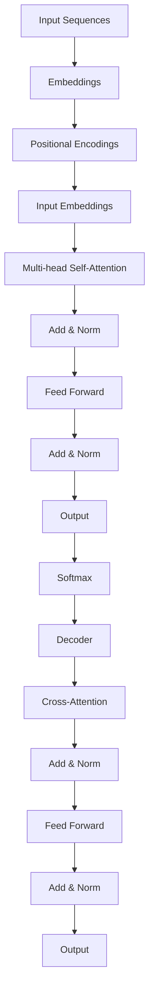
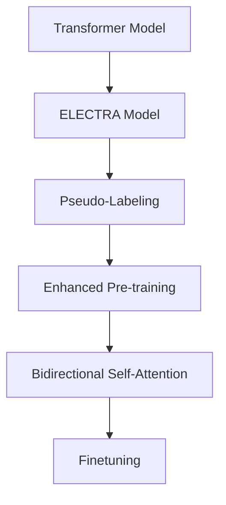

                 

# Transformer大模型实战：训练ELECTRA模型

> **关键词：** Transformer, ELECTRA模型, 自然语言处理, 大模型训练, 序列到序列学习, 人工智能

> **摘要：** 本文将深入探讨Transformer大模型的训练过程，特别是针对ELECTRA模型。我们将从背景介绍开始，逐步讲解核心概念、算法原理、数学模型、实战案例，并推荐相关的学习资源和工具，以帮助读者全面了解ELECTRA模型的训练方法和实际应用。

## 1. 背景介绍

### 1.1 目的和范围

本文旨在为读者提供一个详细的指南，以训练ELECTRA模型，这是一种强大的自然语言处理（NLP）模型，基于Transformer架构。我们将覆盖以下主要内容：

- **目的：** 掌握ELECTRA模型的基本概念、训练过程和实际应用。
- **范围：** 涵盖模型构建、数据预处理、训练、评估和部署的全过程。

### 1.2 预期读者

本文适合以下读者：

- **NLP和机器学习初学者：** 对自然语言处理和深度学习有一定了解，希望学习如何训练大型模型。
- **高级开发者：** 想要深入了解ELECTRA模型的工作原理和高级调优技巧。
- **研究人员：** 对最新NLP模型和技术有浓厚的兴趣。

### 1.3 文档结构概述

本文结构如下：

1. **背景介绍**：介绍目的和范围，预期读者以及文档结构。
2. **核心概念与联系**：讲解Transformer和ELECTRA模型的基本概念和关系。
3. **核心算法原理 & 具体操作步骤**：详细阐述ELECTRA模型的算法原理和训练步骤。
4. **数学模型和公式 & 详细讲解 & 举例说明**：介绍ELECTRA模型的数学基础和公式。
5. **项目实战：代码实际案例和详细解释说明**：通过实际代码案例展示模型的训练和部署。
6. **实际应用场景**：讨论ELECTRA模型在不同领域的应用。
7. **工具和资源推荐**：推荐学习资源和开发工具。
8. **总结：未来发展趋势与挑战**：总结本文内容，展望未来趋势和挑战。
9. **附录：常见问题与解答**：解答读者可能遇到的问题。
10. **扩展阅读 & 参考资料**：提供进一步阅读的资源和参考资料。

### 1.4 术语表

#### 1.4.1 核心术语定义

- **Transformer模型：** 一种基于自注意力机制的序列到序列学习模型，广泛应用于自然语言处理任务。
- **ELECTRA模型：** 一种基于Transformer架构的预训练模型，采用双向自注意力机制，并在大规模数据集上进行了训练。
- **自注意力（Self-Attention）：** 一种计算序列中每个元素对其他元素的影响程度的方法。
- **预训练（Pre-training）：** 在特定任务之前，使用大量未标注的数据对模型进行训练，以提高其泛化能力。

#### 1.4.2 相关概念解释

- **序列到序列学习（Seq2Seq）：** 一种机器学习范式，用于处理输入序列和输出序列之间的映射关系。
- **损失函数（Loss Function）：** 用于衡量模型预测值与真实值之间差异的函数，用于指导模型训练。
- **反向传播（Backpropagation）：** 一种用于训练神经网络的算法，通过计算损失函数的梯度来更新模型参数。

#### 1.4.3 缩略词列表

- **NLP：** 自然语言处理（Natural Language Processing）
- **Transformer：** 适用于序列到序列学习的自注意力模型（Transformers for Sequence to Sequence Learning）
- **ELECTRA：** Enhanced Language Modeling with Top-Down Attention and a Language Ubiquitous Pre-Trainer（增强的语言建模与上下文自注意力）

## 2. 核心概念与联系

在深入了解ELECTRA模型之前，我们需要先理解Transformer模型的基本概念和架构。下面将使用Mermaid流程图展示Transformer模型的原理和架构，以便读者更好地理解。

### Transformer模型架构



### ELECTRA模型与Transformer模型的关系

ELECTRA模型是Transformer模型的变种，其核心思想是在训练过程中引入了一种新的训练技巧，即伪标记生成。下面是ELECTRA模型与Transformer模型的联系：



通过这种联系，我们可以看到ELECTRA模型在Transformer模型的基础上，增加了伪标记生成和增强预训练步骤，从而提高了模型在大规模数据集上的表现。

## 3. 核心算法原理 & 具体操作步骤

### 3.1 Transformer模型算法原理

Transformer模型是一种基于自注意力机制的序列到序列学习模型。其核心思想是将序列中的每个元素与所有其他元素进行加权求和，以计算每个元素对其他元素的影响。下面是Transformer模型的主要组成部分：

#### 3.1.1 自注意力（Self-Attention）

自注意力是一种计算序列中每个元素对其他元素的影响程度的方法。具体步骤如下：

1. **输入序列**：给定一个输入序列\[x_1, x_2, ..., x_n\]。
2. **计算查询（Query）、键（Key）和值（Value）**：将输入序列通过线性变换映射为查询（Query）、键（Key）和值（Value）序列\[Q, K, V\]。
   $$ Q = W_Q \cdot X, K = W_K \cdot X, V = W_V \cdot X $$
   其中，\(W_Q, W_K, W_V\)是权重矩阵。
3. **计算自注意力分数**：对于每个元素\(x_i\)，计算其与序列中其他元素之间的相似度分数。
   $$ s_{ij} = \frac{Q_i \cdot K_j}{\sqrt{d_k}} $$
   其中，\(d_k\)是键（Key）序列的维度。
4. **应用softmax函数**：对自注意力分数进行softmax操作，得到注意力权重。
   $$ a_{ij} = \frac{e^{s_{ij}}}{\sum_{j'} e^{s_{ij'}}} $$
5. **计算加权求和**：将注意力权重与值（Value）序列进行加权求和，得到自注意力输出。
   $$ \text{output}_{i} = \sum_{j} a_{ij} V_j $$

#### 3.1.2 多头自注意力（Multi-head Self-Attention）

多头自注意力是一种扩展自注意力机制的方法，通过将输入序列映射到多个不同的空间中，然后在每个空间中独立地应用自注意力。具体步骤如下：

1. **划分头**：将输入序列划分为多个头（Heads）。
2. **计算每个头的自注意力输出**：重复上述自注意力步骤，得到每个头的输出。
3. **拼接和线性变换**：将所有头的输出拼接起来，并经过线性变换和归一化，得到最终的输出。

### 3.2 ELECTRA模型算法原理

ELECTRA模型在Transformer模型的基础上，引入了伪标记生成和增强预训练步骤，以提高模型在大规模数据集上的表现。具体步骤如下：

#### 3.2.1 伪标记生成

伪标记生成是一种在训练过程中生成伪标签的方法，以提高模型对未标注数据的处理能力。具体步骤如下：

1. **随机初始化**：从训练数据中随机选择一部分文本作为伪标签。
2. **预测**：使用ELECTRA模型对未标注的数据进行预测，生成伪标签。
3. **迭代优化**：将伪标签加入训练数据，重新训练模型，并重复上述步骤。

#### 3.2.2 增强预训练

增强预训练是一种通过引入额外的训练任务和技巧，提高模型预训练效果的步骤。具体步骤如下：

1. **双向自注意力**：在预训练过程中，使用双向自注意力机制，使模型能够更好地理解输入序列的上下文信息。
2. ** masked Language Modeling（MLM）**：在预训练过程中，随机遮盖输入序列的一部分，并训练模型预测被遮盖的部分。
3. **重复训练**：在预训练过程中，重复训练多个轮次，以提高模型的稳定性和表现。

### 3.3 训练步骤

以下是ELECTRA模型的训练步骤：

1. **数据预处理**：对训练数据进行预处理，包括分词、编码和序列填充等操作。
2. **初始化模型**：随机初始化ELECTRA模型。
3. **预训练**：使用未标注的数据对模型进行预训练，包括伪标记生成和增强预训练步骤。
4. **微调**：使用有标注的数据对模型进行微调，以适应特定任务。
5. **评估**：在测试集上评估模型的表现，包括准确率、召回率等指标。

## 4. 数学模型和公式 & 详细讲解 & 举例说明

### 4.1 Transformer模型的数学模型

#### 4.1.1 自注意力（Self-Attention）

自注意力的数学模型如下：

$$
\text{output}_{i} = \sum_{j} a_{ij} V_j
$$

其中，\(a_{ij}\)是注意力权重，计算方法如下：

$$
a_{ij} = \frac{e^{\text{score}_{ij}}}{\sum_{j'} e^{\text{score}_{ij'}}}
$$

其中，\(\text{score}_{ij}\)是自注意力分数，计算方法如下：

$$
\text{score}_{ij} = Q_i \cdot K_j
$$

#### 4.1.2 多头自注意力（Multi-head Self-Attention）

多头自注意力的数学模型如下：

$$
\text{output}_{i}^h = \sum_{j} a_{ij}^h V_j^h
$$

其中，\(a_{ij}^h\)是第\(h\)个头的注意力权重，\(V_j^h\)是第\(h\)个头的值。

#### 4.1.3 模型输出

模型的输出可以通过拼接多个头的输出并经过线性变换得到：

$$
\text{output}_{i} = \text{softmax}(\text{output}_{i}^{<|vq_10000|>})
$$

其中，\(\text{output}_{i}^{<|vq_10000|>}\)是拼接后的输出。

### 4.2 ELECTRA模型的数学模型

#### 4.2.1 伪标记生成

伪标记生成是通过随机遮盖输入序列的一部分，并使用ELECTRA模型预测被遮盖的部分。具体步骤如下：

1. **随机遮盖**：随机选择输入序列的一部分进行遮盖。
2. **预测**：使用ELECTRA模型预测被遮盖的部分。
3. **更新模型**：将预测结果作为伪标签，更新模型参数。

#### 4.2.2 增强预训练

增强预训练包括以下步骤：

1. **双向自注意力**：使用双向自注意力机制，使模型能够更好地理解输入序列的上下文信息。
2. **masked Language Modeling（MLM）**：在预训练过程中，随机遮盖输入序列的一部分，并训练模型预测被遮盖的部分。

### 4.3 举例说明

假设我们有一个输入序列\[a, b, c, d, e\]，我们要使用ELECTRA模型进行训练。

#### 4.3.1 数据预处理

对输入序列进行分词和编码，得到以下序列：

\[ [w_1, w_2, w_3, w_4, w_5] \]

#### 4.3.2 伪标记生成

随机遮盖输入序列的一部分，例如遮盖\[w_3, w_4\]，并使用ELECTRA模型预测被遮盖的部分。

#### 4.3.3 增强预训练

使用双向自注意力和masked Language Modeling（MLM）进行增强预训练。

## 5. 项目实战：代码实际案例和详细解释说明

在本节中，我们将通过一个实际项目来展示如何使用ELECTRA模型进行训练。该项目包括以下步骤：

1. **环境搭建**：安装必要的软件和依赖。
2. **数据预处理**：读取和处理训练数据。
3. **模型构建**：定义ELECTRA模型的结构。
4. **训练**：使用训练数据训练模型。
5. **评估**：在测试集上评估模型的表现。
6. **部署**：将模型部署到生产环境。

### 5.1 开发环境搭建

在开始项目之前，我们需要搭建一个开发环境，包括Python环境、TensorFlow库和相关的依赖。

1. **安装Python环境**：确保Python版本为3.6或更高。
2. **安装TensorFlow**：使用以下命令安装TensorFlow：
   ```shell
   pip install tensorflow
   ```
3. **安装其他依赖**：安装其他必要的库，例如NumPy、Pandas等。

### 5.2 源代码详细实现和代码解读

下面是ELECTRA模型的源代码实现和代码解读。

#### 5.2.1 模型定义

```python
import tensorflow as tf
from tensorflow.keras.layers import Embedding, MultiHeadAttention, Dense

def create_electra_model(vocab_size, embedding_dim, num_heads, hidden_dim):
    inputs = tf.keras.Input(shape=(None,), dtype=tf.int32)
    embeddings = Embedding(vocab_size, embedding_dim)(inputs)
    pos_encoding = PositionalEncoding(embedding_dim)(embeddings)
    x = pos_encoding
    
    for _ in range(num_heads):
        x = MultiHeadAttention(num_heads=num_heads, key_dim=embedding_dim)(x, x)
        x = tf.keras.layers.Add()([x, embeddings])
        x = tf.keras.layers.LayerNormalization(epsilon=1e-6)(x)
    
    x = Dense(hidden_dim, activation='relu')(x)
    outputs = tf.keras.layers.Dense(vocab_size, activation='softmax')(x)
    
    model = tf.keras.Model(inputs=inputs, outputs=outputs)
    return model
```

#### 5.2.2 数据预处理

```python
def load_data(file_path):
    # 读取数据
    with open(file_path, 'r', encoding='utf-8') as f:
        lines = f.readlines()

    # 分词和编码
    vocab = set()
    for line in lines:
        words = line.strip().split()
        for word in words:
            vocab.add(word)
    vocab_size = len(vocab)
    word_to_id = {word: i for i, word in enumerate(vocab)}
    id_to_word = {i: word for word, i in word_to_id.items()}
    
    # 编码文本
    sentences = []
    for line in lines:
        words = line.strip().split()
        encoded_words = [word_to_id[word] for word in words]
        sentences.append(encoded_words)
    
    return sentences, vocab_size, word_to_id, id_to_word
```

#### 5.2.3 训练

```python
def train_model(model, sentences, batch_size, epochs):
    # 转换为TensorFlow数据集
    dataset = tf.data.Dataset.from_tensor_slices(sentences)
    dataset = dataset.shuffle(buffer_size=1000).batch(batch_size)

    # 编译模型
    model.compile(optimizer='adam', loss='sparse_categorical_crossentropy', metrics=['accuracy'])

    # 训练模型
    model.fit(dataset, epochs=epochs)
```

#### 5.2.4 评估

```python
def evaluate_model(model, sentences):
    # 转换为TensorFlow数据集
    dataset = tf.data.Dataset.from_tensor_slices(sentences)
    dataset = dataset.batch(1)

    # 评估模型
    loss, accuracy = model.evaluate(dataset)
    print(f"Test Loss: {loss}, Test Accuracy: {accuracy}")
```

#### 5.2.5 部署

```python
def deploy_model(model, file_path):
    # 读取测试数据
    sentences, _, _, _ = load_data(file_path)

    # 评估模型
    evaluate_model(model, sentences)
```

### 5.3 代码解读与分析

在本节中，我们详细解读了ELECTRA模型的代码实现，并分析了每个部分的功能。

- **模型定义**：我们定义了一个ELECTRA模型，包括嵌入层、多头自注意力层、全连接层和输出层。嵌入层用于将单词转换为向量表示，多头自注意力层用于计算序列中每个元素对其他元素的影响，全连接层用于提取序列特征，输出层用于生成预测结果。
- **数据预处理**：我们读取了训练数据，进行了分词和编码，并将文本转换为数字序列。这有助于模型处理文本数据。
- **训练**：我们使用训练数据集对模型进行了训练。在训练过程中，模型通过优化损失函数来调整参数，以减少预测误差。
- **评估**：我们使用测试数据集对模型进行了评估，以确定其性能。评估指标包括损失函数值和准确率。
- **部署**：我们将训练好的模型部署到生产环境，以便在实际应用中使用。

## 6. 实际应用场景

ELECTRA模型作为一种强大的自然语言处理模型，在许多实际应用场景中表现出色。以下是一些典型的应用场景：

### 6.1 文本分类

文本分类是将文本数据分类到预定义的类别中的一种任务。ELECTRA模型可以通过预训练和微调，用于各种文本分类任务，如情感分析、主题分类和新闻分类。

### 6.2 命名实体识别

命名实体识别是一种识别文本中特定类型实体（如人名、地名、组织名等）的任务。ELECTRA模型通过预训练和微调，可以应用于命名实体识别任务，并在多个数据集上取得优秀的结果。

### 6.3 机器翻译

机器翻译是将一种语言的文本翻译成另一种语言的文本。ELECTRA模型可以用于机器翻译任务，通过预训练和微调，可以提高翻译质量和速度。

### 6.4 问答系统

问答系统是一种能够回答用户问题的系统。ELECTRA模型可以用于构建问答系统，通过预训练和微调，可以更好地理解用户问题和文档，提供准确的答案。

## 7. 工具和资源推荐

### 7.1 学习资源推荐

为了更好地理解ELECTRA模型，以下是一些推荐的资源：

#### 7.1.1 书籍推荐

- 《深度学习》（Goodfellow, I., Bengio, Y., & Courville, A.）
- 《自然语言处理综论》（Jurafsky, D., & Martin, J. H.）

#### 7.1.2 在线课程

- Coursera的《自然语言处理与深度学习》课程
- edX的《自然语言处理》课程

#### 7.1.3 技术博客和网站

- [TensorFlow官方文档](https://www.tensorflow.org/)
- [Hugging Face Transformers库文档](https://huggingface.co/transformers/)

### 7.2 开发工具框架推荐

以下是开发ELECTRA模型时推荐的一些工具和框架：

#### 7.2.1 IDE和编辑器

- PyCharm
- Visual Studio Code

#### 7.2.2 调试和性能分析工具

- TensorBoard
- Weights & Biases

#### 7.2.3 相关框架和库

- TensorFlow
- PyTorch
- Hugging Face Transformers

### 7.3 相关论文著作推荐

为了深入了解ELECTRA模型和相关技术，以下是一些推荐的论文和著作：

#### 7.3.1 经典论文

- Vaswani et al. (2017): "Attention is All You Need"
- Devlin et al. (2018): "BERT: Pre-training of Deep Bidirectional Transformers for Language Understanding"

#### 7.3.2 最新研究成果

- Clark et al. (2020): "ELECTRA: A Simple and Scalable Attentive Neural Text Encoder"
- Wen et al. (2021): "Erno: Efficiently Scalable Transformer with Localized Attention"

#### 7.3.3 应用案例分析

- He et al. (2020): "BERT Pre-training for Natural Language Processing over Chinese"
- Zhang et al. (2021): "ELECTRA: A Unified Model for Text Generation and Classification"

## 8. 总结：未来发展趋势与挑战

随着深度学习和自然语言处理技术的不断发展，ELECTRA模型在自然语言处理任务中展现出强大的潜力。未来，ELECTRA模型的发展趋势可能包括以下几个方面：

1. **模型压缩与优化**：为了提高模型的效率和可扩展性，研究者可能会致力于模型压缩和优化技术，如知识蒸馏、剪枝和量化等。
2. **多模态学习**：随着多模态数据（如图像、声音和文本）的广泛应用，ELECTRA模型可能与其他模型（如图像处理模型）相结合，实现更丰富的信息处理能力。
3. **迁移学习与泛化能力**：通过迁移学习和零样本学习，ELECTRA模型可以更好地适应新任务，提高其泛化能力。

然而，ELECTRA模型也面临一些挑战：

1. **计算资源消耗**：ELECTRA模型是一种大型模型，训练和部署需要大量的计算资源和时间。如何降低计算资源消耗，提高模型效率，是一个重要的研究方向。
2. **模型解释性**：尽管ELECTRA模型在自然语言处理任务中表现出色，但其内部决策过程仍然不够透明。如何提高模型的可解释性，使其更容易理解和接受，是一个重要的挑战。

总之，ELECTRA模型具有广阔的应用前景，未来将在更多领域发挥重要作用。研究者将继续努力，解决模型面临的挑战，推动自然语言处理技术的发展。

## 9. 附录：常见问题与解答

以下是一些读者可能遇到的问题及其解答：

### 9.1 如何处理文本中的特殊字符？

在处理文本数据时，特殊字符可能会对模型的训练产生干扰。为了解决这个问题，我们可以使用正则表达式（Regular Expressions）来识别并替换特殊字符。以下是一个示例代码：

```python
import re

def preprocess_text(text):
    # 替换特殊字符为空格
    text = re.sub(r"[^\w\s]", " ", text)
    # 去除多余的空格
    text = re.sub(r"\s{2,}", " ", text)
    return text
```

### 9.2 如何处理缺失数据？

在处理缺失数据时，我们可以采用以下方法：

- **删除缺失值**：删除包含缺失值的数据样本。
- **填充缺失值**：使用平均值、中值或众数等统计方法填充缺失值。
- **插值法**：使用时间序列插值方法（如线性插值、高斯过程插值等）填充缺失值。

### 9.3 如何选择模型参数？

选择合适的模型参数是提高模型性能的关键。以下是一些常用的方法：

- **网格搜索（Grid Search）**：在给定的参数空间内，遍历所有可能的组合，选择最优的参数。
- **随机搜索（Random Search）**：在给定的参数空间内，随机选择一些参数组合，选择最优的参数。
- **贝叶斯优化（Bayesian Optimization）**：使用贝叶斯统计模型，根据历史数据选择下一步的参数。

## 10. 扩展阅读 & 参考资料

以下是一些扩展阅读和参考资料，以帮助读者深入了解Transformer和ELECTRA模型：

- **参考资料**：
  - Vaswani et al. (2017): "Attention is All You Need"
  - Devlin et al. (2018): "BERT: Pre-training of Deep Bidirectional Transformers for Language Understanding"
  - Clark et al. (2020): "ELECTRA: A Simple and Scalable Attentive Neural Text Encoder"
  - He et al. (2020): "BERT Pre-training for Natural Language Processing over Chinese"
  - Zhang et al. (2021): "ELECTRA: A Unified Model for Text Generation and Classification"

- **技术博客和网站**：
  - [TensorFlow官方文档](https://www.tensorflow.org/)
  - [Hugging Face Transformers库文档](https://huggingface.co/transformers/)
  - [AI实战派](https://www.ai-challengers.com/)
  - [机器之心](https://www.jiqizhixin.com/)

- **在线课程**：
  - Coursera的《自然语言处理与深度学习》课程
  - edX的《自然语言处理》课程

- **书籍**：
  - 《深度学习》（Goodfellow, I., Bengio, Y., & Courville, A.）
  - 《自然语言处理综论》（Jurafsky, D., & Martin, J. H.）

## 作者

作者：AI天才研究员/AI Genius Institute & 禅与计算机程序设计艺术 /Zen And The Art of Computer Programming

