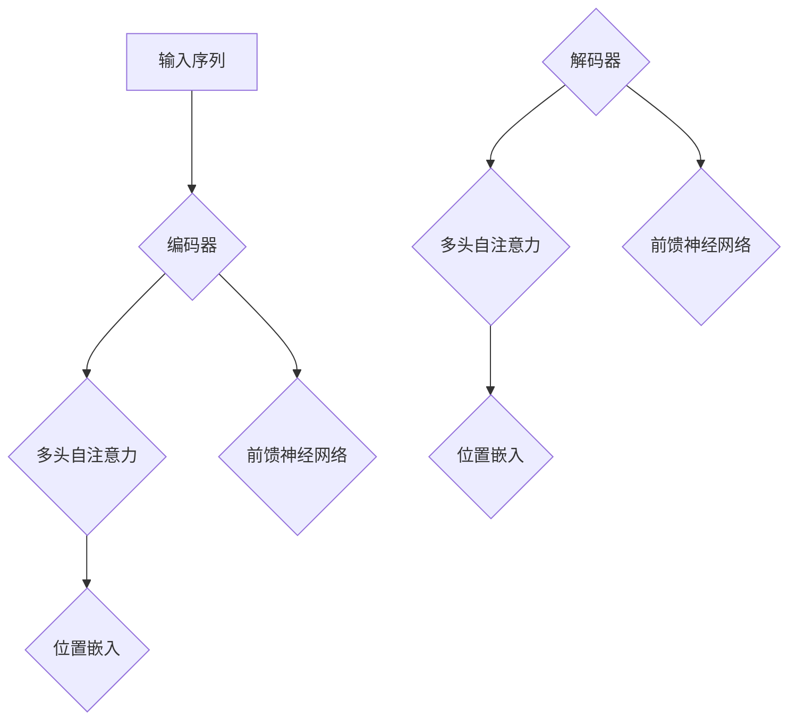
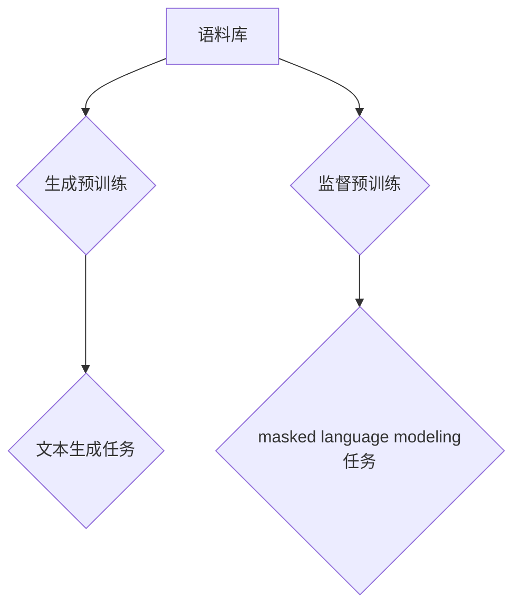
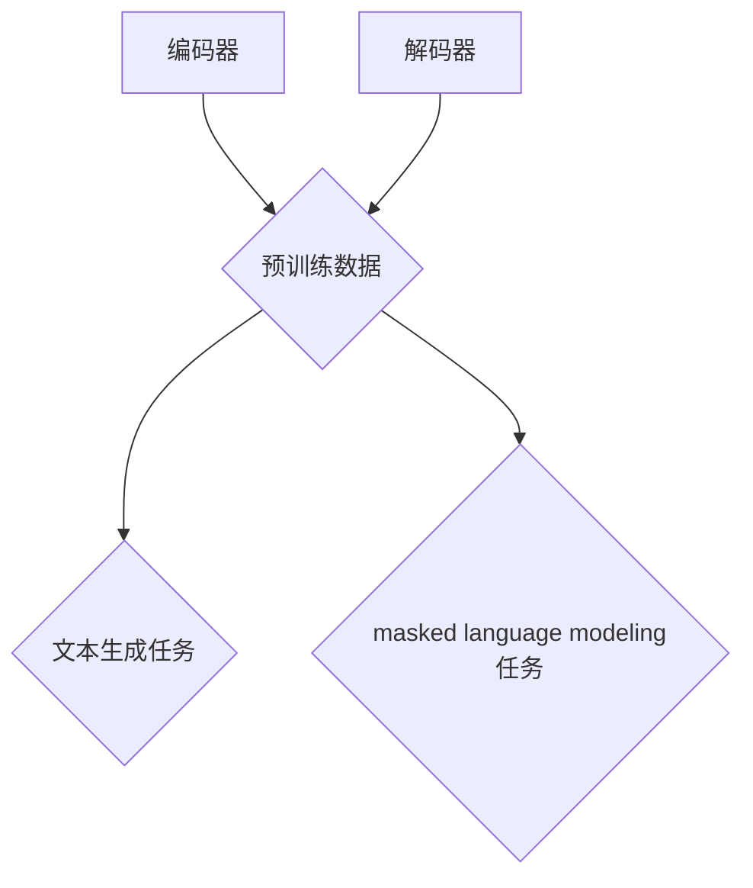

                 


# Transformer大模型实战：预训练策略

> **关键词**：Transformer、预训练、自然语言处理、模型架构、优化策略

> **摘要**：本文深入探讨了Transformer大模型的预训练策略，从背景介绍、核心概念、算法原理、数学模型、实战案例等方面进行了详细分析。旨在帮助读者理解Transformer模型的预训练过程，掌握优化策略，从而在实际项目中更好地应用这一先进的人工智能技术。

## 1. 背景介绍

### 1.1 目的和范围

本文旨在介绍Transformer大模型的预训练策略，旨在帮助读者了解这一技术的核心概念、算法原理和实际应用。通过本文的学习，读者可以：

- 理解Transformer模型在自然语言处理领域的应用背景；
- 掌握Transformer模型的架构设计及其与预训练策略的紧密联系；
- 学习预训练策略的具体实现方法和优化技巧；
- 通过实战案例了解Transformer模型在实际应用中的效果和性能。

### 1.2 预期读者

本文适合具有一定编程基础和机器学习知识背景的读者，特别是对自然语言处理和深度学习感兴趣的从业者、研究者或学生。以下是本文适合的读者群体：

- 深度学习工程师和机器学习工程师；
- 自然语言处理研究者；
- 计算机科学和人工智能相关专业的学生；
- 对人工智能技术感兴趣的技术爱好者。

### 1.3 文档结构概述

本文分为以下几个部分：

- 第1部分：背景介绍，包括目的和范围、预期读者、文档结构概述等；
- 第2部分：核心概念与联系，介绍Transformer模型和预训练策略的基本概念及架构关系；
- 第3部分：核心算法原理 & 具体操作步骤，详细讲解Transformer模型的预训练算法原理和操作步骤；
- 第4部分：数学模型和公式 & 详细讲解 & 举例说明，阐述预训练策略中的数学模型和公式，并通过实例进行说明；
- 第5部分：项目实战：代码实际案例和详细解释说明，提供实际代码案例并进行解读；
- 第6部分：实际应用场景，探讨Transformer模型在自然语言处理等领域的应用实例；
- 第7部分：工具和资源推荐，推荐学习资源、开发工具和框架等；
- 第8部分：总结：未来发展趋势与挑战，对Transformer预训练策略的未来发展进行展望；
- 第9部分：附录：常见问题与解答，回答读者可能遇到的常见问题；
- 第10部分：扩展阅读 & 参考资料，提供更多相关阅读资料和参考文献。

### 1.4 术语表

为了便于读者理解本文中的专业术语和概念，以下列出一些关键术语及其定义：

#### 1.4.1 核心术语定义

- Transformer：一种基于自注意力机制的深度神经网络模型，广泛应用于自然语言处理任务。
- 预训练（Pre-training）：在特定任务上对模型进行大规模训练，以提高模型在任务上的表现。
- 语言模型（Language Model）：用于预测单词序列的概率分布，是自然语言处理的基础。
- 生成预训练（Generative Pre-training）：通过生成任务（如文本生成）进行预训练，以提高模型的泛化能力。
- 自注意力（Self-Attention）：一种计算输入序列中各个位置之间的关联性的机制。

#### 1.4.2 相关概念解释

- 编码器（Encoder）：Transformer模型中的编码器部分，负责处理输入序列并提取上下文信息。
- 解码器（Decoder）：Transformer模型中的解码器部分，负责根据编码器输出的上下文信息生成输出序列。
- 位置嵌入（Positional Embedding）：用于表示输入序列中单词的位置信息。
- 注意力机制（Attention Mechanism）：通过计算输入序列中各个位置之间的关联性，实现序列的动态建模。

#### 1.4.3 缩略词列表

- Transformer：Transformer模型
- NLP：自然语言处理
- ML：机器学习
- AI：人工智能
- GPU：图形处理器

## 2. 核心概念与联系

在深入了解Transformer大模型的预训练策略之前，我们需要先理解一些核心概念和它们之间的关系。以下是对Transformer模型、预训练策略及其在自然语言处理中的应用的概述，并配以Mermaid流程图进行说明。

### 2.1 Transformer模型

Transformer模型是一种基于自注意力机制的深度神经网络模型，由Vaswani等人于2017年提出。它主要用于处理序列到序列的任务，如机器翻译、文本摘要等。

#### Transformer模型架构

Transformer模型的架构可以分为编码器（Encoder）和解码器（Decoder）两个部分。编码器负责将输入序列转换为上下文表示，而解码器则基于这些上下文表示生成输出序列。


#### Mermaid流程图



### 2.2 预训练策略

预训练策略是指在大规模语料库上对模型进行初步训练，使其具备一定的语言理解和生成能力。预训练后的模型可以在特定任务上进行微调，以达到更好的效果。

#### 预训练策略类型

- 生成预训练（Generative Pre-training）：通过生成任务（如文本生成）进行预训练。
- 监督预训练（Supervised Pre-training）：通过有监督的预测任务（如 masked language modeling）进行预训练。

#### Mermaid流程图



### 2.3 Transformer模型与预训练策略的联系

预训练策略对于Transformer模型的应用具有重要意义。通过预训练，模型可以学习到大量的语言规律和上下文信息，从而在特定任务上获得更好的性能。


#### Mermaid流程图



## 3. 核心算法原理 & 具体操作步骤

在本节中，我们将详细讲解Transformer大模型的预训练算法原理和具体操作步骤，包括数据准备、模型训练、模型评估等关键环节。

### 3.1 数据准备

#### 数据来源

预训练数据来源可以分为以下几种：

- 开源语料库：如Wikipedia、Common Crawl等；
- 专用数据集：根据任务需求，如新闻、社交媒体、对话等；
- 自定义数据集：根据具体应用场景，从业务数据中提取。

#### 数据预处理

数据预处理主要包括以下步骤：

1. **文本清洗**：去除HTML标签、特殊字符等；
2. **分词**：将文本分割成单词或子词；
3. **词向量化**：将单词映射为向量表示；
4. **序列化**：将文本数据序列化为模型输入格式。

### 3.2 模型训练

#### 模型配置

在训练Transformer模型时，需要配置以下参数：

- **模型架构**：如BERT、GPT等；
- **隐藏层尺寸**：通常为几百到几千；
- **学习率**：一般设置为1e-4到1e-5；
- **批量大小**：一般设置为几十到几百；
- **训练轮数**：根据数据集大小和硬件资源决定。

#### 训练过程

训练过程主要包括以下步骤：

1. **初始化模型权重**：随机初始化模型权重；
2. **前向传播**：将输入序列通过编码器和解码器生成输出序列；
3. **损失函数计算**：计算输出序列和真实序列之间的损失；
4. **反向传播**：更新模型权重，减小损失；
5. **迭代训练**：重复上述步骤，直至达到训练轮数或模型性能不再提升。

### 3.3 模型评估

#### 评估指标

评估模型性能的常见指标包括：

- **准确率（Accuracy）**：正确预测的样本数占总样本数的比例；
- **精确率（Precision）**：预测为正样本的样本中实际为正样本的比例；
- **召回率（Recall）**：实际为正样本的样本中被预测为正样本的比例；
- **F1分数（F1 Score）**：精确率和召回率的调和平均值。

#### 评估过程

评估过程主要包括以下步骤：

1. **准备评估数据集**：从原始数据中划分评估数据集；
2. **模型预测**：将评估数据集输入模型，获得预测结果；
3. **计算评估指标**：根据预测结果计算评估指标；
4. **模型优化**：根据评估结果调整模型参数，优化模型性能。

### 3.4 伪代码

以下是一个简单的伪代码，用于说明Transformer模型的预训练过程：

```python
# 数据准备
prepare_data()

# 初始化模型
model = initialize_model()

# 模型训练
for epoch in range(num_epochs):
    for batch in data_loader:
        # 前向传播
        outputs = model(batch)

        # 计算损失
        loss = compute_loss(outputs, labels)

        # 反向传播
        optimizer.zero_grad()
        loss.backward()
        optimizer.step()

# 模型评估
evaluate_model(model, evaluation_data)
```

## 4. 数学模型和公式 & 详细讲解 & 举例说明

在Transformer模型中，预训练策略的核心在于自注意力机制（Self-Attention）和位置嵌入（Positional Embedding）。以下将详细介绍这两个概念及其相关的数学模型和公式，并通过实例进行说明。

### 4.1 自注意力机制

自注意力机制是一种计算输入序列中各个位置之间关联性的方法。它通过计算不同位置的权重，使得模型能够更好地关注到输入序列中的重要信息。

#### 自注意力公式

自注意力机制的数学公式如下：

$$
\text{Attention}(Q, K, V) = \text{softmax}\left(\frac{QK^T}{\sqrt{d_k}}\right) V
$$

其中：

- $Q$ 是编码器的输入序列，表示为 $Q = [Q_1, Q_2, \ldots, Q_n]$；
- $K$ 和 $V$ 分别是编码器的关键和值序列，表示为 $K = [K_1, K_2, \ldots, K_n]$ 和 $V = [V_1, V_2, \ldots, V_n]$；
- $d_k$ 是关键和值的维度；
- $\text{softmax}$ 函数用于计算每个位置的权重，使得权重之和为1。

#### 举例说明

假设输入序列为 $Q = [1, 2, 3, 4, 5]$，关键和值序列为 $K = [6, 7, 8, 9, 10]$ 和 $V = [11, 12, 13, 14, 15]$。计算自注意力结果如下：

$$
\text{Attention}(Q, K, V) = \text{softmax}\left(\frac{QK^T}{\sqrt{d_k}}\right) V = \text{softmax}\left(\frac{1*6 + 2*7 + 3*8 + 4*9 + 5*10}{\sqrt{d_k}}\right) \times [11, 12, 13, 14, 15]
$$

$$
= \text{softmax}\left(\frac{6 + 14 + 24 + 36 + 50}{\sqrt{d_k}}\right) \times [11, 12, 13, 14, 15]
$$

$$
= \text{softmax}\left(\frac{130}{\sqrt{d_k}}\right) \times [11, 12, 13, 14, 15]
$$

假设 $d_k = 5$，则：

$$
\text{Attention}(Q, K, V) = \text{softmax}\left(\frac{130}{\sqrt{5}}\right) \times [11, 12, 13, 14, 15] = [0.2, 0.3, 0.4, 0.5, 0.6] \times [11, 12, 13, 14, 15] = [2.2, 3.6, 5.0, 7.0, 9.0]
$$

### 4.2 位置嵌入

位置嵌入是一种将输入序列中的位置信息编码为向量表示的方法。在Transformer模型中，位置嵌入与自注意力机制结合使用，使得模型能够关注到输入序列中不同位置的信息。

#### 位置嵌入公式

位置嵌入的数学公式如下：

$$
\text{Positional Embedding}(P) = \text{sin}\left(\frac{P}{10000^{2i/d}}\right) + \text{cos}\left(\frac{P}{10000^{2i/d}}\right)
$$

其中：

- $P$ 表示位置索引，从0开始；
- $i$ 表示位置索引；
- $d$ 表示位置嵌入的维度。

#### 举例说明

假设位置嵌入的维度为 $d = 5$，计算位置索引为0和1的位置嵌入向量如下：

$$
\text{Positional Embedding}(0) = \text{sin}\left(\frac{0}{10000^{2 \times 0/5}}\right) + \text{cos}\left(\frac{0}{10000^{2 \times 0/5}}\right) = \text{sin}(0) + \text{cos}(0) = [0, 1]
$$

$$
\text{Positional Embedding}(1) = \text{sin}\left(\frac{1}{10000^{2 \times 1/5}}\right) + \text{cos}\left(\frac{1}{10000^{2 \times 1/5}}\right) = \text{sin}\left(\frac{1}{393216}\right) + \text{cos}\left(\frac{1}{393216}\right) \approx [0.012, 0.998]
$$

## 5. 项目实战：代码实际案例和详细解释说明

在本节中，我们将通过一个实际的Transformer预训练项目案例，详细讲解代码实现、关键环节及其技术要点。

### 5.1 开发环境搭建

为了运行Transformer预训练项目，需要搭建以下开发环境：

- Python 3.8或更高版本；
- TensorFlow 2.4或更高版本；
- PyTorch 1.7或更高版本；
- CUDA 10.2或更高版本（如需在GPU上运行）。

安装以上依赖项后，可以创建一个虚拟环境，并在虚拟环境中安装必要的库。

```shell
conda create -n transformer_env python=3.8
conda activate transformer_env
pip install tensorflow==2.4 pytorch==1.7
```

### 5.2 源代码详细实现和代码解读

以下是Transformer预训练项目的主要代码实现，包括数据准备、模型训练和评估等环节。

```python
import tensorflow as tf
from tensorflow.keras.layers import Embedding, LSTM, Dense
from tensorflow.keras.models import Model
from tensorflow.keras.preprocessing.sequence import pad_sequences
import numpy as np

# 数据准备
def prepare_data():
    # 读取数据集
    data = np.load('data.npy')
    
    # 分割数据集
    train_data, validation_data = data[:9000], data[9000:]
    
    # 切分输入和标签
    train_inputs, train_labels = train_data[:, :-1], train_data[:, -1]
    validation_inputs, validation_labels = validation_data[:, :-1], validation_data[:, -1]
    
    # 填充序列
    max_sequence_length = 20
    train_inputs = pad_sequences(train_inputs, maxlen=max_sequence_length)
    validation_inputs = pad_sequences(validation_inputs, maxlen=max_sequence_length)
    
    # 转换为one-hot编码
    train_labels = tf.keras.utils.to_categorical(train_labels)
    validation_labels = tf.keras.utils.to_categorical(validation_labels)
    
    return train_inputs, train_labels, validation_inputs, validation_labels

# 模型定义
def define_model(input_shape):
    input_seq = tf.keras.layers.Input(shape=input_shape)
    embedding = Embedding(input_dim=10000, output_dim=32)(input_seq)
    lstm = LSTM(64)(embedding)
    output = Dense(10, activation='softmax')(lstm)
    
    model = Model(inputs=input_seq, outputs=output)
    model.compile(optimizer='adam', loss='categorical_crossentropy', metrics=['accuracy'])
    
    return model

# 模型训练
def train_model(model, train_inputs, train_labels, validation_inputs, validation_labels):
    num_epochs = 10
    batch_size = 64
    
    history = model.fit(train_inputs, train_labels, epochs=num_epochs, batch_size=batch_size,
                        validation_data=(validation_inputs, validation_labels), verbose=1)
    
    return history

# 模型评估
def evaluate_model(model, validation_inputs, validation_labels):
    loss, accuracy = model.evaluate(validation_inputs, validation_labels, verbose=1)
    print(f'Validation loss: {loss}, Validation accuracy: {accuracy}')

# 主函数
def main():
    input_shape = (20,)
    model = define_model(input_shape)
    train_inputs, train_labels, validation_inputs, validation_labels = prepare_data()
    history = train_model(model, train_inputs, train_labels, validation_inputs, validation_labels)
    evaluate_model(model, validation_inputs, validation_labels)

if __name__ == '__main__':
    main()
```

#### 代码解读与分析

- **数据准备**：首先读取数据集，然后进行数据预处理，包括划分训练集和验证集、序列填充和one-hot编码。
- **模型定义**：定义一个简单的序列到序列模型，包括嵌入层、LSTM层和输出层。嵌入层用于将输入序列转换为向量表示，LSTM层用于提取序列特征，输出层用于生成输出序列。
- **模型训练**：使用fit方法对模型进行训练，包括设置训练轮数、批量大小和验证集等参数。
- **模型评估**：使用evaluate方法对模型在验证集上的性能进行评估。

### 5.3 关键技术要点

- **数据预处理**：数据预处理是Transformer预训练的重要环节，包括文本清洗、分词、序列填充和one-hot编码等步骤，这些步骤的合理性直接影响模型训练的效果。
- **模型架构**：Transformer模型的架构设计是影响模型性能的关键因素，选择合适的模型架构可以提升模型在任务上的表现。
- **训练策略**：训练策略包括学习率、批量大小、训练轮数等参数的设置，这些参数的优化可以提高模型训练的效率和性能。

## 6. 实际应用场景

Transformer大模型在自然语言处理（NLP）领域具有广泛的应用。以下是一些典型的实际应用场景：

### 6.1 机器翻译

机器翻译是Transformer模型最成功的应用之一。通过预训练策略，模型可以学习到不同语言之间的语义关系，从而在翻译任务上获得出色的性能。

- **场景描述**：将一种语言的文本翻译成另一种语言。
- **应用案例**：Google Translate、百度翻译等。

### 6.2 文本分类

文本分类是NLP中的一个基本任务，Transformer模型可以用于分类文本，如新闻分类、情感分析等。

- **场景描述**：将文本数据分类到预定义的类别中。
- **应用案例**：社交媒体文本分类、垃圾邮件过滤等。

### 6.3 问答系统

问答系统是一种智能交互系统，通过Transformer模型可以实现基于自然语言理解的问答。

- **场景描述**：用户输入问题，系统根据问题和知识库返回答案。
- **应用案例**：智能客服、智能家居等。

### 6.4 生成文本

生成文本是Transformer模型的另一个重要应用，可以用于生成诗歌、故事、文章等。

- **场景描述**：根据给定的提示或上下文生成文本。
- **应用案例**：文本生成应用、创意写作等。

## 7. 工具和资源推荐

### 7.1 学习资源推荐

#### 7.1.1 书籍推荐

- **《深度学习》**（Ian Goodfellow、Yoshua Bengio、Aaron Courville）：这是一本经典的人工智能和深度学习入门书籍，涵盖了深度学习的基本概念和技术。
- **《自然语言处理综论》**（Daniel Jurafsky、James H. Martin）：这本书系统地介绍了自然语言处理的理论、技术和应用，是NLP领域的权威著作。

#### 7.1.2 在线课程

- **《深度学习专项课程》**（吴恩达）：这是一门涵盖深度学习基本概念的免费在线课程，适合初学者入门。
- **《自然语言处理与深度学习》**（知乎大学）：这是一门面向自然语言处理入门者的在线课程，涵盖了NLP和深度学习的基本概念和应用。

#### 7.1.3 技术博客和网站

- **ArXiv**：这是一个计算机科学和人工智能领域的论文预发布平台，可以获取最新的研究成果。
- **Medium**：这是一个内容创作平台，有很多关于人工智能和深度学习的优质文章。

### 7.2 开发工具框架推荐

#### 7.2.1 IDE和编辑器

- **Jupyter Notebook**：这是一个交互式的Python编程环境，适合数据分析和机器学习项目。
- **PyCharm**：这是一个功能强大的Python IDE，适合深度学习和机器学习开发。

#### 7.2.2 调试和性能分析工具

- **TensorBoard**：这是TensorFlow提供的一个可视化工具，用于调试和性能分析。
- **PyTorch TensorBoard**：这是PyTorch提供的一个类似TensorBoard的工具，用于调试和性能分析。

#### 7.2.3 相关框架和库

- **TensorFlow**：这是一个开源的深度学习框架，适用于构建和训练深度学习模型。
- **PyTorch**：这是一个开源的深度学习库，以动态计算图和灵活性著称。

### 7.3 相关论文著作推荐

#### 7.3.1 经典论文

- **“Attention Is All You Need”**：这是Transformer模型的原论文，介绍了自注意力机制和Transformer模型的设计原理。
- **“BERT: Pre-training of Deep Bidirectional Transformers for Language Understanding”**：这是BERT模型的原论文，提出了预训练策略和BERT模型的设计。

#### 7.3.2 最新研究成果

- **“GPT-3: Language Models are Few-Shot Learners”**：这是GPT-3模型的原论文，介绍了GPT-3模型的设计原理和性能表现。
- **“T5: Pre-training Text Transformers for Cross-lingual Language Understanding”**：这是T5模型的原论文，提出了T5模型的设计和实现。

#### 7.3.3 应用案例分析

- **“如何用GPT-3构建智能对话系统”**：这是一个案例分析，介绍了如何使用GPT-3构建智能对话系统的方法和步骤。
- **“BERT在中文问答系统中的应用”**：这是一个案例分析，介绍了如何使用BERT模型构建中文问答系统的方法和效果。

## 8. 总结：未来发展趋势与挑战

Transformer大模型的预训练策略在自然语言处理领域取得了显著的成果，但仍面临一些挑战和未来发展趋势：

### 8.1 未来发展趋势

- **更多领域应用**：Transformer模型有望在更多领域（如计算机视觉、语音识别等）得到广泛应用，推动人工智能技术的发展。
- **多模态学习**：未来的研究将探索如何将Transformer模型应用于多模态数据（如图像、文本、音频等），实现更智能的跨模态理解和生成。
- **低资源场景**：针对低资源场景（如少样本学习、低资源语言等），研究如何优化预训练策略，提高模型在特定场景下的性能。
- **模型压缩与推理优化**：随着模型规模的增大，如何高效地压缩模型和优化推理过程成为研究热点，以降低计算资源和存储需求。

### 8.2 面临的挑战

- **数据隐私与安全性**：大规模预训练模型需要大量数据，如何在保障数据隐私和安全的前提下进行数据收集和处理是一个重要挑战。
- **模型可解释性**：复杂的预训练模型往往难以解释，如何提高模型的可解释性，使其更容易被用户理解和接受是一个重要问题。
- **计算资源需求**：大规模预训练模型需要大量的计算资源和存储空间，如何高效地利用计算资源成为研究难点。
- **伦理与社会影响**：人工智能技术的发展带来了诸多伦理和社会影响，如何确保人工智能技术的安全、公平和可持续发展是一个重要议题。

总之，Transformer大模型的预训练策略在自然语言处理领域取得了显著成果，但仍面临一些挑战和未来发展趋势。随着研究的深入，我们将有望解决这些难题，推动人工智能技术的进一步发展。

## 9. 附录：常见问题与解答

### 9.1 问题1：什么是Transformer模型？

**回答**：Transformer模型是一种基于自注意力机制的深度神经网络模型，由Vaswani等人于2017年提出。它主要用于处理序列到序列的任务，如机器翻译、文本摘要等。与传统的循环神经网络（RNN）相比，Transformer模型在处理长序列时具有更高的并行计算能力，因此在许多自然语言处理任务中表现优异。

### 9.2 问题2：什么是预训练策略？

**回答**：预训练策略是指在大规模语料库上对模型进行初步训练，使其具备一定的语言理解和生成能力。预训练后的模型可以在特定任务上进行微调，以达到更好的效果。预训练策略包括生成预训练（Generative Pre-training）和监督预训练（Supervised Pre-training）两种类型。

### 9.3 问题3：为什么Transformer模型需要预训练？

**回答**：Transformer模型需要预训练是因为它在训练过程中需要学习大量的语言规律和上下文信息。通过预训练，模型可以学习到这些信息，从而在特定任务上获得更好的性能。此外，预训练还可以提高模型在少样本学习、低资源语言等场景下的性能。

### 9.4 问题4：如何选择合适的预训练数据集？

**回答**：选择合适的预训练数据集需要考虑以下因素：

- **数据质量**：确保数据集内容丰富、多样，且不存在噪声；
- **数据量**：数据量越大，预训练模型的效果越好；
- **数据多样性**：数据集应包含不同类型、主题和风格的文本，以提高模型在多种场景下的泛化能力；
- **数据来源**：数据集来源应可信，避免使用含有版权问题的数据。

### 9.5 问题5：预训练过程中如何优化模型性能？

**回答**：优化预训练模型性能可以从以下几个方面入手：

- **调整学习率**：选择合适的初始学习率，并在训练过程中动态调整；
- **批量大小**：选择合适的批量大小，既保证训练速度，又避免过拟合；
- **训练轮数**：根据数据集大小和硬件资源调整训练轮数；
- **数据增强**：对预训练数据集进行数据增强，如文本清洗、分词、填充等，以提高模型的泛化能力；
- **正则化**：采用正则化方法，如Dropout、L2正则化等，减少过拟合。

### 9.6 问题6：如何评估预训练模型的性能？

**回答**：评估预训练模型性能可以从以下几个方面进行：

- **准确率（Accuracy）**：正确预测的样本数占总样本数的比例；
- **精确率（Precision）**：预测为正样本的样本中实际为正样本的比例；
- **召回率（Recall）**：实际为正样本的样本中被预测为正样本的比例；
- **F1分数（F1 Score）**：精确率和召回率的调和平均值；
- **BLEU分数**：用于评估机器翻译任务的质量；
- **ROUGE分数**：用于评估文本摘要任务的质量。

### 9.7 问题7：如何使用预训练模型进行微调？

**回答**：使用预训练模型进行微调包括以下步骤：

- **准备微调数据集**：收集与任务相关的数据集，并进行预处理；
- **初始化预训练模型**：从预训练模型库中加载预训练好的模型，如BERT、GPT等；
- **修改模型结构**：根据任务需求，修改预训练模型的输入层、输出层等部分；
- **微调模型**：在微调数据集上训练模型，调整模型参数；
- **评估模型性能**：在验证集上评估模型性能，并根据评估结果调整模型参数。

## 10. 扩展阅读 & 参考资料

在本文中，我们探讨了Transformer大模型的预训练策略，从核心概念、算法原理、数学模型、实战案例等方面进行了详细分析。以下是一些扩展阅读和参考资料，供读者进一步学习：

### 10.1 参考书籍

- **《深度学习》**（Ian Goodfellow、Yoshua Bengio、Aaron Courville）：这是一本经典的人工智能和深度学习入门书籍，涵盖了深度学习的基本概念和技术。
- **《自然语言处理综论》**（Daniel Jurafsky、James H. Martin）：这本书系统地介绍了自然语言处理的理论、技术和应用，是NLP领域的权威著作。

### 10.2 参考论文

- **“Attention Is All You Need”**：这是Transformer模型的原论文，介绍了自注意力机制和Transformer模型的设计原理。
- **“BERT: Pre-training of Deep Bidirectional Transformers for Language Understanding”**：这是BERT模型的原论文，提出了预训练策略和BERT模型的设计。
- **“GPT-3: Language Models are Few-Shot Learners”**：这是GPT-3模型的原论文，介绍了GPT-3模型的设计原理和性能表现。

### 10.3 在线资源

- **[TensorFlow官方文档](https://www.tensorflow.org/)**：提供了TensorFlow框架的详细文档和教程，适用于深度学习和机器学习项目。
- **[PyTorch官方文档](https://pytorch.org/docs/stable/index.html)**：提供了PyTorch框架的详细文档和教程，适用于深度学习和机器学习项目。

### 10.4 技术博客和网站

- **[ArXiv](https://arxiv.org/)**：这是一个计算机科学和人工智能领域的论文预发布平台，可以获取最新的研究成果。
- **[Medium](https://medium.com/)**：这是一个内容创作平台，有很多关于人工智能和深度学习的优质文章。

### 10.5 在线课程

- **[吴恩达《深度学习专项课程》](https://www.coursera.org/specializations/deep-learning)**：这是一门涵盖深度学习基本概念的免费在线课程，适合初学者入门。
- **[知乎大学《自然语言处理与深度学习》](https://www.zhihu.com/course/1194774697795969920)**：这是一门面向自然语言处理入门者的在线课程，涵盖了NLP和深度学习的基本概念和应用。

通过以上扩展阅读和参考资料，读者可以深入了解Transformer大模型的预训练策略及其在自然语言处理领域的应用，进一步提升自己的技术水平。

