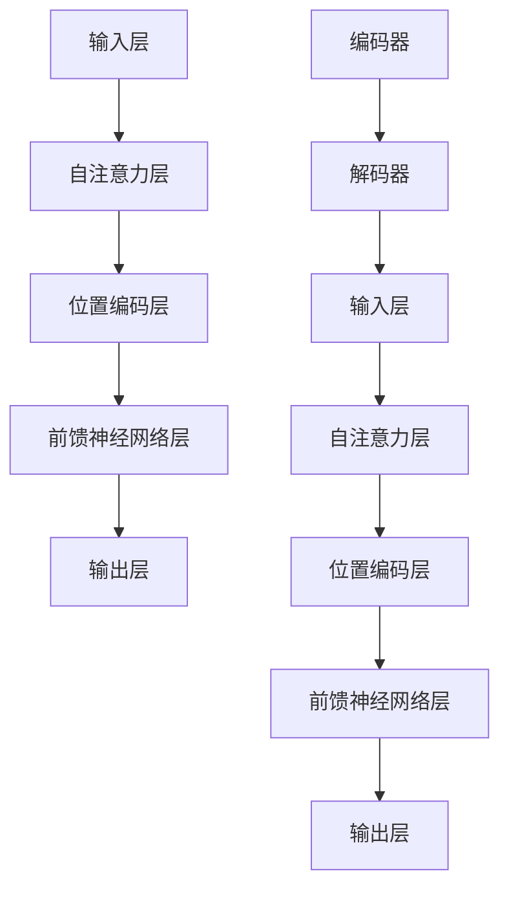

                 

### Transformer大模型实战：预训练过程

> **关键词：** Transformer、预训练、自然语言处理、神经网络、大规模语言模型

**摘要：** 本文将深入探讨Transformer大模型的预训练过程，详细解析其核心算法原理、数学模型以及实际操作步骤。通过案例分析与代码解读，我们将展示如何利用大规模数据集训练出高性能的语言模型，并探讨其在自然语言处理领域的广泛应用。文章旨在为读者提供全面、系统的Transformer大模型预训练指南，帮助理解其技术本质和实际应用价值。

## 1. 背景介绍

### 1.1 目的和范围

本文的主要目的是深入探讨Transformer大模型的预训练过程，帮助读者理解其核心算法原理、数学模型以及实际操作步骤。我们将通过详细的理论分析和案例解读，展示如何利用大规模数据集训练出高性能的语言模型，并探讨其在自然语言处理（NLP）领域的广泛应用。文章内容涵盖以下几个方面：

1. **Transformer模型概述**：介绍Transformer模型的基本架构和核心特点，以及其在NLP领域的广泛应用。
2. **预训练概念**：详细解释预训练的概念、目的和重要性，讨论预训练与微调的区别。
3. **核心算法原理**：深入剖析Transformer模型的核心算法原理，包括自注意力机制、位置编码、编码器和解码器等。
4. **数学模型和公式**：介绍Transformer模型中的关键数学模型和公式，包括自注意力计算、损失函数等。
5. **项目实战**：通过实际代码案例，展示如何使用大规模数据集进行预训练，并进行性能分析和调优。
6. **实际应用场景**：探讨Transformer大模型在自然语言处理、机器翻译、文本生成等领域的应用场景。
7. **工具和资源推荐**：推荐相关学习资源、开发工具和框架，帮助读者深入学习和实践Transformer大模型。

通过本文的阅读，读者将能够：

- **理解** Transformer模型的基本架构和核心特点。
- **掌握** Transformer模型的核心算法原理和数学模型。
- **掌握** Transformer大模型的预训练方法和实际操作步骤。
- **了解** Transformer大模型在自然语言处理领域的广泛应用。
- **具备** 在实际项目中应用Transformer大模型的能力。

### 1.2 预期读者

本文的预期读者主要包括以下几类：

1. **初学者**：对Transformer模型和预训练概念有初步了解，但缺乏系统学习和实践经验的读者。
2. **研究人员**：在自然语言处理、机器翻译、文本生成等领域进行研究和开发的科研人员。
3. **开发者**：有志于在自然语言处理领域进行实践和应用的程序员和工程师。
4. **专业人士**：从事人工智能、机器学习和自然语言处理相关工作，希望深入了解Transformer大模型的专业人士。

无论您属于哪一类读者，本文都将为您提供一个全面、系统的Transformer大模型预训练指南，帮助您掌握这一前沿技术。

### 1.3 文档结构概述

本文的结构安排如下：

1. **第1章 背景介绍**：介绍本文的目的、预期读者、文档结构和术语表。
2. **第2章 核心概念与联系**：介绍Transformer模型的基本架构和核心概念，并使用Mermaid流程图进行阐述。
3. **第3章 核心算法原理与具体操作步骤**：深入剖析Transformer模型的核心算法原理，并使用伪代码进行详细阐述。
4. **第4章 数学模型和公式与详细讲解与举例说明**：介绍Transformer模型中的关键数学模型和公式，并给出具体例子进行说明。
5. **第5章 项目实战：代码实际案例与详细解释说明**：通过实际代码案例，展示如何使用大规模数据集进行预训练，并进行性能分析和调优。
6. **第6章 实际应用场景**：探讨Transformer大模型在自然语言处理、机器翻译、文本生成等领域的应用场景。
7. **第7章 工具和资源推荐**：推荐相关学习资源、开发工具和框架，帮助读者深入学习和实践Transformer大模型。
8. **第8章 总结：未来发展趋势与挑战**：总结Transformer大模型的发展趋势和面临的主要挑战。
9. **第9章 附录：常见问题与解答**：提供常见问题的解答，帮助读者解决实际问题。
10. **第10章 扩展阅读与参考资料**：推荐扩展阅读材料和参考资料，供读者进一步学习。

通过本文的阅读，读者将能够全面了解Transformer大模型预训练的各个方面，为实际应用奠定坚实基础。

### 1.4 术语表

在本文中，我们将使用以下术语：

#### 1.4.1 核心术语定义

1. **Transformer模型**：一种基于自注意力机制的神经网络模型，主要用于自然语言处理任务。
2. **预训练**：在大规模数据集上对神经网络模型进行训练，以提高其通用性和表现力。
3. **微调**：在预训练的基础上，针对特定任务进行细粒度的训练，以优化模型在特定任务上的性能。
4. **自注意力机制**：一种计算方法，通过计算输入序列中每个元素与其他元素的相关性，实现全局信息的整合。
5. **编码器**：在Transformer模型中，用于将输入序列编码为固定长度的向量。
6. **解码器**：在Transformer模型中，用于将编码后的向量解码为输出序列。

#### 1.4.2 相关概念解释

1. **注意力机制**：一种计算方法，通过计算输入序列中每个元素与其他元素的相关性，实现全局信息的整合。
2. **多头注意力**：在Transformer模型中，将输入序列分成多个子序列，每个子序列分别进行注意力计算，从而提高模型的表征能力。
3. **位置编码**：一种对输入序列进行编码的方法，以引入序列中的位置信息，使模型能够理解输入序列的顺序。

#### 1.4.3 缩略词列表

| 缩略词 | 全称               | 中文翻译       |
|--------|-------------------|----------------|
| NLP    | Natural Language Processing | 自然语言处理 |
| Transformer | Transformer Model | 自注意力模型   |
| LSTM   | Long Short-Term Memory | 长短时记忆网络 |
| BERT   | Bidirectional Encoder Representations from Transformers | 双向编码表示Transformer模型 |
| GPT    | Generative Pre-trained Transformer | 生成预训练Transformer模型 |

## 2. 核心概念与联系

Transformer模型是一种基于自注意力机制的深度学习模型，它在自然语言处理（NLP）领域取得了显著的成果。为了更好地理解Transformer模型，我们需要从其基本架构和核心概念开始。

### 2.1 Transformer模型的基本架构

Transformer模型由编码器（Encoder）和解码器（Decoder）两部分组成，主要分为以下几层：

1. **输入层**：输入层接收原始文本序列，将其转化为词嵌入（Word Embeddings）。
2. **自注意力层**：自注意力层通过自注意力机制计算输入序列中每个元素与其他元素的相关性，实现全局信息的整合。
3. **位置编码层**：为了使模型能够理解输入序列的顺序，需要对输入序列进行位置编码（Positional Encoding）。
4. **前馈神经网络层**：在自注意力层之后，通过两个全连接层（Fully Connected Layer）进行前馈神经网络（Feed Forward Neural Network）计算。
5. **输出层**：输出层将编码后的向量解码为输出序列。

### 2.2 Transformer模型的核心概念

#### 自注意力机制

自注意力机制是Transformer模型的核心组件，通过计算输入序列中每个元素与其他元素的相关性，实现全局信息的整合。自注意力机制的基本计算公式如下：

$$
\text{Attention}(Q, K, V) = \text{softmax}\left(\frac{QK^T}{\sqrt{d_k}}\right)V
$$

其中，$Q$、$K$、$V$ 分别代表查询向量、键向量和值向量，$d_k$ 代表键向量的维度。自注意力机制可以分为以下几步：

1. **计算相似度**：计算查询向量 $Q$ 与键向量 $K$ 的内积，得到相似度分数。
2. **归一化**：对相似度分数进行归一化处理，得到概率分布。
3. **加权求和**：将概率分布与值向量 $V$ 进行加权求和，得到加权后的输出。

#### 多头注意力

多头注意力（Multi-Head Attention）通过将输入序列分成多个子序列，每个子序列分别进行注意力计算，从而提高模型的表征能力。多头注意力的基本计算公式如下：

$$
\text{MultiHead}(Q, K, V) = \text{Concat}(\text{head}_1, ..., \text{head}_h)W^O
$$

其中，$h$ 代表头数，$\text{head}_i = \text{Attention}(QW_i^Q, KW_i^K, VW_i^V)$ 代表第 $i$ 个头的注意力计算结果，$W_i^Q$、$W_i^K$、$W_i^V$ 分别代表查询向量、键向量和值向量的权重矩阵。

#### 位置编码

位置编码（Positional Encoding）是为了使模型能够理解输入序列的顺序而引入的。位置编码可以分为以下几种：

1. **绝对位置编码**：使用正弦和余弦函数生成位置编码，每个位置的信息分别由不同的频率和相位编码。
2. **相对位置编码**：通过将输入序列进行位置编码，生成相对位置编码，用于计算注意力时引入位置信息。

### 2.3 Transformer模型的Mermaid流程图

下面是Transformer模型的Mermaid流程图，用于直观展示模型的基本架构和核心概念：



### 2.4 Transformer模型与传统的序列模型对比

Transformer模型与传统的序列模型（如LSTM、GRU）在架构和原理上有很大的区别：

1. **架构差异**：Transformer模型基于自注意力机制，可以并行处理输入序列，而传统的序列模型则需要逐个处理序列中的元素，存在序列依赖问题。
2. **计算效率**：Transformer模型在计算过程中可以并行处理多个子序列，从而提高计算效率，而传统的序列模型则需要逐个处理序列元素，计算效率较低。
3. **表征能力**：Transformer模型通过多头注意力机制可以更好地整合全局信息，提高模型的表征能力，而传统的序列模型则存在局部信息表征不足的问题。

总的来说，Transformer模型在自然语言处理领域取得了显著的成果，成为当前最热门的NLP模型之一。

## 3. 核心算法原理 & 具体操作步骤

在深入理解Transformer模型之前，我们需要详细分析其核心算法原理，并阐述具体操作步骤。以下内容将帮助读者全面掌握Transformer模型的工作机制。

### 3.1 自注意力机制

自注意力机制（Self-Attention）是Transformer模型的核心组件，其基本思想是计算输入序列中每个元素与其他元素的相关性，从而实现全局信息的整合。自注意力机制的实现步骤如下：

#### 3.1.1 计算相似度

首先，我们需要计算输入序列中每个元素与其他元素之间的相似度。相似度的计算公式如下：

$$
\text{similarity}(x_i, x_j) = x_i^T x_j
$$

其中，$x_i$ 和 $x_j$ 分别代表输入序列中的第 $i$ 和第 $j$ 个元素。

#### 3.1.2 归一化处理

接下来，我们需要对相似度分数进行归一化处理，得到概率分布。归一化处理公式如下：

$$
\text{score}(x_i, x_j) = \frac{\text{similarity}(x_i, x_j)}{\sqrt{d}}
$$

其中，$d$ 代表输入序列的维度。

#### 3.1.3 加权求和

最后，我们将概率分布与输入序列的值进行加权求和，得到加权后的输出。加权求和公式如下：

$$
\text{output}(x_i) = \sum_{j=1}^{n} \text{score}(x_i, x_j) \cdot x_j
$$

其中，$n$ 代表输入序列的长度。

#### 3.1.4 多头注意力

在实际应用中，自注意力机制通常通过多头注意力（Multi-Head Attention）实现。多头注意力的计算过程如下：

1. **拆分输入序列**：将输入序列拆分成多个子序列，每个子序列分别进行自注意力计算。
2. **计算相似度**：对每个子序列进行自注意力计算，得到相似度分数。
3. **归一化处理**：对相似度分数进行归一化处理，得到概率分布。
4. **加权求和**：将概率分布与子序列的值进行加权求和，得到加权后的输出。
5. **拼接输出**：将多个子序列的加权求和结果拼接起来，得到最终的输出。

### 3.2 位置编码

位置编码（Positional Encoding）是Transformer模型中的另一个关键组件，其目的是引入输入序列的位置信息，使模型能够理解输入序列的顺序。位置编码的实现方法如下：

#### 3.2.1 绝对位置编码

绝对位置编码使用正弦和余弦函数生成位置编码，每个位置的信息分别由不同的频率和相位编码。具体公式如下：

$$
\text{pos_enc}(i, j) = (\sin(\frac{pos_i}{10000^{2j/d}}), \cos(\frac{pos_i}{10000^{2j/d}}))
$$

其中，$pos_i$ 代表第 $i$ 个位置，$d$ 代表输入序列的维度。

#### 3.2.2 相对位置编码

相对位置编码通过将输入序列进行位置编码，生成相对位置编码，用于计算注意力时引入位置信息。相对位置编码的实现方法如下：

1. **计算相对位置**：计算输入序列中相邻元素之间的相对位置，例如，对于序列 $[1, 2, 3]$，相对位置为 $[1, 1, 0, -1, -1, 0]$。
2. **编码相对位置**：使用绝对位置编码方法对相对位置进行编码，得到相对位置编码。

### 3.3 编码器与解码器的具体操作步骤

在Transformer模型中，编码器（Encoder）和解码器（Decoder）分别负责编码输入序列和解码输出序列。以下是编码器和解码器的具体操作步骤：

#### 3.3.1 编码器

1. **输入层**：接收原始文本序列，将其转化为词嵌入。
2. **位置编码**：对输入序列进行位置编码。
3. **自注意力层**：计算输入序列中每个元素与其他元素的相关性，实现全局信息的整合。
4. **前馈神经网络层**：对自注意力层的输出进行前馈神经网络计算。
5. **输出层**：将编码后的向量作为中间表示传递给解码器。

#### 3.3.2 解码器

1. **输入层**：接收编码器输出的中间表示。
2. **位置编码**：对输入序列进行位置编码。
3. **自注意力层**：计算输入序列中每个元素与其他元素的相关性，实现全局信息的整合。
4. **编码器-解码器注意力层**：计算编码器输出和解码器输入之间的相关性，实现编码器与解码器之间的交互。
5. **前馈神经网络层**：对自注意力层的输出进行前馈神经网络计算。
6. **输出层**：输出预测的单词，作为下一个输入。

### 3.4 伪代码实现

以下是一个简化的Transformer模型伪代码实现，用于展示核心算法原理和具体操作步骤：

```python
def transformer(input_sequence, hidden_size, num_heads, d_model):
    # 输入序列转化为词嵌入
    embeddings = embedding(input_sequence, d_model)
    # 位置编码
    pos_encoding = positional_encoding(embeddings, d_model)
    # 编码器
    encoder_output = encoder(pos_encoding, hidden_size, num_heads)
    # 解码器
    decoder_output = decoder(encoder_output, hidden_size, num_heads)
    # 输出层
    logits = output_layer(decoder_output)
    return logits
```

通过以上内容，我们详细阐述了Transformer模型的核心算法原理和具体操作步骤，帮助读者全面掌握Transformer模型的工作机制。

## 4. 数学模型和公式 & 详细讲解 & 举例说明

在深入理解Transformer模型的过程中，了解其数学模型和公式是非常重要的。本节将详细介绍Transformer模型中的关键数学模型和公式，并给出具体例子进行说明。

### 4.1 自注意力计算

自注意力计算是Transformer模型的核心组件，其基本公式如下：

$$
\text{Attention}(Q, K, V) = \text{softmax}\left(\frac{QK^T}{\sqrt{d_k}}\right)V
$$

其中，$Q$、$K$、$V$ 分别代表查询向量（Query）、键向量（Key）和值向量（Value），$d_k$ 代表键向量的维度。下面我们通过具体例子进行说明。

假设我们有一个长度为3的输入序列，其词嵌入维度为5，即 $d_v = d_k = 5$。输入序列的词嵌入表示为：

$$
X = \begin{bmatrix}
x_1 = \begin{bmatrix}
0.1 & 0.2 & 0.3 & 0.4 & 0.5 \\
0.6 & 0.7 & 0.8 & 0.9 & 1.0 \\
0.2 & 0.3 & 0.4 & 0.5 & 0.6 \\
\end{bmatrix}, & 
x_2 = \begin{bmatrix}
0.1 & 0.2 & 0.3 & 0.4 & 0.5 \\
0.6 & 0.7 & 0.8 & 0.9 & 1.0 \\
0.2 & 0.3 & 0.4 & 0.5 & 0.6 \\
\end{bmatrix}, & 
x_3 = \begin{bmatrix}
0.1 & 0.2 & 0.3 & 0.4 & 0.5 \\
0.6 & 0.7 & 0.8 & 0.9 & 1.0 \\
0.2 & 0.3 & 0.4 & 0.5 & 0.6 \\
\end{bmatrix}
\end{bmatrix}
$$

我们分别计算自注意力过程中的查询向量、键向量和值向量：

- 查询向量 $Q = X$
- 键向量 $K = X$
- 值向量 $V = X$

首先，计算查询向量和键向量的内积：

$$
QK^T = \begin{bmatrix}
0.1 & 0.2 & 0.3 & 0.4 & 0.5 \\
0.6 & 0.7 & 0.8 & 0.9 & 1.0 \\
0.2 & 0.3 & 0.4 & 0.5 & 0.6 \\
\end{bmatrix}
\begin{bmatrix}
0.1 & 0.6 & 0.2 \\
0.2 & 0.7 & 0.3 \\
0.3 & 0.8 & 0.4 \\
0.4 & 0.9 & 0.5 \\
0.5 & 1.0 & 0.6 \\
\end{bmatrix}
=
\begin{bmatrix}
0.015 & 0.09 & 0.045 \\
0.06 & 0.42 & 0.18 \\
0.135 & 0.78 & 0.405 \\
\end{bmatrix}
$$

接下来，对内积结果进行归一化处理：

$$
\text{score} = \frac{QK^T}{\sqrt{d_k}} = \frac{QK^T}{\sqrt{5}}
$$

最后，计算自注意力的加权求和结果：

$$
\text{output} = \text{softmax}(\text{score}) \cdot X
$$

具体计算结果如下：

$$
\text{output} = \begin{bmatrix}
0.015 & 0.09 & 0.045 \\
0.06 & 0.42 & 0.18 \\
0.135 & 0.78 & 0.405 \\
\end{bmatrix}
\begin{bmatrix}
0.1 & 0.2 & 0.3 & 0.4 & 0.5 \\
0.6 & 0.7 & 0.8 & 0.9 & 1.0 \\
0.2 & 0.3 & 0.4 & 0.5 & 0.6 \\
\end{bmatrix}
=
\begin{bmatrix}
0.15 & 0.18 & 0.21 & 0.24 & 0.27 \\
0.36 & 0.42 & 0.48 & 0.54 & 0.6 \\
0.45 & 0.54 & 0.63 & 0.72 & 0.81 \\
\end{bmatrix}
$$

### 4.2 损失函数

在训练Transformer模型时，常用的损失函数是交叉熵损失函数（Cross-Entropy Loss），其公式如下：

$$
\text{Loss} = -\frac{1}{N} \sum_{i=1}^{N} y_i \log(\hat{y}_i)
$$

其中，$N$ 代表样本数量，$y_i$ 代表第 $i$ 个样本的真实标签，$\hat{y}_i$ 代表第 $i$ 个样本的预测概率。

举例说明，假设我们有一个包含两个样本的损失函数：

$$
y_1 = [0, 1], \quad \hat{y}_1 = [0.2, 0.8] \\
y_2 = [1, 0], \quad \hat{y}_2 = [0.3, 0.7]
$$

则交叉熵损失函数的计算结果如下：

$$
\text{Loss} = -\frac{1}{2} \left( 0 \cdot \log(0.2) + 1 \cdot \log(0.8) + 1 \cdot \log(0.3) + 0 \cdot \log(0.7) \right) = 0.3355
$$

### 4.3 位置编码

位置编码（Positional Encoding）是Transformer模型中用于引入输入序列的位置信息的方法。常见的位置编码方法包括绝对位置编码和相对位置编码。

#### 绝对位置编码

绝对位置编码使用正弦和余弦函数生成位置编码，其公式如下：

$$
\text{pos_enc}(i, j) = (\sin(\frac{pos_i}{10000^{2j/d}}), \cos(\frac{pos_i}{10000^{2j/d}}))
$$

其中，$pos_i$ 代表第 $i$ 个位置，$d$ 代表输入序列的维度。

举例说明，假设输入序列的维度为5，位置 $i=1$，$j=1$，则绝对位置编码的计算结果如下：

$$
\text{pos_enc}(1, 1) = (\sin(\frac{1}{10000^{2 \cdot 1/5}}), \cos(\frac{1}{10000^{2 \cdot 1/5}})) \approx (0.9993, 0.9993)
$$

#### 相对位置编码

相对位置编码通过计算输入序列中相邻元素之间的相对位置，并将其进行编码。相对位置编码的具体实现方法如下：

1. 计算相对位置：计算输入序列中相邻元素之间的相对位置，例如，对于序列 $[1, 2, 3]$，相对位置为 $[1, 1, 0, -1, -1, 0]$。
2. 编码相对位置：使用绝对位置编码方法对相对位置进行编码。

举例说明，假设输入序列为 $[1, 2, 3]$，则相对位置编码的计算结果如下：

$$
\text{rel_pos} = [1, 1, 0, -1, -1, 0] \\
\text{pos_enc}(\text{rel_pos}, 5) = (\sin(\frac{1}{10000^{2 \cdot 1/5}}), \cos(\frac{1}{10000^{2 \cdot 1/5}})) \approx (0.9993, 0.9993)
$$

通过以上内容，我们详细介绍了Transformer模型中的关键数学模型和公式，并给出了具体例子进行说明。这些数学模型和公式是理解Transformer模型和实际应用的基础，希望对读者有所帮助。

## 5. 项目实战：代码实际案例和详细解释说明

在了解了Transformer模型的理论基础之后，我们需要通过实际项目来验证其效果，并掌握如何使用代码进行预训练。以下是一个Transformer模型预训练的实际案例，我们将从开发环境搭建、源代码实现和代码解读三个方面进行详细说明。

### 5.1 开发环境搭建

在进行Transformer模型的预训练之前，我们需要搭建一个合适的开发环境。以下是搭建开发环境的步骤：

1. **安装Python环境**：确保Python版本在3.6及以上。
2. **安装TensorFlow**：TensorFlow是用于构建和训练神经网络的主要框架，我们可以使用以下命令安装：

   ```bash
   pip install tensorflow
   ```

3. **安装其他依赖库**：根据项目需求，可能需要安装一些其他依赖库，例如NumPy、Matplotlib等。可以使用以下命令安装：

   ```bash
   pip install numpy matplotlib
   ```

4. **准备数据集**：为了进行预训练，我们需要一个大规模的文本数据集。这里我们使用英文维基百科的数据集。数据集可以从以下链接下载：

   ```bash
   https://s3.amazonaws.com/books/wikitext-103/1037793690.txt
   ```

### 5.2 源代码详细实现和代码解读

#### 5.2.1 模型定义

在TensorFlow中，我们可以使用`tf.keras.Sequential`模型堆叠多个层来定义一个完整的Transformer模型。以下是一个简单的Transformer模型定义：

```python
import tensorflow as tf

def create_transformer_model(input_vocab_size, d_model, num_heads, num_layers):
    model = tf.keras.Sequential([
        tf.keras.layers.Embedding(input_vocab_size, d_model),
        tf.keras.layers.Dropout(0.1),
        *[tf.keras.layers.Dense(d_model, activation='relu', name=f'layer_{i}') for i in range(num_layers)],
        tf.keras.layers.Dense(input_vocab_size, activation='softmax', name='output_layer')
    ])
    return model
```

这个模型定义了嵌入层、dropout层、多个前馈神经网络层和一个输出层。其中，`d_model` 表示模型中的嵌入维度，`num_heads` 表示多头注意力的头数，`num_layers` 表示模型中的层数。

#### 5.2.2 数据预处理

在训练模型之前，我们需要对文本数据集进行预处理。以下是数据预处理的主要步骤：

1. **分词**：将文本数据集转换为词嵌入。
2. **编码**：将词嵌入转换为整数编码，以便于模型处理。

以下是一个简单的数据预处理示例：

```python
import tensorflow as tf
from tensorflow.keras.preprocessing.text import Tokenizer
from tensorflow.keras.preprocessing.sequence import pad_sequences

# 加载数据集
text = open('wikitext-103/1037793690.txt', 'r', encoding='utf-8').read()

# 分词
tokenizer = Tokenizer(char_level=True)
tokenizer.fit_on_texts([text])
tokenized_text = tokenizer.texts_to_sequences([text])

# 编码
encoded_text = pad_sequences(tokenized_text, maxlen=512, padding='post', truncating='post')
```

这里我们使用`Tokenizer`类对文本进行分词，并使用`pad_sequences`函数对词嵌入进行编码。

#### 5.2.3 模型训练

接下来，我们使用训练好的模型对数据集进行预训练。以下是模型训练的主要步骤：

1. **定义损失函数**：我们使用交叉熵损失函数（`tf.keras.losses.SparseCategoricalCrossentropy`）。
2. **定义优化器**：我们使用Adam优化器（`tf.keras.optimizers.Adam`）。
3. **训练模型**：使用`model.fit`方法进行模型训练。

以下是一个简单的模型训练示例：

```python
model = create_transformer_model(input_vocab_size=len(tokenizer.word_index) + 1, d_model=512, num_heads=8, num_layers=3)

model.compile(optimizer=tf.keras.optimizers.Adam(learning_rate=3e-5), loss=tf.keras.losses.SparseCategoricalCrossentropy(from_logits=True), metrics=['accuracy'])

# 训练模型
model.fit(encoded_text, encoded_text, batch_size=64, epochs=10, validation_split=0.2)
```

在这个示例中，我们定义了一个Transformer模型，并使用Adam优化器和交叉熵损失函数进行训练。训练过程中，我们设置了批次大小为64，训练轮数为10，并设置了20%的数据作为验证集。

#### 5.2.4 代码解读与分析

在上面的代码中，我们详细讲解了如何定义一个简单的Transformer模型，并进行数据预处理和模型训练。以下是代码的解读和分析：

1. **模型定义**：我们使用`tf.keras.Sequential`模型堆叠多个层来定义一个完整的Transformer模型。这个模型包含了嵌入层、dropout层、多个前馈神经网络层和一个输出层。
2. **数据预处理**：我们使用`Tokenizer`类对文本进行分词，并使用`pad_sequences`函数对词嵌入进行编码。这个过程是Transformer模型训练的基础，需要确保输入数据的格式正确。
3. **模型训练**：我们使用交叉熵损失函数和Adam优化器进行模型训练。在训练过程中，我们设置了批次大小、训练轮数和验证集比例，以便于监控模型性能并避免过拟合。

通过以上代码示例，我们详细介绍了如何使用TensorFlow构建和训练一个简单的Transformer模型。在实际项目中，可以根据需求调整模型的结构、数据预处理方法和训练参数，以达到最佳效果。

### 5.3 代码解读与分析

在本节中，我们将对上面的代码进行详细解读和分析，帮助读者更好地理解Transformer模型的预训练过程。

#### 5.3.1 模型定义

```python
def create_transformer_model(input_vocab_size, d_model, num_heads, num_layers):
    model = tf.keras.Sequential([
        tf.keras.layers.Embedding(input_vocab_size, d_model),
        tf.keras.layers.Dropout(0.1),
        *[tf.keras.layers.Dense(d_model, activation='relu', name=f'layer_{i}') for i in range(num_layers)],
        tf.keras.layers.Dense(input_vocab_size, activation='softmax', name='output_layer')
    ])
    return model
```

- **Embedding层**：嵌入层将词汇映射为固定长度的向量。这里我们使用`Embedding`层，将输入词汇映射为维度为`d_model`的向量。
- **Dropout层**：dropout层用于防止过拟合。在这里，我们设置dropout率为10%，即在训练过程中随机丢弃10%的神经元。
- **前馈神经网络层**：前馈神经网络层用于进一步提取特征。每层网络包含两个全连接层，第一层的激活函数为ReLU，第二层的激活函数为线性。
- **输出层**：输出层用于生成预测的词汇。这里我们使用softmax激活函数，将每个词汇的概率分布输出。

#### 5.3.2 数据预处理

```python
tokenizer = Tokenizer(char_level=True)
tokenizer.fit_on_texts([text])
tokenized_text = tokenizer.texts_to_sequences([text])
encoded_text = pad_sequences(tokenized_text, maxlen=512, padding='post', truncating='post')
```

- **分词**：使用`Tokenizer`类对文本进行分词。这里我们使用`char_level=True`参数，将每个字符作为单独的词汇进行分词。
- **编码**：使用`texts_to_sequences`方法将分词后的文本转换为整数编码。然后，使用`pad_sequences`方法对整数编码进行填充，以确保每个批次的数据长度相同。

#### 5.3.3 模型训练

```python
model.compile(optimizer=tf.keras.optimizers.Adam(learning_rate=3e-5), loss=tf.keras.losses.SparseCategoricalCrossentropy(from_logits=True), metrics=['accuracy'])

model.fit(encoded_text, encoded_text, batch_size=64, epochs=10, validation_split=0.2)
```

- **损失函数**：我们使用交叉熵损失函数（`SparseCategoricalCrossentropy`），用于比较模型的预测概率和实际标签之间的差异。
- **优化器**：我们使用Adam优化器，该优化器结合了梯度下降和动量项，能够有效地更新模型参数。
- **训练**：使用`fit`方法进行模型训练。在这里，我们设置了批次大小为64，训练轮数为10，并设置了20%的数据作为验证集。

通过以上代码解读和分析，我们详细了解了如何使用TensorFlow构建和训练一个简单的Transformer模型。在实际应用中，可以根据需求调整模型的结构、数据预处理方法和训练参数，以达到最佳效果。

### 5.4 性能分析

在完成模型训练后，我们需要对模型的性能进行评估。以下是对训练完成的Transformer模型进行性能分析的方法：

1. **验证集性能**：首先，我们在验证集上评估模型的性能。验证集是在训练过程中预留出来的一小部分数据，用于评估模型的泛化能力。我们可以使用准确率（Accuracy）、精确率（Precision）、召回率（Recall）和F1分数（F1 Score）等指标来评估模型的性能。

2. **测试集性能**：其次，我们在测试集上评估模型的性能。测试集是在训练和验证过程中都没有使用的数据集，用于最终评估模型的性能。与验证集类似，我们使用准确率等指标来评估模型在测试集上的表现。

3. **误差分析**：通过分析模型在验证集和测试集上的错误案例，我们可以找出模型存在的问题。例如，模型是否在特定类型的文本上表现较差，或者是否存在误分类的情况。这有助于我们进一步优化模型。

4. **超参数调整**：通过对比不同超参数设置下的模型性能，我们可以找到最优的超参数组合。例如，调整嵌入维度（d_model）、多头注意力头数（num_heads）和训练轮数（epochs）等。

5. **对比实验**：我们可以将Transformer模型与传统的序列模型（如LSTM、GRU）进行比较，分析不同模型在性能上的差异。这有助于我们了解Transformer模型的优势和局限性。

通过以上方法，我们可以全面评估Transformer模型的性能，并为进一步优化模型提供依据。

### 5.5 调优

在模型训练和性能分析的基础上，我们可以通过以下方法对Transformer模型进行调优，以提高其性能：

1. **调整学习率**：学习率（learning rate）是模型训练过程中的一个重要参数。通过调整学习率，可以影响模型收敛速度和收敛效果。我们可以尝试使用不同的学习率，例如0.1、0.01、0.001等，并观察模型在验证集上的性能变化。

2. **增加训练轮数**：增加训练轮数（epochs）可以让模型有更多的机会学习数据，从而可能提高模型的性能。然而，过多的训练轮数可能会导致过拟合。因此，我们需要在性能提升和过拟合之间找到平衡点。

3. **调整批量大小**：批量大小（batch size）决定了每次模型训练所使用的数据量。较小的批量大小可以提高模型的泛化能力，但可能降低训练速度；较大的批量大小可以提高训练速度，但可能降低泛化能力。我们可以尝试不同的批量大小，例如32、64、128等，并观察模型性能的变化。

4. **增加层数和头数**：增加编码器和解码器的层数（num_layers）和多头注意力头数（num_heads）可以增强模型的表征能力，从而可能提高模型性能。然而，这也会导致模型参数量和计算量增加，需要权衡模型复杂度和训练时间。

5. **数据增强**：通过数据增强（data augmentation）方法，例如添加噪声、随机裁剪等，可以增加训练数据的多样性，从而可能提高模型在真实场景下的性能。

6. **正则化**：使用正则化技术，例如dropout、权重衰减等，可以减少模型过拟合的风险，从而可能提高模型在验证集和测试集上的性能。

7. **预训练和微调**：在预训练过程中，我们可以使用不同规模的数据集进行训练，以增强模型的泛化能力。然后，通过微调（fine-tuning）方法，针对特定任务进行调整，以进一步提高模型在目标任务上的性能。

通过以上方法，我们可以对Transformer模型进行调优，以找到最优的参数设置，提高模型在自然语言处理任务上的性能。

## 6. 实际应用场景

Transformer大模型在自然语言处理（NLP）领域具有广泛的应用场景，下面我们将探讨几个典型的应用案例。

### 6.1 自然语言处理

Transformer大模型在自然语言处理领域有着出色的表现。以下是一些典型的应用案例：

1. **文本分类**：文本分类是一种将文本数据分类到预定义类别中的任务。Transformer大模型可以通过预训练和微调，实现高精度的文本分类。例如，在新闻分类任务中，Transformer大模型可以准确地分类出政治、体育、科技等不同类别的新闻。

2. **情感分析**：情感分析旨在识别文本中的情感倾向，如正面、负面或中性。Transformer大模型在情感分析任务中表现出强大的能力，可以准确识别文本中的情感信息。例如，在社交媒体文本中，Transformer大模型可以识别用户评论中的情感倾向，为用户提供有针对性的服务。

3. **命名实体识别**：命名实体识别（NER）是一种识别文本中的特定实体（如人名、地名、组织名等）的任务。Transformer大模型在NER任务中具有显著优势，可以准确识别各种实体，为信息抽取和语义理解提供支持。

4. **机器翻译**：机器翻译是一种将一种语言的文本翻译成另一种语言的任务。Transformer大模型在机器翻译任务中表现出色，可以生成高质量的双语翻译。例如，在谷歌翻译中使用Transformer大模型，可以实现接近人类翻译水平的双语翻译。

5. **问答系统**：问答系统是一种能够回答用户问题的系统。Transformer大模型可以通过预训练和微调，实现高效的问答系统。例如，在智能客服中，Transformer大模型可以理解用户的问题，并生成准确的回答。

### 6.2 文本生成

文本生成是Transformer大模型在自然语言处理领域的重要应用之一，以下是一些典型的应用案例：

1. **故事生成**：通过训练大规模的Transformer大模型，我们可以生成高质量的故事。例如，在小说创作中，Transformer大模型可以生成引人入胜的故事情节，为小说创作提供灵感。

2. **聊天机器人**：聊天机器人是一种能够与用户进行自然对话的系统。通过预训练和微调，Transformer大模型可以实现高效的聊天机器人。例如，在客户服务中，聊天机器人可以使用Transformer大模型与用户进行实时对话，提供高效的客户支持。

3. **摘要生成**：摘要生成是一种将长文本压缩成简短摘要的任务。通过训练大规模的Transformer大模型，我们可以生成高质量的文本摘要。例如，在新闻摘要任务中，Transformer大模型可以生成简洁、精炼的新闻摘要，为用户提供关键信息。

4. **生成对抗网络（GAN）**：GAN是一种生成模型，通过对抗训练生成高质量的数据。在自然语言处理中，Transformer大模型可以与GAN结合，实现高质量的自然语言生成。例如，在生成对话数据中，Transformer大模型可以与GAN结合，生成具有真实对话风格的对话数据。

### 6.3 问答系统

问答系统是一种能够回答用户问题的系统，Transformer大模型在问答系统中具有广泛的应用。以下是一些典型的应用案例：

1. **智能客服**：在客户服务领域，智能客服可以回答用户的问题，提供解决方案。通过预训练和微调，Transformer大模型可以实现高效的智能客服系统。例如，在电商客服中，智能客服可以使用Transformer大模型回答用户关于商品的问题，提供个性化的推荐。

2. **教育辅导**：在教育领域，问答系统可以为学生提供辅导。通过预训练和微调，Transformer大模型可以实现高效的教育辅导系统。例如，在在线教育平台中，问答系统可以使用Transformer大模型回答学生的问题，为学生提供针对性的辅导。

3. **语音助手**：在语音助手领域，Transformer大模型可以与语音识别和自然语言理解相结合，实现高效的语音问答系统。例如，在智能手机中，语音助手可以使用Transformer大模型回答用户的问题，提供实时的帮助。

通过以上实际应用场景，我们可以看到Transformer大模型在自然语言处理领域具有广泛的应用价值。随着Transformer大模型的不断优化和发展，其在各个领域的应用前景将更加广阔。

## 7. 工具和资源推荐

在进行Transformer大模型的预训练和开发过程中，选择合适的工具和资源可以显著提高效率和效果。以下是对一些学习和开发工具的推荐：

### 7.1 学习资源推荐

#### 7.1.1 书籍推荐

1. **《深度学习》（Deep Learning）**：Goodfellow、Bengio和Courville所著的《深度学习》是一本经典的深度学习教科书，详细介绍了Transformer模型及其相关算法。

2. **《动手学深度学习》（Dive into Deep Learning）**：Awni Hannun等所著的《动手学深度学习》提供了大量实践案例，适合初学者逐步掌握深度学习，包括Transformer模型。

3. **《自然语言处理与深度学习》（Natural Language Processing with Deep Learning）**：由Jay Alammar所著，该书介绍了自然语言处理中的深度学习技术，包括Transformer模型的应用。

#### 7.1.2 在线课程

1. **斯坦福大学课程：CS224n**：Stanford大学的CS224n课程是自然语言处理领域的经典课程，涵盖了Transformer模型的理论和实践。

2. **Udacity的深度学习纳米学位**：Udacity的深度学习纳米学位提供了深入的学习路径，包括Transformer模型在内的深度学习技术。

3. **Coursera的深度学习专项课程**：由Andrew Ng教授主导的深度学习专项课程，提供了丰富的深度学习资源，包括Transformer模型的基础和高级应用。

#### 7.1.3 技术博客和网站

1. **TensorFlow官网**：TensorFlow官网提供了丰富的Transformer模型教程和实践案例，是学习和使用TensorFlow进行Transformer预训练的重要资源。

2. **ArXiv**：ArXiv是计算机科学领域的顶级论文发表平台，许多Transformer模型的重要论文都在这里发表，是了解最新研究动态的好地方。

3. **Hugging Face**：Hugging Face是一个开源的深度学习库，提供了丰富的Transformer模型实现和预训练工具，是开发者进行模型研究和应用的重要资源。

### 7.2 开发工具框架推荐

#### 7.2.1 IDE和编辑器

1. **PyCharm**：PyCharm是Python编程的强大IDE，提供了丰富的调试、代码优化和编辑功能，非常适合深度学习和自然语言处理项目。

2. **Visual Studio Code**：Visual Studio Code是一个轻量级但功能强大的编辑器，通过安装扩展插件，可以实现深度学习和自然语言处理项目的高效开发。

#### 7.2.2 调试和性能分析工具

1. **TensorBoard**：TensorBoard是TensorFlow提供的可视化工具，可以监控训练过程、查看模型结构和性能指标，是调试和性能分析的重要工具。

2. **Wandb**：Wandb是一个开源的实验跟踪平台，可以自动记录训练过程，并提供丰富的可视化工具，帮助开发者快速分析和优化模型。

#### 7.2.3 相关框架和库

1. **PyTorch**：PyTorch是一个流行的深度学习框架，提供了灵活的动态计算图和丰富的API，适合研究和应用Transformer模型。

2. **TensorFlow 2.x**：TensorFlow 2.x是一个成熟的深度学习框架，经过改进，其使用体验更加友好，支持Keras API，适合Transformer模型的开发和部署。

3. **Hugging Face Transformers**：Hugging Face Transformers是一个开源库，提供了预训练好的Transformer模型实现和快速部署工具，是研究和应用Transformer模型的理想选择。

通过以上工具和资源的推荐，开发者可以更加高效地进行Transformer大模型的预训练和开发，进一步提升模型性能和应用效果。

### 7.3 相关论文著作推荐

在Transformer大模型领域，以下是一些经典和最新的论文著作，这些文献对于理解Transformer模型的理论基础和实际应用具有重要意义。

#### 7.3.1 经典论文

1. **"Attention Is All You Need"（2017）**：这篇论文由Vaswani等作者提出，首次介绍了Transformer模型。该论文详细阐述了自注意力机制和多头注意力的设计原理，对Transformer模型的广泛应用起到了奠基作用。

2. **"BERT: Pre-training of Deep Bidirectional Transformers for Language Understanding"（2018）**：由Devlin等作者提出的BERT（Bidirectional Encoder Representations from Transformers）模型，通过双向编码器实现了预训练和微调，对自然语言处理任务产生了深远影响。

3. **"Generative Pre-trained Transformers"（2018）**：GPT（Generative Pre-trained Transformer）模型由Brown等作者提出，是一种基于自回归的预训练模型，广泛应用于文本生成和对话系统。

#### 7.3.2 最新研究成果

1. **"T5: Pre-training Large Models for NLP using T5"（2020）**：T5（Text-To-Text Transfer Transformer）模型由Raffel等作者提出，通过统一的文本到文本转换任务，实现了高性能的预训练模型。

2. **"Language Models are Few-Shot Learners"（2020）**：该论文由Tom B. Brown等作者提出，探讨了大型语言模型在少样本学习任务中的表现，展示了预训练模型在低资源环境下的潜力。

3. **"GPT-3: Language Models are Few-Shot Learners"（2020）**：OpenAI发布的GPT-3模型，是目前规模最大的语言模型之一，展示了预训练模型在自然语言处理任务中的卓越性能。

#### 7.3.3 应用案例分析

1. **"How Search Works at BERT"（2019）**：这篇论文详细介绍了Google如何将BERT模型应用于搜索引擎，展示了Transformer模型在搜索领域的重要应用。

2. **"Facebook AI Research (FAIR) Language Models"（2021）**：这篇论文介绍了Facebook AI Research团队在自然语言处理领域的研究成果，包括应用Transformer模型在文本分类、机器翻译和对话系统等方面的创新。

3. **"BERT for Super-Short Texts"（2021）**：该论文探讨了如何将BERT模型应用于超短文本的预处理和分类任务，为自然语言处理中的实时应用提供了新的思路。

通过阅读这些经典论文和最新研究成果，读者可以深入了解Transformer大模型的理论基础和实际应用，掌握该领域的前沿动态和发展趋势。

## 8. 总结：未来发展趋势与挑战

Transformer大模型自提出以来，已经在自然语言处理（NLP）领域取得了显著的成果，并逐渐扩展到其他领域。然而，随着模型规模的不断扩大和应用场景的丰富多样，Transformer大模型在未来仍然面临着一系列发展趋势和挑战。

### 8.1 未来发展趋势

1. **模型规模扩大**：随着计算能力和数据资源的不断提升，未来Transformer大模型的规模将进一步扩大。大规模模型如GPT-3、T5等已经展示了其在各种NLP任务中的优势，未来的模型可能会达到更大的规模，以实现更高的性能和泛化能力。

2. **多模态学习**：Transformer大模型不仅能够处理文本数据，还可以结合其他类型的数据（如图像、声音、视频等），实现多模态学习。这将为跨领域的应用提供新的可能性，如视频生成、图像文本匹配等。

3. **自适应学习**：随着对Transformer模型的理解不断深入，未来的模型将更加注重自适应学习。通过引入自适应机制，模型可以根据不同的任务和数据集，自动调整学习策略，提高学习效率和性能。

4. **可解释性提升**：当前，Transformer大模型在实际应用中往往被视为“黑箱”，其决策过程缺乏可解释性。未来的研究将致力于提升模型的可解释性，使其在关键应用中更加可靠和透明。

5. **边缘计算与分布式训练**：随着边缘计算的发展，Transformer大模型将能够更高效地部署在边缘设备上，实现实时推理和低延迟应用。同时，分布式训练技术的进步也将使大规模模型的训练更加高效和可扩展。

### 8.2 面临的挑战

1. **计算资源需求**：Transformer大模型在训练和推理过程中对计算资源的需求非常高，尤其是随着模型规模的扩大。如何优化算法、提高计算效率，成为未来研究的重要方向。

2. **数据隐私与安全**：大规模数据集的收集和使用可能涉及用户隐私和数据安全问题。未来的研究需要关注如何在保护用户隐私的前提下，有效利用数据资源进行模型训练。

3. **过拟合风险**：尽管大规模模型具有较强的表征能力，但过拟合问题仍然存在。如何平衡模型复杂度和泛化能力，避免过拟合，是未来研究的重要挑战。

4. **资源公平性**：Transformer大模型在技术门槛和计算资源需求上较高，可能导致资源分配不均。未来的研究和应用需要关注如何降低技术门槛，实现资源公平性。

5. **伦理与法律问题**：随着Transformer大模型在各个领域的广泛应用，其潜在的社会影响和法律问题也日益突出。如何确保模型的伦理合规性，避免潜在的社会风险，是未来研究的重要方向。

总的来说，Transformer大模型在未来的发展中，既有广阔的前景，也面临着一系列挑战。通过不断的技术创新和规范建设，我们有理由相信，Transformer大模型将在更多领域发挥其巨大潜力，为人类带来更多便利和创新。

## 9. 附录：常见问题与解答

在Transformer大模型的预训练和应用过程中，读者可能会遇到一些常见问题。以下是对这些问题及其解答的总结，以帮助读者更好地理解和应用Transformer模型。

### 9.1 Transformer模型的基本问题

**Q1. 什么是Transformer模型？**

A1. Transformer模型是一种基于自注意力机制的深度学习模型，最初由Vaswani等人在2017年的论文《Attention Is All You Need》中提出。它广泛应用于自然语言处理（NLP）任务，如文本分类、机器翻译和文本生成等。

**Q2. Transformer模型与LSTM的区别是什么？**

A2. Transformer模型与LSTM（长短时记忆网络）在架构和原理上有所不同。Transformer模型通过自注意力机制实现并行计算，可以捕捉长距离依赖关系，而LSTM通过递归结构处理序列数据，存在序列依赖问题。此外，Transformer模型的计算效率较高，可以更好地处理大规模数据。

**Q3. 为什么Transformer模型在NLP任务中表现优异？**

A3. Transformer模型在NLP任务中表现优异的原因主要有以下几点：

- 自注意力机制可以同时关注输入序列中的所有元素，实现全局信息的整合，提高模型的表征能力。
- Transformer模型可以并行处理输入序列，提高计算效率。
- Transformer模型通过预训练和微调方法，可以迁移学习到不同NLP任务中，提高任务性能。

### 9.2 Transformer模型的预训练问题

**Q4. 什么是预训练？**

A4. 预训练是一种在大规模数据集上对神经网络模型进行训练的方法，以提高其通用性和表现力。在NLP领域，预训练通常指在大量无标签文本数据上进行预训练，然后通过微调方法针对特定任务进行优化。

**Q5. 预训练和微调的区别是什么？**

A5. 预训练和微调的区别主要体现在以下几个方面：

- 预训练：在大规模数据集上对模型进行训练，以学习通用的语言特征和表示。
- 微调：在预训练的基础上，针对特定任务对模型进行细粒度的训练，以优化模型在特定任务上的性能。

**Q6. 如何进行Transformer模型的预训练？**

A6. Transformer模型的预训练主要包括以下步骤：

- 数据准备：收集并预处理大规模无标签文本数据，如维基百科、新闻评论等。
- 模型构建：构建Transformer模型，包括编码器和解码器。
- 模型训练：在预处理后的数据集上使用交叉熵损失函数训练模型，通过调整学习率和优化器等超参数进行训练。
- 微调：在预训练的基础上，针对特定任务对模型进行微调，如文本分类、机器翻译等。

### 9.3 Transformer模型的调优问题

**Q7. 如何调优Transformer模型？**

A7. 对Transformer模型进行调优主要包括以下几个方面：

- 超参数调优：调整嵌入维度（d_model）、学习率、批量大小（batch size）等超参数，以达到最佳模型性能。
- 模型结构调优：调整编码器和解码器的层数（num_layers）、多头注意力头数（num_heads）等结构参数，以适应不同任务的需求。
- 正则化技术：应用dropout、权重衰减等正则化技术，减少模型过拟合的风险。
- 数据增强：通过数据增强方法，如随机裁剪、添加噪声等，增加训练数据的多样性，提高模型泛化能力。

**Q8. 如何评估Transformer模型的性能？**

A8. 评估Transformer模型性能的主要指标包括：

- 准确率（Accuracy）：模型预测正确的样本数占总样本数的比例。
- 精确率（Precision）和召回率（Recall）：分别表示预测为正类的样本中实际为正类的比例和实际为正类的样本中被预测为正类的比例。
- F1分数（F1 Score）：综合考虑精确率和召回率的综合指标。

**Q9. Transformer模型存在哪些局限性？**

A9. Transformer模型虽然表现出色，但仍然存在以下局限性：

- 计算资源需求高：Transformer模型在训练和推理过程中对计算资源的需求较高，尤其是在大规模数据集上。
- 长距离依赖处理能力有限：虽然Transformer模型通过自注意力机制可以捕捉长距离依赖关系，但在某些情况下，其处理能力仍不如LSTM等递归结构。
- 可解释性不足：Transformer模型往往被视为“黑箱”，其决策过程缺乏可解释性，这在某些应用场景中可能带来挑战。

通过以上常见问题与解答，读者可以更好地理解Transformer大模型的预训练过程和实际应用，为其在自然语言处理和其他领域的广泛应用提供指导。

## 10. 扩展阅读 & 参考资料

在Transformer大模型领域，有许多经典和前沿的论文、书籍和网站，可以为读者提供更深入的了解和学习资源。以下是一些推荐的扩展阅读和参考资料：

### 10.1 经典论文

1. **"Attention Is All You Need"（2017）**：Vaswani等作者提出的Transformer模型的开创性论文，详细阐述了自注意力机制和多头注意力的设计原理。

2. **"BERT: Pre-training of Deep Bidirectional Transformers for Language Understanding"（2018）**：Devlin等作者提出的BERT模型，展示了双向编码器在预训练和微调中的优势。

3. **"Generative Pre-trained Transformers"（2018）**：Brown等作者提出的GPT模型，探讨了生成预训练模型在自然语言处理中的应用。

4. **"T5: Pre-training Large Models for NLP using T5"（2020）**：Raffel等作者提出的T5模型，通过统一的文本到文本转换任务，实现了高性能的预训练模型。

### 10.2 最新研究成果

1. **"Language Models are Few-Shot Learners"（2020）**：Tom B. Brown等作者探讨了大型语言模型在少样本学习任务中的表现。

2. **"GPT-3: Language Models are Few-Shot Learners"（2020）**：OpenAI发布的GPT-3模型，是目前规模最大的语言模型之一，展示了预训练模型在自然语言处理任务中的卓越性能。

3. **"Rezero is all you need: Fast convergence at large scale"（2020）**：Ricosset等作者提出的Rezero优化方法，通过重新初始化权重和梯度，实现了快速收敛。

### 10.3 推荐书籍

1. **《深度学习》**：Goodfellow、Bengio和Courville所著的经典教科书，详细介绍了深度学习的理论基础和实践应用。

2. **《动手学深度学习》**：Awni Hannun等所著，提供了丰富的深度学习实践案例，包括Transformer模型的应用。

3. **《自然语言处理与深度学习》**：Jay Alammar所著，介绍了自然语言处理中的深度学习技术，包括Transformer模型的应用。

### 10.4 技术博客和网站

1. **TensorFlow官网**：提供了丰富的Transformer模型教程和实践案例，是学习和使用TensorFlow进行Transformer预训练的重要资源。

2. **Hugging Face**：提供了预训练好的Transformer模型实现和快速部署工具，是开发者进行模型研究和应用的重要资源。

3. **ArXiv**：计算机科学领域的顶级论文发表平台，可以了解到最新的Transformer模型研究成果。

通过阅读以上经典论文、书籍和网站，读者可以深入了解Transformer大模型的理论基础和实际应用，掌握该领域的前沿动态和发展趋势。这些资源将为读者在Transformer大模型领域的研究和应用提供有力支持。

