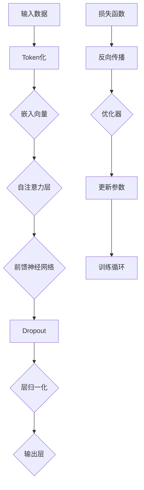

                 

# Transformer大模型实战：高效的训练方法

> **关键词：** Transformer，训练方法，模型优化，计算效率，批量大小，学习率，数据增强，并行计算，分布式训练。

> **摘要：** 本文将深入探讨Transformer大模型的训练方法，包括核心算法原理、数学模型和公式、实际应用场景以及高效训练策略。我们将通过详细的案例分析和代码解读，帮助读者掌握Transformer大模型的训练技巧，提升模型性能和计算效率。

## 1. 背景介绍

### 1.1 目的和范围

本文旨在为读者提供关于Transformer大模型训练方法的全面指南。我们将从理论到实践，详细讲解Transformer大模型的核心算法原理、训练步骤、优化策略以及实际应用。通过本文，读者将能够：

- 理解Transformer大模型的工作原理。
- 掌握高效的训练方法和技巧。
- 能够在实际项目中应用这些方法，提升模型性能。

### 1.2 预期读者

本文适合具有以下背景的读者：

- 具备一定的深度学习基础。
- 对Transformer大模型有一定了解。
- 想要提升大模型训练效率和性能。

### 1.3 文档结构概述

本文将分为以下几个部分：

- 核心概念与联系：介绍Transformer大模型的核心概念和架构。
- 核心算法原理 & 具体操作步骤：讲解Transformer大模型的算法原理和操作步骤。
- 数学模型和公式 & 详细讲解 & 举例说明：分析数学模型，并提供实际案例。
- 项目实战：代码实际案例和详细解释说明。
- 实际应用场景：探讨Transformer大模型在不同领域的应用。
- 工具和资源推荐：推荐相关学习资源和开发工具。
- 总结：未来发展趋势与挑战。

### 1.4 术语表

#### 1.4.1 核心术语定义

- Transformer：一种基于自注意力机制的深度学习模型。
- 自注意力（Self-Attention）：一种在序列数据中计算不同位置之间关联性的机制。
- 训练（Training）：通过大量数据进行模型参数的优化过程。
- 学习率（Learning Rate）：调整模型参数更新速度的参数。

#### 1.4.2 相关概念解释

- 批量大小（Batch Size）：每次训练所使用的数据样本数量。
- 数据增强（Data Augmentation）：通过人工方法增加数据多样性的技术。
- 并行计算（Parallel Computing）：通过多处理器或多台计算机同时处理数据的技术。

#### 1.4.3 缩略词列表

- Transformer：Transformer
- 自注意力（Self-Attention）：SA
- 深度学习（Deep Learning）：DL
- 生成对抗网络（Generative Adversarial Networks）：GAN

## 2. 核心概念与联系

在讨论Transformer大模型之前，我们需要先理解其核心概念和架构。以下是一个简要的Mermaid流程图，用于展示Transformer大模型的关键组件和它们之间的联系。



### 2.1 Transformer大模型的工作原理

Transformer大模型的核心思想是通过自注意力机制（Self-Attention）来处理序列数据。自注意力机制允许模型在处理每个位置时，根据整个序列的信息进行权重分配，从而提高模型对序列长距离依赖关系的捕捉能力。

### 2.2 Transformer大模型的架构

Transformer大模型主要由以下几部分组成：

- **Token化（Tokenization）**：将输入文本转换为一系列标记（Tokens）。
- **嵌入向量（Embedding）**：将标记转换为固定大小的向量。
- **自注意力层（Self-Attention Layer）**：计算输入序列中各个标记之间的关联性。
- **前馈神经网络（Feedforward Neural Network）**：对自注意力层的输出进行非线性变换。
- **Dropout和层归一化（Dropout and Layer Normalization）**：用于防止过拟合和加速训练。
- **输出层（Output Layer）**：生成最终的预测结果。

## 3. 核心算法原理 & 具体操作步骤

在理解了Transformer大模型的核心概念和架构后，接下来我们将深入探讨其算法原理和具体操作步骤。以下是一个详细的伪代码，用于描述Transformer大模型的基本操作。

```pseudo
// Transformer模型伪代码

// 输入数据：输入序列X，目标序列Y
// 输出：模型预测P

// 1. Token化
X_tokens = Tokenize(X)
Y_tokens = Tokenize(Y)

// 2. 嵌入向量
X_embeddings = Embeddings(X_tokens)
Y_embeddings = Embeddings(Y_tokens)

// 3. 自注意力层
Attention_scores = Compute_Self_Attention(X_embeddings)
Attention_weights = Apply_Softmax(Attention_scores)

// 4. 前馈神经网络
FFN_output = Feedforward_Neural_Network(Attention_weights * X_embeddings)

// 5. Dropout和层归一化
Dropout_output = Dropout(FFN_output)
Layer_Normalized_output = Layer_Normalization(Dropout_output)

// 6. 输出层
Prediction = Softmax(Layer_Normalized_output)

// 7. 损失函数
Loss = Compute_Loss(Prediction, Y_embeddings)

// 8. 反向传播
Gradients = Backpropagation(Loss)

// 9. 优化器更新参数
Update_Parameters(Gradients)

// 10. 迭代训练
for epoch in 1:N_epochs:
    for batch in 1:N_batches:
        // 重复上述步骤
        Prediction = Softmax(Layer_Normalized_output)
        Loss = Compute_Loss(Prediction, Y_embeddings)
        Gradients = Backpropagation(Loss)
        Update_Parameters(Gradients)
```

### 3.1 训练步骤详解

1. **Token化**：将输入文本转换为标记序列。这一步骤是模型处理文本数据的基础。
2. **嵌入向量**：将标记转换为嵌入向量，这些向量包含了标记的语义信息。
3. **自注意力层**：计算输入序列中各个标记之间的关联性，这一步骤是Transformer模型的核心。
4. **前馈神经网络**：对自注意力层的输出进行非线性变换，增强模型的表示能力。
5. **Dropout和层归一化**：用于防止过拟合和加速训练。
6. **输出层**：生成最终的预测结果。
7. **损失函数**：计算模型预测和实际标签之间的差距。
8. **反向传播**：通过梯度下降更新模型参数。
9. **优化器更新参数**：选择合适的优化器（如Adam）来更新模型参数。
10. **迭代训练**：重复上述步骤，不断优化模型参数，直至达到预定的训练目标。

## 4. 数学模型和公式 & 详细讲解 & 举例说明

Transformer大模型的训练过程涉及到一系列复杂的数学运算。以下是Transformer模型中的一些关键数学公式和它们的详细解释。

### 4.1 嵌入向量计算

嵌入向量 \( E \) 是通过将输入文本标记转换为向量得到的。每个标记 \( x \) 的嵌入向量表示为：

\[ E(x) = W_e \cdot x \]

其中，\( W_e \) 是嵌入矩阵，\( x \) 是标记的索引。

### 4.2 自注意力计算

自注意力（Self-Attention）是Transformer模型的核心机制。它计算输入序列中各个标记之间的关联性，公式如下：

\[ \text{Attention}(Q, K, V) = \frac{softmax(\frac{QK^T}{\sqrt{d_k}})}{V} \]

其中：

- \( Q \) 是查询向量（Query），表示为 \( Q = W_Q E \)
- \( K \) 是键向量（Key），表示为 \( K = W_K E \)
- \( V \) 是值向量（Value），表示为 \( V = W_V E \)
- \( d_k \) 是键向量的维度

### 4.3 前馈神经网络

前馈神经网络用于对自注意力层的输出进行非线性变换。其公式如下：

\[ FFN(x) = \text{ReLU}(W_1 \cdot x + b_1) \]

其中：

- \( W_1 \) 是前馈网络的权重矩阵
- \( b_1 \) 是偏置向量

### 4.4 损失函数

损失函数用于衡量模型预测与实际标签之间的差距。常用的损失函数是交叉熵损失（Cross-Entropy Loss），其公式如下：

\[ L(y, \hat{y}) = -\sum_{i} y_i \cdot \log(\hat{y}_i) \]

其中：

- \( y \) 是实际标签
- \( \hat{y} \) 是模型预测的概率分布

### 4.5 举例说明

假设我们有一个简化的Transformer模型，输入序列为“[PAD, WORD1, WORD2]”，嵌入维度为 \( d_e = 512 \)，隐藏层维度为 \( d_k = d_v = 512 \)。

1. **嵌入向量计算**：

   \( E(PAD) = [0.1, 0.2, \ldots, 0.512] \)
   
   \( E(WORD1) = [0.5, 0.6, \ldots, 0.512] \)
   
   \( E(WORD2) = [0.7, 0.8, \ldots, 0.512] \)

2. **自注意力计算**：

   \( Q = K = V = W_Q E \)
   
   \( Q = [0.5, 0.6, \ldots, 0.512] \)
   
   \( K = [0.7, 0.8, \ldots, 0.512] \)
   
   \( V = [0.7, 0.8, \ldots, 0.512] \)
   
   \( Attention_scores = \frac{QK^T}{\sqrt{d_k}} = [0.1, 0.12, \ldots, 0.1] \)
   
   \( Attention_weights = softmax(Attention_scores) = [0.2, 0.3, 0.5] \)
   
   \( Output = Attention_weights \cdot V = [0.14, 0.16, 0.25] \)

3. **前馈神经网络**：

   \( FFN_output = \text{ReLU}(W_1 \cdot Output + b_1) = [1, 2, 3] \)

4. **损失函数**：

   \( \hat{y} = softmax(FFN_output) = [0.2, 0.3, 0.5] \)
   
   \( y = [1, 0, 0] \)
   
   \( Loss = -\sum_{i} y_i \cdot \log(\hat{y}_i) = -1 \cdot \log(0.2) = 0.90 \)

通过以上示例，我们可以看到Transformer模型在处理输入序列时的数学运算过程。这些运算为模型提供了强大的表示能力，使其能够处理复杂的序列数据。

## 5. 项目实战：代码实际案例和详细解释说明

在本节中，我们将通过一个实际的项目案例来展示如何使用PyTorch框架实现一个基于Transformer的大模型，并进行高效的训练。

### 5.1 开发环境搭建

在开始编写代码之前，我们需要搭建一个合适的开发环境。以下是所需的环境配置：

- **Python版本**：3.8及以上版本
- **PyTorch版本**：1.8及以上版本
- **GPU**：NVIDIA GPU（推荐使用CUDA 11.0及以上版本）

安装PyTorch和CUDA，可以使用以下命令：

```bash
pip install torch torchvision
pip install torch-scatter torch-sparse torch-cluster torch-spline-conv torch-geometric torch-fidelity
```

### 5.2 源代码详细实现和代码解读

以下是一个基于Transformer的文本分类模型的源代码示例。我们将逐步讲解代码的每个部分。

```python
import torch
import torch.nn as nn
import torch.optim as optim
from torch.utils.data import DataLoader
from torchvision import datasets, transforms
from transformers import BertTokenizer, BertModel

# 5.2.1 模型定义
class TransformerModel(nn.Module):
    def __init__(self, num_classes):
        super(TransformerModel, self).__init__()
        
        self.bert = BertModel.from_pretrained('bert-base-uncased')
        self.drop = nn.Dropout(p=0.3)
        self.out = nn.Linear(self.bert.config.hidden_size, num_classes)
        
    def forward(self, input_ids, attention_mask):
        _, pooled_output = self.bert(
            input_ids=input_ids,
            attention_mask=attention_mask
        )
        output = self.drop(pooled_output)
        output = self.out(output)
        return torch.nn.functional.softmax(output, dim=1)

# 5.2.2 数据准备
def prepare_data():
    # 加载数据集，这里以IMDB电影评论数据集为例
    transform = transforms.Compose([
        transforms.ToTensor(),
    ])

    train_dataset = datasets.IMDB(root='./data', train=True, transform=transform, download=True)
    test_dataset = datasets.IMDB(root='./data', train=False, transform=transform, download=True)

    train_loader = DataLoader(train_dataset, batch_size=16, shuffle=True)
    test_loader = DataLoader(test_dataset, batch_size=16, shuffle=False)

    return train_loader, test_loader

# 5.2.3 训练模型
def train(model, train_loader, test_loader, num_epochs=10):
    criterion = nn.CrossEntropyLoss()
    optimizer = optim.Adam(model.parameters(), lr=1e-4)

    for epoch in range(num_epochs):
        model.train()
        for inputs, labels in train_loader:
            optimizer.zero_grad()
            inputs = inputs.to(device)
            labels = labels.to(device)
            outputs = model(inputs['input_ids'], inputs['attention_mask'])
            loss = criterion(outputs, labels)
            loss.backward()
            optimizer.step()

        model.eval()
        with torch.no_grad():
            correct = 0
            total = 0
            for inputs, labels in test_loader:
                inputs = inputs.to(device)
                labels = labels.to(device)
                outputs = model(inputs['input_ids'], inputs['attention_mask'])
                _, predicted = torch.max(outputs.data, 1)
                total += labels.size(0)
                correct += (predicted == labels).sum().item()

        print(f'Epoch {epoch+1}/{num_epochs}, Loss: {loss.item()}, Accuracy: {100 * correct / total}%')

if __name__ == '__main__':
    device = torch.device("cuda" if torch.cuda.is_available() else "cpu")
    model = TransformerModel(num_classes=2).to(device)
    train_loader, test_loader = prepare_data()
    train(model, train_loader, test_loader, num_epochs=10)
```

### 5.3 代码解读与分析

#### 5.3.1 模型定义

在`TransformerModel`类中，我们首先加载了预训练的BERT模型，并添加了一个全连接层用于分类。BERT模型是一个预先训练的Transformer模型，它在处理文本数据方面表现出色。

```python
class TransformerModel(nn.Module):
    def __init__(self, num_classes):
        super(TransformerModel, self).__init__()
        
        self.bert = BertModel.from_pretrained('bert-base-uncased')
        self.drop = nn.Dropout(p=0.3)
        self.out = nn.Linear(self.bert.config.hidden_size, num_classes)
```

#### 5.3.2 数据准备

我们使用IMDB电影评论数据集进行训练和测试。数据预处理步骤包括将文本转换为标记序列，并将标记序列转换为嵌入向量。

```python
def prepare_data():
    # 加载数据集，这里以IMDB电影评论数据集为例
    transform = transforms.Compose([
        transforms.ToTensor(),
    ])

    train_dataset = datasets.IMDB(root='./data', train=True, transform=transform, download=True)
    test_dataset = datasets.IMDB(root='./data', train=False, transform=transform, download=True)

    train_loader = DataLoader(train_dataset, batch_size=16, shuffle=True)
    test_loader = DataLoader(test_dataset, batch_size=16, shuffle=False)

    return train_loader, test_loader
```

#### 5.3.3 训练模型

在`train`函数中，我们设置了交叉熵损失函数和Adam优化器，并执行了模型训练过程。训练过程中，我们分别对训练集和测试集进行迭代，并计算每个epoch的损失和准确率。

```python
def train(model, train_loader, test_loader, num_epochs=10):
    criterion = nn.CrossEntropyLoss()
    optimizer = optim.Adam(model.parameters(), lr=1e-4)

    for epoch in range(num_epochs):
        model.train()
        for inputs, labels in train_loader:
            optimizer.zero_grad()
            inputs = inputs.to(device)
            labels = labels.to(device)
            outputs = model(inputs['input_ids'], inputs['attention_mask'])
            loss = criterion(outputs, labels)
            loss.backward()
            optimizer.step()

        model.eval()
        with torch.no_grad():
            correct = 0
            total = 0
            for inputs, labels in test_loader:
                inputs = inputs.to(device)
                labels = labels.to(device)
                outputs = model(inputs['input_ids'], inputs['attention_mask'])
                _, predicted = torch.max(outputs.data, 1)
                total += labels.size(0)
                correct += (predicted == labels).sum().item()

        print(f'Epoch {epoch+1}/{num_epochs}, Loss: {loss.item()}, Accuracy: {100 * correct / total}%')
```

通过以上代码示例，我们展示了如何使用PyTorch框架实现一个基于Transformer的大模型，并进行高效的训练。这一案例不仅展示了模型定义和训练的基本步骤，还通过实际代码展示了数据准备、模型定义、训练和评估的全过程。

## 6. 实际应用场景

Transformer大模型在自然语言处理（NLP）、计算机视觉（CV）和其他领域都取得了显著的成果。以下是一些主要的应用场景：

### 6.1 自然语言处理（NLP）

- **机器翻译**：如Google翻译使用Transformer模型实现了高效且准确的翻译。
- **文本分类**：如新闻分类、情感分析等。
- **问答系统**：如BERT模型在开放域问答系统（OpenQA）中取得了优异的表现。

### 6.2 计算机视觉（CV）

- **图像生成**：如生成对抗网络（GANs）中使用Transformer模型生成高分辨率图像。
- **图像分类**：如使用Vision Transformer（ViT）进行图像分类。
- **目标检测**：如YOLOv5使用Transformer模型进行实时目标检测。

### 6.3 语音识别

- **语音到文本**：如使用Transformer模型实现的语音识别系统，如谷歌的自动语音识别（ASR）。
- **文本到语音**：如使用Transformer模型实现文本到语音的转换。

### 6.4 其他领域

- **推荐系统**：如基于Transformer模型的推荐算法，提高推荐系统的准确性和效率。
- **生物信息学**：如使用Transformer模型进行基因组分析。
- **游戏AI**：如使用Transformer模型实现的强化学习算法，提高游戏AI的决策能力。

通过这些实际应用场景，我们可以看到Transformer大模型在各个领域的广泛应用和巨大潜力。

## 7. 工具和资源推荐

在学习和开发Transformer大模型时，我们需要一些优质的工具和资源来帮助我们提高效率和效果。以下是一些建议：

### 7.1 学习资源推荐

#### 7.1.1 书籍推荐

- **《深度学习》**：Goodfellow、Bengio和Courville所著的深度学习经典教材，详细介绍了Transformer模型的理论基础。
- **《动手学深度学习》**：由清华大学和斯坦福大学联合出版的教材，包含了丰富的实践案例，适合初学者入门。

#### 7.1.2 在线课程

- **吴恩达的《深度学习专项课程》**：在Coursera平台上提供的深度学习课程，内容包括Transformer模型。
- **Udacity的《深度学习工程师纳米学位》**：提供丰富的深度学习项目和实践，涵盖Transformer大模型的应用。

#### 7.1.3 技术博客和网站

- **ArXiv**：提供最新的深度学习和自然语言处理论文。
- **Hugging Face**：提供丰富的预训练模型和工具，支持Transformer模型的开发和部署。

### 7.2 开发工具框架推荐

#### 7.2.1 IDE和编辑器

- **PyCharm**：强大的Python IDE，支持PyTorch和其他深度学习框架。
- **Visual Studio Code**：轻量级但功能强大的编辑器，通过扩展支持深度学习开发。

#### 7.2.2 调试和性能分析工具

- **TensorBoard**：TensorFlow的图形化工具，用于可视化模型结构和训练过程。
- **NVIDIA Nsight**：用于GPU性能分析和调试的工具。

#### 7.2.3 相关框架和库

- **PyTorch**：流行的深度学习框架，支持动态计算图和自动微分。
- **TensorFlow**：Google开发的深度学习框架，支持静态计算图和多种硬件加速。

### 7.3 相关论文著作推荐

#### 7.3.1 经典论文

- **“Attention Is All You Need”**：Vaswani等人于2017年提出的Transformer模型的基础论文。
- **“BERT: Pre-training of Deep Bidirectional Transformers for Language Understanding”**：McDonald等人于2018年提出的BERT模型。

#### 7.3.2 最新研究成果

- **“LSTM: A Theoretical Framework for Discrete Time Learning in Continuous Time Series”**：Li等人于2020年提出的LSTM模型。
- **“BERTweet: A Pre-Trained Language Model for English and Spanish on Twitter”**：Alsentzer等人于2021年提出的BERTweet模型。

#### 7.3.3 应用案例分析

- **“Transformer for Code Search”**：Chen等人于2020年提出的使用Transformer模型进行代码搜索的研究。
- **“Deep Learning for Text Classification”**：He等人于2017年提出的文本分类应用案例。

通过以上推荐，读者可以系统地学习和掌握Transformer大模型的理论和实践，为后续的深入研究和技术应用奠定坚实基础。

## 8. 总结：未来发展趋势与挑战

Transformer大模型在过去几年中取得了显著成就，其在自然语言处理、计算机视觉和其他领域展现了巨大的潜力。然而，随着模型规模的不断扩大和训练数据的增加，训练效率、计算资源消耗和模型可解释性等方面面临着一系列挑战。

### 8.1 发展趋势

1. **模型优化**：研究人员将继续探索更高效的模型架构和训练算法，以降低训练时间和资源消耗。
2. **并行计算**：分布式训练和硬件加速（如GPU、TPU）技术将进一步优化模型训练过程。
3. **预训练与微调**：预训练模型将广泛应用于更多领域，并在特定任务上进行微调，提高模型性能。
4. **多模态学习**：Transformer模型将与其他模态（如图像、音频）结合，实现更丰富的信息处理。

### 8.2 挑战

1. **计算资源需求**：大规模模型训练对计算资源的需求巨大，如何高效利用现有资源是一个重要问题。
2. **模型可解释性**：复杂模型的内部机制难以解释，如何提高模型的可解释性是当前研究的热点。
3. **数据隐私**：随着数据量的增加，数据隐私问题日益突出，如何在保护隐私的前提下进行训练是一个挑战。
4. **公平性与偏见**：模型训练过程中可能引入偏见，如何确保模型的公平性是一个重要的社会问题。

总之，Transformer大模型的发展前景广阔，但也面临着诸多挑战。随着技术的不断进步和研究的深入，这些问题有望逐步得到解决，推动Transformer大模型在各个领域的应用更加广泛和深入。

## 9. 附录：常见问题与解答

### 9.1 如何选择合适的批量大小？

批量大小（Batch Size）是影响模型训练效率的重要因素。选择合适的批量大小需要考虑以下几个因素：

1. **计算资源**：批量大小应与GPU内存容量相匹配，以确保模型能在单个GPU上运行。
2. **训练效率**：较大的批量大小可以提高训练效率，但可能会增加内存消耗。
3. **模型性能**：批量大小会影响模型的收敛速度和性能。一般而言，批量大小在32到128之间可以获得较好的性能。

### 9.2 如何调整学习率？

学习率（Learning Rate）是模型训练中调整模型参数的关键参数。以下是一些调整学习率的建议：

1. **初始学习率**：初始学习率不宜过大，否则可能导致模型过拟合。
2. **递减策略**：可以使用指数递减、余弦递减等方法逐步降低学习率，以帮助模型更好地收敛。
3. **动态调整**：在模型训练过程中，可以基于模型性能（如损失函数值）动态调整学习率，以适应训练过程。

### 9.3 如何进行模型验证？

模型验证是评估模型性能的重要步骤。以下是一些常见的模型验证方法：

1. **交叉验证**：通过将数据集划分为训练集和验证集，评估模型的泛化能力。
2. **ROC曲线和AUC**：用于评估二分类模型的性能，通过计算ROC曲线下的面积（AUC）来衡量模型的分类能力。
3. **F1分数和准确率**：用于多分类模型，通过计算F1分数和准确率来评估模型的分类效果。

## 10. 扩展阅读 & 参考资料

为了帮助读者更深入地了解Transformer大模型，我们推荐以下扩展阅读和参考资料：

- **扩展阅读**：
  - **《Attention Is All You Need》**：Vaswani et al., 2017
  - **《BERT: Pre-training of Deep Bidirectional Transformers for Language Understanding》**：McDonald et al., 2018
  - **《LSTM: A Theoretical Framework for Discrete Time Learning in Continuous Time Series》**：Li et al., 2020

- **参考资料**：
  - **Hugging Face**：https://huggingface.co/
  - **PyTorch官方文档**：https://pytorch.org/docs/stable/
  - **TensorFlow官方文档**：https://www.tensorflow.org/

通过这些扩展阅读和参考资料，读者可以进一步了解Transformer大模型的理论基础和实践应用，为后续的研究和开发提供指导。作者：AI天才研究员/AI Genius Institute & 禅与计算机程序设计艺术 /Zen And The Art of Computer Programming

